## 1. Introduction

**Motivation**
- At the heart of Computer Science there are two sometimes conflicting goals:
	1. To design an algorithm that is easy to understand, code, debug - concern of ***Software Engineering***
	2. To design an algorithm that makes efficient use of the computer's resources - concern of ***Data Structures and Algorithm Analysis***
- More powerful computers encourage us to attempt more complex problems
- More complex problems demand more calculations

**Efficiency**
- A solution is **efficient** if it solves the problem with required *space* and *time* constraints
- ***Cost*** is the amount of resources the solution consumes, often measured in terms of **time**

**Data Structure Philosophy**
- Each data structure has costs and benefits, rarely is one data structure better than another in all situations
- Requires:
	- *space* for each data item it stores
	- *time* to perform each basic operation
	- *programming effort*

**Abstract Data Types**
- A *type* is a collection of values
- A *data type*is a **type** together with a collection of **operations** to manipulate the type
- An **Abstract Data Type** (ADT) is:
	- a set of values
	- and a set of operations on the data type
- ***An ADT does not specify how the data type is implemented***
- After implementing an ADT in a program, we think exclusively of the ADT and not on the details of its implementation.

**Data Structure**
- A *data structure* is the implementation of an ADT
	- Each operation associated with ADT is implemented by one or more subroutines in the implementation
- While designing the parts of the program that use an ADT, we should think in terms of operations on the data type, and not its implementation

**Problem**
- A *problem* is a task to be performed
- Some problems can be viewed as functions in the mathematical sense

**Algorithms**
- An *algorithm* is a method to solve a problem
  Takes the input to the problem and transforms it to the output
- A problem can have many algorithms, but a given algorithm solves only one problem
- A *program* is an instance of an algorithm in a specific programming language

**Properties of Algorithms**
- It must be correct
- It must be composed of series of concrete steps
- It must be composed of a finite number of steps
- It must terminate

**Analysis of Algorithms**
- Efficiency: Exactness, time (resources), space (resources)
- Is there a better algorithm (lower/upper bound)

## 2. Asymptotic Analysis

#### Introduction

**Overview**
- The running time of an algorithm typically grows with the input size
- Average case time is often difficult to determine
- The **worst-case** running time is often easier to analyse

**Experimental Approach**
- Write a program implementing the algorithm
- Run the program with varying input sizes and note the time needed, and plot a graph
- Limitations:
	- It is necessary to implement the algorithm, which may be difficult
	- In order to compare algorithms, the same hardware and software environments must be used

**Theoretical**
- Uses high-level description of the algorithm - *pseudocode*
	- More structured than English prose, but less detailed than a program
	- Preferred notation for describing algorithms
	- Hides program design issues
- $T(n)$ is the running time as a function of input size $n$
- Allows us to evaluate the speed of an algorithm independent of the hardware/software environment

#### Complexity Analysis

**Random-Access Machine Model**
- A *RAM* consists of a CPU and potentially unbounded bank of *memory* cells, each of which can hold a value
- ***Memory cells are numbered and accessing any cell in memory takes unit time***

**Running Time**
- $T(n)$ is the number of basic/primitive operations performed by the algorithm
- Running time is $T(n)$ where $n$ is the input size

**Example**

```pseudocode
s = 0
for i = 1 to n
	s = s + 1
```

- We can argue that $T(n) = 1 + 3n$, as variable initialisation takes 1 step, and the loop consists of $n$ lots of 3 operations, namely incrementing $i$, incrementing $s$ and checking $i < n$ on each iteration of the loop

#### Asymptotic Analysis

**Asymptotic Analysis**
- The *asymptotic analysis* of an algorithm determines the running time in:
	- Big O notation - $O$
	- Big Omega notation - $\Omega$
	- Big Theta notation - $\Theta$
	- Little O notation - $o$
	- Little Omega notation - $\omega$
- We find the **worst-case** number of primitive operations executed as a function of the input size
- ***Constant Factors and Lower-Order Terms*** are dropped, so we can disregard them when counting primitive operations

**Big-O Notation**
- $f(n) = O(g(n))$
$$O(g(n)) = \{f(n) : \exists c > 0, n_0 \ge 0 ,\text{ s.t.} f(n) \le cg(n), \forall n \ge n_0\}$$
- This means there is a point $n_0$ where beyond it,  $g(n)$ is greater than $f(n)$ subject to a constant
- We can say $f(n)$ is bounded *from above* by $g(n)$

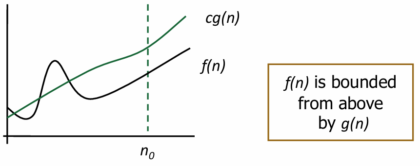

**Big-Omega Notation**
$$f(n) = \Omega(g(n)) \space \text{iff} \space \exists c, n_0 > 0 {s.t.} \forall n \ge n_0, 0 \le cg(n) \le f(n)$$
- We can say $f(n)$ is bounded *from below* by $g(n)$

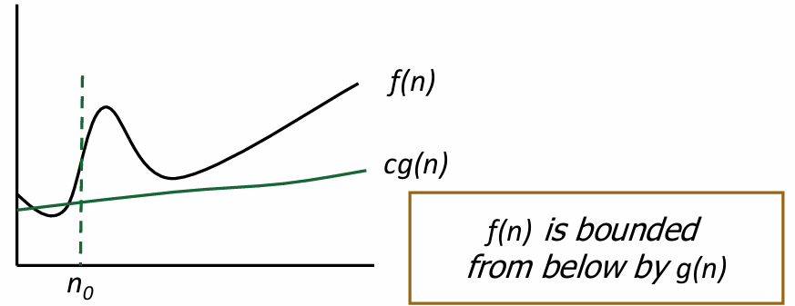

**Big-Theta Notation**
$$f(n) = \Theta(g(n)) \space \text{iff} \space \exists c_1, c_2, n_0 > 0 \space \text{s.t.} \space 0 \le c_1g(n) \le f(n) \le c_2g(n), \forall n \ge n_0$$
- $f(n)$ and $g(n)$ have the same asymptotic growth rate
- This is when we have that $f(n) = O(g(n))$ and $f(n) = \Omega(g(n))$

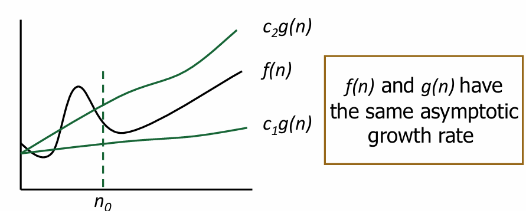

**Example**
- Let $f(n) = 3n^2 + 17$
- $1$, $n\log{n}$, $n$ are all lower-bound functions
- $2^n, n^3$ are all upper bound functions
- $n^2$ is an exact bound (i.e. $f(n) = \Theta(n^2)$)

**Small O and Omega**
- These are strict bounds:
	- $f(n) = o(g(n))$ means that $g(n)$ is strictly greater than $f(n)$, so $f(n)$ and $g(n)$ cannot have the same asymptotic growth rate
	- Similar for small omega $\omega$

**Sum and Product Rule**
$$O(f + g) = \max\{O(f), O(g)\}$$
$$O(f \times g) = O(f) \times O(g)$$
- **NOTE**: These rules only apply for a constant number of additions or multiplications.
- The following statements are wrong:
	- $O(1+...+n) = \max\{O(1),...,O(n)\} = O(n)$
		- The correct answer is $O(n^2)$ as the sum length varies
	- $O(1*...*n) = O(1)*...*O(n) = O(n)$
		- The correct answer is $O(n!)$ as the product length varies

**Typical Growth Rates**

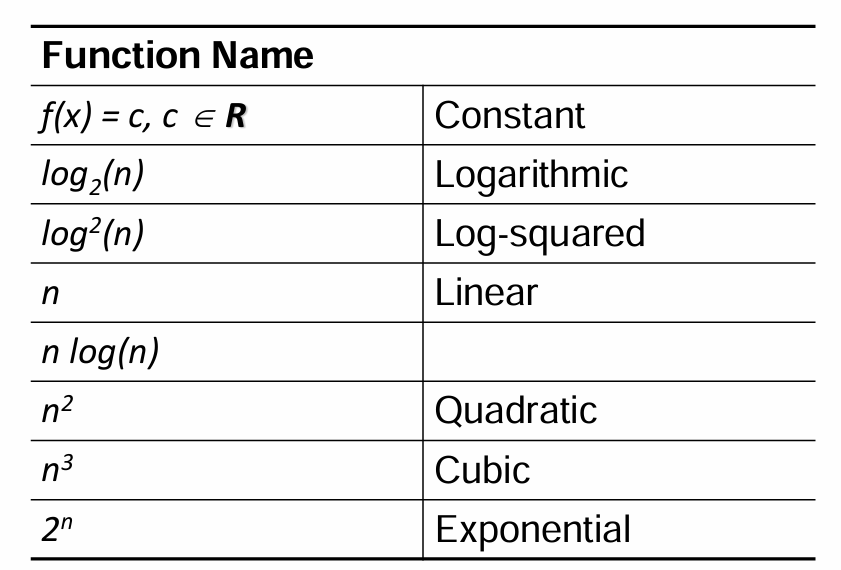

#### Proof, Relative Growth Rates, Complexity Classes

**Prove that $2n+1 = O(n)$
- We have to find a constant $c > 0$ and an integer $n_0$ such that $\forall n \ge n_0, 2n+1 \le cn$
- In other words, $(c-2)n \ge 1$
- Or $n \ge \frac{1}{c-2}$
- So we can choose $c = 3$ and $n_0 = 1$

**Determining Growth Rates**
- Method 1: Compute this limit:
$$\lim_{n\to\infty}(\frac{f(n)}{g(n)})$$
	- This limit has 4 possible values:
		- $0$ - $f(n) = O(g(n))$
		- $c > 0$ - $f(n) = \Theta(g(n))$
		- $\infty$ - $f(n) = \Omega(g(n))$
		- Limit oscillates - there is no relation

- Method 2: Compare the **logarithm** of $f(n)$ and $g(n)$

**Binary Search**

- The most basic binary search is given here:
```pseudocode

left = 0
right = length - 1

while (left <= right):
	mid = (left + right) // 2
	if (target == mid):
		we found it!
	else if (target < mid):
		right = mid - 1
	else:
		left = mid + 1
```

- This code has time complexity $\Theta(\log n)$ where $\log$ always means base 2 logarithm

**Complexity Classes**
- The **Big-O** notation gives an upper bound on the growth rate of a function
- $f(n) = O(g(n))$ means the growth rate of $f(n)$ is no more than the growth rate of $g(n)$

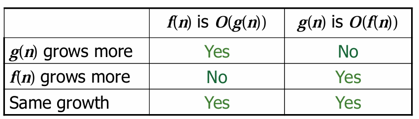

## 3. Arrays

#### Introduction

**Definition**
- An ***array*** is a sequenced collection of variables of the same type
- Each ***cell*** has an ***index*** which uniquely refers to the value stored in the cell.
- An ***element*** of an array is a value stored in the array
- Indices start from $0$ and go to $N-1$ where $N$ is the size of the array

**Access**
- `A[k]` denotes the item in array `A` at index `k`
- Accessing an element in an array takes $O(1)$ time
- We **cannot change** the *length* of an array

**Insertion**
- To add an entry $e$ into array $A$ at index $i$, we need to make room for it by shifting forward the $n-i$ entries `A[i]`, ..., `A[n-1]`
- Cost of insertion of a single element: $T(n) = O(n-i)$

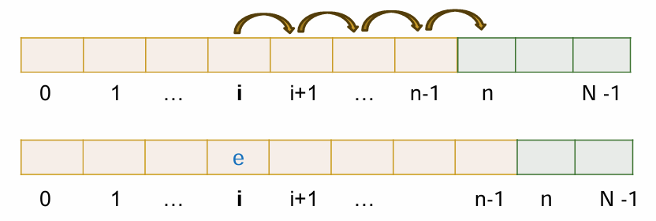

**Deletion**
- To remove an entry $e$ from array $A$ at index $i$, we need to fill the hole left by $e$ by shifting backward the $n-i-1$ entries `A[i+1]`, ..., `A[n-1]`
- Shifting is **necessary** to prevent unusable space in the array from building up
- Cost of deletion of a single element: $T(n) = O(n-i-1)$

#### Example - Insertion Sort

**Insertion Sort**
- A simple sorting algorithm that follows the following steps:
	- Start at the *2nd* element, and compare with first. If not, swap them
	- Now go to *3rd* element and swap with *2nd* if necessary, going all the way down to *1st* unless we find that two adjacent elements are sorted before we get there
	- We continue this until we reach the end of the array
- Example:

| Step | State             | Starting From |
| :--- | ----------------- | ------------- |
| $0$  | $4, 15, 7, 22, 3$ | N/A           |
| $1$  | $4, 15, 7, 22, 3$ | $1$           |
| $2$  | $4, 7, 15, 22, 3$ | $2$           |
| $3$  | $4, 7, 15, 22, 3$ | $3$           |
| $4$  | $4, 7, 15, 3, 22$ | $4$           |
| $5$  | $4, 7, 3, 15, 22$ | $4$           |
| $6$  | $4, 3, 7, 15, 22$ | $4$           |
| $7$  | $3, 4, 7, 15, 22$ | $4$           |

- Below is the **pseudocode** for Insertion Sort in *Ascending Order*
```pseudocode
i = 1
while (i < length(A)):
	j = i
	while j > 0 and A[j-1] > A[j]:
		swap A[j], A[j-1]
		j--
	i++
```

**Complexity Analysis**
- Worst Case: $\Theta(n^2)$
- Best Case: $\Theta(n)$
- Running Time: $O(n^2)$

#### Example - Prefix Average

- The $i$th prefix average of an array $X$ is:
$$A[i] = \frac{X[0] + X[1] + ... + X[i]}{i+1}$$
- A simple algorithm would be to iterate through indices $0$ to $i$ as $i$ ranges from $0$ to $n-1$ and sum them up in the inner loop
	- This has time complexity $O(n^2)$
	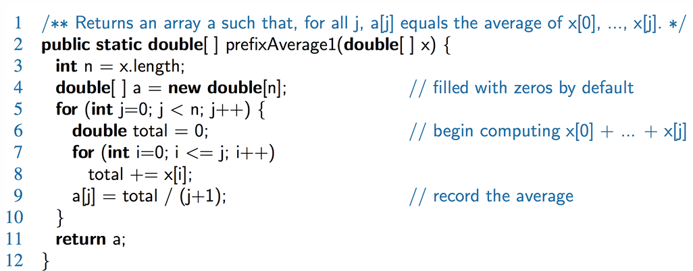

- A better algorithm would be to calculate a prefix sum during one iteration of the loop, and set $A[j] = \text{prefix total} / (j+1)$
	- This has time complexity $O(n)$
	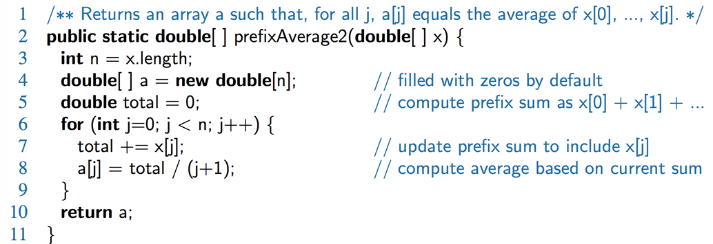

## 4. Lists

#### List ADT

**List Interface**
- `size()` - returns no. of elements in list
- `isEmpty()` - size is 0?
- `get(i)` - gets element at index $i$, errors if $i$ is not in range $[0,\text{size()}-1]$
- `set(i, e)` - replaces element at index $i$ with $e$ and returns old element that was replaced. Errors if $i$ is not in range $[0,\text{size()}-1]$
- `add(i, e)` - Inserts $e$ into list so it has index $i$, moving all subsequent elements one index later. Errors if $i$ is not in range $[0, \text{size()}]$
- `remove(i)` - Removes and returns element at index $i$, moving all subsequent elements one index earlier. Errors if $i$ is not in range $[0, \text{size()}-1]$

### List Operations

**Array Implementation**
- We can use an array $A$ to implement the list ADT, where $A[i]$ stores the element with index $i$
- `get(i)` and `set(i, e)` are easy to implement by accessing $A[i]$

**Addition**
- Shift forward the $n-i$ elements $A[i], ..., A[n-1]$
- In the worst case, this takes $O(n)$ time

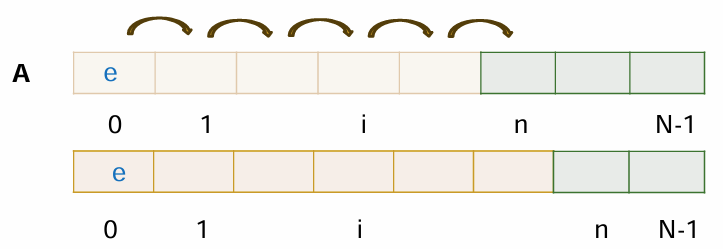

**Removal**
- Fill the hole left by shifting backward the $n-i-1$ elements $A[i+1], ..., A[n-1]$
- In the worst case, this takes $O(n)$ time

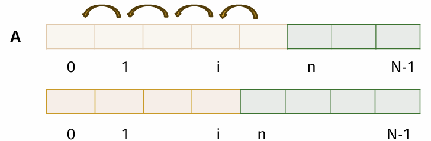

**Space Performance**
- The list uses $O(N)$ space where the size is $N$ and there are $n$ elements

#### Growable Arrays

**Overview**
- When the array is full, the `add` operation throws an exception. We can deal with this case by replacing the array with a larger one
- **Growing Strategies:**
	- *Incremental strategy* - increase the size by a constant $c$
	- *Doubling strategy* - double the size
- Let `push(e)` be the operation that adds element $e$ at the end of the list

**Amortized Time**
- The ***amortized time*** of an operation is the average time taken by that operation over the series of multiple occurrences
- In the case of `push`, if $T(n)$ is the total time to push `n` times, the amortized time is $T(n)/n$

**Incremental Strategy**
- Over $n$ push operations, we replace the array $k = n/c$ times, where $c$ is a constant. Note that $k = O(n)$
- The total time T(n) of a series of $n$ operations is proportional to:
	$$1 + (1+c) + (1+2c) + ... + (1+kc) = n + c\frac{k(k+1)}{2}$$
- Since $c$ is a constant, $T(n) = O(n^2)$, so the amortized time is $O(n)$

**Doubling Strategy**
- We replace the array $k = \log_2{n}$ times
-  The total time $T(n)$ is proportional to:
$$n + 1 + 2 + 4 + ... + 2^k = n + 2^{k+1}-1 = n + 2(2^{\log{n}})-1 = 3n - 1$$
- Hence $T(n)$ is $O(n)$, so the amortized time is $O(1)$

## 5. Sets and Multimaps

#### Set ADT

**Overview**
- A *set* is a collection of ***distinct*** elements
- A *multiset* is a set where the same element appears more than once
- A *multimap* is where the same key can be mapped to multiple values

**Operations**

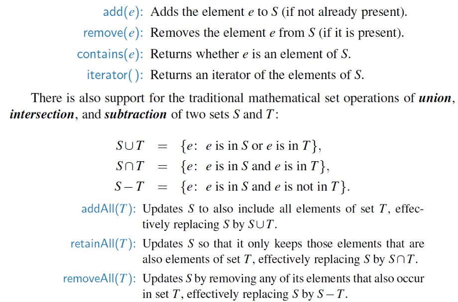

**Storing a Set**
- A *set* can be stored in an array or in a list.
- Elements are stored **sorted** according to some canonical ordering.
- The space used is $O(n)$
- This type of set is called an **Ordered Set** as items are stored in order

#### Generic Merging

**Generic Merging**
- An algorithm to merge two sorted lists $A$ and $B$

```pseudocode
function genericMerge(A, B):
	S = []
	while (not A.isEmpty() and not B.isEmpty())
		a = first element of A
		b = first element of B
		if (a < b):
			aIsLess(a, S)
			A.remove(a)
		else if (b < a):
			bIsLess(b, S)
			B.remove(b)
		else:
			bothAreEqual(a, b, S)
			S.remove(b)
	while (not A.isEmpty()):
		a = first element of A
		aIsLess(a, S)
		A.remove(a)
	while (not B.isEmpty()):
		b = first element of B
		bIsLess(b, S)
		B.remove(b)
	return S
```

**Performance**
- Any of the set operations can be implemented using a generic merge
- For example:
	- **Intersection** - only copy elements that are duplicated in both lists
	- **Union** - copy every element from both lists except for the duplkicates
	- **Subtraction** - only copy element that are not in list $B$
- All methods run in $O(n_A + n_B)$ time

**Example - Union**

- $A = [3,5,6], B = [2,5,10,15]$
- $a$, $b$ are pointers

| $a$ | $b$ | $A \cup B$        |
| :-- | --- | ----------------- |
| $0$ | $0$ | $[]$              |
| $0$ | $1$ | $[2]$             |
| $1$ | $1$ | $[2,3]$           |
| $2$ | $2$ | $[2,3,5]$         |
| $3$ | $2$ | $[2,3,5,6]$       |
| $3$ | $3$ | $[2,3,5,6,10]$    |
| $3$ | $4$ | $[2,3,5,6,10,15]$ |

**Example - Subtraction**

- $A = [3,5,6], B = [2,5,10,15]$
- $a$, $b$ are pointers

| $a$ | $b$ | $A\setminus B$ |
| :-- | --- | -------------- |
| $0$ | $0$ | $[]$           |
| $0$ | $1$ | $[]$           |
| $1$ | $1$ | $[3]$          |
| $2$ | $2$ | $[3]$          |
| $3$ | $2$ | $[3,6]$        |
| $3$ | $3$ | $[3,6]$        |
| $3$ | $4$ | $[3,6]$        |
#### Multimaps

**Overview**
- A **multimap** is similar to a map, except that it can store multiple entries with the same key
- We can implemnt a multimap $M$ by means of a map $M'$
	- For every key $k \in M$, let $E(k)$ be the list of entries of $m$ with key $k$
	- The entries of $M'$ are the pairs $(k, E(k))$

**Operations**

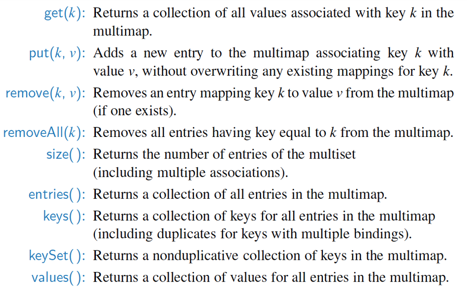

## 6. Linked Lists

#### Singly Linked Lists

**Overview**
- A singly **linked list** is a concrete data structure consisting of a sequence of nodes, starting from a **head** pointer
- Each node stores:
	- An element
	- A link to the next node

**Insertion**
- More than one possible solutions exist:
	- *Beginning*
	- *End*
	- *Elsewhere?*

- **Beginning of List**
	- Make an new node, and point to the old head. Then set the head to the new node

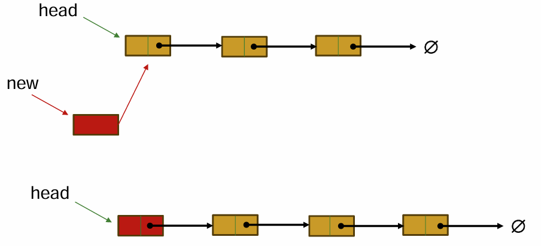

- **End of List**
	- We will need to store the **tail** pointer for efficiency
	- Make a new node, make the old tail pointer point to it. Then make the new tail the new node

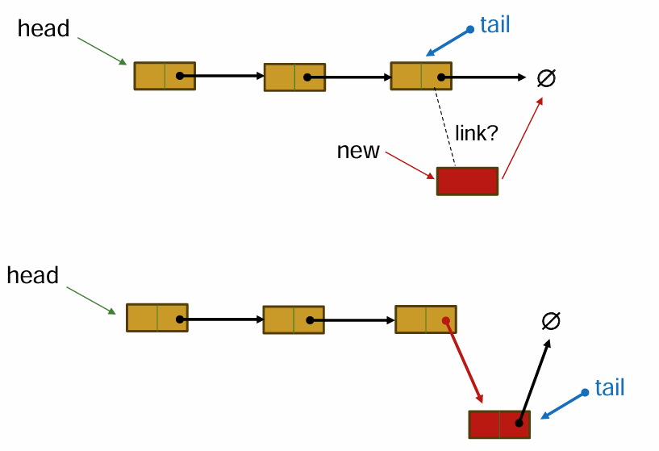

- Time complexity: $O(1)$ for both insertion at beginning and end of list

**Deletion**
- More than one possible solutions exist:
	- *First node*
	- *Last node*
	- *Search for an element and delete node*

- **General Case:**
	- Maintain a **temp** pointer and a **next** pointer.
	- If **next** pointer points to the value you want, you skip over the element by doing `temp.next = temp.next.next`
	- Make sure to update **temp** and **next** on each iteration

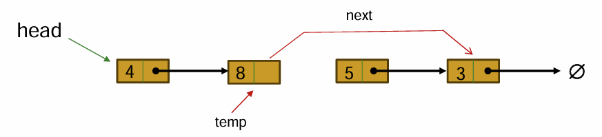

- Time Complexity: $O(n)$, even for the last element. This is because we do not have access to the link **to** the last element, so we have to traverse the whole linked list

#### Doubly Linked Lists

**Overview**
- A doubly linked list can be traversed forward and backward
- Nodes store:
	- *element*
	- *link to previous node*
	- *link to next node*
- There are **special trailer and header nodes**

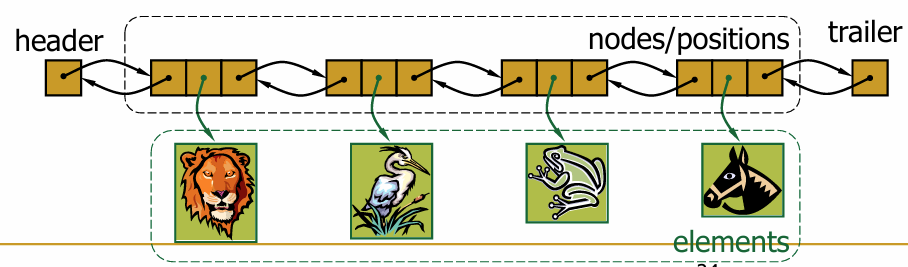

**Insertion between $p$ and its successor**
- Assuming we have access to node *p*:
	- Store `tmp = p.next` somewhere
	- Make a new node $q$ , and set `p.next` to this new node. Make sure to set `q.prev` to $p$.
	- Then set `q.next` to `tmp`, and do `tmp.prev = q`

**Deletion**
- Use the same strategy for deletion in linked list, but make sure to update the **previous** pointer as well

## 7. Recursion

#### Recursion

**Overview**
- Recursion consists of:
	- ***Base cases***
		- **Base case** - values of the input variables for which we perform no recursive calls
		- Every possible chain of recursive calls **must** reach a base case
		- There should be at least one base case
	- ***Recursive calls***
		- Calls to the current method
		- Each recursive call should be defined so it makes progress towards a base case

**Example - Factorial**
$$f(n) = \begin{cases}1 & \text{if} \space n=0 \\ n\cdot f(n-1) & \text{else}\end{cases}$$
- We can define this using **linear recursion** where we return $1$ if $n = 0$, and return `n * f(n-1)` otherwise

#### English Ruler

**Overview**
- Print the ticks and numbers like an English Rule
- `drawInternal(length)` takes the length of a *tick* and draws a ruler with tick of given length in middle and smaller rulers on either side

```pseudocode
function drawInterval(length):
	if (length > 0) then
		drawInterval(length - 1)
		draw line of given length
		drawInterval(length - 1)
```

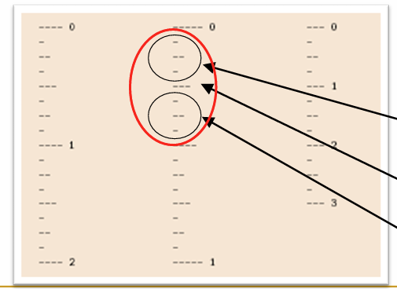

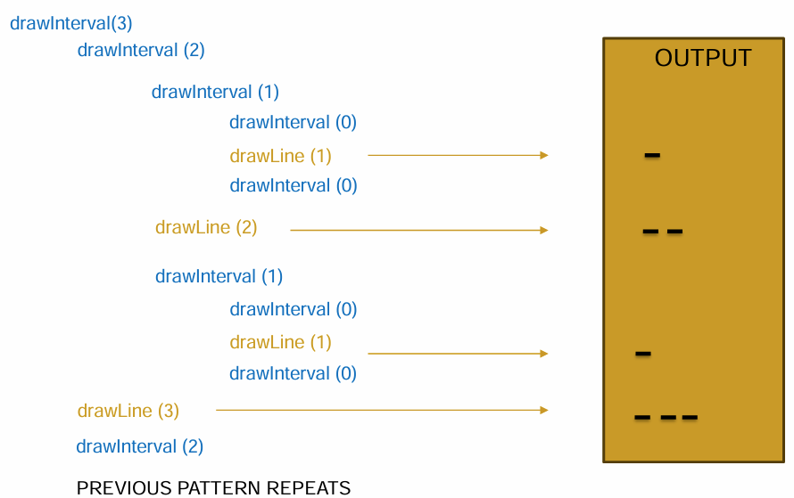

#### Binary Search - Recursive

- Search for an integer in an ordered list
- Each recursive call divides the search region in half
- We consider three cases:
	- `target == data[mid]`, we have found the target
	- `target < data[mid]`, we recur on the first half of the sequence
	- `target > data[mid]`, we recur on the second half of the sequence
- The time complexity is $O(\log{n})$ from Lecture 3

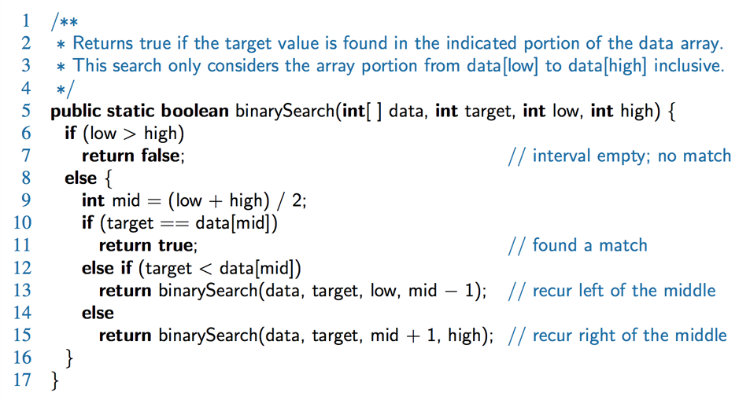

#### Reversing an Array

- `reverseArray(A, i, j)` takes an array $A$ and non-negative integer indices $i$, $j$, and returns the reversal of the elements in $A$ starting at index $i$ and ending at $j$
- Use an extra index $j$ to facilitate the recursion
- Time complexity: $\Theta(n)$

```pseudocode
function reverseArray(A, i, j):
		if (i < j) then
			swap A[i], A[j]
			reverseArray(A, i+1, j-1)
		return
```

#### Tail Recursion

- ***Tail recursion*** occurs when a linearly recursive method makes its recursive call as its last step
- This can be easily converted to an **iterative** solution

```pseudocode
function iterativeReverseArray(A, i, j):
	while (i < j) do
		swap A[i], A[j]
		i++
		j--
	return
```

#### Computing Powers

**Method 1**
- The power function, $p(x, n) = x^n$ can be defined using linear recursion:
$$p(x, n) = \begin{cases} 1 & \text{if} \space n=0 \\ x \times p(x,n -1) & \text{else}\end{cases}$$
- This leads to a power function that runs in $O(n)$ time

**Method 2**
- We can derive a more efficient linearly recursive algorithm using repeated squaring
$$p(x, n) = \begin{cases}1 & \text{if} \space n = 0 \\ x \cdot p(x, \frac{n-1}{2})^2 & \text{if} \space n > 0 \space \text{is odd} \\ p(x, \frac{n}{2})^2 & \text{if} \space n > 0 \space \text{is even}\end{cases}$$
```pseudocode
function Power(x, n)
	if n == 0 then
		return 1
	if n is odd then
		y = Power(x, (n - 1) / 2)
		return x * y * y
	else
		y = Power(x, n / 2)
		return y * y
```

- The running time of this algorithm is $O(\log n)$

#### Binary Recursion - Fibonacci Numbers

**Recursive Algorithm**
- Fibonacci numbers are defined recursively:
	- $F_0 = 0$
	- $F_1 = 1$
	- $F_i = F_{i-1} + F_{i-2}$ for $i > 1$

```pseudocode
function BinaryFib(k):
	if k == 1 then
		return k
	else
		return BinaryFib(k-1) + BinaryFib(k-2)
```

- This results in a tree of recursive calls, which is exponential runtime $O(2^n)$

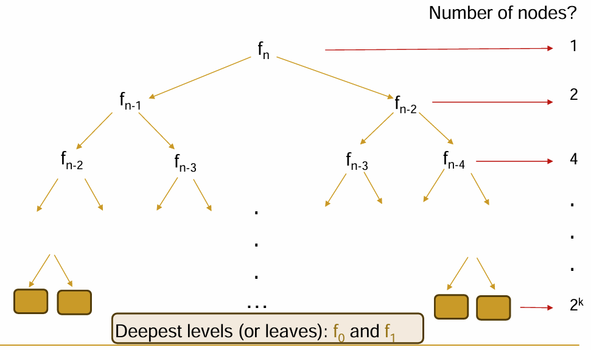

**Linear Algorithm**
- Linear recursion can be used instead, which makes $n-1$ recursive calls
```pseudocode
function LinearFibonacci(n):
	if n == 1 then
		return (n, 0)
	else
		(i, j) = LinearFibonacci(n-1)
		return (i+j, i)
```
- This has linear time complexity $O(n)$

#### Towers of Hanoi

- **Aim:** Move $n$ disks from tower A to B, using tower C as intermediate
- If $n > 1$, split the original problem into subproblems and solve them sequentially
	1. Move $n-1$ disks from $A$ to $C$ (with assistance of $B$)
	2. Move disk $n$ from $A$ to $B$
	3. Move $n-1$ disks from $C$ to $B$
- The running time is exponential $O(2^n)$

#### Fractals

- A fractal is a geometric figure that can be divided into parts, each of which is a reduced-size copy of the whole
- Common fractals:
	- Mandelbrot Set
	- Sierpinsky triangle
	- Koch snowflake

## 8. Stacks

#### Stack ADT

**Overview**
- The **Stack ADT** stores arbitrary objects, *Insertions* and *Deletions* follow the LIFO (last in first out) scheme
- Stack Operations:
	- `push(object)` - inserts an element
	- `object pop()` - removes and returns the last inserted element
	- `object top()` - returns the last inserted element without removing it
	- `integer size()` - returns the number of elements stored
	- `boolean isEmpty()` - indicates whether no elements are stored
- In our **Stack ADT**, *null* is returned when the stack is empty. In `java`, `pop` and `peek` throw a custom `EmptyStackException` when the stack is empty

#### Array-based Stack

**Operation**
- Add elements from left to right
- A **top pointer** keeps track of the index of the top element

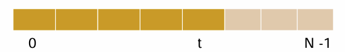

**Limitation**
- The array storing the stack elements may become full
- A `push` operation will then throw a `FullStackException`, not intrinsic to the Stack ADT

**Performance**
- The space used is $O(N)$ where $N$ is the size of the stack and $n$ is the number of elements on the stack.
- Each operation runs in time $O(1)$

#### Linked List Stack

**Operation**
- A Stack can be implemented using a Singly-Linked list
- There are two ways of doing this:
	- Placing `top` at the tail of the stack
		- Difficult as `pop` requires moving tail to the previous node, would be $O(n)$ pop.
	- Placing `top` at the head of the stack
		- Suitable as we can move the *head* pointer very easily to `pop`

**Performance**
- No capacity limit
- Space used is $O(n)$
- Each operation runs in $O(1)$

**Limitations**
- For each element, we need extra space to store a reference to the next node

#### Applications of Stacks

**Applications of Stacks**
- Page-visited history in a web browser
- Undo sequence in a text editor
- Chain of method calls in the Java Virtual Machine
- Auxiliary data structure for algorithms
- Parentheses matching using a stack
- HTML tags matching using a stack
- Evaluating arithmetic expressions

**Function Stack in the JVM**
- When a method is called, the JVM pushes on a stack frame containing:
	- Local variables and return value
	- Program counter, keeping track of the statement being executed
- When a method ends, its frame is popped from the stack and control is passed to the method on top of the stack
- Allows for **recursion**

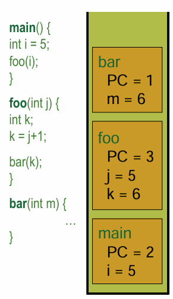

**Evaluating Arithmetic Expressions**
- Push each operator on the stack, but first pop and perform higher and equal precedence operations
- Two stacks are required:
	- One for the operators, one for the values
	- Use # as a end of input token with lowest precedence
- For example, evaluate $12 - 3 * 5 + 2$

| Token | Operand Stack | Operator Stack |
| :---- | ------------- | -------------- |
| N/A   | $[]$          | $[]$           |
| $12$  | $[12]$        | $[]$           |
| $-$   | $[12]$        | $[-]$          |
| $3$   | $[12, 3]$     | $[-]$          |
| $*$   | $[12,3]$      | $[-,*]$        |
| $5$   | $[12,3,5$]    | $[-,*]$        |
| $+$   | $[12,15]$     | $[-]$          |
| $+$   | $[-3]$        | $[+]$          |
| $2$   | $[-1]$        | $[]$           |

## 9. Queues

#### Queue ADT

**Overview**
- The *queue* ADT stores arbitrary objects, insertions and deletions follow the FIFO scheme (first in first out)
- Insertions are at the rear of the queue and removals are at the front of the queue
- **Queue operations:**
	- `enqueue(object)` - inserts an element at the end of the queue
	- `object dequeue()` - removes and returns the element at the front of the queue
	- `object first()` - returns the element at the front without removing it
	- `integer size()` - returns the number of elements stored
	- `boolean isEmpty()` - indicates whether no elements are stored
- **Boundary Cases**
	- Attempting the execution of dequeue or first on an empty queue returns `null`

**Applications of Queues**
- Direct applications
	- Waiting in line
	- Access to shared resources (e.g. printer)
- Indirect applications
	- Auxiliary data structure for algorithms
	- Component of other data structures

**Queue Interface in Java**
- When a queue is empty, the `remove()` and `element()` methods throw a `NoSuchElementException`, while the corresponding methods `poll()` and `peek()` return null
- For implementations with a bounded capacity, the `add()` method will throw an `IlleaglStateException` when full

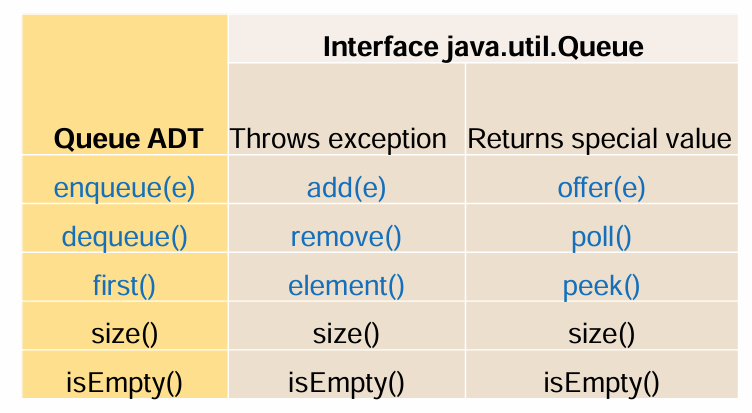

#### Array-Based Queue

**Removing an Element**
- **Method 1:**
	- From front of queue, by shifting all remaining elements forward
	- Time complexity - $O(n)$ where the array has size $N$ and contains $n$ elements
- **Method 2:**
	- Increment front
	- Time complexity - $O(1)$
	- ***Limitation*** - *there will be no more space at the end of the array, but a lot of available space at the beginning of the array*
	- Solution - **Use a circular array**

**Circular Queue**
- Can be done using the modulo operator
- `rear = (rear + 1) % N` where $N$ is the size of the array
- Note that $f$ and `rear` move to the right
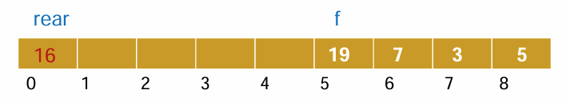
- Same logic applies when calling `dequeue()`
	- `f = (f + 1) % N`

**Rear Index**
- Rear index is actually unnecessary, because we have the method `size()` which returns the number of elements in the queue
- Insertion takes place at position `pos = (f + sz) % N` where `sz` is the size of the queue

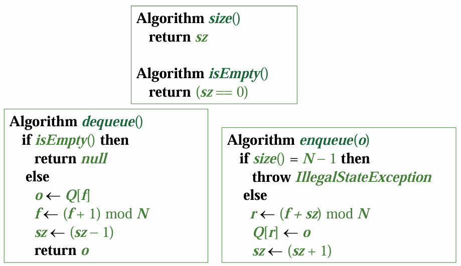

**Performance**
- Cost of all basic operations is $O(1)$ assuming we use Method 2 for an array-based implementation
- Cost remains constant when implementing a queue using a Linked-List
	- ***Advantage:*** no limit on capacity of queue
	- ***Drawback:*** cost of creating a new node and pointer is higher than performing a modular arithmetic operation

#### Linked-List Queue

- Use a Singly-Linked list to implement, all queue operations are done at the front and end of the queue
- Method 1: `tail` is at the head of the linked list
	- Inefficient as `dequeue` from the front now requires $O(n)$ time as we need to access the item before the front node
	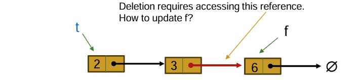
- Method 2: `tail` is the last node of the linked list
	- Efficient as `front` is at the head of the queue, so dequeuing is trivial.
	- Time complexity: $O(1)$
	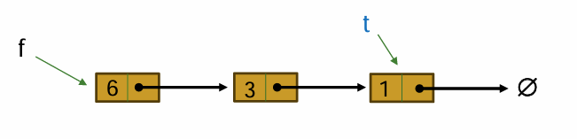
- Hence, if using Method 2, the cost of all basic operations is $O(1)$

## 10. Sorting

#### Insertion Sort

- Described earlier in Lecture 4
- Sorting $n$ elements requires:
	- $\Theta(n)$ in the best-case scenario
	- $\Theta(n^2)$ in the worst-case scenario

#### Selection Sort

**Overview**
- Given a list of $n$ elements, find the smallest one and swap it with the first of the array
- Then find the second smallest and so on and so forth

**Example - Sort $4, 15, 7, 22, 3$**

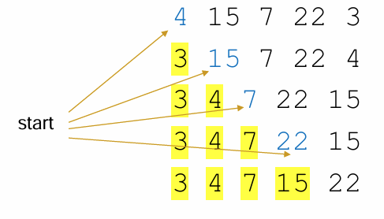

- Note: after iteration $k$, the first $k$ elements are sorted
- Worst-case time complexity: $O(n^2)$

#### Sorting Algorithms - Lower Bounds

**Theorem 1** - Any sorting algorithm that exchanges adjacent elements requires $\Omega(n^2)$ average time

**Theorem 2** - No sorting algorithm based on key comparisons can possibly be faster than $\Omega(n\log n)$

#### Divide and Conquer

- ***Divide and Conquer*** is a general algorithm design paradigm:
	- **Divide** - Divide the input data $S$ into two independent subproblems $S_1$, $S_2$.
	- **Recursive** - solve the subproblems $S_1$ and $S_2$
	- **Conquer** - combine the solutions for $S_1$ and $S_2$ into a solution for $S$
- Base case for recursion are subproblems of size 0 or 1

#### Merge Sort

**Overview**
- Merge sort consists of three steps:
	1. Partition $S$ into two sequences $S_1$ and $S_2$ of about $\frac{n}{2}$ elements each
	2. Recursively sort $S_1$ and $S_2$
	3. Merge $S_1$ and $S_2$ into a unique sorted sequence
- **Conquer** step consists of merging two sorted sequences $A$, $B$ into a sorted sequence $S$ containing the union of the elements of $A$ and $B$.
- When $A$, $B$ each contain $\frac{n}{2}$ elements, this can be done in $O(n)$ time.

**Algorithm**

```pseudocode
function mergeSort(S):
	if S.size() > 1:
		(S1, S2) = partition(S, n/2)
		mergeSort(S1)
		mergeSort(S2)
		S = merge(S1, S2)
	return S

 function merge(A, B):
	 S = []
	 while (not A.isEmpty() and not B.isEmpty()):
		if (A.first().element() < B.first().element()):
			 S.addLast(A.remove(A.first()))
		else:
			S.addLast(B.remove(B.first()))
	while (not A.isEmpty()):
		S.addLast(A.remove(A.first()))
	while (not B.isEmpty()):
		S.addlast(B.remove(B.first()))
	return S
```

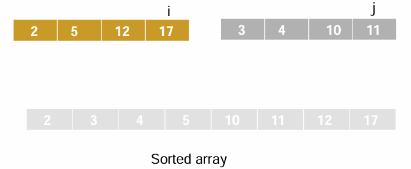
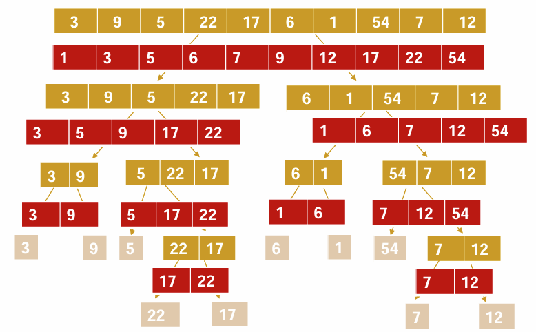

**Running Time**
- The height $h$ of the merge-sort tree is $O(\log n)$, as at each recursive call, we divide the sequence in 2
- The overall amount of work at the nodes of depth $i$ is $O(n)$
	- We partition and merge $2^i$ sequences of size $\frac{n}{2^i}$
	- we make $2^{i+1}$ recursive calls
- Overall running time is $O(n \log n)$

#### Recurrence Equation Analysis

**Recurrence Equation Analysis - Merge Sort**
- The running time $T(n)$ is equal to twice the running time of two subproblems of size $n/2$, where merging them takes linear time
$$T(n) = \begin{cases} b & \text{if} \space n < 2 \\ 2T(n/2) + bn & \text{if} \space n \ge 2\end{cases}$$
- Using the iterative substitution technique we can try to find a pattern

	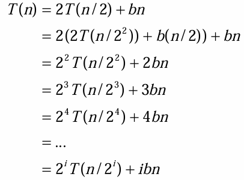

- Note that $2^i = n$, so $i = \log n$
- Hence $T(n) = bn + bn\log n = O(n \log n )$

**Master Method**
- Many divide-and-conquer recurrence equations have the form:
$$T(n) = \begin{cases} c & \text{if} \space n < d \\ aT(n/b) + f(n) & \text{if} \space n \ge d\end{cases}$$
- $c$ is the base case, $aT(n/b)$ is the recursion, and $f(n)$ is the conquer

- **Master Theorem**
	1. If $f(n) = O(n^{\log_b{a-\epsilon}})$, then $T(n) = \Theta(n^{\log_b{a}})$
	2. If $f(n) = \Theta(n^{\log_b{a}}\log^k n)$, then $T(n) = \Theta(n^{\log_b a}\log^{k+1} n)$
	3. If $f(n) = \Omega(n^{\log_b{a+\epsilon}})$, then $T(n) = $\Theta(f(n))$ provided $af(n/b) \le \delta f(n)$ for some $\delta < 1$

#### Quick Sort

**Overview**
- A sorting algorithm that uses a divide-and-conquer strategy:
	- Given an array $A$, we:
	1. **Divide** $A$ into two subarrays $L$ and $R$ around an element $q$ called the ***pivot***, where each element in $L$ is less than or equal to $q$, and each element in $R$ is greater than $q$
	2. **Conquer** the problem by recursively sorting the $L$ and $R$ subarrays

```pseudocode
function QUICKSORT(A, start, end):
	if (start < end):
		positionPivot = PARTITION(A, start, end)
		QUICKSORT(A, start, positionPivot - 1)
		QUICKSORT(A, positionPivot + 1, end)
```

**Pivot Selection Strategies**
1. ***Pick the first element in $A$*** - may lead to the worst-case scenario
2. ***Randomly select the pivot*** - generating a random number is a costly operation
3. ***Median-of-three strategy*** - median of first, last and middle value of $A$

**Partitioning Algorithm**
1. Swap the pivot with the last element in the array
2. Initialise pointers $i = 0$ and $j = n - 1$
3. Whilst the pointers do not cross, move $i$ until $A[i] \ge p$, and move $j$ until $A[j] \le p$. If $i < j$, then we swap values at pointers $i$, $j$. Continue until pointers meet.
4. Swap back the pivot with the left pointer $i$

```pseudocode
function PARTITION():

	pi, p = PIVOT(A, start, end)
	i = start, j = end - 1

	// swap pivot to the end
	SWAP(A, pi, end)
	
	while i <= j:
		while i <= j and A[i] < p:
			i++
		while i <= j and A[j] > p:
			j--
		if (i >= j) break
		SWAP(A, i, j)
		i++
		j--

	// swap pivot back
	SWAP(A, left, end)
	return i
```

**Example - Partitioning Algorithm**

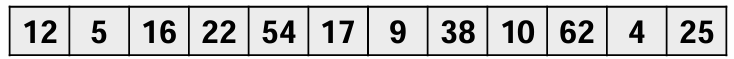
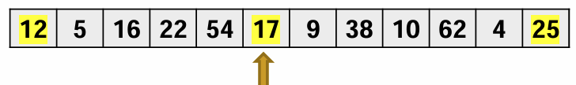
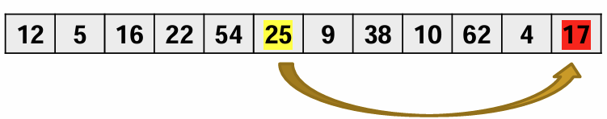
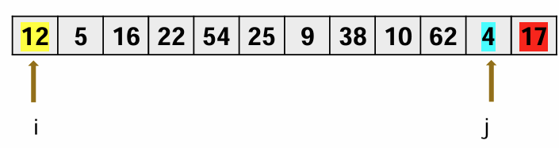
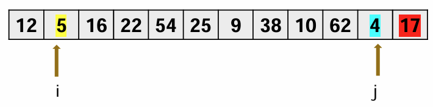
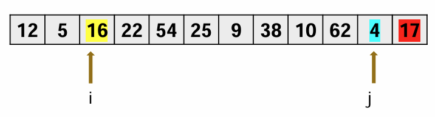
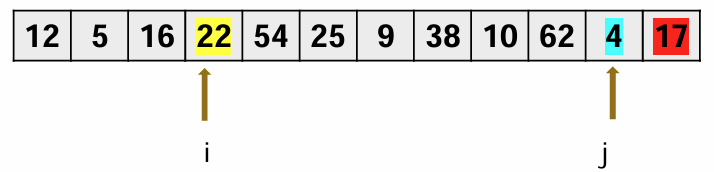
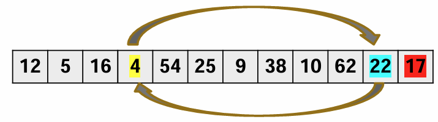

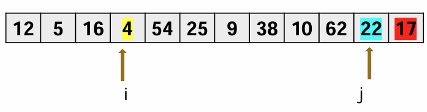
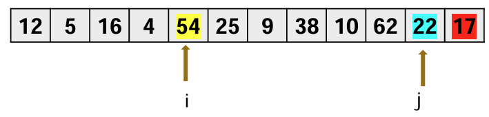
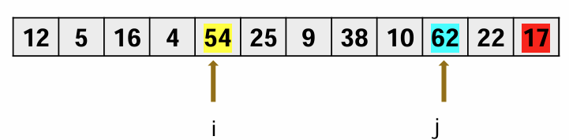
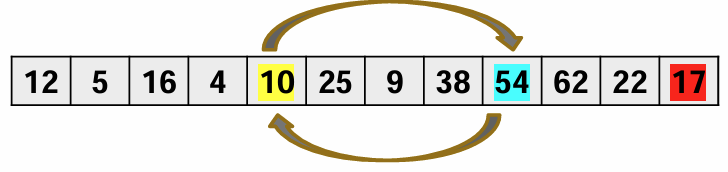
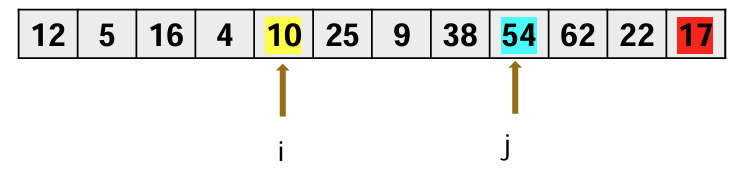
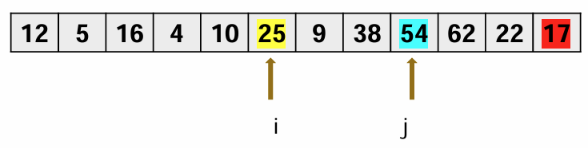
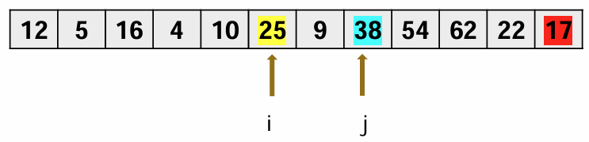
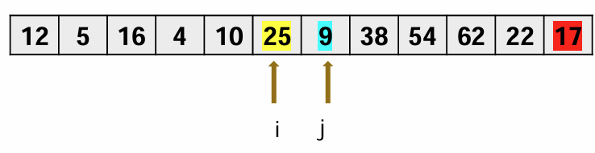
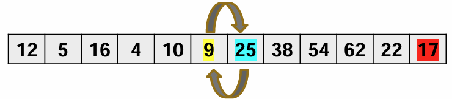
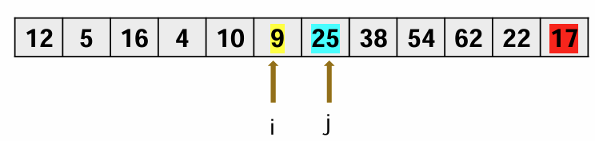
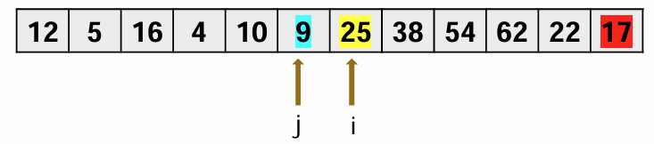
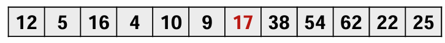

**Running Time Analysis**
- **Best Case:**
	- The `Partition` routine divides each array into two subarrays of equal size
	- Since `Partition` takes linear time, we get:
	$$T(n) = 2T(\frac{n}{2}) + cn$$
	- By the **Master's Theorem**, we get $T(n) = \Theta(n\log n)$
- **Worst Case:**
	- The `Partition` routine divides each array of size $n$ into a subarray of size $n-1$ and another one with $0$ elements
	- In this case, we get:
	$$T(n) = T(n-1) + cn$$
	- Hence $T(n) = \Theta(n^2)$
- **Average Case**:
	- We assume that each of the subarrays' sizes are equally likely with probability $\frac{1}{n}$
	$$T(n) = \frac{1}{n}\sum_{i=0}^{n-1}[T(i) + T(n-1-i)] + cn$$
	$$T(n) = \frac{2}{n}\sum_{i=0}^{n-1}[T(i)] + cn
$$
$$T(n) = \Theta(n \log n)$$

- **Java Implementation**

```java
public class QuickSort {

    private static int medianOfThree(int[] arr, int i, int j, int k) {
        int a = arr[i];
        int b = arr[j];
        int c = arr[k];
        if ((a <= b && b <= c) || (c <= b && b <= a)) {
            return j;
        } else if ((b <= a && a <= c) || (c <= a && a <= b)) {
            return i;
        } else {
            return k;
        }
    }

    private static int pivot(int[] arr, int start, int end) {
        int mid = start + (end - start) / 2;
        return medianOfThree(arr, start, end, mid);
    }

    private static void swap(int[] arr, int i, int j) {
        int tmp = arr[i];
        arr[i] = arr[j];
        arr[j] = tmp;
    }

    private static int partition(int arr[], int start, int end) {

        int pivotIndex = pivot(arr, start, end);
        int pivot = arr[pivotIndex];
        swap(arr, pivotIndex, end);
        int i = start;
        int j = end - 1;


        while (i <= j) {
            while (i <= j && arr[i] < pivot) i++;
            while (i <= j && arr[j] > pivot) j--;

            if (i >= j) break;

            swap(arr, i, j);
            i++;
            j--;
        }

        swap(arr, i, end);
        return i;
    }

    private static void quickSort(int arr[], int start, int end) {
        if (start < end) {
            int positionPivot = partition(arr, start, end);
            quickSort(arr, start, positionPivot - 1);
            quickSort(arr, positionPivot + 1, end);
        }
    }
}

```

#### Summary of Sorting Algorithms

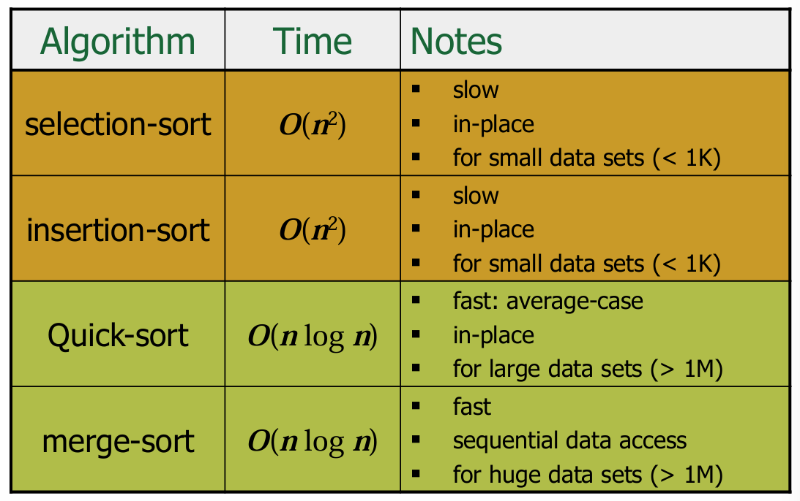

#### Bucket Sort

**Overview**
- When we have a set $S$ of $n$ entries to sort, according to their keys
- An array $B$ (buckets) of size $m$
- An entry of key $k$ is placed in bucket $k$
- This is a non-comparison based algorithm - ***LINEAR TIME***

**Algorithm**

```pseudocode
function bucketSort(S)
	for each entry e in S whose key is k:
		remove e and insert it at the end of bucket B[k]
	for i = 0 to m-1:
		for each entry e in B[i]:
			remove(e) and insert it at the end of S
```

- NOTE: We manipulate entries following a FIFO order

**Running Time**
- The running time is $O(n+m)$ where $n$ is the number of items, $m$ is the number of buckets

#### Stable Sorting

**Stable Sorting**
- ***Stable Sorting*** preserves the order of key-value pairs (i.e. entries) we wish to sort
- Let $(k_i, v_i)$ and $(k_j, v_j)$ be two elements of $S$ where:
	- $i < j$ and $k_i = k_j$
- A stable algorithm will output $(k_i, v_i)$ before $(k_j, v_j)$

**Common Stable Sorting Algorithms**
- *Bubble sort*
- *Insertion sort*
- *Merge sort*
- *Counting sort*
- *Radix sort*

**Common Unstable Sorting Algorithms
- *Selection Sort*
- *Quick Sort*
- *Heap Sort*

#### Radix Sort

**Overview**
- **Stable Sorting** allows the bucket-sort approach to be applied to more general contexts such as *integers* and *words* in lexicographical order
- **Radix** sort sorts a sequence of entries with **keys** by applying a ***Stable Bucket-Sort Approach***
- **LSD (Least Significant Digit)** radix sort processes integer representations from least significant digit

**Example**
- Keys are in the range $0$ to $99$, there are $10$ buckets, and $12$ records
- Start by assigning records to bins based on *right most digit* of key
- Then we reassign these records to the bins on the basis of their *leftmost digit*

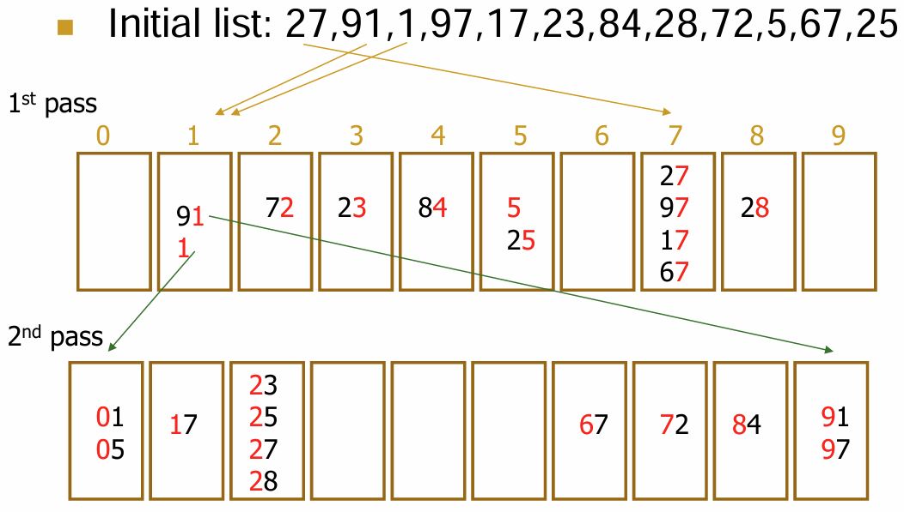

**Running Time**
- depends on the number of digits of the keys
- $T(n) = O(d \times n)$

## 11. Priority Queues

#### Priority Queue ADT

**Overview**
- A *priority queue* stores a collection of entries
- Each *entry* is a pair `(key, value)`
	- The **key** is the priority associated to a value
	- We assume the highest priority for an element is $1$
- **Interface:**
	- `insert(k, v)` - inserts an entry with key $k$ and value $v$
	- `removeMin()` - removes and returns the entry with smallest key, or null if the priority queue is empty
	- `min()` - returns but does not remove the entry with the smallest key, or null if the priority queue is empty
	- `size()` - returns the number of entries in the priority queue
	- `isEmpty()` - returns true if the priority queue is empty
- ***We assume that an element's key remains fixed once it is added to the priority queue***

#### Comparator ADT

**Total Order Relation**
- A comparison rule must define a *total order relation* $\le$
	- Comparability: either $x \le y$ or $y \le x$
	- Antisymmetric: $x \le y \land y \le x \implies x = y$
	- Transitive: $x \le y \land y \le z \implies x \le z$

**Comparator ADT**
- A *generic* priority queue uses an auxiliary comparator, which encapsulates the action of comparing two objects according to a total order relation
- Java supports two means for defining comparators:
	- `java.lang.Comparable` - defines the natural ordering
	- `java.util.Comparator` - supports generality
- ***Comparator ADT*** has a method `compare(x,y)` which returns an integer $i$ such that:
	- $i < 0$ if $a < b$
	- $i = 0$ if $a = b$
	- $i > 0$ if $a > b$
- `java.lang.Comparable` has a method `compareTo()`, similar to `compare()`

#### Priority Queue Implementation

**Method 1 - Unsorted List**
- Can implement using a doubly-linked list
- **Performance:**
	- `insert` takes $O(1)$ since we can insert the item at the beginning or end of the sequence
	- `removeMin` and `min` take $O(n)$ time as we have to traverse the entire sequence to find the smallest key

**Method 2 - Sorted List**
- Similarly use a doubly linked list
- Performance:
	- `insert` takes $O(n)$ time since have to find the place to insert the item
	- `removeMin` and `min` take $O(1)$ time, since the smallest key is at the beginning

#### Priority Queue Sorting

**Overview**
- We can use a priority queue to sort a list of comparable elements:
	1. Insert elements one by one using `insert` operations
	2. Remove elements in sorted order with a series of `removeMin` operations
- Running time depends on the *priority queue implementation*

**Algorithm**

```pseudocode
function PQ-Sort(S, C):
	P = priority queue with comparator C
	while (not S.isEmpty()):
		e = S.remove(S.first())
		P.insert(e, NULL)
	while (not P.isEmpty()):
		e = P.removeMin().getKey()
		S.addLast(e)
```

**Relation to Selection Sort**
- *Selection sort* is the variation of PQ-sort where the priority queue is implemented with an ***unsorted sequence***
	- $n$ inserts takes $O(n)$ time in total
	- $n$ removals takes $O(n^2)$ time in total
- Running time: $O(n^2)$

**Relation to Insertion Sort**
- *Insertion sort* is the variation of PQ-sort where the priority queue is implemented with a ***sorted sequence***
	- $n$ inserts takes $O(n^2)$ time in total
	- $n$ removals takes $O(n)$ time in total
- Running time: $O(n^2)$

## 12. Heaps

#### Heaps

**Overview**
- A ***heap*** is a *binary tree* storing keys at its nodes and satisfying the following properties:
	1. Heap-Order: for every internal node $v$ other than the root:
		- $\text{key}(v) \ge \text{key}(\text{parent}(v))$ for a ***min-heap***
		- $\text{key}(v) \le \text{key}(\text{parent}(v))$ for a ***max-heap***
	2. *Complete Binary Tree* - let $h$ be the height of the heap
		- For $i = 0, \cdots, h-1$ there are $2^i$ nodes of depth $i$
		- At depth $h-1$, the internal nodes are to the left of the external nodes (*fill up the tree from the left*)
- Informally, and starting from the *root* of the heap, we ***insert nodes level by level, from left to right***

**Height of a Heap**
- **Theorem**: A heap storing $n$ keys has height $O(\log n)$.
- **Proof**:
	- Let $h$ be the hight of a heap storing $n$ keys
	- Since there are $2^i$ keys at depth $i = 0, \cdots, h-1$ and at least one key at depth $h$, we have $n \ge 1 + 2 + 4 + ... + 2^h-1 + 1$
	- Thus, $n \ge 2^h$, i.e. $h \le \log n$

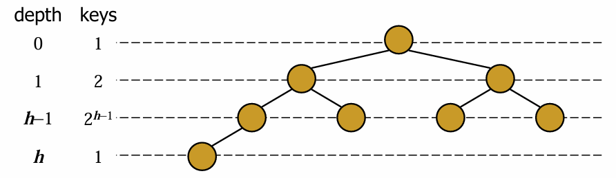

**Relation to Priority Queues**
- We can use a *heap* to implement a **priority queue**
- Store `(key, element)` item at each internal node
- Notice that the two heap properties are satisfied

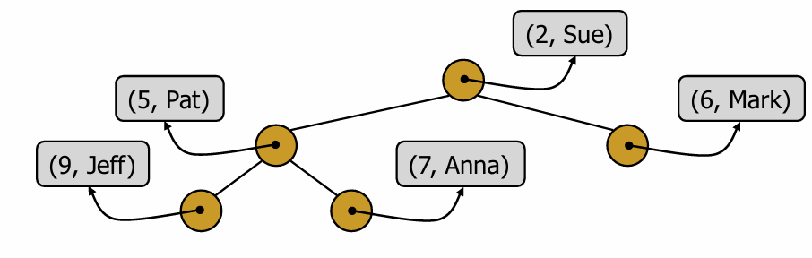

#### Insertion into a Heap

**Methodology**
- Method `insertItem` of priority queue ADT corresponds to insertion of a key $k$ to the heap
- **Algorithm:**
	- Find the insertion node $z$ (the new last node)
	- Store $k$ at $z$
	- Restore the ***heap-order property*** using `upheap`

**Upheap**
- Restores the heap-order property by swapping $k$ along an upward path from the insertion node
- Upheap terminates when the key $k$ reaches the root or a node whose parent has a key smaller than or equal to $k$ (for a ***min-heap***)
- Since a heap has height $O(\log n)$, upheap runs in $O(\log n)$ time
- Note that this is ***NOT*** $\Theta(\log n)$ as the insertion could be immediately valid (we can find last spot in $O(1)$ time with array-implementation)

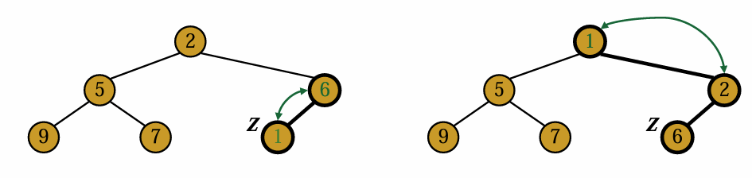

**Example**

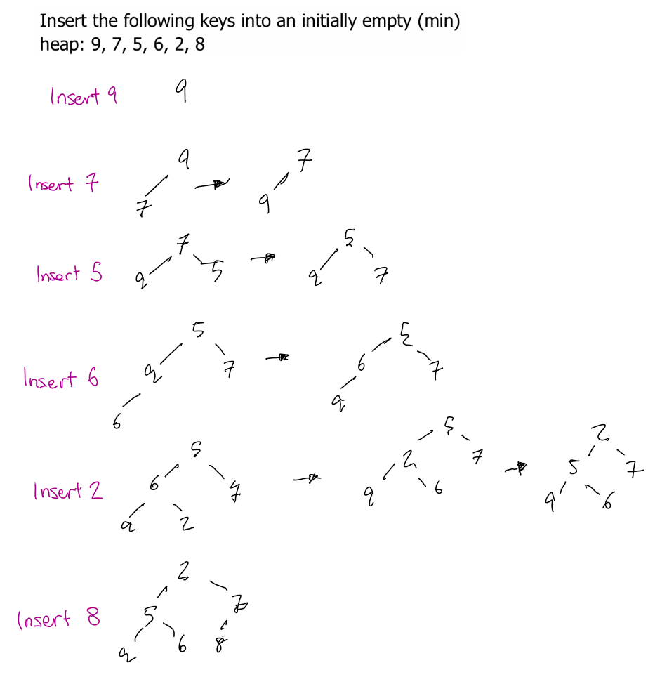

**Algorithm - Node based Binary Tree**

```pseudocode
/* Upheap operation */
function upHeap(curr):
	while (curr.parent != NULL and curr.val < curr.parent.val):
		SWAP(curr.val, curr.parent.val)
		curr = curr.parent
```

#### Removal from a Heap

**Methodology**
- Method `removeMin` of the priority queue ADT corresponds to the removal of the **root key** from the heap
- **Algorithm:**
	- Replace root key with key of last node $w$
	- Remove $w$
	- Restore the ***heap-order property*** with `downheap`
	
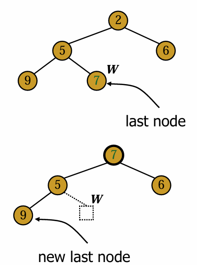

**Down-heap**
- Restores the heap-order property by swapping key $k$ along a downward path from the root
- *Down-heap* terminates when key $k$ reaches a leaf or node whose children have keys greater than or equal to $k$
- Similarly *down-heap* runs in $O(\log n)$ time
- **Note** that *down-heap* is also $\Theta(\log n)$, because the **last** node is greater than most elements in the tree, so asymptotically speaking the **new root** will get swapped deep into the tree.

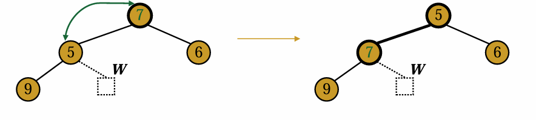

**Example**

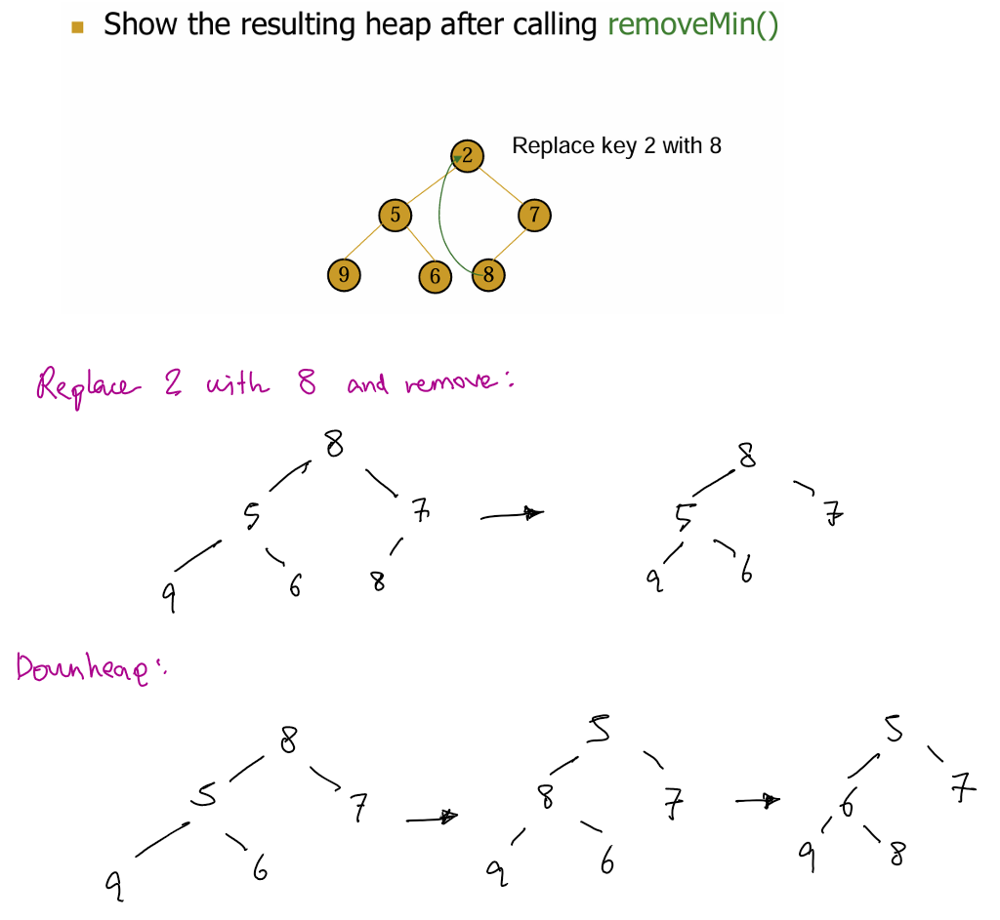

**Algorithm - Node based Binary Tree**

```pseudocode
/* Down Heap Operation */
function downHeap(curr):

	while (curr != NULL):

		// get the smaller node
		smallest = curr
		if (curr.left != NULL && curr.left.val < smallest.val):
			smallest = curr.left
		if (curr.right != NULL && curr.right.val < smallest.val):
			smallest = curr.right

		// heap property satisfied - exit immediately
		if (smallest == node): break
		
		SWAP(curr.val, smallest.val)
		curr = smallest
		
```

#### Array-based Heap Implementation

**Overview**
- A better way to represent a heap with $n$ keys is using an array of length $n$
- For the node at index $i$:
	- The *left child* is at index $2i+1$
	- The *right child* is at index $2i+2$
	- The parent node is at index $(i-1) / 2$
- ***This allows us to get access to the last element in constant time***

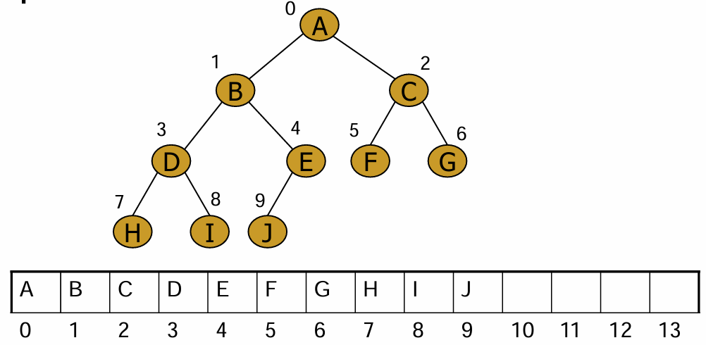

#### Heap-Sort

**Overview**
- Using a heap-based priority queue, we can sort a sequence of $n$ elements in $O(n \log n)$ time - a lot faster than quadratic sorting algorithms

**Algorithm**
1. Insert the elements to be sorted in a heap
2. Call `removeMin()` $n$ times
- Note that we can execute Phase 1 faster than $O(n \log n)$ steps using the **Heapify Algorithm**

**Heapify**
- Starting at index $i = (n-1)/2$, call `downheap()` until $i=0$, decrementing $i$ at each step

- **Algorithm**:
```pseudocode
for i = (n-1)/2 to 0:
	downHeap(i)
```

- **General Algorithm for Array-based implementation:**
```java
void heapify(int arr[], int n, int i) {
	int smallest = i;
	int l = 2*i+1;
	int r = 2*i + 2;
	if (l < n && arr[l] < arr[smallest])
		smallest = l;
	if (r < n && arr[r] < arr[smallest])
		smallest = r;
	if (smallest != i) {
		SWAP(arr, i, smallest)
		heapify(arr, n, smallest)
	}
}
```

**Example**

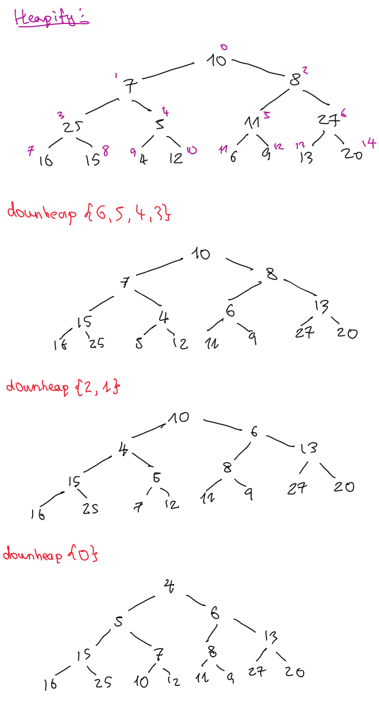

**Heapify - Running Time**
- ***Theorem*** - for a perfect binary tree containing $2{h+1} - 1$ nodes, the sum of the heights of the nodes is $2^{h+1} -1 - (h+1)$
- Since $h = \Theta(\log n)$, the sum is $\Theta(n)$
- **Proof**:
	- There are $2^i$ nodes at height $h - i$
	- Starting from the root, the cost is:
	$$S = 1*h + 2*(h-1) + 4*(h-2) + \cdots + 2^{h-1}*1$$
	$$2S = 2h + 4(h-1) + 8(h-2) + \cdots + 2^h$$
$$2S - S = -h + 2(h - h + 1) + 4(h - h + 1) + \cdots + 2^{h-1}(h - h + 1) + 2^h$$
$$S = -h + 2 + 4 + 8 + \cdots + 2^{h-1} + 2^h$$
$$S = 2^{h+1} - 1 -(h + 1)$$
- Since a complete binary tree has between $2^h$ and $2^{h+1}$ nodes, the sum of the heights of its nodes is $\Theta(n)$
- **Hence**, the running time is $T(n) = O(n + n\log n) = O(n \log n)$.

## 13. Maps

#### Map ADT

**Overview**
- A **map** (associative array) models a searchable collection of *key-value* entries
- Main operations are *searching*, *inserting* and *deleting* values
- ***Multiple entries with the same key are not allowed***

**Map ADT**
- `get(k)` - return associated value with key $k$, `null` if not found
- `put(k, v)` - insert entry `(k,v)` into map. If key $k$ does not exist, return `null`, otherwise return old value associated with $k$
- `remove(k)` - remove and return associated value with key $k$, `null` if it doesn't exist
- `size()` - size of map
- `isEmpty()` - if map is empty
- `entrySet()` - *iterable collection of entries in map*
- `keySet()` - *iterable collection of keys in map*
- `values()` - *iterator of values in map*

#### Simple List-Based Map

**Overview**
- Implement a map using an *unsorted list*
- Store items of the map in a list $S$ based on a doubly linked list

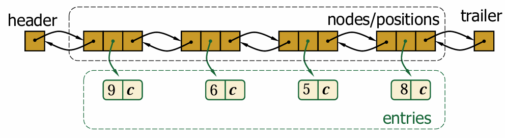

**`get(k)` Algorithm**:

```pseudocode
function get(k):
	B = S.positions()
	while B.hasNext() do
		p = B.next()
		if p.element().getKey() == k then
			return p.element().getValue()
	return null
```

**`put(k,v)` Algorithm**:

```pseudocode
function put(k,v):
	B = S.positions()
	while B.hasNext() do
		p = B.next()
		if p.element().getKey() == k then
			t = p.element().getValue()
			S.set(p, (k,v))
			return t
	S.addLast((k, v))
	size++
	return null
```

**`remove(k)` Algorithm**

```pseudocode
function remove(k):
	B = S.positions()
	while B.hasNext() do
		p = B.next()
		if p.element().getKey() == k then
			t = p.element().getValue()
			S.remove(p)
			size--
			return t
	return null
```

**Performance**
- The basic methods `put`, `get`, `remove` all take $O(n)$ time since in the worst case, we traverse the entire sequence to look for an item with the given key
- Unsorted list implementation is effective only for maps of a small size

## 14. Hash Tables

#### Hash Tables

**Overview**
- A **hash table** is an effective data structure for implementing a map
- A ***hash function*** is used to map general keys to corresponding indices in a table, as the keys may not be integers in the range $0$ to $N-1$ where $N$ is the size of the map

**Hash Function**
- A *hash function* $h$ maps key to integers in a fixed interval $[0, N-1]$ also called *buckets*
- E.g. $h(x) = x \bmod N$ is a hash function for integer keys
- The integer $h(x)$ is called the *hash value* of key $x$
- An ideal hash function maps the keys to integers in a random-like manner, so that bucket values are evenly distributed
- Consists of two steps:
	1. Map the *key* to an *integer* - **Hash Code** $$h_1 : \text{key} \to \text{integers}$$
	2. Map the *integer* to a *bucket* - **Compression Function** $$h_2 : \text{integers} \to [0,N-1]$$
- The hash function is the **composition** of these two functions:
$$h(k) = h_2(h_1(k))$$
- To store an item $(k,v)$ in a hash table, we:
	- Compute its hash code $h_1(k)$
	- Apply the compression function $h_2(h_1(k))$
	- Item $(k,v)$ will be stored at index $i=h(k)$

#### Hash Codes

**Overview**
- The hash code **ideally** should *minimise collisions*
- There is no unique way to choose a hash code for a key
1. For a data type represented by at most 32-bits (`int`, `byte`, `short`, `char`), take as a hash code the integer representation of its bits
	- **not efficient** for 64-bit representations because *Java* relies on 32-bit hash codes
	- For 64-bit data types (`long`, `double`), one may combine the high and low halves of the key to get a 32-bit key
2. For strings and tuples of the form $(a_0, a_1, \cdots, a_{n-1})$ we can use a **polynomial hash code**

**Polynomial Hash Code**
- Partition the bits of the key into a sequence of components of fixed length:
$$a_0 a_1 \cdots a_{n-1}$$
- Evaluate the polynomial
$$p(z) = a_0 + a_1z + a_2z^2 + \cdots + a_{n-1}z^{n-1}$$
	at a fixed value $z$, ignoring overflows
- This can be computed in $O(n)$ using **Horner's Rule**:
  $$p(z) = a_0 + z(a_1 + z(a_2 + z(a_3 + \cdots + z(a_{n-2} + za_{n-1}) \cdots )))$$
- Most suitable for **strings**
	- Choice $z=33$ gives at most $6$ collisions on a set of $50000$ English words

#### Compression Functions

**Division**
- One of the simplest methods:
$$h_2(y) = y \bmod N$$
- $N$ is usually chosen to be a prime number, this has to do with number theory

**Multiply, Add and Divide (MAD)**
$$h_2(y) = (ay + b) \bmod N$$
- $a$, $b$ are nonnegative integers such that $a \bmod N \ne 0$, otherwise every integer would map to same value $b$

#### Resolving Collisions - Separate Chaining

**Overview**
- Collisions occur when different elements are mapped to the same cell
- There are many techniques to deal with this, e.g. Separate Chaining, Open Addressing etc.

**Separate Chaining**
- Let each cell in the table point to a *linked list* of entries that map there
- Simple but requires additional memory outside the table

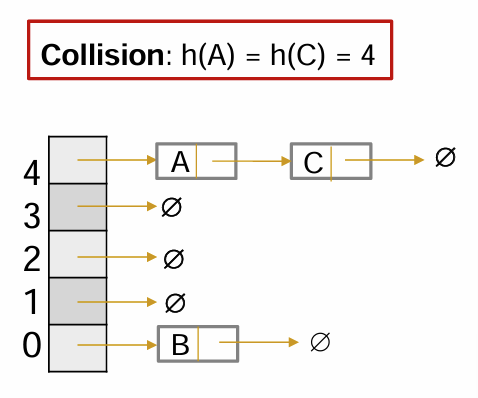

- **Analysis:**
	- Given a hash table $T$ with $N$ slots that stores $n$ elements, we define the ***load factor*** $\alpha = \frac{n}{N}$
	- If the hash function performs well, then the average length of a list is $\alpha$
	- If $n = O(N)$, then the operations `get`, `put` and `remove` take $O(1)$ time on average

#### Resolving Collisions - Open Addressing

**Open Addressing**
- ***Open Addressing*** - the colliding item is placed in a different cell of the table
- Each table cell inspected is referred to as a *probe*
- The goal of a collision resolution is to find a free slot in the table
- **Probe Sequence** - the series of slots visited following a collision resolution policy - $\beta_0 = h(k)$, $(\beta_0, \beta_1, \cdots)$ is the *probe sequence*.
- Given a hash function $h'$: $$\beta_i = h(k, i) = (h'(k) + f(i)) \bmod N$$
- Three techniques are used to compute the probe sequences for open addressing:
	1. Linear probing
	2. Quadratic probing
	3. Double hashing

**Linear Probing**
- Use the probe function $f(i) = i$
- Simply go to the next slot in the table (circularly)
- Suffers from ***primary clustering*** - records tend to cluster in the table under linear probing since the probabilities for which slot to use next are not the same for all slots

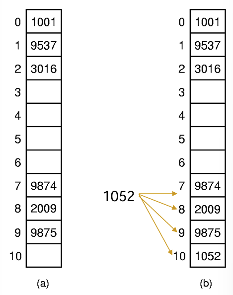

**Quadratic Probing**
- Use the probe function $f(i) = i^2$
- Same idea as linear probing, but follow a square rule for the next slot
- Suffers from ***secondary clustering***

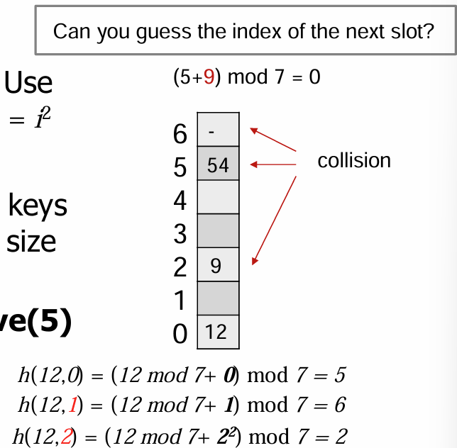

**Double Hashing**
- Use the probe function $f(i) = i \times h''(k)$
	- Choose $h''(k) = q - k \bmod q$ where $q < N$ is a prime
- The possible values of $h''(k)$ are $1,2, \cdots, q$, so $h_2(k)$ cannot have zero values

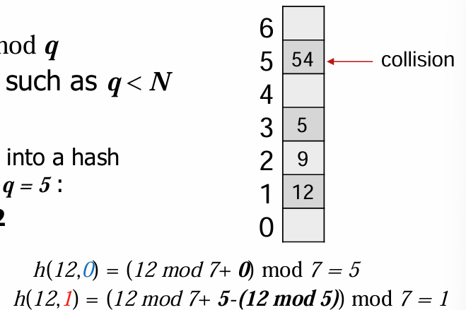

**Analysis**
- For open addressing, the load factor $\alpha = \frac{n}{N}$ should remain below $0.5$, or $N \ge 2n$
-  When the load factor grows beyond 0.5, one must ***rehash*** the table
- It is recommended that the new hash table have a prime number size approximately double the previous size

#### Basic Operations - Open Addressing

**Deleting from Hash Table**
- Replace the deleted element with a *special* `DEFUNCT` sentinel object
- Referred to as ***lazy deletion*** - mark an element as deleted instead of removing it
- `search(k)` will skip over cells containing `DEFUNCT` and continue probing until finding $k$
- This is *important* as deleting the value may lead to subsequent values in the *probe chain* from being unreachable as an *empty cell* indicates that the item isn't found

**Overview**
- `remove(k)`:
	- Search for entry with key $k$
	- If found, we replace by `DEFUNCT` and return element $v$
	- Otherwise return `null`
- `put(k, v)`
	- Throw exception if table is full
	- Probe consecutive cells until:
		- A cell $i$ is found that is either *empty* or stores `DEFUNCT` with the right key (key is often retained after deletion)
		- $N$ cells have been unsuccessfully probed
	- We store $(k,v)$ in cell $i$

#### Analysis

**Running Time**
- The ***expected running time*** of all dictionary ADT operations in a hash table is $O(1)$
	- Insertion, deletion, search
- In practice, hashing is very fast provided the load factor is not close to 100%

## 15. Trees

#### Introduction to Trees

**Trees**
- A tree is an abstract model of a hierarchical structure, which consists of nodes with a parent-child relation
- Applications:
	- Organisation charts
	- File systems
	- Programming environments

**Terminology**

- ***Root*** - node without parent
- ***Internal Node*** - node with at least one child
- ***Leaf*** - node without children
- ***Ancestors*** (of a node) - parent, grandparent, etc.
- ***Descendant*** (of a node) - child, grandchild, etc.
- ***Siblings*** - nodes which belong to the same parent
- ***Subtree*** - tree consisting of a node and its descendants

- ***Depth*** - number of ancestors, or length of the path from the root to the node. The *depth* of the root is $0$
- ***Height*** - length of the longest path from leaf to the node. The *height* of a leaf is $0$
- **NOTE** - the height of a *tree* is equal to its depth

**Tree ADT**
- We define a tree ADT using a *position* as an abstraction for a node. Each element is stored at each position
- Accessors:
	- `root()`
	- `parent(p)`
	- `children(p)` - iterable collection of children
	- `numChildren(p)`
- Queries:
	- `isInternal()`
	- `isExternal()`
	- `isRoot(p)`
- General methods:
	- `size()`
	- `isEmpty()`
	- `iterator()` - an iterator for all positions in a tree
	- `positions()` - returns an iterable collection (tree traversals)

**Linked List Trees**
- A node is represented by an object storing:
	- *Element*
	- *Parent node*
	- *Sequence of children nodes*
- Node objects implement the `Position ADT`

#### Tree Traversals

**Pre-Order Traversal**
- A ***traversal*** visits the nodes of a tree in a systematic manner
- **Pre-Order**: Node is visited before its descendants
- Application: print a structured document
- **Algorithm:**
```pseudocode
function preOrder(v):
	visit(v)
	for each child w of v:
		preOrder(w)
```

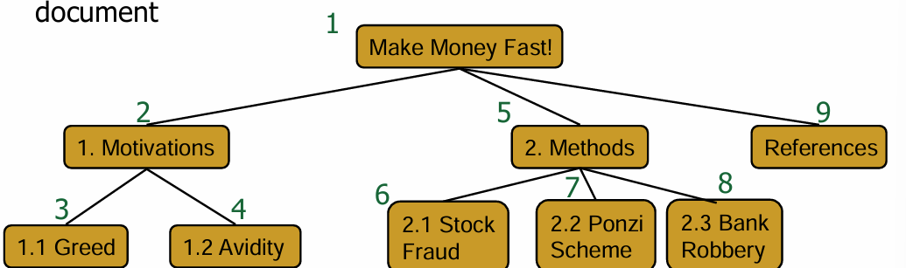

**Post-Order Traversal**
- In a *post-order traversal*, a node is visited after its descendants
- Application - compute space used by files in a directory and its subdirectories
- **Algorithm:**
```pseudocode
function postOrder(v):
	for each child w of v:
		postOrder(w)
	visit(v)
```

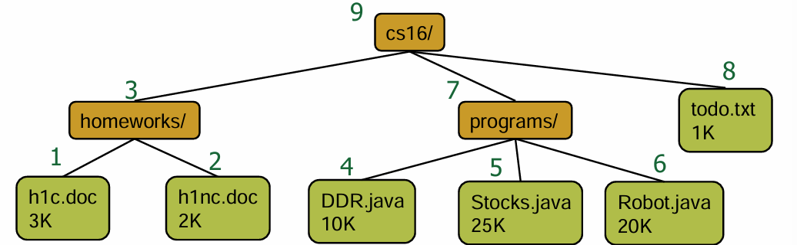

#### Binary Trees

**Binary Tree ADT**
- A ***binary tree*** is a tree where each node has at most two children
- The `BinaryTree` DT extends the Tree ADT with the following methods:
	- `position left(p)`
	- `position right(p)`
	- `position sibling(p)`
	- (return null in absence of a node)
- Applications:
	- arithmetic expressions
	- decision processes
	- searching

**Linked List Structure for Binary Trees**
- Each node is represented by an object storing:
	1. Element
	2. Parent node
	3. Left child node
	4. Right child node
- Node objects implement the Position ADT

**Proper Binary Trees**
- A ***proper*** (full) binary tree is a tree where every node has $0$ or $2$ children
- Denote by:
	- $n$ = number of nodes
	- $e$ = number of external nodes
	- $i$ = number of internal nodes
	- $h$ = height
- Properties:
	- $e = i + 1$
	- $h \le (n-1)/2$
	- $h \ge \log_2(n+1) - 1$

**In Order Traversal**
- Note that *in-order* traversal is only possible with a binary tree
- The node is visited after its left subtree but before its right subtree
- **Algorithm:**
```pseudocode
function inOrder(v):
	if left(v) != NULL:
		inOrder(left(v))
	visit(v)
	if right(v) != NULL:
		inOrder(right(v))
```

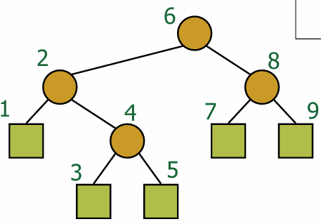

**Application - Arithmetic Expressions**
- ***Proper Binary Tree*** associated with an arithmetic expression
	- internal nodes - operators
	- external nodes - operands
- We can use ***in-order*** traversal to print the arithmetic expression with a binary tree

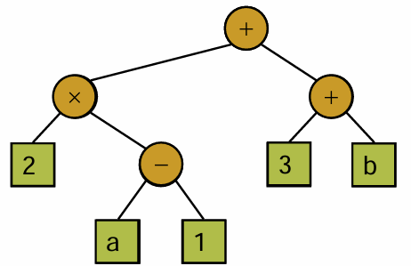

**Application - Decision Tree**
- Binary tree associated with a decision process
	- internal nodes - questions with yes/no answer
	- external nodes - decisions

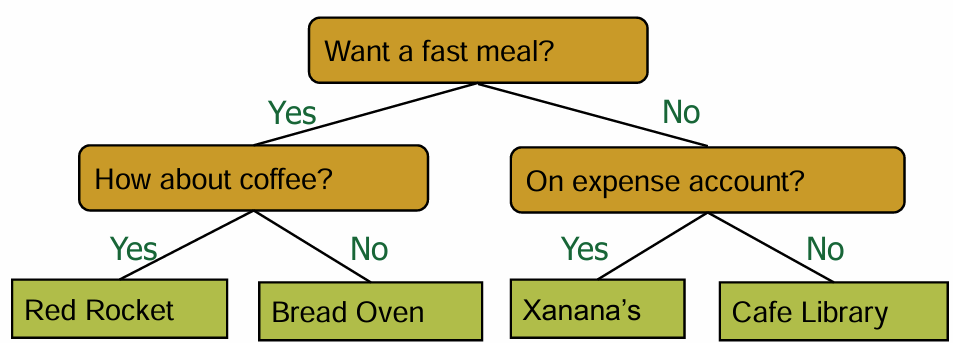

#### Running Time Analysis

**Common Running Times:**
- Cost of traversing a tree = $O(n)$
- Maximum height of a binary tree = $O(n)$

#### Sorting - Decision Trees

**Decision Tree Proof**
- Recall that *any comparison-based sorting algorithm cannot run faster than $\Omega(n \log n)$ time
- Proof using binary decision trees:
	- Let $S = (x_0, x_1, \cdots, x_{n-1})$ be a sequence of elements to be sorted. Assume that all $x_i$ are distinct
	- Each time the algorithm compares two elements, there are two possible outputs (yes, no)
	- We can use a decision tree $T$ to represent a comparison-based algorithm where:
		- $T$ represents all possible sequences of comparisons that a sorting algorithm might make
		- Internal node = comparison, edges = yes/no answer
	- The ***height*** of the decision tree is a lower bound on the running time, as every input permutation must lead to a separate leaf output
	- We know that there are $n!$ possible outputs of a sorting algorithm, so there are $n!$ leaves
	- The height is at least $\log(n!)$, which is $\Omega(n \log n)$ as we will see later

**Proof that $\log(n!) = \Theta(n \log n)$**
$$\log(n!) = \log(1\times 2 \times \cdots \times (n-1) \times n)$$
$$= \log 1 + \log 2 + \cdots + \log(n/2) + \cdots + \log(n)$$
$$ \ge 0 + 0 + ... + \log(n/2) + \cdots + \log(n/2)$$
$$\ge (n/2) \times \log(n/2)$$
- Therefore $\log(n!) = \Omega(n \log n)$
- We also know that: $$\log1 + \log 2 + \cdots + \log(n) \le \log n + \log n + \cdots + \log n = n \log n$$
- So we have that $\log(n!) = O(n \log n)$.
- Therefore, $\log(n!) = \Theta(n \log n)$

**Conclusion**
- We now know that the height is at least $\Omega(n \log n)$, so we have that comparison-based sorting algorithms have a lower bound of $\Omega(n \log n)$

## 16. Binary Search Trees

#### Binary Search Trees

**Overview**
- A *Binary Search Tree* (BST) efficiently implements an **ordered map**, where the keys satisfy the properties of a *total order*
- This allows us to support nearest neighbour queries:
	- Item with largest key less than or equal to $k$
	- Item with smallest key greater than or equal to $k$
- Fundamental methods:
	- `get(k)` - returns value $v$ associated with key $k$, or null if doesn't exist
	- `put(k,v)` - inserts a new entry or replaces any value associated with $k$
	- `remove(k)` - removes entry with key $k$, or returns null if doesn't exist

**Ordered Map - Sorted Array Implementation**
- ***Binary Search*** can perform nearest neighbour queries on an ordered map that is implemented with an array, sorted by key
	- *Search* takes $O(\log n)$
	- Insertion takes $O(n)$ time, as we have to shift items to make room for the new item
	- Removal takes $O(n)$ time
- **Lookup** is only effective for ordered maps of small size, or maps where ***searches*** are the most common, and *insertions* / *removals* are not common

**Binary Search Tree**
- A **binary tree** storing keys at its internal nodes, satisfying the property:
	- $\text{key}(u) \le \text{key}(v) \le \text{key}(w)$ for $u$ in left subtree of $v$ and $w$ in right subtree of $v$
- External nodes do not store items
	- These are the `null` pointers of leaf nodes
- *An in-order traversal of a binary search tree visits the keys in increasing order*

#### BST Search

**Algorithm**
- Start at the root and compare $k$ with value of the current node.
- If $k$ is equal to the node value, we are done
- If $k$ is smaller, recurse on the left child
- Otherwise, recurse on the right child
- If we reach a leaf (external node), the key is not found

```pseudocode
function TreeSearch(k, v):
	if T.isExternal(v)
		return v
	if k < key(v):
		return TreeSearch(k, left(v))
	else if k > key(v):
		return TreeSearch(k, right(v))
	else:
		return v
```

#### BST Insert

**Algorithm**
- Assume $k$ is not already in the tree, and let $w$ be the leaf reached by the search
- We insert $k$ at node $w$ and expand $w$ into an internal node
- If $k$ is found by the search, we can terminate early to either exit, or update the value of the key $k$

```pseudocode
function insertBST(k, v):

	// search for the place to insert
	parent = NULL
	curr = T.root
	while (curr != NULL):
		if k == curr.val().getKey():
			curr.val().setValue(v)
			return
		else if k < curr.val().getKey():
			parent = curr
			curr = curr.left
		else:
			parent = curr
			curr = curr.right

	// by now, we know that curr is NULL
	if (k < parent.val().getKey()):
		parent.setLeft(new Node(k, v))
	else:
		parent.setRight(new Node(k, v))
```

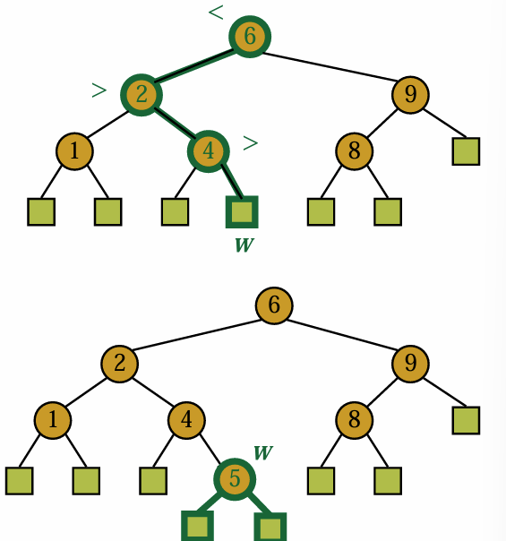

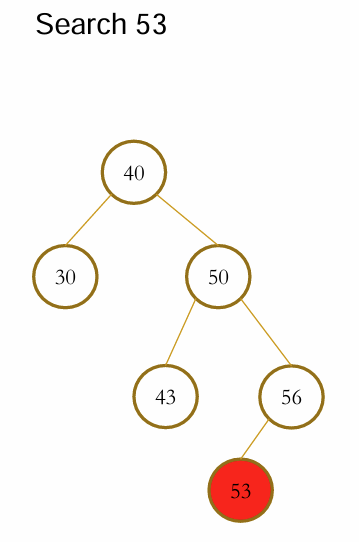

#### BST Delete

**Algorithm**
- For deletion, we distinguish three cases
	1. The node to be deleted has no children
		- *Just delete the node*
	2. The node to be deleted has a single child
		- *Make child of node to be child of parent, then delete the node*
	3. The node to be deleted has two children
		- Replace the node value by maximum value of left subtree, and delete the max node of left subtree
		- This method is the **In-Order Predecessor Method**

```pseudocode
/* Helper Function */
function maxValue(curr):
	if curr.right != NULL:
		return maxValue(curr.right)
	return curr.val

/* Main Function */
function deleteBST(curr, key):
	if curr == NULL: return curr

	if key < curr.val:
		curr.left = deleteBST(curr.left, key)
	else if key > curr.val:
		curr.right = deleteBST(curr.right, key)
	else:
		// case 1
		if curr.left == NULL && curr.right == NULL:
			return NULL
		// case 2a
		else if curr.left != NULL && curr.right == NULL:
			return curr.left
		// case 2b
		else if curr.left == NULL && curr.right != NULL:
			return curr.right
		// case 3
		else:
			max = maxValue(curr.left)
			curr.left = deleteBST(curr.left, max)
			curr.val = max
	return curr
```

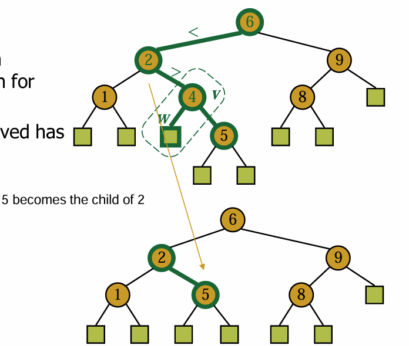
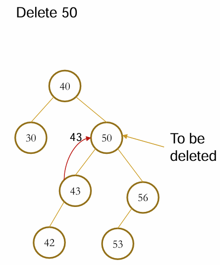

#### Performance

**Performance**
- Consider an ordered map with $n$ items implemented using a binary search tree of height $h$
- Space used is $O(n)$
- Methods `get`, `put`, `remove` take $O(h)$ time
- The height $h$ is $O(n)$ in the worst case and $O(\log n)$ in the best case

## 17. AVL Trees

#### AVL Trees

**Overview**
- An *Adelson-Veslkii and Landis* (**AVL**) tree is a **Binary Search Tree** with a balance property:
	- ***For each node, the height of the left and right subtrees differ by at most 1***
- Formally, let $\alpha$ be *any node* in an AVL tree, $h_L$, $h_R$ be the heights of the left/right subtrees of $\alpha$. The AVL property states that:
$$|h_L - h_R| \le 1$$

**Height of an AVL Tree**
- The height of an AVL tree with $n$ nodes is $O(\log n)$
- **Proof:**
	- Let $T_h$ be the smallest AVL tree of height $h$ and $N(h)$ be the number of nodes in $T_h$
	- The height of the subtrees of $T_h$ are $h-1$ and $h-2$
	- We get:
		1. $N(h) = N(h-1) + N(h-2) + 1$
		2. $N(1) = 1$ and $N(2) = 2$
	- This recurrence is similar to the Fibonacci one
	- $N(h) \ge \phi^h$ where $\phi = (1 + \sqrt 5)/2$, the golden ratio
	- Since $N(h)$ is the number of nodes for the *smallest AVL tree* of height $h$, then for **any** AVL tree of height h, $N \ge \Omega(\phi^h)$
	- Hence $h = O(\log n)$, as $\phi$ is a constant
- **Second Proof:**
	- We know that $N(h-1) \ge N(h-2)$, so by dropping the +1 in the recurrence, we get:
		$$N(h) \ge 2N(h-2)$$$$\ge 2^2N(h-4)$$$$\ge 2^iN(h-2i)$$
- We choose $i$ such that $h-2i = 1$ or $2$ (base case), so $i = h/2 - 1$
- Hence we get $N(h) \ge 2^{h/2-1}$, so $\log(N(h)) \ge h/2 - 1$, therefore $h \le \log(N(h))$

#### Insertion

**Overview**
- Insertion and deletion may violate the **AVL** property
- Hence after insertion/deletion we need to restore the AVL property
- *Start from the node inserted, and work up to the root of the tree, finding the first node that has an imbalance, and restore the imbalance.*
- **Note that only one imbalance will occur with an Insertion**
- **We distinguish 4 cases:**
	1. *Left-Left Imbalance - Rotate Right*
	2. *Right-Right Imbalance - Rotate Left*
	3. *Left-Right Imbalance - Rotate Left, then Right*
	4. *Right-Left Imbalance - Rotate Right, then Left*

**Single Rotation - Example**

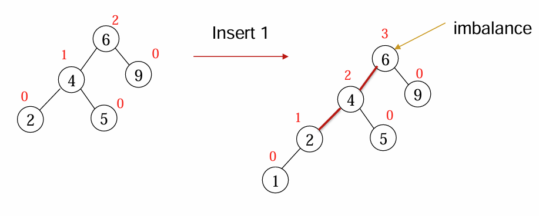
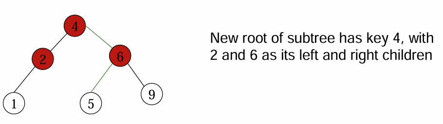

**Trinode Restructuring**
- Rebalancing an AVL tree involves performing a single or double rotation
- **Trinode Restructuring** involves a node $x$, its parent $y$ and its grandparent $z$
- E.g. RR imbalance
	1. Replace subtree rooted at $z$ with subtree rooted at $b$
	2. $a$ becomes left child of $b$ and T2 becomes a subtree of $a$

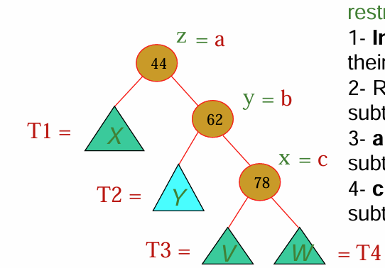

- **NOTE**: Cost of restructuring is $O(1)$

**More Examples**

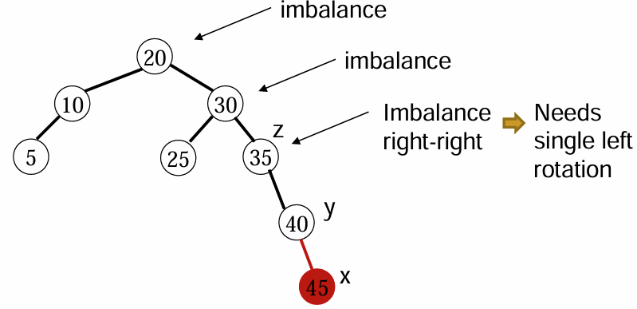
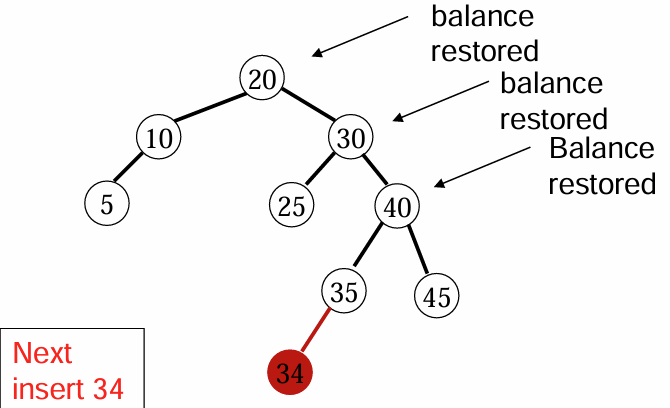
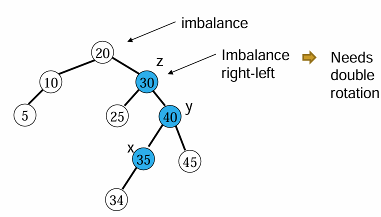
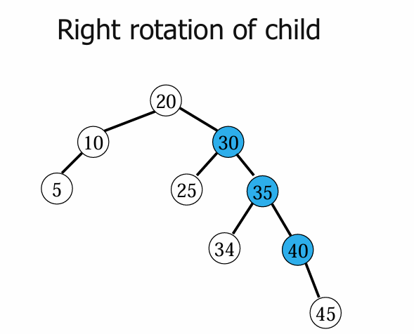
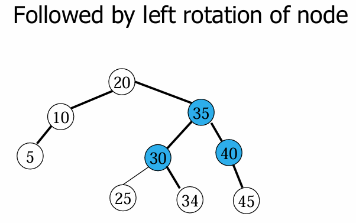

#### Deletion

**Overview**
- Removal beings as in a **binary search tree**
- It's parent $w$ may cause an imbalance, so whilst travelling up the tree from $w$, we might need to restore the balance for some subtree rooted at $z$
- This restructuring may upset the balance of another node higher in the tree, we must continue checking until the root is reached

**Algorithm**
- Delete a node $x$ as in ordinary binary search tree
- Then trace the path from the new leaf towards the root
	1. For each node $x$ encountered, check if `height(left(x))` and `height(right(x))` differ by at most 1
	2. If yes, proceed to `parent(x)`
	3. If no, perform an appropriate rotation at $x$

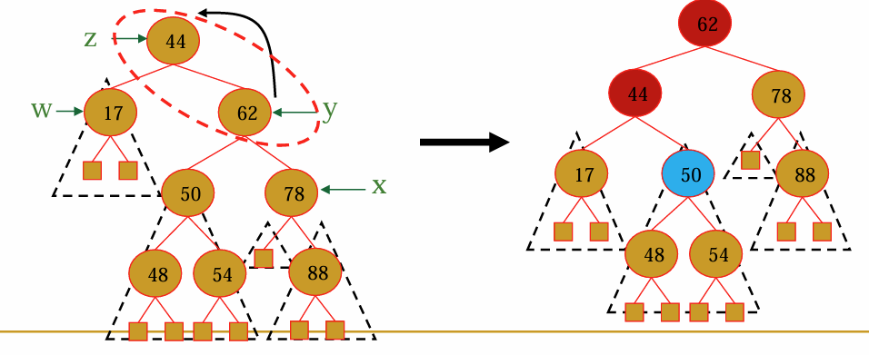

#### Time Complexities

**Running times**
- Search runs in $O(\log n)$
- Insertion runs in $O(\log n)$ and $\Theta(\log n)$, because insertion occurs deep in the tree at the leaves, so you have to traverse down to the bottom
- Deletion runs in $O(\log n)$ and $\Theta(\log n)$, as deletion from BST is $\Theta(\log n)$ and restructuring requires going to the root

## 18. Skip Lists

#### Skip Lists

**Motivation**
- **Binary Search** can find an element in a sorted array in $O(\log n)$, but insertion and deletion take $O(n)$ steps due to shifting elements around
- Using a **linked-list** improves insertion and deletion (in case we are given the position of the element to update) but search is inefficient since it takes $O(n)$
- An efficient data structure for implementing the **Ordered Map ADT** is a ***Skip List***

**Skip Lists**
- A skip list is a *two-dimensional* collection of positions arranged horizontally into **levels** and vertically into **towers**
- Each level is a list $S_i$ and each tower contains positions storing the same entry across consecutive lists
- **Operations:**
	- `next(p)` - returns position following $p$ on the same level
	- `prev(p)` - returns position preceding $p$ on same level
	- `above(p)` - returns position above $p$ in the same tower
	- `below(p)` - returns position below $p$ in the same tower

**Description**
- A **skip** list for a set $S$ of distinct `(key, element)` items is a series of lists $S_0, S_1, \cdots, S_h$ such that:
	- Each list $S_i$ contains the special keys $+\infty$ and $-\infty$
	- List $S_0$ contains the keys of $S$ in increasing order plus $+\infty$ and $-\infty$
	- Each list is a random subsequence of the previous one:
	$$S_0 \supseteq S_1 \supseteq\cdots\supseteq S_h$$
	- List $S_h$ contains only the *two special keys*

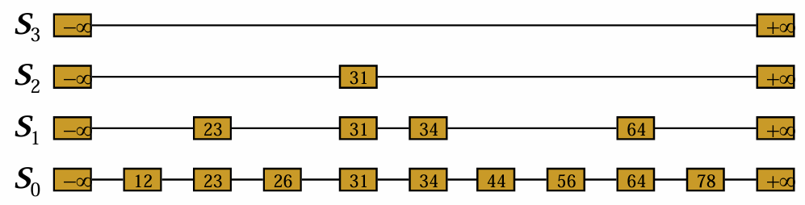

#### Search

**Algorithm**
- We *start* at the first position of the top list, then repeat the below steps:
- At the current position $p$, we compare $k$ with $y = \text{key}(\text{next}(p))$:
	- $k = y$: we return $\text{element}(\text{next}(p))$
	- $k > y$: we "scan forward"
	- $k < y$: we "drop down"
- If we try to drop down past the bottom list, we return `null` ($k$ not found)

**Example**

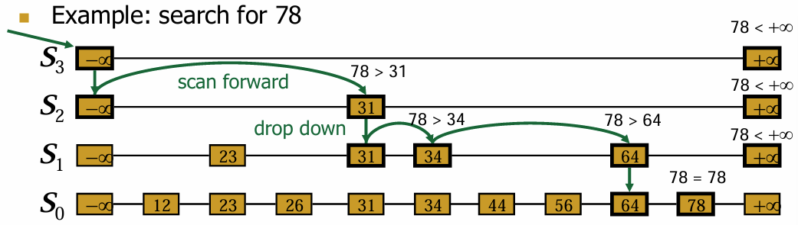

#### Insertion

**Algorithm**
- Insertion into a skip list uses a **randomized algorithm**
- Involves tossing a coin, assuming that:
	- Coin is unbiased
	- Coin tosses are independent of each other
- `put(k,v)` uses a randomized algorithm to insert:
	- Run `SkipSearch(k)` -If a position $p$ is found with key $k$, then overwrite its associated value with $v$
	- Otherwise, insert $(k,v)$ immediately after position $p$ in $S_i = S_0$
	- Then flip a coin to determine the height of the tower for $(k,v)$
		1. If it is tails, stop here
		2. If it is heads, insert the new entry at the appropriate position in $S_i+1$
		3. Go back to Step 1

**Example**

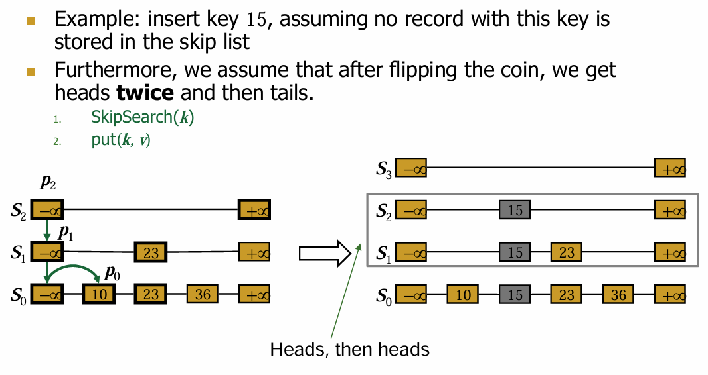

#### Deletion

**Algorithm**
- `SkipSearch(k)` - if no entry with key $k$ is found, return `null`
- Otherwise, remove the element at position $p$ and all elements above $p$, keeping only one list containing the two special keys $+\infty$ and $-\infty$

**Example**

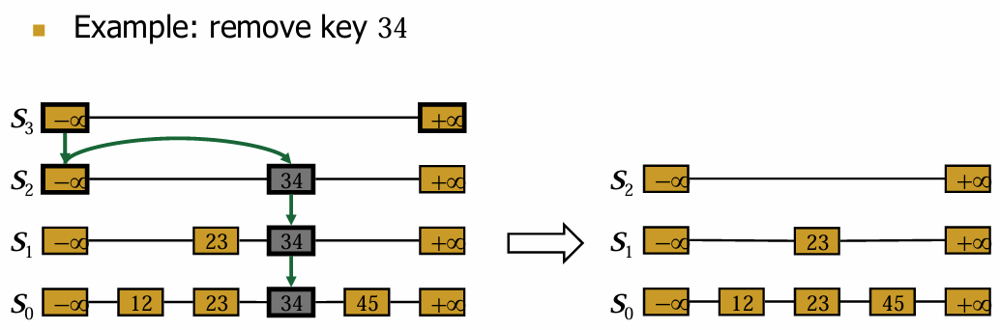

#### Implementation

**Overview**
- We can implement a skip list with *quad-nodes*
- A *quad-node* stores:
	- *entry*
	- link to the node *previous*
	- link to the node *next*
	- link to the node *below*
	- link to the node *above*
- Also we define special keys `PLUS_INF` and `MINUS_INF` and we modify the key comparator to handle them

#### Height, Space Usage, Running Time

**Height**
- Operations `skipSearch`, `put`, `remove` depend on the height of the skip list, $h$
- Height $h$ is determined by the randomized insertion algorithm
- Probability that a given entry has tower of height $i$ is:
	$$\frac{1}{2^i}$$
- Hence the probability $P_i$ that the level has at least one entry is at most:
$$P_i \le \frac{n}{2^i}$$
- This is because: $$P(A_1 \cup A_2 \cup \cdots \cup A_n) \le P(A_1) + P(A_2) + \cdots + P(A_n)$$
- In other words, the expected number positions at level $i$ cannot exceed $n/2^i$

- Generally speaking, for a constant $c > 1$, $S$ has height $h$ more than $i = c\log n$ with probability at most $1/n^{c-1}$
- In other words, the probability that $h < c\log n$ is at least $$1 - \frac{1}{n^{c-1}}$$
- With a very high probability, the height of $h$ is $O(\log n)$

**Space Usage**
- The total expected positions in $S$ is the sum of all positions at levels $0 \le i \le h$:
$$\sum_{i=0}^h\frac{n}{2^i} = n\sum_{i=0}^h\frac{1}{2^i}<2n$$
- This is because $\sum_{i=0}^n(1/2^i) < 2$
- We can conclude that the **expected** space requirement of a skip list with $n$ items is $O(n)$

**Running Time**

- Search: $O(\log n)$ expected time
- Insertion: $O(\log n)$ expected time
- Deletion: $O(\log n)$ expected time

- Search time in a skip list is proportional to the *number of drop-downs* and the *number of scan-forward steps*
	- Drop-down steps are bounded by height of skip list $\implies$ $O(\log n)$ with high probability
	- We can reason that the expected number of scan-forward steps is $O(\log n)$ using the fact that the expected number of coin tosses required in order to get tails is $2$

## 19. Graphs

#### Introduction to Graphs

**Graphs**
- A graph $G = (V,E)$ where $V$ = vertices, $E$ = edges
- Note that $E \subseteq V^2$

**Edge Types**
- *Directed* edge - ordered pair of vertices $(u,v)$ where $u$ is the origin, $v$ is the destination
- *Undirected* edge - unordered pair of vertices $(u,v)$
- **Digraph** = Directed graph, all edges are directed
- Undirected graph - all edges are undirected

**Applications**
- Electronic circuits
	- Printed circuit board, Integrated circuit
- Transportation networks
	- Highway network, Flight network
- Computer networks
	- Local area network, Internet, Web
- Databases
	- Entity-relationship diagram

**Terminology**
- **End Vertices** of an edge
- Edges **incident** on a vertex
- **Adjacent vertices** - connected by an edge
- **Degree** - number of incoming/outgoing edges
- **Parallel edges**
- **Self-loop**
- **Path** - sequence of alternating vertices and edges
- **Simple Path** - path with all vertices and edges distinct
- **Cycle** - circular sequence of alternating vertices and edges
- **Simple Cycle** - cycle such that all vertices and edges are distinct

**Properties**
- Handshaking Lemma - $\sum_{v \in V}{\deg(v)} = 2|E|$
- If $G$ is a tree, we have $|V| - |E| = 1$

**Complete Graph**
- A *complete graph* is a simple, undirected graph where every pair of vertices is connected by a unique edge
- The number of edges in a complete graph with $n$ nodes is $O(n^2)$
- Each vertex has maximum degree $n-1$

**Graph ADT**
- `numVertices()`
- `vertices()`
- `numEdges()`
- `edges()`
- `getEdge(u, v)`
- `endVertices(e)`
- `opposite(v,e)`
- `outDegree(v)`
- `inDegree(v)`
- `outgoingEdges(v)`
- `incomingEdges(v)`
- `insertVertex(x)`
- `insertEdge(u, v, x)`
- `removeVertex(v)`
- `removeEdge(e)`

#### Graph Representation - Edge List

**Overview**
- All vertex objects are stored in an unordered list $V$
- edge objects are stored in an unordered list $E$
- **Vertex** contains:
	- Element
	- Reference to position in vertex sequence
- **Edge** object:
	- Element
	- Origin vertex object
	- Destination vertex object
	- Reference to position in edge sequence

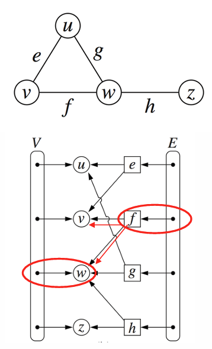

**Performance**

|                     |          |
| ------------------- | -------- |
| Space               | $O(n+m)$ |
| `incidentEdges(v)`  | $O(m)$   |
| `getEdge(u,v)`      | $O(m)$   |
| `insertVertex(o)`   | $O(1)$   |
| `insertEdge(v,w,o)` | $O(1)$   |
| `removeVertex(v)`   | $O(m)$   |
| `removeEdge(e)`     | $O(1)$   |

#### Graph Representation - Adjacency List

**Overview**
 - Incidence collection of a vertex $I(v)$
	 - A list of edges whose entries are incident to $v$
- **Case of a digraph:**
	- We maintain two separate collections for outgoing and incoming edges $I_{out}(v)$ and $I_{in}(v)$

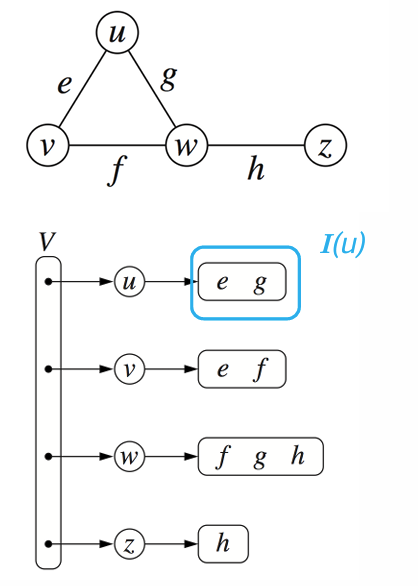

**Performance**

|                     |                            |
| :------------------ | -------------------------- |
| Space               | $O(n+m$)                   |
| `incidentEdges(v)`  | $O(deg(v))$                |
| `getEdge(u,v)`      | $O(\min(\deg(u), deg(v)))$ |
| `insertVertex(o)`   | $O(1)$                     |
| `insertEdge(v,w,o)` | $O(1)$                     |
| `removeVertex(v)`   | $O(\deg(v))$               |
| `removeEdge(e)`     | $O(1)$                     |

**Remove Edge**
- We can maintain a reference to the position of an edge within $I(u)$ in $O(1)$ by including  additional information associated with an edge
	- Endpoints $u$ and $v$
	- Position in $I(u)$ and $I(v)$
	- Weight
- Edge $e$: $(u,0,v,0)$

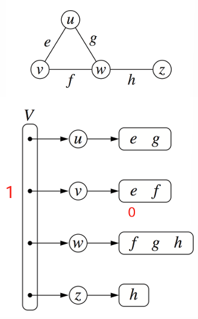

**Alternative Method**:
- Mapping a vertex to its list of adjacent vertices
- Note that the cost of some operations may change
- `removeEdge(e)` now takes $O(\deg(u) + \deg(v))$

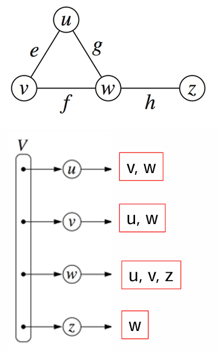

#### Adjacency Map

**Overview**
- Improve the performance of an Adjacency List by using a hash-based map to implement $I(v)$ - a list of edges whose entries are incident to $v$
- We let the opposite endpoint of each incident edge to $v$ serve as a key in the map
- `getEdge(u,v)` i.e. `areAdjacent(u,v)` runs in **expected** constant time

**Performance**

|                     |                 |
| :------------------ | --------------- |
| Space               | $O(n+m)$        |
| `incidentEdges(v)`  | $O(\deg(v))$    |
| `getEdge(u,v)`      | Expected $O(1)$ |
| `insertVertex(o)`   | $O(1)$          |
| `insertEdge(v,w,o)` | $O(1)$          |
| `removeVertex(v)`   | $O(\deg(v))$    |
| `removeEdge(e)`     | Expected $O(1)$ |
#### Adjacency Matrix

**Overview**
- Uses an $n\times n$ 2D-array
- Augmented vertex objects - Integer key (index) associated with vertex
- 2D-array adjacency array
	- Stores references to edges
	- Null for non nonadjacent vertices
- "Old fashioned" version just has $0$ for no edge and $1$ for edge
- Inefficient for sparse matrices
- Main advantage: Any edge can be accessed in $O(1)$

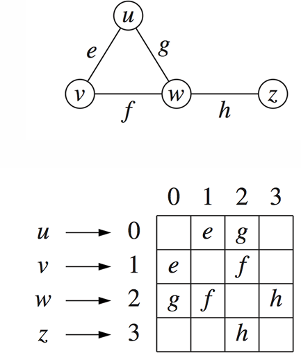

**Performance**

|                     |          |
| :------------------ | -------- |
| Space               | $O(n^2)$ |
| `incidentEdges(v)`  | $O(n)$   |
| `getEdge(u,v)`      | $O(1)$   |
| `insertVertex(o)`   | $O(n^2)$ |
| `insertEdge(v,w,o)` | $O(1)$   |
| `removeVertex(v)`   | $O(n^2)$ |
| `removeEdge(e)`     | $O(1)$   |

#### Performance Summary

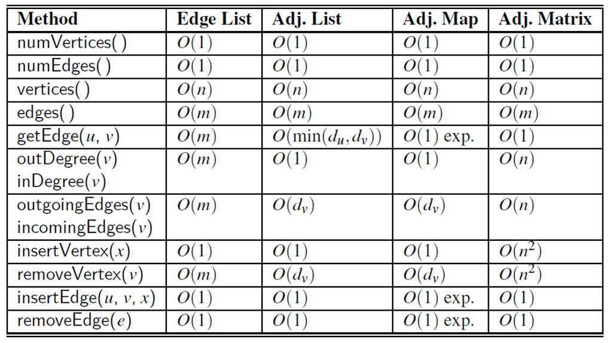

## 20. Depth First Search

#### Definitions

**Traversals**
- A **traversal** is a systematic procedure for exploring a graph by examining all of its vertices and edges
- A traversal is efficient if it visits all the vertices and edges in linear time
- **Reachability** problem answers the question whether there is a path from one vertex to another

**Reachability Problems**
- Computing the minimum number of edges between a start vertex and every other vertex
- Testing whether $G$ is connected, or strongly connected for a digraph
- Computing a **spanning tree** of $G$
- Computing the connected components of $G$, or strongly connected components for a digraph
- Identifying a cycle in $G$

**Subgraphs**
- A **subgraph** $S$ of a graph $G = (V,E)$ is a graph such that:
	- $V' \subseteq V$
	- $E' \subseteq E$

**Connectivity**
- A graph is **connected** if there is a path between every pair of vertices
- A connected component of a graph $G$ is a maximal connected subgraph of $G$

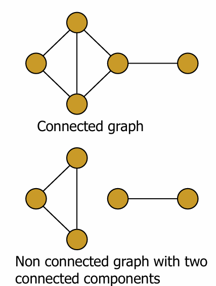

**Trees and Forests**
- A **tree** is an undirected graph $T$ such that $T$ is connected and it has no cycles.
- This definition of a tree is different to one of a *rooted tree*
- A **forest** is an undirected graph without cycles
- The *connected components* of a forest are trees

**Spanning Trees and Forests**
- A **spanning tree** of a connected graph is a spanning subgraph that is a tree
- A spanning tree is not unique unless the graph is a tree
- Applications - design of communication networks

#### Depth First Search

**Overview**
- A general technique for traversing a graph
- A DFS traversal of graph $G$:
	- Visits all the vertices and edges of $G$
	- Determines whether $G$ is connected
	- Computes the connected components of $G$
	- Computes a spanning forest of $G$
- Can be further extended to solve other graph problems:
	- Find and report a path between two given vertices
	- Find a cycle in the graph

**Algorithm**

```psuedocode
function DFS(G, v):
	setLabel(v, VISITED)
	for all e in G.incidentEdges(v)
		if getLabel(e) == UNEXPLORED:
			w = opposite(v, e)
			if getLabel(w) == UNEXPLORED:
				setLabel(e, DISCOVERY)
				DFS(G, w)
			else:
				setLabel(e, BACK)	
```

**Maze Traversal**
- DFS algorithm is similar to classic strategy for exploring a maze:
	- Mark each intersection, corner and dead end (vertex) visited
	- Mark each corridor (edge) traversed
	- Keep track of path back to entrance by means of rope (recursion stack)

**Properties of DFS**
1. `DFS(G, v)` visits all the vertices and edges in the connected component of $v$
2. Discovery edges labelled by $DFS(G, v)$ form a spanning tree of the connected component of $v$

**Running Time Analysis**
- Settings/getting a vertex/edge label takes $O(1)$ time
- Each vertex is labelled twice, once as `UNEXPLORED` and once as `VISITED`
- Each edge is labelled twice, once as `UNEXPLORED`, and once as `DISCOVERY` or `BACK`
- Method `incidentEdges` is called once for each vertex
- ***DFS*** runs in $O(n+m)$ time provided the graph is represented by the adjacency list structure

**Path Finding**
- Specialise the DFS algorithm to find a path between vertices $u$ and $z$
- Call `DFS(G, u)` with $u$ as the start vertex, and once we encounter $z$, we return the path as the contents of the stack

```pseudocode
function pathDFS(G, v, z):
	setLabel(v, VISITED)
	S.push(v)
	if (v == z):
		return S.elements()
	for all e in G.incidentEdges(v):
		if getLabel(e) == UNEXPLORED:
			w = opposite(v, e)
			if getLabel(w) == UNEXPLORED:
				setLabel(e, DISCOVERY)
				S.push(e)
				pathDFS(G, w, z)
				S.pop(e)
			else:
				setLabel(e, BACK)
	S.pop(v)
```

**Backtracking**
- Problem - discover a path from **start** to **goal**
- Solution:
	- *Go deep* - if there is an unvisited neighbour, go there
	- *Backtrack* - Retreat along the path to find an unvisited neighbour
- Outcome - If there is a path from **start** to **goal**, DFS finds one such path

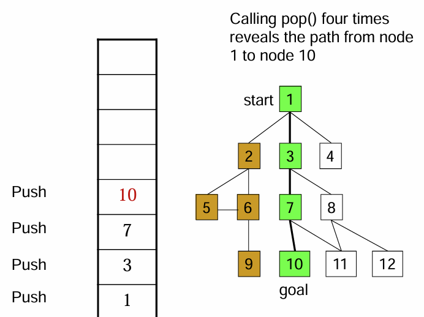

**Cycle Finding**
- Use a stack $S$ to keep track of the path between start vertex and current vertex
- As soon as a back edge $(v,w)$ is encountered, we return the cycle as the portion of the stack from the top to vertex $w$

```pseudocode
function cycleDFS(G, v, z):
	setLabel(v, VISITED)
	S.push(v)
	for all e in G.incidentEdges(v):
		if getLabel(e) == UNEXPLORED:
			w = opposite(v, e)
			S.push(e)
			if getLabel(w) == UNEXPLORED:
				setLabel(e, DISCOVERY)
				pathDFS(G, w, z)
				S.pop(e)
			else:
				T = Stack()
				repeat {
					T.push(o := S.pop())
				} until (o == w)
				return T.elements()
	S.pop(v)
```

**All Connected Components**
- If the graph is not connected, loop over all vertices, doing a **DFS** from each unvisited one to find all connected components

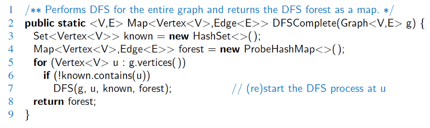

## 21. Breadth First Search

#### Breadth-First Search

**Overview**
- A general technique for traversing a graph that relies on a **queue** instead of a stack
- Visits nodes radially instead of going deep into one branch

**Algorithm**
```pseudocode
function BFS(G, s):

	L0 = []
	L0.addLast(s)
	setLabel(s, VISITED)
	i = 0

	while not L{i}.isEmpty():
		L{i+1} = []
		for all v in L{i}.elements():
			for all e in G.incidentEdges(v):
				if getLabel(e) == UNEXPLORED:
					w = opposite(v, e)
					if getLabel(w) == UNEXPLORED:
						setLabel(e, DISCOVERY)
						setLabel(w, VISITED)
						L{i+1}.addLast(w)
					else:
						setLabel(e, CROSS)
		i++

```

**Queue-Based Algorithm**

```pseudocode
function BFS(v, Q):
	Q.enqueue(v)
	v.visited = true
	while (!Q.empty()):
		Q.dequeue(v)
		for each vertex w adjacent to v:
			if (!w.visited):
				w.visited = true
				Q.enqueue(w)
```

- Running time is $O(|E| + |V|)$

**Terminology**
- A **discovery** edge is an edge in the traversal algorithm that is used to discover a new vertex
- A **back edge** $(v,w)$ is where $w$ is an ancestor of $v$ in the tree of discovery edges
- A **cross edge** $(v,w)$ is where $w$ is in the same level as $v$ or in the next level

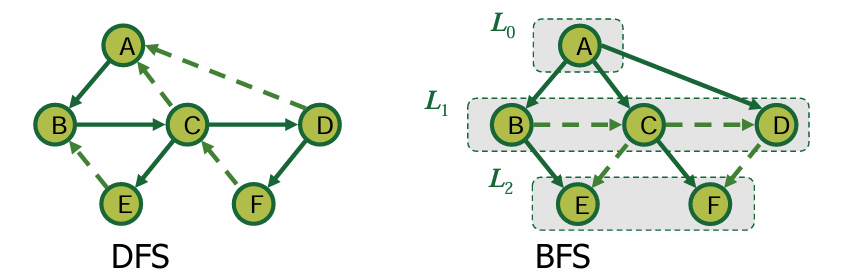

**Properties**
- Notation: $G_s$ = connected component of $s$
- **Property 1:**
	- `BFS(G, s)` visits all the vertices and edges of $G_s$
- **Property 2:**
	- The discovery edges labelled by `BFS(G, s)` form a spanning tree $T_s$ of $G_s$
- **Property 3:**
	- For each vertex $v$ in $L_i$:
		- *The path of $T_s$ from $s$ to $v$ has $i$ edges*
		- *Every path from $s$ to $v$ in $G_s$ has at least $i$ edges*

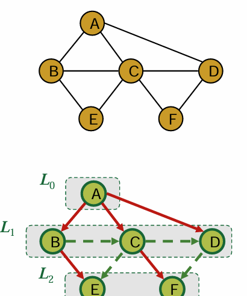

**Running time**
- Setting/getting a vertex/edge label takes $O(1)$ time
- Similarly to **DFS**, each vertex is labelled twice and each edge is labelled twice
- Each vertex is inserted once into a sequence $L_i$
- Hence `BFS` runs in $O(n+m)$ time provided the graph is represented by the adjacency list structure

**Applications**
- Compute connected components of $G$
  Compute a spanning forest of $G$
- Find a simple cycle in $G$
- Find path in $G$ between two vertices of $G$ with minimum number of edges

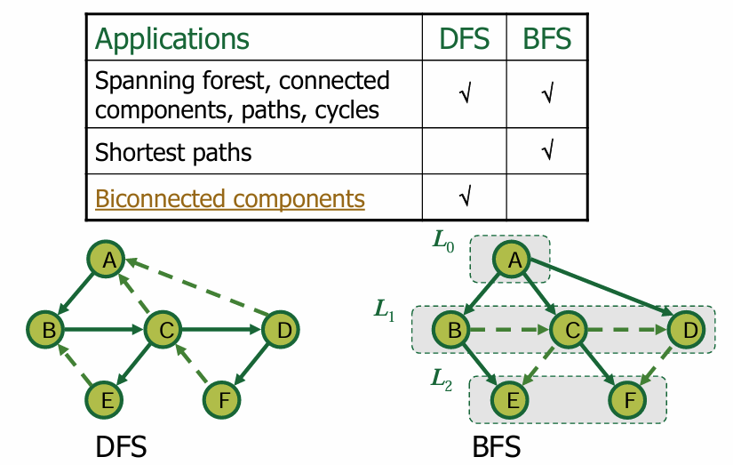

## 22. Directed Graphs

#### Digraphs

**Overview**
- A **digraph** is short for "directed graph", i.e. a graph whose edges are all directed
- Applications:
	- *one-way streets*
	- *flights*
	- *task scheduling*
- The **outgoing** edges of a vertex $v$ are the directed edges whose origin is that vertex, vice versa for **incoming** edges
- The `in-degree` and `out-degree` of a vertex are the number of incoming and outgoing edges respectively

**Properties**
- A graph $G=(V,E$) such that:
	- Each edge goes in **one-direction**
	- Edge $(a,b)$ goes from $a$ to $b$, but not from $b$ to $a$
- If $G$ is simple, $m \le n\cdot(n-1)$ instead of $m \le n \cdot (n-1)/2$ for an undirected graph
	- This is because we can have forwards and backwards edges, so the number of possible edges doubles
- If we keep in-edges and out-edges in separate adjacency lists, we can perform listing of incoming & outgoing edges in time proportional to their size

**Application - Scheduling**
- Edge $(a,b)$ means task $a$ must be completed before task $b$ can start

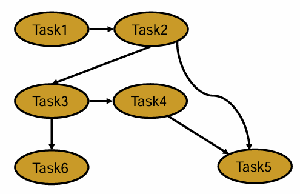

**Traversals**
- We can specialise the traversal algorithms (`DFS` and `BFS`) to digraphs by traversing edges only along their direction
- Four types of edges:
	- **discovery edges**
	- **back edges**
	- **cross-edges**
	- **forward edges**
- A directed DFS starting at vertex $s$ determines the vertices **reachable** from $s$

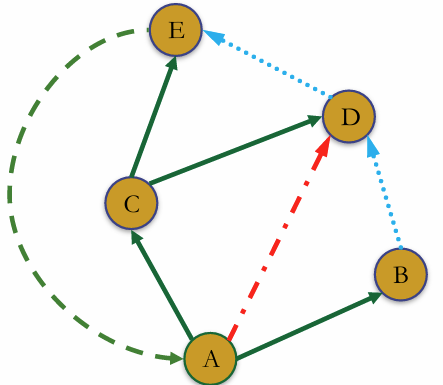

#### DAGs and Topological Ordering

**Directed Acyclic Graphs**
- A **directed acyclic graph** (DAG) is a directed graph without a cycle
- Applications:
	- Prerequisites between modules
	- Inheritance between classes in OOP
	  Scheduling tasks of a project

**Topological Ordering**
- A *topological ordering* of a digraph $g$ is a numbering $v_1, \cdots, v_n$ of its vertices such that all edges $(v_i, v_j)$ have $i < j$
- E.g. in a task scheduling digraph, a topological ordering traverses the vertices in increasing order
- **Theorem** - *A digraph admits a topological ordering if and only if it is a DAG*

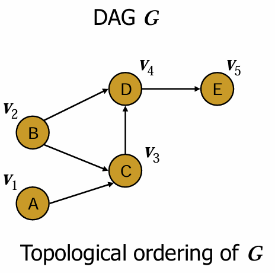

**Topological Sorting**
- A **topological sorting** algorithm is an algorithm that computes a *topological ordering* of a DAG
	- i.e. Number vertices, so that $(u,v) \in E \implies u < v$

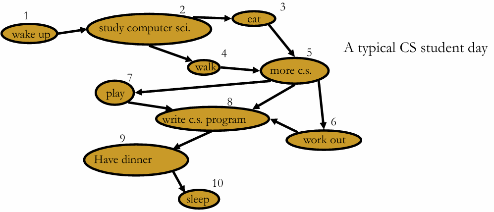

**Algorithm - DFS**

```pseudocode
function topologicalDFS(G, v):
	setLabel(v, VISITED)
	for all e in G.outEdges(v):
		w = opposite(v, e)
		if getLabel(w) == UNEXPLORED:
			topologicalDFS(G, w)
	Label v with topological number n
	n--
```

- **Intuition:**
	- `DFS` will keep traversing a path until it reaches a node that has no more out edges. Hence we can safely label it as the biggest number
	- We backtrack and number more nodes to satisfy the dependencies
	- Lastly we number the node we are on, and keep going back to the starting node

- Time complexity: $O(n+m)$ because we are using a `DFS`

**Example**

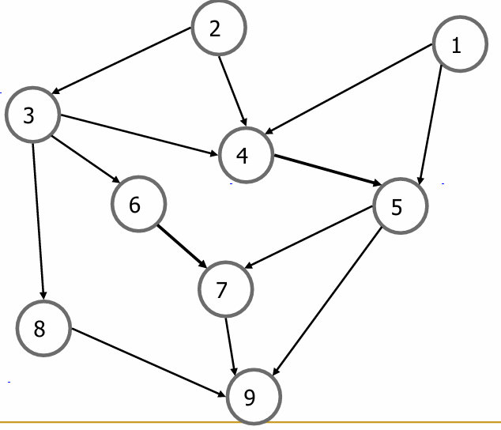
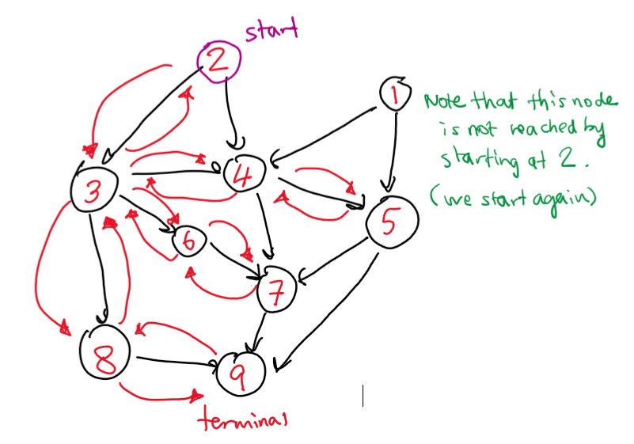

**Algorithm - using a Map**
- An alternative approach uses a map `inCount` to map a vertex $v$ to the number of incoming edges that are **not** in the topological order `topo`
	- Can be done in $O(1)$ time
- Use **stack** to process vertices where `inDegree = 0`
	- Vertices with no more incoming edges
	- There is always a vertex with in degree 0, because we are working with a **DAG** (otherwise there will be a cycle)
- Algorithm detects whether graph contains a cycle
	- Terminates without ordering all vertices of $G$
- Running time is also $O(n+m)$, where $G$ is represented using an adjacency list

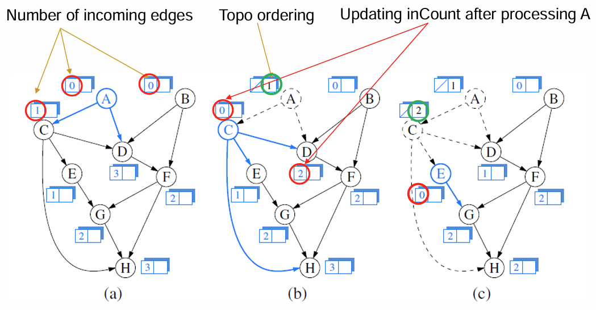
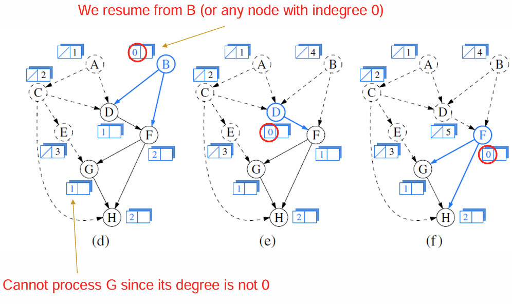

## 23. Reachability

#### Reachability

**Reachability**
- *Reachability* is whether there exists a path between two vertices in a graph
- We can use graph traversal algorithms `DFS`, `BFS` to see if another vertex can be reached from a given vertex with cost $O(|V| + |E|)$

**Strong Connectivity**
- A *digraph* is strongly connected if every vertex can reach all other vertices
- Algorithm:
	1. Pick a vertex $v$ in $G$
	2. Perform a **DFS** from $v$ in $G$. If there is a node $w$ that is not visited, return false
	3. Let $G'$ be $G$ with edges reversed
	4. Perform a **DFS** from $v$ in $G'$. If there is a node $w$ that is not visited, return false.
	5. Return True
- Running time is $O(|V| + |E|)$ as we do two depth first searches

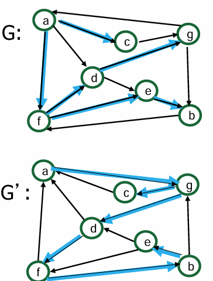

**Strongly Connected Components**
- SCCs are *maximal subgraphs* such that the subgraph is strongly connected, i.e. each vertex can reach all other vertices in the subgraph
- The previous algorithm is not efficient for finding all SCCs in a digraph

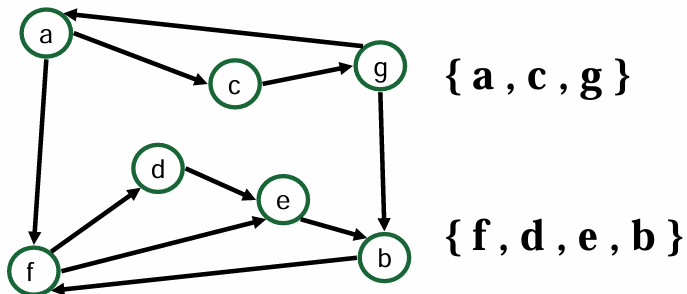

**Finding SCCs of a Graph**
- **Kosoraju's Algorithm**
	- Slight modification of previous algorithm
	1. Run DFS on $G$ and mark the finish times for all vertices
	2. Compute $G'$ by reversing the edges of $G$
	3. Run DFS on $G'$ in the order of decreasing finish times
	4. Each DFS traversal tree from the previous step represents a SCC
- **Tarjan's Algorithm**
	- Use a stack to determine the **SCCs**

#### Transitive Closure

**Overview**
- Given a digraph $G$, the *transitive closure* of $G$ is the digraph $G^*$ such that:
	- $G^*$ has all the same vertices as $G$
	- If $G$ has a directed path from $u \to v$ ($u \ne v$), $G*$ has a **directed edge** from $u$ to $v$
	- The transitive closure provides reachability information about a digraph

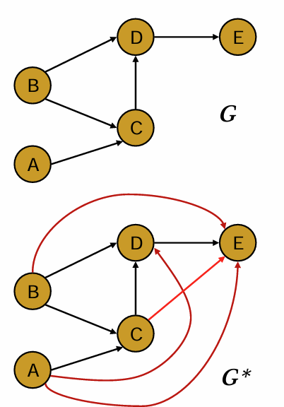

**Computing the Transitive Closure**
- We can perform DFS starting at each vertex
	- We represent $G$ using an adjacency list or adjacency map in case the graph is sparse
	- The time complexity is $O(n \times (n+m))$ as we compute DFS $n$ times, $|V| = n$ and $|E| = m$
- Reachability Matrix
	- In the case the graph is **dense**, we can compute the *reachability matrix* of a graph $G$ with $n$ vertices:
	$$R = A + A^2 + A^3 + \cdots + A^n$$
	- $R[i,j] = 1$ iff there is a path between node $i$ and node $j$
	- When computing $R$, we can use the logical **OR** instead of $+$ and the logical **AND** instead of $\times$

**Reachability Matrix**

- We can prove by induction that $A^n[i, j] = 1$ iff there is a path of length $n$ from $i$ to $j$

- **Proof:**
	- Base Case - $A^1[i,j]$ = $A[i,j]$ = there is an edge $i \to j$, the same thing as there is a path of length $1$ from $i \to j$.
	- Assume that $A^k[i,j] \iff$ there is a path of length $k$ from $i \to j$
	- Consider $A^{k+1}[i,j] = \exists x \in \{1, ..., n\} : A^k[i,x] \land A^1[x,j]$
		- By the inductive hypothesis, $A^{k+1}[i,j]$ is true iff there exists a path of length $k$ from $i \to x$ and an edge from $x \to j$.
		- This is the same as saying there exists a path of length $k+1$ from $i$ to $j$
		- Inductive step complete

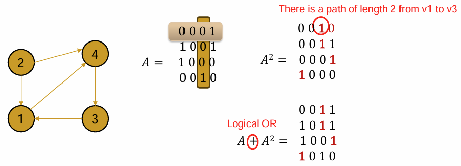

- Note that if we expand $A^n[i,j]$ to contain natural numbers, we have that $A^n[i,j]$ contains the number of paths from $i \to j$ of length $n$. The proof is similar, by induction

- By taking the bitwise **OR** of all of these matrix powers, we cover all lengths of paths
- Note that the last term $A^n$ indicates whether there is a path from a node to itself (i.e. a cycle)
	- This is because the directed graph is **simple**, so we cannot have an edge from a node to itself

- The cost of computing $A^2$ is $O(n \times n^2)$ since each element in $A^2$ requires $O(n)$ basic operations to be computed (assuming basic matrix multiplication method)
- Hence the cost of computing the transitive closure $R$ is $O(n \times n^3)$

- This can be sped up to $O(n^3 \log n)$ using matrix multiplication using the below algorithm:

```pseudocode
T := A
repeat log n times:
	T := T | (T x T)
```

- *However we can do even better using Warshall's Algorithm which is $\Theta(n^3)$ but this is outside the scope of the exam*

