# 1. Number Systems

## 1.1 Integers

#### Bases

**Binary to Decimal Conversion**
- The string $b_nb_{n-1}\cdots b_2b_1b_0$ of bits represents:
$$(b_n \times 2^n) + (b_{n-1} \times 2^{n-1}) + \cdots + (b_2 \times 2^2) + (b_1 \times 2) + b_0$$
**Decimal to Binary Conversion**
- Divide repeatedly by $2$ to get remainders $r_0, r_1, r_2, \cdots, r_n$
- The binary representation is then $r_nr_{n-1}\cdots r_2r_1r_0$.
- The *last* remainder is the *first* digit of the representation in the new base

**General Conversion Algorithms**
- Convert to base $b$:
	- Let $b > 1$ be an integer. To convert a `base-10` representation to `base-b`, divide repeatedly by $b$, converting the remainders $r_1, r_2, \cdots, r_n$ to digits in base $b$.
	- The base $b$ representation is $r_nr_{n-1}\cdots r_2r_1$
- Convert to base $10$, compute:
$$x_nb^n + x_{n-1}b^{n-1}+\cdots+x^2b^2 + x1b + x_0$$

#### Division

**Division Algorithm**
- If $a, b \in \mathbb{Z}, b \ne 0$ then there are unique numbers $q, r \in \mathbb{Z}$ with:
	$$a = qb + r \space \text{and} \space 0 \le r < |b|$$
- $q$ is called the *quotient* and $r$ is the *remainder*

**Greatest Common Divisor**
- If $a$ and $b$ are integers with $a = qb$ for some integer $q$, then we say that *b divides a*, or $b | a$.
- The *greatest common divisor* of two integers is the largest integer which divides them both, denoted $\gcd(m,n)$
- Note that $\gcd(0,n) = n$ for every $n > 0$
- Properties of $\gcd$:
	- $\gcd$ is commutative - $\gcd(a, b) = \gcd(b, a)$
	- $\gcd$ is associative - $\gcd(a, \gcd(b, c)) = \gcd(\gcd(a, b), \gcd(c))$
	- $\gcd$ closely relates to $\text{lcm}$, the lowest common multiple of two numbers: 

	$$\text{lcm}(a,b) = \frac{a \times b}{\gcd(a, b)}$$

**Euclidean Algorithm**

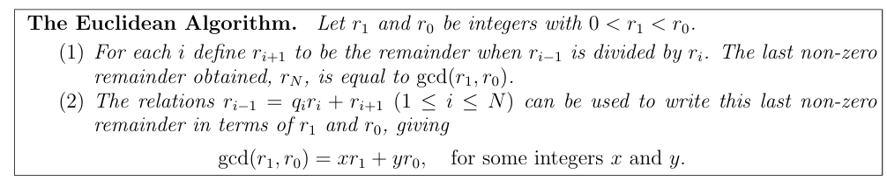

```pseudocode
function gcd(a, b):
	while (b != 0):
		if a > b:
			a = a - b
		else:
			b = b - a
	return a
```

#### Modular Arithmetic

**Modular Arithmetic**
- Let $n > 1$ be an integer
- We say that two integers $a$, $b$ are congruent modulo $n$ as $a \equiv b \pmod n$ if $a - b$ is an integer multiple of $n$, i.e. $a = b + kn$ where $k$ is an integer

**Operations**
- Two congruences with the same modulus $n$ can be added, subtracted and multiplied just like ordinary equations

#### Computer Representation of Integers

**Two's Complement**
- If the binary string representing a positive integer $m$ is known, the string representing $-m$ can be found from the fact:
$$-m \equiv ((2^N - 1) - m) + 1$$
- where $2^N - 1$ is a string of $N$ $1$'s
- Equivalently, we swap $0$'s and $1$'s in the string representing $m$ and then add $1$

## 1.2 Real Numbers

#### Real Numbers

**Overview**
- The real numbers $\mathbb{R}$ corresponds to point an infinite straight number line
- Rational numbers belong to the set $\mathbb{Q}$ and have the form $\frac{m}{n}$, $m$,$n$ are integers and $n \ne 0$. We can always choose $m$ and $n$ so that $n \ge 1$ and $\gcd(m,n) = 1$. Note that $\mathbb{Q} \subseteq \mathbb{R}$

**Irrational Numbers**
- **Theorem**: there is no rational number $x$ with $x^2 = 2$
- **Proof**: 
	- Suppose that there is a rational number $x$ with $x^2 = 2$
	- Then we can write $x = \frac{m}{n}$, $m$ and $n$ are integers with $\gcd(m,n) = 1$
	  This gives:
	$$\frac{m^2}{n^2} = 2 \space \text{or} \space m^2 = 2n^2$$
	- Hence $m^2$ is even, so $m$ is even. We can write $m = 2k$ for some integer $k$, which gives $4k^2 = 2n^2$ or $n^2 = 2k^2$. Hence $n^2$ is even so $n$ must be even
	- This is a contradiction as $\gcd(m, n) = 1$ by assumption but we showed that $\gcd(m,n)$ is at least 2.

**Types of Numbers**
- Real numbers that are solutions of polynomial equations with *rational* coefficients are called ***algebraic numbers***
- Real numbers that cannot be solutions of polynomial equations with rational coefficients are called ***transcendental numbers***

**Decimal Expansion**
- Every real number can be thought of the **limit** of a sequence of rational numbers.
- Every real number $x$ has a decimal expansion leading to a sequence of rational numbers converging to $x$
- E.g. $\pi = \lim{(3, 3.1, 3.14, 3.141, 3.1415, 3.14159, \cdots)}$

#### Axioms of Real Number System

**Axioms**
1. *Commutativity* - $x + y = y + x$, and $x \times y = y \times x$
2. *Associativity* - $x + (y + z) = (x + y) + z$ and $x \times (y \times z) = (x \times y) \times z$
3. *Distributivity* of $\times$ over $+$ : $x \times (y + z) = x \times y + x \times z$
4. *Additive Identity*: There exists $0 \in \mathbb{R}$ such that $x + 0 = x$
5. *Multiplicative Identity*: There exists $1 \in \mathbb{R}$ such that $x \times 1 = x$
6. *The multiplicative and additive identities are distinct*
7. *Every element has an additive inverse*: There exists $(-x) \in \mathbb{R}$ such that $x + (-x) = 0$
8. *Every non-zero element has a multiplicative inverse*
	- If $x \ne 0$ then there exists $x^{-1} \in \mathbb{R}$ such that $x \times x^{-1} = 1$
9. *Transitivity of ordering* - If $x < y$ and $y < z$ then $x < z$
10. *Trichotomy law* - Exactly one of $x < y$, $y < x$ or $x = y$ is true
11. Preservation of ordering under addition: If $x < y$ then $x + z < y + z$
12. *Preservation of ordering under multiplication*: If $z > 0$ and $x < y$ then $x \times z < y \times z$
13. ***Completeness***
	- Every non-empty subset of $\mathbb{R}$ that is bounded above has a least upper bound (supremum)

**Exercise - Prove** $0 < 1 \in \mathbb{R}$
- By the *trichotomy law*, we have exactly one of $0 = 1$, $0 < 1$ or $0 > 1$ is true
- The *multiplicative and additive identities are distinct* law states that $0 \ne 1$
- Now assume $0 > 1$ for a contradiction.
	- If $0 > 1$ then $0 + (-1) > 0 + (-1)$ by *preservation of ordering under addition*
	- Hence we have $-1 > 0$
	- **Lemma**: $x \times 0 = 0$.
	- **Proof:**
		- $x = x \times 1 = x \times (1 + 0) = x \times 1 + x \times 0$
		- We have $x = x + x \times 0$
		- So $x \times 0 = 0$
	- By the lemma, $(-1)(-1) > (-1)(0)$ by *preservation of ordering under multiplication*
	- Hence we have $1 > 0$. This is a contradiction
- Therefore $0 > 1$ must be false. Hence $0 < 1$ is the only option, so it is true

#### More Definitions

**Roots**
- Let $n$ be an integer with $n \ge 1$. For any real number $a \ge 0$ there is exactly one $x \ge 0$ with $x^n = a$. This number $x$ is called the *nth-root* of $a$ and is denoted $a^{1/n}$
- For any $a,b \in \mathbb{R}, a, b \ge 0$ and any integer $n \ge 1$, we have:
$$a < b \iff a^{1/n} < b^{1/n}$$
**Modulus**
$$|x| = \begin{cases} x & \text{if} \space x \ge 0 \\ -x & \text{if} \space x < 0\end{cases}$$
- Note that $|x| = \sqrt{x^2}$ for all real numbers $x$
- **Properties:**
	1. $-|x| \le x \le |x|$
	2. $|xy| = |x||y|$
	3. $|x + y| \le |x| + |y|$ - the triangle inequality
	4. $||x| - |y|| \le |x - y|$

**Upper bound, Lower Bound, Supermum, Infimum**
- *Upper Bound*
	- A real number $u$ is an *upper bound* of $S$ if $x \le u$ for all $x \in S$.
- *Lower Bound*
	- A real number $l$ is a *lower bound* of $S$ if $l \le x$ for every $x \in S$
- *Supremum* (least upper bound)
	- $U$ is the *supermum* of $S$ if $U$ is an upper bound of $S$ and $U \le u$ for every upper bound $u$ of $S$
- Infimum (greatest lower bound)
	- $L$ is the *infimum* of $S$ if $L$ is a lower bound of $S$ and $l \le L$ for every lower bound $l$ of $S$

#### Completeness Axiom

**Completeness Axiom**
- The *completeness axiom* of $\mathbb{R}$ states that every non-empty set of real numbers which has a upper bound has a supremum
- We can further show that every non-empty set of real numbers which has a lower bound has an infimum
- One important consequence is the *Archimedean property of the reals*

**Archimedean Property of $\mathbb{R}$**
- If $\epsilon$ is a real number with $\epsilon > 0$ then there is an integer $n > 0$ with $n\epsilon > 1$
- **Proof**
	- Assume that $\epsilon, 2\epsilon, 3\epsilon, 4\epsilon, \cdots$ is bounded above by $1$ for a contradiction
	- $\implies$ $S = \{\epsilon, 2\epsilon, 3\epsilon, \cdots\} \le 1$
	- $\implies$ There **must** be a smallest upper bound $l$ by the *completeness axiom*
	- But for every $n$, $n\epsilon = (n+1)\epsilon - \epsilon \le l - \epsilon$
	- So for every $n$, $l - \epsilon$ is an upper bound of a set. But since $l - \epsilon$ is smaller than $l$, $l$ is not the supremum.
	- This is a contradiction!

**Other consequences**
- Between two distinct real numbers there are both rational and irrational numbers
- Every real number can be represented by a possibly infinite decimal expansion

## 1.3 Complex Numbers

#### Complex Numbers

**Overview**
- A complex number is a number of the form $a + ib$  where $i^2 = -1$
- $a$ is the *real part*
- $b$ is the *imaginary part*
- $\mathbb{C}$ is the set of all complex numbers
- Represented by an ordered pair $(a, b)$ of real numbers

**Complex Conjugate**
- The *complex conjugate* of $a + ib$ is defined to be $a-ib$.
- If $z \in \mathbb{C}$, then $\bar{z}$ is the complex conjugate
- In an *Argand Diagram*, taking the complex conjugate reflects the number in the real axis
- Properties:
	1.  $\overline{z+w} = \bar{z} + bar{w}$
	2. $\overline{zw} = \bar{z}\bar{w}$
	3.  $\overline{z/w} = \bar{z}/\bar{w}$
	4.  $\bar{\bar{z}} = z$
	5.  $z \in \mathbb{R} \iff z = \bar{z}$
- Reciprocal of complex numbers:
$$\frac{1}{a+ib} = (\frac{a}{a^2+b^2}) - i(\frac{b}{a^2+b^2})$$
**Polar Form**
- If $x + iy \ne 0$, then we can express it in polar form:
$$x+iy = r(\cos \theta + i\sin\theta)$$
- where $r = \sqrt{x^2+y^2}$ and $\tan \theta = \frac{y}{x}$
- $\theta$ is the *argument* of $x+iy$
- $r$ is the *modulus* of $x+iy$ and is denoted $|x+iy|$
- Properties:
	1. $|z| = |\bar{z}|$
	2. $|z| = \sqrt{z \bar{z}}$
	3. $z\bar{z} = |z|^2$
	4. $|zw| = |z||w|$
	5. $|z + w| \le |z| + |w|$ (the triangle inequality)
	6. $||z| - |w|| \le |z-w|$
- **Multiplying**
$$(\cos \theta + i\sin\theta)(\cos\phi + i\sin\phi) = \cos(\theta+\phi) + i\sin(\theta+\phi)$$

**De Moivre's Theorem**
- For any integer $n$:
	$$(\cos\theta + i\sin\theta)^n = \cos n\theta + i \sin n\theta$$
- Can be proved by induction, then we separately prove the negative case

**Roots of Unity**
- Solutions of $z^n = 1$ are:
$$\cos(\frac{2\pi}{n}k) + i\sin(\frac{2\pi}{n}k)$$
- where $k \in \{0, \cdots, n-1\}$
- There are $n$ solutions

**Fundamental Theorem of Algebra**
- Every polynomial equation of degree $n$ with complex coefficients has exactly $n$ complex solutions, where some of which may be identical
$$a_nz^n + a_{n-1}z^{n-1} + \cdots + a_2z^2 + a_1z + a_0 = a_n(z - \lambda_1)(z-\lambda_2)\cdots(z-\lambda_n)$$
- where $\lambda_1, \lambda_2, \cdots, \lambda_n$ are the roots of the polynomial

# 2. Linear Algebra and Matrices

## 2.1 Introduction to Vectors

#### Introduction

**Vectors**

- Vectors in *two* and *three* dimensional space are defined to be members of the sets $\mathbb{R}^2$ and $\mathbb{R}^3$:
	- $\mathbb{R}^2 = \{(x, y) \space | \space x, y \in \mathbb{R}\}$
	- $\mathbb{R}^3 = \{(x,y,z)\space  | \space x, y, z \in \mathbb{R}\}$
	
- Addition of vectors is defined as component-wise addition:
	$$\textbf{a} = (a_1, a_2), \textbf{b} = (b_1, b_2), \textbf{a + b} = (a_1 + b_1, a_2 + b_2)$$
	- Geometric interpretation: draw vector $\textbf{a}$ from origin, and draw vector $\textbf{b}$ from tip of $\textbf{a}$. The tip to tail vector is $\textbf{a + b}$.
	
- Scalar multiplication is defined as component-wise multiplication by a number
	$$\textbf{a} = (a_1, a_2), \lambda\textbf{a} = (\lambda a_1, \lambda a_2)$$
	- Geometric interpretation: scale the vector $\textbf{a}$ by scale factor $\lambda$

**Position Vectors**
- If $\textbf{p} = (p_1, p_2)$, we identity $P$ as the endpoint of the vector, $(p_1, p_2)$ and $\textbf{p}$ as the position vector of the point $P$.

**Length and Distance**
- If $\textbf{a} = (a_1, a_2)$ then the *length* $|\textbf{a}|$ is:
$$|\textbf{a}| = \sqrt{a_1^2 + a_2^2}$$
- This generalises to three dimensions by adding $a_3^2$ under the square root
- A vector is called a *unit vector* if its length is $1$
- The *distance* between vectors $\textbf{a}, \textbf{b}$ is defined to be $|\textbf{b}-\textbf{a}|$

#### Scalar Product

**Overview**
- The *scalar* product of vectors $\textbf{a} = (a_1, a_2) and \textbf{b} = (b_1, b_2)$ is:
$$\textbf{a}\cdot\textbf{b} = a_1b_1 + a_2b_2$$
$$\cos \theta = \frac{\textbf{a}\cdot\textbf{b}}{|\textbf{a}||\textbf{b}|}$$
- where $\theta$ is the angle between the two vectors
- In higher dimensions, the two vectors live on a plane, so $\theta$ always exists
- Two vectors are *orthogonal* or perpendicular if their scalar product is $0$

**In General**
$$\textbf{a}\cdot\textbf{b} = |\textbf{a}||\textbf{b}|\cos \theta$$
- where $\theta$ is the angle between $\textbf{a}$ and $\textbf{b}$

## 2.2 Linear Combinations and Subspaces

#### Linear Combinations

**Linear Combinations**

- If $\textbf{u}_1, \textbf{u}_2, \cdots, \textbf{u}_m$ are vectors in $\mathbb{R}^n$ and $\alpha_1, \alpha_2, \cdots \alpha_m$ are real numbers, then any vector of the form:
	$$\alpha_1\textbf{u}_1 + \alpha_2\textbf{u}_2 + \cdots + \alpha_m\textbf{u}_m$$
	
- is called a *linear combination* of $\textbf{u}_1, \textbf{u}_2, \cdots, \textbf{u}_m$
- For example $(5, 3)$ is a linear combination of $(1,0)$ and $(0, 1)$

**Equality of Vectors**
	$\textbf{u} = \textbf{v} \iff |\textbf{u} - \textbf{v}| = 0$
		  $\iff |(u_1, u_2, \cdots, u_n) - (v_1, v_2, \cdots, v_n) = 0$
		  $\iff (u_1 - v_1)^2 + (u_2 - v_2)^2 + \cdots + (u_n - v_n)^2 = 0$
		  $\iff u_1 - v_1 = 0 \land u_2 - v_2 = 0 \land \cdots \land u_n - v_n = 0$
		  $\iff u_1 = v_1 \land u_2 = v_2 \land \cdots \land u_n = v_n$
- Hence *equality of vectors* is defined as the vectors are component-wise equal

#### Span and Subspaces

**Span**

- If $U = \{\textbf{u}_1, \textbf{u}_2, \cdots, \textbf{u}_m\}$ is a finite set of vectors in $\mathbb{R}^n$, then the **span** $\text{span} \space U$ is the set of all **linear combinations** of $\textbf{u}_1, \textbf{u}_2, \cdots, \textbf{u}_m$

$$\text{span}\space U = \{\alpha\textbf{u}_1 + \alpha_2\textbf{u}_2 + \cdots + \alpha_m\textbf{u}_m \space | \space \alpha_1, \alpha_2, \cdots, \alpha_m \in \mathbb{R}\}$$
- Examples:
	- If $U = \{\textbf{u}\}$ contains just a single vector, $\text{span} \space U = \{\alpha\textbf{u} \space | \space \alpha \in \mathbb{R}\}$ is the set of all multiples of $\textbf{u}$, i.e. a line
	- In $\mathbb{R}^2$ if $U = \{(1, 0), (0, 1)\}$ then the span of $U$ is $\mathbb{R^2}$ because $(x,y) = x(1,0) + y(0,1)$ for all $x, y \in \mathbb{R}$
	- If $\textbf{u}, \textbf{v}$ are not parallel, $\text{span} \space \{\textbf{u}, \textbf{v}\}$ is the plane containing the two vectors $\textbf{u}, \textbf{v}$ and the origin.

**Subspaces**

- A subspace of $\mathbb{R}^n$ is a non-empty subset $S \subseteq \mathbb{R}^n$ such that:
	1. *Closure under addition*
		- $\textbf{u}, \textbf{v} \in S \implies \textbf{u} + \textbf{v} \in S$
	2. *Closure under scalar multiplication*
		- $u \in S, \lambda \in \mathbb{R} \implies \lambda \textbf{u} \in S$
- It follows by induction on $m$ that if $S$ is a subspace and $\textbf{u}_1, \textbf{u}_2, \cdots, \textbf{u}_m \in S$, then any linear combination of $\textbf{u}_1, \textbf{u}_2, \cdots, \textbf{u}_m$ also belongs to $S$
- Two examples of subspaces of $\mathbb{R}^n$
	- The set containing the *zero vector*, $\{\textbf{0}\}$, is a subspace
		- The zero vector $\textbf{0} = (0, 0, \cdots, 0)$
	- The set $\mathbb{R}^n$ is a subspace

**Properties of Subspaces**
1. Every subspace of $\mathbb{R}^n$ contains the zero vector
2. If $U$ is a non-empty finite subset of $\mathbb{R}^m$, then the span of $U$ is a subspace of $\mathbb{R}^n$ and is called the subspace *spanned* or *generated by* $U$.

## 2.3 Linear Independence

#### Linear Independence

**Linear Dependence and Independence**

- A set $\{\textbf{u}_1, \textbf{u}_2, \cdots, \textbf{u}_m \}$ of vectors in $\mathbb{R}^n$ is **linearly dependent** if there are numbers $\alpha_1, \alpha_2, \cdots, \alpha_m \in \mathbb{R}$ that are **not all zero** with:
$$\alpha_1\textbf{u}_1 + \alpha_2\textbf{u}_2 + \cdots + \alpha_m\textbf{u}_m = \textbf{0}$$

- A set is called *linearly independent* if it is not linearly dependent

- A set $\{\textbf{u}_1, \textbf{u}_2, \cdots, \textbf{u}_m\}$ of vectors in $\mathbb{R}^n$ is **linearly independent** if whenever the only solution to the equation
	$$\alpha_1\textbf{u}_1 + \alpha_2\textbf{u}_2 + \cdots + \alpha_m\textbf{u}_m = \textbf{0}$$
- is that each of the coefficients $\alpha_1, \alpha_2, \cdots, \alpha_m$ are equal to $0$.

**Examples**
1. If $\textbf{u} \ne \textbf{0}$, then the set $\{\textbf{u}\}$ is *linearly independent*
	- If $\alpha\textbf{u} = \textbf{0}$ then since $\textbf{u} \ne \textbf{0}$ we must have $\alpha = 0$
2. Any set containing the zero vector is linearly dependent
	- We can set the coefficient of the *zero vector* to any number, and set all the other coefficients to 0.
	- This will give a linear combination of $\textbf{0}$, and there is a non-zero coefficient.

**Theorem:** $2$ vectors $\textbf{u}, \textbf{v}$ are linearly dependent **iff**  $\textbf{u}$, $\textbf{v}$ are multiples of each other (fall onto the same line geometrically)

**Proof:**
- *forwards* direction:
	- *linearly dependent* $\implies$ $\alpha\textbf{u} + \beta\textbf{v} = \textbf{0}$ where $\alpha = 0$ and $\beta \ne 0$ (other way around is also possible, WLOG)
	- $\implies \frac{\alpha}{\beta}\textbf{u} + \textbf{v} = \textbf{0}$
	- $\implies \textbf{v} = -\frac{\alpha}{\beta}\textbf{u}$
- *backwards* direction:
	- $\textbf{u} = \gamma\textbf{v}$ where $\gamma \ne 0$
	- $\textbf{u} - \gamma\textbf{v} = \textbf{0}$
	- So we can choose $\alpha = 1, \beta = -\gamma$ where $\beta \ne 0$
**End**

#### Predecessor Theorem

**Theorem**: A set $\{\textbf{u}_1, \textbf{u}_2, \cdots, \textbf{u}_m\}$ of non-zero vectors is linearly dependent **iff** some $\textbf{u}_r$ is a linear combination of its predecessors $\textbf{u}_1, \textbf{u}_2, \cdots, \textbf{u}_{r-1}$

**Proof:**
- *forwards* direction
	- *linearly dependent* $\implies$ $$\beta_1\textbf{u}_1 +\beta_2\textbf{u}_2 + \cdots +\beta_r\textbf{u}_r + \cdots + \beta_m\textbf{u}_m = \textbf{0}$$
	- where $\beta_r$ is the last non-zero coefficient, i.e. $\beta_{r+1}, \cdots, \beta_m = 0$

	- **Claim**: $r \ne 1$ 
	- **Proof:**
		- If $r = 1$, then $\beta_1\textbf{u}_1 + 0\cdot\textbf{u}_2 + \cdots + 0\cdot\textbf{u}_m = \textbf{0}$
		- $\implies \beta_1\textbf{u}_1 = \textbf{0}$
		- $\textbf{u}_1 \ne \textbf{0}$ so $\beta_1 = 0$, this is a contradiction!

	- We can eliminate the redundant vectors: $$\beta_1\textbf{u}_1 + \cdots + \beta_r\textbf{u}_r = \textbf{0}$$
	- Now, dividing by $\beta_r$: $$\frac{\beta_1}{\beta_r}\textbf{u}_1 + \frac{\beta_2}{\beta_r}\textbf{u}_2 + \cdots + \frac{\beta_{r-1}}{\beta_r}\textbf{u}_{r-1} + \textbf{u}_r = \textbf{0}$$
	- Therefore: $$-\frac{\beta_1}{\beta_r}\textbf{u}_1 - \frac{\beta_2}{\beta_r}\textbf{u}_2 - \cdots - \frac{\beta_{r-1}}{\beta_r}\textbf{u}_{r-1} = \textbf{u}_r$$
	- Hence $\textbf{u}_r$ is a linear combination of its predecessors
	
- *backwards* direction
	- $\exists \textbf{u}_r$ s.t. $\textbf{u}_r = \gamma_1\textbf{u}_1 + \gamma_2\textbf{u}_2 + \cdots + \textbf{u}_{r-1}\textbf{u}_{r-1}$
	- Hence: $$1\textbf{u}_r -\gamma_1\textbf{u}_1 - \gamma_2\textbf{u}_2 - \cdots - \gamma_{r-1}\textbf{u}_{r-1} + 0\cdot\textbf{u}_r + \cdots + 0\cdot\textbf{u}_m = \textbf{0}$$
	- There is at least one coefficient that is not 0
	- Hence $\{\textbf{u}_1, \textbf{u}_2, \cdots, \textbf{u}_m\}$ are linearly dependent.
**End**

## 2.4 Basis and Dimension

#### Basis

**Basis**
- Let $S$ be a subspace of $\mathbb{R}^n$. A set of vectors is called a *basis* of $S$ if it is a **linearly independent** set which **spans** $S$
- To check if $\{\textbf{u}_1, \textbf{u}_2, \cdots, \textbf{u}_m\}$ is a basis:
	- check linear independence
	- check if it spans $S$
- For example:
	- Check if $\{(1, 0, 0), (0, 1, 0), (0, 0, 1)\}$ is a basis of $\mathbb{R}^3$
		- *Linear Independence*: $$\alpha(1, 0, 0) + \beta(0, 1, 0) + \gamma(0, 0, 1) = \textbf{0}$$
			- $\implies (\alpha, \beta, \gamma) = (0, 0, 0)$
			- $\implies$ they are linearly independent

		- *Span*:
			- $(x, y, z) = x(1,0,0) + y(0,1,0) + z(0, 0, 1)$
			- so they span $\mathbb{R^3}$

**Standard Basis**
- More generally, we define $\textbf{e}_r$ for $1 \le r \le n$ to be the vector with $r$th component $1$ and all other components $0$. The set $\{\textbf{e}_1, \textbf{e}_2, \cdots, \textbf{e}_n\}$ is then a basis for $\mathbb{R}^n$ called the *standard basis*

**Theorem**: Let $S$ be a subspace of $\mathbb{R}^n$. If the set $\{\textbf{v}_1, \textbf{v}_2, \cdots, \textbf{v}_m\}$ span $S$, then for any set of *linearly independent* subset of $S$ contains at most $m$ vectors. 

**Proof**

- Let $\{\textbf{w}_1, \textbf{w}_2, \cdot, \textbf{w}_p\}$ be a linearly independent of subset of $S$. We wish to show that $p \le m$

- Consider a vector $\textbf{w}_1 \in S$. Since the $\textbf{v}$'s span $S$, we can rewrite $\textbf{w}_1 \in S$ as a linear combination of them. 

- Now consider the  set $\{\textbf{w}_1, \textbf{v}_1, \cdots, \textbf{v}_m\}$. It spans $S$ as it contains all the $\textbf{v}$ vectors, which already span S. It is linearly dependent as $\textbf{w}_1$ is a linear combination of the $\textbf{v}$ vectors.

- By the **predecessor theorem**, some $\textbf{v}_i$ is a linear combination of its predecessors $\textbf{w}_1, \textbf{v}_1, \cdots, \textbf{v}_{i-1}$. It follows that the set obtained by removing $\textbf{v}_i$, $\{\textbf{w}_1, \textbf{v}_1, \cdots, \textbf{v}_{i-1}, \textbf{v}_{i+1}, \cdots, \textbf{v}_m\}$ also spans $S$.

- It now follows that the vector $\textbf{w}_2$ is a linear combination of the vectors in this set. Thus, $\{\textbf{w}_2, \textbf{w}_1, \textbf{v}_1, \cdots, \textbf{v}_{i-1}, \textbf{v}_{i+1}, \cdots, \textbf{v}_m\}$ is linearly dependent. Hence some vector must be a linear combination of its predecessors.

- This vector cannot be a $\textbf{w}$ vector since they are linearly independent, so it must be one of the $\textbf{v}$'s. Now we can remove another $\textbf{v}$ and still have a set which spans $S$.

- **Case 1:** *we run out of $\textbf{w}$ vectors*, i.e. $p < m$:
	- the set looks like $\{\textbf{w}_n, \textbf{w}_{n-1}, \cdots, \textbf{w}_1, \textbf{u}\}$.
	- The set still has size $m$, so $p \le m$.

- **Case 2:** we run out of $\textbf{v}$ vectors, i.e. p > m:
	- This process will stop when we run out of $\textbf{v}$'s, and leave some remaining $\textbf{w}$'s which have not been added.
	- That is, we have a spanning set $\{\textbf{w}_r, \cdots, \textbf{w}_2, \textbf{w}_1\}$ where $r < p$. But if this set spans $S$ then we must be able to write $\textbf{w}_p$ as a linear combination of $\{\textbf{w}_r, \cdots, \textbf{w}_2, \textbf{w}_1\}$, which is a contradiction, as the $\textbf{w}$'s are linearly independent!

- Therefore, we must have $p \le m$.
**End**

#### Dimension

**Relation to Theorem**
- An important consequence of the above theorem, is that any two *bases* for a subspace $S$ have the same number of elements.
- Suppose that $U = \{\textbf{u}_1, \textbf{u}_2, \cdots, \textbf{u}_p\}$ and $W = \{\textbf{w}_1, \textbf{w}_2, \cdots, \textbf{w}_q\}$ are two bases for $S$.
- Then $U$ spans $S$ and $W$ is a linearly independent subset of $S$ so $q \le p$.
- But $W$ also spans $S$ and $U$ is a linearly independent subset of $S$ so $p \le q$. Hence $p = q$.

**Dimension**
- The *dimension* of a subspace of $\mathbb{R}^n$ is the number of vectors in a basis for the subspace
- We can uniquely *define* the dimension since all bases of the subspace have the same number of basis vectors
- **NOTE** - the standard basis for $\mathbb{R}^n$ contains $n$ vectors, so $\mathbb{R}^n$ has dimension $n$.

#### Consequences and Theorems

**Constructing a Basis**
- We can use the **predecessor theorem** to construct a basis for a subspace.
- Let $\{\textbf{v}_1, \textbf{v}_2, \cdots, \textbf{v}_m\}$ be a set of nonzero vectors that span a subspace $S \subseteq \mathbb{R}^n$. Then removing each $\textbf{v}_i$ which is a linear combination of its predecessors will leave a basis for $S$.
- This works because each linearly dependent vector removed is a linear combination of the remaining ones, so the *span is not altered* by the removal.
- Also, the remaining vectors are linearly independent, since none is a linear combination of its predecessors.

**Determining whether a set is a basis**
- When the dimension of a subspace is known, we can decide whether a given set is a basis by counting the number of vectors

- Let $S$ be an $m$-dimensional subspace of $\mathbb{R}^n$, then:
	1. Any subset of $S$ containing more than $m$ vectors is linearly dependent.
	2. A subset of $S$ is a basis **iff** it is a linearly independent set containing *exactly* $m$ vectors.

- **Property (1)** is a consequence of the theorem above.
- **Property (2) Proof:**
	- Conversely, suppose we have a linearly independent subset $\{\textbf{v}_1, \cdots, \textbf{v}_m\}$ of $m$ vectors.
	- Suppose for a contradiction that it is not a basis.
	- Then it does not span $S$, so we can find a vector $\textbf{w} \in S$ which is not a linear combination of the $\textbf{v}$'s.
	- But now the set $\{\textbf{v}_1, \cdots, \textbf{v}_m, \textbf{w}\}$ is linearly independent, which contradicts **Property (1)**.
	- Hence $\{\textbf{v}_1, \cdots, \textbf{v}_m\}$ is a basis.

- In particular $S = \mathbb{R}^n$, we obtain:
- Any subset of $\mathbb{R}^n$ containing more than $n$ vectors is linearly independent. A subset of $\mathbb{R}^n$ is a basis **iff** it is a linearly independent set containing *exactly* $n$ vectors.

**Subspaces of $\mathbb{R}^2$**
1. There is only one $0$-dimensional subspace $\{\textbf{0}\}$
2. A $1$-dimensional subspace is spanned by a single nonzero vector. Hence this corresponds to the straight lines through the origin.
3. There is only one $2$-dimensional subspace -- $\mathbb{R}^2$ itself.

**Subspaces of $\mathbb{R}^3$**
1. $0$-dimensional subspace - $\{\textbf{0}\}$
2. $1$-dimensional subspaces - straight lines through origin
3. A $2$-dimensional subspace is spanned by two linearly independent vectors. Hence this corresponds to planes which contain the origin.
4. There is only one $3$-dimensional subspace -- $\mathbb{R}^3$ itself.

## 2.5 Matrix Algebra

#### Introduction to Matrices

**Matrices**
- A *matrix* is a rectangular array of objects.
- A matrix $\textbf{A}$ of order $m \times n$ is an array of numbers arranged in $m$ rows and $n$ columns written as:
$$\textbf{A} = \begin{bmatrix}a_{11}&a_{22}&\cdots&a_{1n}\\a_{21}&a_{22}&\cdots&a_{2n}\\\vdots&\vdots&\ddots&\vdots\\a_{m1}&a_{m_2}&\cdots&a_{mn}\end{bmatrix}\space \text{or} \space \textbf{A} = [a_{ij}]_{m\times n}$$

**Row and Column Vectors**
- A $m \times 1$ matrix is a called a *column vector*, while a $1 \times n$ matrix is called a *row vector*
$$\text{Column Vector: }\begin{bmatrix} a_{11}\\ a_{21}\\ \cdots \\ a_{m1}\end{bmatrix}; \hspace{1em}\text{Row Vector: }\begin{bmatrix}b_{11}&b_{12}&\cdots &b_{1n}\end{bmatrix}$$
#### Basic Matrix Operations

**Matrix Basics**
- Two matrices $\textbf{A}$ and $\textbf{B}$ are equal if they have the same *order* and all the corresponding elements are equal
- The sum $\textbf{A} + B$ is defined only when $\textbf{A}, \textbf{B}$ have the same order, and is obtained by adding the corresponding elements.
- Scaling a matrix $\textbf{A}$ by a scalar $\lambda$ is obtained by multiplying each element by the scalar
- The *zero matrix* of order $m \times n$ is the $m \times n$ matrix whose elements are all $0$ and is denoted by $\textbf{O}_{m \times n}$

**Properties of Addition and Scalar Multiplication**
1. $\textbf{A} + (\textbf{B} + \textbf{C}) = (\textbf{A} + \textbf{B}) + \textbf{C}$ - associativity of addition
2. $\textbf{A} + \textbf{O} = \textbf{A} = \textbf{O} + \textbf{A}$
3. $\textbf{A} + (-\textbf{A}) = \textbf{O} = (-\textbf{A}) +\textbf{A}$
4. $\textbf{A} + \textbf{B} = \textbf{B} + \textbf{A}$ - commutativity of addition
5. $(\lambda + \mu)\textbf{A} = \lambda\textbf{A} + \mu\textbf{A}$
6. $\lambda(\textbf{A} + \textbf{B}) = \lambda\textbf{A} + \lambda\textbf{B}$
7. $\lambda(\mu\textbf{A}) = (\lambda\mu)\textbf{A}$

**Matrix Multiplication**
- Defined *only* when the number of columns in the first is the same as the number of rows in the second
- If $\textbf{A} = [a_{ij}]_{m\times p}$ and $\textbf{B} = [b_{ij}]_{p \times n}$ then their product is the $m \times n$ matrix $\textbf{AB} = [c_{ij}]_{m \times n}$ where:
	$c_{ij} = \sum_{r=1}^p{a_{ir}b_{rj}} = (a_{i1}, a_{i2}, \cdots, a_{ip}) \cdot (b_{1j}, b_{2j}, \cdots, b_{pj})$
- i.e. the scalar product of the $i$th row vector of $\textbf{A}$ with the $j$th column vevtor of $\textbf{B}$.

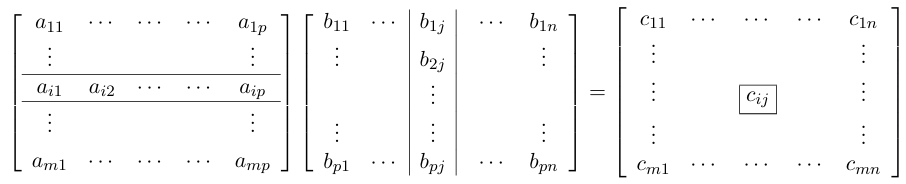

**Square Matrices**
- A *square matrix* is a matrix with the same number of rows as columns
- In this case we call the $\textbf{A}$ a square matrix of *order* $n$
- If $\textbf{A}, \textbf{B}$ are square matrices of order $n$, then both products $\textbf{A}\textbf{B}$ and $\textbf{B}\textbf{A}$ are defined, but in general the matrices $\textbf{AB}$ and $\textbf{BA}$ are not equal.
- Where the two products are equal, then the matrices are said to *commute*

**Diagonal Elements
- Elements of the form $a_{ii}$ for some $i$.
- A square matrix is called a *diagonal matrix* if all its non-diagonal elements are *zero*
- Notation: $\text{diag}[a_{11}, a_{22}, a_{33}]$

**Identity Matrix**
- A $n \times n$ diagonal matrix whose diagonal elements are all $1$
- Denoted by $\textbf{I}_n$.

**Matrix Exponentiation**
- If $\textbf{A}$ is a square matrix, then the products $\textbf{AA}, \textbf{AAA}, \textbf{AAAA}$ are all defined and are denoted $\textbf{A}^2, \textbf{A}^3, \textbf{A}^4$ etc.
- We also define $\textbf{A}^0$ to be the identity matrix $\textbf{I}$ of the same order as $\textbf{A}$.
- The functions $\exp\textbf{A}$ , $\sin\textbf{A}$ and $\cos\textbf{A}$ can also be defined

**Properties of Matrix Multiplication**
1. $(\textbf{AB})\textbf{C} = \textbf{A}(\textbf{BC})$ - associativity of multiplication
2. Distributive laws
	- $\textbf{A}(\textbf{B} + \textbf{C}) = \textbf{AB} + \textbf{AC}$ 
	- $(\textbf{A} + \textbf{B})\textbf{C} = \textbf{AC} + \textbf{BC}$
3. $\textbf{IA} = \textbf{A} = \textbf{AI}$
4. $\textbf{OA} = \textbf{O} = \textbf{AO}$
5. Index Laws
	- $\textbf{A}^p\textbf{A}^q = \textbf{A}^{p+q} = \textbf{A}^q\textbf{A}^p$
	- $(\textbf{A}^p)^q = \textbf{A}^{pq}$

#### Transpose, Determinant, Inverse

**Transpose**
- The *transpose* $\textbf{A}^T$ of a matrix $\textbf{A}$ is obtained by interchanging the rows and columns.
- Thus if $\textbf{A}$ has dimension $m \times n$, then $\textbf{A}^T$ has dimension $n \times m$

**Properties of Transposes**
1. $(\textbf{A}^T)^T = \textbf{A}$
2. $(\textbf{A} + \textbf{B})^T = \textbf{A}^T + \textbf{B}^T$ when $\textbf{A} + \textbf{B}$ exists
3. $(\lambda\textbf{A})^T = \lambda\textbf{A}^T$ for any $\lambda \in \mathbb{R}$
4. $(\textbf{A}\textbf{B})^T =\textbf{B}^T\textbf{A}^T$ when $\textbf{AB}$ exists

**Matrix Inverse**
- If $\textbf{A}, \textbf{B}$ are square matrices of the same order, then $\textbf{B}$ is the inverse of $\textbf{A}$ if:
$$\textbf{AB} = \textbf{I} = \textbf{BA}$$
- If $\textbf{A}$ has an inverse, it is unique. It is denoted $\textbf{A}^{-1}$

**Determinant of a 2x2 Matrix**
- The determinant of a $2 \times 2$ matrix $\textbf{A} = \begin{bmatrix} a & b \\ c & d\end{bmatrix}$ is defined to be the number $ad -bc$ and is denoted by $\det(A)$ or $\begin{vmatrix}a & b \\ c & d\end{vmatrix}$

- A $2 \times 2$ matrix $\textbf{A}$ is *invertible* if and only if its determinant is nonzero. If $\det(\textbf{A} \ne 0$ and $\textbf{A} = \begin{bmatrix} a & b \\ c & d\end{bmatrix}$, then:
$$\textbf{A}^{-1} = \frac{1}{ad-bc}\begin{bmatrix} d & -b \\ -c & a\end{bmatrix}$$

## 2.6 Linear Equations and Elementary Row Operations

#### Systems of Linear Equations

**Systems of Linear Equations**
- A system of linear equations can be written in a matrix form $\textbf{A}\textbf{x} = \textbf{b}$, where $\textbf{A}$ contains the coefficients, $\textbf{x}$ contains the variables and $\textbf{b}$ contains the constant on the RHS

**Augmented Matrices**
- A common way to write the system of linear equations $\textbf{Ax} = \textbf{b}$ is using an augmented matrix $[\textbf{A}|\textbf{b}]$

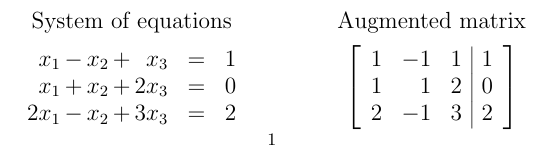
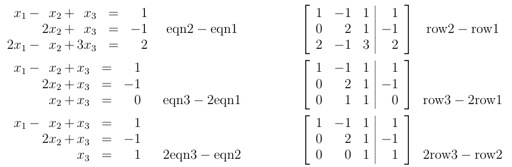

- We can use **elementary row operations** to solve a system of equations in the *Augmented Matrix* form

#### Elementary Row Operations, Row Echelon Form

**Elementary Row Operations**
1. Interchange two rows
2. Multiply a row by a nonzero number
3. Add a multiple of one row to another

**Row Equivalence**
- We say that two matrices $\textbf{A}$ and $\textbf{B}$ are *row equivalent* as $\textbf{A} \sim \textbf{B}$ if $\textbf{A}$ can be transformed to $\textbf{B}$ using a finite (possibly $0$) number of elementary row operations

**Row Echelon Form**
- A matrix is said to be in *row echelon* form if the first nonzero entry in *each row* is **further** to the right than the first nonzero entry in the previous row
- A system of liner equations can be solved using *elementary row operations* to reduce the augmented matrix to row echelon form
- This is possible because in *row echelon form*, there must be a row with all $0$s preceding it and a number at the end, which solves one of the variables. Hence, you can use that variable to calculate all the others, solving the system of linear equations

**Elementary Matrices**
- Elementary row operations can be performed by multiplying a matrix on the left by a suitable "elementary matrix"

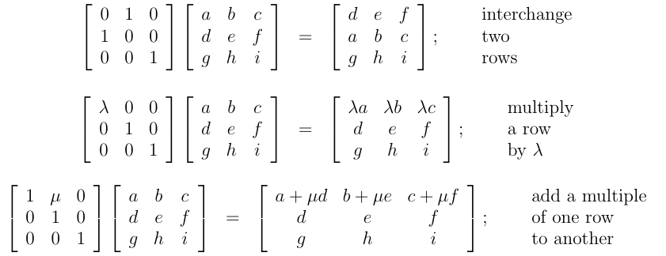

- More generally we define $n \times n$ elementary matrices as follows:
	1. $\textbf{E}_{ij}$ is obtained from the identity matrix $\textbf{I}$ by interchanging rows $i$ and $j$
	2. If $\lambda \ne 0$ then $\textbf{E}_i(\lambda)$ is obtained from $\textbf{I}$ by multiplying the entries in the $i$th row by $\lambda$
	3. $\textbf{E}_{ij}(\mu)$ is obtained from $I$ by adding $\mu$ times row $j$ to row $i$

- Each elementary matrix is invertible and its inverse is another elementary matrix
	1. $\textbf{E}_{ij}\textbf{E}_{ij} = \textbf{I} = \textbf{E}_{ji}\textbf{E}_{ji}$
		- "swapping two rows twice does nothing"
		- **Inverse:**  $\textbf{E}_{ij}$
	2. $\textbf{E}_i(1/\lambda)\textbf{E}_i(\lambda) = \textbf{I} = \textbf{E}_i(\lambda)\textbf{E}_i(1/\lambda)$
		- "scaling a row by $\lambda$ then by $1/\lambda$ or vice versa does nothing"
		- **Inverse:**  $\textbf{E}_i(1/\lambda)$
	3. $\textbf{E}_{ij}(-\mu)\textbf{E}_{ij}(\mu) = \textbf{I} = \textbf{E}_{ij}(\mu)\textbf{E}_{ij}(-\mu)$
		- "adding $\mu$ lots of row $j$ to $i$ and then subtracting $\mu$ lots of row $j$ from $i$ does nothing"
		- **Inverse:**  $\textbf{E}_{ij}(-\mu)$

#### Calculation of Inverses

**Inverse Calculation**
- An important consequence of this is that we can use elementary row operations to **invert** a matrix

- If a sequence of elementary row operations transforms a square matrix $\textbf{A}$ into $\textbf{I}$, then $\textbf{A}$ is invertible and the same sequence transforms $\textbf{I}$ into $\textbf{A}^{-1}$

- Suppose the row operations applied to $\textbf{A}$ correspond to elementary matrices $\textbf{E}_1, \textbf{E}_2, \cdots, \textbf{E}_n$ where $\textbf{E}_1$ is applied first. Then: $$\textbf{E}_n\textbf{E}_{n-1}\cdots\textbf{E}_2\textbf{E}_1\textbf{A} = \textbf{I}$$
- Let $\textbf{E} = \textbf{E}_n\textbf{E}_{n-1}\cdots\textbf{E}_2\textbf{E}_1$, so $\textbf{EA} = \textbf{I}$
- Since $\textbf{E}$ is a product of invertible matrices, it can be shown to have an inverse $\textbf{E}^{-1}$. Now: $$\textbf{AE} = \textbf{IAE} = (\textbf{E}^{-1}\textbf{E})\textbf{AE} = \textbf{E}^-1(\textbf{EA})\textbf{E} = \textbf{E}^-1\textbf{IE} = \textbf{E}^-1\textbf{E} = \textbf{I}$$
- Hence $\textbf{A}$ is invertible and: $$\textbf{A}^{-1} = \textbf{E} = \textbf{E}_n\textbf{E}_{n-1}\cdots\textbf{E}_2\textbf{E}_1$$
- We can find $\textbf{A}^{-1}$ by applying the same row operations to the identity matrix $\textbf{I}$.

## 2.7 Determinants and Inverse Matrices

#### Determinant of a 3x3 Matrix

**Determinants**
- The determinant of a $3 \times 3$ matrix $\textbf{A}$ is denoted by:
	$$\det(\textbf{A}), \hspace{1em} |\textbf{A}|, \hspace{1em} \text{or} \space \begin{vmatrix}a_{11} & a_{12} & a_{13} \\ a_{21} & a_{22} & a_{23} \\ a_{31} & a_{32} & a_{33} \end{vmatrix}$$
- and is defined to be the number

$$a_{11}\begin{vmatrix}a_{22} & a_{23} \\ a_{32} & a_{33}\end{vmatrix} - a_{12}\begin{vmatrix}a_{21} & a_{23} \\ a_{31} & a_{33}\end{vmatrix} + a_{13} \begin{vmatrix}a_{21} & a_{22} \\ a_{31} & a_{32}\end{vmatrix}$$
- Each of these three terms is the product of an element in the first row of $\textbf{A}$ with the determinant obtained by deleting the row and column of $\textbf{A}$ containing that element, in an *alternating signs pattern*

- This above formula is called *"determinant expanding by the first row*" as you delete terms from the `first row`
- In fact, you can use terms from any row, hence *expanding by any row* gives the same result for the determinant

- The *sign pattern* follows the matrix: $$\begin{bmatrix}+ & - & + \\ - & + & - \\ + & - & +\end{bmatrix}$$
- **NOTE**: $|\textbf{A}^T| = |\textbf{A}|$, so we can expand by either row or column
- Hence we often expand by the row or column with the most zeroes to eliminate the most calculations

#### Minors and Cofactors

**Minors**
- If $\textbf{A} = [a_{ij}]$ is a $n \times n$ matrix, then the $ij$th minor $\textbf{M}_{ij}$ of $\textbf{A}$ is defined to be the determinant of the $(n-1) \times (n-1)$ matrix obtained from $\textbf{A}$ by deleting the $i$th row and the $j$th column.

**Cofactors**
- The $ij$th cofactor $\textbf{A}_{ij}$ of $\textbf{A}$ is defined by: $$\textbf{A}_{ij} = (-1)^{i + j}\textbf{M}_{ij}$$
- The signs of the coefficient $(-1)^{i+j} = \pm 1$ is the $ij$th element of the alternating sign matrix:

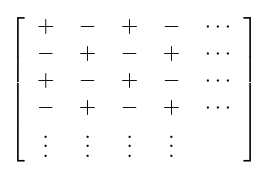

- This does not mean that the signs of the cofactors follow this pattern. This means that you multiply the $ij$th sign with the $ij$th minor to get the $ij$th cofactor

#### General Determinant

**Determinant Definition**
- If $n > 1$, then the determinant of an $n \times n$ matrix $\textbf{A} = [a_{ij}]$ is the number $|\textbf{A}|$ defined by: $$ |\textbf{A}| = a_{11}\textbf{A}_{11} + a_{12}\textbf{A}_{12} + \cdots + A_{1n}\textbf{A}_{1n}$$
- where $\textbf{A}_{1j}$ is the $1j$th cofactor of $\textbf{A}$. The determinant of a $1 \times 1$ matrix $[a]$ is defined to be the single element $a$.

**Expanding by Row/Column**
- We can similarly express the determinant of an $n \times n$ matrix $\textbf{A}$ by expanding by any row or any column:
  $$|\textbf{A}| = a_{i1}\textbf{A}_{i1} + a_{i2}\textbf{A}_{i2} + \cdots + A_{in}\textbf{A}_{in} \hspace{1em} \text{expansion by the $i$th row.}$$
$$|\textbf{A}| = a_{1j}\textbf{A}_{1j} + a_{2j}\textbf{A}_{2j} + \cdots + a_{nj}\textbf{A}_{nj} \hspace{1em} \text{expansion by the $j$th column.}$$

#### Elementary Row Operations and Determinants

**Elementary Row Operations and Determinants**
- If $\textbf{B}$ is the matrix obtained from $\textbf{A}$ by:
	1. multiplying a row of $\textbf{A}$ by a number $\lambda$, then $|\textbf{B}| = \lambda|\textbf{A}|$
	2. interchanging two rows of $\textbf{A}$, then $|\textbf{B}| = -|\textbf{A}|$
	3. adding a multiple of one row of $\textbf{A}$ to another, then $|\textbf{B}| = |\textbf{A}|$.

**Proof - (1) multiplying row by $\lambda$**
- Suppose $\textbf{B}$ is obtained by multiplying the $i$th row of $\textbf{A} = [a_{ij}]$ by $\lambda$. 
- The determinant of $\textbf{A}$, $\det(\textbf{A}) = a_{i1}\textbf{A}_{i1} + a_{i2}\textbf{A}_{i2} + \cdots + a_{in}\textbf{A}_{in}$, expanding by the $i$th row.
- Now consider the determinant of $\textbf{B}$:
$$\det(\textbf{B}) = \lambda a_{i1}\textbf{A}_{i1} + \lambda a_{i2}\textbf{A}_{i2} + \cdots + \lambda a_{in}\textbf{A}_{in} = \lambda\det(\textbf{A})$$
- The cofactors of the $i$th row of $\textbf{B}$ do not contain any terms from that row, so is identical to the cofactor of $\textbf{A}$ at that row.  

**Proof - (2) Swapping rows**
- We prove this by induction
- *Base Case* - $n = 2$: 
	$$\textbf{A} = \begin{bmatrix}a&b\\c&d\end{bmatrix}; \hspace{1em} \textbf{B} = \begin{bmatrix}c&d\\a&b\end{bmatrix}$$
	- $\det(\textbf{A}) = ad-bc$, $\det(\textbf{B}) = bc-ad = -(ad-bc) = -\det(\textbf{A})$

- Inductive step - assume that this statement holds until $k$, for $k \ge 2$.
- Consider $n = k+1$, and let $\textbf{B}$ be the matrix obtained by swapping rows $p$ and $q$ in matrix $\textbf{A}$.
- Now consider some other row $i$, distinct from $p$ and $q$. This must always exist as $k \ge 2$, so $k + 1 \ge 3$.
$$\textbf{A} = \begin{bmatrix}\cdots \\p_1 & p_2 & \cdots &p_{k+1}\\ i_1&i_2 & \cdots & i_{k+1} \\ q_1 & q_2 & \cdots & q_{k+1}\\\cdots\end{bmatrix} \hspace{1em} \textbf{B} = \begin{bmatrix}\cdots \\ q_1 & q_2 & \cdots &q_{k+1}\\ i_1&i_2 & \cdots & i_{k+1} \\ p_1 & p_2 & \cdots & p_{k+1}\\\cdots\end{bmatrix}$$
- Consider the determinants of $\textbf{A}$ and $\textbf{B}$ expanding by the $i$th row.
$$\textbf{A} = a_{i1}\textbf{A}_{i1} + a_{i2}\textbf{A}_{i2} + \cdots + a_{in}\textbf{A}_{in}$$
$$\textbf{B} = a_{i1}\textbf{B}_{i1} + a_{i2}\textbf{B}_{i2} + \cdots + a_{in}\textbf{B}_{in}$$
- The cofactors $\textbf{A}_{ij}$ and $\textbf{B}_{ij}$ can be written as $(n-1) \times (n-1)$ determinants obtained from the other by interchanging two rows. By the inductive hypothesis we have $\textbf{B}_{ij} = -\textbf{A}_{ij}$, so $|\textbf{B}| = -|\textbf{A}|$.

**Proof - (3) Adding two rows**
- Consider the matrix $\textbf{B}$ obtained from $\textbf{A}$ by adding a row $q$ to a different row $p$.
- We define a matrix $\textbf{C}$ with the row $p$ replaced by the row $q$. Hence, it is easy to see that $\textbf{B} = \textbf{A} + \textbf{C}$.
- **Claim 1:** $\det(\textbf{B}) = \det(\textbf{A}) + \det(\textbf{C})$
	1. $\det(\textbf{B}) = (p_1 + q_1)\textbf{A}_1 + (p_2 + q_2)\textbf{A}_2 + \cdots + (p_n + q_n)\textbf{A}_n$
	2. $\det(\textbf{A}) =  p_1\textbf{A}_1 + p_2\textbf{A}_2 + \cdots + p_n\textbf{A}_n$
	3. $\det(\textbf{C}) = q_1\textbf{A}_1 + q_2\textbf{A}_2 + \cdots + q_n\textbf{A}_n$
	- Hence we can see that $\det(\textbf{B}) = \det(\textbf{A}) + \det(\textbf{C})$.
- **Claim 2**: $\det(\textbf{C}) = 0$
	- Since the matrix $\textbf{C}$ has two rows that are identical, we can swap the two rows to reverse the determinant
	- Let $\textbf{C'}$ be the matrix obtained by swapping the two identical rows in $\textbf{C}$.
	- $\det(\textbf{C}) = \det(\textbf{C'})$, which implies that $\det(\textbf{C}) = 0$
- Hence we have that $\det(\textbf{B})  = \det(\textbf{A}) + 0 = \det(\textbf{A})$.
- This generalises to adding *any multiple* of row $q$ to row $p$, and the determinants will still be the same since nothing is being done to change it.

**Conclusion** - we can use elementary row operations to compute determinants. For example:

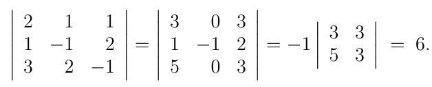

#### Adjoint Matrix and Matrix Inverse

**Adjoint Matrices**
- If $\textbf{A}$ is an $n \times n$ matrix, then the *matrix of cofactors* of $\textbf{A}$ is the matrix obtained by replacing each element of $\textbf{A}$ by its corresponding cofactor.
- The *adjoint* $\text{adj}(\textbf{A})$ of $\textbf{A}$ is the transpose of the matrix of cofactors.

**Matrix Inverse**
- A square matrix $\textbf{A}$ is invertible **iff** its determinant is non-zero. If $\textbf{A}$ is invertible, then: $$\textbf{A}^{-1} = \frac{1}{|\textbf{A}|}\text{adj}(\textbf{A})$$
- **Proof:** (somehow not in my notes?)
	- Conversely suppose $|\textbf{A}| \ne 0$. 
	- We compute $\textbf{B} = [b_{ij}]$, where the $ij$th element of this is the scalar product of the $i$th row of $\textbf{A}$ with the $jth$ column of $\text{adj}(\textbf{A})$. 
	- But the $j$th column of $\text{adj}(\textbf{A})$ contains the cofactors of the $j$th row of $\textbf{A}$, so: $$b_{ij} = a_{i1}\textbf{A}_{j1} + a_{i2}\textbf{A}_{j2}+ \cdots + a_{in}\textbf{A}_{jn}$$
	- If $i = j$, then this is the expansion of $|\textbf{A}|$ by the $i$th row, so $b_{ii} = |\textbf{A}|$ for $1 \le i \le n$.
	- If $i \ne j$, then $b_{ij}$ is the determinant of the matrix obtained from $\textbf{A}$ by replacing row $j$ with another copy of row $i$. 
	- We know that any matrix with two identical rows has determinant $0$ from above, so $b_{ij} = 0$ for $i \ne j$.
	- Hence, we have: $$\textbf{A}\text{adj}(\textbf{A}) = \begin{bmatrix}|\textbf{A}| && 0\\&\ddots &\\ 0 && |\textbf{A}|\end{bmatrix} = |\textbf{A}|\begin{bmatrix}1 && 0 \\ &\dots&\\0&&1\end{bmatrix} = |\textbf{A}|\textbf{I}$$
	- So $A(\frac{1}{|\textbf{A}|}\text{adj}(\textbf{A})) = \textbf{I}$, and we also have $(\frac{1}{|\textbf{A}|}\text{adj}(\textbf{A}))\textbf{A} = \textbf{I}$
	- Therefore $\frac{1}{|\textbf{A}|}\text{adj}(\textbf{A})$ is the inverse of $\textbf{A}$.

## 2.8 Matrices and Linear Independence

#### Linear Independence via Determinant

**Row and Column Vectors**
- Let $\textbf{A}$ be a $m \times n$ matrix given by: $$\textbf{A} = \begin{bmatrix}a_{11}&a_{12}&\cdots&a_{1n}\\a_{21}&a_{22}&\cdots&a_{2n}\\\vdots&\vdots&&&\vdots\\a_{m1}&a_{m2}&\cdots&a_{mn}\end{bmatrix}$$
- The $m$ vectors: $$(a_{11}, a_{12}, \cdots, a_{1n}), (a_{21}, a_{22}, \cdots, a_{2n}), \cdots, (a_{m1}, a_{m2}, \cdots, a_{mn})$$
- are called the *row vectors* of $\textbf{A}$.

- Similarly, the columns of the matrix $\textbf{A}$ are called the column vectors of $\textbf{A}$.

**Linear Independence via Determinant Evaluation**
- A set of $n$ vectors in $\mathbb{R}^n$ is linearly independent (and therefore a basis) **iff** if it is the set of column vectors of a matrix with nonzero determinant

**Proof:** (somehow half of the proof is missing from my notes?)
- To verify this, suppose the set of vectors is $\{\textbf{u}_1, \textbf{u}_2, \cdots, \textbf{u}_n\}$ and let $$\textbf{u}_j = (u_{1j}, u_{2j}, \cdots, u_{nj})$$
- for $1 \le j \le n$.
- Consider the equation $\alpha_1\textbf{u}_1 + \alpha_2\textbf{u}_2 + \cdots + \alpha_n\textbf{u}_n = 0$.
$$\iff \alpha_1 \begin{bmatrix}u_{11} \\ u_{21} \\ \vdots \\ u_{n1}\end{bmatrix} + \alpha_2\begin{bmatrix}u_{12} \\ u_{22} \\ \vdots \\ u_{n2}\end{bmatrix} + \cdots + \alpha_n\begin{bmatrix}u_{1n} \\ u_{2n} \\ \vdots \\ u_{nn}\end{bmatrix}$$
$$\iff \begin{bmatrix}u_{11} &\cdots &u_{1j}& \cdots & u_{1n}\\u_{21} & \cdots &u_{2u}&\cdots&u_{2n}\\ \vdots && \vdots && \vdots \\ u_{n1} & \cdots& u_{nj} & \cdots & u_{nn}\end{bmatrix}\begin{bmatrix}\alpha_1 \\ \alpha_2 \\ \vdots \\ \alpha_n\end{bmatrix} = \begin{bmatrix} 0 \\ 0 \\ \vdots \\ 0\end{bmatrix}$$
- Let $\textbf{U}$ be the $n \times n$ matrix $[u_{ij}]$.

- If $|\textbf{U}| \ne 0$, then $\textbf{U}^{-1}$ exists so multiplying both sides of the above matrix equation on the left by $\textbf{U}^{-1}$ gives $\alpha_1 = 0, \alpha_2 = 0, \cdots, \alpha_n = 0$, i.e. the set $\{\textbf{u}_1, \textbf{u}_2, \cdots, \textbf{u}_n\}$ is linearly independent.

- If $|\textbf{U}| \ne 0$, then $|\textbf{U}^T| = 0$, so the transpose is not invertible. Hence $\textbf{U}^T$ cannot be reduced to $\textbf{I}$ by elementary row operations and so must be reducible to a matrix with a row of zeros. 
- Therefore elementary column operations can be applied to $\textbf{U}$ to produce a column of zeros.
- Hence some non-trivial linear combination of $\textbf{u}_1, \textbf{u}_2, \cdots, \textbf{u}_n$ is $\textbf{0}$, so these vectors must be linearly dependent.

## 2.9 Introduction to Linear Transformations

#### Linear Transformations

**Overview**
- A function $T: \mathbb{R}^m \to \mathbb{R}^n$ is called a **linear transformation** if, for all $\textbf{u}, \textbf{v} \in \mathbb{R}^m$ and for all $\lambda \in \mathbb{R}$, we have:
$$T(\textbf{u} + \textbf{v}) = T(\textbf{u}) + T(\textbf{v}) \hspace{1em} \text{(preservation of addition)}$$
$$T(\lambda \textbf{u}) = \lambda T(\textbf{u}) \hspace{1em} \text{(preservation of scalar multiplication)}$$

**Theorem** - If $T : \mathbb{R}^m \to \mathbb{R}^n$ is a linear transformation, then $T(\textbf{0}) = \textbf{0}$, i.e. the origin is mapped onto itself

**Proof:**
	- $T(\textbf{0}) = T(0 \cdot \textbf{0}) = 0T(\textbf{0}) = \textbf{0}$

#### Projections

**Overview**
- The projection of $\textbf{x} \in \mathbb{R}^2$ onto a nonzero vector $\textbf{u} \in \mathbb{R}^2$ is defined to be the vector $P_\textbf{u}(\textbf{x})$ with the properties:
	1. $P_\textbf{u}(\textbf{x})$ is a multiple of $\textbf{u}$.
	2. $\textbf{x} - P_\textbf{u}(\textbf{x})$ is perpendicular to $\textbf{u}$
- By property (1), we have $P_\textbf{u}(\textbf{x}) = \alpha\textbf{u}$ for some $\alpha \in \mathbb{R}$, and now by property 2:
$$0 = (\textbf{x} - P_\textbf{u}(\textbf{x})) \cdot \textbf{u} = (\textbf{x} - \alpha\textbf{u})\cdot \textbf{u} = \textbf{x}\cdot\textbf{u} - \alpha|\textbf{u}|^2$$
- Hence: $$\alpha = \frac{\textbf{x}\cdot\textbf{u}}{|\textbf{u}^2}$$
- Hence, $P_\textbf{u}(x) = \textbf{x}\cdot\textbf{u}(\frac{1}{|\textbf{u}|^2})\textbf{u}$
- From here, we can verify that projection is a linear transformation by checking for the two rules

#### Rotations about Origin

**Overview**
- Rotation is a linear transformation
- $\begin{bmatrix}x'\\y'\end{bmatrix} = R_\theta\begin{bmatrix}x\\y\end{bmatrix}$ where $R_\theta = \begin{bmatrix}\cos\theta & -\sin\theta \\ \sin\theta & \cos\theta\end{bmatrix}$

## 2.10 Matrices and Linear Transformations

#### Every Matrix Defines a Linear Transformation

**Overview**
- Let $\textbf{M}$ be an $n \times n$ matrix. Then $T : \mathbb{R}^m \to \mathbb{R}^n$ defined by $T(\textbf{x}) = \textbf{M}\textbf{x}$ for every $\textbf{x} \in \mathbb{R}^m$ is a linear transformation.
- Here we regard vectors in $\mathbb{R}^m$ and $\mathbb{R}^n$ as column vectors, so $\textbf{Mx}$ is the product of an $n \times m$ matrix and an $m \times 1$ matrix which gives a $n \times 1$ matrix.
- The linearly of $T$ follows directly from properties of matrix multiplication.

#### Coordinates

**Coordinates**
- Let $V = \{\textbf{v}_1, \textbf{v}_2, \cdots, \textbf{v}_n\}$ be a basis for $\mathbb{R}^n$. If $\textbf{x} \in \mathbb{R}^n$ then $\textbf{x}$ has a unique expansion as a linear combination $$\textbf{x} = \alpha_1\textbf{v}_1 + \alpha_2\textbf{v}_2 + \cdots + \alpha_n\textbf{v}_n$$
- of these basis vectors. The coefficients $\alpha_1, \alpha_2, \cdots, \alpha_n$ are called the *coordinates* of $\textbf{x}$ with respect to the basis $V$.

#### The Matrix of a Linear Transformation

**Overview**
- Let $T: \mathbb{R}^m \to \mathbb{R}^n$ be a linear transformation.
- Let $V = \{\textbf{v}_1, \textbf{v}_2, \cdots, \textbf{v}_m\}$ be a basis for $\mathbb{R}^n$ and $W = \{\textbf{w}_1, \textbf{w}_2, \cdots, \textbf{w}_n\}$ be a basis for $\mathbb{R}^n$.
- Then each of the vectors $T(\textbf{v}_j)$ belongs to $\mathbb{R}^n$ so is a linear combination of the $\textbf{w}$ vectors.
- Hence for each $j$ there are $n$ numbers $\alpha_{1j}, \alpha_{2j}, \cdots, \alpha_{nj} \in \mathbb{R}$ with: $$T(\textbf{v}_j) = \alpha_{1j}\textbf{w}_1 + \alpha_{2j}\textbf{w}_2 + \cdots + \alpha_{nj}\textbf{w}_n$$
- The *matrix of $T$ with respect to the bases $V$ and $W$* is defined to be the $n \times m$ matrix whose $j$th column contains the coefficients in this expansion of $T(\textbf{v}_j)$.
$$\begin{bmatrix}\alpha_{11} & \cdots & \alpha_{1j} & \cdots & \alpha_{1m} \\ \alpha_{21} & \cdots & \alpha_{2j} & \cdots & \alpha_{2m} \\ \vdots & & & & \vdots \\ \alpha_{n1} & \cdots & \alpha_{nj} & \cdots & \alpha_{nm}\end{bmatrix}$$

- In the special case where $m=n$ and $V=W$, we talk of the *matrix of $T$ with respect to the basis $V$

**Main Point**

- Let $T : \mathbb{R}^m \to \mathbb{R}^n$ be a linear transformation and let $M$ be the *matrix of $T$ with respect to bases $V$ in $\mathbb{R}^m$ and $W$ in $\mathbb{R}^n$. 
- Then the columns of $M$ contain the coordinates of the *images* of the basis vectors in $V$ with respect to the basis $W$.

- If $\textbf{x} \in \mathbb{R}^m$ has the *coordinates* $[x_1, x_2, \cdots, x_m]$ with respect to $V$ then the *coordinates* $[y_1, y_2, \cdots, y_n]$ of $T(\textbf{x}) \in \mathbb{R}^n$ with respect to $W$ are:
$$\begin{bmatrix}y_1 \\ y_2 \\ \vdots \\ y_n\end{bmatrix} = M\begin{bmatrix}x_1 \\ x_2 \\ \vdots \\ x_m\end{bmatrix}$$

**How to find Matrix of Linear Transformation**
1. Calculate $T(\textbf{v}_i)$ for all $i$
2. Find coordinates of $\textbf{v}_i$ in basis $W$ by solving $$\alpha_1\textbf{w}_1 + \alpha_2\textbf{w}_2 + \cdots + \alpha_n\textbf{w}_n = T(\textbf{v}_i)$$
3. Put the coordinates $[\alpha_1, \alpha_2, \cdots, \alpha_n]$ column-wise into the matrix $\textbf{M}$

#### Change of Basis

**Overview**

- If we have two different bases in $\mathbb{R}^n$ then a given vector will have different coordinates respect to each basis.
- The change in coordinates can be described by a *transition* matrix

- Let $V = \{\textbf{v}_1, \textbf{v}_2, \cdots, \textbf{v}_n\}$ and $W = \{\textbf{w}_1, \textbf{w}_2, \cdots, \textbf{w}_n\}$ be two bases for $\mathbb{R}^n$. 
- Suppose $x \in \mathbb{R}^n$ has coordinates $[\alpha_1, \alpha_2, \cdots, \alpha_n]$ with respect to $V$ and coordinates $[\beta_1, \beta_2, \cdots, \beta_n]$ with respect to $W$.

- Let the identity transformation, $I : \mathbb{R}^n \to \mathbb{R}^n$, $I(\textbf{x}) = \textbf{x}$ for all $\textbf{x} \in \mathbb{R}^n$.
- Let $\textbf{M}$ be the matrix of $I$ with respect to the bases $V$ and $W$. Then the coordinates of $I(\textbf{x})$, i.e. $\textbf{x}$ , with respect to $W$ are given by: $$\begin{bmatrix}\beta_1 \\ \beta_2 \\ \vdots \\ \beta_n\end{bmatrix} = M\begin{bmatrix}\alpha_1 \\ \alpha_2 \\ \vdots \\ \alpha_n\end{bmatrix}$$
- This matrix $\textbf{M}$ whose columns are the coordinates of $\textbf{v}_1, \textbf{v}_2, \cdots, \textbf{v}_n$ with respect to the basis $W$ is called the *transition matrix* from $V$ to $W$

**Comparison to Matrix of Linear Transformation**

- *change of basis* matrix is a special case of a *matrix of a linear transformation with respect to bases $V$ and $W$*.

- Change of basis has the linear transformation $I(\textbf{x}) = \textbf{x}$, i.e. nothing is done to the vector, only its representation is changed

## 2.11 - Eigenvalues and Eigenvectors

#### Eigenvalues and Eigenvectors

**Overview**
- A square $n \times n$ matrix $\textbf{A}$ can be post-multiplied by a column vector $\textbf{r}$ of length $n$ to give a new vector $\textbf{r}'$ also of length $n$. Hence $\textbf{Ar} = \textbf{r}'$.

- Generally the new vector $\textbf{r}'$ and the old vector $\textbf{r}$ are not parallel. However, there are vectors whose *direction does not change* when pre-multiplied by $\textbf{A}$ - these are eigenvectors

- Hence $\textbf{A}\textbf{r} = \lambda\textbf{r}$ where $\lambda \in \mathbb{R}$, which is called an eigenvalue - the scale factor of the transformation
- The vectors $\textbf{r}$ are called *eigenvectors*
- We will always exclude the trivial case $\textbf{r} = \textbf{0}$

**Formal Definition**
- Let $\textbf{A}$ be a square matrix of order $n$. A number $\lambda$ is called an *eigenvalue* of $\textbf{A}$ if $\textbf{A}\textbf{v} = \lambda\textbf{v}$ for some non-zero column vector $\textbf{v}$. 
- When this is the case, we call $\textbf{v}$ an *eigenvector* of $\textbf{A}$ corresponding to $\lambda$

**Calculating Eigenvalues**
- A number $\lambda$ is an eigenvalue of the matrix $\textbf{A}$ if and only if: $$|\textbf{A} - \lambda\textbf{I}| = \det(\textbf{A} - \lambda\textbf{I}) = 0$$
- This equation is called the *characteristic equation* of $\textbf{A}$ and is a polynomial of degree $n$ in $\lambda$
- This can be verified by rewriting $\textbf{v}$ as $\textbf{Iv}$, rearranging and factoring out the $\textbf{v}$. Since $\textbf{v}$ is non-zero, the determinant of the matrix $\textbf{A} - \lambda\textbf{I}$ must be $0$.

- If $|\textbf{A} - \lambda\textbf{I}| \ne 0$, then $\textbf{A} - \lambda\textbf{I}$ is invertible and $\textbf{v} = (\textbf{A} - \lambda\textbf{I})^{-1}\textbf{0} = \textbf{0}$.
- Each eigenvalue corresponds to a *subspace* of eigenvectors that form a line passing through the origin.

**Complex Eigenvalues and Eigenvectors**
- The eigenvalues of a real matrix may be complex, for example the rotation matrix corresponding to $\theta = 3\pi/2$: $$\textbf{A} = \begin{bmatrix}0&1\\-1&0\end{bmatrix}$$
- The eigenvectors and eigenvalues are:
	1. $[-i, 1]$ with eigenvalue $i$
	2. $[1, i]$ with eigenvalue $i$

#### Diagonalisation

**Diagonal Matrices**
- A *diagonal* matrix is a square matrix whose only nonzero entries are on the main diagonal.
- They are easy to multiply as we only multiply corresponding diagonal entries, e.g. $$\begin{bmatrix}a_1&0\\0&a_2\end{bmatrix}\begin{bmatrix}b_1&0\\0&b_2\end{bmatrix} = \begin{bmatrix}a_1b_1&0\\0&a_2b_2\end{bmatrix}$$
**Diagonalisation of a Matrix**
- Let $\textbf{A}$ be an $n \times n$ matrix. If $$\textbf{V}^{-1}\textbf{A}\textbf{V} = \text{diag}(\lambda_1, \lambda_2, \cdots, \lambda_n) \hspace{4em} (*)$$
- where $\textbf{V}$ is the $n \times n$ matrix whose columns are $[\textbf{v}_1, \textbf{v}_2, \cdots, \textbf{v}_n]$, then $[\textbf{v}_1, \textbf{v}_2, cdots, \textbf{v}_n]$ are the *eigenvectors* of $\textbf{A}$, and $\lambda_1, \lambda_2, \cdots, \lambda_n$ are the corresponding values.

- In other words, putting the eigenvectors of $\textbf{A}$ column-wise into $\textbf{V}$ and computing $\textbf{V}^{-1}\textbf{A}\textbf{V}$ will yield a diagonal matrix with the eigenvalues down the diagonal.

**Proof**
- If $(*)$ holds, since $\textbf{V}^{-1}$ exists, $\textbf{V}$ must have non-zero determinant and hence the *columns* of $\textbf{V}$ must be linearly independent.
- Now let $\textbf{e}_j$ be the $n \times 1$ column matrix whose $j$th element is $1$ but has all other elements zero.
- Consider the product $\textbf{V}\textbf{e}_j$. This must be the $j$th column of $\textbf{V}$, $\textbf{v}_j$ by basic matrix algebra.

- Hence, we get: $$\textbf{V}^{-1}\textbf{AV} = \textbf{D}  \implies \textbf{V}^{-1}\textbf{A}\textbf{V}\textbf{e}_j = \textbf{D}\textbf{e}_j$$$$\implies \textbf{V}^{-1}\textbf{A}(\textbf{V}\textbf{e}_j) = \lambda_j\textbf{e}_j$$
$$\implies \textbf{A}\textbf{v}_j = \textbf{V}\lambda_j\textbf{e}_j$$
$$ \implies \textbf{A}\textbf{v}_j = \lambda_j\textbf{V}\textbf{e}_j = \lambda_j\textbf{v}_j$$
- But we know that $\textbf{A}\textbf{v}_j = \lambda_j\textbf{v}_j$ defines $\textbf{v}_j$ and $\lambda_j$ to be the $j$th eigenvector and associated eigenvalue respectively.
- This completes the proof.
**End**

# 3. Sequences and Series

## 3.1 Sequences

#### Sequences

**Overview**

- A *sequence* $(a_n)$ is an infinite list of numbers $(a_0, a_1, a_2, a_3, \cdots)$.
- The index of the first term is usually $0$ but may start from $1$.

- A sequence can be defined by giving an *explicit formula* for its $n$th term, e.g.
	- $(2^{-n})$ denotes the sequence $\left( 1, \frac{1}{2}, \frac{1}{4}, \frac{1}{8}, \frac{1}{16}, \frac{1}{32}, \cdots \right)$
	- $((-1)^n)$ denotes the sequence $(1, -1, 1, -1, 1, -1, \dots)$

- A sequence can also be defined recursively, e.g. the *Fibonacci* sequence $F_n$: $$F_{0} = 0, \hspace{1em}F_{1}= 1, \hspace{1em} F_{n+2} = F_{n+1} + F_{n} \hspace{1em} (n \ge 0)$$
- giving the sequence $(0, 1, 1, 2, 3, 5, 8, 13, 21, 34, 55, 89, ...)$

**Limit of a Sequence**
- We expect a sequence $a_{n}$ to converge to a limit $l$ if its terms eventually get close to $l$.

- ***Def***. A sequence $(a_n)$ of real numbers is aid to *converge* to a limit $l \in \mathbb{R}$ if for every $\epsilon > 0$ there is an integer $N$ (which depends on $\epsilon$) with $|a_n - l| < \epsilon$ for all $n > N$.
- Or more formally: $$\forall \epsilon>0,\space \exists N \in \mathbb{Z} \space:\forall n > N:|a_{n}-l|<\epsilon$$
- When $(a_n)$ converges to $l$, we write:
$$\lim_{n \to \infty } {a_n} = l \hspace{1em} \text{or} \hspace{1em} a_{n} \to l$$

- Note that $|a_n - l|$ is the distance between the points $a_n$ and $l$ on the real line. The definition says that *no matter how small* a positive number $\epsilon$ is, the numbers $a_n$ will eventually lie between $l-\epsilon$ and $l+\epsilon$.

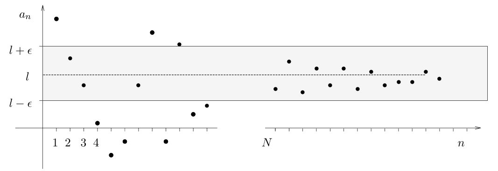

**Examples**
- Any constant sequence $a_n = c$ converges to $c$, since for every $\epsilon > 0$, we have $|a_n-c| = 0 < \epsilon$ for all $n > 1$.
- The sequence $\left( \frac{1}{n} \right)$ for $n > 0$, converges to $0$. 
	- Let $\epsilon > 0$. There is an $N$ with $\frac{1}{/N} < \epsilon$ (choose any $N > \frac{1}{\epsilon}$) and so for $n > N$, we have: $$\frac{|1}{n}-0| = \frac{1}{n} < \frac{1}{N} < \epsilon$$
	- hence $\left( \frac{1}{n} \right) \to 0$

#### Combination Rules for Convergent Sequences

**Overview**
- If $(a_n), (b_n), (c_n)$ are *convergent* sequences with $a_{n}\to\alpha$, $b_{n} \to \beta$ and $c_{n}\to \gamma$, then:
1. **sum** rule: $$a_{n} + b_{n} \to \alpha + \beta$$
2. **scalar multiple** rule: $$\lambda \alpha_{n} \to \lambda\alpha$$
3. **product** rule:  $$a_{n}b_{n} \to \alpha\beta$$
4. **reciprocal** rule:  $$\frac{1}{a_{n}} \to \frac{1}{\alpha}$$
5. **quotient** rule: $$\frac{b_{n}}{c_{n}} \to \frac{\beta}{\alpha}$$
6. **hybrid** rule: $$\frac{b_{n}c_{n}}{a_{n}} \to \frac{\beta\gamma}{\alpha}$$
**Proof of the Sum Rule**
- Suppose that $a_n \to \alpha$ and $b_n \to \beta$. Let $\epsilon > 0$. Then there is a number $N_1$ with $$|a_{n}-\alpha| < \frac{\epsilon}{2}$$
- for all $n > N_1$, and there is a number $N_2$ with: $$|b_{n} - \beta| < \frac{\epsilon}{2}$$
- for all $n > N_2$.

- Let $N = \max(N_1, N_2), so for $n > N$, both the above inequalities hold, and have: $$|(a_{n}+b_{n}) - (\alpha + \beta)| = |(a_{n} - \alpha) + (b_{n} - \beta)| \le |a_{n}-\alpha| + |b_{n}-\beta| < \frac{\epsilon}{2} + \frac{\epsilon}{2} = \epsilon$$
- Hence by the definition of convergence, we have $a_{n} + b_{n} \to \alpha + \beta$

#### Properties of Sequences

**Bounds**
- A sequence $(a_{n})$ is said to be *bounded above* if there is an umber $U$ with $a_n \le U$ for all $N$.
- Similarly $a_n$ is *bounded below* if there is a number $L$ with $L \le a_n$ for all $n$.
- ***Def***. A sequence is *bounded* if it is bounded above and bounded below

**Increasing, Decreasing Sequences**
- A sequence $(a_n)$ is said to be *increasing* if $a_{n+1} \ge a_n$ for all $n$.
- Similarly $(a_n)$ is decreasing if $a_{n+1} \le a_n$ for all $n$

**Basic Properties of Convergent Sequences**
1. A *convergent sequence* has a unique limit
2. If $a_n \to l$, then *every subsequence* of $(a_n)$ also converges to $l$
3. If $a_n \to l$, then $|a_n| \to |l|$
4. ***The squeeze rule***
	- If $a_n \to l$ and $b_n \to l$ and $a_n \le c_n \le b_n$ for all $n$, then $c_n \to l$.
5. A convergent sequence $(a_n)$ is bounded
6. Any increasing sequence which is bounded above converges. Any decreasing sequence which is bounded below converges.

**Prove that $(-1)^n$ does not converge:
- The sequence is $(1, -1, 1, -1, ...)$ so its even subsequence is the constant sequence $(1)$ which converges to $1$
- But the odd subsequence is the constant sequence $(-1)$ which converges to $-1$. If $(-1)^n \to l$ then every subsequence would converge to the same value, so we would have $l = 1$ and $l = -1$, which is a contradiction.
- Hence $(-1)^n$ does not converge.

#### Basic Convergent Sequences

**Divergent Sequences**
- A sequence $(a_n)$ is said to *diverge to infinity* if for every $K \in \mathbb{R}$ where is an $N$ with $a_n > K$ whenever $n > N$. If $(a_n)$ diverges to infinity we write $a_n \to \infty$.
- Similarly $a_n \to -\infty$ if $a_n$ diverges to negative infinity, or that $-a_n \to \infty$.
- A non-convergent sequence that does not diverge to $\pm \infty$ is said to **oscillate**

**Basic Convergent Sequences**
1. For any $p > 0$:$$\lim_{ n \to \infty }{\frac{1}{n^p}} = 0$$
2. For any $c$ with $|c| < 1$: $$\lim_{ n \to \infty }{c^n} = 0$$
3. For any $c > 0$: $$\lim_{ n \to \infty }{c^{1/n}} = 0$$
4. For any $p > 0$ and $|c| < 1$:  $$\lim_{ n \to \infty }{n^pc^n} = 0 $$
5. For any $c \in \mathbb{R}$: $$ \lim_{ n \to \infty }{\frac{c^n}{n!}} = 0$$
6. For any $c \in \mathbb{R}$: $$\lim_{ n \to \infty } {\left( 1+\frac{c}{n} \right)^n} = e^c$$
#### $O$-notation for Sequences

**Big $O$ Notation

- If $(a_n)$ and $(b_n)$ are sequences of real numbers, then we say that $a_n$ is $O(b_n)$ if there are constants $C$ and $N$ with $|a_n| \le C|b_n|$ for all $n \ge N$.

- I.e. $(a_n)$ is bounded above by $(b_n)$.

- An algorithm whose run time is $O(n^k)$ for some $k$ is called a *polynomial time* algorithm
- An algorithm which is not polynomial time but whose running time is $O(k^n)$ for some $k$ is an *exponential time* algorithm

**Related Definitions**
1. If $(a_n)$ and $(b_n)$ are sequences of real numbers, then we say that $a_n$ is $\Omega(b_n)$ if there are constants $C$ and $N$ with $|a_n| \ge C|b_n|$ for all $n \ge N$.
	- i.e. $(a_n)$ is bounded below by $(b_n)$
2. If $(a_n)$ and $(b_n)$ are sequences of real numbers, then we say that $a_n$ is $\Theta(b_n)$ if $a_n$ is $O(b_n)$ and $a_n$ is $\Omega(b_n)$
	- i.e. $(a_n)$ has the same growth rate as $(b_n)$.

## 3.2 Recurrences

#### Recurrences

**Recurrences**
- A *recurrence* is a rule which defines each term of a sequence using the preceding terms
- E.g. the Fibonacci sequence $(F_n)$ is defined by the following recurrence: $$F_{n} = F_{n-1} + F_{n-2}$$
- for $n \ge 2$, together with the initial conditions $F_0 = 0$ and $F_1 = 1$

**Towers of Hanoi**
- Has the recurrence $T_n = 2T_{n-1} + 1$ where $T_n$ is the number of steps to move the disks
- With $T_0 = 0$ this gives the sequence $0, 1, 3, 7, 15, 31, 63, ...$
- The *closed form* expression for $T_n$ is $T_n = 2^n - 1$ and this can be proved by induction

- **Closed Form** formula - a formula for a recurrence that does not use preceding terms, only in terms of $n$

#### Linear Recurrences - Homogeneous

**Linear Recurrences**
- A linear recurrence has the form: $$x_{n} + a_{1}x_{n-1}+\dots+a_{k}x_{n-k} = f(n)$$
- where $a_1, \cdots, a_k$ are constants and $f$ is some given function
- If the first $k$ terms are given, then this recurrence defines a unique sequence $(x_n)$.
- Only second-order linear recurrences are tested ($k = 2$)

**Homogeneous Recurrences**
- Recurrences of the form $f(n) = 0$
- Has the form:$$x_{n} + ax_{n-1}+ bx_{n-2} = 0$$
**Auxiliary Equations**

- The *auxiliary equation* is the equation $\lambda^2 + a\lambda + b = 0$ given we have a homogenous recurrence of the above form.
- The equation has two might-be-complex roots $\lambda_1^n$, $\lambda_2^n$.

- **In the case that the equation has two real distinct roots $\lambda_1, \lambda_2$, the general solution is:** $$x_{n} = A\lambda_{1}^n + B\lambda_{2}^n$$
- where $A$, $B$ are constants to be found using the first two terms of the sequence $(x_n)$.

- **If the equation has one distinct root $\lambda$, the general solution is:** $$x_{n} = (A+Bn)\lambda^n$$
- this is because $A\lambda^n$ is a solution, but $n\lambda^n$ is also a solution, so we must create a linear combination of the two to create the general solution

- If the equation has complex roots $\lambda_1, \lambda_2$, the general solution is: $$x_{n} = r^n(A\cos(n\theta ) + B\sin(n\theta))$$
- where $\lambda_{1,2} = re^{\pm i\theta}$

**Example**
- The Fibonacci sequence has the auxiliary equation:$$\lambda^2 - \lambda - 1 = 0$$
- which has roots $\frac{1+\sqrt{ 5 }}{2}$ and $\frac{1-\sqrt{5}}{2}$
- Hence the closed form formula is: $$F_{n} = \frac{1}{\sqrt{ 5 }} \left(\frac{1+\sqrt{ 5 }}{2}\right)^n - \frac{1}{\sqrt{ 5 }}\left(\frac{1-\sqrt{ 5 }}{2}\right)^n$$
- This is an integer expression, despite appearances
- Since the second term goes smaller as $n$ increases, we have that: $$F_{n} = \lfloor \frac{\phi^n}{5} \rfloor $$
#### Non-Homogenous Recurrences

**Non-Homogenous Recurrences**
- These are the recurrence of the form: $$x_{n} + ax_{n-1} + bx_{n-2} = f(n)$$
- Where $a, b$ are constants.

- To calculate the whole solution, you will have to calculate the *complementary function* of the homogenous recurrence $h_n$, then find  *any* particular solution of the original recurrence, and sum them up: $$x_{n} = h_{n} + p_{n}$$
- To find the *particular solution*, use a function of the same form as the RHS of the equation $f(n)$
- E.g.
	- If $f(n)$ is linear, use a linear function
	- If $f(n)$ is a quadratic, use a quadratic function
	- If $f(n)$ is a trigonometric function, use a trigonometric function
	- If $f(n)$ is an exponential, use an exponential
- **Note** - the particular solution **cannot** have any terms in common with the complementary function of the homogeneous recurrence.
- **To mitigate this** - multiply by $n$ until you find a term that works

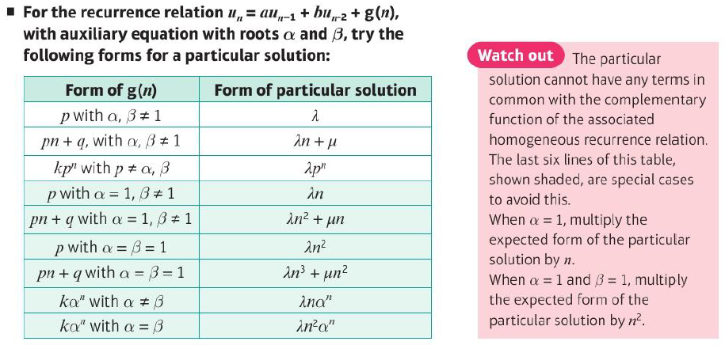

## 3.3 Series

#### Series

**Definition**
-  A series $\sum{a_n}$ is a pair of sequences consisting of:
	1. A sequence $(a_n)$ called the *sequence of terms*
	2. A sequence $(s_n)$ called the *sequence of partial sums* defined by: $$s_{n} = a_{0} + a_{1} + \dots + a_{n}$$
**Sum of a Series**
- If the sequence $(s_n)$ of partial sums converges to $s$ then we say that the series $\sum{a_n}$ converges to the sum $s$ and write: $$\sum_{n=0}^\infty{a_{n}} = s$$
- Otherwise, we say that the series *diverges*

**Geometric Series**
- The geometric series $\sum r^n$ converges to $\frac{1}{1-r}$ provided that $|r| < 1$
- This can be proved by calculating the $n$th partial sum: $$s_{n} = 1 + r + r^2 + \dots + r^n$$
- Multiplying both sides by $r$ gives: $$rs_{n} = r + r^2 + \dots + r^n + r^{n+1}$$
- Subtracting these equations gives: $$s_{n} = \frac{1 - r^{n+1}}{1-r}$$
- If $|r| < 1$ then $r^{n+1} \to 0$ so $s_n \to \frac{1}{1-r}$

**Harmonic Series**
- The harmonic series $\sum_{n=1}^\infty{\frac{1}{n}}$ diverges. To see this we estimate some partials sums:
$$s_{2} = 1 + \frac{1}{2}$$
$$s_4 = 1 + \frac{1}{2} +\left( \frac{1}{3} + \frac{1}{4} \right) +> 1 + \frac{1}{2} + \frac{1}{2}$$
$$s_8 = 1+\frac{1}{2} + \left( \frac{1}{3} + \frac{1}{4}  \right) + \left( \frac{1}{5} + \frac{1}{6} + \frac{1}{7} + \frac{1}{8} \right) > 1 + \frac{1}{2} + \frac{1}{2} + \frac{1}{2}$$
- In general, $$s_{2^n} > 1 + \frac{n}{2}$$
- Hence the subsequence $s_{2^n}$ of partial sums is unbounded so does not converge. Hence $(s_n)$ does not converge and hence the series $\sum\frac{1}{n}$ diverges

#### Properties of Convergent Series

**Sum Rule**
1. If $\sum a_n$ converges to $s$ and $\sum b_n$ converges to $t$, then $\sum{a_n + b_n}$ converges to $s + t$

**Multiple Rule**
2. If $\sum{a_n}$ converges to $s$ and $\lambda \in \mathbb{R}$, then $\sum{\lambda a_n}$ converges to $\lambda s$

**Sequence Converges to 0**
3. If the series $\sum{a_n}$ converges, then the sequence $(a_n)$ converges to $0$

**Absolute Convergence**
3. If the series $\sum{|a_n|}$ converges, then the series $\sum{a_n}$ converges.

#### Comparison Test

**Overview**
- Suppose that $0 \le a_n \le b_n$ for every $n$, then:
	  1. if $\sum{b_n}$ converges then so does $\sum{a_n}$
	  2. if $\sum_{a_n}$ diverges then so does $\sum b_n$

**Proof**
- Let $\sum a_n$ and $\sum b_n$ be two series of non-negative numbers and let the corresponding partial sums be $$s_{n} = a_{0} + a_{1} + \dots + a_{n} \hspace{1em} t_{n} = b_{0} + b_{1} + \dots + b_{n}$$
- Hence $s_{n+1} = s_n + a_n+1 \ge s_n$. Hence $(s_n)$ is an increasing sequence, and so is $t_n$. Now suppose we have $0 \le a_n \le b_n$ for all $n$
- We must have $0 \le s_n \le t_n$ for all $n$

1. If The sequence $t_n$ converges, then it is bounded, so there is a $B$ with $0 \le s_n \le t_n \le B$ for all $n$. Hence the increasing sequence $s_n$ is bounded above and therefore converges, i.e. the series $\sum a_n$ converges.

2. If the sequence $(s_n)$ does not converge, then it diverges to $\infty$ and so is not bounded. It follows that $t_n$ is not bounded and so does not converge. Hence $\sum b_n$ diverges.

#### Ratio Test

**Overview**
- If $|a_{n+1}/a_n| \to L$ then:
	1. If $0 \le L < 1$ then the series $\sum a_n$ converges
	2. If $L > 1$ or $L$ is $\infty$ then the series $\sum a_n$ diverges
	3. If $L = 1$ then the test is inconclusive and the series may or may not converge.
- This is often useful when dealing with factorials

#### Well-Known Series

**Convergent Series**
1. $$\sum_{n=0}^\infty r^n = \frac{1}{1-r}$$
	- for any $r$ with $|r| < 1$
2. $$\sum \frac{1}{n^k}$$
	- converges for any $k > 1$
3. $$\sum n^k r^n$$
	- converges for $k > 0$ and $|r| < 1$
4. $$\sum_{n=0}^\infty \frac{c^n}{n!} = e^c$$
	- for any $c \in \mathbb{R}$

**Divergent Series
- The series $$\sum \frac{1}{n^k}$$
	- diverges for any $k \le 1$

#### Power Series

**Definition**
- A *power series* is a series of the form $\sum a_n x^n$ where it is usual to start the index at $n = 0$.

**Theorem**
- If $\sum a_n R^n$ converges for some $R \ge 0$, then $\sum a_n x^n$ converges for every $x$ with $|x| < R$
- **NOTE** that the assumption includes $R$ but the theorem does not include $x = -R$.

**Proof**
- If the series $\sum a_n R^n$ converges then the sequence $a_n R^n$ converges to $0$ (and so is bounded).
- Hence there is a $B$ with $|a_n R^n| < B$ for every $n$. Now the below holds for all $n$: $$|a_{n}x^n| \le |a_{n}R^n|\times |x/R|^n \le B|x/R|^n$$
- If $|x| < R$ then $\sum|x/R|^n$ is a convergent geometric series, and therefore $\sum|a_n x^n|$ converges by the **Comparison Test**. It follows that $\sum a_n x^n$ converges by **absolute convergence**.

**Radius of Convergence**

- We say that $R \ge 0$ is the *radius of convergence* of a power series $\sum a_nx^n$ if the series converges whenever $|x| < R$ and diverges whenever $|x| > R$.
- If the series converges for all $x$, we say the radius of convergence is $\infty$

- If the power series $\sum a_n x^n$ has radius of convergence $R$, it defines a function $f : (-R, R) \to \mathbb{R}$ given by $$f(x) = \sum_{n=0}^\infty a_{n}x^n$$
	- for all $x \in (R, -R)$.

**Finding Radius of Convergence**
- We can use the ratio test to find the radius of convergence.
- For example, the power series $\sum x^n/n$
	- With $a_n = x^n/n$ we have: $$|\frac{a_{n+1}}{a_{n}}| \to |x|$$
	- The ratio test tells us that the series converges if this limit is less than 1, i.e. if $|x| < 1$ then the series converges.
	- Hence the radius of convergence is $1$

#### Properties of Power Series

**Properties of Power Series**
- Let: $$f(x) = \sum_{n=0}^\infty a_{n}x^n \hspace{1em} x \in (-R_{1}, R_{1})$$ $$g(x) = \sum_{n=0}^\infty b_{n x^n} \hspace{1em} x \in (-R_{2}, R_{2})$$
- where $R_1, R_2 > 0$ and $R$ be the minimum of $R_1, R_2$
- Then:
	1. If $f(x) = g(x)$ then for all $x \in (-R, R)$ then $a_n = b_n$ for each $n$
- Also for any $x \in (-R, R)$:
	2. **Sum Rule** $$f(x) + g(x) = \sum_{n=0}^\infty(a_{n} + b_{n})x^n$$
	3. **Multiple Rule** $$\lambda f(x) = \sum_{n=0}^\infty \lambda a_{n} x^n$$
		- for any $\lambda \in \mathbb{R}$
	4. **Product Rule** $$f(x)g(x) = \sum_{n=0}^\infty(a_{0}b_{n} + a_{1}b_{n-1} + \dots + a_{n-1}b_{1} + a_{n}b_0)x^n$$
**General Binomial Theorem**
- The following result contains an important example of a power series:
- For any rational number $q$: $$(1+x)^q = \sum_{n=0}^\infty \begin{pmatrix}
q \\n
\end{pmatrix}x^n \hspace{2em} x \in (-1,1)$$
- where $$\begin{pmatrix}
q \\ n
\end{pmatrix} = \frac{q(q-1)\dots(q- (n-1))}{n!}$$
- (generalised form of $q$ choose $n$)

## 3.4 Decimal Representation of Real Numbers

#### Repeating Decimals

**Representation of Real Numbers**
- If $a_1, a_2, ...$ is a sequence of decimal digits so that each $a_i$ belongs to $\{0, 1, 2, 3, 4, 5, 6, 7, 8, 9\}$, then $.a_1 a_2 a_3 ...$ denotes the real number $$\frac{a_{1}}{10} + \frac{a_{2}}{10^2} + \frac{a_{3}}{10^3} + \dots$$
- This sum exists as we have $a_n/10^n \le 9/10^n$ for each $n$.
- Now the series $\sum 1/10^n$ converges (geometric series), so $\sum 9/10^n$ converges. It follows on from the Comparison Test that $\sum a_n/10^n$ converges.

- It is clear that a *terminating decimal* represents a rational number since $$.a_{1}a_{2}\dots a_{n} = \frac{a_{1}}{10} + \frac{a_{2}}{10^2} + \dots + \frac{a_{n}}{10^n}$$
- The general form of a *repeating* decimal is $$.a_{1}a_{2}\dots a_{m}b_{1}b_{2}\dots b_{n}b_{1}b_{2}\dots b_{n}\dots$$ which is denoted by $.a_1a_2...a_m\dot{b_1}\dot{b_2}...\dot{b_n}$

**Repeating Decimal as Rational Number**

- A *repeating* decimal represents a rational number and can be expressed as a quotient of two integers by summing an appropriate geometric series.

- We can write $.a_1a_2...a_m$ as a rational number, and write the repeating component as $$\frac{b}{10^i} + \frac{b}{10^{i+n}} + \frac{b}{10^{i+2n}} + \dots = \frac{b}{10^i}\left( 1 + \frac{1}{10^n} + \frac{1}{10^{2n}} + \dots \right)$$
- Hence it is clear that the repeating components is also a rational number by the geometric series.

**Terminating Decimal as Non-Terminating Decimal**
- We can also represent any terminating decimal as a non-terminating decimal
- For example $0.4\dot{9} = 0.5$
 $$0.4\dot{9} = \frac{4}{10} + \frac{9}{10^2} + \frac{9}{10^3} + \dots = \frac{4}{10} + \frac{9}{10^2}\left( 1 + \frac{1}{10} + \frac{1}{10^2} + \dots \right)$$
 $$ =\frac{4}{10} + \frac{9}{10^2}\cdot \frac{10}{9} = \frac{4}{10} + \frac{1}{10} = \frac{1}{2} $$

**Irrational Numbers as Non-Repeating Non-Terminating Decimals**

- Irrational numbers are represented by decimal expansions which do not terminate or repeat

- If $x$ is not an integer, then it lies between two consecutive integers $a_0$ and $a_0 + 1$. 
- Now divide the interval between these two integers into 10 equal parts. If $x$ is not on one of the division points then it must lie between two consecutive subdivision points. Hence we have: $$a_{0} + \frac{a_{1}}{10} < x < a_{0} + \frac{a_{1} + 1}{10}$$
- where $a_1 \in \{0, 1, ..., 9\}$. 
- We can continue dividing the interval containing $x$ into 10 equal subintervals again: $$a_{0} + \frac{a_{1}}{10} + \frac{a_{2}}{10^2} < x < a_{0} + \frac{a_{1}}{10} + \frac{a_{2} + 1}{10^2}$$

- Continuing in this way, we obtain two sequences of finite decimals each converging to $x$, one increasing from below and the other decreasing from above.
- By repeating this procedure sufficiently many times, the decimal expansion of $x$ can be obtained to any desired degree of accuracy.

**Rational Numbers as Repeating Decimals**

- The decimal expansion of a rational number $r/s \in (0,1)$ can be computed using the division algorithm (*long division*)

- Dividing $10r$ by $s$ we have: $$10r = s q_{1} + r_{1} \hspace{2em} \text{where} \space 0 \le r_{1} < s$$
- Repeatedly multiplying remainders by $10$ and dividing by $s$ produces sequences $q_1, q_2, ...$ and $r_1, r_2, ...$ with $$10r_{i} = s q_{i+1} + r_{i+1} \hspace{2em} \text{where} \space 0 \le r_{i} < s$$
- Hence we have: $$\frac{r_{i}}{s} = \frac{q_{i+1}}{10} + \frac{1}{10} \frac{r_{i+1}}{s}$$
- for each $i$. Now for any $n$ we have $$\frac{r}{s} = \frac{q_{1}}{10} + \frac{1}{10}\left( \frac{q_{2}}{10} + \frac{1}{10} \frac{r_{2}}{s} \right) = \frac{q_{1}}{10} + \frac{q_{2}}{10} + \dots + \frac{q_{n}}{10^n} + \frac{1}{10^n} \frac{r_{n}}{s}$$
- Also each $q_i$ is one of the digits $0, 1, ..., 9$.
- If some stage we obtain a remainder $r_n = 0$, we get $r/s$ as a terminating decimal.
- Otherwise, since there are only finitely many values for the remainders, the sequence $r_1, r_2, ...$ must contain repetitions. Once we reach a point where $r_n = r_m$ for some $m < n$, we get the quotient and remainder are the same as before, so the decimal expansion is repeating.

# 4. Calculus

## 4.1 Limits and Continuity

#### Limits

**Definitions**
- Let $f : I \to \mathbb{R}$ be a function defined on some open interval $I$ of $\mathbb{R}$ except possibly at the point $a \in I$. We say that:

1. $f(x)$ tends to $l$ as $x$ tends to $a$ from the *left* and write $$\lim_{ x \to a^- } f(x) = l$$
	- if, for *every* sequence $(x_n)$ in $I$ with $x_n \to a$ and $x_n < a$, for all $n$ we have $f(x_n) \to l$.

2. $f(x)$ tends to $l$ as $x$ tends to $a$ from the *right* and write $$\lim_{ x \to a+ } f(x) = l$$
	- if, for every sequence $(x_n)$ in $I$ with $x_n \to a$ and $x_n > a$, for all $n$ we have $f(x_n) \to l$

3. $f(x)$ tends to $l$ as $x$ tends to $a$ and write $$\lim_{ x \to a }  f(x) = l$$
	- if, for *every* sequence $(x_n)$ in $I$ with $x_n \to a$ and $x_n \ne a$, for all $n$ the sequence $(f(x_n))$ converges to $l$

**Theorem**
- The two-sided limit $\lim_{x \to a}f(x)$ exists and equals $l$ **if and only if** the left-sided limit $\lim_{x \to a^-} f(x)$ and  the right-sided limit $\lim_{x \to a+} f(x)$ both exist and equal $l$.

**Example - Floor and Ceiling Functions**

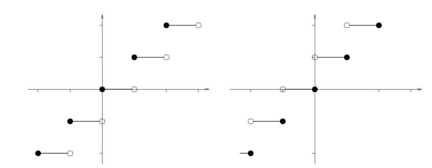

- We have the following conclusions for any integer $k$:

$$\lim_{ x \to k^- }  \lfloor x \rfloor  = k-1$$
$$\lim_{ x \to k^+ } \lfloor x \rfloor  = k$$
$$\lim_{ x \to k^- }  \lceil x \rceil = k$$
$$\lim_{ x \to k^+ } \lceil x \rceil  = k+1$$

**Example - Prove that $\lim_{x \to 0}1/x$ does not exist
- We need to find *any* sequence $(x_n)$ with $x_n \to 0$ for which $(f(x_n))$ does not converge.
- Take $x_n = 1/n$, then $x_n \to 0$, but $f(x_n) = n$ and $(n)$ is an unbounded sequence, so does not converge
- Hence $\lim_{x \to 0}1/x$ does not exist

#### Rules for Limits

**Combination Rules**
- If $\lim_{x \to a} f(x) = l$ and $\lim_{x \to a} g(x) = m$, then:

1. **sum rule** $$\lim_{ x \to a }(f(x) + g(x)) = l + m$$
2. **multiple rule** $$\lim_{ x \to a } \lambda f(x) = \lambda l$$
	-  for any $\lambda \in \mathbb{R}$
3. **product rule** $$\lim_{ x \to a } f(x)g(x) = lm$$
4. **quotient rule** $$\lim_{ x \to a } f(x)/g(x) = l/m$$
	- provided $m \ne 0$

**Squeeze Rule for Limits**
- If $f(x) \le g(x) \le h(x)$ for $x \ne a$, and $\lim_{x \to a} f(x) = l$ and $\lim_{x \to a}h(x) = l$, then $\lim_{x \to a}g(x) = l$

#### Continuity

**Overview**
- Intuitively, a continuous function is one whose graph does not contain any jumps
- If a function $f$ has a jump at a point $a$, then we expect that the left limit or right limit to be different from $f(a)$

**Definition of Continuity**
- Let $f : D \to \mathbb{R}$ be a function defined on some subset $D$ of $\mathbb{R}$.
- We say $f$ is *continuous* at a point $a \in D$ if $\lim_{x \to a} f(x)$ **exists** and **equals** $f(a)$.
- We say that $f : D \to \mathbb{R}$ is continuous if it is continuous at $a$ for every $a \in D$.
- ***Note*** that $f(a)$ must be defined for $f$ to be continuous at $a$.

**Examples**
1. The constant function $f : A \to \mathbb{R}, f(x) = c$ is continuous
	- Here if $a \in A$ and $x_n \to a$, then $f(x_n) = c$ for every $n$ so $(f(x_n))$ is the sequence $(c, c, ...)$ which converges to $c$.
	- But $f(a) = c$ so $f(x_n) \to c$
2. The identity function $f : A \to \mathbb{R}, f(x) = x$ is continuous.
	- To see this, let $a \in A$ and suppose $x_n \to a$. Then $f(x_n) = x_n$ and $f(a) = a$ so $f(x_n) \to f(a)$
3. The floor and ceiling functions are not continuous at $a$ if $a$ is an integer. Each is continuous at any point $a$ which is not an integer

#### Rules for Continuous Functions

**Rules**
- If $f$ and $g$ are *continuous* at $a$, then so are:
	1. the sum $f + g$
	2. the multiple $\lambda f$, where $\lambda in \mathbb{R}$
	3. the product $fg$
	4. the quotient $f/g$, provided $g(a) \ne 0$
- If $f$ is continuous at $a$ and $g$ is continuous at $f(a)$, then the composite function $g \circ f$ is continuous at $a$

**Proof for Sum Rule**
- Suppose $f$ and $g$ are continuous at $a$. Let $(x_n)$ be any sequence with $x_n \to a$, then we know that $$f(x_{n}) \to f(a) \hspace{1em} \text{and} \hspace{1em} g(x_{n}) \to g(a)$$
- But now the sum rule for sequences gives $f(x_n) + g(x_n) \to f(a) + g(a)$.
- Which tells us that $f + g$ is continuous at $a$

**Proof for Composite Rule**
- The *composite function* $(g \circ f)(x) = g(f(x))$ for each $x$.
- Suppose $f$ is continuous at $a$ and $g$ is continuous at $f(a)$
- Let $x_n \to a$, then since $f$ is continuous at $a$, we have $f(x_n) \to f(a)$. But $g$ is continuous at $f(a)$, so $g(f(x_n)) \to g(f(a))$, i.e. $(g \circ f)(x_n) \to (g \circ f)(a)$
- Hence $g \circ f$ is continuous at $a$

**Examples**
1. $f(x) = x$ and $f(x) = 1$. It follow from the combination rules that any polynomial function is continuous.
2. Any ratio of two polynomials is continuous (the domain of this function excludes the zeros of $q$)
3. The modulus function is continuous

#### Basic Continuous Functions

**Basic Continuous Functions**
- Polynomials and rational functions
- The modulus function
- The square root function
- The $n$th root function where $n \ge 1$ is an integer
- Trigonometric functions
- The exponential function
- Functions defined by power series

***IMPORTANT NOTE***
- The value of $\lim_{x \to a} f(x)$ does not depend on the value $f(a)$ of the function at $a$. 
- In fact the limit can exist even when the function $f$ is not defined at $a$

**Proof that $\lim_{x \to 0}\frac{\sin x}{x} = 1$
- Note that the function $\frac{\sin x}{x}$ does not exist at $x = 0$
- Consider the area of a sector of a circle of radius $1$ subtending an angle of $x$ radians at the centre

- We have *Area of triangle OPQ* < *area of sector* < *area of triangle OAB*

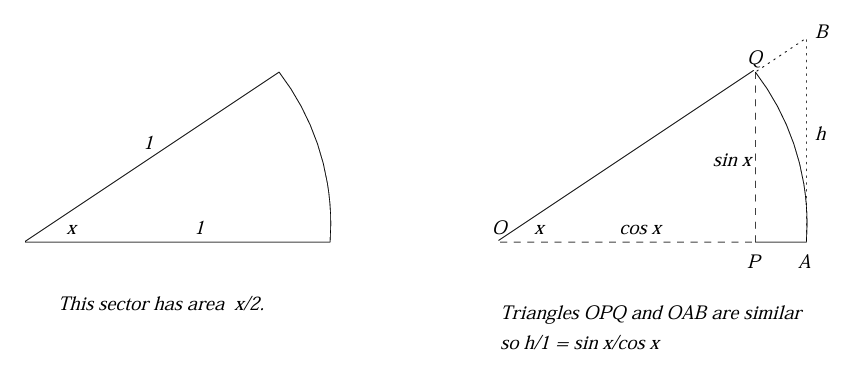

- Or equivalently: $$\frac{1}{2}\cos x \sin x < \frac{1}{2} (x)(1)^2 < \frac{1}{2 }(1)\left( \frac{\sin{x}}{\cos{x}} \right)$$
- By some algebraic manipulation, we get: $$\cos x < \frac{\sin{x}}{x} < \frac{1}{\cos x}$$
- Since $\cos$ is a continuous function, we have $\lim_{x \to 0}\cos x = 1$, and by the quotient rule, $\lim_{x \to 0}(1/\cos x) = 1$
- It follows from the squeeze rule that $$\lim_{ x \to 0 } \frac{\sin x}{x} = 1$$
#### Properties of Continuous Functions

**Intermediate Value Theorem**
- If $f : [a,b] \to \mathbb{R}$ is a *continuous* function, and $f(a)$ and $f(b)$ have opposite signs, then $f(c) = 0$ for some $c \in (a,b)$

**Proof**
- We assume $f(a) < 0$ and $f(b) > 0$ WLOG (we can apply it to the function $-f$ once we have proved it)

- Let $p$ be the midpoint of the interval $[a,b]$. If $f(p) = 0$, then we have found a point where $f$ is zero and the proof is complete
- Otherwise $f(p) > 0$ or $f(p) < 0$, so $f$ must have opposite signs at the endpoints of a smaller interval $[a_1, b_1]$ which is one of $[a,p]$ or $[p,b]$.

- Continuing in this way, we get a sequence of smaller and smaller intervals $[a_n, b_n]$ with $f(a_n) < 0$ and $f(b_n) > 0$.
- Now $(a_n)$ is an increasing sequence which is bounded above by $b$, and hence converges to some number $c$
- Similarly $(b_n)$ is a decreasing sequence which is bounded below by $a$ and so converges to some number $d$.
- But, since we halve the length of the interval at each stage, $$0 \le b_{n} - a_{n} \le (b-a)/2^n$$
- and since $(b-a)/2^n$ converges to $0$, it follows from the *squeeze rule* that $c - d = 0$ and so $c = d$
- Also $f(a_n) < 0$ and $f(b_n) > 0$ for all $n$, and since $f$ is continuous we have $$f(c) = \lim_{ n \to \infty } f(a_n) \le 0 \hspace{1em} \text{and} \hspace{1em} f(c) = f(d) = \lim_{ n \to \infty } f(b_{n}) \ge 0$$
- Hence $f(c) \le 0$ and $f(c) \ge 0$, so it follows that $f(c) = 0$

**Extreme Value Theorem**
- If $f : [a,b] \to \mathbb{R}$ is continuous, then there are points $m$, $M \in [a,b]$ with $$f(m) \le f(x) \le f(M)$$
- for all $x \in [a,b]$
- This means that a continuous function on a finite interval always has a *minimum* and *maximum*

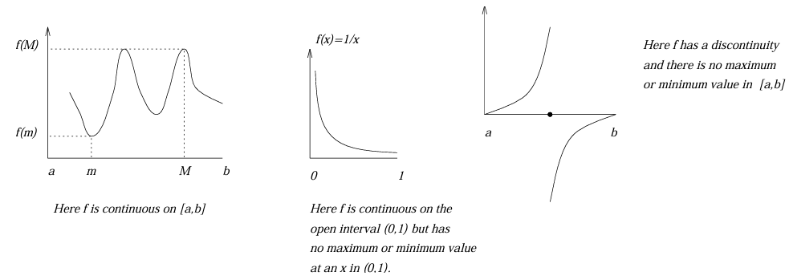

## 4.2 Differentiation

#### Differentiability

**Definition**
- Let $f$ be a real-valued function defined on some open interval of $\mathbb{R}$ containing the point $a$.
- If the limit $$\lim_{ x \to a } \frac{f(x) - f(a)}{x-a} \hspace{2em} \text{or equivalently} \hspace{2em} \lim_{ h \to 0 } \frac{f(a+h)- f(a)}{h}$$
- exists, then we say $f$ is **differentiable** at $a$, and denote the value of the limit by $f'(a)$.

**Notation**
- The function $f'$ is called the *derivative* of $f$. If $f'$ is differentiable its derivative is denoted $f''$ or $f^{(2)}$. Higher order derivatives are denoted $f^{(3)}, f^{(4)}, ...$
- Alternatively we can use *Leibniz* notation: $$f'x = \frac{d}{dx}f(x), \hspace{1em}f''(x) = \frac{d^2}{dx^2}f(x), \dots$$
**Theorem** - If $f$ is *differentiable* at $a$, then $f$ is *continuous* at $a$

**Proof**
- Suppose $f$ is differentiable at $a$. We need to show that $\lim_{x \to a}f(x) = f(a)$
- Now, $$f(x) - f(a) = \frac{f(x) - f(a)}{x-a} \times (x-a)$$
- where $$\lim_{ x \to a } \frac{f(x)-f(a)}{x-a} = f'(a) \hspace{1em} \text{and} \hspace{1em} \lim_{x \to a}(x-a) = 0 $$
- So by the product rule for limits, $$\lim_{ x \to a }(f(x) - f(a)) = \lim_{ x \to a }(\frac{f(x)-f(a)}{x-a} \times (x-a)) = f'(a) \times 0 = 0$$
- i.e. $\lim_{x \to a}f(x) = f(a)$. Hence $f$ is continuous at $a$

***NOTE*** - the converse of this result is **not** true in general. If $f$ is continuous at $a$, we can have that $f$ is not differentiable at $a$

**Example** - the modulus function $f(x) = |x|$ for each $x \in \mathbb{R}$ is not differentiable at $x = 0$
$$\frac{f(0) + h - f(0)}{h} = \frac{|h|}{h} = \begin{cases} 1 & h > 0, \\ -1 & h < 0\end{cases}$$
- Hence $\lim_{h \to 0^+}\frac{f(0 + h) - f(0)}{h} = 1$ and $\lim_{h \to 0^-}\frac{f(0+h)-f(0)}{h} = -1$
- Since the left and right hand limits are different, the limit $\lim_{h \to 0}\frac{f(0 + h) - f(0)}{h}$ does not exist.
- Hence $f$ is not differentiable at $x = 0$

#### Combination Rules for Derivatives

**Combination Rules**
- If $f$ and $g$ are differentiable, then:
	1. **sum** rule - $f+g$ is differentiable, $(f+g)' = f' + g'$
	2. **multiple** rule - $\lambda f$ is differentiable for any constant $\lambda \in \mathbb{R}$, and $(\lambda f)' = \lambda f'$
	3. **product** rule - $fg$ is differentiable and $(fg)' = fg' + f'g$
	4. **quotient** rule - $\frac{f}{g}$ is differentiable and $\left( \frac{f}{g} \right)' = \frac{f'g-fg'}{g^2}$

**Proof of the Product Rule**
- Suppose $f$ and $g$ are differentiable at $a$ To show that $fg$ is differentiable at $a$ we let $x \ne a$ and consider: $$\frac{f(x)g(x) - f(a)g(a)}{x-a} = \frac{f(x)g(x) - f(x)g(a) + f(x)g(a) - f(a)g(a)}{x - a}$$
$$= f(x)\left(\frac{g(x) - g(a)}{x-a}\right) + \left(\frac{f(x) - f(a)}{x-a}\right)g(a)$$
$$ = f(a)g'(a) + f'(a)g(a) \hspace{2em} \text{as} \space x \to a$$
- We have used the fact that differentiable functions are continuous, so $\lim_{x \to a} f(x) = f(a)$
- This shows that $fg$ is differentiable and $$(fg)'(a) = f(a)g'(a) + f'(a)g(a)$$
#### More Rules for Derivatives

**Proof of the Power Rule** 
- ***Theorem*** - $f'(x) = nx^{n-1}$ where $f(x) = x^n$, $n > 0$ is an integer
- We use *induction on $n$
- Base Case - $n = 1$, we have $f(x) = x$ $$\lim_{ h \to 0 }\frac{f(x+h) - f(x)}{h} = \lim_{ h \to 0 }\frac{x + h - x}{h} = \lim_{ h \to 0 }1 = 1$$
	- Hence $f$ is differentiable and $f'(x) = 1$ in this case
- Now suppose that $\frac{d}{dx}x^n = nx^{n-1}$. Let $f(x) = x^{n+1}$.
- Then $f(x) = x \cdot x^n$ so $$f'(x) = 1 \cdot x^n + xnx^{n-1} = (n+1)x^n$$
- by the **product rule**. The result now follows by induction

**Derivatives of trigonometric functions**
- The functions $\sin$, $\cos$ and $\tan$ are differentiable and: $$\frac{d(\sin x)}{dx} = \cos x, \hspace{2em} \frac{d(\cos x)}{dx} = -\sin x, \hspace{2em} \frac{d(\tan x)}{dx} = \sec^2(x)$$
- These can be obtained by the trigonometric identities: $$\sin A - \sin B= 2\cos \frac{1}{2}(A+B) \sin \frac{1}{2}(A-B)$$
$$\cos A - \cos B = -2\sin \frac{1}{2} (A+B) \sin \frac{1}{2}(A-B)$$
- The rule for $\tan$ can be derived by the quotient rule

**Chain Rule**
- If $f$ is differentiable at $x$ and $g$ is differentiable at $f(x)$, then the composite function $g \circ f$ is differentiable at $x$ and $$(g \circ f)'(x) = g'(f(x))f'(x)$$
- Alternatively writing $y = g(f(x))$ and $z = f(x)$ this becomes $$\frac{dy}{dx} = \frac{dy}{dz} \times \frac{dz}{dx}$$
**Differentiation of functions defined by power series**
- If $\sum(a_n x^n)$ is a power series with radius of convergence $R$, and $f$ is the function defined by $$f(x) = \sum_{n=0}^\infty a_{n}x^n \hspace{2em} (-R < x < R)$$
- then $f$ is differentiable and $$f'(x) = \sum_{n=1}^\infty na_{n}x^{n-1} \hspace{2em} (-R < x < R)$$

**Exponential Function**
- The exponential function is defined as the sum of a power series: $$e^x = \sum_{n=0}^\infty \frac{x^n}{n!} \hspace{2em} \text{for all} \space x \in \mathbb{R}$$
- The exponential function is its own derivative: $$\frac{d}{dx}e^x = e^x$$

#### Partial Differentiation

**Definition**
- The *partial derivative* of a function $f(x,y)$ of two independent variables $x$ and $y$ is obtained differentiating $f(x,y)$ with respect to one of the two variables while holding the other constant

**Example** - $f(x,y) = x^3 - \sin xy$
$$\frac{\partial f(x,y)}{\partial x}  = 3x^2 - y \cos xy$$
$$\frac{\partial f(x,y)}{\partial y} = -x\cos xy$$
**Notation**
- $\frac{ \partial f}{\partial x}, \frac{\partial f}{\partial y}$ are often written as $f_x, f_y$ respectively
- We can also have **second** partial derivatives with respect to different variables: $$\frac{\partial^2 f(x,y)}{\partial x \partial y} = f_{xy}$$
**Clairaut's Theorem**
- ***Note*** that the *order does not matter* when differentiating higher order derivatives, i.e. $f_{xy} = f_{yx}$
- This is true when $f_{xy}$ and $f_{yx}$ are both continuous on the same interval $f$ is defined on

## 4.3 Properties of Differentiable Functions

#### Turning Points, Stationary Points, Points of Inflection

**Turning Points**
- ***Def***. If $f(x) \le f(a)$ for all $x$ in some interval around a point $a$, then $f$ is said to have a *local maximum* at $a$
- ***Def***. Similarly if $f(x) \ge f(a)$ for all $x$ in some interval around $a$, then $f$ is said to have a *local minimum* at $a$
- ***Def***. A point which is either a local maximum or a local minimum is called a **turning point** of $f$

**Turning Point Theorem**
- If a *differentiable function* $f$ has a *turning point* at $a$, then $f'(a) = 0$

**Proof**
- Suppose $f$ has a local maximum at $a$ and $x$ is sufficiently close to $a$. Then for $x < a$ we have $f(x) \le f(a)$, so the numbers $x - a$ and $f(x) - f(a)$ are negative, and hence $$\frac{f(x)-f(a)}{x-a} \ge 0 \hspace{2em} \text{so} \hspace{2em} \lim_{ x \to a^- } \frac{f(x) - f(a)}{x-a} \ge 0$$
- Similarly for $x > a$ we have $f(x) \le f(a)$, so $x - a$ is positive and $f(x) - f(a) \le 0$, giving $$\frac{f(x) - f(a)}{x-a} \le 0 \hspace{2em} \text{so} \hspace{2em} \lim_{ x \to a^+ } \frac{f(x) - f(a)}{x-a} \le 0$$
- Both these limits equal $f'(a)$ as $f$ is continuous, and we have shown $f'(a) \le 0$ and $f'(a) \ge 0$, which is only possible if $f'(a) = 0$

- If $f$ has a local minimum at $a$, then the function $-f$ has a local maximum at $a$, so we have shown $-f'(a) = 0$ or $f'(a) = 0$
**End**

**Stationary Points, Points of Inflection**
- A point $a$ where $f'(a) = 0$ is called a *stationary point* of $f$.
- In general a stationary point need not be a turning point.
- If a stationary point is neither a local maximum nor a local minimum, it is a *point of inflection*

**Locating Maxima and Minima**
- If $f$ is continuous on $[a,b]$ and differentiable on $(a,b)$, then to locate the maximum and minimum values of $f$ on $[a,b]$ we need to consider only the values of $f$ at:
	1. the stationary points of $f$ in $(a,b)$
	2. the end points $a$ and $b$

#### Rolle's Theorem, Mean Value Theorem

**Rolle's Theorem**
- If $f : [a,b] \to \mathbb{R}$ is continuous, is differentiable on $(a,b)$ and $f(a) = f(b)$, then there is a point $c \in (a,b)$ with $f'(c) = 0$

**Proof**
- If $f$ is a constant function, then $f'(c) = 0$ for every $c$. 
- Otherwise, by the Extreme Value Theorem, $f$ must have a local maximum or minimum $c$ in $(a,b)$ and by the Turning Point Theorem $f'(c) = 0$

**The Mean Value Theorem**
- If $f$ is *continuous* on $[a,b]$ and *differentiable* on $(a,b)$, then there is a $c \in (a,b)$ with $$f'(c) = \frac{f(b)-f(a)}{b-a}$$
- This is proved from Rolle's Theorem by 'changing coordinates' so we get a function taking the same value at each end of the interval
- More precisely, apply Rolle's Theorem to the function $h$ given by $$h(x) = f(x) - \frac{f(b)-f(a)}{b-a}(x-a)$$
- We can **note** that $h(a) = f(a)$ and $h(b) = f(b) - (f(b) - f(a)) = f(a)$. 
- Hence $h(a) = h(b)$ and we can apply Rolle's theorem

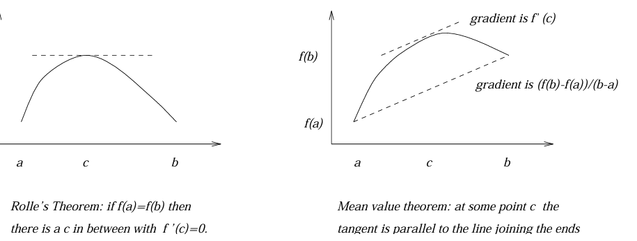

#### Consequences of the Mean Value Theorem

**Consequences of the Mean Value Theorem**
- Suppose $f$ is *continuous* on $[a,b]$ and *differentiable* on $(a,b)$
1. 
	- If $f'(x) = 0$ for all $x \in (a,b)$, then $f$ is constant on $[a,b]$
	- If $f'(x) > 0$ for all $x \in (a,b)$, then $f$ is strictly increasing on $(a,b)$, i.e. $f(x_2) > f(x_1)$ whenever $x_2 > x_1$
	- If $f'(x) < 0$ for all $x \in (a,b)$, then $f$ is strictly decreasing on $(a,b)$, i.e. $f(x_2) < f(x_1)$ whenever $x_2 > x_1$

2. **Second Derivative Test**
	- Suppose that $f'(c) = 0$. If $f''(c) > 0$ then $f$ has a local minimum at $c$.
	- If $f''(c) < 0$ then $f$ has a local maximum at $c$


**Proofs - First Result**
- Let $x_1, x_2$ be any two points in $(a,b)$ with $x_1 < x_2$.
- Applying the Mean Value Theorem to $f$ on $[x_1, x_2]$ tells us there exists a $c$ with $$\frac{f(x_{2}) - f(x_{1})}{x_{2} - x{1}} = f'(c)$$
- Now $x_2 - x_1$ is positive so:
	- If $f'$ is always positive, $f'(c) > 0$ and so $f(x_2) > f(x_1)$
	- If $f'$ is always negative, $f'(c) < 0$ and so $f(x_2) < f(x_1)$
	- If $f'$ is always zero, $f'(c) = 0$ so $f(x_2) = f(x_1)$

**Proofs - Second Derivative Test**
- This proof only proves the first part - *local minimum*
- If $f'(a) = 0$ and $f''(a) > 0$, then $$f''(a) = \lim_{ h \to 0 } \frac{f'(a+h) - f'(a)}{h} = \lim_{ h \to 0 } \frac{f'(a+h)}{h} > 0 $$
- It follows that $f'(a+h)/h$ must be positive for sufficiently small $h$
- Now if such a $h$ is positive, then $f'(a+h)$ must be positive, while if $h$ is negative then $f'(a+h)$ must be negative
- Hence by part (1) above, $f$ is increasing to the right of $a$ and decreasing to the left of $a$
- Therfore $f$ has a local minimum at $a$

- We can prove the second part for *local maximum* similarly.
	 
#### Indefinite Integrals

**Indefinite Integrals**
- Property (1) has an important application to integrals
- ***Def***. We say that a function $F$ is an *indefinite* integral of $f$ if $F' = f$
- If $F$ and $G$ are both integrals of $f$, then $$(G-F)' = G'-F' = f-f = 0$$
- Hence $G-F$ is a constant. This means that there is a $k \in \mathbb{R}$ with $G(x) = F(x) + k$ for all $x$
- Therefore, any two indefinite integrals of a function *can differ only by a constant*

#### Curve Sketching

**Guidelines to Curve Sketching**
1. Find the stationary points $x$, where $f'(x) = 0$
2. Find the value of $f(x)$ at each stationary point $x$
3. Find the nature of the stationary point of $x$. 
	- If $f''(x) = 0$ use $f'$ to determine the behaviour on either side of the stationary point
4. Find the values of $x$ where $f(x) = 0$, i.e. find its *zeros* if possible
5. Determine the behaviour of $f(x)$ as $x \to \pm \infty$
6. Investigate the nature of $f(x)$ in the neighbourhood of points where $f(x)$ becomes infinite.

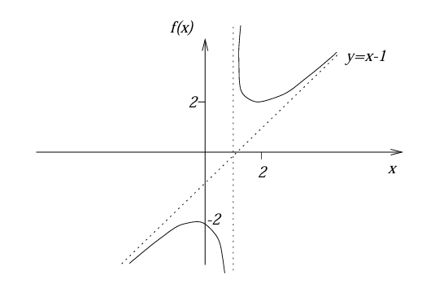

## 4.4 L'Hopital's Rule, Implicit Differentiation

#### L'Hopital's Rule

**Definition**
- Suppose that $f(a) = 0$ and $g(a) = 0$. 
- If $\lim_{x \to a} f'(x)/g'(x)$ exists, then so does $\lim_{x \to a} f(x)/g(x)$ and $$\lim_{ x \to a } \frac{f(x)}{g(x)} = \lim_{ x \to a } \frac{f'(x)}{g'(x)}$$
- This is useful for calculating limits of the form $\lim_{x \to a} f(x)/g(x)$ where $f(a) = 0 = g(a)$


**Reasoning**
- If we assume that $f$ and $g$ are differentiable at $g'(a) \ne 0$, then: $$\frac{f(x)}{g(x)} = \frac{f(x) - 0}{g(x) - 0} = \frac{f(x)-f(a)}{g(x)-g(a)} = \frac{\frac{f(x)-f(a)}{x-a}}{\frac{g(x)-g(a)}{x-a}} \to \frac{f'(a)}{g'(a)}$$
- Hence $\lim_{x \to a} f(x)/g(x)$ exists and equals $f'(a)/g'(a)$

#### Implicit Differentiation

**Overview**
- Implicit functions of $x$ are defined by an equation relating $x$ and some other variable, e.g. $y$
- It is possible to obtain the derivative without solving the original equation for a function $y = f(x)$
- Differentiate both sides of the equation with respect to $x$, treating $y$ as a function of $x$, using the chain rule.

**Example**
 $$x^2 + y^2 = 1$$
$$\implies 2x + 2y \frac{dy}{dx} = 0 \hspace{2em} \text{differentiating with respect to} \space x$$$$\implies \frac{dy}{dx} = -\frac{x}{y}$$

## 4.5 Differentiation of Inverse Functions

#### Range, Injection, Surjection, Bijection

- Let $f : A \to B$ be a function from a set $A$ to a set $B$

**Range**
- The *range* of $f$ is the set $\{y \in B \space | \space f(x) = y \space \text{for some} \space x \in A\}$

**Surjective (onto)**
- the range of $f$ is equal to $b$, i.e. for every $y \in B$ there is an $x \in A$ with $f(x) = y$

**Injective (one-to-one)**
- Whenever $x, z \in A$ with $f(x) = f(z)$ then $x = z$
- Or ... $\forall x, z \in A: x \ne z \implies f(x) \ne f(z)$

**Bijective (one-to-one correspondence)**
- Both injective and surjective, i.e. for every $y \in B$ there is exactly one $x \in A$ with $f(x) = y$

**Theorem** - a function $f  : A \to B$ is bijective if and only if it has an inverse function $f^{-1} : B \to A$ which satisfies: $$f^{-1}(y) = x \iff f(x) = y$$
- The graph of $f^{-1}$ can be obtained by reflecting $y = f(x)$ in the equation $y = x$

**NOTE** - If $f : A \to B$ is not bijective, then we can often obtain a bijective function by considering subsets of $A$ and $B$. If $A \to B$ is injective and has range $C$, then $f : A \to C$ is bijective. Hence we can associate an inverse with any injective function

#### Inverse Functions

**Continuity of Inverse Functions**
- If $f : [a,b] \to \mathbb{R}$ is a *continuous injective* function with range $C$, then the inverse function $f^{-1} : C \to [a,b]$ is also continuous

**Theorem - Differentiation of Inverse Functions**
- Let $f : [a,b] \to \mathbb{R}$ be a *continuous* function. If $f$ is differentiable on $(a,b)$ and **either** $f'(x) > 0$ for all $x \in (a,b)$ **or** $f'(x) < 0$ for all $x \in (a,b)$, then $f$ has an *inverse* function $f^{-1}$ which is differentiable.
- If $y = f(x)$ then : $$f^{-1}(y) = \frac{1}{f(x)} \hspace{2em} \text{or equivalently} \hspace{2em} \frac{dx}{dy} = \frac{1}{\frac{dy}{dx}}$$
**Proof**

- Note that if $f'$ is always positive then $f$ is strictly increasing on $(a,b)$ and so is injective. Hence an inverse function $f^{-1}$ exists.
- The derivative of $f^{-1}$ at the point $y = f(x)$ is: $$(f^-1)'(y) = \lim_{ k \to 0 } \frac{f^{-1}(y+k) - f^{-1}(y)}{k} = \frac{f^{-1}(y + k) - x}{k}$$
- since $x = f^{-1}(y)$

- Now we define $h =f^{-1}(y + k) - x$, then: $$x + h = f^{-1}(y + k)$$$$\implies f(x + h) = y + k$$
$$\implies k = f(x + h) - y = f(x + h) - f(x)$$
- So for $k \ne 0$, we have $h \ne 0$ and therefore $$\frac{f^{-1}(y + k) - f^{-1}(y)}{k} = \frac{h}{f(x) + h - f(x)} = \frac{1}{\frac{f(x + h) -f(x)}{h}}$$
- Now as $k \to 0$, we have $f^{-1}(y + k) \to f^{-1}(y)$ since $f^{-1}$ is continuous, so $h = f^{-1}(y+k) - f^{-1}(y) \to 0$, giving $$\lim_{ k \to 0 } \frac{f^{-1}(y+k) - f^{-1}(y)}{k} = \lim_{ h \to 0 }\frac{1}{\frac{f(x + h) - f(x)}{h}}  = \frac{1}{f'(x)}$$
- This shows that $f^{-1}$ is differentiable and $$(f^{-1})' = \frac{1}{f'(x)} \hspace{2em} \text{or} \hspace{2em} \frac{d}{dy}f^{-1}(y) = \frac{1}{\frac{d}{dx}f(x)}$$
#### Inverse Functions - Examples

**Power Rule for Rational Numbers**
- We can find the derivative of the function $f(x) = x^{1/n}$ for some fixed $n > 0$, and the derivative is $$\frac{1}{n}x^{1/n -1}$$
- This can be found by writing the inverse function $x = y^n$, and differentiating the inverse function to get $\frac{dy}{dx} = \frac{1}{ny^{n-1}}$
- We can then substitute $y^{n-1} = x^{(n-1)/n}$ to get the final result

- This result can then be used to prove that the power rule holds for any rational number $p/q$, so that  $$\frac{d}{dx}x^{p/q} = \frac{p}{q}x^{\frac{p}{q}-1}$$

**Inverse Trigonometric Functions - Inverse Sine**
- We need to restrict the sine function to make it bijective: $\sin : [-\pi/2, \pi/2] \to [-1,1]$

- Then, the inverse function $\arcsin$ has a derivative: $$\frac{d}{dx}\arcsin(x) = \frac{1}{\sqrt{ 1-x^2 }} \hspace{2em} (-1 < x < 1)$$
**Inverse Trigonometric Functions - Inverse Cosine**
- We can similarly restrict $\cos$ to make it bijective: $\cos : [0, \pi] \to [-1, 1]$

- Then, the inverse function $\arccos$ has a derivative: $$\frac{d}{dx}\arccos(x) = -\frac{1}{\sqrt{ 1-x^2 }} \hspace{2em} (-1 < x < 1)$$
**Inverse Trigonometric Functions - Inverse Tangent**
- We can restrict the tangent function to $\tan : (-\pi/2, \pi/2) \to \mathbb{R}$ to make it bijective.

- Then, the inverse function $\arctan$ has a derivative: $$\frac{d}{dx}\arctan(x) = \frac{1}{1+x^2} \hspace{2em} (x \in \mathbb{R})$$
## 4.6 Integration

#### Integrability

**The Setup**
- Let $f : [a,b] \to \mathbb{R}$ be a *bounded* function. A *partition* of $[a,b]$ is a set $P = \{x_0, x_1, x_2, ..., x_n\}$ of points with $$a = x_{0} < x_{1} < x_{2} < \dots < x_{n-1} < x_{n} = b$$
- For such a partition $P$ define: 
	- $m_r$ to be the *greatest lower bound* of the set $\{f(x) | x_{r-1} \le x \le x_r\}$
	- $M_r$ to be the *least upper bound* of the set $\{f(x) | x_{r-1} \le x \le x_r\}$

- Then we have $m_r \le f(x) \le M_r$ whenever $x_{r-1} \le x \le x_r$, so the area of the graph of $f$ between $x_{r-1}$ and $x_r$ to lie between $(x_r - x_{r-1})m_r$ and $(x_r - x_{r-1})M_r$.
- To estimate the area under the graph between $a$ and $b$, we sum contributions from all these sub-intervals.

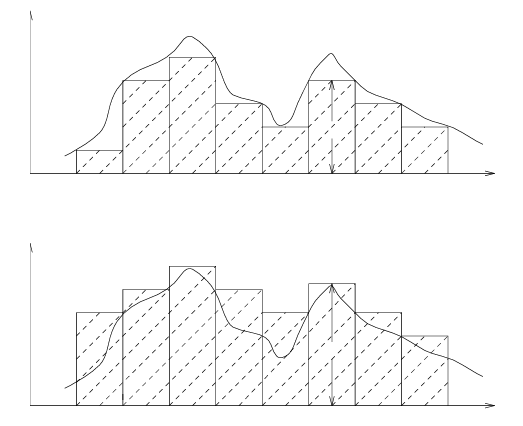

- For each partition $P = \{x_0, x_1, ..., x_n\}$ of $[a,b]$ we define the lower sum $L(f, P)$ and the upper sum $U(f, P)$ by $$L(f, P) = \sum_{r=1}^n(x_{r}-x_{r-1})m_{r}$$
$$U(f, P) = \sum_{r=1}^n(x_{r}-x_{r-1})M_{r}$$
- Geometrically, these represent lower and upper estimates of the area under the graph of $f$.

**Integrability and the Definition of the Integral**
- ***Def.*** If there is a unique number $A$ with $$L(f, P) \le A \le U(f, P)$$ for every partition $P$ of $[a, b]$, then say that $f$ is ***integrable*** over $[a,b]$.

- Call $A$ the *definite integral* (or area under the graph) of $f$ between $a$ and $b$, and write $$A = \int_a^b f(x) dx$$
- It is useful to define $\int_a^b f(x) dx$ when $b \le a$ which we do by setting $$\int_{a}^a f(x) dx, \hspace{2em} \int_{a}^b f(x) dx = -\int_{b}^a f(x)dx$$
#### Properties of Definite Integrals

**Basic Integrable Functions**
1. Any continuous function on $[a,b]$ is integrable over $[a,b]$
2. Any function which is increasing over $[a,b]$ is integrable over $[a,b]$
3. Any function which is decreasing over $[a,b]$ is integrable over $[a,b]$

***NOTE*** - a function does not have to be continuous to be integrable, but a function has to be continuous to be differentiable

**Properties of Definite Integrals**
1. **Sum** Rule - if $f$ and $g$ are integrable, then so is $f+g$, and $$\int_{a}^b (f(x) + g(x))dx = \int_{a}^b f(x)dx + \int_{a}^b g(x) dx$$
2. **Multiple** Rule - if $f$ is integrable and $\lambda \in \mathbb{R}$, then $\lambda f$ is integrable, and $$\int_{a}^b \lambda f(x) dx = \lambda \int_{a}^b f(x) dx$$
3. **Interval Combining** Rule - If $f$ is integrable over $[a,c]$ and over $[c,b]$, then $f$ is also integrable over $[a,b]$, and $$\int_{a}^b f(x)dx = \int_{a}^c f(x)dx + \int_{c}^b f(x)dx$$
4. **Area Comparison** Rule - If $f(x) \le g(x)$ for every $x \in [a,b]$, then $$\int_{a}^b f(x)dx \le \int_{a}^b g(x)dx$$
	- if both integrals exist

**Area Under the Graph**
- If $f$ is a positive function, then the integral of $f$ over $[a,b]$ represents the area between the graph of $f$ and the $x$-axis between $x = a$ and $x = b$.
- For a general $f$, the integral represents the difference of the area between the positive part of $f$ and the $x$-axis, and the area between the negative part of $f$ and the $x$-axis

#### The Fundamental Theorem of Calculus

**The First Fundamental Theorem of Calculus**
- Let $f : [a,b] \to \mathbb{R}$ be integrable, and define $F : [a,b] \to \mathbb{R}$ by $$F(x) = \int_{a}^x f(t) dt$$
- If $f$ is continuous at $c \in (a,b)$, then $F$ is differentiable at $c$ and $F'(c) = f(c)$.

**The Second Fundamental Theorem of Calculus**
- Let $f : [a,b] \to \mathbb{R}$ be *continuous*, and suppose $F$ is a differentiable function with $F' = f$, then $$\int_{a}^b f(x)dx = [F(x)]_{a}^b$$
- where $[F(x)]_a^b$ denotes $F(b) - F(a)$

**Proof of the Second Theorem**
- Let $P = \{x_0, x_1, x_2, ..., x_n\}$ be a partition of $[a,b]$. Applying the Mean Value Theorem to the function $F$ on each subinterval $[x_{r-1}, x_r]$ tells us there is a point $c_r \in [x_{r-1}, x_{r}]$ with $$f(c_{r}) = F'(c_{r}) = \frac{F(x_{r}) - F(x_{r-1})}{x_{r} - x_{r-1}}$$
- i.e. $(x_r - x_{r-1})f(c_r) = F(x_r) - F(x_{r-1})$

- Now if:
	- $m_r$ is the greatest lower bound of the set $\{f(x) | x_{r-1} \le x \le x_r\}$
	- $M_r$ is the least upper bound of the set $\{f(x) | x_{r-1} le x \le x_r\}$
- then we have $m_r \le f(c_r) \le M_r$, so $$(x_{r} - x_{r-1})m_{r} \le (x_{r}- x_{r-1})f(c_{r}) \le (x_{r}-x_{r-1})M_{r} \hspace{2em} (1 \le r \le n)$$
- Adding these inequalities gives us $$L(f, P) \le \sum_{r=1}^n(x_{r} - x_{r-1})f(c_{r}) = \sum_{r=1}^n(F(x_{r}) - F(x_{r-1})) \le U(f,P)$$
- Now, $$\sum_{r=1}^n(F(x_{r})-F(x_{r-1})) = F(x_{1}) - F(x_{0}) + F(x_{2}) - F(x_{1}) + \dots + F(x_{n}) - F(x_{n-1})$$
$$ = F(x_{n}) - F(x_{0}) = F(b) - F(a)$$
- since $x_0, x_n$ are just the end points of the interval $[a,b]$. Hence we have $$L(f,P) \le F(b) - F(a) \le U(f,P) \hspace{2em} \text{for every partition} \space P \space \text{of} \space [a,b]$$
- But $\int_a^b f(x) dx$ is, *by definition*, the only number that lies in between every lower and upper sum, so $$\int_{a}^b f(x)dx = F(b) - F(a)$$
**The Second Fundamental Theorem (Alternative Statement)**
- If $\frac{d}{dx}F(x) = f(x)$ for all $x$, and $f$ is continuous, then $$\int f(x)dx = F(x) + c$$ for some constant $c$

- A function $F$ with $F' = f$ is called an *indefinite* integral of $f$ and is denoted writing $F(x) = \int f(x) dx$. It has been shown earlier that any two integrals of $f$ can only differ by a constant.

## 4.7 Logarithmic and Exponential Functions

#### Logarithms

**Definition**
- For each $x > 0$, we define $\log x$ by the formula $$\log x = \int_{1}^x \frac{1}{t}dt$$
- This integral exists since the integrand defines a continuous function in the interval between $1$ and $x$ for any $x > 0$.

***NOTE***: By this definition of $\log$, $\log = \log_e = \ln$ by most conventions

**Properties of Logarithms**
1. $\log(1) = 0$
2. $\log$ is a strictly increasing function, i.e. if $x < y$ then $\log x < \log y$
3. $\log$ is a differentiable function and $$\frac{d}{dx}\log x = \frac{1}{x}$$ for every $x > 0$
4. $\log(xy) = \log(x) + \log(y)$ for any $x, y > 0$
5. $\log(x/y) = \log x - \log y$
6. The function $\log : (0, \infty) \to \mathbb{R}$ is bijective.

**Proofs**

1. $\log(1) = \int_1^1(1/t)dt = 0$, because the integration limits are the same

2. If $x < y$, then $$\log y - \log x = \int_{1}^y \frac{1}{t}dt - \int_{1}^x \frac{1}{t}dt = \int_{1}^y \frac{1}{t} dt + \int_{x}^1 \frac{1}{t}dt = \int _{x}^y \frac{1}{t}dt > 0$$
- since the integrand is always $>0$. Hence $\log x < \log y$

3. This is immediate from the First Fundamental Theorem of Calculus

4. Fix $y > 0$ and define $f(x) = \log(xy)$, then $$f'(x) = \frac{1}{xy}\left( \frac{d}{dx}xy \right) = \frac{1}{xy}y = \frac{1}{x} = \frac{d}{dx}\log x$$
- But if two functions have the same derivative, then they can only differ by a constant, so there is a $c$ with $\log(xy) = \log(x) + c$.
- Putting $x = 1$ gives $\log y = c$, and therefore $\log(xy) = \log x + \log y$

 5. Using property (4), we have $$\log x = \log\left( \frac{x}{y}y \right) = \log\left( \frac{x}{y} \right) + \log y$$
	- Hence $\log(x/y) = \log x - \log y$

6. 
	- Since $\log$ is strictly increasing it is injective. Also $\log(2^n) = n \log 2$, and $\log(1/2^n) = -n\log 2$, which implies that $\log$ is not bounded above or bounded below.
	- Since $\log$ is continuous, its range must be all of $\mathbb{R}$.

#### Exponentials

**Definition**
- Since $\log : (0, \infty) \to \mathbb{R}$ is bijective, it has an inverse function $\mathbb{R} \to (0, \infty)$ which we denote by $\exp$. 
- Hence these two functions are related by $$y = \exp(x) \iff x = \log y \hspace{2em} (x \in \mathbb{R}, y > 0)$$
- We also define $e$ to be the number $\exp(1)$.

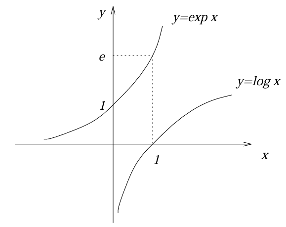

**Properties of the Exponential Function**
- For any $x,y \in \mathbb{R}$:
	1. $\exp(x + y) = \exp(x)\exp(y)$
	2. $\exp$ is differentiable, $\frac{d}{dx}\exp(x) = \exp(x)$ and $\exp(0) = 1$
	3. **Limit Definition** $$\exp(x) = \lim_{ n \to \infty }  (1+\frac{x}{n})^n$$
	4. **Taylor Series** $$\exp(x) = \sum_{n=0}^\infty \frac{x^n}{n!}$$

**Proofs**
1. We have $$\log(\exp x \exp y) = \log(\exp x) + \log(\exp y) = x + y$$
	- So $\exp x \exp y = \exp(x + y)$
2. Let $y = \exp x$ then $x = \log y$, so $$\frac{dx}{dy} = \frac{1}{y}, \hspace{1em} \text{giving} \space \frac{dy}{dx} = y = \exp x$$
3. *Not verified in notes*
4. *Verified later in notes*
#### General Exponentials, Change of Base

**Proving $\log x^q = q \log x$ for rational $q$**
- It follows from the properties of the logarithm function that $\log x^q = q \log x$ for any rational number $q$
- We can prove this by induction that $\log x^n = n \log x$ for any integer $n \ge 0$, and use $$\log(x^{-n}) = \log(1/x^n) = \log(1) - \log(x^n) = -\log(x^n) = -n\log x$$
- to extend the proof to any integer component. 
- Finally, if $m, n$ are integers with $n \ne 0$ then $$n \log x^m/n = n\log(x^m)^1/n = \log x^m = m \log x$$
- So $\log x^m/n = (m/n) \log x$. Now for any rational number $q$ we have $\log x^q = q \log x$

**Generalising $\exp$ to $e^x$**
- We can take $x = e$ and use the previous result to show that $\log(e^q) = q \log e = q$, so $e^q = \exp(q)$.
- This suggests we can define $e^x = \exp x$ even when $x$ is irrational.
- Justification - usual laws for exponents hold

**Definition**
- For each $x \in \mathbb{R}$, define $e^x$ by $e^x = \exp(x)$ where $\exp$ is the inverse function of $\log$. Then $$e^{x+y} = e^x e^y \hspace{2em} \text{for any} \space x, y \in \mathbb{R}$$
**Generalising to Normal Exponentials**

- If $q$ is a rational number and $a > 0$, then $a^q = \exp(\log a^q) = e^{q \log a}$. The RHS is defined even when $q$ is irrational, so we use this to give a general definition for $a^x$

- ***Def.*** For $a > 0$ and $x \in \mathbb{R}$, define $a^x$ by: $$a^x = e^{x \log a}$$
- Then for $a, b > 0$ and $x,y \in \mathbb{R}$, the following properties hold: 
	-  $\log a^x = x \log a$
	- $(ab)^x = a^x b^x$
	- $a^x a^y = a^{x+y}$
	- $(a^x)^y = a^{xy} = (a^y)^x$

**Change of Base**
- Finally, we can define the logarithm of $x$ to an arbitrary base $b$ by $$\log_{b}(x) = \frac{\log x}{\log b}\hspace{1em} (b \ne 1)$$
- which gives: $$y = \log_{b}(x) \iff \log x =y \log b \iff x = b^y$$
**Defining Power Rule for Real Numbers**
- We can define the power rule $\frac{d}{dx}x^a = ax^{a-1}$ for any $a \in \mathbb{R}$ with $x > 0$.
- **Proof:** $$\frac{d}{dx}x^a = \frac{d}{dx}e^{a \log x} = e^{a \log x}\left( \frac{a}{x} \right) = x^a\left( \frac{a}{x} \right) = ax^{a-1}$$
## 4.8 Taylor's Theorem

#### Taylor's Theorem

**Definition**
- Let $f$ be an $(n+1)$-times differentiable function on an open interval containing the points $a$ and $x$. Then $$f(x) = f(a) + f'a)(x-a) + \frac{f''(x)}{2!}(x-a)^2 + \dots + \frac{f^{(n)}(a)}{n!}(x-a)^n + R_{n}(x)$$
- where $$R_n(x) = \frac{f^{(n+1)}(c)}{(n+1)!}(x-a)^{n+1}$$ for some number $c$ between $a$ and $x$.

- The function $T_n$ defined by $$T_{n}(x) = a_{0} + a_{1}(x-a) + a_{2}(x-a)^2 + \dots + a_{n}(x-a)^n \hspace{2em} \text{where} \space a_{r} = \frac{f^{(r)}(a)}{r!}$$ is called the *Taylor Polynomial* of degree $n$ of $f$ at $a$. 

- This can be thought of as a polynomial which approximates the function $f$ in some interval containing $a$.
- The error in the approximation is given by the remainder term $R_n(x)$

- If we can show $R_n(x) \to 0$ as $n \to \infty$, then we get a sequence of better and better approximations to $f$ leading to a power series expansion $$f(x) = \sum_{n=0}^\infty\frac{f^{(n)}(a)}{n!}(x-a)^n$$
- which is known as the *Taylor Series* for $f$
- ***NOTE*** - the *Taylor series* is the infinite version of the *Taylor Polynomial*

**Connection with Mean Value Theorem**
- When $n = 0$, Taylor's theorem reduces to the Mean Value Theorem which is itself a consequence of Rolle's Theorem

**Proof of Taylor's Theorem**
- The remainder term is given by $$R_{n}(x) = f(x) - f(a) - f'(a)(x-a) - \frac{f''(a)}{2!}(x-a)^2 - \dots - \frac{f^{(n)}(a)}{n!}(x-a)^n$$
- Fix $x$ and $a$. For $t$ between $x$ and $a$ set $$F(t) = f(x) - f(t) - f'(t)(x-t) - \frac{f''(t)}{2!}(x-t)^2 -\dots-\frac{f^{(n)}(t)}{n!}(x-t)^n$$ so that $F(a) = R_n(x)$. Then, $$F'(t) = -f'(t) + \left[-f''(t)(x-t) + f'(t) \right] + \left[-\frac{f'''(t)}{2!}(x-t)^2 + f''(t)(x-t) \right] + \dots + \left[\frac{-f^{(n+1)}(t)}{n!}(x-t)^n + \frac{f^{(n)}(t)}{(n-1)!}(x-t)^{n-1} \right]$$ $$ F'(t) = -\frac{f^{(n+1)}(t)}{n!}(x-t)^n$$
- Now defining $$G(t) = F(t) - \left(\frac{x-t}{x-a} \right)^{n+1} F(a)$$ we have $G(a) = 0$ and $G(x) = F(x) = 0$
- Applying Rolle's theorem to the function $G$ shows there is a $c$ between $a$ and $x$ with $G'(c) = 0$. Now $$0 = G'(c) = F'(c) + (n+1)\frac{(x-c)^n}{(x-a)^{n+1}}F(a)$$ $$ = -\frac{f^{(n+1)}(c)}{n!}(x-c)^n + (n+1)\frac{(x-c)^n}{(x-a)^{n+1}}F(a)$$
- But $F(a) = R_n(x)$ and rearranging the last equation gives $$R_{n}(x) = F(a) = \frac{f^{(n+1)}(c)}{(n+1)!}(x-a)^{n+1}$$

#### $n$th derivative test

**$n$th derivative test for the nature of stationary points
- Suppose that $f$ has a stationary point at $a$ and that $f'(a) = ... = f^{(n-1)}(a) = 0$, while $f^{(n)}(a) \ne 0$.
- If $f^{(n)}$ is continuous then
	1. if $n$ is even and $f^{(n)}(a) > 0$ then $f$ has a local minimum at $a$
	2. if $n$ is even and $f^{(n)}(a) < 0$ then $f$ has a local maximum at $a$
	3. if $n$ is odd then $f$ has a point of inflection at $a$

**Intuition for $n$th derivative test**
- Note that if the first $n-1$ derivatives all vanish at $a$, then by Taylor's Theorem: $$f(x) - f(a) = R_{n-1}(x) = \frac{f^{(n)}(c)}{n!}(x-a)^n$$ for some $c$ between $x$ and $a$

- When $n$ is even, the term $(x-a)^n$ is always positive. If $f^{(n)}(a) > 0$ then $f^{(n)}(c) > 0$ provided $x$ (and therefore $c$) is sufficiently close to $a$.
- hence $f(x) - f(a) > 0$ for all $x$ sufficiently close to $a$, so there is a local minimum at $a$
- A similar argument shows that if $f^{(n)}(a) < 0$ then we have a local maximum

- When $n$ is odd, then $(x-a)^n$ and therefore $f(x) - f(a)$ have opposite signs for $x < a$ and $x > a$ so there is a point of inflection at $a$.

#### Maclaurin Series

**Maclaurin Series**
- Taking $a = 0$ in Taylor's theorem gives us the expansion $$f(x) = f(0) + f'(0)(x) + \frac{f''(0)}{2!}(x^2) + \dots + \frac{f^{(n)}(0)}{n!}x^n + R_{n}(x)$$ where $$R_{n}(x) = \frac{f^{(n+1)}(c)}{(n+1)!}x^{n+1}$$ for some $c$ between $0$ and $x$

- For those values of $x$ for which $\lim_{n \to \infty}R_n(x) = 0$, we then obtain the ***Maclaurin Series*** for $f$: $$f(x) = \sum_{n=0}^\infty \frac{f^{(n)}(0)}{n!}x^n$$
- (here $f^{(0)}(0)$ is defined to be $f(0)$)

**Basic Maclaurin Series**

$$e^x = 1 + x + \frac{x^2}{2!} + \frac{x^3}{3!} + \dots = \sum_{n=0}^\infty \frac{x^n}{n!} \hspace{1em} (x \in \mathbb{R})$$
$$\sin x = x - \frac{x^3}{3!} + \frac{x^5}{5!} - \dots = \sum_{n=0}^\infty\frac{(-1)^nx^{2n+1}}{(2n+1)!} \hspace{1em} (x \in \mathbb{R})$$
$$\cos x = 1 - \frac{x^2}{2!} + \frac{x^4}{4!} - \dots = \sum_{n=0}^\infty \frac{(-1)^nx^{2n}}{(2n)!} \hspace{1em} (x \in \mathbb{R})$$
$$(1+x)^a = 1+ ax + \frac{a(a-1)x^2}{2!}+\dots = \sum_{n=0}^\infty \begin{pmatrix}
a \\ n
\end{pmatrix}x^n \hspace{1em} (|x| < 1)$$
- where $\begin{pmatrix}a \\ n\end{pmatrix} = a(a-1)...(a-(n-1))/n! \hspace{1em} (a \in \mathbb{R})$
$$\log(1+x) = x - \frac{x^2}{2} + \frac{x^3}{3} - \dots = \sum_{n=1}^\infty\frac{(-1)^{n+1}x^n}{n} \hspace{1em} (|x| < 1)$$
$$-\log(1-x) = x + \frac{x^2}{2} + \frac{x^3}{3} + \dots = \sum_{n=1}^\infty \frac{x^n}{n} \hspace{1em} (|x| < 1)$$

**Exponential Function Validity Range Verification**
- The remainder term for the exponential function $e^x$ is $$R_{n}(x) = \frac{x^{n+1}}{(n+1)!}f^{(n+1)}(c) = \frac{x^{n+1}}{(n+1)!}e^c$$ for some $c$ between $0$ and $x$
- It follows from the ratio test that the series $\sum(x^n/n!)$ converges for any $x$ and hence the sequence $(x^n/n!)$ converges to $0$.
- Therefore $R_n(x) \to 0$ for every $x \in \mathbb{R}$, so the Maclaurin Series expansion is valid for every $x$

**Sine Function Validity Range Verification**
- The remainder term for the sine function $\sin x$ is $$R_{n}(x) = \frac{f^{(n+1)}(c)}{(n+1)!}x^{n+1}$$
- Now for each $n$, $f^{(n+1)}(c)$ is given by $\pm \sin c$ or $\pm \cos c$. 
- The values of sine and cosine always lie between $-1$ and $1$, so $$\frac{-x^{n+1}}{(n+1)!} \le R_{n}(x) \le \frac{x^{n+1}}{(n+1)!}$$
- and since $x^{(n+1)}/(n+1)! \to 0$, we get $R_n (x) \to 0$ by the Squeeze Rule.
- This shows that the Maclaurin Series expansion is valid for all $x \in \mathbb{R}$.

## 4.9 First Order ODE's

#### Terminology

**Ordinary Differential Equation**
- An equation which contains derivatives of a function of a *single* variable

**General Solution**
- A solution of a differential equation of order $n$ which contains $n$ arbitrary constants

#### Separable Equations

- A first order differential equation is called *separable* if it has the form $$\frac{dy}{dx} = f(x)g(y)$$ for some functions $f$ and $g$. This can be rewritten as $$\frac{1}{g(y)} \frac{dy}{dx} = f(x)$$ and integrating both sides with respect to $x$ gives $$\int \frac{1}{g(y)} dy = \int f(x) dx$$
- Evaluating these integrals will then give a relation between $x$ and $y$.

#### Homogenous Equations

- A differential equation is called *homogenous* if it is of the form $$\frac{dy}{dx} = f\left( \frac{y}{x} \right)$$ for some function $f$. If we let $v = y/x$ so that $y = xv$, then the equation can be written as $$\frac{d}{dx}(xv) = f(v) \implies x \frac{dv}{dx} + v = f(v) \implies \frac{dv}{dx} = \frac{f(v) - v}{x}$$ which is separable. Now we have $$\int \frac{1}{x} dx = \int \frac{1}{f(v) - v}dv$$ so $$\log x = \int \frac{1}{f(v) - v}dv$$
- After evaluating this integral we can replace $v$ by $y/x$ to obtain the solution of the original equation in terms of $x$ and $y$.

#### Linear Equations

- A first order differential equation is called *linear* if it has the form $$\frac{dy}{dx} + P(x)y = Q(x)$$
- (This is linear in $y$ and the derivates of $y$)
- To solve this, we multiply both sides by an *integrating factor* $$I(x) = e^{\int P(x) dx}$$
- The derivative of the *integrating factor*, $$I'(x) = \left( \frac{d}{dx}\int P(x)dx \right)I(x) = P(x)I(x)$$
- Hence, by multiplying both sides by $I(x)$ we get $$\frac{dy}{dx} I(x) + yP(x)I(x) = Q(x)$$
- Notice that the $LHS$ is in the form of the product rule: $$\frac{d}{dx}(yI(x)) = Q(x)$$
- Hence the differential equation is now easy to solve: $$y = \frac{1}{I(x)}\int Q(x) dx$$
## 4.10 Second Order ODE's

#### Homogenous Equations

**Overview**
 - A second order linear differential equation with constant coefficients takes on the form $$ay'' + by' + cy = f(x)$$
 - where $a, b, c$ are constants. When the function $f$ on the RHS is zero, the equation is called homogenous.

**Combining Solutions**
- If $y = P(x)$ is a particular solution of $$ay'' + by' + cy = f(x)$$
- And $y = H(x)$ is the general solution of the homogenous equation $$ay'' + by' + cy = 0$$
- then $y = H(x) + P(x)$ is the general solution of $$ay'' + by' + cy = f(x)$$

**Solution of Homogenous Equations**
- We first solve the *auxiliary equation* $$a\lambda^2 + b\lambda + c = 0$$
- When there are **distinct real roots** $\lambda_1, \lambda_2$, the general solution is $$y = Ae^{\lambda_{1}x} + Be^{\lambda_{2}x}$$ where $A, B$ are constants to be found.

- When there are **equal roots** $\lambda$, the general solution is $$y = (A+Bx)e^{\lambda x}$$ because $e^{\lambda x}$ is a solution but $xe^{\lambda x}$ is also a solution

- When there are **complex roots** $\lambda_1 = \alpha + i\beta$ and $\lambda_2 = \alpha - i\beta$, the general solution is $$y = e^{\alpha x}(A\cos\beta x + B\sin\beta x)$$
#### Non-Homogenous Equations

**Particular Solution**

- To find the general solution of a non-homogenous equation, first solve the general solution, then find a **particular solution** and add them together

- The particular solution we try depends on the form of the function $f$.
	- In the case that $f$ is an exponential $e^{\alpha x}$, we should try an exponential as well $Ae^{\alpha x}$
	- In the case that $f$ is a polynomial, we should try a general polynomial
	- In the case that $f$ is a trigonometric term $A \cos \alpha x + B \sin \alpha x$, try a general trigonometric term $C\cos \alpha x + D\sin \alpha x$.

- The particular solution **MUST NOT** contain terms in the complementary function (solution to the homogenous case), so we multiply by $x$ until we find a unique term

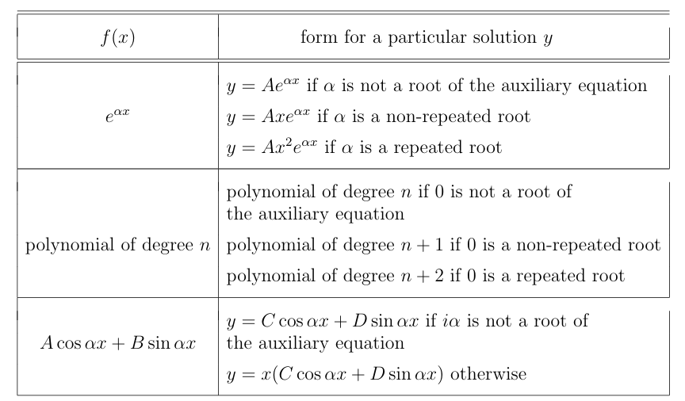

