# 1. Numeric Representation & Digital Logic

## 1.1 Numeric Representation

- ***Def***. *word size* is the number of bits that can be processed simultaneously

### Negative Numbers

#### Signed Magnitude

- **MSB** used as the indicator, $1$ if negative, $0$ otherwise
- **Advantages**:
    * Easy to implement and check if negative
    * Easy to convert positive into negative numbers
- **Disadvantages**:
    * Two reprsentations of $0$
    * Reduced range: $2^N - 1$
    * subtraction is difficult to implement

#### Two's Complement

- **MSB** represents $-1$ times the place value, i.e. $-2^{N-1}$
- **Convert positive to negative**:
    * add 0 to the left
    * invert bits
    * add 1 (ignore overflow)
- **Advantages**:
    * singular $0$ representation
    * relatively easy to convert positive into negative number
    * subtraction is a lot easier to do
- **Disadvantages**:
    * less intuitive to read
    * asymmetrical range

#### Biased Form
- Uses two's complement but all values are shifted down by subtracting a bias $B$
- $B$ is usually $2^{N-1}$ or $2^{N-1}-1$ for $N$ bit number
- Range: $-B$ to $2^{N-1}-1-B$
- **Advantages**:
    * bias can be chosen so all values are non-negative - simplifies comparison operations
    * common in floating point numbers
- **Disadvantages**:
    * bias must be subtracted to get the true value
    * not suitable for direct arithmetic operations without conversion

### Binary Multiplication

#### Unsigned

- Partial product is $2n$ bits
- Repeat $n$ times:
    * if LSB of multiplier is 1, add multiplicand to $n$ most significant bits of PP
    * shift PP right 1, shift multiplier right 1

#### Signed - Booth's Algorithm

- **important**: shift multiplier by 1 left first
- same as unsigned but:
    * if last two bits are `10`: subtract multiplicand from PP's n most significant bits
    * if last two bits are `01`: add multiplicand from PP's n most significant bits
- **how to remember**:
    * if we are transitioning from $0$ to $1$: subtract
    * if we are transitioning from $1$ to $0$: add

### Fractional Numbers

#### Fixed Point

- Specify decimal point place for all decimals
- **Advantages**
    * faster processing as fixed point is simpler to implement in hardware
    * lower power consumption, ideal for embdedded systems / real-time applications
- **Disadvantages**:
    * difficult to translate across systems
    * limited range and lower precision for same number of bits

#### Floating Point (IEEE 754-2008)

| IEEE Standard 754-208 | binary16 | binary32 (float) | binary64 (double) | binary128 (quad) |
|:--------|---|----|-----|---|
| Sign (s) | 1 bit | 1 bit | 1 bit | 1 bit |
| 5 bits ($15 \to -16$) | 8 bits ($127 \to -128$) | 11 bits ($1023 \to -1024$) | 15 bits ($16383 \to -16384$) |
| Mantissa (m) | 10 bits | 23 bits | 52 bits | 112 bits |
| Bias (B) | 15 | 127 | 1023 | 16383 |

**Formula**:

$$\text{value} = (-1)^s \times (1 + m) \times 2^{e - B} $$

For *floats*:
- $$ \text{value} = (-1)^s \times (1 + m) \times 2^{e - 127} $$

#### Floating Point Arithmetic

- shift mantissa to make both exponents match
- then add the mantissas

#### Floating Point Multiplication

- Multiply mantissas
- Add exponents
- Round down results

## 1.2 Digital Logic

### Laws of Boolean Algebra

- **most important one**: (absoprtion law variant)
    * $$A + \bar{A} \cdot B = A + B$$

### Karnaugh Maps

- remember - inputs follow **gray code** - $00, 01, 11, 10$
- find groupings of *powers of 2*
- groups can wrap around edges
- **Advantages**    
    * can encode *don't care conditions*, which often occur in boolean circuits where a particular input is deemed invalid and we **do not care** what the output is
    * this can be used to simplify the logical circuit by treating the *don't care cell (x)* as $0$ or $1$
- **Disadvantages**:
    * not all functions can be represented, e.g. **XOR**

# 2. Computational & Sequential Logic

## 2.1 Computational Logic

### Universal Gates

- **NAND** and **NOR** are universal gates.
- We can express everything as a NAND gate:

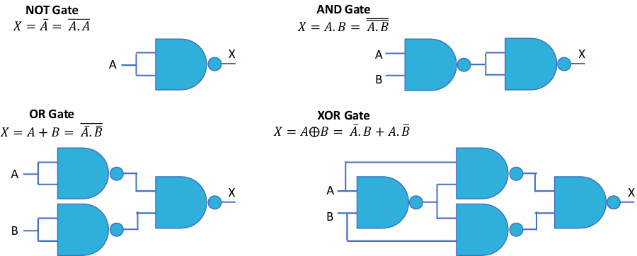

- We can express everything as a NOR gate:

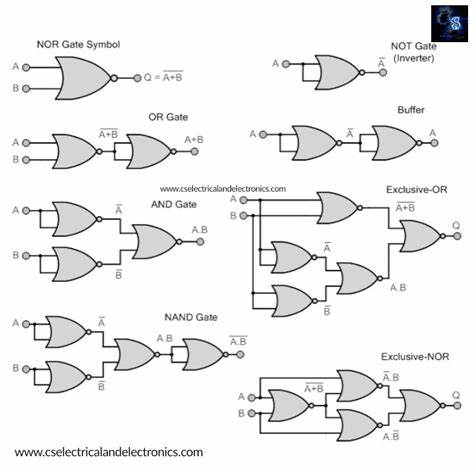

### Adders

- 1-bit half adder:
    * sum is **XOR**
    * carry out is **AND**
  
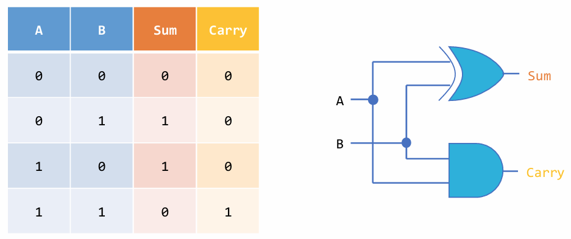

- 1-bit full adder:
    * let `inter` be `a ^ b`
    * we have that *sum* is `inter ^ carry_in`
    * we have that *carry out* is `a & b | inter & carry_in`

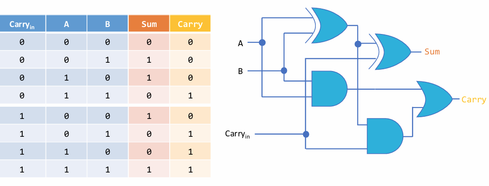

- The **N**-bit full adder is created by chaining the *carry-in* to the *carry-out* of $N$ 1-bit full adders, with $0$ as the carry in.

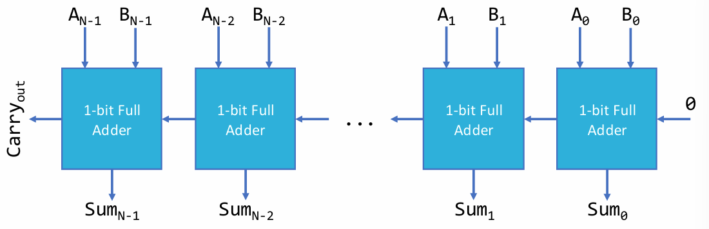

- The **N**-bit full adder-subtractor is created by doing a **BITWISE XOR** with $b$ and the subtract line $Z$, and pass $Z$ into the carry in.
- This effectively computes `a + ~b + 1`, which is the same as `a - b` in two's complement

### Decoders and Encoders

- **Decoder** takes $n$ bit string and selects *one* output line depending on the value of the bit string, denoted by $n \times m$ decoder
- **Encoder** is opposite - inputs decide which outputs are high or low, denoted by $m \times n$ encoder. **only one input can be active at a time**
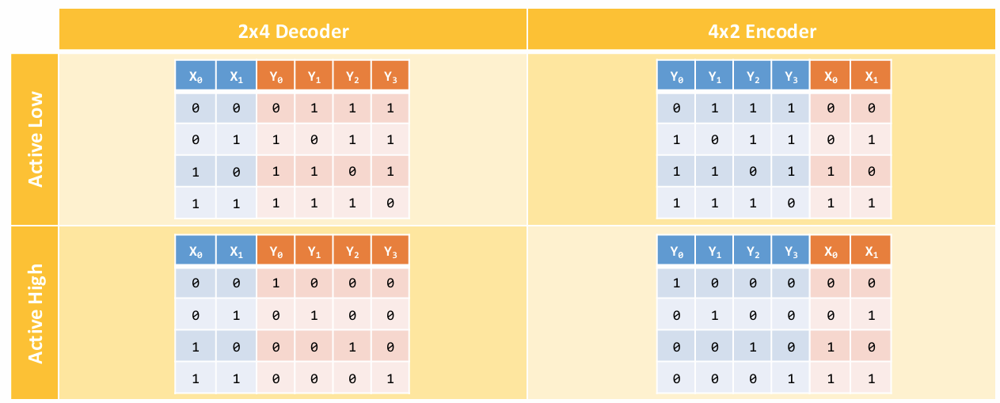

#### Active High vs Active Low

- **Def*** *active high* is when the signal performs its function when the logic level is $1$
- *active low* is same, but for logic level $0$

### Mux and Demux

- **MUX** selects an input line based on a signal, named as $n-1$ MUX (note *hyphen* is used)
- **DEMUX** selects which line an output can appear on,b ased on a signal and input line, named as $1-n$ DEMUX

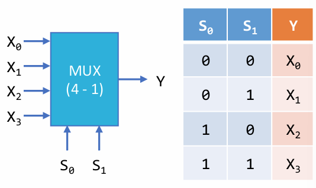
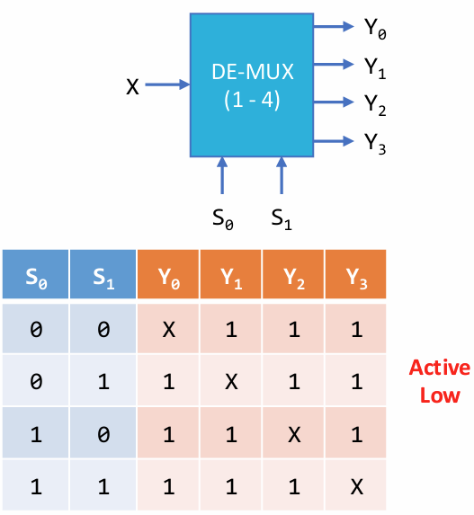

### 3-state logic

- Has 3 states: high, low, unconnected
- **active low enable**: when enable is 0, input = output.
- used to connect/disconnect components to a bus
    * **note** this for drawing control units!

### Integrated circuits

- **PAL** (programmable array logic) - can only be programmed once
- **PLA** (programmable logic array) - contains *AND* gates that feed into *OR* gates
- **FPGA** (field programmable gate array) - contains millions of gates enough to replicate an entire chip

## Sequential Logic

- **computational vs sequential logic**
    * *computational* - output depends on inputs only
    * *sequential* - output depends on inputs and current state
- ***Def***. *flip-flop*: change occurs on either rising or falling edge
- ***Def***. *latch*: change occurs in both edges

### SR Latch

- **NAND** gate design is active low, **NOR** gate is active high.
- If both inputs are high or low, there is an undefined state

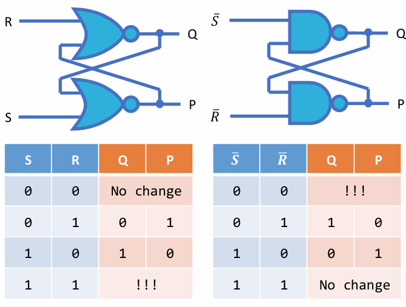

#### SR Latch with Enable

- use **AND** gates if using **NOR** design
- use **NAND** gates if using **NAND** design
- connect nand gate up to each of $R$, $S$, and *enable*

### D Latch

- Having two inputs on SR latch is difficult to manage:
    * have to manage multiple inputs, and make sure only one is ever active
- **D** latch has a NOT gate so one of the inputs is flipped, making it always valid

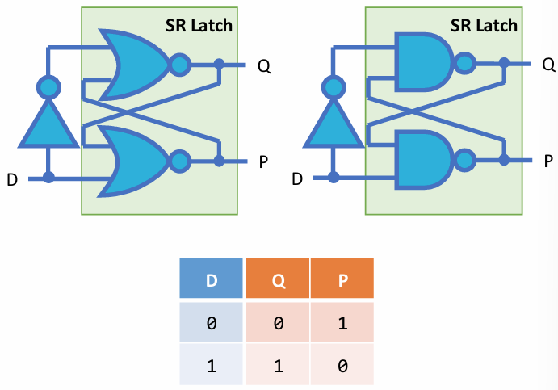

#### D Latch with Enable

- same design as **SR with enable** but we are using a D latch
- the D latch with enable effectively copies the input $D$ to the output $Q$ when the enable is active.

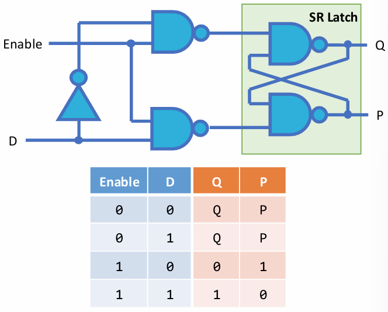

### D Flip Flop

- Two D latches connected from *output* to *input*, but the first D latch has a *negated clock*
- used as **singular unit of memory**

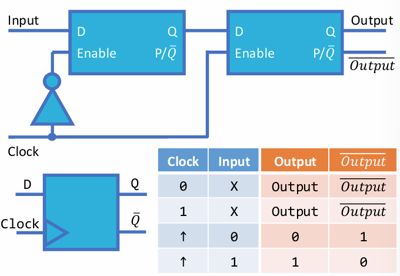

### Other flip flops

- **T flip flop**: toggles output on rising/falling edge of clock
- **JK flip flop**: combines D and T flip flops.
    * when $J = K$, we get a toggle
    * when $J \ne K$, we get a D flip flop

### N bit register

- Put $N$ D flip flops in a line, connected to a common clock
    * can use other flip flop but D is the most common

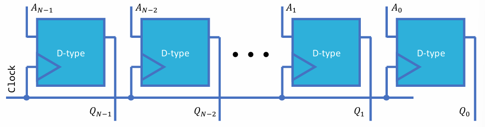

### N bit shift register

- connect $N$ D flip flops from *output* to input*
- to make it **serial**, only log the **final output**, i.e. the output of the last flip flop
- all connected to a common clock

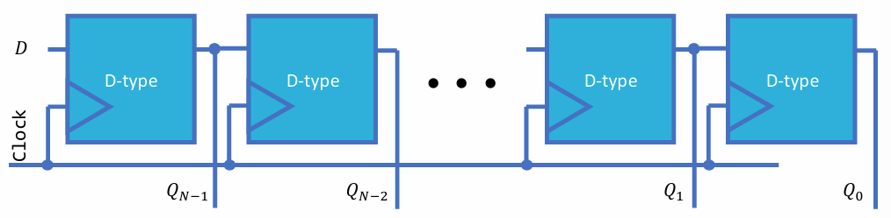

### N bit counter

- $N$ D flip flops in a row
- The negated output $P$ is connected into $D$ for every D flip flop.
- The output $Q$ is passed to output, and negated before passing into the **clock** of the next D flip flop.

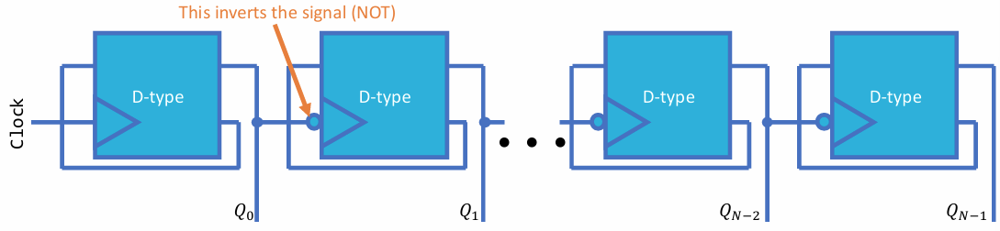

# 3. Memory Systems

## Memory Types

### Memory Hierarchy

- The *memory hierarchy* describes the hierarchy of memory types based on their *frequency of access*, *access time*, *capacity required*, and cost per byte.
- At the top, memory is **fast, expensive and small**. At the bottom, memory is **slow, cheap and large**
- This is **important** because we cannot have *fast access,  large capacity and affordable cost* all at once - we need to compromise by storing frequently used data in fast memory and other data in lower levels.
- **NOTE**: top 3 are *random access* and *volatile*. bottom 2 are *sequential access* and non-volatile.

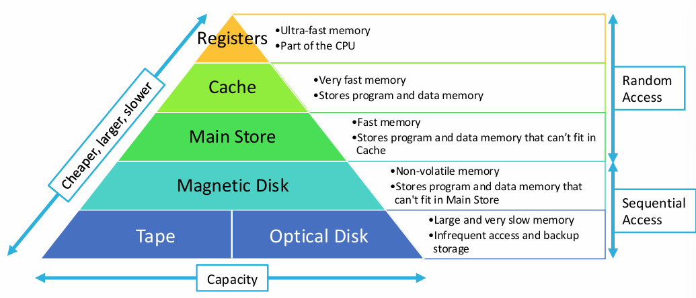

### 1. Registers

- very limited, built into circuitry of processor (less than 1kB)
- extremely fast as it is very close to components

### 2. Cache

- Multiple layers - L1, L2, L3, (L4)
- main block of fast memory
- **reading**: no changes, so do not have to update main memory
- **writing**
    * write through - update cache and all copies in lower levels of hierarchy
    * write back: update cache copy, replace blocks in lower levels when replaced
    * **misses**
        * compulsory - would occur no matter how big cache is
        * capacity - lack of space
        * conflict - placement strategy
        * coherency - updated by different processor
    * **hit rate**: `num words in cache / num memory accesses`
    * **Average memory time**:
    $$\text{averge memory time} = \text{hit time} + (\text{miss rate} \times \text{miss penalty})$$

### 3. Main Memory

- Stores the **heap** and **stack**

#### Static RAM

- Stores data using flip-flops, made using $6$ tranistors per bit
- Uses *4 cross-coupled transition*, which forms a stable logic gate
- Holds data whilst power is supplied without needing to be refreshed
- Often used in cache memory
- **Advantages**:
    * Faster access time as no refreshing is required
    * simple read/write cycles
    * more relaible
    * ideal for cache
- **Disadvantages**:
    * more expensive
    * larger size per chip
    * higher power consumption
    * not suitable for main memory

#### Dynamic RAM

- Stores data as charge in a capacitor, which discharges over time so it needs to be refreshed periodically
- Presence or absence of charge represents a 0 or 1
- **Write**: voltage applied to bit line
- **Read**: sense amplifier detects 1 or 0, which discharges capacitor. capacitor is restored and refreshed to original state
- **Advantages**:
    * a lot cheaper, hence used for main memory
    * comes in many forms
    * high density
    * lower power per bit
- **Disadvantages**:
    - slower than SRAM due to constant refreshing
    - less reliable
    - higher latency

#### Chip Organisation

- just remember there are **address selects** (row select) and **column select**
- it can be **serial**, where we only select one column, or it could be **parallel**, where we feed a bus into the columns
- let $r$ be number of address pins and $c$ be number of column data lines
- number of addressable cells $= 2^r \times c$
- we often make $2^r$ and $c$ equal so the memory cell array is a **square** to minimise space for address decoding and maximise space used for memory cells

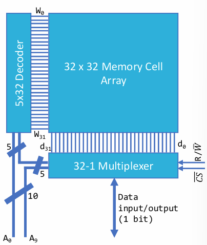

### 4. Magnetic Disk (HDD)

- Contains a collection of *spinning ferromagnetic disks* where we *magnetise* certain pieces of data
- An *arm* moves in and out of disks to record in particular areas.
- Disks are constantly spinning

#### Magnetism Strategies

- ***Def***. *self clocking* = no need separate clock to read off
- Strategy must be **compact, easy to read, and ideally self clocked**
- **return to zero**: unmagnetsised is 0, magnetised is 1
    * non-self clocking
    * diffiuclt to erase a 1 already written
- **return to bias**
    * magnetic directions specify 0 or 1
    * done with a small voltage on the head
    * non-self clocking
- **non return to zero one**
    * widely used, each time we see a 1, we reverse the direction
    * non-self clocking
    * difficult to read long sequences of 0s as clock might not be synced correctly
- **phase encoding**
    * *high to low*: 0. *low to high*: 1.
    * self clocking

#### Tracks and Sectors

- A **track** contains multiple **sectors** separated by a gap
- Each sector contains a *preamble, data block and ECC*
- preamble is used for synchronisation
- $$t_{access} = t_{seek} + t_{latency} + t_{settle} + t_{read}$$

### 5. Optical Disks (tape is not discussed)

- contains spiral grooves. tracks contain pits and lands
- difference between land and pit encodes logical 1 or 0
- data makes up small amount of bits stored as a lot of it is ECC
- **writing data**:
    - `CD` and `CD-R`: physically create a pit on the disk
    - melt away region using powerful laser, much more powerful than reading laser
    - `CD-RW`: use polarisation on special material (terbium iron cobalt)

- **DVD**s just use a laser with smaller wavelength
- optical disks are often used for backup and can handle scratches very well

## Errors in Memory

### types of errrs

- thermal noise
- electrical component noise
- transmission circuit noise
- magnetic media noise

### single errors

- ***Def***. small, isolated incidences, can occur randomly
- can be dealt by:
    * **sending data multiple times** : time and resource expensive
    * **parity bits**: extremely cheap

#### parity bits

- simple enough i think
- **software** - modelled using state transition diagram. if using odd, start at even, vice versa
- **hardware** - use XOR gates
    * need initial dummy bit, 0 in even parity, 1 in odd parity systems
    * fold XOR over bits, and result is the parity bit
    * to check, just **XOR** over all bits and $0$ means even parity, $1$ means odd parity.
- **advantages**:
    * simple to implement, fast error detection
    * low cost
- **disadvantages**:
    * fails to detect even-numbered bit errors
    * no error correction
    * not suitable for burst errors

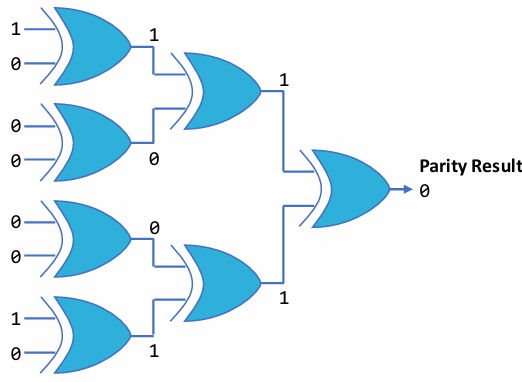

### burst errors

- ***Def***. when a collection of bits change

#### checksum

- **chunk** the data and calculate a checksum
- calculate the parity it for each column to generate a new *checksum* character
- fails if more than $14$ bits error, or even number of errors in bit column

#### block level ECC

- combine parity bits and checksum column
- capable of detecting and correcting single errors
- cannot correct multiple errors, but we can detect them
- **advantages**:
    * can detect multiple bit errors, correct single bit errors
- **disadvantages**:
    * requires a large block of data

#### word level ECC - hamming codes

- for $m$ check bits we have $2^m - 1$ total bits and $2^m - m - 1$ data bits
- In hadamard 7,4:
    * let source bits be $I_1, I_2, I_3, I_4$
    * check bits are:
        * $C_1 = I_1 \oplus I_2 \oplus I_4$
        * $C_2 = I_1 \oplus I_3 \oplus I_4$
        * $C_3 = I_2 \oplus I_3 \oplus I_4$
    * check bits are positioned where the position is a power of 2 (starting from 1)
    * source bits fill the gaps:
        * $I_4, I_3, I_2, C_3, I_1, C_2, C_1$
    * **checking**:
        * comptue new check bits
        * if check bits changed, **XOR** the original check bits and new check bits to find the **position** that changed.
- **advantages**:
    * can correct and detect single bit errors
    * low redundancy (efficient)
    * simple hardware implementation
    * fast
- **disadvantages**:
    * only works with single errors
    * overhead increases with data size
    * inefficient for large scale storage

#### word level ECC - hadamard codes

- start with the hadmard matrix $[H]_2 = \begin{bmatrix} 1 & 1 \\ 1 & -1 \end{bmatrix}$
- replace each entry with $[H]_{n}$ to get the matrix $[H]_{2n}$
- **sending**: Let $x$ be the $n$-bit number to send. lookup the $x$th row in the Hadmard matrix $[H]_{2^n}$ and send that
-  **checking**: go through all rows in matrix, and see how many bits changed. least number of changes is most probable answer.
-  **advantages**:
    * high error tolerance
    * good for noisy channels
- **disadvantages**:
    * very high redundancy (low efficiency)
    * impractical for large messages

# 4. I/O

### Memory Mapped I/O

- connect I/O devices to the address bus, and give each component a memory address to write into
- CPU can read/write to the component like any other piece of memory
- **advantages**:
    * very simple to implement - don't need extra instructions, CPU requires less internal logic
    * can ustilise general purpose memory instructions and addressing modes
    * efficient for embeddeed devices or RISC architecture
- **disadvantages**:
    * need to reserve a portion of memory for i/o components
    * for small word space processors, we have less main memory we can use
    * risk of accidental access

### Direct Memory Access

- Where a **DMAC** is used to handle all I/O data transferring
- CPU hands control to DMAC and lets DMAC control all busses on the system

#### Operation

1. I/O sends request to DMAC
2. DMAC sends request to CPU
3. CPU initialises DMAC
    * input or output mode
    * DMAC start address
    * number of words to transfer: count register
    * CPU enables DMAC
4. DMAC requests use of busses
5. CPU sends DMA acknowledge when ready to surrender busses
6. DMAC sends acknowledge to I/O device to transfer data
7. DMAC activates control signals to read from I/O device and perform write operation to transfer data from I/O directly to main memory
8. after each byte transfer, DMAC increments memory address and decremenets the byte counter
9. once done, DMAC releases busses back to CPU and send an **interrupt** to indicate data transfer is complete

#### DMA organisation

- **detached DMA**: all components share same bus. 
    * straightforward to implement
    * inefficient (2 bus cycles per word) as DMA has to read from source into internal buffer, then write to destination
- **integrated DMA**: multiple dmacs, each controls one or more io devices. 
    * more communication required between CPU and dmacs, still inefficient
- **io bus**: all io devices have a common bus
    * DMAC has to only transfer data to and from main memory
    * more complex to design, more hardware

#### operation modes

- **cycle stealing mode** - dmac uses system busses when free per cycle
- **burst mode** - dmac locks cpu out of system bus for multiple cycles until data transfer has been completed. CPU can override lock if needed

#### Advantages & Disadvantages

- **advantages**:
    * high speed data transfer - dmac is often 10 times faster than cpu
    * frees up cpu so cpu can perform other tasks that don't use the system bus
    * lower power consumption
    * improved real time performance
- **disadvantages**:
    * bus contention
    * increased hardware complexity
    * security concerns

### Polling

- **synchronous**
- **normal polling** - read status once
- **busy wait** - constantly read status until ready
- **interleaved** - do something else for a while whilst waiting, then check again until ready

- **advantages**
    * very simple to build in hardware
    * no interrupt overhead
- **disadvantages**
    * busy wait wastes CPU time and power
    * not great if you have a battery powered device or have lots of tasks running
    * interleaved polling can cause *delayed responses*
    * not great for real time situations

### Handshaking

- have two extra lines - *ready* and *valid*
- IO device says when it is ready, and processor says when it is sending valid data.
- can be the other way around if *processor* is receiving data.
- data is only accepted when receiver is ready and sender is valid

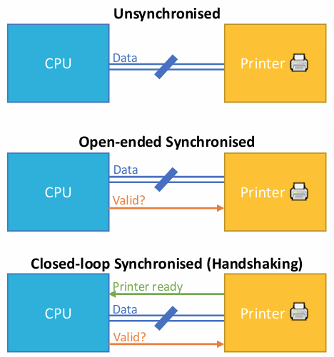

#### timing diagram

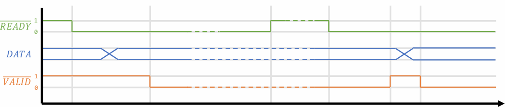

#### advantages

- reliable data transfer
- synchronisation
- flexibility
- avoids busy waiting - CPU can perform other tasks between handshaking signals

#### disadvatnages

- overhead of control signals
- slower than direct transfer
- not suitable for high speed data transfer

### Interrupts

- `IRQ` is an interrupt request
- `NMI` is a non-maskable interrupt - the interrupt cannot be ignored

#### sequence

- main code runs
- **interrupt response is given**. context switching occurs:
    * CPU completes current instruction
    * push PC, SR onto stack. Load PC with address of Interrupt Handler
    * interrupt code runs
    * Interrupt code finishes - return from interrupt - restore state
    * main code continues

#### Nesting

- Interrupts can be nested, i.e. interrupt in an interrupt
- NMI cannot be interrupted because it is non-maskable

#### advantages
- fast response times
- no wasted CPU time or power
    * do not have to constantly check
    * important for battery power

#### disadvantages

- everything still controlled by processor
- more complex hardware and software - context switching

# 5 . Processor Architecture
