## 1. Introduction

**Moore's Law**
- For a given size of chip, the number of components would double every year
- Was largely true, revised to a doubling every two years later
- Current processor size is down to 14nm to 5nm (10 silicon atoms)

**Variation of Processors**
- Embedded systems - small processors with limited power
- Field Programmable Gate Arrays (FPGAs) - reprogrammable processors, takes a long time to compile and map
- Graphics Processing Units (GPUs) - many separate processors each with very limited compute power

**Signals**
- ***Analogue signals*** - utilised variations in electrical current, very susceptible to noise
- ***Digital signals*** - Allows for more resilience, cheaper components
	- 0 (Low) -> *0V to 0.8V*
	- 1 (High) -> *2.4V to 5V*
	- Transition range takes time, usually in ns or ms.
	- 1 Byte = 8 Bits
	- **Word** - Number of bits that can be processed simultaneously

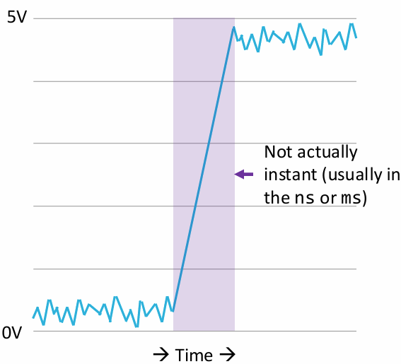

**Busses**
- Two ways of sending bits to different components
	- Reading over multiple increments of time
		- Requires synchronisation
		- Limited to 1 bit at a time
		- Expensive to build
	- Multiple cables sending a bit each **(BUS)**
		- Cheap
		- Easy to extend
		- Requires less components
- *Word size is usually limited to the size of the bus*
- *All required components connected to the bus, switch on components when required*

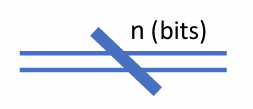

## 2. Numeric Representation (1)

**Bases of Numbers**
$$\text{value} = \sum_{i=0}^{N-1}{\text{symbol}_i\times\text{base}^i}$$
- where $N$ is the number of columns, $i$ is the index of the position, $\text{symbol}$ is the digit at position $i$
- **NOTE:** Value $\ne$ Representation
- **Common Bases:**
	- Binary (base-2)
	- Octal (base-8)
	- Decimal (base-10)
	- Hexadecimal (base-16)

**Word Size**
- ***REMINDER*** - Word = Number of bits that can be processed simultaneously
- The bigger the word size, the bigger the number we can store, more instructions we can call upon, and more data we can transfer in one go.
- Early processors had 4-8 word size, modern day processors have 32-64 word size

**Base Conversion - from decimal to base $b$**
- Divide by $b$
- Record the remainder
- Repeat
- Remainders are read in reverse order

**Arithmetic**
- **Addition** - start at least significant digit, add them together along with any carry in, repeat with next digit until you run out of digits.
- **Subtraction** - adding with a negative number
	- If addition is designed with negative numbers, then we can reuse it - cheaper and easier to build, better for memory

**Negative Numbers - Signed Magnitude**
- **MSB** is used as the indicator, $1$ if negative, $0$ otherwise
- Very easy to implement and check if negative
- We have two representations of 0 ($+0$, $-0$)
- Range is $-2^{N-1}$ to $2^{N-1} -1$
- Number of unique values represented is $2^{N}-1$
- Very easy to convert positive number into negative

**Negative Numbers - Two's Complement**
- **MSB** represents the negative value of the value
- **MSB** value is $-2^{N-1}$ where $N$ is the number of bits
- To convert a positive number to negative number:
	- Add a $0$ to the left
	- Invert Bits
	- Add $1$ (ignore overflow)
- A singular $0$ representation
- Range is $-2^{N-1}$ to $2^{N-1}-1$
- Number of unique values represented is $2^N$
- Easy to convert positive number into negative number
- *Subtraction in binary is easier done using Two's Complement* (ignore overflow in these cases)

**Negative Numbers - Biased Form**
- Sometimes referred to as Two's Complement Biased Form
- Shifts all values by subtracting a **bias**
$$(\sum_{i=0}^{N-1}{\text{symbol}_i\times2^i})-B$$
- $B$ is usually $2^{N-1}$ or $2^{N-1}-1$ for a $N$ bit number
- Range: $-B$ to $2^{N-1}-1-B$
- Number of unique values represented is $2^{N}$

## 3. Numeric Representation (2)

#### Binary Multiplication

**Multiplication In Binary**

- Multiplication in binary follows the same procedure as in decimal:
	- Multiply the top most number (*multiplicand*) and multiply by right most digit of bottom number (*multiplier*)
	- Repeat for all other digits of multiplier, but shifting the result to the left by 1 every time
	- Sum up the results
	- All the same, except that the binary multiplication table looks different to the decimal one.

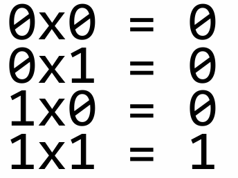

**Unsigned Binary Multiplication Algorithm**

```Pseudocode
Initialise partial product of 2n-bits to 0
Repeat n times:
	If LSB of multiplier = 1:
		Add multiplicand to n most significant bits of partial product
	partial product >>= 1
	multiplier >>= 1
```
```c
int_2n pp = 0;
for (int i = 0; i < n; i++) {
	if (pp & 1 == 1)
		pp += multiplicand << n;
	pp >>= 1;
	multiplier >>= 1;
}
```


- **Trace Table Example:**
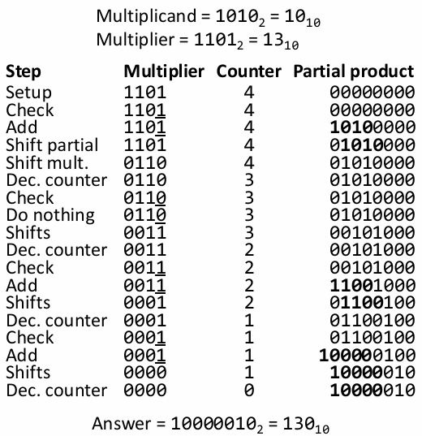

**Multiplication in Signed Binary - Signed Magnitude**

- Exclude the MSB from each number
- Multiply each number using the unsigned multiplication algorithm
- If either MSB is a 1, prepend a 1 to the result. Otherwise, prepend a 0.

**Multiplication in Signed Binary - Two's Complement**

- We can use *Booth's Algorithm*
```Pseudocode
Initialise partial product of 2n-bits to 0
multiplier <<= 1
Repeat n times:
	If last two bits of multiplier == 10:
		Subtract multiplicand from partial product's n most significant bits
	If last two bits of multiplier == 01:
		Add multiplicand from partial product's n most significant bits
	partial product >>= 1
	multiplier >>= 1
```
```c
int_2n pp = 0;
for (int i = 0; i < n; i++) {
	if (multiplier & 0b11 == 0b10)
		pp -= multiplicand << n;
	if (multiplier & 0b11 == 0b01)
		pp += multiplicand << n;
	pp >>= 1;
	multiplier >>= 1;
}
```

#### Fractional Numbers

 **Fixed Point**
- We specify the decimal place for all decimals
- No flexibility on precision, hence limiting number of values a word can represent
- Hard to translate to other systems

**Floating Point - IEEE Standard 754-2008 Float (binary32)**
- Comprises of:
	- Sign bit ($s$) - is the number positive or negative
	- Exponent ($e$) - Magnitude of the data in biased form
	- Mantissa ($m$) - The detail of the number
	- Precision ($p$) - size of mantissa + 1
$$\text{value} = (-1)^s \times 2^e \times (1 + 2^{1-p} \times m)$$
- Usually you deal with normalised numbers, when entire mantissa $(1 + (2^{1-p} \times m))$ is between 1 and 2, or is $0$
- De-normalising will loose precision
- If exponent is $\max$ and fractional part is $0$, we get $\infty$
- If exponent is $\min$ and fractional part is not $0$, we get `NaN` (not a number)

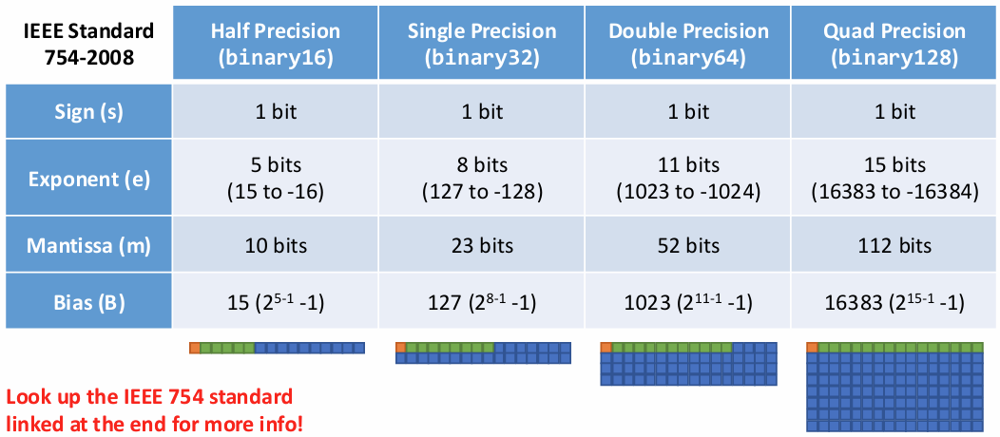

**Arithmetic with Fractional Numbers**
- **Idea:** Shift mantissa to make both exponents match, then add the mantissas together
- Algorithm:
```Pseudocode
We write A = a * 2**e1, B = b * 2**e2

if (abs(e1 - e2) > p + 1)
	return; we are done.

// shift mantissa to make exponents match
while (e1 < e2):
	a >>= 1;
	e1++;
while (e2 > e1):
	b >>= 1;
	e2++;

// we now have the exponents equal
m = a + b;
if (over range):
	m >>= 1;
	e1++;
	if (e1 > max): Exponent Overflow Error
else if (under range):
	m <<= 1;
	e1--;
	if (e1 < min): Exponent Underflow Error
else:
	return; we are done.
```

**IEEE 754 Multiplication**
- Multiply mantissas, add exponents, round down results.
- If we don't have enough room for all the bits, we can:
	- ***Truncate*** - remove final digits (always makes number smaller)
	- ***Round*** - Examine removed digits, see if its value is greater than half the LSB value, and add 1 if so

## 4. Introduction to Digital Logic

#### Logic Gates

**Negation Operator**
- $f = \bar{A}$
- $f(1) = 0, f(0) = 1$

**AND Operator**
- $f = A \cdot B$ or $f = A \land B$
- Both $A$ and $B$ are required to be true for the output to be true
- NOTE: *Modelled as a set of switches in series*

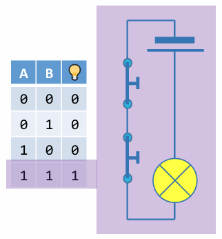

**OR Operator**
- $f = A + B$ or $f = A \lor B$
- Complements the **AND** function
- At least one of $A$, $B$ has to be true for the output to be true
- NOTE: *Modelled as a set of switches in parallel*

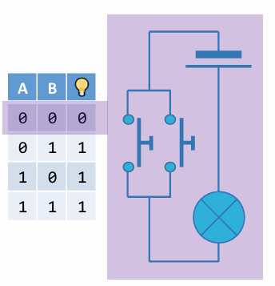

**XOR Operator**
- $f = A \oplus B$
- Can be referred as `EX-OR` or `Exclusive OR`
- Only 1 input can be true for the output to be true

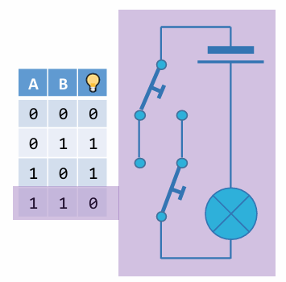
#### Logic Gate Chips

- Logic gates are more complex in real life - come on chips
	- Come in small components
	- Include multiples of same function
- Top of chip is denoted by a cutout semicircle
	- Bottom left pin is often ground / 0V
	- Top right pin is often VCC / 5V

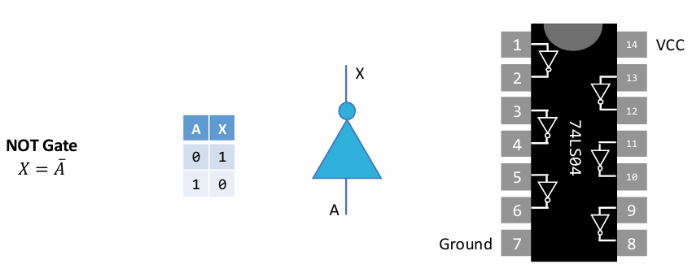

#### Translating Boolean Logic

**Boolean Equation**
- Obtained by getting *each row* of the truth table where output is $1$, and **AND'ING** all inputs, where you put a $\neg$ where an input is $0$, and then lastly **OR'ING** all results

**Laws of Boolean Algebra**
- Additional complexity -> more costs -> more things to go wrong
- Hence we need to reduce the complexity of the equations

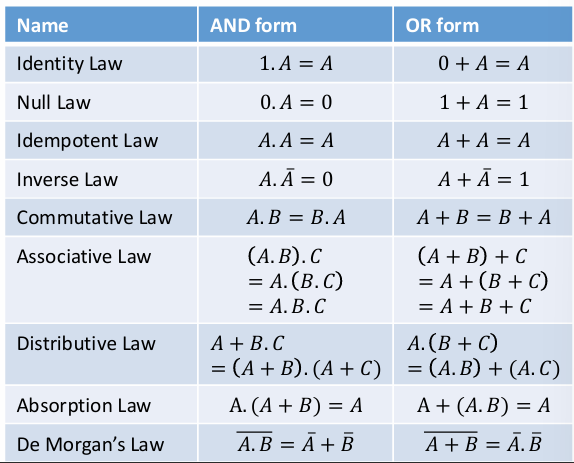

**Karnaugh Maps**
- K-Maps show all the possible combinations of outputs for each combination of input (2D truth table)
- Inputs in each dimension follow **Gray Code**, i.e. only one variable changes between each column
- *2-bit gray code* = $00$, $01$, $11$, $10$
- Find groupings of sizes of power of 2 in the K-Map, and **OR** together the results
- Groups can wrap around the edges of the map
- Not all functions can be represented by a K-Map, e.g. XOR.

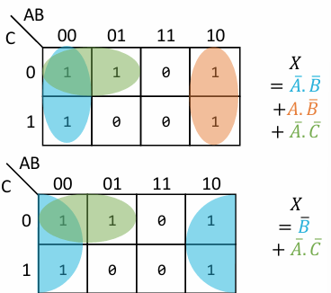

- There are **don't-care** conditions represented by an $X$ that can be included in groups if needed

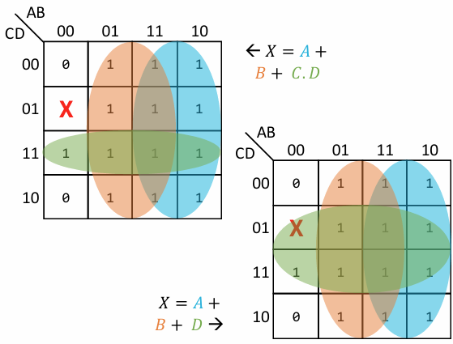

## 5. Computational Logic (1)

**Universal Gates**
- **We want to use one type of gate, as:**
	- We can make production of chips more economical
	- We can bulk buy one gate, saving on costs
- Gates that can construct all other gates are **universal gates**
- One such example is a **NAND** gate
- Question: should everything be a NAND gate?
	- Some gates are easier to produce in silicon than others e.g. NAND
	- Is the additional resources better than:
		- Design complexity of building gate in silicon
		- More complexity $\implies$ more cost

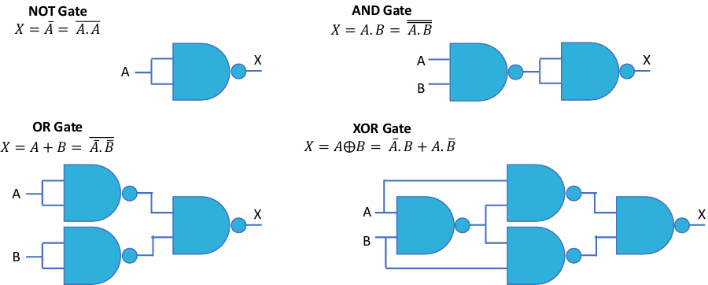

**1-Bit Half Adder**
- Notice that the sum is just an **XOR** gate, and the carry is just an **AND** gate
```c
int sum = a ^ b;
int carry = a & b;
```

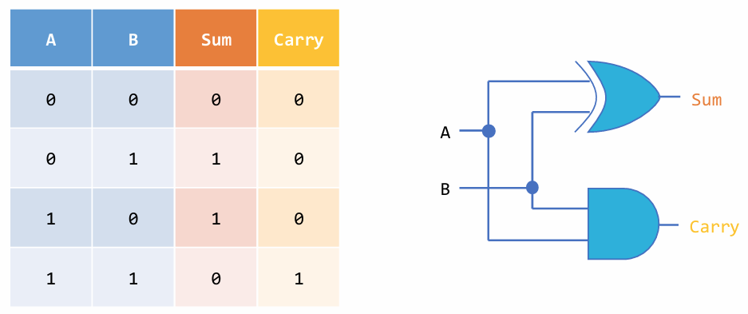

**1-Bit Full Adder**
```c
int inter = a ^ b;
int sum = inter ^ carry_in;
int carry_out = (a & b) | (carry_in & inter);
```

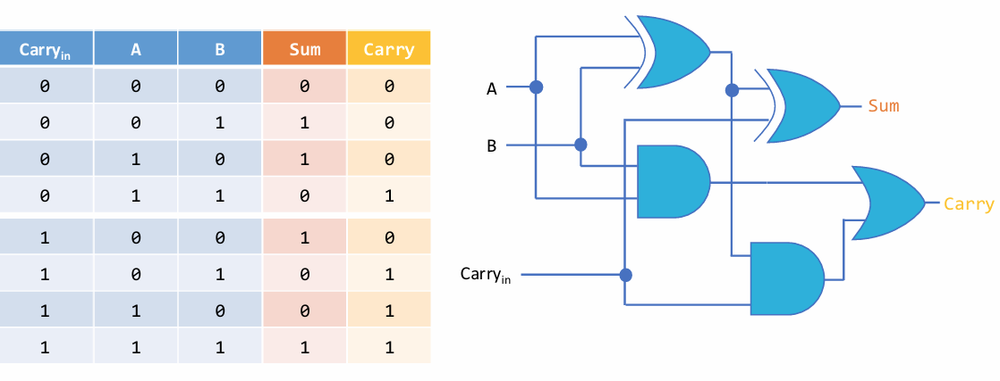

**N-Bit Full Adder/Subtractor**

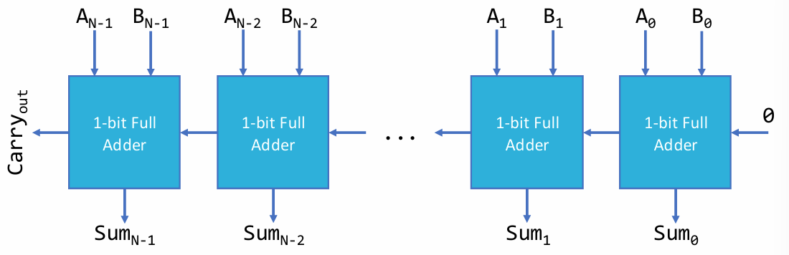

- To extend this full adder into a full adder/subtractor:
	- The second value needs to be negative using Two's Complement.
	- We can convert second value into negative by:
		- *Inverting the binary number*
		- *Adding 1*
		- *Ignoring the overflow*

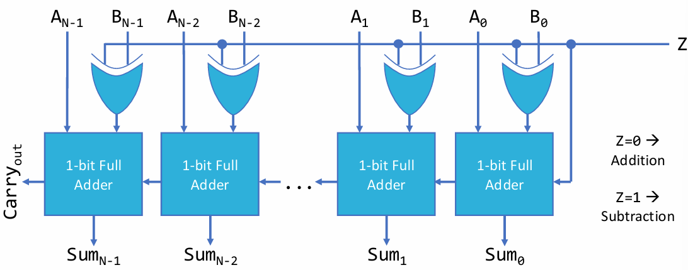

- Note the use of **XOR** gates to invert the input, as `x XOR 1 = ¬x`
- Note the use of $Z$ line fed into carry to add 1 automatically on subtraction mode, so we do not have to add 1 manually
## 6. Computational Logic (2)

#### Decoders and Encoders

**Decoders**
- A decoder takes a $n$ bit string ($X_n$) and selects one output line ($Y_m$) depending on the value of the bit string.
- Written in the form $n\times m$ decoder
- Can be used to request unique memory location based on an address bus

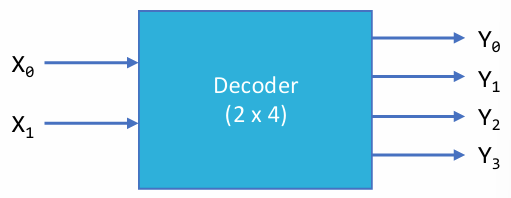

**Encoders**
- Performs the exact opposite to a Decoder
- The inputs ($Y_m$) decide which outputs ($X_n$) are high or low
- Written in the form $m \times n$ encoder
- **Only one input can be active at a time!**

**NOTE:** *There are two types of decoders and encoders: Active low and active high.*

**Active Low** - Selected output is a 0, other values are 1
**Active High** - Selected output is a 1, other values are 0

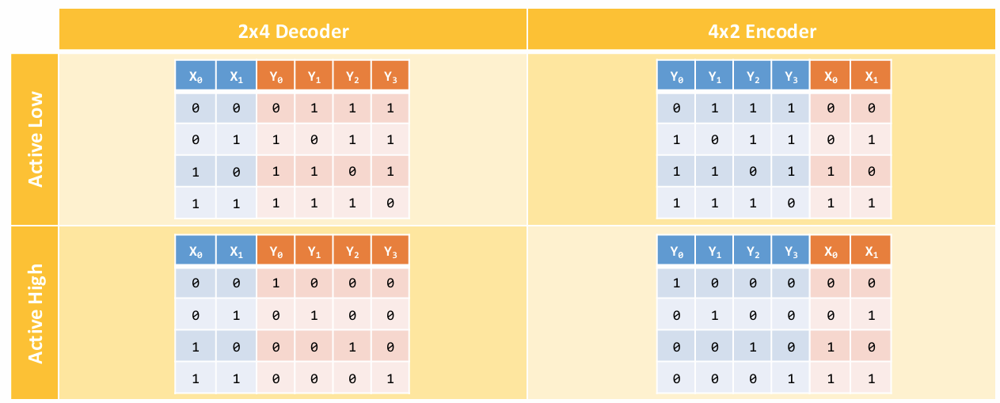

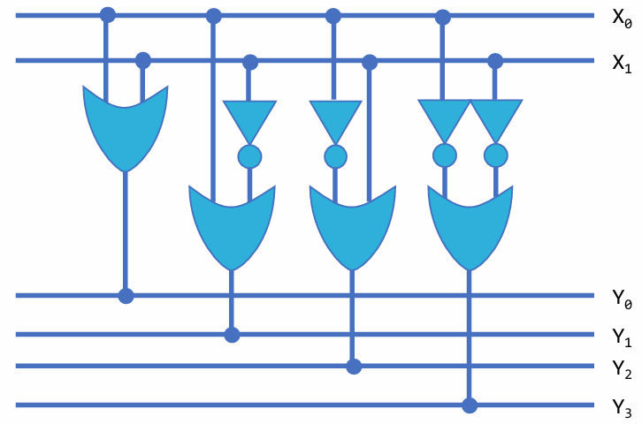

#### Multiplexers and De-Multiplexers

**Multiplexer (MUX)**
- Select an input line based on a signal
- Named using a hyphen (-) instead of an $\times$. E.g. 4-1 MUX
- Applications:
	- Source selection control -> HDMI splitter
	- Parallel to Serial converters

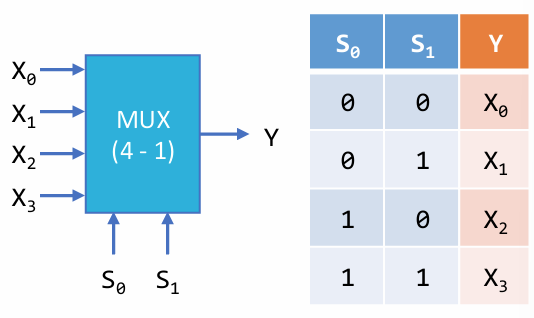

**De-Multiplexer (DE-MUX)**
- Select which line an output can appear on, based on a signal and input line
- Again uses a hyphen to name, e.g. 1-4 DE-MUX
- Applications:
	- Control for multiple lights
	- Serial to Parallel converter
- Can be active high or active low (image shown below is active low - use 1's for remaining values)

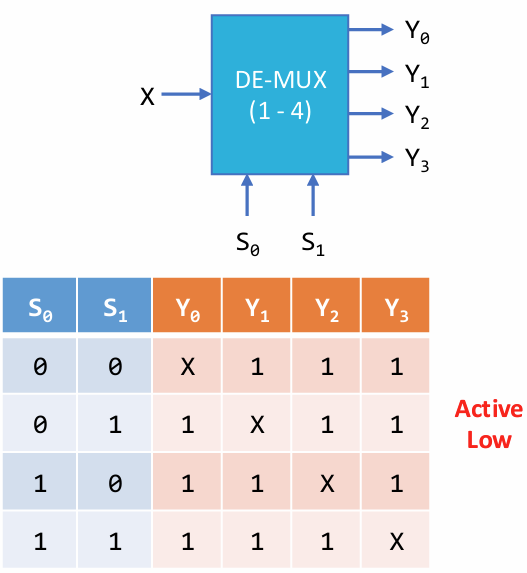

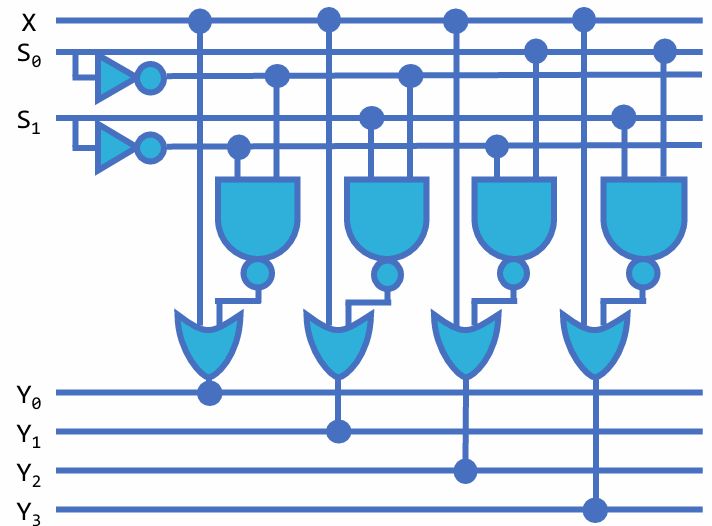
#### 3-State Logic

**Three-State Logic**
- Sometimes referred as a 3-state buffer, has 3 states: High, Low, Unconnected.
- When $\overline{\text{Enable}}$ = 1, Input $\ne$ Output.
- When $\overline{\text{Enable}}$ = 0, Input = Output. (active low)

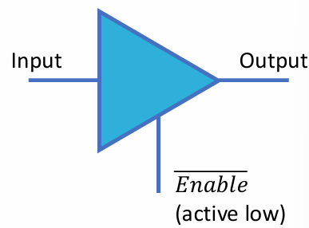

**Busses**
- 3-State logic can be used to connect and disconnect different components to a bus
- This can be extended to a multi-bit bus that moves $N$ bits

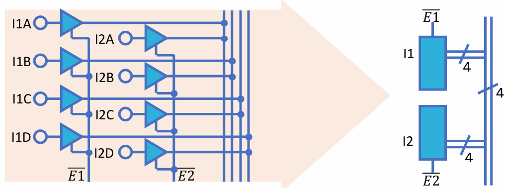

**NOTE:** *We can also use 3-state logic to redesign the multiplexer, by connecting the output of the normal MUX circuit to three-state-logic to enable signals to go onto the output line*

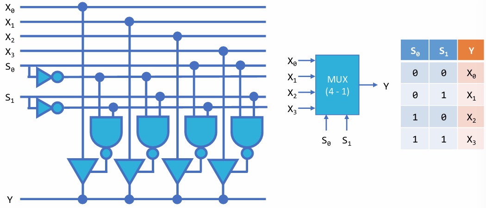
#### Integrated Circuits

**Propagation and Delay**
- Two or more outputs should not be connected together, as current can go into the output of the other logic gate and short circuit the chip.
- In real life, it takes 2ns to 20ns for 74 series chips for a logic gate to work.

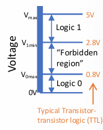

**Logic Integrated Circuits**
- Programmable Array Logic (PAL) - first popular programable device, can only be programmed once
- Programmable Logic Array (PLA) - contains a collection of AND gates, which feeds into OR gates
- Field Programmable Gate Array (FPGA) - contains a large collection (millions) of gates, enough to replicate an entire chip

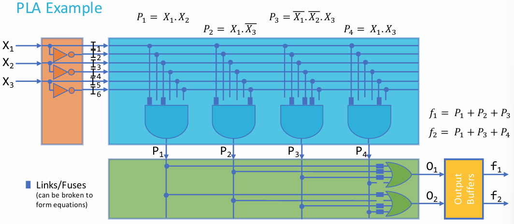

## 7. Sequential Logic

#### Introduction

**Computational vs Sequential Logic**
- Computational logic - output depends on inputs **only**
- Sequential logic - output depends on inputs **and** current state

**Terminology**
- **Bistable** - Remembers the state of the circuit indefinitely, smallest circuit that can be used for memory
- **Flip-Flops** - Change occurs on rising or falling edge of a clock signal
- **Latches** - Change occurs on rising and falling edge of enable, and when enable is on
- **Metastable** - State where voltage is unknown
#### Latches and Flip Flops

**SR (Set-Reset) Latch**
- Alters the state when either the Set or Reset is activated
- If both are activated, we get undefined behaviour
- $P$ is always the inverse of $Q$
- *Are commonly made using two NOR gates or two NAND gates*

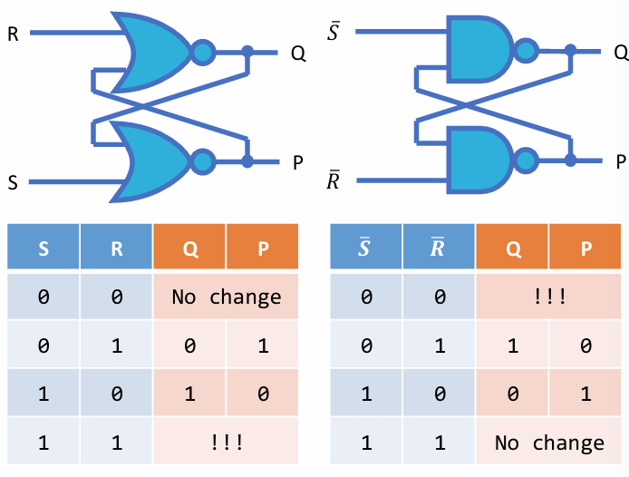

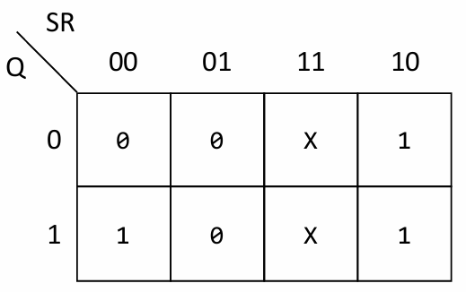

**SR Latch with Enable**
- We can use an enable line to extend the SR latch, so inputs can only pass through if the enable is activated
- Enable is sometimes called **Clock** or **Control**

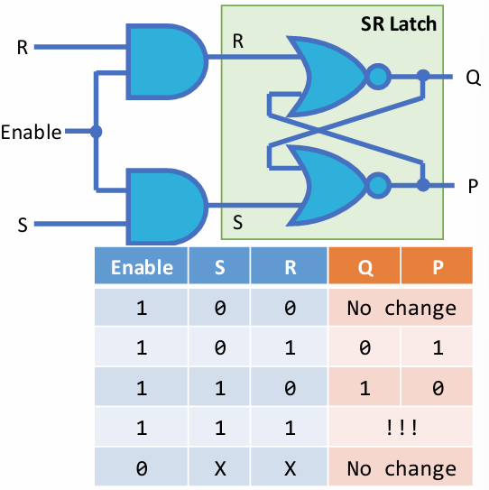

**D (Delay) Latch**
- Having two inputs on an SR can be difficult to manage:
	- Have to manage multiple inputs at once
	- Have to make sure only one is ever active
- D Latch - only has one input

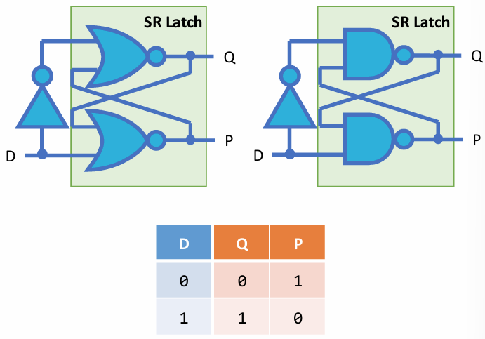

**D Latch with Enable**
- Most common version of D Latch
- Allows us to enable and disable the latch
- When the enable is active, the input $D$ is copied to the output $Q$.

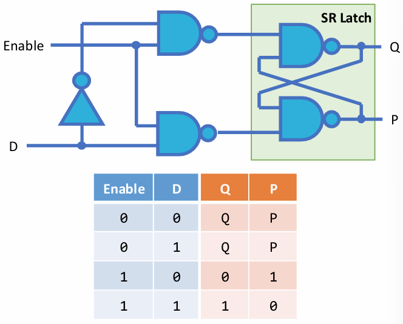

**D Flip Flop**
- Version of flip flop that is dependant on only the rising or falling edge of clock
- Means it only changes at a very specific point in time
- Enable called a **clock** for flip flops

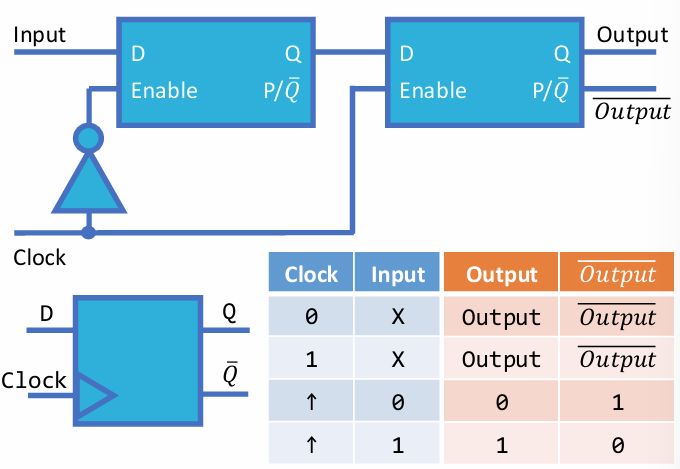

**More Types of Flip Flops**
- T-Flip-Flop - toggles the output on rising/falling edge of clock
- JK-type - Combines the D-type and T-type flip flops

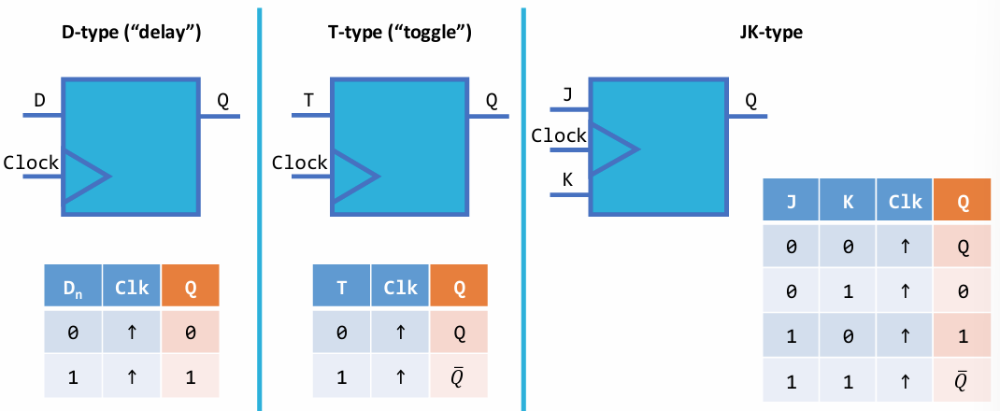
#### Registers and Counters

**N-Bit Register**
- Store $N$ bits ($A_{N-1}, \cdots, A_0$) on a low-to-high transition of the clock
- Stored numbers appear on the outputs $Q_{N-1}, \cdots, Q_0$
- This is done by connecting each bit to a D-flip-flop, and the clock to every clock input. Hence when the clock is active, every bit is transferred to the output.

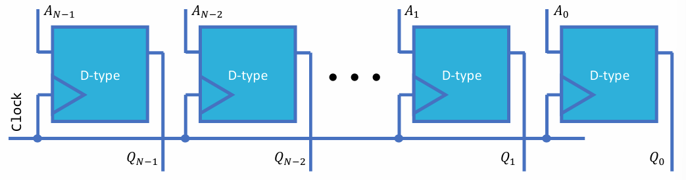

**N-Bit Shift Register**
- A serial version of the N-bit register, where we store $N$ bits by sending $N$ clock pulses and changing $D$.
- Stored numbers appear on the outputs $Q_{N-1}, \cdots, Q_0$

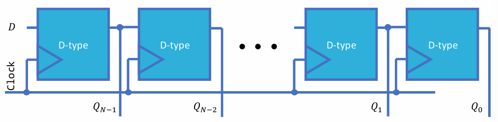

**N-Bit Counter**
- Interconnect D-type flip-flops to count
- Each clock pulse makes the circuit count up
- Connect the output $\neg Q$ to the input $D$, and negate the output $Q$ before feeding into the next **Clock** input of D-Flip-Flop

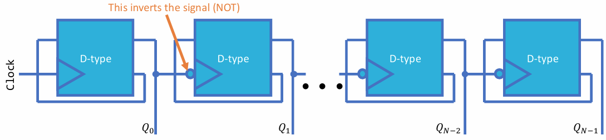

## 8. Introduction to Memory Systems

#### Memory Hierarchy

**Choosing Memory Types**
- We need to consider:
	- **Frequency of Access** - does data need to be read/written often?
	- **Access Time** - how long does it take to read/write data?
	- **Capacity Required** - how much data do we need?
	- **Cost (per bit/byte)** - how much will a certain amount cost us?

**Memory Hierarchy**

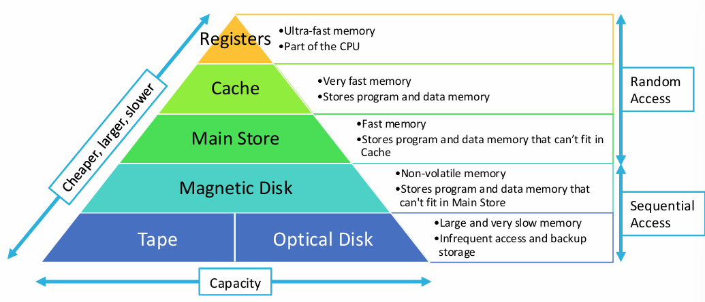
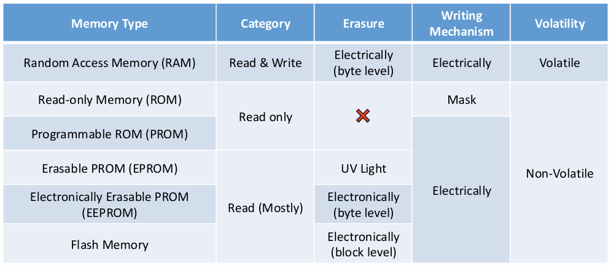

#### Registers

- Very limited number in a processor (often less than 1 kB)
- Built into circuitry of processor
- Extremely fast, as it is very close to components
- Transparent to programmer, as it adds too much complexity

#### Cache

- Main block of fast memory
- Multiple layers:
	- Most modern processors have L1, L2, L3 cache, some have L4 cache.
	- Stores KB's (L1), or MB's (L2 and L3) of data
- Transparent to the programmer

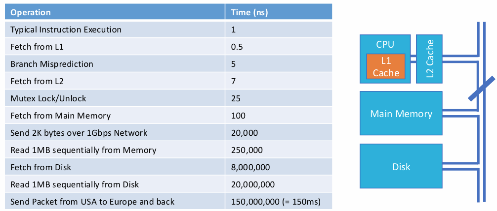

- **Reading:**
	- No changes, so don't have to update main memory

- **Writing** - we need to make sure that data is consistent
	- ***Write Through*** - Update cache and all copies in lower levels of memory hierarchy
	- ***Write Back*** - Update cache copy, replace blocks in lower levels when replaced
	
- **Misses** - fit into 4 main categories
	- ***Compulsory*** - misses that would occur no matter how big the cache is.
	- ***Capacity*** - misses that occur because of lack of space
	- ***Conflict*** - Misses that occur because of placement strategy
	- ***Coherency*** - Misses that occur because data was updated by a different processor, so cache had to be flushed
$$\text{hit rate} (h) = \frac{\text{No. times words are in cache}}{\text{Total no. of memory references}}$$
	 - $\text{miss rate} = 1 - h$
	 
- **Measuring Performance**
	- Hit rate does not factor in cost of missing data, can't just use it to analyse performance
	- Average memory access time takes this into account:
	$$\text{Avg. memory access time} = \text{Hit Time} + (\text{Miss Rate} \times \text{Miss Penalty})$$
	- $\text{Hit Time}$ = time to hit memory if in cache
	- $\text{Miss Penalty}$ = Time to replace block of memory

- **L1 Cache Sizes**
	- As size of cache size increases, hit rate increases
	- Will never get to a hit rate of $1$
	- Larger L1 cache results in often better performance, but is more expensive to produce
	
#### Main Memory

- Cache is limited by the size of the processor die, so we need a block of memory that can store large amounts of data
- Heap and stack are stored in main memory

**Static RAM:**
- Holds data whilst power is supplied
- Usually uses 4 cross-coupled transition, which forms a stable logic gate.
- Storing Logical 1 - **C1** is high, **C2** is low (T1, T4 off, T2, T3 on)
- Storing Logical 0 - direct opposite of storing logical 1
- Address line controls T5, T6 where both transistors being on permits read and write
	
	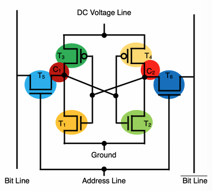

**Dynamic RAM:**
- Stores data as charge in a capacitor, which discharges over time so it needs to be refreshed periodically
- Presence or absence of charge represents a 0 or 1
- **Write** - voltage applied to bit line
- **Read** - Sense amplifier detects 1 or 0, which discharges capacitor. Capacitor is restored and refreshed to original state

	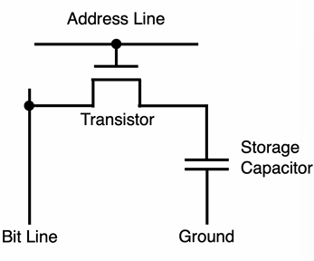

**Advantages of SRAM:**
- Better read/write times

**Advantages of DRAM:**
- A lot cheaper, hence used for main memory
- Comes in many forms
	- Synchronous DRAM (SDRAM)
	- Rambus DRAM (RDRAM)
	- DDR SDRAM
	- Cache DRAM (CDRAM)

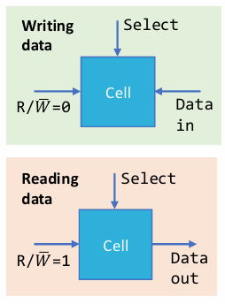

**Chip Organisation**
- *Early implementations of RAM stored data through magnetic fields in tiny metal rings, requires a structured approach*
- ***Select bits by selecting column and row***
- For 128 (16x8) cell Memory IC requires:
	- 4 address inputs ($\log_2{\text{words}}$)
	- 8 data lines (word size)
- If we extend this to 1KB (1024 cells):
	- Could either organise as 128x8 (7 address pins + 8 data pins = 15 I/O pins), or 1024x1 array(10 address pins + 1 data pin = 11 I/O pins)
	- *Contrast use of space vs number of pins*

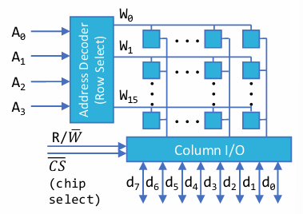

- **It is often more effective to split address into two equal parts:**
	- 1 part for row address, and 1 part for column address
	- Minimises space required for address decoding, and maximises space used for memory cells

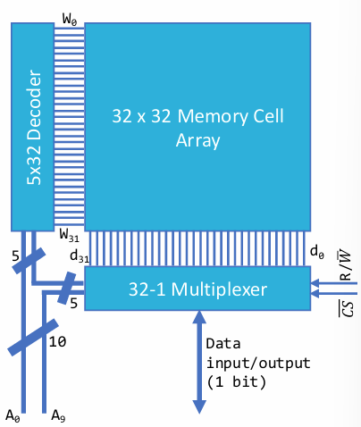

- We can extend this to use multiple **Memory Integrated Circuits**
	- Each Memory IC is 4Mb (22 address pins, 1 data pin), as 4Mb = $2^2*2^{20} = 2^{22}$ bits, so split into 22 address pins
	- We can use $2$ bits to select a particular row of 8 chips
	- Hence we have 128Mb (4Mb x 4 x 8) from 24 address pins

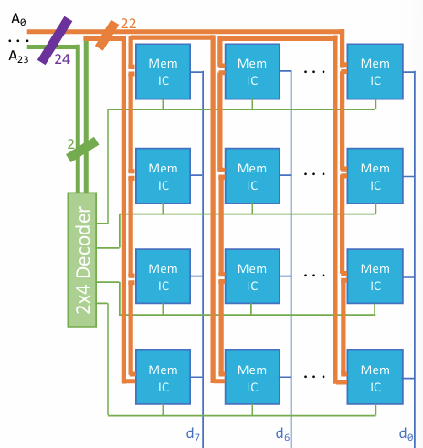

## 9. Long Term Memory

#### Hard Drives (HDDs)

**Overview**
- Contain a collection of *spinning ferromagnetic disks*
- To record data, we *magnetise* certain pieces of data
- We can move the *arm* into and away from disks to record in particular areas
- Disks are constantly spinning

**Magnetism Strategies**

- Way in which disks are magnetised determines how bits are decoded
- **Self-clocked** - Do not need a separate clock to read off the bits
- **Non-self-clocked** - There is a period of time where an external clock is required
- **NOTE:** Strategy must be **compact**, **easy to read**, and ideally **self-clocked**.

- **Return to Zero (RZ)**
	- Unmagnetized is a 0, magnetized is a 1
	- Difficult to erase a 1 already written
	- Non-self-clocking

- **Return to Bias (RB)**
	- Saturate magnetic coating in one direction is a 0, saturate in opposite is a 1
	- Can be done using a small voltage on the head
	- Non-self-clocking

- **Non-Return to Zero One (NRZ1)**
	- Widely used across hard drives
	- Each time we see a 1, we reverse the magnetic field
	- Non-self clocking (what if you had a long collection of 0s)
	- Difficult to read long sequences of 0's, as clock might not be synced correctly

- **Phase Encoding (PE)**
	- Relies on a transition happening in the middle of the data window
	- If a negative transition (high -> low) then it is a 0
	- If a positive transition (low -> high) then it is a 1
	- Self clocking (as there is a transition per bit)

**Tracks and Sectors**
- Each disk contains multiple tracks
- Each tracks contains multiple sectors separated by a gap
- Each sector contains a preamble, block of data, then an ECC (Error Correction Code)
- Preamble allows for synchronisation

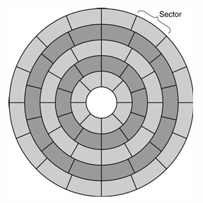
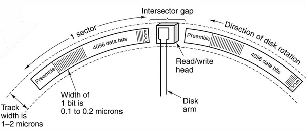

**Performance**
$$t_{\text{access}} = t_{\text{seek}} + t_{\text{latency}} + t_{\text{settle}} + t_{\text{read}}$$
- where:
	- $t_{\text{seek}}$ = time to move head of arm into position
		- Maximum: 5ms
		- Consecutive tracks: below 1ms
	- $t_{\text{latency}}$ = time to rotate disk into place
		- Disks spin with constant angular velocity
		- Depends on rotational speed, usually 5400, 7200, 10800 RPM
		- Half a rotation: 3 to 6ms
	- $t_{\text{settle}}$ = time for head of arm to stop vibrating
	- $t_{\text{read}}$ = time taken for data to actually read/write data
		- Approx.. 0.013ms
- More sectors for outer tracks $\implies$ higher data density
- Formatting (includes preamble, ECC) reduces capacity by 15%

#### Optical Disks

**Overview**
- Contains spiral grooves, 6000 tracks per cm
- Track contains pits and lands, 15000 pits and lands per cm
- Reads difference between land and pit by comparing 2 laser signals
- Laser wavelength = 500nmm

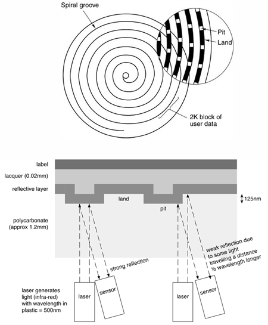

**Data Encoding**
- Change from pit to land or vice versa is a logical $1$
- $8$ bits mapped to $14$ bit symbol (first level CD-ROM ECC)
- Rules of symbols:
	- Always two 0's between 1's
	- Max of ten 0's in succession
	- Only 267 values fit the rule, enough for 256 values for a byte
	- Can handle single bit errors
- $42$ symbols to a frame (24 bytes) -> can deal with short burst erors
- $98$ frames to a sector (2048 bytes) -> deals with any residual errors

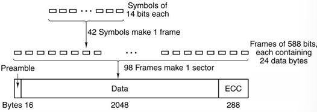

**Performance**
- Can handle up to 2mm scratches worth of burst erorrs
- Data makes up $28\%$ of bits stored
- Seek time - around 80ms
- 1x drive - 120 cm/s or 150KB/sec (200 to 530 RPM)
- 12x and lower -> speed multiplier of a 1x drive
- Higher than 12x -> data transfer rate at outer edge of the disk

**Writing Data**
- Audio CD's and CD-R: Physically create a pit on the disk
	- Coat disk in non-reflective surface about where pit needs to form
	- Melt away a region using a powerful laser (~30mW, about 6 times more powerful than reading laser)
- CD-RW - use polarisation to form absence of readable light, needs an active layer like *Terbium Iron Cobalt (TeFeCo)*

**Better Optical Disks**
- DVD's use same principles as CD's, just with a laser using a smaller wavelength, can fit more data onto the same surface area

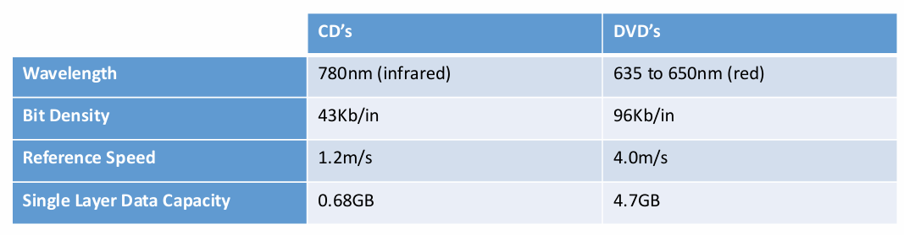

## 10. Errors in Memory

#### Introduction

**Errors & Noise**
- Noise is unwanted information, can come from:
	- Thermal noise
	- Noise from electrical components
	- Noise from transmission circuits
	- Random alignment of magnetic fields - magnetic media noise
- Bits can change given enough noise

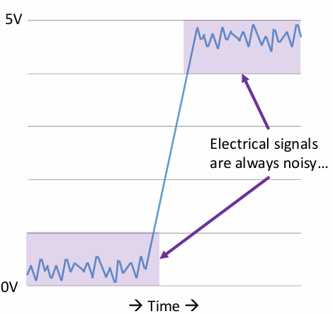

#### Single Errors

**Overview**
- ***Def***: Small, isolated incidences, and can occur randomly
- Can be dealt by:
	- *Sending the data multiple times*
		- Compare each of the copies of data and see the difference
		- Time and resource expensive
	- *Parity bats that act as a summary*
		- We can compare the data with parity bits to see if something has changed
		- Extremely cheap as it can be done in a single transmission

**Parity**

- ***Def***: Add a single additional bit indicating odd/even number of 1s
- **Even Parity**: make number of logic 1's even, vice versa for **Odd Parity**

- **Software**
	- Can be modelled using a *state transition (finite state)* diagram
	- If we are using odd parity, start at Even, otherwise start at Odd
	- When we see a 1, move to the other state
	- Final state represents what parity bit we should include

	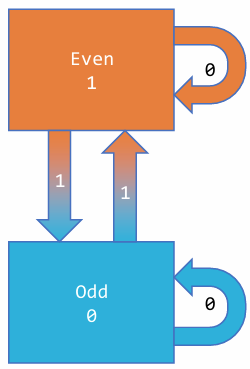

- **Hardware**
	- Need an initial dummy bit, 0 in even parity systems, 1 in odd parity systems
	- Do an XOR over all the bits, and the results will be the parity result (because XOR is addition modulo 2)

	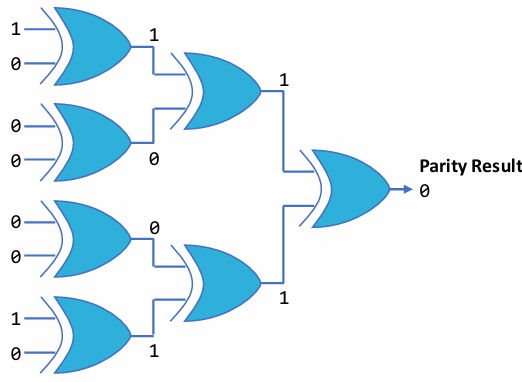
	
#### Burst Errors

**Overview**
- A **burst error** is where a collection of bits will all change, rather than singular random bits changing
- 1ms dropout on a 56k baud modem link can error up to ~58 bits -> worse on faster speeds/bandwidths
- ***Parity bits may not be suitable***, as if there are an even number of errors, the parity bit would be unchanged (no error detected)

**Checksum**
- Data can be checked by **chunking** the data and calculating a checksum
- E.g. we can calculate a parity bit for each column to generate a new *checksum* character
- Will fail if:
	- More than 14 bits error
	- Even number of errors in a bit-column

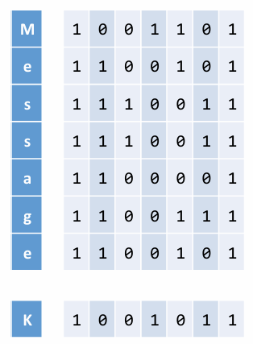

**Block Level ECC**
- Combining parity bits with a checksum column yields **Block Level ECC**
- Capable of detecting and correcting single errors
- Cannot correct certain combinations of errors, but we can detect them

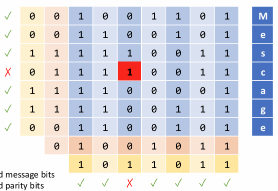
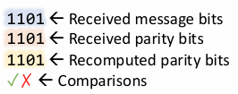

**In-Word Correction Codes**
- *Block level ECC works well when handling packets of data*
	- Can spot errors and potentially correct them
	- Requires a large block of data (2D)
- **Hamming / Hadamard codes** add these properties to singular words
	- More fine-grained approach to error correction
	- Do not need to retrieve a lot of data, some of which might not be needed

#### Hamming Codes

**Overview**
- Hamming codes have $m$ source bits for within every $n$ bits ($H_{n,m}$ or Hamming($n$, $m$))
- Basic idea is illustrated with $H_{7,4}$ but can be generalised further.
- More check bits $\implies$ more errors can be detected
- Check bits follow a generalised pattern:
	- Location follows "powers of 2" rule
- For $m$ check bits, we can have:
	- $2^m - 1$ total bits
	- $2^m - m - 1$ data bits
	- Encoding has an efficiency of:
	$$\frac{2^m-m-1}{2^m-1}$$

**Computing**
- Let source bits be $I_1, I_2, I_3, I_4$
- Compute the check bits:
	- $C_1 = I_1 \oplus I_2 \oplus I_4$
	- $C_2 = I_1 \oplus I_3 \oplus I_4$
	- $C_3 = I_2 \oplus I_3 \oplus I_4$
- Package this together with the source bits in the following order:
	- Check bits are positioned where the position is a power of 2 (starting from 1)
	- Source bits fill the gaps
	
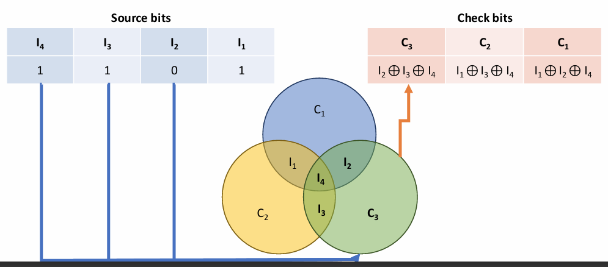
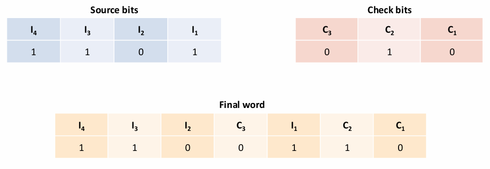

**Checking**
- Compute new check bits
- If the check bits differ from the original, use check bits to find position of bit that has changed
	- ***Bitwise XOR** between Original check bits and computed check bits* produces the position that has changed (or 0 if nothing has changed)
- Only works with single errors
- Can only detect and correct 1 error

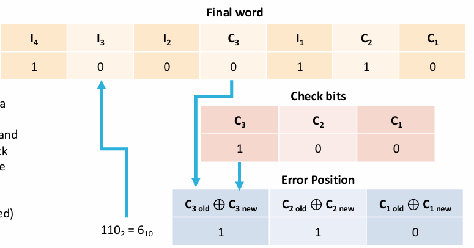

#### Hadamard Codes

**Overview & Process**
- Compute a Hadamard matrix $[H]_{2^n}$ where $n$ is the number of bits of the message to send.
- Let $x$ be the $n$-bit number to send. Lookup the $x$th row in the Hadamard Matrix $[H]_{2^n}$, and send that.
- *To check for errors, go through all rows in the Hadamard Matrix and see how many bits have changed. The least number of changes is the **most probable answer***
- More bits represented = more redundancy = more errors can occur in the same word and it can be recovered

**Computing the Matrix**
- Start with the $[H]_2$ matrix $$\begin{bmatrix}1&1\\ 1&-1\end{bmatrix}$$
- We can create a matrix $H_{2n}$ by multiplying each element of $H_n$ by another $H_n$ matrix
	$$[H]_{2n} = \begin{bmatrix}[H]_n&[H_n]\\ [H]_n&-[H]_n\end{bmatrix}$$
- Hence we can create the $[H]_4$ matrix and so on and so forth:
$$[H]_4 = \begin{bmatrix}1&1&1&1\\1&-1&1&-1\\1&1&-1&-1\\1&-1&-1&1\end{bmatrix}$$

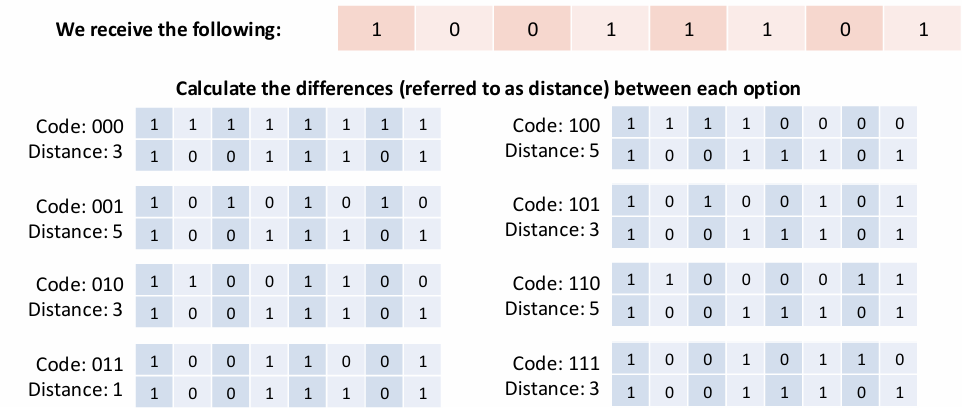

**Efficiency**
- The efficiency of this is rather low (16 bits required to store 4 bits), the general efficiency is:
$$\frac{k}{2^k}$$

- Usually used in systems that are prone to errors
	- Transmission of data to spacecraft
	- Radio communications
	- Error prone long term memory storage

## 11. Introduction to Assembly

#### Fundamentals of a Processor

- CPU is built up of a number of components
	- **Microprocessor** is the computing part
- Within the microprocessor there are different components:
	- **ALU (Arithmetic and Logic Unit)** - Performs mathematical and logical operations
	- **Control Unit (CU)** - Decodes program instructions and handles logistics for the execution of decoded instructions
- To run an instruction, we need to:
	- Get current instruction from memory **(FETCH)**
	- Decode retrieved instruction and establish any parameters **(DECODE)**
	- CU sends signals to allow for CPU to function, as well as potentially changing data registers, ALU, memory, etc. **(EXECUTE)**
- Repeat these steps - This is the **fetch-decode-execute** cycle
- **Assembly** is dependant on the architecture (e.g. 68008, x86, x86_64, Arm)

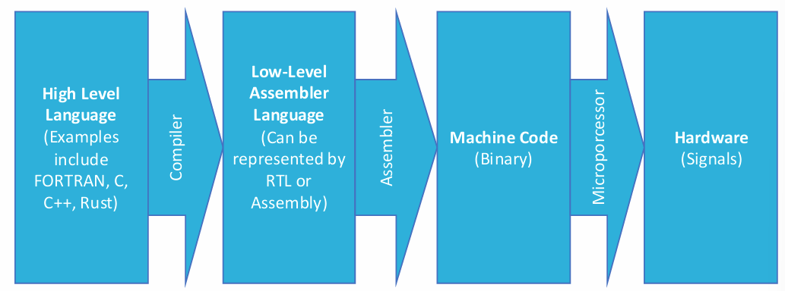
#### Register Transfer Language

**Overview**
- Used to describe operations within a microprocessor
- Main memory is represented as `MS(<location>)`
- Transferring contents between registers as `[<to location>] <- [<from location>]`, e.g. `[MAR] <- [PC]`
- **NOT ASSEMBLY LANGUAGE** (pseudo-code)

**Instruction Fetching**
1. `[MAR] <- [PC]`
2. `[PC] <- [PC] + 1`
3. `[MBR] <- [MS([MAR])]`
4. `[IR] <- [MBR]`
5. `[CU] <- [IR(opcode)]`

**Fetch and Execute** (adds a constant byte to `D0`)
1. `[MAR] <- [PC]`
2. `[PC] <- [PC] + 1`
3. `[MBR] <- [MS([MAR])]`
4. `[IR] <- [MBR]`
5. `[CU] <- [IR(opcode)]`
6. `[MAR] <- [PC]`
7. `[PC] <- [PC] + 1`
8. `[MBR] <- [MS([MAR])]`
9. `[ALU] <- [MBR] + [D0]`
10. `[D0] <- [ALU]`

#### RISC-V Architecture

**Overview**
- Does not specify a large amount of hardware
- Only requests 32 registers
	- Register names start with an `x` followed by the number
	- Each register has 2 names, depending on their recommended use
- `x0` is always 0
- Register for condition and status (`CSR`)
- Register for program counter (`PC`)

**Instruction Set Format**

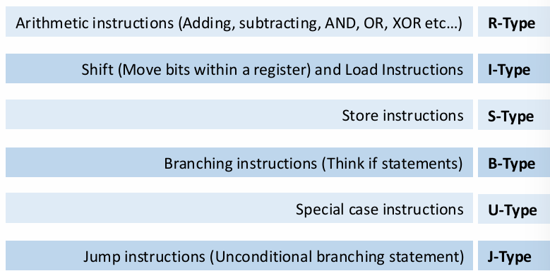
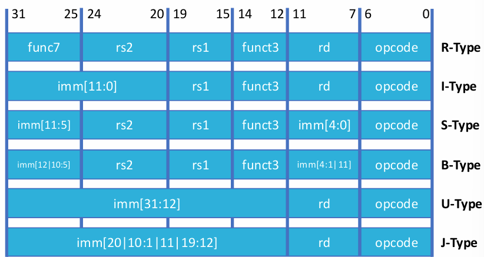

**Assembly Syntax**
- Microprocessors interpret specific binary sequences as instructions (machine code)
	- Can be written in binary, often written in hex
	- **Cumbersome** and very hard to read/write
- Assembly makes this more human readable
- *Architecture specific, but often has this format:*
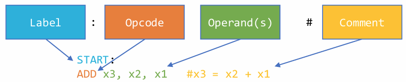

**RISC-V Instruction Set**
- Always uses *relative addresses* -> minimises risk of clashes with other programs
- Base specification only deals with 32-bit integers
- Has collection of extensions that can be included if required:
	- Floating Point (Extension **F**), Double precision (Extension **D**), Quad precision (Extension **Q**) registers and instructions
	- Multiplication and Division instructions (Extension **M**)
	- Atomic instructions (Extension **A**)

#### Instruction Set

**Arithmetic**
- `ADD` - Adds values of two registers, stores result in third register
	- `ADD x3, x2, x1 === [x3] <- [x2] + [x1]`
- `ADDI` - Add value of given constant and a register, and stores the results in a third register
	- `ADDI x2, x1, c === [x2] <- [x1] + c`
- `SUB` - Subtract value of one register from another, stores result in third register
	- `SUB x3, x2, x1 === [x3] <- [x2] - [x1]`

**Logic**
- `AND`, `ANDI` - Performs a bitwise AND and stores result in a specified register
	-  `AND x3, x2, x1 === [x3] <- [x2] & [x1]`
	- `ANDI x2, x1, c === [x2] <- [x2] & c`
- `OR`, `ORI` - Performs a bitwise OR and stores result in a specified register
	- `OR x3, x2, x1 === [x3] <- [x2] | [x1]`
	- `ORI x2, x1, c === [x2] <- [x1] | c`
- `XOR, XORI` - Performs a bitwise XOR and stores result in a specified register
	- `XOR x3, x2, x1 === [x3] <- [x2] ^ [x1]`
	- `XORI x2, x1, c === [x2] <- [x1] ^ c`

**Shifts**
- `SRA`, `SRAI` - Shift a signed register right by a specific amount, store result in a separate register
	- `SRA x3, x2, x1 === [x3] <- s[x2] >> [x1]`
	- `SRAI x2, x1, c === [x2] <_ s[x1] >> c`
- `SRL, SRLI` - Shift an unsigned register right by a specific amount, store results in a separate register
	- `SRL x3, x2, x1 === [x3] <- [x2] >> [x1]`
	- `SRLI x2, x1, c === [x2] <- [x1] >> c`
- `SLL, SLLI` - Shift an unsigned register left by a specific amount, store results in a separate register
	- `SLL x3, x2, x1 === [x3] <- [x2] << [x1]`
	- `SLLI x2, x1, c` === `[x2] <- [x1] << c`

**Branches**
- All take 2 registers and an offset, often given as a label
- `BEQ` - branch if equal
- `BNE` - branch if not equal
- `BLT` - branch if not less than
- `BLTU` - branch if not less than (unsigned)
- `BGE` - branch if greater than or equal to
- `BGEU` - branch if greater than or equal to

**Jumps**
- Stores value of PC that would be called next in the return register, branch but no compare
- `JAL` - Jump to PC + offset. Only requires an offset and a return register
	- `JAL x0, offset === [x0] <- [PC] + 4, [PC] <- [PC] + offset`
- `JALR` - Jump to register value and offset. Requires an offset, a register and a return register
	- `JALR x2, x1, offset === [x2] <- [PC] + 4, [PC] <- ([x1] + offset) & -2`

**Sets**
- Set a bit in a register based on if one argument is less than another
- `SLT`, `SLTU` - Set bit in register if one register is less than another register (signed and unsigned versions)
- `SLTI`, `SLTIU` - Set bit in register if one register is less than a constant (signed and unsigned versions)

**Memory**
- Stores - Put data from register into memory at a given position
	- `SW` - store a word in memory
	- `SB` - store the lower byte in memory
	- `SH` - store the lower half of the word in memory
- Loads - Pulls data from memory at a given position into a register
	- `LW` - Loads in a signed word from memory to register
	- `LB` - Loads in lower byte from memory into register
	- `LH` - Loads the lower half of word from memory into register
	- `LBU, LHU` - Unsigned versions of `LB`, `LH`

**System Control**
- `LUI` - Add a constant to upper part of a given register
- `AUIPC` - Used to build PC-relative address spaces
- `FENCE` - Used for I/O communication
- `ECALL` - Used to service requests
- `EBREAK` - Used to return control to a debugging environment

## 12. Introduction to C

#### Comparison to Other Languages

**Comparison to Assembly**
- Performance of assembly is very good
- Have to change entire assembly code if we move to a different processor
- If we are not careful, can be very dangerous
- Difficult to debug and read
- C deals with a lot of issues Assembly has, whilst maintaining performance

**Comparison to Java**
- Has to make a lot of assumptions (has to do a lot of potentially unnecessary checks)
- Runs in JVM, a virtual machine that adds extra complexity
- Less control over memory and how instructions operate
- C gives more programmer more explicit control, and runs on the raw hardware

#### Basics

**Data Types**
- Only 4 primitive data types in C
	- `char` - single byte to store ASCII character (8 bits)
	- `int` - Integer value based on word size (32 bits)
	- `float` - Single precision floating point number (32-bit IEEE)
	- `double` - Double precision floating point number (64-bit IEEE)
- Sizes can be dependant on the machine
- Integer modifications:
	- `short` - small version of int (16-bits)
	- `long` - large version of int (64-bits)
	- `unsigned` - Interprets the value as starting at 0
	- `signed` - Allows negative numbers
	- Can have combination of `short/long` and `signed/unsigned`
	- Dangerous to mix `unsigned` and `signed` in same program
- Booleans are represented by an `int`, or you can use `<stdbool.h>`
- `struct` is the closest thing to an object/class system in C, can only contain variables that are public

**NOTES:**
- Iterator variable needs to be declared outside the for loop (c89)
- `printf` prints to the terminal, uses these identifiers:
	- `%c`, `%s`, `%d`, `%u`, `%f`, `%e`, `%p`

**Pointers**
- ***Def***: Reference to a memory location, denoted with a `*`
- `int *` is a pointer to a location in memory where the value is treated as an integer
- `&` gets the address of a variable
- Pointer arithmetic increments by the size of the data type of the pointer
- `void *` is a void pointer, has no type, used to store blocks of raw data or data that cannot be stored in another way
- *Initialized pointers are set to 0 by default. If not set before used, can cause a segmentation fault*
- *Out of bounds memory access causes a segmentation fault*

**Memory Management**
- Two places where data can be stored:
	- Stack: local variables declared within a function
	- Heap: Large, non-local variables used throughout the program
- `malloc` stands for **Manual Allocation**, specify number of bytes to store on the heap
- `calloc` stands for **Clear Allocation**, specifies number of bytes to store on the heap and clears them
- `realloc` stands for Reallocation, makes a requested block larger/smaller
- Memory blocks created are contiguous
- All functions return a void pointer
- `free` is used to free memory that is manually allocated
- ***Heap memory cannot be freed after the program, which causes memory leaks and requires a restart of the computer***

**Arrays**
- Contiguous blocks of memory
- Stored as pointers, point to the first element in the array

**Strings**
- The same as a `char *`
- Need to store a **null terminator** `\0` to say we completed the string
- `<string.h>` has functions to manage strings

## 13. Introduction to I/O

#### Memory Mapped I/O

**Memory Mapped I/O**
- We can read inputs and write outputs by connecting components to the address bus
- We then give each component a memory address
- We may need to give each component more than one address, depending on the component and how much memory it has
- CPU can read/write to the component like any other piece of memory


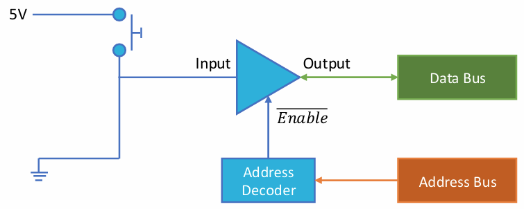
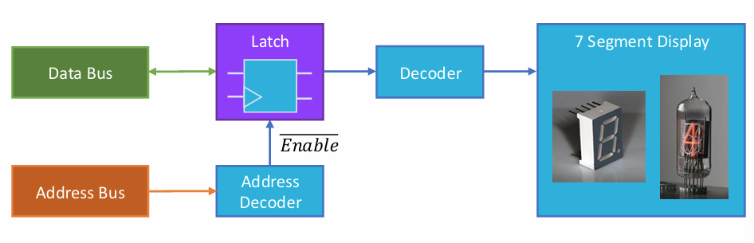

**Advantages**
- Very simple to implement
	- Don't need a separate collection of instructions to handle it
	- CPU requires less internal logic
- Can utilise general purpose memory instructions and any addressing modes the CPU supports

**Disadvantages**
- Need to reserve a portion of memory for I/O components
- For smaller word space processors, we have less main memory we can use
- 64-bit processors suffer less from this problem

#### Direct Memory Access (DMA)

**Overview**
- DMA addresses the problem where all data had to go through the CPU, causing a bottleneck. 
- DMA is useful when large amounts of data needs to be transferred (e.g. downloading files in a PS5)
- CPU hands control to the DMA Controller (DMAC)
	- DMAC is optimised just to transfer data
	- When required, DMAC can control all the busses on the system
- DMA-based I/o can be 10x faster than CPU-based I/O

**Operation Overview**
1. I/O sends request to DMAC
2. DMAC sends request to CPU
3. CPU initialises DMAC
	- Input or Output?
	- Start Address -> DMAC start address
	- Number of words to transfer -> Count Register
	- CPU enables DMAC
4. DMAC requests use of busses
5. CPU sends DMA Acknowledge when read to surrender busses
6. DMAC sends Acknowledge to transfer data

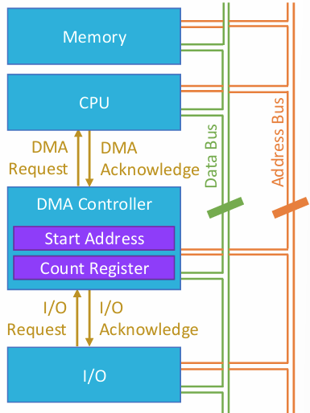

**DMA Organisation**
- ***Detached DMA***
	- All components share the same bus
	- DMAC acts as a CPU, exchanging data between I/O and Memory via the DMAC
	- Straightforward to implement
	- Can be inefficient (2 bus cycles per word)
	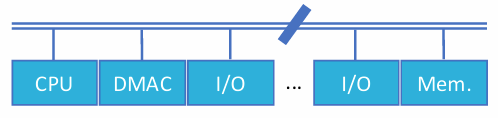
- ***Integrated DMA***
	- Multiple DMACs -> Each controls one or more I/O devices
	- Straightforward to implement
	- More communication required between CPU and DMACs
	- Can still be inefficient
	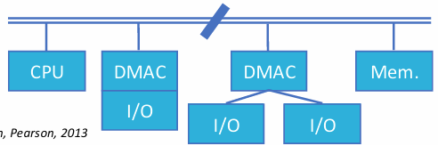
- **I/O Bus**
	- All I/O devices have a common bus (separate from system bus)
	- DMAC only has to transfer data to and from Main Memory (faster and easier transfers)
	- More complex to design
	- Requires more hardware
	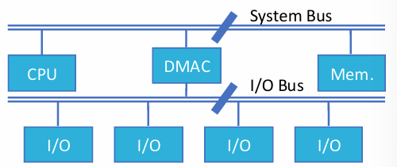

**Operation Modes**
- ***Cycle Stealing Mode***
	- DMAC uses the system busses when free
	- Usually "grabbed" when the CPU is not accessing memory
	- Have to be careful, could mis-detect a clear bus
	- Consideration for when different DMAC or component steals the cycle
- ***Burst Mode***
	- DMAC requests use of system busses for a period of time
	- "Locks" the CPU out of the system busses
		- For the requested period of time
		- Until the data transfer has been completed
	- CPU can override the lock if needed

## 14. Synchronous I/O

**Motivations**
- ***I/O devices are often always slower than our processor***
	- E.g. device is not ready for processor to read its data
	- E.g. device isn't ready to accept new data from the processor
- Example: Printers
	- Takes a relatively long time to print a character
	- Have to wait until character has been printed onto page until we can send the next piece of data
	- Don't want to overwrite data, otherwise things become unreadable

#### Polling

**Types of Polling**
- ***Normal polling*** - read status once
- ***Busy Wait polling*** - constantly read status until ready
- ***Interleaved polling*** - do something else for a while whilst waiting, and then check status again until ready

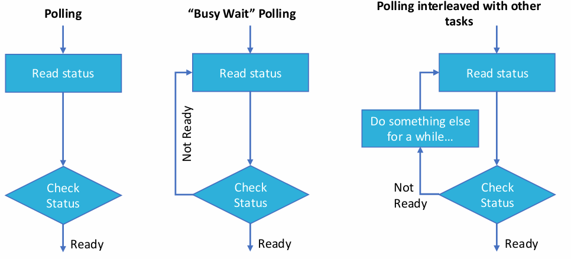

**Advantages**
- Very simple
	- Simple to build in hardware, only have to check a singular bit constantly
	- Simple to program, can use a while loop to keep checking the required data
- Sometimes it is good enough

**Disadvantages**
- "Busy-Wait" wastes CPU time and power
	- Not great if you have a battery powered device
	- Not great if you need to do a lot of other things
- "Interleaved Polling" - delayed responses
	- Not good if dealing with difficult real-time situations (e.g. airplane control system)

#### Handshaking

**Motivation**
- Don't want to have to keep polling the I/O devices
	- Wastes time sending and waiting for data
- In handshaking, ...
	- I/O device says when it is ready
	- Processor says when it is sending valid data
	
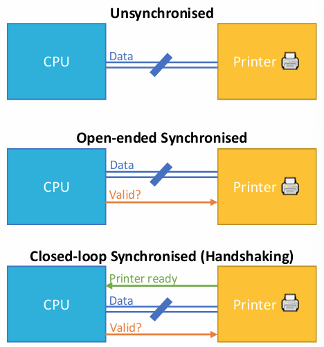

**Timing Diagram**
- Processor responds to printers ready signal by placing a new character on the data bus, and signals that the data is valid

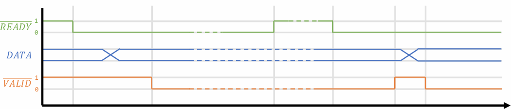

**6522 VIA**
- Stands for 6522 Versatile Interface Adapter (VIA)
	- Fairly old I/O integrated circuit
	- Fairly easy to use

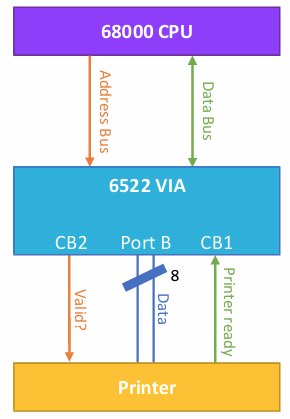

- 6522 VIA has two parts, Port A and Port B
	- Port B is used as output port
- Has a register that says what is being used
	- CB1 is used as *ready control line*
	- CB2 is used as the *valid control line*

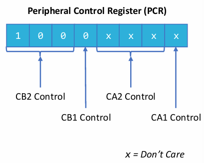

- PCR is set to `1000xxxx`
	- CB2 handshake is in output mode
- When `PRINTER_READY` is asserted (goes high to low)
	- VIA sets IFR4 (Interrupt Flag)
	- VIA sets `DATA_VALID` to high (data isn't valid)
- When processor writes a value to *Port B*
	- VIA sets `DATA_VALID` to low (data is valid)
- In this example, the processor has to repeatedly poll IFR

#### Interrupts

**Motivation**
- We don't want to have to wait wait constantly
- `IRQ` - **Interrupt Request** - Pin to say if something else needs to be ran/interrupt the program
- `NMI` - **Non-Maskable Interrupt** - Pin to say there is an interrupt that cannot be disabled / masked out

**Sequence**
- Main code runs
- `Interrupt Response is given`
	- CPU completes current instruction
	- Push PC onto Stack
	- Push Status Register(s) onto Stack
	- Load PC with address of Interrupt Handler
- Interrupt code runs
- `Interrupt code finishes -> Return from interrupt`
	- Pop PC from Stack
	- Pop Status Registers from Stack
	- Load PC with popped return address
- Main code continues

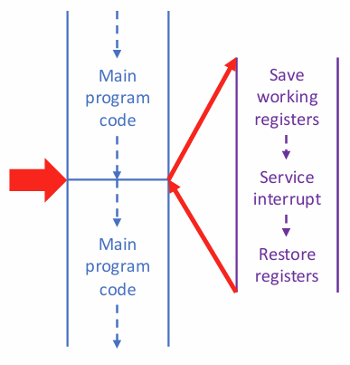

**Nesting**
- Interrupts can be nested many times
- Sometimes we need to make sure that the interrupt cannot be interrupted (IRQ vs NMI, some interrupts are important)

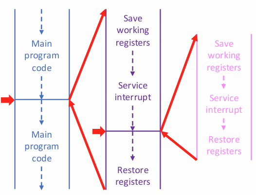

**Examples**
- Switches can be connected to `IRQ`
- A hard drive can generate an interrupt when requested data is ready to be read
- A timer can generate an interrupt every do often to read a sensor
- A printer can generate an interrupt when it is ready to receive the next thing to print

**Advantages**
- Fast response times
- No wasted CPU time or power
	- Do not have to constantly check
	- Only do stuff with I/O when necessary
	- Very important if we are using battery power

**Disadvantages**
- Everything still controlled by processor (how do we prioritise outputs?)
- Much more complex hardware and software
	- Need to handle putting things on/off the stack

#### Conclusion

- ***Memory-mapped I/O*** - Devices can be accessed like main memory, but only at special address locations
- ***Polled I/O*** - Scheduling input and output, where the CPU repeatedly checks if this is necessary
- ***Handshaking*** - Used to coordinate CPU and I/O devices to synchronise the transfer of data
- ***Interrupts*** - Avoids polled I/O by diverting the CPU to a special I/O routine
- ***DMA*** - Separate controller can be used instead of the CPU to transfer I/O data into/from memory

## 15. Case Study: Ethernet

#### Overview

**Overview**
- Originally proposed by *Robert Metcalfe* in 1970 at Xerox
- Originally over *coaxial cable*
- Ethernet comes from the word *ether*
- Data is transmitted through *Ethernet* using packets / bursts of data

**Life of 802.3**
- ***1973*** - Experimental Ethernet
- ***1985*** - First edition of 802.3 based on CMSA/CD
- ***1990*** - Twisted pairs
- ***1995*** - Fast Ethernet
- ***1999*** - Gigabit Ethernet
- ***2003*** - Power over Ethernet
- ***2006*** - 10Gb/s Ethernet over unshielded twisted pairs
- ***2024*** - 802.3 df is latest approved standard

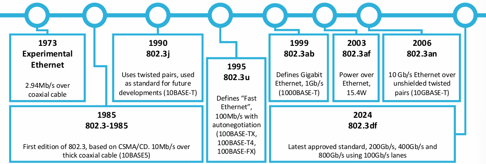

**Base Notation**
- Used to distinguish between different versions of 802.3
- `<transmission speed in Mbps> BASE - TX`

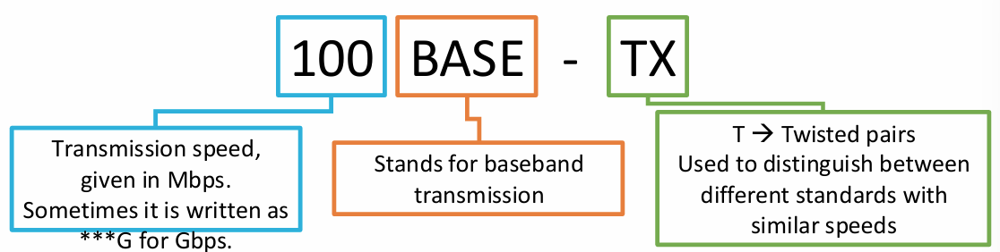

#### CSMA/CD

**CSMA/CD**
- Stands for **Carrier-Sense Multiple Access with Collision Detection**
- Allows for detection of data through system, includes a mechanism to wait, check and resend data
- Data transmitted in *frames* - collections of bits
- CSMA/CD is an extension of CSMA
	- Allows for earlier termination when a collision is detected
	- Shortens time required before retry
- Used by old hubs/Ethernet repeaters
- Depreciated in 2011, due to the popularity of switches

**Algorithm**
1. If medium is idle, transmit. Otherwise go to $2$
2. If the medium is busy, continue to listen until the channel is idle, then transmit immediately
3. If a collision is detected during transmission:
	- Transmit jamming code (to ensure all nodes on communication are aware there has been a collision)
	- Stop transmission
4. If there have been too many attempts, stop attempting transmission
5. Backoff for a period of time, then go to $1$

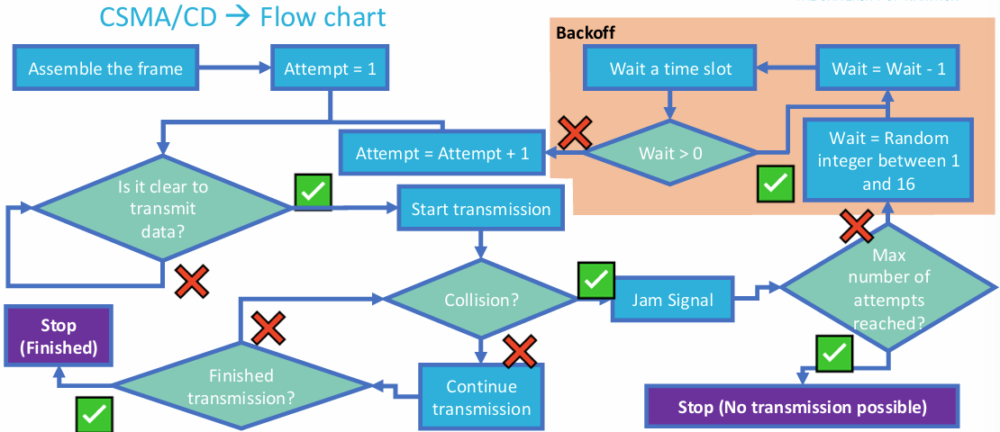

#### Wires, Categories

**Types of Cables**
- Originally, Ethernet used coaxial cables to transmit data
- Now we use copper or fibre cables

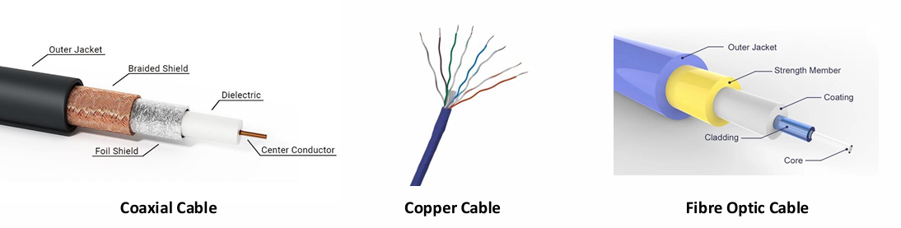

**Categories**
- `Cat` stands for Category, defines the maximum data rate and bandwidth
- `Cat1`, `Cat2` were used for telephone, not part of 802.3
	- `Cat1` used single, twisted pairs of cables to transmit analogue voice signals
	- `Cat2` extended to include data communication, primarily used for `IBM Token Ring` networks in the 1980s, became standardised in 1989 as IEEE 802.5
- Remaining categories are given by their maximum data rate, bandwidth and maximum distance

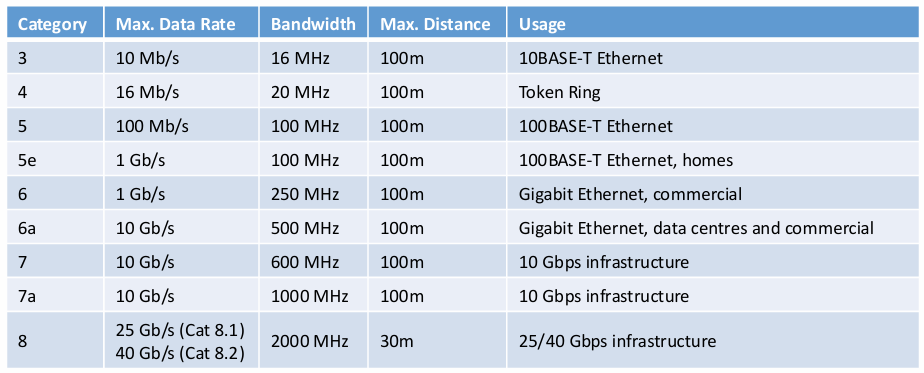

#### Twisted Pairs

**Overview**
- In copper cables, we use *twisted pairs* of signals that work together on the same signal
- One cable transmits *positive* voltage, other transmits an equally sized *negative voltage*
- $0$ or $1$ being transmitted depends on which wire has the *positive* voltage
- Reduces effect of noise through Electromagnetic Interference (EMI)

**EMI Emission**
- When we pass an electrical current through a wire, a magnetic field is produced
- This can affect other wires that are close, causing noise
- Flow of magnetic field is dependant on direction of current
- Opposing current direction wires causes magnetic fields to cancel each other out, so there is **no EMI emission**

**EMI Absorption**
- Noise can occur outside the system as well as within the system
- If both wires are close to the source of the noise, they would be equally affected
- **Hence, the difference in the voltage will remain the same**
- You can then normalise the voltages back to their intended range

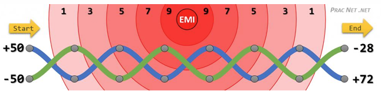

#### Shielding, Connectors

**Unshielded and Shielded Pairs**
- Unshielded cables will work for most domestic cases
- Sometimes you need more shielding to prevent noise, so there is a standard for shielding the cables
- `F / F TP`

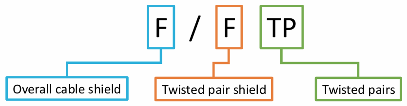
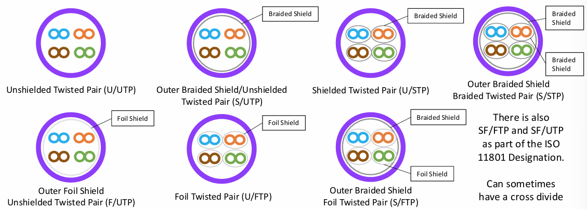

**Connectors**
- Basically all Ethernet cables are terminated with an `RJ45` connector
	- `RJ45` - Registered Jack Number 45
	- 8 position, 8 connections with a latch on the top, used with an Ethernet cable (i.e. every cable in the Ethernet cable has a connector)
- In some industrial situations a `M12` connector is used:
	- Has a 12mm locking thread
	- Comes in 3, 4, 5, 8 and 12 pin layouts

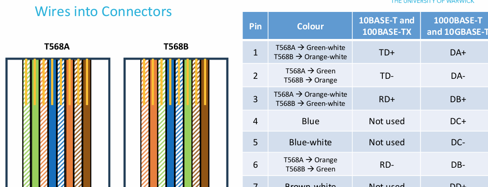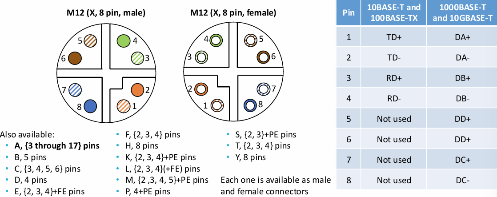

#### Straight Through and Crossover

**Motivation**
- 100BASE-TX and older standards used 2 twisted pairs for data transmission
	- A twisted pair that transmits (`TX`)
	- A twisted pair that receives (`RX`)
- You need the `TX` of one machine to connect to the `RX` of the other machine
- Most of the time a PC is connected to a switch, you can swap the pins for a switch
- Consider connecting two PC's together or two switches together?

**Straight Through, Crossover**
- Straight Through
	- Twisted pairs were connected in the same order at both ends (both would be `T568A` or `T568B`)
	- Used for PC to Switch/Hub
- Crossover
	- Twisted pairs were connected in the opposite order at each end (one end would be `T568A`, other would be `T568B`)
	- Used for PC to PC, or Switch/Hub to Switch/Hub

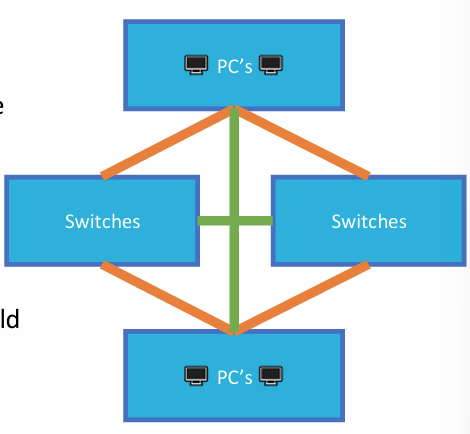

#### Auto MDI-X

**Motivation**
- As part of 100BASE-TX, stations can figure out whether a Straight-Through or Crossover cable is being used (`AUTO MDI-X`)
- `MDI` stands for Medium-Dependant Interface
- Needed as transmission and receive need to be paired together down the same line

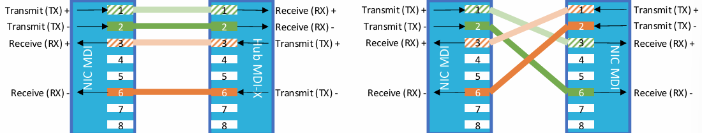

**Algorithm**
1. Both stations pick a number between 1 and 2048 ($2^{11}$
2. If the number picked is even, use `MDI`
3. If the number picked is odd, use `MDIX`
4. Transmit some data down the lines
5. If transmission is successful, then stop
6. If transmission is unsuccesful, then:
	1. Wait $62 \pm 2$ ms
	2. Pick a new number using `Linear Feedback Shift Register (LFSR)` as outline in 802.3 40.4.4.2
	3. Go to $2$

**Linear Feedback Shift Register**
- The LFSR is an 11-bit shift register where bits 9 and 11 are XOR'ed and fed in as input
- LFSR produces pseudo-random yet predictable numbers
- If both stations pick the same number, then the variation in time will allow for one to go first
- As more attempts are given, there is a vanishingly small chance of collision
- 100BASE-TX had this as an option, future standards required this

## 16. Processor Architecture

#### Microprocessor Organisation

**Common Components**
- Registers to store data (e.g. **D** registers)
- Registers to store addresses (e.g. **A** registers)
- Bus that allows the components to be connected
- Program counter register (**PC**)
- Instruction register (**IR**)
- **Control Unit** to enable/disable different components based on the instruction in the **IR**
- **Arithmetic & Logic Unit (ALU)** that performs calculations

**Control Unit**
- A *control unit* decodes and executes the instruction present in the IR
- Data in IR consists of two parts:
	- *opcode* - the instruction
	- *operand* - the parameter

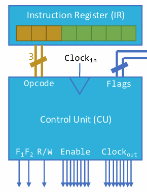

**Arithmetic and Logic Unit**
- Performs both mathematical and logical calculations
- Inputs often include:
	- 2 connections to the bus for data
	- Multiple function lines - determines which operation the ALU should do
- Outputs often include:
	- 1 connection to the bus to transfer result
	- At least a carry line (for overflow) to the *CCR*

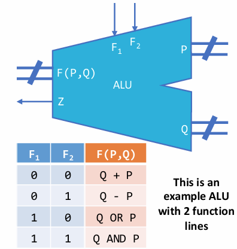

**Turing Completeness**
- *Turing complete* is when a computer can solve any computational problem
	- Ignores runtime, memory, power etc.
	- Defined in abstract terms
- Some functions include:
	- Being able to perform conditional loops or conditional jumps
	- Being able to read data from, and write data to storage
- Examples: pretty much every widely used language
	- Can achieve Turing Completeness by a single instruction:
		- `Subleq` - subtract and branch if less than or equal to
- Examples of other Turing Complete tools
	- PowerPoint and Excel
	- Minecraft
	- Conway's Game of Life

#### Micro and Macro Instructions

**Micro Instructions**
- The high level (macro) functionality of an assembly instruction can be represented using RTL
- RTL can also be used to represent the functionality at a lower (micro) level
- Some instructions cannot be executed at the same time, so will need multiple clock cycles
- E.g. `ADD #42 D0`
	- *Macro* version: `1. [D0] <- [D0] + 42`
	- *Micro* version:
		1. `[ALU(Q)] <- [D0]`
		2. `[ALU(P)] <- [IR(operand)]`
		3. `[ALU(F)] <- 00 ("Q+P")`
		4. `[D0] <- [ALU(F_out)]`
		5. `[CCR] <- [ALU(CCR_out)]`

**Signal Timing Assumptions
- We assumed everything is instant
	- In reality, timing diagrams are designed to show how many clock pulses are required and propagation delays
- We discussed the execute part of the FDE cycle
	- In reality, each part would require a number of clock cycles in order to be completed
- We assumed there is a set of registers in the ALU
	- In reality, this would have to be specified, and would have to be factored in when looking at timing diagrams

**Control Signals**
- Each instruction (micro or macro) may require clock pulses/cycles to execute fully
- Less clock cycles / instruction $\implies$ faster processor
- Faster clock $\implies$ faster the instructions are executed $\implies$ faster processor
- We want to minimise the number of instructions
	- Especially true for those included in fetch and decode sections, as this happens with each macro instruction

#### Hardware Control Unit

**Overview**
- Design is done through the use of logic circuits
- Boolean logic transforms inputs into specific outputs
- Sometimes called *Random Logic*

**Sequencer**
- A *sequencer* activates a line per clock cycle in a round robin fashion
- Allows us to determine how far through a particular instruction we are

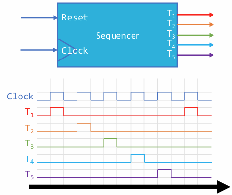

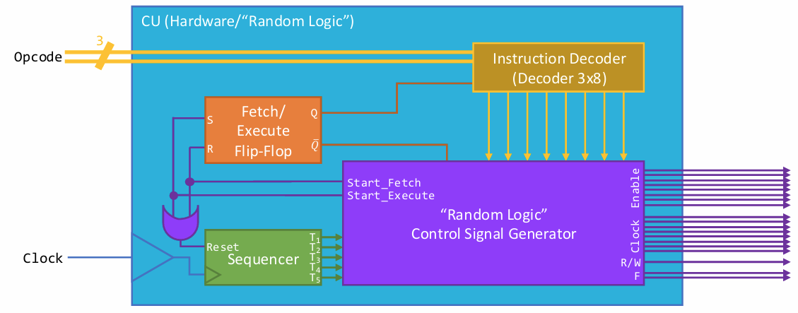

**Advantages**
- Very fast
- Often incredibly power efficient

**Disadvantages**
- Very complex
- Difficult to design and test
- Inflexible - difficult to change should an issue be found or a new instruction needs to be added

#### Microprogrammed

**Overview**
- Designing internal logic of CU is difficult especially when updates need to be made
- Often, different *macro* instructions will share *micro* instructions
	- Define a macro instruction as a $\mu$program of micro-instructions
- Micro-processor within the CU that does basic functions

**Terminology**
- Micro-address - A location within $\mu$program memory
- Micro-instruction - Holds the CU output values as well as other fields required for control flow of the $\mu$program
- MicroPC - CU's internal program counter
- MicroIR - CU's internal $\mu$instruction register
- Microprogram Routine - Describes how to generate *CU* outputs for a *macro* instruction, made out of $\mu$instructions and stored in $\mu$program memory


**Advantages**
- Easier to design and implement
- Can be more flexible
- Easier to extend for new instructions and/or bug fixes

**Disadvantages**
- Often macro instructions will take longer to run
	- Has to check multiple different options
	- Each macro instruction will call many micro instructions

## 17. RISC & CISC Processors

#### RISC

**Motivation**
- *RISC* stands for **Reduced Instruction Set Computing**
- Try to compute everything with as few instructions as possible
	- Use less hardware -> more cost efficient
	- Less wasted computation -> more energy efficient
- Explored since late 1970s / early 1980s

**Description**
- **RISC Architecture** - small number of instructions that cover everything we need
	- May have to run more instructions in order to do complex operations
	- Instructions can be streamlined and pipelined to gain performance
- **Fixed length instructions** - all instructions take up same room to store
- Often use a *hardware-based* control unit
- Simple encoding -> simplifies fetch-decode-execute

**Example - ARM processors**
- All *ARM* processors are *RISC processors*
- Designed to be low cost and low energy systems
- E.g. ARM1
	- Introduced in 1985 as part of BBC Micro
	- Peak performance: 8 MIPS (million instructions / s)
	- Used pipelining
	- 25x32 bit registers
	- No cache built-in

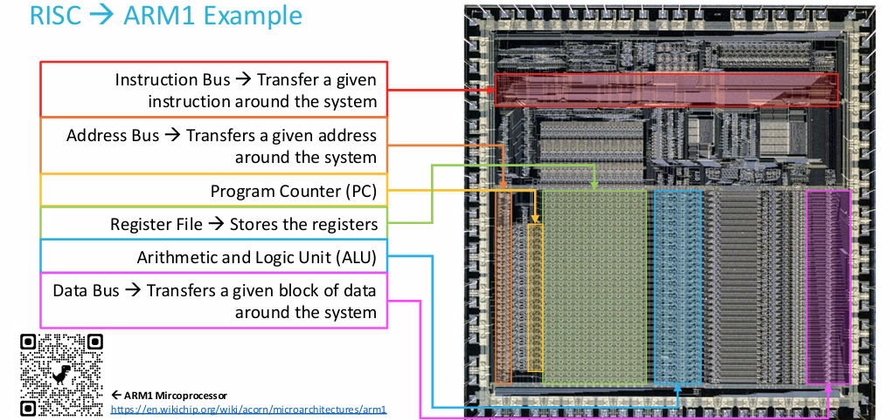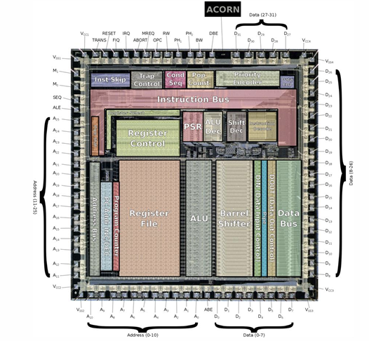

**Advantages**
- Everything is built in hardware
	- More energy efficient
	- Can be faster without increasing clock speeds

**Disadvantages**
- A lot more complex to build
- A lot more complex to design
- Cannot be easily patched or expanded upon

#### CISC

**Motivation**
- *CISC* stands for Complex Instruction Set Computer
- Can combine multiple instructions to make things simpler
- Does not necessarily need a fixed-width instruction set
	- Have instructions that closer match higher level languages
	- Smaller programs -> Less access to memory
- Can have a lot more instructions
- Often use a $\mu$program-based control unit

**x86 Architecture**
- *x86* and it's successor, *x86-64* is a **CISC** processor
	- Have variable-length instructions -> more instructions can be added
	- Now include instructions for parallelism and optimisation
- Have a microprogrammed Control Unit
- Widely used by Intel and AMD

**Intel 8080**
- Launched in 1974, discontinued in 1990
- 2MHz clock speed, increased to 3.125MHz in later variants
- 4500 transistors
- 7x8 bit registers
	- First register is accumulator
	- Remaining 6 registers can be used as 6x8 bit or 3x16 bit registers
- Microsoft BASIC originally programmed for 8080
- Successor (8086) spawned the x86 instruction set
- Still in production today for very specific use cases

**Advantages**
- Quick and simple to design and implement
- Easy to update with new instructions or bug fixes
	- Especially if using an EEPROM

**Disadvantages**
- Have to run it at a faster clock speed to get a similar performance to RISC
	- More micro-instructions -> More time per macro instruction
- Requires more power to run

#### Multithreading and Multicore Systems

**Threading**
- ***Def*** - A thread is an execution context for a processor, including a stream of instructions
- Can split computation over multiple threads
- Most languages have a way of adding parallelism

**Multithreaded Systems**
- **Multithreading can be executed on a single core system:**
	- While thread is waiting for piece of data from memory/IO, another thread can take over the processor and execute
	- Changing threads is cheaper to do than changing the process
- Each program can spawn as many threads as it wants
- **No time slice for threads, time slice for processes**
	- Threads usually switch faster than processes
	- Threads can hold all the time, starve other threads

**Problems with Multithreading**
- ***Race Conditions***
	- Threads update the same data at the same time
	- To fix -> utilise a lock
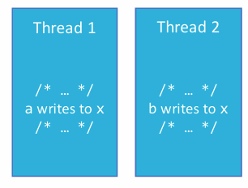
- ***Deadlock***
	- Threads lock each other out
	- To fix -> Need to be careful so threads don't take all the locks
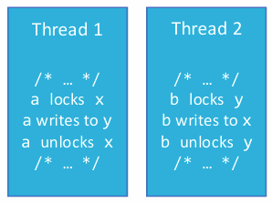
- ***Starvation***
	- Low priority threads are not scheduled
	- Therefore, low priority threads are never ran
	- To fix -> Switch threads explicitly

**Cores**
- ***Def*** - A *core* is a physical processor that can run code independently
- All cores will be on the same physical die
- Most modern day processors will have 2 or 4 cores per processor
- Every core will have often a small level of L1 cache

**Multicore Systems**
- More cores $\implies$ more work can be done in parallel per clock pulse
- Threads will run independently on each core
	- Pre 2010s, can only run one thread or core
	- 2010s onwards, can have 2 more more threads running on same core (**Hyperthreading** or **Simultaneous Multithreading** (SMT))
- Can specify that a program will take all cores, and how work will be divided between these cores
- Limited by size of processor die, power, thermal dissipation etc.

**Multithreaded & Multicore**
- Often, modern processors have multiple threads to run per core and will have multiple cores
- Quad core processor - **8 logical cores** , 4 physical cores, each allowing 2 threads to run

## 18. Case Study: 68K

#### 68K Architecture

**Overview**
- The *68008* processor (in 68k family of chips) is very simple
- Has same instruction set as 68000, but with a smaller external bus (8-bit data bus, 20-bit address bus)

**Memory Registers**
- ***Data Registers***
	- 32-bit registers
	- Used to store frequently used values or intermediate results
	- Treated in 3 different sizes (`Long` - 32 bits, `Word` - lowest 16 bits, `Byte` - lowest 8 bits)
	- More registers = fewer references to external memory
- ***Address Registers***
	- 32-bit registers
	- Used as Pointer Registers
	- A0-A6 are regular pointer registers
	- A7 is the system stack pointer
		- Stack points to next free location in memory
		- Stores essential temporary values (return addresses etc.)
- ***Condition Code Register (CCR)***
	- 16-bit register, 1 byte used to store system flag bits, 1 byte used to store user flag bits, such as `Negative (N)`, `Zero (Z)`, `Overflow (V)`, `Carry (C)`
	- Flags often set and checked by ALU
- ***Program Counter (PC)***
	- 32-bit register
	- Used to store the address of the next instruction
	- Often incremented once the current instruction has been read


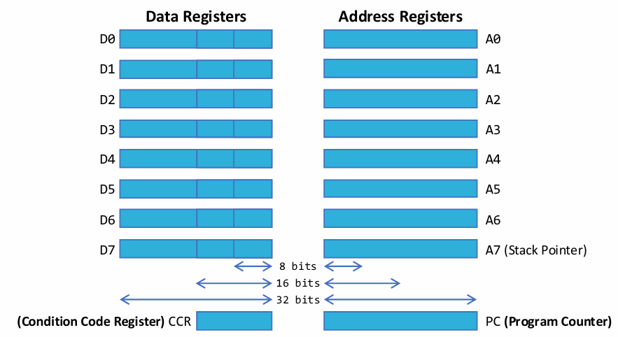

**Internal Architecture**
- ***Instruction Register (IR)***
	- Used to store most recent instruction fetched
	- Contains both opcode and operand
- ***Control Unit***
	- Used to decode the opcodes and their operands
	- Handles logistics
	- Executes decoded instructions
- ***Arithmetic and Logic Unit (ALU)***
	- Used to perform required computation
	- Acts on both Data and Address registers
	- Specific functions defined by opcode and operands decoded by CU
- ***Memory Address Register (MAR)***
	- 32-bit register
	- Used to store address/location of external memory
	- Used when CU is instructed to read/write data to external memory
- ***Memory Buffer Register (MBR)***
	- 32-bit register
	- Used to store data relevant to CU and external memory
	- If reading data from external memory, relevant data is stored in MBR to be read
	- If writing data to external memory, relevant data is stored in MBR before transaction occurs
- ***External Memory***
	- Used to store large amounts of data
	- Limited by address size

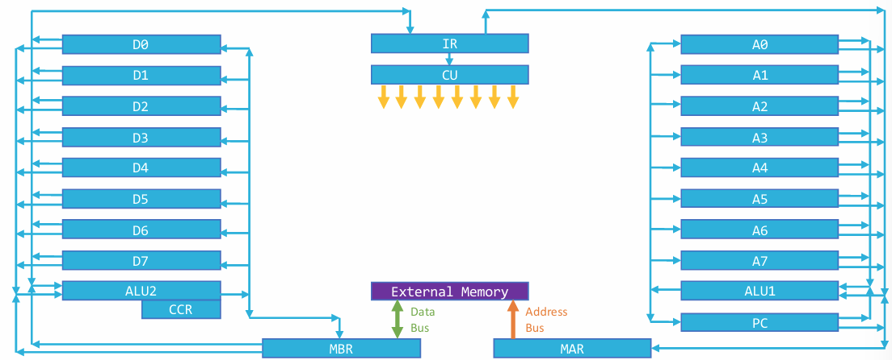

#### 68K Assembly

**68K Assembly**
- Have different set of instructions compared to RISC-V
- Some differences include:
	- Comments are separated by a pipe
	- Many instructions have permutations
- Instructions can be one of three types:
	- Byte (`.b`) - 1 byte
	- Word (`.w) - 2 bytes
	- Long (`.l`) - 4 bytes
- **Data Management**
	- `move` - moves data from one place to another
	- `exg` - exchange two registers
	- `swap` - swaps the lower 2 bytes with upper 2 bytes for given register
	- `lea` - Load Effective Address
- **Arithmetic**
	- `68008` does not have floating point support, everything is an integer
	- All common arithmetic functions (`add`, `addx`, `sub`, `subx`, `mulu`, `muls`, `divu`, `divs`)
	- Most have variations to cover different cases
* **Logic**
	* Performs bitwise operations on data and instructions
	- Logical - `OR`, etc.
	- Shift 0 - `LSL`, `LSR`, `ASL`, `ASR`
	- Rotate - `ROL`, `ROR`, `ROXL`, `ROXR`
- **Branch**
	- **CCR** flags are used in these branches
	- Branch needs label to go to
	- 15 different branch conditions

**Subroutines**
- A *subroutine* is a function in Assembly
- Consists of 2 key functions: 
	- `JSR <label>` - jump to a subroutine
	- `RTS` - return from a subroutine
- The **Stack** is used to keep track of return addresses etc.
- When **JSR** is called:
	- Saves / pushes contents of PC onto the stack
	- Puts the start address of the subroutine in the PC
- When **RTS** is called:
	- Restores / pops the return address from the stack
	- Puts return address in the PC

**Addressing Modes**
1. ***Data or Address Register Direct***
	- Specify which data or address register to allocate
2. ***Immediate Addressing***
	- Operand forms part of the instruction
	- Remains constant throughout execution of program
3. ***Absolute Addressing***
	- Specify where in memory to store the data
	- Memory location is specified by operand, cannot change during life of program
4. ***Indirect Addressing***
	- Location of data is dependant on value in a register
	- Use register contents as address, or can add an offset
	- Can have *Post-Incrementing* and *Pre-Decrementing* of addresses
	- *Indexing Addressing* - add contents of two registers and add a constant
5. ***Relative Addressing***
	- Only works on the *PC*
	- Contents at PC taken, add fixed number, use as memory address
	- Allows for "position independent code" - can be very dangerous

#### FDE Final Form

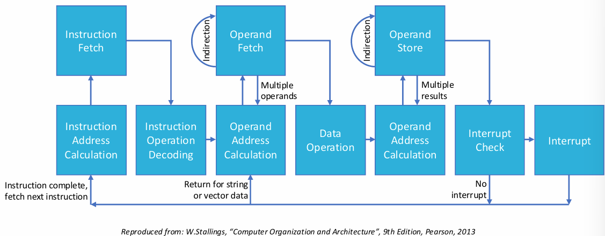

## 19. Achieving Performance

#### Measuring Performance

**Time**
$$T_{\text{execute}} = N_{\text{inst}} + \frac{1}{W_{\text{inst}}} \times \text{CPI} \times T_{\text{cyc}}$$
- where:
	- $T_\text{execute}$ is the time taken to execute a program (seconds)
	- $N_\text{inst}$ is the number of instructions in the program
	- $W_\text{inst}$ is the "work" carried out by an instruction. Difficult to calculate and is very processor dependant (simple processer: lower value. complex processor: higher value)
	- $\text{CPI}$ is the *average* number of clock cycles per instruction
	- $T_\text{cyc}$ is the amount of time for a *clock cycle* (seconds)

**FLOPs**
- We usually measure time to calculate floating point values, as most calculations use these
$$\text{FLOPS} = \frac{\text{FLOP}}{T}$$
- where:
	- $\text{FLOPS}$ is the number of *Floating Point* operations per second
	- $\text{FLOP}$ is the number of operations required to perform a set of calculations using floating point numbers
	- $T$ is the time taken in seconds to perform the calculations

**Memory Bandwidth**
- For many data heavy programs (machine learning, physics simulations etc.) the limitation is not the speed of computation
- Speed at which data can be retrieved is the limiting factor

$$\text{MB} = \frac{\text{Memory}}{T}$$
- where:
	- $\text{MB}$ is the *Memory Bandwidth* in MB/s
	- $\text{Memory}$ is the amount of data moved from one medium to another (main memory -> cache, cache -> registers) etc. in MB
	- $T$ is the time taken in seconds to perform the data movement

**Benchmarks**
- A ***Benchmark*** is a small program that checks a performance metric of a processor/system
- A ***Benchmark Suite*** is a collection of benchmarks used to compare processors/systems
	- Can be used to check multiple aspects of the processor
- E.g. `LINPACK`, `NAS Parallel Benchmarks`, `STREAM`

#### Pipelining

**Overview**
- ***Pipelining*** is when we chain instructions such that we can start an instruction before the previous instruction has finished
- Especially important for *RISC* architecture, where each part of an *instruction is handled by different physical logic*
- Pipelines can be different lengths, depending on the architecture and instruction set

**Five Sections of Instructions**
- ***Instruction Fetch (IF)*** - read instruction from system memory
- ***Instruction Decode (ID)*** - understand instruction (often free if using a decoder)
- ***Operand Fetch (OF)*** - collect operands (either registers or system memory)
- ***Execute (E)*** - Execute the instruction
- ***Operand Store*** - Store the result of the instruction to destination as specified by operand

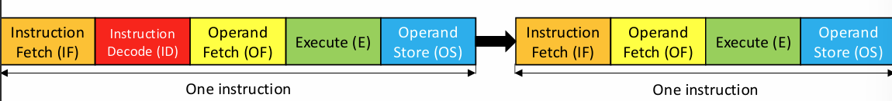

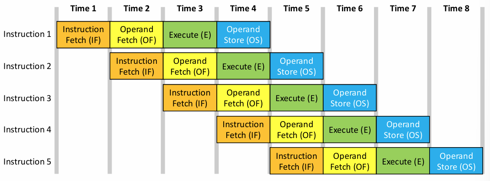

**Hazards**
- Works well when all instructions are the same length and independent
- If some instructions take longer, we need to create a bubble
	- E.g. *branch* or *jump* instructions
- Where instructions need to be delayed, we can use a **NOP** (No-Operation)

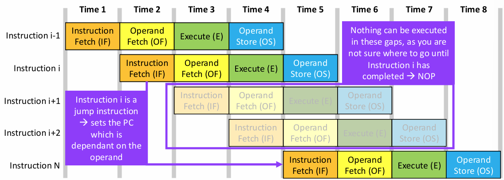

**Data Dependency**
- When an instruction requires a piece of data that is calculated using an instruction somewhere else in the pipeline
- We have a data dependency that needs to be resolved, otherwise later instructions will operate with incorrect data

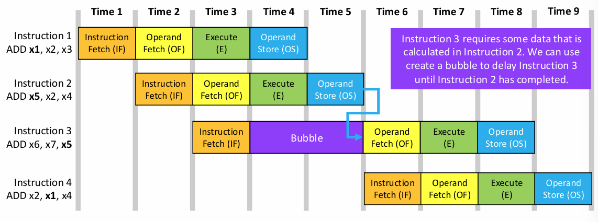

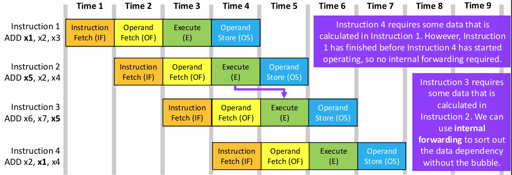

**Branches**
- Branches cause issues with pipelining:
	- If branch is taken, we can prepare the instructions to load in the branch instruction over the next instruction
- ***Branch Prediction*** - use probability to reduce the amount of bubbles required
	- ***Static*** - assume branch will be always true or false, can be enabled or disabled by the assembler/compiler
	- ***Dynamic*** - keep a record of how often branch instructions were true/false, use this to predict the next branch instruction

#### Cache Organisation

**Motivation**
- The way in which cache is mapped to main memory will affect the performance and the cost of retrieving that data
- Working with ***cache lines*** (multiple words stuck together), rather than words

**Direct-Mapped Cache**
- Each line in cache maps to specific lines in memory
- Each set in memory maps to a given line
- In this system, we don't know what set each line belongs to
- **Resolving Contention**
	- Alongside each cache line we store a tag, which stores the set number so we know which set is in each line
	- We know when to pull data from main memory

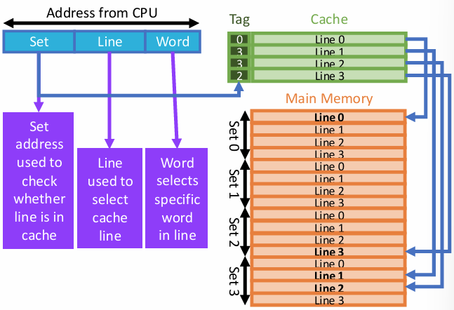

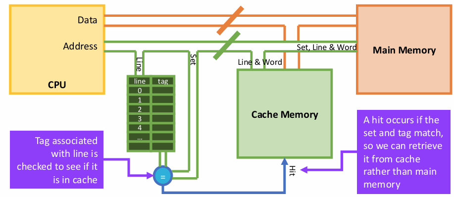

**Associative-Mapped Cache**
- An issue with Direct Mapped Cache is when 2 of the same line is needed at the same time
- *Associative-Mapped Cache* is where each line in memory has a unique tag that can be looked up
- Have to go through each tag in memory to see if it is in cache

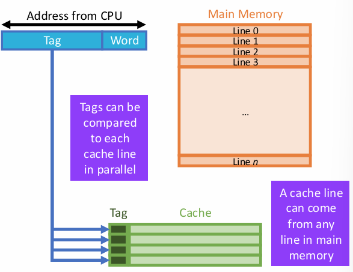

**Set Associative Mapped Cache**
- *Direct Mapped Cache* - fast but might need to evacuate often
- *Associative Mapped Cache* - memory can go into any line, but have to check the tags
- *Set Associative Mapped Cache*:
	- Combines both approaches
	- Cache is split into multiple blocks, each using Direct Mapped Cache
	- Allows you to store multiple of the same line from different sets

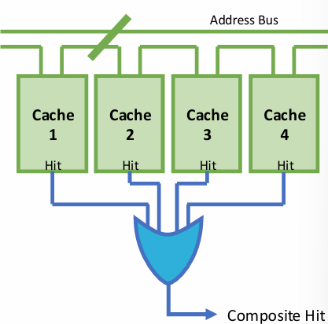

## 20. Considerations of Processor Design

#### Engineering Limitations

Manufacturing
- To build transistors we need to manipulate materials at small scales
- Use lasers to pinpoint silicon material and build all the circuit components
	- ***Abbe Diffraction Limit*** - Size of components limited to diameter of our laser
	- With Argon-Fluoride Laser, we can manufacture 65nm to 14nm transistors

**Interconnects**
- Copper in the interconnects can be fast or dense
	- Smaller cross-section - increase in resistance
	- Larger cross-section - larger capacitance on neighbouring wires
- Solution - larger number of stacks with different size wires

**Transistors**
- Size limited by width of gate (currently several atoms thick)
- Shrinking makes this gate smaller, which makes it more susceptible to noise
- More noise -> larger variations in performance

#### Energy Limitations

**Utilisation Wall**
- In order to keep chips running, chip power density must be limited (given enough energy, atoms start acting in a quantum fashion)
- As components get smaller, we have to *disable* more parts of the chip
- Alternative - lower clock speed and utilise more of the chip but at a slower speed

**Clock Speeds**
- Clock speed is limited, not likely to increase much

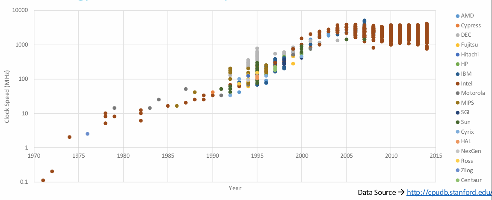

**Cooling**
- At high temperatures, transistors can stop working
	- High-temperature transistors are expensive to produce
- Reducing voltage decreases power consumption, hence reduces heat created
	- Currently around 0.5-2V, but can go down to 200 mV theoretically
- Limited by fundamental quantum limits (**Quantum Thermo-electrics**)

#### Parallelisation Limitations

**Amdahl's Law**
- We can parallelise things, but there will always be some code that needs to be executed serially

$$S_\text{latency}(s) = \frac{1}{(1-p) + \frac{p}{s}}$$
- where:
	- $S_\text{latency}$ is the theoretical speedup of the whole task
	- $p$ is the proportion of execution time that benefits (amount of parallel code)
	- $s$ is the speedup of the part of the program that benefits (speedup gained in parallel part)
	
- Only a theoretical limit on amount of parallelism, other factors still apply

**3D**
- We could go into third dimension (rather than being on a 2D plane)
- This may only lead to a theoretically mild improvement
- E.g. if an algorithm is $O(n^2)$ in 1D, and $O(n)$ in 2D, it is roughly $O(n^\frac{3}{4})$ in 3D

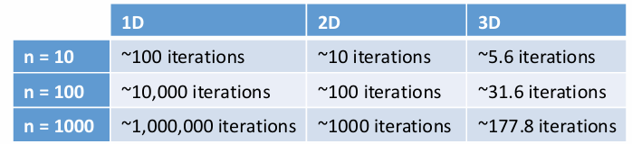

**Other Considerations**
- Need to improve other factors to gain more benefit from 3D cores
	- Possible high congestion between layers at interconnects
	- More difficult to manufacture $\implies$ more faults
- New materials for interconnect could help with this:
	- Cardon Nanotube FETs
	- Silicon Photonics

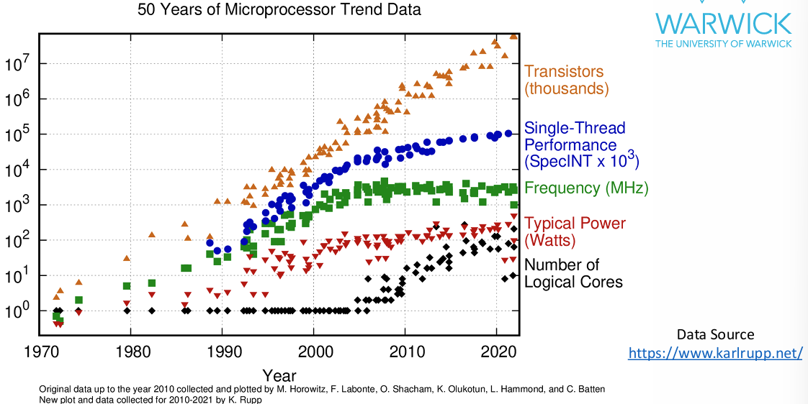

#### Quantum

**Quantum**
- Theory has shown they can be much faster for **some** algorithms
- Very expensive to design and maintain
- Huge issues over validation and fault-tolerance
- Too much of an unknown if this will be the future

## 21. The Future of Processors

#### High Bandwidth Memory

**Overview**
- When dealing with large amounts of data, compute speed is not the bottleneck
- **High Bandwidth Memory** - the ability to transfer more data in the same period of time
- Often much larger than Cache (16Gb+)
- Nearly always next to the processor
- Often achieved through more channels that can transfer more data in the same clock pulse

**MCDRAM**
- Stands for *Multi-Channel DRAM*
- Designed to allow multiple connections between different sections of the chip
- Found in Intel's Xeon Phi Knights Landing (KNL) System
	- 16GB NCDRAM up to 400GB/s
	- DDR DRAM connection up to 90GB/s
	- Because it is close to the chip, it can act like L4 cache

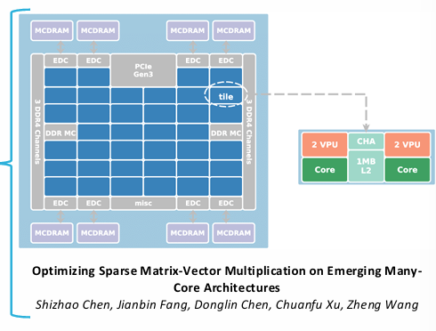

**HBM2**
- Memory is placed onto the chip as a series of "stacks"
- Each stack contains 8GB at 256 GB/s
- Found in High Performance GPUs such as NVidia P/V/A100, and some CPUs such as Fujitsu A64FX
- Successor to HBM2 (called HBM2e) is being used for Nvidia's next GPUs
	- NVidia H100 offers 80GB and 3.35TB/s

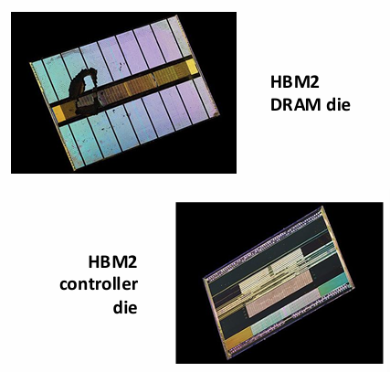#

**ARM Marvell ThunderX2**
- Memory bandwidth for CPUs are a big issue
- A faster interconnect between cores, cache and main memory is required
- Thunder X2 - ARM based architecture
	- 8 interconnects to main memory
	- 8 paths to cache
	- Measured memory bandwidth of ~116.5GB/s
- Intel and AMD are now using this technique to get up to ~180GB/s

#### Specialist Cores

**Overview**
- Sometimes we don't need processors to be general purpose, hence we can specialise some/all of our processor to specific tasks
- Most common examples include:
	- Integrated graphics on CPUs
	- Networking cards/chips on phones and routers

**ARM's big.LITTLE architecture**
- Phones and laptops have a large amount of time on standby
- During this time, we don't need a powerful processor just to check for info
- Hence we can have a small processor (LITTLE) that requires only minimal power for these tasks
- We will need powerful (big) processors for apps / games / general use
- Different configurations required for different cases, all using ARM v8-A cores

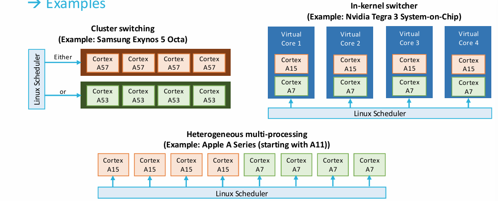

**Apple M Series chips**
- Designed as a System-on-Chip (SoC)
- CPU - split into 4 high-performance cores (with shared 12MB) and 4 high-efficiency cores (with shared 4MB)
- GPU - 8 cores with 128 execution units
- Neural Engine - 8 core GPU and 16 core CPU designed for machine learning
- Unified Memory - High Bandwidth

#### Other

**GPUs**
- Large quantity of small, simplistic cores $\implies$ huge parallelism per device
- Cores are often a lot slower - hide this by swapping out threads constantly
- Work is offloaded to the GPU - still needs a CPU to allocate work and manage the OS
- Usually consumes less power than a CPU
- E.g. Nvidia P/V/A100

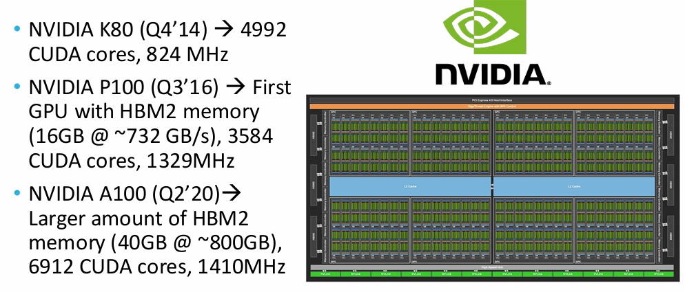

**FPGAs**
- ***Field Programmable Gate Arrays*** - a collection of components that can be turned on and off using transistors
- A program can be written and compiled to ensure only certain components are left active
- Can be hugely power efficient and fast
- Takes many hours to compile programs efficiently
- Being used at CERN to find dark matter

#### Heterogenous Computing

**Overview**
- Common trend with all architectures explored - don't just have large cores doing everything
- **Heterogenous Computing** - run the code across different, specialised machines
- **Homogenous Computing** - run the code across similar, specialised machines
- Need Libraries, API's / languages to handle this

**OpenMP 4.0/4.5/5.0**
- ***OpenMP*** is a library that allows for specialised comments to determine which regions of code should be ran in parallel
- Up to and including v3.0, this focused on purely CPU parallelisation
- v4.0 onwards allowed specifying hardware that the code should be executed on, and could specify memory regions

**SYCL**
- OpenMP relies on the hardware available to be compiled on
- ***SYCL*** - easier version of a different and older library called *OpenCL*
- Compiles the code just before it is ran
	- Referred to as "Just-In-Time" compilation
	- If compilation takes longer than expected, will need to pause the main program
- Allows for multiple different hardware components to run the same code
