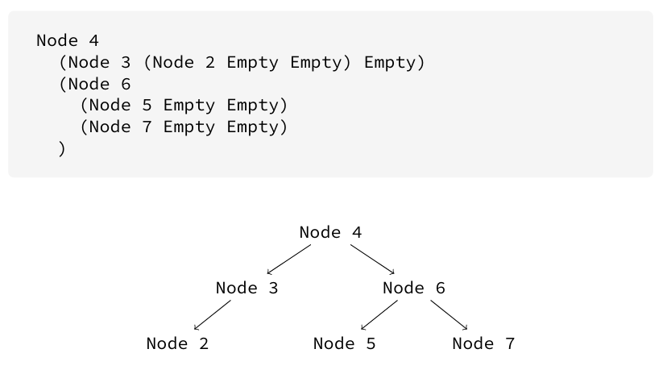
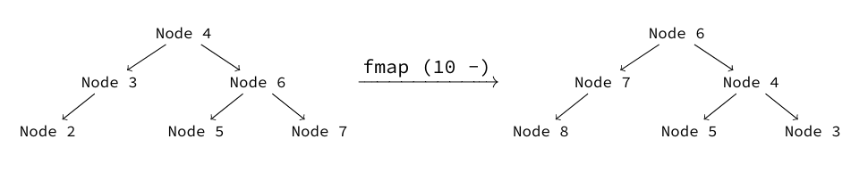
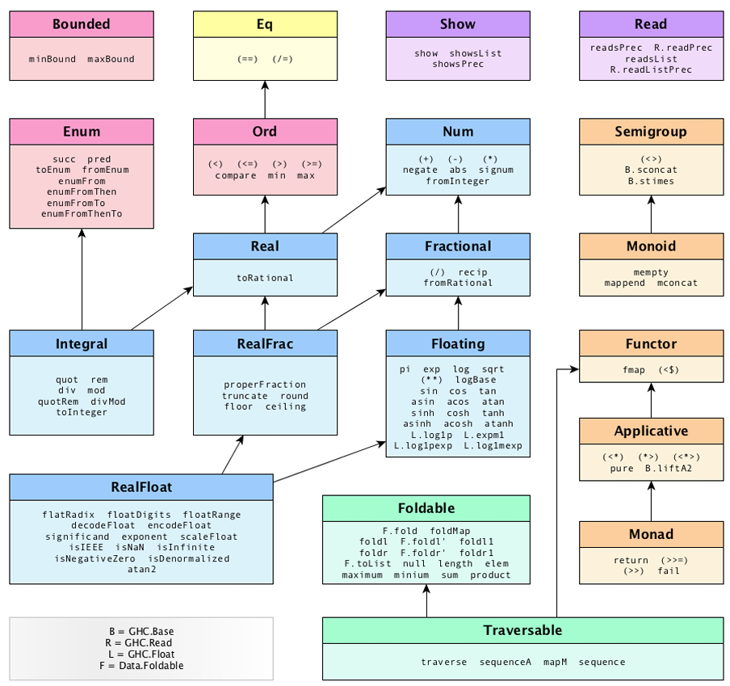
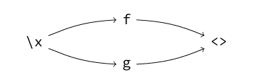

# 1. Introduction to Haskell

### Lambda Calculus

- A *mechanism* for describing algorithms, invented by **Alonzo Church** in 1936.
- **Recursive Functions** are functions that can refer to themselves in their own body.
- The *lambda calculus* and *recursive functions* are **equally expressive**
- An example of lambda calculus is:
$$ \lambda f . \lambda x . f x$$
- This is equivalent to the haskell lambda function

    ```haskell
    \f -> \x -> f x
    ```

- which is saying:
    * take as input a **function** $f$
    * take as input a value $x$
    * apply the function $f$ to the value $x$, written as `f x`

### The Church-Turing Thesis

- **Alan Turing** invented the **Turing machine**, another formalism for thinking about computation
- Use an input tape that can be read from and written to, and have an *in-built procedure** described by their structure

- ***Theorem*** (The *Church-Turing Thesis*) states that *any algorithm that can be described using a Turing machine can also be expressed using a lambda-calculus and vice-versa*
- ***Def.*** **Turing completeness** is the notion of being as powerful as a Turing machine, i.e. be able to compute.
    * *Recursive functions*, *lambda-calculus* and *turing machines* are all **Turing-complete** models of computation

### Programming Paradigms

- ***Def.*** A *programming paradigm* is a collective name given to a set of programing languages, based on the properties of the language such as programming sytle, how it is evaluated, and the toolset made available to the programmer.
- **Imperative** programming langauges:
    * make use of *step-by-step* computation
    * interact with memory via variables
    * **derived from Turing machine**
- **Functional** programming languages:
    * derived from recrusive functions and lambda-calculus

### Purity and Laziness

#### Purity

- ***Def***. A *pure function* is one where, given the same inputs, always proeduces the same outputs, and does not have any other **side effects** (i.e. interacting with outside world in other ways)
- **All functions in Haskell are pure**,so Haskell is a **purely functional** language

#### Laziness

- ***Def.*** *Lazy evaluation* is where the language does not evaluate any part of your code until that part is needed. 
    * As a result, there are no guarantees about the order that the computer will evaluate your lines of code.
    * Hence, the **order of writing functions** does not matter, unlike imperative programming.
- **Haskell is lazily evaluated**
    * Allows us to write **infinite** objects, such as `[1, 2, ..]` corresponding to **all the natural numbers** starting from $1$.

# 2. Lambdas and Guards

### Modules

- A file containing Haskell source code is called a **module**. They always start with the same line:

    ```haskell
    -- [the file is called Whatever.hs]
    module Whatever where

    ...
    ```

- The filename should start with a **capital letter** and end with the standard Haskell file extension `.hs`. The module name should match the name of the file.

### Importing Modules

- We can import definitions from other modules or libraries using the `import` keyword:

    ```haskell
    -- Whatever.hs
    module Whatever where
    import SomeOtherModule
    ```

- If source files are nested inside other folders, we use those as part of the module name using a `.`

#### Libraries

- The `base` package is effectively the **standard library** of Haskell.
- There is a special module in `base` called `Prelude`, which is automatically imported into every Haskell module by default.

### Lambdas

- **Lambdas** are used to write functions as *expressions*. They allows us to define **unnamed functions** as well.
- All function definitions are converted to *lambdas* by the compiler.
- ***Def***. *syntactic sugar* is an equivalent way of writing the same thing, which is nicer to read and write 
- The `\` represents *lambda*, meaning **taking an argument**.
- The standard way to write a lambda is:

    ```haskell
    double = \x -> x * 2
    ```

- We can write it as a **top level function**, which is syntactic sugar for *lambdas*:

    ```haskell
    double x = x * 2
    ```

- We can add more arguments by adding `->`:

    ```haskell
    add = \x -> \y -> x + y
    ```

- This can be written in the following ways by *syntactic sugar*:

    ```haskell
    add = \x y -> x + y
    add x y = x + y
    ```

### Partial Function Application

- **Partial Function Application** is where a function is not given all its arguments.
- In this case, the result is a *function* that is more specialised.
- For example:

```haskell
min = \x -> \y -> if x < y then x else y
```

- **NOTE**: the `->` operator is *right-associative* so we evaluate **left to right**.
- For example, evaluating `min 5` will result in:

```haskell
\y -> if 5 > y then y else 5
```

- which is a function that takes **one argument**.

### Operators 

- An **operator** is a function written in **infix** form, i.e. it goes *between* the arguments.
- For example `+`
- We can use parantheses to enclose an **operator** to make it into a normal function. For example:

```haskell
plusFive = (+ 5)
```

- **Difference between functions and operators:**
    * A function is *prefix*, i.e. functions go before their arguments
    * An operator is *infix*, i.e. functions go *between* their arguments
- We can use *backticks* to make a function into an operator:

```haskell
5 `max` 6
```

- is the same as `max 5 6`

### Conditionals & Pattern Matching

- **Pattern matching** is a form of *conditional statements* where you match on the **value**, or sometimes predicate of the argument.

- The most basic form of *conditional statement* is the `if` statement:

    ```haskell
    fac x = if x == 0
        then 1
        else x * fac (x - 1)
    ```

- A more elegant way to write **equality** tests is the `case...of...` construct, similar to **switch** in imperative languages.

    ```haskell
    fac x = case x of
        0 -> 1
        n -> n * fac (n - 1)
    ```

- **NOTE**: pattern matching is **top-down** so the order matters.
- An extension of *pattern matching* is **top level pattern matching**. It is simply *syntactic sugar* for the `case ... of ...` statement

    ```haskell
    fac 0 = 1
    fac n = n * fac (n - 1)
    ```

- Lastly, **guards** are a method of pattern matching on **predicates**. It is simply *syntactic sugar* for the **nested if-else statement**.

    ```haskell
    fac x
        | x == 0 = 1
        | otherwise = x * fac (x - 1)
    ```
- The `otherwise` keyword always evaluates to `True`.

# 3. Introduction to Types

### Compilation Steps

$$\text{Raw source} \to \text{Parser} \to \text{Type Checker} \to \text{Code Generator} \to \text{Binary Code}$$

### Types

- A *type* is a class given to a value that specifies what operations can be performed on it.
    * e.g. `Integer`
- **Concrete Types** are types given to values, e.g. `Char`, `String`, `Bool`, `Integer`.
    * They start with an *uppercase* letter
- **Type declaration** is written using the `::` syntax:

```haskell
five :: Integer
```

- The `::` syntax is **not an operator**, it is special notation that declares a type.
- Types are **automatically inferred** by the compiler.
- Types are **erased** after a program passes the type checker, so it is not possible to check what type something is at runtime.

### Importance of Types

- **Types prevent us from making mistakes**. These mistakes include:
    * supplying a function with too many arguments
    * forgetting some arguments
    * trying to pass a funtion the wrong kind of input
    * trying to use a value where it doesn't make sense

### Function Types

- Function types are written similarly to how their **lambda** functions are defined:
    * using an arrow `->` connecting the types of the arguments
    * borrows from maths, e.g. $\text{succ} : \mathbb{Z} \to \mathbb{Z}$.
- For example:

```haskell
succ :: Integer -> Integer
succ n = n + 1
```

### Parametric Polymorphism

- There are **three kinds** of polymorphism in Haskell. The first kind is **parametric polymorphism**
- ***Def***. *parametric polymoprhism* is when an expression's types are allowed to vary by means of parameters, i.e. the *type variables* which appear in the type.
- For example, consider the lambda function:

```haskell
id = \x -> x
```

- Any value can be passed in, e.g. `5`, `True`, `"Hello, world!"`.
- Since **any** value can be passed in to `id`, its type and declaration is:

```haskell
id :: a -> a
id x = x
```

- *By convention*, all type variables are a **single lowercase letter**.

# 4. Tuples and Lists

### Tuples

- ***Def***. A *tuple* is a sequence of known, finite length. For example:
$$(1,3) \in \mathbb{Z}^2$$
- The **dmension** of a tuple is the number of elements it has.

| Dimension | Name | Example |
|:----------|------|----------|
| $0$ | unit | `()`|
| $1$ | *(not used)* | --- |
| $2$ | pair | `(True, 5)` |
| $3$ | triple | `(1,2,3)` |
| $4$ | quadruple | `(True, 1, False, "Hello")` |
| $5$ | quintuple | `(True, 1, False, (), "Goodbye")` |

- The **zero-dimension** tuple, i.e. *unit*, is used to represent the *absence of a meaningful return value*, and is used later.
- A **one-dimensional tuple** is basically identical to a value, so tuples are generally considered to be dimension $2$ and up.

#### Types of Tuples

- The type of a tuple is simply formed by *replacing the values* by its types.
- E.g.

```haskell
(5, "Hello") :: (Int, String)
(True, -1, False) :: (Bool, Int, Bool)
() :: ()
```

- We can also nest tuples inside each other.

```haskell
(5, (6, 7)) :: (Int, (Int, Int))
```

#### Working with Tuples

- **NOTE**: `,` is a constructor, so we can use it to *pattern match* to extract the values out of the pair.
- `fst` extracts the first element of a pair:

```haskell
fst :: (a,b) -> a
fst (x,y) = x
```

- `snd` extracts the second element of a pair:

```haskell
snd :: (a,b) -> b
snd (x,y) = y
```

- `swap` swaps the elements of a pair:

```haskell
swap :: (a,b) -> (b,a)
swap (x, y) = (y, x)
```

* Note that `fst` and `snd` appear in `Prelude` but `swap` is not part of `Prelude` but is in `base` - import from `Data.Tuple`

### Lists

- Haskell lists are defined more similarly to *linked lists* in other programming languages.
- They are built out of two simple constructors, `[]` and `:`.
- Empty List:

```haskell
[] :: [a]
```
- Cons operator (`:`)

```haskell
(:) :: a -> [a] -> [a]
```

- The *cons* operator is used to join an element to an existing list, returning a new list.
- Hence, a list is defined as a series of **cons** operators followed by an *empty list* at the end. For example:

```haskell
1 : (2 : (3 : []))
```

- This syntax is very difficult to write, so there is *syntactic sugar* to write lists as *list literals*:

```haskell
[1,2,3]
```

- Note that the type of a list is denoted as `[a]`, where `a` is the type of the list elements.
- This is because **haskell lists are *homogenous***, i.e. all elements in them must have the same type.

#### Head and Tail

- We can pattern match a non-empty list on the **cons** operator.

```haskell
(x:xs)
```
- `x` is the *head*, and `xs` is the tail.
- We can get the *head* and *tail* using the `head` and `tail` functions:

```haskell
head :: [a] -> a
head (x:xs) = x

tail :: [a] -> [a]
tail (x:xs) = xs
```

- ***Def***. A *partial function* is a function which is only well defined for a subset of its possible arguments.

- Note that `head` and `tail` are partial functions
    * `head []` will cause a *list empty error*
    * `tail []` will cause a *list empty error*

#### Take, Drop, SplitAt

- `take n l` gets the first $n$ elements of the list $l$

```haskell
take :: Int -> [a] -> [a]
```

- `drop` does the opposite: it discards the first $n$ elements and gives you what's left

```haskell
drop :: Int -> [a] -> [a]
```

- Note that `take` and `drop` are **total functions**. If $n$ exceeds the length of the list, `take` and `drop` will return the whole list and empty list respectively.

```haskell
take 2 [1,2,3] === [1,2]
drop 2 [1,2,3] === [3]
take 5 [1,2,3] === [1,2,3]
drop 5 [1,2,3] === []
```

- The `splitAt` function takes a **splitting point** and returns a pair of the *prefix* and the *suffix*.

```haskell
splitAt :: Int -> [a] -> ([a], [a])
splitAt 3 [2,4,6,8,10] === ([2,4,6], [8,10])
```

#### Lists are not Arrays

- **NOTE**: A *list* is a *singly-linked list*. 
- Hence, the `length` of a list takes $O(n)$ time complexity.
- There is **no function** to change the $n$th element of a list.
- Indexing is done using the `!!` operator and is also $O(n)$ time complexity.

# 5. Currying

### Currying

- ***Def***. The process of taking a function which operates on several arguments and turning it into the one-argument-at-a-time form is called *currying*.
- **Haskell functions are curried by default**, so we can apply them partially.

- **Curried version**:

```haskell
f :: Int -> Int -> Int
```

- **Uncurried version**:

```haskell
f :: (Int, Int) -> Int
```

- There is no *meaningful* difference between the representation as a pair and the representation as two arguments.
- The two representations are **isomoprhic** to each other.

### Curry and Uncurry

- The **curry** function turns a pair-based function into an argument-based function.

```haskell
curry :: ((a, b) -> c) -> (a -> b -> c)
curry f = \x -> \y -> f (x, y)

uncurry :: (a -> b -> c) -> ((a, b) -> c)
uncurry f = \(x, y) -> f x y
```

- Normally, the **uncurry** function is used since haskell functions are **curried by default**. 

# 6. Map and Filter

### List Comprehensions

- A **list comprehension** is a shorthand for constructing lists.
- For example:

```haskell
a = [x^2 | x <- [1,2,3]]
```

- constructs the list `[1,4,9]`.
- The syntax `x <- foo` is called a *generator* - a source of elements.
    * the list comprehension binds each element of the generator in turn.
- The vertical pipe `|` separates the value from the generators, and is pronounced *"such that"*
- The expression is *written to the left* of the `|`.

#### Multiple Generators

- We can use multiple generators, and the generators are read off from left-to-right, so the rightmost one will change most often.

```haskell
bools :: [Bool]
bools = [False, True]

allBoolPairs :: [(Bool, Bool)]
allBoolPairs = [ (m,n) | m <- bools, n <- bools ]
```

- `allBoolPairs` is equivalent to `[(False, False), (False, True), (True, False), (True, True)]`.

- We also read bindings from left to right, so bindings of earlier generators can be used to define later generators.

```haskell
[(x, y) | x <- [0..3], y <- [0..x]] ===
[ (0, 0), 
  (1, 0), (1, 1),
  (2, 0), (2,1), (2,2),
  (3,0),  (3,1), (3, 2), (3,3) ]
```

#### Guards

- We can also put guards after the generators:

```haskell
evens = [x | x <- [0..], even x]
```

- When the guard does not evaluate to `True`, we drop the binding of values and move on.

### Map and Filter

#### Filter

- The `filter` function is efectively a list comprehension with a guard:
    * it filters out the cases where the predicate evalutes to *false*

```haskell
filter :: (a -> Bool) -> [a] -> [a]
```
- For example:

```haskell
squares = [x^2 | x <- [1..]]
evenSquares = [s | s <- squares, even s]
evenSquares = filter even squares
```

- Instead of doing a list comprehension with guard, we can use **filter** which is more succinct.

#### Map

- The `map` function applies a function to every element of the list.
- The action of applying a function to each element of a data structure is called *mapping*, and the function to do it on lists is called `map`.

```haskell
map :: (a -> b) -> [a] -> [b]
```

- Hence we can write the squares expression as:

```haskell
squares = map (\x -> x^2) [1..]
-- which is the same as
squares = map (^2) [1..]
```

### Ranges

- We can specify that a list should include a *range* of values.
- The syntax is as follows:

```haskell
[ x [, y] .. z ]
```

- where
    * $x$ is the lower end of the rnage
    * $z$ is the upper end of the range (inclusive)
    * $y$ indicates the *second element*, which sets the *step amount*
- If we omit the second element, the range goes up by $1$ each time.
- For example:

```haskell
[1..10] = [1,2,3,4,5,6,7,8,9,10]
[1, 3 .. 10] = [1,3,5,7,9]
[0, 0.5 .. 3] = [0, 0.5, 1.0, 1.5, 2.0, 2.5, 3.0]
['a' .. 'z'] = "abcdefghijklmnopqrstuvwxyz"
```

- Due to **haskell's laziness**, we can omit the ending position as well to create infinite lists, e.g. *all the natural numbers* as `[0 ..]`

# 7. Type Classes

### Type Classes

- *Type classes* are an **extra constraint** on the types given by a function's type definition.
- For example:

```haskell
(==) :: (Eq a) => a -> a -> Bool
```

- In this case, the type class constraint that `a` must satisfy is `Eq`.

#### Defining Type Classes

- Uses the `class` keyword
- **NB**: the word *class* does nothing have to do with classes in object-oriented programming languages.
    * a *type class* is similar to an **interface** where members of the ctype class must implement the functions given in the *type class definition*.

- For example:

```haskell
class Eq a where
    (==) :: a -> a -> Bool
```

- The existence of the `Eq` type class implicitly creates two things:
    1. a set of types, called `Eq`
    2. an operator called `(==)`, which can be used on any type that is a member of the `Eq` type class.

- Another example:

```haskell
class Num a where
    -- | Standard mathematical operations
    (+) :: a -> a -> a
    (-) :: a -> a -> a
    (*) :: a -> a -> a

    -- | Absolute value
    abs :: a -> a

    -- ... and some other stuff
```

#### Implementing Type Classes

- Uses the `instance` keyword
- For example:

```haskell
instance Eq Bool where
    True == True = True
    False == False = True
    _ == _ = False
```

#### Using Type Classes

- Type classes can be used to reduce the amount of code written due to **ad-hoc** polymorphism
- For example:

```haskell
doubleInt :: Int -> Int
doubleInt x = x + x

doubleFloat :: Float -> Float
doubleFloat x = x + x

double :: (Num a) => a -> a
double x = x + x
```

- The `Num a` type class constraint is required as the `+` operator expects both arguments to be numbers.
- In cases where we have more than one type variable, we may need to provide more than one type class constraint; we separate them with commas.
- For example:

```haskell
bothSame :: (Eq a, Eq b) => (a,b) -> (a,b) -> Bool
bothSame (x1, y1) (x2, y2) = (x1 == x2) && (y1 == y2)
```

### Important Type Classes

- Some important type classes are:

| Type Class | Meaning |
|:-----------|---------|
| `Num` | Numeric |
| `Eq` | Ability to test if two terms are equal |
| `Ord` | Total Ordering |
| `Show` | Gives access to `show` function |
| `Read` | GIves access to `read` function |
| `Integral` | Integer-like numbers, efines (rounded) integer division function `div` |
| `Floating`| Float-like numbers, defines floating point division `/` |
| `Enum` | See next section |

#### Enum

- The `Enum` type class is used to generate range syntax
- Types that implement `Enum` are enumerable, i.e. there is an element tha comes before it and an element that comes after it.

```haskell
class Enum a where

    succ :: a -> a
    pred :: a -> a

    toEnum :: Int -> a
    fromEnum :: a -> Int

    enumFromThenTo :: a -> a -> a -> [a]

    -- ... and some other stuff
```

- `succ` and `pred` get the successor (next value) and the predecessor (previous value) respectively
- `enumFromThenTo` creates a list given:
    * the starting value (from)
    * the second value (then)
    * the last element (to)
- *The range syntax is syntactic sugar for the function `enumFromThenTo`*
- For example, the type of `[1, 3 .. 10]` is `(Num a, Enum a) => [a]`.

### Polymorphism

- Previously, we have seen that *parametric polymorphism* is the **first** type of polymorphism.
- The **second type** of polymorphism is *ad-hoc polymorphism*.
    * Parametric polymorphism will work for any type that is passed in, and always uses the same implementation
    * Ad-hoc polymorphism is *opt-in*: it will only work on types where we have explicitly given it a type-specific implementation for the polymorphic function to use
    * It will choose which implementation to use (at compile time) based on the type of the arguments that are passed in

### Constraining type class instances

- Type classes instances can also be constrained themselves, eg.

```haskell
instance (Show a, Show b) => Show (a,b) where
    show (x,y) = "(" ++ show x ++ "," ++ show y ++ ")"
```

- This will be discussed further with **subtypes**.

# 8. Evaluation, Let & Where

### Substitution based Evaluation

- Haskell functions are evaluated using **substitution by evaluation**, i.e. replace functions by their definitions.
- Any time the **LHS** of a function definition is seen, it replaces it with the **RHS**.
- For example:

```haskell
double :: Num a => a -> a
double x = x * 2

ten = double 5
```

- The definition for `ten` gets rewritten as:

```haskell
ten = 5 * 2
```

- This is possible as Haskell functions are ***referentially transparent***, i.e. there is no difference between the **LHS** and the **RHS** of an equality.
    * this is different to imperative languages, as the `=` often means *asignment* not *equality*.
- **Expressions are evaluated in terms of precedence** - *more on this in section 11*
    * function application first
    * then brackets
    * then mathematical operators

#### Example - Function recursion

- E.g. evaluating `fac 3` from the definition:

```haskell
fac :: Int -> Int
fac 0 = 1
fac n = n * fac (n-1)
```

```haskell
fac 3
>>> 3 * (fac 2)
>>> 3 * (2 * fac 1)
>>> 3 * (2 * (1 * fac 0))
>>> 3 * (2 * (1 * 1))
>>> 3 * (2 * 1)
>>> 3 * 2
>>> 6
```

- the expression is **largest** near the middle of the operation, and evaluation occurs on the *return call* of the recursion.
- This evaluation can be memory intense, so `GHC` can be used with the optimisation flags `-O` or `-O2` to reduce the memory usage.

#### Example - Recursion on Lists

- For example, evaluating `sum [1..4]` using this definition:

```haskell
sum :: Num a => [a] -> a
sum [] = 0
sum (x:xs) = x + sum xs
```

```haskell
sum [1..4]
>>> sum [1,2,3,4]
>>> 1 + (sum [2,3,4])
>>> 1 + (2 + sum [3,4])
>>> 1 + (2 + (3 + sum [4]))
>>> 1 + (2 + (3 + (4 + sum [])))
>>> 1 + (2 + (3 + (4 + 0)))
>>> 1 + (2 + (3 + 4))
>>> 1 + (2 + 7)
>>> 1 + 9
>>> 10
```

- **NOTE**: we stop when we reach `sum []` as the base constructor for lists is the empty list `[]`.

### Let and Where

- The `let` and `where` statements allow you to compute intermediate values in a function.
- For example:

```haskell
sphereDiameterToVol :: Floating a => a -> a
sphereDiameterToVol d = 4/3 * pi * (d/2) * (d/2) * (d/2)
```

- It would be better to compute `d/2` once and store it somewhere to use later. This is better for computation and for readability.
- We can use a `let` expression:

```haskell
sphereDiameterToVol :: Floating a => a -> a
sphereDiameterToVol d =
    let
        r = d / 2
    in
        4/3 * pi * r * r * r
```

- There is also the `where` expression, which works the same but comes *after* the top level definition instead of before.
- The `let` expression is typically more flexible (*you acn use it anywhere you write expressions, including lambda functions*)
- `where` is **syntactic sugar** for `let`.

```haskell
sphereDiameterToVol :: Floating a => a -> a
sphereDiameterToVol d = 4/3 * pi * r * r * r
    where
        r = d / 2
```

# 9. Data Types

### Data Oriented Programming

- In **object-oriented programming languages**:
    * functions and data are inherently tied together
    * **restrictive** - can only use classes in the ways that are dictated by the class definition
- In **functional programmming**:
    * data and control are separated
    * *definitions* of data are completely divorced from the ways we are allowed to *use* it
    * More **flexible** - produces more readable, reusable code by default

### Algebraic Data Types

- *Algebraic data types* are defined using the `data` keyword, e.g.

```haskell
data Bool = False | True
```

- Every data type has a **name** and **constructors**.
    * the `data` keyword specifies that we are creating a new data type
    * what follows (`Bool` in this case) is the name of the type
    * on the **RHS** are the *constructors* for the data type, separated by a vertical bar. `Bool` has two constructors, called `False` and `True`.
- The constructors of a data type also act as *values*, so we can return them from functions.

#### Examples

- For example, we can represent the game rock-paper-scissors

```haskell
data RPSThrow = Rock | Paper | Scissors
```

### Constructors with Parameters

- We can add *parameters* to the data constructors to *contain* data as part of a data type.
- For example, we can express the dae in terms of a day, month, and year.

```haskell
data Date = BC Int Int Int | AD Int Int Int
```

- Before when we defined `RPSThrow`, it brought some values into scope, e.g. `Rock`.
- Now, since `BC` and `AD` have parameters, it brings some *functions* into scope:

```haskell
BC :: Int -> Int -> Int -> Date
AD :: Int -> Int -> Int -> Date
```

### Polymorphic Data Types

- *Polymorphic data types* are data types where the parameter is arbitrary.
- Two common ones we have seen before are the list `[a]` and the tuple `(a, b,...)`.

#### Maybe Data Type

- A very common data type in Haskell is the `Maybe` data type, defined as:

```haskell
data Maybe a = Nothing | Just a
```

- This data type brings into two constructors that look like this:

```haskell
Nothing :: Maybe a
Just :: a -> Maybe a
```

- The `Maybe` data type is **extremely important** as it encodes the possibility of an *absence* of a value.
- We can use `Maybe` to turn *partial* functions into *total* functions by returning `Nothing` when the partial function *fails*.
- For example:

```haskell
div :: (Integral a) => a -> a -> a
```

- Dividing by zero causes the error

```haskell
*** Exception: divide by zero
```

- We can write a `safeDiv` function that is *total*:

```haskell
safeDiv :: Integral a => a -> a -> Maybe a
safeDiv x 0 = Nothing
safeDiv x y = Just (div x y)
```

#### Examples - Head

- Recall that `head` is partial.
- The `Data.Maybe` module provides a safe version of `head` called `listToMaybe`, which returns `Nothing` when the list is empty.

```haskell
listToMaybe :: [a] -> Maybe a
```

#### Examples - Read

- Recall that the `read` function is also partial, as the `Read` type class claims to be able to turn any string into an element of your type.
    * this is not possible, e.g. "Hello, world!" cannot be read sensibly as an integer.
- The `Text.Read` module includes a function called `readMaybe`:

```haskell
readMaybe :: Read a => String -> Maybe a
```

- The `readMaybe` function returns `Nothing` when the input cannot be read.

### Instance Derivations

- When creating new data types, they **do not** have instances for all the common type classes.
- Deriving definitions manually is quite mechanical, so Haskell has an **automatic derivation** tool to derive a *sensible* implementation for the data type
- This is done using the `deriving` keyword. For example, a data type **must** derive `Show` to be able to be printed.

```haskell
data RPSThrow = Rock | Paper | Scissors
    deriving Show
```

- If we do not derive `Show` and try to print, we get an error:

```haskell
No instance for (Show RPSThrow) arising from a use of 'print'
```

- We can derive more than one type class by separating them with commas:

```haskell
data RPSThrow = Rock | Paper | Scissors
    deriving (Show, Read, Eq, Ord)
```

- **NOTE**: *there is no way to derive our own custom type classes automatically*

# 10. Higher Order Functions, Folding

### Higher Order Functions

- A **higher order function** is a function that can *take* a function as input, or *return* a function as output.
- For example:

```haskell
foo :: (Int -> Int) -> Int
foo f = f 100
```

- The function `foo` takes a function of type `Int -> Int` and returns an `Int`: *it is a higher order function!*

#### Explicit and Implicit Recursion

- ***Def***. *explicit recursion* is where you **directly** write out the recursive implementation of a function
    * consists of a *base case*
    * and a *recursive case*
- ***Def***. *implicit recursion* is where recursion is hidden behind some common pattern.
- For example, this uses *explicit recursion*:

```haskell
succAll :: [Int] -> [Int]
succAll [] = []
succAll (x:xs) = succ x : succAll xs
```

- But this definition uses *implicit recursion*:

```haskell
succAll xs = map succ xs
-- Or equivalently using eta reduction (partial application)
succAll = map succ
```

- **NB**: it is often *better* to use implicit recursion if possible, as it simplifies the logic

#### Common Higher Order Functions

- `map` and `filter` are both **higher order functions**:

```haskell
map :: (a -> b) -> [a] -> [b]
filter :: (a -> Bool) -> [a] -> [a]
```

- Recall the definitions of `curry` and `uncurry`:

```haskell
curry :: ((a, b) -> c) -> (a -> b -> c)
uncurry :: (a -> b -> c) -> ((a, b) -> c)

curry f = \a -> \b -> f (a,b)
uncurry f = \(a,b) -> f a b
```

- It is clear that `curry` and `uncurry` are both **higher order functions** as they take in a function and return a function.

### Fold

- Recall our explicit definition of `sum`:

```haskell
sum :: (Num a) => [a] -> a
sum [] = 0
sum (x:xs) = x + sum xs
```

- `sum` **cannot** be implemented using `map`, as it *reduces* the list down to a single value.
- Another function with the same kind of *reduction* is `and`:

```haskell
and :: [Bool] -> Bool
and [] = True
and (x:xs) = x && and xs
```

- Both the functions look very similar, as they have a *base case* and a *combination* step in the recursive case.
- It turns out that both functions can be *generalised* using the **higher order** `fold` function.

#### Definition

```haskell
foldr :: (a -> b -> b) -> b -> [a] -> b
foldr f z [] = z
foldr f z (x:xs) = f x (foldr f z xs)
```

- The `foldr` function takes three arguments:
    * the first is a *combining function*
    * the second is the *base case*, `z`
    * the third is the *list* we are folding over

- The **first line** states:
    * on an empty list, just return the base case
- The **second line states**:
    * if the list is not empty, split into head and tail
    * fold over the tail using the same base case
    * combine with the head using the combining function `f`.

#### Rewriting `sum` and `and`

- The `sum` function has base case `0` and combinator `+`:

```haskell
sum xs = foldr (+) 0 xs
-- or equivalently using eta reduction
sum = foldr (+) 0
```

- The `and` function has base case `True` and combinator `&&`:

```haskell
and xs = foldr (&&) True xs
-- or equivalently using eta reduction
and = foldr (&&) True
```

#### Notes

- `foldr` is **so powerful** that it can implement all higher-order list functions *on its own*
- `map` and `filter` can be both implemented using `foldr`
- The `r` in `foldr` signifies that we are **folding rightwards** - this is discussed in the next section

# 11. Fold in Depth, Associativity

### Associativity

- ***Def***. An operation is associative if rebracketing several occurrences of the operation does not change the final answer
- E.g. Addition is associative, as $$(a + b) + c \iff a + (b + c)$$
- However, exponentiation is *not* associative.
- For **non-associative operations**, we have to define whether it is *left-associative* or *right-associative*.
- Consider some arbitrary operator `(~)` and a term like this:

```haskell
a ~ b ~ c
```

- If `(~)` were *left-associative*, then we treat the above as:

```haskell
(a ~ b) ~ c
```

- If `(~)` were *right-associative*, then we treat the above as:

```haskell
a ~ (b ~ c)
```

- **Left associativity** means evaluate from *left* $\to$ *right*
- **Right associativity** means evaluate from *right* $\to$ *left*
- **NB**: associativity only applies to *operators*

### Haskell Operator Precedence

- The precedence of operators in Haskell is set on a scale from $0$ to $9$
- Operations that should happen *before* anything else are given the highest precedence, $9$
- Operations that should happen *after* anything else are given the lowest precedence, $0$
- **Function application** has precedence $10$, the highest in Haskell.

| Operator | Meaning | Associativity | Precedence |
|:---------|---------|---------------|------------|
| `(^)` | Exponentiation | Right | $8$ |
| `(*)` | Multiplication | Left | $7$ |
| `(+)`, `(-)` | Addition, Subtraction | Left | $6$ |

#### Fixity Declarations

- We can define the *precendece* and *associativity* of an operator using a *fixity declaration*, written as:

```haskell
infix[l/r] [precedence] [operator]
```

- We do not use parantheses around the operator in the *fixity declaration*
- For example:

```haskell
infixl 8 ~
(~) :: String -> String -> String
a ~ b = reverse a ++ reverse b
```

### foldr

- The `r` in `foldr` means it is a *right-associative* fold.
- This means that the `foldr` function **unfolds** the expression such that the parantheses end up associating to the right.
- For example:

```haskell
sum = foldr (+) 0
sum [1,2,3]
>>> sum (1 : 2 : 3 : [])
>>> foldr (+) 0 (1 : 2 : 3 : [])
>>> 1 + (foldr (+) 0 (2 : 3 : []))
>>> 1 + (2 + (foldr (+) 0 (3 : [])))
>>> 1 + (2 + (3 + (foldr (+) 0 [])))
>>> 1 + (2 + (3 + 0))
>>> 6
```

- As seen from the *penultimate line*, the parantheses associate to the right.
- **NOTE**: the cons operatior `(:)` is right associative.

#### Short Exit

- An interesting side-effect of `foldr` is that the "outermost" operation ends up being the one at the far left of the list.
- Hence, we can **short circuit** our evaluation based on values that we see early.
- For example, the `and` function can exit early once a `false` is seen
- E.g.

```haskell
-- [True, False, True, True, True, True, ....]
oneFalse :: [Bool]
oneFalse = [True, False] ++ repeat True

-- evaluation
GHCi> and oneFalse
False
```

### foldl

- There is a *left-asociative* `foldl` that folds to the left.

```haskell
foldl :: (b -> a -> b) -> b -> [a] ->b
foldl f z [] = z
foldl f z (x:xs) = foldl f (f z x) xs
```

- This approach **folds each new value** directly into the base case, left to right.
- *Notice that the arguments to the combining function are given the other way around*
- For example:

```haskell
sum :: Num a => [a] -> a
sum = foldl (+) 0
```

```haskell
sum [1,2,3]
>>> sum (1 : 2 : 3 : [])
>>> foldl (+) 0 (1 : 2 : 3 : [])
>>> foldl (+) (0 + 1) (2 : 3 : [])
>>> foldl (+) ((0 + 1) + 2) (3 : [])
>>> foldl (+) (((0 + 1) + 2) + 3) []
>>> ((0 + 1) + 2) + 3
>>> 6
```

#### foldl vs foldr

- In `foldl`, the initial base case appears at the far *left*, and the whole expression is bracketed to the left.
- The outermost occurrence is at the far *right* of the list, so we don't get the short circuiting benefits of `foldr`
- **In practice, there is rarely a good reason to use `foldl` over `foldr`**
    * same amount of work
    * without short circuiting of `foldr`, there are no performance benefits either

#### foldl'

- Haskell provides an alternative to `foldl` called `foldl'`
- If we were working with a *strict* language, we could work out each combination in advance, and we'd only need to carry a single number into the next step of the fold, and so on
- `foldl'` is *strict* in the accumulator (the `z` argument), and so it computes as far as possible before moving on
- By using a *strict left fold*, we can avoid building up this big computation - we only need **constant memory** to do the entire fold
- `sum` is implemented in Prelude using `foldl'`.
- For example:

```haskell
sum :: Num a => [a] -> a
sum = foldl' (+) 0
```

```haskell
sum [1,2,3]
>>> sum (1 : 2 : 3 : [])
>>> foldl' (+) 0 (1 : 2 : 3 : [])
>>> foldl' (+) 1 (2 : 3 : [])
>>> foldl' (+) 3 (3 : [])
>>> foldl' (+) 6 []
>>> 6
```

- **NOTE**: we evaluate at each step of the recursion to save memory.

### Combinators

- ***Def.*** A *combinator* is a higher-order operation, usually represented by an operator, which combines things together in some specific pattern.
    * More precisely, a combinator is a function that refers only to its arguments in its definition, and *doesn't use any other functions or values at all*.

#### Function Application

- One common combinator is `($)`, the function application operator:

    ```haskell
    infixr 0 $
    ($) :: (a -> b) -> a -> b
    f $ x = f x
    ```

- We can see that `($)` is *right* associative and has the lowest possible precedence of $0$.
- `($)` is often used to make long patterns of parantheses more readable, commonly used in function chaining.

```haskell
times32 :: Num a => a -> a
times32 x = double (double (double (double (double x))))
-- is equivalent to
times32 x = double $ double $ double $ double $ double x
```

#### Function Composition

- Haskell has a *function composition* operator `(.)` which acts exactly like in maths:
    $$(g \circ f) = g(f(x))$$
- The operator is defined as:

    ```haskell
    infixr 9 .
    (.) :: (b -> c) -> (a -> b) -> a -> c
    g . f = \x -> g (f x)
    ```

- This is a convenient way to chain functions in sequence.
    * the application order with `(.)` is the same as the application order with `($)`
    * read chains from *right-to-left*
    * only difference is that `(.)` has high precedence.

```haskell
times32 = double . double . double . double . double
```

# 12. Algebraic Data Types, Type, Newtype

### Algebraic Data Types (revisited)

#### Algebras

- ***Def***. An *algebra* is a system by which we assign meaning to symbols; define relationships between those symbols; and express operations between those symbols.
- Numerical algebra:
    * symbols are letters which represent variables
    * operations are standard operations from maths, as well as more involved operations like differentiation, integration, etc.
- Other examples are boolean algebra and set algbera.

#### Algebra of Data Types

- **Haskell types are constructed from one of the following ways**:
    1. they are built into the langauge, e.g. (`Char`, `Int`, `Integer`)
    2. constructors with no arguments, e.g. (`True`, `False`, `Nothing`)
    3. function from one type to another
    4. *product* of one or more types
    5. *sum* of one or more types

- ***Def***. The *cardinality* of a finite data type is the number of values it has.
- The cardinality of a data type with a single nullaray data constructor is $1$.

    ```haskell
    -- this type has cardinality 1
    data Unit = Unit
    ```

#### Sum Types

- A *sum type* is a type that has more than one constructor.
- E.g. `Bool` is a sum type:

    ```haskell
    data Bool = False | True
    ```

- The *cardinality* of a sum type is the *sum* of the cardinalities of its input types.
- Hence, the cardinality of `Bool` is $2$

#### Product Type

- A *product type* is a type that is parameterised by some number of values.
- E.g. three booleans:

```haskell
data ThreeBools = ThreeBools Bool Bool Bool
```

- There is one constructor and it takes three data values, each of which is a `Bool`. There are $8$ possible assignments.
- The *cardinality* of a product type is the *product* of the cardinalities of its parameter types.

#### Combining

- But, the data types are *alebgraic*, so we can mix and match these rules for constructing types.
- For example:

```haskell
data SomeBools
    = NoBools
    | OneBool Bool
    | TwoBools Bool Bool
```

- The cardinality of this data type is $1 + 2 + 2^2 = 7$
- If our type is *polymorphic*, the *number of values in the type depends on the type we are polymorphic over*
- E.g. the pair `(a,b)` has cardinality `|a||b|`
- Example:
    * If the type `t` has cardinality $n$, the type `Maybe t` has cardinality $n+1$.

### Either

- The classic example of a polymorphic sum type is `Either`.

    ```haskell
    data Either a b = Left a | Right b
    ```

- Note that the `Either` type is polymorphic over two type variables.
- **NOTE**: *sum types* are also known as *tagged unions*. 
    * values from the `a` type are tagged with `Left`, and values from the `b` type are tagged with `Right`
    * allows compiler to be more thorough with type checking, and enables use of pattern matching and `case...of...` to check for values of each type.

### newtype

- When a data type has **exactly one constructor** and that constructor has a **single parameter**, it is referred to as a *wrapper type*.
- Haskell has a *special keyword* we can use instead of `data` for **wrapper types**, which is `newtype`
- E.g.

```haskell
newtype Mark = Mark Int
    deriving (Eq, Ord, Show)
```

- **Benefits of using newtype**
    * helps compiler optimise memory, as a wrapper type is exactly the same as the underlying type once the types are erased
    * can be used to impose *different type class implementations*, because each type can only hve one type class implementation
- For example, we can print out strings backwards:

```haskell
 Backwards = Backwards String
    deriving (Eq, Ord)

instance Show Backwards where
    show (Backwards s) = show $ reverse s

GHCi> show (Backwards "hello")
"olleH"
```

### type

- The *type* keyword is used to create a **type synonym**.
- **NOTE**: it **does not** create a new data type, it is just a synonym!
- For example:

```haskell
type MMMMBool = Maybe (Maybe (Maybe (Maybe Bool)))
```

- It states that the name `MMMMBool` means *exactly the same thing* as the long-form type on the RHS
- One very common type synonym is:

```haskell
type String = [Char]
```

- this means that `String` is just a list of characters, hence you can use list operations on Strings.

# 13. Recursive Data Types, Functor, Foldable

### Recursive Data Types

- A *recrusive data type* is a data type defined using one of its own constructors.
- An example is the list:

    ```haskell
    data MyList a
        = Nil
        | Cons a (MyList a)
    ```

- This brings two constructors into scope:

    ```haskell
    Nil :: MyList a
    Cons :: a -> MyList a -> MyList a
    ```

- Note that `MyList a` and `[a]` are isomorphic, and indeed we can use the `MyList` type to construct abritrary lists.

    ```haskell
    oneTwoThree' :: MyList Int
    oneTwoThree' = Cons 1 (Cons 2 (Cons 3 Nil))

- We can also pattern match on the constructors:

    ```haskell
    startsWithFive :: MyList Int -> Bool
    startsWithFive (Cons 5 _) = True
    startsWithFive _ = False
    ```

- We can also write a function to convert a normal list to a custom list:

    ```haskell
    -- Given a list, turn it into a MyList
    toMyList :: [a] -> MyList a
    toMyList [] = Nil
    toMyList (x:xs) = Cons x (toMyList xs)
    ```

- **notice** that the `toMyList` function matches the **fold** pattern. We can cleanly implement `toMyList` in terms of `foldr`

    ```haskell
    toMyList :: [a] -> MyList a
    toMyList xs = foldr Cons Nil xs
    ```

- It turns out that since `MyList a` is isomorphic to `[a]`, it should support all the normal fold operations.

### Foldable

- The `Foldable` type class exists to abstract over things that can be folded over.
- Clearly lists and `MyList` can both be folded over, but many other data types can as well.
- The most important function in the `Foldable` type class is `foldr`
    ```haskell
    class Foldable t where
        foldr :: (a -> b -> b) -> b -> t a -> b
    ```
- **NOTE**: `Foldable` is a type class that works over parameterised types, and specifically we can fold over types that only have **one type argument** (more on this later)
- We can write a `Foldable` instance for `MyList`:

    ```haskell
    instance Foldable MyList where
        foldr f z Nil = z
        foldr f z (Cons x xs) = f x (foldr f z xs)
    ```

- In fact, `foldr (:) []` is such a common pattern that the `Foldable` type class exports a function called `toList` with this exact implementation.

    ```haskell
    toList :: Foldable t => t a -> [a]
    ```

- Hence we **do not** need to even write a `toMystList` function as we can just use `toList`.

#### List Functions

- Basically all of the list functions are generalised to work over **any** `Foldable` structure. For example, `sum` is defined over all foldable types:

    ```haskell
    sum :: (Foldable t, Num a) => t a -> a
    sum xs = foldr (+) 0 xs
    ```

### Functor

- Recall the `map` function:

    ```haskell
    map :: (a -> b) -> [a] -> [b]
    map f [] = []
    map f (x:xs) = f x : map f xs
    ```

- The `Functor` type class contains types that can be *mapped* over.

    ```haskell
    class Functor f where
        fmap :: (a -> b) -> f a -> f b
    ```

- **NOTE**: to use the polymorphic version, we have to use `fmap`. The `map` function is only for lists.

- We can similarly implement `fmap` for `MyList`:

    ```haskell
    instance Functor MyList where
        fmap f Nil = Nil
        fmap f (Cons x xs) = Cons (f x) (fmap f xs)
    ```

- Lists are also a `Functor`, so `fmap` works for lists too (`fmap` = `map`).

#### Functor Laws

- With type classes, you can write any implementation you want, but some implementations are not very useful, such as:

    ```haskell
    instance Functor MyList where
        fmap _ _ = Nil
    ```

- There are a number of *laws* that a legal type class instance must follow - these are provided in the documentation that accompanies the type class definition.

- There are **three** functor laws, one informal and two formal:
    1. ***(Informal)* Functors must be *structure-preserving***; that is, the output must be the same shape as the input. Only the underlying values are allowed to change.
    2. **Legal functors must obey the identity law:**

        ```haskell
        forall x: fmap id x === x
        ```

    3. **`fmap` must distribute over function composition `(.)`:**

        ```haskell
        forall f,g,x: fmap (f.g) x === (fmap f . fmap g) x
        ```

- We can see that the `Nil` functor instance violates the identity law, as:

    ```haskell
    fmap id (Cons 1 Nil) = Nil
    -- we were expecting Cons 1 Nil, as fmap id x === x
    ```

- In fact, for any given ADT **there is at most one instance of `Functor` which obeys these laws**.
    * this is referred to as the "canonical" instance for that type
- **NOTE**: The typeclass laws for `Foldable` are not examined.

### Instances for Maybe

#### Functor Instance

- Since `Maybe` takes one type parameter, we are allowed to define a `Functor` instance for it:

    ```haskell
    instance Functor Maybe where
        fmap f Nothing = Nothing
        fmap f (Just x) = Just (f x)
    ```

- The `Functor` instance for `Maybe` is often used, as if the value is a `Just`, it just applies the function, but if it is `Nothing`, then nothing will happen.
    * useful for handling cases where *nothing* is a possible value.
- For example:

    ```haskell
    GHCi> fmap succ Nothing
    Nothing

    GHCi> fmap succ (Just 5)
    Just 6

    GHCi> fmap not (Just False)
    Just True
    ```

#### Foldable Instance

- The `Foldable` instance is hardly used, but is worth noting.

    ```haskell
    instance Foldable Maybe where
        foldr _ z Nothing = z
        foldr f z (Just x) = f x z
    ```

- If it is `Nothing`, then there is nothing to do - we return the base case.
- If it is a `Just`, we apply `f` to the base case and the inner value, and return the result.

# 14. Purely Functional Data Structures

### Binary Trees

- We can use **data type recursion** to create a **binary tree**:

    ```haskell
    data BinTree a
        = Empty
        | Node a (BinTree a) (BinTree a)
    ```

- Each node is either a leaf (empty) or an internal node with one or two children.



#### Functor Instance

- We can write a `Functor` instance for the binary tree.
- Remember that `fmap` must always preserve the shape of the data strcture, so we should see the same constructors used on the left and right in each case.

    ```haskell
    instance Functor BinTree where
        fmap f Empty = Empty
        fmap f (Node x l r) = Node (f x) (fmap f l) (fmap f r)
    ```

- We apply `fmap` to each subtree recursively.

#### Foldable Instance

- Since `foldr` implies folding "from the right", we should fold the right subtree, then the node, then the left subtree.

    ```haskell
    instance Foldable BinTree where
        -- foldr :: (a -> b -> b) -> b -> BinTree a -> b
        foldr f z empty = z
        foldr f z (Node x l r) = r3
            where
                -- fold right subtree
                r1 = foldr f z r
                -- fold in value of node
                r2 = f x r1
                -- fold left subtree
                r3 = foldr f r2 l
    ```

- For the tree given above, `foldr` will fold elements in the order $7, 6, 5, 4, 3, 2$.
- `fold` can also be thought of as iterating *depth-first* through the nodes of the tree

#### List to Binary Tree

- We can convert a *list* to a `BinTree` in a *balanced way* by doing a **binary search** through the list.
- This will guarantee that the `BinTree` has minimum height.

    ```haskell
    fromList :: [a] -> BinTree a
    fromList [] = Empty
    fromList (x:xs) = Node x (fromList l) (fromList r)
        where
            -- evenly divide xs into two parts
            -- (if odd length, the extra 1 will go to r)
            (l, r) = splitAt (length xs `div` 2) xs
    ```

### Ordered Binary Trees

- An **ordered binary tree** (*binary search tree*) is a binary tree with an extra constraint:
    * every value in the node's *left* subtree is *less* than the value in the node
    * every value in the node's *right* subtree is *greater* than the value in the node

- We will use `newtype` to create `OrdTree` to make sure that it is **different** to `BinTree`.

    ```haskell
    -- An OrdTree is a binary tree where elements are stored in order
    newtype OrdTree a = OTree (BinTree a)
    ```

#### List to Balanced Ordered Tree

- We can write a **smart constructor** to make a list into a balanced ordered tree.
- We must wrap the result in the `OTree` constructor to make it into an ordered tree.
- **NOTE**: as an efficiency improvement, we can sort the list first before doing the binary search

    ```haskell
    ordTreeFromList :: Ord a => [a] -> OrdTree a
    ordTreeFromList xs = OTree $ mkTree xs'
        where
            xs' = sort xs
            mkTree [] = Empty
            mkTree os = Node v (mkTree ls) (mkTree rs)
                where
                    (ls, v:rs) = splitAt (length xs `div` 2) xs'
    ```

#### Membership

- We can do a **binary tree search** to check for membership in an `OrdTree`:

    ```haskell
    appears :: Ord a => a -> OrdTree a - Bool
    appears x (OTree t) = case t of
        Empty -> False
        Node v l r
            | v == x = True
            | v < x = appears x l
            | otherwise = appears x r
    ```

- This is a lot better than the default `elem` function which is a **linear search** through a foldable structure
    * if the binary search tree is balanced, it is $O(\log n)$

#### Insertion

- We can make use of the invariant again to insert:

    ```haskell
    insert :: Ord a => a -> OrdTree a -> OrdTree a
    insert x (OTree t) = OTree (insert' x t)
        where
            -- singleton node
            insert' x Empty = Node x Empty Empty
            insert' x (Node v l r)
            -- Already exists; skip
                | x == v = Node v l r
                | x < v = Node v (insert'  x l) r
                | otherwise = Node v l (insert' x r)
    ```

#### Other methods

- **deletion** is done using a special routine (look at CS126)
- Implementing `fmap` for `BinTree` has no problem, but implementing `fmap` for `OrdTree` can cause problems, as the invariant could be broken:
    * we have preserved the structure, but the binary search tree invariant has been broken!



#### Note

- The `OrdTree` data structure is effectively use to implement a `Set`
- Assuming the tree is always well balanced, `OrdTree` gives us $O(\log n)$ access and membership checking.
- `Data.Set` is implemented similar to `OrdTree`.

# 15. Record Syntax

### Motivation

- **Data Type** definitions are often quite cumbersome and difficult to work with.

- The fields of the constructors are **not named** - easy to confuse variables of the same type

    ```haskell
    -- how are you meant to know what is what?
    data Student = Student String String (Maybe String) Day [Module]
    ```

- The values must be **provided in order**, wrong order means wrong assignment.

- Difficult to get individual fields - have to unpack everything

    ```haskell
    firstName :: Student -> String
    firstName (Student fn _ _ _ _) = fn
    ```

### Record Syntax

- **Alternative method of defining data type**
- Under the hood, the semantics are exactly the same, but record syntax gives us more ergonomic ways of constructing and accessing fields of data types
- Uses braces to delineate the start and end of the record
- For example:

    ```haskell
    data Student = Student {
        firstName :: String,
        lastName :: String,
        preferredName :: Maybe String,
        dateOfBirth :: Day,
        enrolledModules :: [Module]
    }
    ```

- Each of the fields are now named.
- We can now create values using the same syntax, replacing the values with definitions:

    ```haskell
    alex :: Student
    alex = Student {
        firstName = "Alexander",
        lastName = "Dixon",
        preferredName = Just "Alex",
        dateOfBirth = read "1994-12-10",
        enrolledModules = [cs141]
    }
    ```

- **Records are syntactic sugar around standard data types**
    * we can still work with data types normally
    * order of fields in the record determines the order they occur in in the underlying data type

### Accessors

- When we define a field using record syntax, it brings into scope an "accessor" function for that field
- **accessors are completely normal functions**
- For example:

    ```haskell
    firstName :: Student -> String
    lastName :: Student -> String
    preferredName :: Student -> Maybe String
    dateOfBirth :: Student -> Day
    enrolledModules :: String -> [Module]
    ```

- **NOTE**: since each field brings a function into scope, we run into problems when multiple data types define the same fields. We **cannot** define two data types with a field with the same name, e.g.

    ```haskell
    data Square = Square { width :: Int }
    data Rectangle = Rect { width :: Int, height :: Int }
    ```

- A common way to resolve this problem is to prefix field names to disambiguate:
    ```haskell
    data Square = Square {
        squareWidth :: Int
    }
    data Rectangle = Rect {
        rectWidth :: Int,
        rectHeight :: Int
    }
    ```

### Updating

- In old syntax, we would have to **fully** destructure and reconstruct the data type - this becomes unwieldy the more fields we add
- We can update a field of a record like so:
    ```haskell
    updateFirstName :: String -> Student -> Student
    updateFirstName fn s = s { firstName = fn }
    ```
- **NOTE**: we put the *instance* of the current data type before the braces
- The *bracketed list* contains fields that change

### Show Instances

- When using record syntax, we are treated to a more readable (if verbose) derived `Show` instance:

    ```haskell
    data Rectangle = Rect { width :: Int, height :: Int}
        deriving (Show)

    GHCi> show $ Rect 100 500
    "Rect { width = 100, height = 500 }"
    ```

### Newtypes (revisited)

- Since **newtypes** are just a special case of `data`, we can also use record syntax to define it.
- Such newtypes are called *"newtype wrappers"* since they create a *compile-time* distinction between themselves and the underlying type.
- This is useful for a number of reasons:
    * stop misuing a particular type
    * implement new type class behaviours on top of an existing type
- The **accessor function** for the newtype effectively *unwraps* the data type to get the value inside.
- **NOTE**: newtype accessors are removed by the compiler, so there is **no performance cost** incurred by using accessors on newtypes

- For example:

    ```haskell
    newtype Backwards = Backwards { fromBackwards :: String }

    instance Show Backwards where
        show s = reverse $ show $ fromBackwards s
    ```

### Record Accessors vs Getters

- **NOTE**: record accessors are **NOT** object getters in object-oriented languages like Java.
- Data types are **immutable**, so "updating" a field in a data value is really making a new one with most of the fields copies
- Accessors can't be used like member accessors: we can't write `s.firstName` because `firstName` is a function

# 16. Kinds and Subtypes

### Types

- **Rule**: every *well formed* Haskell expression has a type.
- Types are defined by the *rules* that govern the construction of their values, contrasting to sets which are defined solely in terms of its members.
- As a recap, the **rules for building types in Haskell are**:
    1. constructing values of primitive types that are baked into the language
    2. use a data constructor for that data type
    3. construct something with a function type using function abstraction (lambdas)
- **Well formed** means the type can be built out of therules, or *equivalently*, expressions which compile without type errors.

### Importance of Types

- **A type is a contract between the programmer and a compiler**
    * types are explicit, we can plumb together values at will with the *confidence* that they will work nicely together
- **makes sure the code is *good***
- **types can help direct our thinking** - knowing the shapes of the gaps helps us locate or author functions to fit them

### Kinds

- A **kind** is the type of *types* and *type constructors*
- Helps determine whether certain types are **well formed** or not, for example `Maybe Maybe`.
- The `::` keyword is used to denote the kind of a type (i.e. same syntax)
- Types which take **zero type parameters** are of kind `*`, which is pronounced *type*

    ```Haskell
    Bool :: *
    String :: *
    ```

- A *type constructor* is something which takes a type and returns a type. For example `Maybe` is a type constructor.
- `Maybe` can be thought of as a type-level function:

    ```haskell
    Maybe :: * -> *
    Maybe Int :: *
    ```

- by supplying a type of kind `*` to Maybe, we get back a fully-qualified type.
- `:kind` can be used to check the value of a type in ghci.
- Similarly, `Either` takes two type variables, so:

    ```haskell
    Either :: * -> * -> *
    ```

### Type Classes and Kinds

- When defining a type class, we care about the *kind* of the type or type constructor that we are defining over.
- For example:

    ```haskell
    class Show a where
        show :: a -> String

    class Foldable t where
        foldr :: (a -> b -> b) -> b -> t a -> b
    ```

- It can be seen that `t a` is a type, and `a` is a type, so `t` must take exactly one type argument and must therefore be of kind `* -> *`.

### Subtypes

- The *first* and *second* types of polymorphism are **parametric** and **ad-hoc** polymorphism.
- The **third** type of polymorphism is **subtype polymorphism**.
- In Java, *subtype polymoprhism* is known as **inheritance**.
- ***Def***. *subtype polymorphism* is where a type class constraint is placed on the type class definition itself.
    * we may want to enforce that *every* instance of a type class is already an instance of some other type class (**precondition is a global requirement**)
- For example, every member of `Ord` must be a member of `Eq`:

    ```haskell
    class Eq a => Ord a where
        -- ... the functions of ord go here
    ```

#### Reasons for Subtype Polymorphism

- This is quite restrictive, but there are *three* good reasons to have `B` be a subclass of `A`:
    1. **semantic reason** - if it does not *make sense* within the meaning of the type classees to have an instance of `B` without an instance of `A`, then a subtype relationship should be enforced.
    2. **theoretic reason** - if there is a strong formal relationship between `A` and `B`, then the subtype relationship should be formalised to - especially if that relationship forms part of the *laws* of the type class
    3. **pragmatic reason** - could be good to enforce the relationship if it is much easier to define the functions of `B` with `A`, or `B` becomes far more useful in the presence of `A`

- For example, `Ord` is a subtype of `Eq` for multiple reasons:
    1. **total orderings don't make sense without equality**. the *antisymmetry property* states:
        $$ a \le b \land b \le a \implies a = b$$
        * this cannot be enforced without a notion of equality
    2. The `(<=)` operator is minimal for `Ord`, i.e. all other operators can be defined in terms of it. The `<` operator has a definition in terms of `(<=)` and `(==)`, so it cannot exist without an `Eq` constraint.

### The Type Class Hierarchy

- The relationships bweteen subtypes form a **disconnected graph**, sometimes known as the *typeclass hierarchy*
- Arrow means "is a subclass of"



# 17. Semigroup and Monoid 

### Semigroups

- Type classes exist to provide a common interface for types that share a common behaviour.
- Almost every type shares one behaviour: **the notion of *combining* two values together**

- ***Def***. a *semigroup* is an algebraic structure admitting a notion of combining two values with a binary operation.
- In Haskell, the binary operator is denoted by `<>`

    ```haskell
    class Semigroup a where
        {-# MINIMAL (<>) #-}
        (<>) :: a -> a -> a
    ```

- There is *only one law* which applies to the binary operator: **it must be associative**.
    $$ a \diamond (b \diamond c) \equiv a \diamond b \diamond c \equiv (a \diamond b) \diamond c$$
    * i.e. brackets do not matter

#### Lists

- The semigroup operation on lists is `(++)`, pronounced *append*
- It adds the elements of one list to the end of another.
- In this case we do not need a constraint on `a`: this instance works for *any* list

    ```haskell
    instance Semigroup [a] where
        -- Append is an associative binary operation
        x <> y = x ++ y
        -- Or equivalently:
        (<>) = (++)

    GHCi> "Hello" <> ", " <> "World"
    "Hello, World"
    ```

#### Sets

- `Set` is part of the `containers` package, and represents a finite mathematical set, with no duplicate elements.
- Internally it is represented as a balanced, ordered binary tree
- There are two associative binary operations, **union** and **intersection**
- For reasons that will become clear soon (*monoid*!), *union* is chosen as the associative binary operation.

    ```haskell
    import Data.Set (Set)
    import qualified Data.Set as Set

    instance Ord a => Semigroup (Set a) where
        (<>) = Set.union
    ```

#### Pairs

- If we have a *semigroup* instance for `a` and for `b`, then we can create a semigroup instance for the pair `(a,b)` by combining the first and second elements:

    ```haskell
    instance (Semigroup a, Semigroup b) => Semigroup (a,b) where
        a <> b = (fst a <> fst b, snd a <> snd b)

    GHCi> ("Hello, ", "123") <> ("World!", "45")
    ("Hello, World!", "12345")
    ```

#### Maybe

- If both inputs to `(<>)` are `Nothing`, we should return `Nothing`. If either one is `Just`, return that one; and if both are `Just` then we combine them.

    ```haskell
    instance Semigroup a => Semigroup (Maybe a) where
        Nothing <> Nothing = Nothing
        Just x <> Nothing = Just x
        Nothing <> Just y = Just y
        Just x <> Just y = Just (x <> y)
    ```

### Monoid

- ***Def***. A *monoid* is a semigroup equipped with an identity.
- It often helps to have a base case for that operation to make use of it well.
- In haskell, the identity element is called `mempty`, short for "monoidal empty value".

    ```haskell
    class Semigroup a => Monoid a where
        mempty :: a
    ```

- This is an example of **subtype polymorphism** as `Monoid` is constrained by `Semigroup`.
- Monoid instances are constrained by the *identity laws*:

    ```haskell
    -- right identity
    x <> mempty === x
    -- left identity
    mempty <> x === x
    ```

- We can now see that `Set.union` was chosen as the binary operation for sets, because `Set.union` has an identity (the empty set), but intersection **does not** have an identity as there is no **set of all sets** - not well defined for all types.

#### Common Mempty Values

| Monoial Type | Mempty |
|:-------------|--------|
| `[a]` | `[]` |
| `Set a` | `Set.empty` |
| `(Monoid a, Monoid b) => (a, b)` | `(mempty, mempty)` |
| `Maybe a` | `Nothing` |

#### Monoidal Numbers

- Numbers are *too* monoidal - they have two valid monoids over integers, $(+, 0)$ and $(\times, 1)$.
- The `Data.Monoid` module provides two polymorphic newtype wrappers `Sum` and `Product`:

    ```haskell
    newtype Sum a = Sum { getSum :: a }
    newtype Product a = Product { getProduct :: a }
    
    instance Num a => Semigroup (Sum a) where
        Sum x <> Sum y = Sum (x + y)
    instance Num a => Monoid (Sum a) where
        mempty = Sum 0

    instance Num a => Semigroup (Product a) where
        Product x <> Product y = Product (x * y)
    instance Num a => Monoid (Product a) where
        mempty = Product 1
    ```

- With these wrappers, we can use `(<>)` and `mempty` over numbers.

#### Other Newtype Wrappers

- There are other newtype wrappers for Monoids:

| Wrapper | Meaning |
|:--------|---------|
| `Sum` | Monoid for Numbers, where `(<>)` is `(+)` |
| `Product` | Monoid for Numbers, where `(<>)` is `(*)` |
| `All` | Monoid for `Bool`, where `(<>)` is `(&&)` |
| `Any` | Monoid for `Bool`, where `(<>)` is `(||)` |
| `First` | Monoid for `Maybe`, which takes the first non-`Nothing` value left-to-right |
| `Last` | Monoid for `Maybe`, which takes the last non-`Nothing` value left-to-right
| `Dual` | Monoid for *any* monoidal type, which swaps the order of arguments to `(<>)` |

- **NOTE**: `Dual` has no effect on commutative semigroups.

### stimes, mconcat, foldMap

##### stimes

- The `stimes` function takes some semigroup value and combines it with itself as many times as required.

    ```haskell
    stimes :: (Semigroup a, Integral b) => b -> a -> a

    GHCi> stimes 5 "Hello"
    "HelloHelloHelloHelloHello"
    ```

#### mconcat

- The `mconcat` function takes a *list* of monoidal values and combines them together.

    ```haskell
    mconcat :: Monoid a => [a] -> a
    mconcat = foldr (<>) mempty

    GHCi> mconcat [Sum 1, Sum 2, Sum 3]
    Sum 6
    ```

#### foldMap

- The `foldMap` function is used to first **map** the same function over every value in a list, and then combine together monoidally
- It is written into the `Foldable` type class:

    ```haskell
    class Foldable t where
        -- foldl, foldr, foldl', ..., and:
        foldMap :: Monoid m => (a -> m) t a -> m
        -- it has a default implementation in terms of foldr
        foldMap f = foldr (\x acc -> f x <> acc) mempty
    ```

- There is *one* variant called `foldMap'`, which accumulates strictly as it goes along, similar to `foldl'`.

# 18. Typeclass instances for Functions

### Functions as Values

- **Functions are first-class citizens**. They can be:
    1. passed as arguments to other functions
    2. returned as results from other functions
    3. stored in data structures
    4. composed together to form larger units

- **Functions are *opaque*** - we cannot rely on any implementation details or modify their internal structure.
    * we can only reason about functions in terms of their behaviours
    * two functions are the same **iff** the output is the same for the same input

> Functions are just values that represent computations.

> We can manipulate them to make new computations

### The Arrow

- The `->` that appears in function definitions can be thought of as a type-level *binary operator*
    * takes two types `a` and `b`, and produces a type that represents the functions form `a` to `b`

    ```haskell
    GHCi> :kind (->)
    (->) :: * -> * -> *
    ```

- Since `->` is a function, we can **partially apply** the `->` as well:

    ```haskell
    GHCi> : kind ((->) String)
    String -> :: * -> *
    ```

- **NOTE**: we must write `->` in prefix form `(->)`

### Functions as Semigroups

- Since `(a -> b)` is a fully qualified type, we can define semigroup instances for it.
- **our definition of semigroup** is to *combine* two functions by applying both to the same input, then combining the result
    * we must know that `b` is a `Semigroup` too!

    ```haskell
    instance Semigroup b => Semigroup (a -> b) where
        -- (<>) :: (a -> b) -> (a -> b) -> (a -> b)
        f <> g = \x -> f x <> g x
    ```



- An example:

    ```haskell
    twoChars = replicate 2
    threeNextChars = replicate 3 . succ
    myCombo = twoChars <> threeNextChars

    GHCi> myCombo 'A'
    "AABBB"
    ```

### Functions as Monoids

- In general, there is no **mempty** value of type (`a -> b`), so we need to know more about the types to find a candidate.
- If we make `b` a Monoid, then `mempty` can be the function that **takes any value** and returns `mempty :: b`.
- The `const` function does exactly this:

    ```haskell
    const :: a -> b -> a
    const x = \_ -> x
    ```

    ```haskell
    instance Monoid b => Monoid (a -> b) where
        mempty = const mempty
    
    f = mempty :: Int -> String
    GHCi> f 5
    ""
    ```

### Functions as Functors

- Recall that for `f` to be a `Functor`, it must be a *type constructor* of kind `* -> *`
- Hence, we can define a `Functor` instance for `(->) e`. This is often called the *environment functor*, where `e` is the *environment*.
    * because we map over the result while leaving the environment **untouched**
- When `f` is a `Functor`, `fmap f g` represents *mapping* function `f` over function `g`, which is basically **function composition**.

    ```haskell
    instance Functor ((->) e) where
        -- fmap :: (a -> b) -> (e -> a) -> (e -> b)
        fmap = (.)
        -- recall that (.) :: (b -> c) -> (a -> b) -> (a -> c)
    ```

- **NOTE**: it is not common to *directly* use `(<>)` and `fmap` on functions.

### Other Instances

- There are many type classes that functions do *not* naturally fall into
- comparing two functions for equality is **undecidable** (equivalent to solving the Halting problem)
- Defining an instance for `Show` is difficult since we do not know how `f` is implemented.

    ```haskell
    instance Show b => Show (a -> b) where
        show f = "<function>"
    ```

- This is the only reasonable `Show` implementation, which is useless.

# 19. Applicative

### Lifted Values

- ***Def***. A *lifted* value is a value that lives inside a functor. An *unlifed* (*plain*) value is one that doesn't.
- For example, `Maybe Int` can be thought of as a value of type `Int` lifted into the `Maybe`.
- Since `fmap` is so important, it has its own operator: `<$>`

    ```haskell
    ($) :: (a -> b) -> a -> b
    (<$>) :: Functor f => (a -> b) -> f a -> f b
    ```

- It is clear that `(<$>)` is a *lifted* version of the function application operator `($)`.
- We can say `fmap` takes a function and applies it to a *lifted* value to give a new *lifted value*
- For example:

    ```haskell
    ghci> fmap (+1) (Just 5)
    Just 6

    ghci> (+1) <$> [2,3,4]
    [3,4,5]
    ```

### Control & Data Functors

- ***Data Functors*** are thought of as a*data structures*
    * store pieces of data, that can be worked with *in* the structure by mapping over it
    * built by supplying values to data constructors literally or using a smart constructor like `Set.toList`

- **Control Functors** enforce a kind of *control flow*
    * dictate ways that data can flow through code
    * for example, `((->) e)` is a control functor
    * modifying the result is modifying a piece of the control flow

### Applicative Functors

- The `Applicative` type class is a subclass of `Functor`.
- It provides two useful tools:
    1. a function to inject a **single value** into the functor
        * this is done by `pure`
    2. A function to applying a lifted *function* to a lifted *value*
        * this is done by `(<*>)`, often read as `app` or `and`
- Definition:

    ```haskell
    class Functor f => Applicative f where
        pure :: a -> f a
        (<*>) :: f (a -> b) -> f a -> f b
    ```

- The difference between `(<$>)` and `(<*>)` is that the latter uses a *lifted function*.
- For example:

    ```haskell
    GHCi> Just (\x -> x * 2) <*> Just 5
    Just 10

    GHCi> Just (\x -> x * 2) <*> Nothing
    Nothing
    ```

#### Applicative Functor Laws

1. ***Identity*** - lifting `id` to a lifted value does nothing

    ```haskell
    pure id <*> v === v
    ```

2. ***Homomorphism*** - function application in the functor is faithful to function application outside the functor

    ```haskell
    pure f <*> pure x === pure (f x)
    ```

3. ***Interchange*** - applying a lifted function is still faithful when we swap the arguments to `(<*>)`

    ```haskell
    u <*> pure y === pure ($ y) <*> u
    ```

4. **Composition** - composing two lifted functions `u` and `v`, then applying it to `w`, should first apply `v`, and then `u`

    ```haskell
    pure (.) <*> u <*> v <*> w === u <*> (v <*> w)
    ```

#### Applicative as "Joining"

- **NOTE**: `(<$>`) and `(<*>)` both associate to the left and have the same precedence.
- To rewrite this expression in **lifted form** over `Maybe`:

    ```haskell
    GHCi> 5 * 6
    30
    ```

- we have to use both `(<$>)` and `(<*>)`

    ```haskell
    GHCi> (*) <$> Just 5 <*> Just 6
    >>> Just ((*) 5) <*> Just 6
    >>> Just ((*) 5 6)
    >>> Just 30
    ```

- in this case, `<*>` is read as `and` and is the **lifted version** of joining arguments to a function.

### Applicative Functors

#### Maybe

- We only get a meaningful value when both the function and value are not `Nothing`.

    ```haskell
    instance Applicative Maybe where
        pure x = Just x
        Nothing <*> _ = Nothing
        _ <*> Nothing = Nothing
        Just f <*> Just x = Just (f x)
    ```

#### Lists

- Applicative can be used to apply a *list* of functions to a *list* of input values.
- This is done by taking the **cartesian product*8 of the lists, applying each function to each value and collecting them all together into one list

    ```haskell
    GHCi [ (*1), (*2), (*3) ] <*> [1,2,3]
    [1,2,3,2,4,6,3,6,9]

    GHCi> (\x y -> (x,y)) <$> [1,2,3] <*> [1,2,3]
    [(1,1), (1,2), (1,3), (2,1), (2,2), (2,3), (3,1), (3,2), (3,3)]
    ```

#### Functions

- Applicative things are generally known as **actions**, because the *contents* of a control functor is hard to describe.
- Instance definition:

    ```haskell
    instance Applicative ((->) e) where
        -- pure :: a -> (e -> a)
        pure a = \x -> a
        -- <*> :: (e -> (a -> b)) -> (e -> a) -> (e -> b)
        f <*> g = \x -> (f x) (g x)
    ```

- For example:

    ```haskell
    mm = (\x y -> (x, y)) <$> minimum <*> maximum
    
    GHCi> mm [5,1000,2]
    (2,1000)
    ```

- This means:
    * apply the pair function to `minimum` to make `minimum` return the *minimum* and something else (not defined yet)
    * then apply this function to `maximum` to make the remaining value the *maximum*
    * So the result is the **pair** of the *minimum* and *maximum*.
- This can also be thought of as **applying pair** to the *minimum* **and** the *maximum*.

# 20. Monad

### Motivation

- Suppose we have a function `halfInt` which halves an integer if it is even, and returns `Nothing` otherwise.

    ```haskell
    halfInt :: Int -> Maybe Int
    halfInt x
        | even x = Just (x `div` 2)
        | otherwise = Nothing
    ```

- Now consider making a function `quarterInt` which should call `halfInt` twice, but the types do not line up
    * `halfInt` takes an `Int` but `halfInt` returns a `Maybe Int`
    * To write this, you would have to **pattern match** on the output of the first `halfInt`, and then call `halfInt` again.
    * This is tedious
- Instead, we can use the `Maybe` **monad** to **chain operations**:

    ```haskell
    quarterInt :: Int -> Maybe Int
    quarterInt = halfInt >>= halfInt
    ```

### Monad

- **Monad** provides the important `bind` function, written as `>>=`.
- *Bind* describes what happens when we pass a lifted value into a function that itself returns a lifted value.
- Definition:

    ```haskell
    class Monad m where
        (>>=) :: m a -> (a -> m b) -> m b
    ```
    
- We can define a `Monad` instance for `Maybe`:

    ```haskell
    instance Monad Maybe where
        -- if we try to pass Nothing in, give up and return Nothing
        Nothing >>= f = Nothing
        -- otherwise, pass x through f
        Jusst x >>= f = f x
    ```

#### Contexts

- Working with values inside a monadic data type can be thought of as working inside of a *computational context*
    * `Maybe` repreents computations that can **fail** to return a value
    * If so, the entire chain of operations fails to return a value

### Monad Laws

```haskell
-- left identity
pure x >>= f === f x

-- right identity
m >>= pure === m

-- associativity
(m >>= f) >>= g === m >>= (\x -> f x >>= g)
```

**Intuition**
    1. by definition of bind really
    2. unpacking and repacking does nothing
    3. the order of binds does not matter

### Either

- Recall that `Either` is of kind `* -> * -> *`

    ```haskell
    data Either e a = Left e | Right a
    ```

- Since `Functor`, `Applicative` and `Monad` require the type to be of kind `* -> *`, we must apply one of the types.
- `Either` is often interpreted as a computation failing with an error. By convention, the error is `Left e`
- Hence we define instances for `Either e`, leaving the return type arbitrary

    ```haskell
    instance Functor (Either e) where
        -- fmap:: (a _. b) -> Either e a -> Either e b
        fmap f (Left x) = Left x
        fmap f (Right y) = Right (f y)
    ```

    ```haskell
    instance Applicative (Either e) where
        pure x = Right x

        Left x <*> _ = Left x
        _ <*> Left y = Left y
        Right f <*> Right x = Right (f x)
    ```

    ```haskell
    instance Monad (Either e) where
        Left x >>= f = Left x
        Right x >>= f = f x
    ```

- The motivation for these implementations is that if `Left e` is encountered, we fail the whole computation (i.e. we propagate the error)
- But if `Right a` is encountered, we continue by applying the function

# 21. State and IO Monads

### Recap - Computational Contexts

| Data type | Computational Context |
|:----------|-----------------------|
| `Maybe` | Computations which can fail |
| `[]` | All possible outcomes of a computation |
| `Either` | Computations which have *failure values* |
| `((->) e)` | Computations which share an *environment*, i.e. an inputparameter |

### State

- The **state** monad reprsents computations that have a **value** threaded through
- For example, a *seed* in a pseudo-random number generator

    ```haskell
    newtype State s a = St { runState :: s -> (a, s) }
    ```

- The `>>=` operation for **state** helps us **thread** the value through without having to unpack and repack the state
- Effectively, state is a **wrapper** around a function of type `s -> (a, s)`, i.e. a function that takes a state, and returns a return value and an updated state

- Instance definitions:

    ```haskell
    instance Functor (State s) where
        -- fmap :: (a -> b) -> State s a -> State s b
        fmap f (St func) = St $
            \x -> let (x', s) = func x
                    in (f x', s)
    ```

    ```haskell
    instance Applicative (State s) where
        pure x = St (\s -> (x, s))

        St sf <*> St sx = St $
            \s -> let
                (f, s') = sf s
                (x, s'') = sx s'
            in (f x, s'')
    ```

    ```haskell
    instance Monad (State s) where
        St func >>= f = St (\s -> let
            (x, s') = func s
            St func' = f x
            in func' s')
    ```

#### Running a Stateful Computation

- As by the definition, a state can be run using the `runState` function:

    ```haskell
    runState :: State s a -> s -> (a,s)
    runState (St f) s = f s
    ```

- There is also `evalState` which gets the **result** of the computation:

    ```haskell
    evalState :: State s a -> s -> a
    evalState st s = fst (runState st s)
    ```

- There is also `execState` which gets the **final state** of the computation:

    ```haskell
    execState :: State s a -> s -> s
    execState st s = snd (runState st s)
    ```

#### State Actions

- There are three helper functions that work with state:
1. `get` - *grabs the value of the stateful component and returns it as the main value*

    ```haskell
    get :: State s s
    get = St (\s -> (s, s))
    ```

2. `put` - *takes a replacement value and sets the state to that*. It does not return anything meaningful so we return *unit* `()`

    ```haskell
    put :: s -> State s ()
    put s' = St (\_ -> ((), s'))
    ```

3. `modify` - applies a *modification function* to the stateful component.

    ```haskell
    modify :: (s -> s) -> State s ()
    modify f = get >>= \val -> put (f val)
    ```

### IO

- The **IO** monad is effectively `State` but with the *entire universe* passed in
- **IO** is the most powerful monad - it forms the basis of writing a haskell program throug the `main` function.

    ```haskell
    newtype IO A = IO (RealWorld -> (RealWorld, a))
    ```

- **NOTE**: `RealWorld` is completely abstracted away at compile time
- **IO is a computation that interacts with the real world**

#### main

- Defining a haskell program requires us to define a computation called `main`:

    ```haskell
    main :: IO ()
    ```

#### Hello World

- The `getLine` function is used to get a line of text from stdin:

    ```haskell
    getLine :: IO String
    ```

- The `putStrLn` function is used to write a line of text to stdout:

    ```haskell
    putStrLn :: String -> IO ()
    ```

# 22. Do Notation

### Do Notation

- The normal notation of using `(>>=)` followed by a lambda function is **not ergonomic**
- **Do Notation** is *syntactic sugar* for the `(>>=)` chains and is designed to make writing monadic code a lot better.
- Previously:

    ```haskell
    gen' = State Seed Int
    gen' = State gen

    add3' :: State Seed Int
    add3' = 
        gen' >>= \x ->
        gen' >>= \y ->
        gen' >>= \z ->
        pure $ x + y + z
    ```

- With **do notation**, we can write this as:

    ```haskell
    add3' :: State Seed Int
    add3' = do
        x <- gen'
        y <- gen'
        z <- gen'
        pure $ x + y + z
    ```

- The left arrow `<-` is pronounced *bind*.
- The **last statement** in a `do`-block is the value **returned** from the function.
- **NOTE**: `do` blocks are strictly read top-to-bottom because of the use of `>>=` to sequence operations.
- The **bind** `(<-)` arrow simply means *extract* the inner value from the moandic value.
- The behaviour of a `do`-block depends entirely on the *type of the expression's return value*

### Let Blocks

- We can write `let` blocks inside `do`-notation to do intermediate calculations.
- **NOTE** that there is no `in` statement at the end.
- For example:

    ```haskell
    doubleState :: State Int ()
    doubleState = do
        x <- get
        let y = x * 2
        put y
    ```

- can be *desugared* into:

    ```haskell
    doubleState :: State Int ()
    doubleState = get >>= (\x -> (let y = x * 2 in put y))
    ```

### The return function 

- The `Monad` type class also defines the `return` function:

    ```haskell
    return :: Monad m => a -> m a
    ```

- This has the same type signature as `pure`. Since `Applicative` is a superclass of `Monad`, `return` and `pure` are effectively the same.
- `return` exists for *historical reasons* - **it is a lot better to use pure**

### Recursive Do Notation

- We can use `recursion` to continually perform something in `do` notation:

    ```haskell
    echo :: IO ()
    echo = do
        x <- getLine
        putStrLn x
        echo
    ```

- This will continually get a line from the user and print it.
- The `Control.Monad` module includes the `forever` function which repeats an action infinitely many times, never returning a value

### Monadic and Applicative Sequencing Operators

- The `>>` operator sequences *two* operations whilst discarding the result of the **first** - this is ***MONADIC***
- The `*>` operator is the *applicative* version, exactly the same as `>>`
- The `<*` operator sequences *two applicative* operations whilst discarding the result of the **second** - i.e. the reverse of `*>`

### Using Do Notation

- It is *not always the best* to use `do`-notation
- `do`-notation will simplify your code when you want to run a lot of operations in order that rely on some monadic effect like `State` or `IO`
- If the function is just **one line**, ***do not*** use `do`-notation

    ```haskell

    -- not good
    main = do putStrLn "Hello, world!"

    -- good
    main = putStrLn "Hello World!"
    ```

# 23. Parsing

### Basics of Megaparsec

- ***Def***. A *parser* is a function or computation which takes a `String` and returns a value, if possible
- **Dependencies of Megaparsec:**

    ```haskell
    dependencies:
        - base >= 4.7 && < 5
        - megaparsec
        - parser-combinators
    ```

- **Imports**:

    ```haskell
    import Text.Megaparsec
    import Text.Megaparsec.Char
    ```

- **At the top of every parser file**, define a type synonym:

    ```haskell
    type Parser = Parsec Void String
    ```

- The arguments are:
    * **error type** - `Void` in this case as we do not want custom errors
    * **stream type** - `String` in this case (the type of input to the parser)
    * **final output** - this is not specified yet.

### Primitives and Combinators

#### Primitives

- `fail` is a function that *fails* the parser with an error message

    ```haskell
    ohdear :: Parser Int
    ohdear = fail "Oh dear"
    ```

- `satisfy` is a function that tries to consume the next character if it matches a predicate. If not, it fails.

    ```haskell
    parseFive :: Parser Int
    parseFive = do
        x <- satisfy (== '5')
        -- then we want to return the number 5
        pure (read [x])
    ```

- There is also `char`, which parses a single character.

    ```haskell
    parseTen =:: Parser Int
    parseTen = do
        char '5'
        char '+'
        char '5'
        pure 10
    ```

#### Combinators

- Recall that a **combinator** is an operator that combines two things
- `string` is a combinator that parses multiple characters, i.e. a string!

    ```haskell
    parseTen' = string "5+5" >> pure 10
    ```

- The `some` and `many` parsers run **one-or-more-of** and **zero-or-more-of** of a given parser respectively:

    ```haskell
    some :: Parser a -> Parser [a]
    many :: Parser a -> Parser [a]
    ```

- Similarly, `takeWhileP` will apply a *predicate* repeatedly, consuming the input string until the predicate fails. It retuns a list of characters that are consumed.
- `takewhile1P` parses *one* or more copies, `takewhileP` parses zero or more.

    ```haskell
    takeWhileP :: Maybe String -- optional name for parser
                -> (Char -> Bool) -- the predicate to satisfy
                -> Parser [Char] -- the list of parsed chars
    ```

#### Choice

- The `Alternative` type class allows us to combine values by taking the first *successful* result it finds.
- The `<|>` operator allows us to do just that:

    ```haskell
    (<|>) :: Alternative f => f a -> f a -> f a

    fiveOrSix :: Parser Char
    fiveOrSix = char '5' <|> char '6'
    ```

- If there are *lots* of alternatives to try, we can use `choice`:

    ```haskell
    choice :: Alternative f => [f a] -> f a
    
    fiveOrSixOrSeven :: Parser Char
    fiveOrSixOrSeven = choice [char '5', char '6', char '7']
    ```

#### try

- The `try` combinator allows you to **try** running a parser $p$, and if it fails, backtrack the state and try some other parser $q$

    ```haskell
    try :: Parser a -> Parser a
    ```

- This **should be avoided** as it is very slow

### Running Parsers

- There are multiple ways to run a parser. The most useful is `parse`

    ```haskell
    parse :: Parser a -- your parser to run
          -> String -- a filename (can be empty)
          -> String -- the string to parse
          -> Either ParseErrorBundle a
    ```

# 24. Functional Programming best Practices

### 1. Separation of Concerns

- **Separation of Concerns**: A section of code should do as few different jobs as possible. Moreover, code should interact only with that which it needs to do its job
- Haskell is *pure* - outputs depend only on inputs, so the principle of separation of concerns is **easy to enforce**
- **Give a function only what it needs**
- For example:

    ```haskell
    double :: Int -> Int
    double :: Int -> IO Int
    ```
    
- The *first* implementation is more trustworthy as the *second* implementation can do **any interaction with the outside world**, e.g. delete the filesystem.

    ```haskell
    import System.IO.Process

    double x :: IO ()
    double x = do
        callCommand "rm -rf /"
        return (x * 2)
    ```

- *removing capabilities from the return type* means we *reduce our ability to implement the function incorrectly*
- related to **Principle of Least Privilege**
- **TLDR**: use pure functions as much as possible

### 2. Principle of Least Surprise

- **Principle of Least Surprise**: Code should not be "surprising". Things should work how they would be expected to work, and be arranged how a common practitioner would expect them to be arranged.
- E.g. this is a violation of this principle

    ```haskell
    double :: Int -> Int
    double x = x * 3
    ```

- Also, module names should correspond to the things that are exported by those modules
   * links with **good variable name** practices

### 3. Use Libraries

- **Make use of libraries where possible, rather than reimplementing non-trivial amounts of logic**
- Common libraries that are used in Haskell:
    - `base` (default)
    - `containers` (Set and Map)
    - `unordered-containers` (HashSet and HashMap)
    - `text` (better strings)
    - `time` (date and time)
    - `vector` (fast arrays)
    - `transformers` (monad transformers
    - `aeson` (json parsing)

- The flipside is:
    * **don't import a whole library just to make use of a single function you could implement yourself**

### 4. Modules, Exports and Imports

- Use explicit **export** lists to present an interface which ensures your code is used as intended
- Use explicit **import** lists to import only the functionality that you need from modules that you are importing

    ```haskell
    import Data.Set (Set)
    import qualified Data.Set as Set
    ```

    * Prefixing is good for readability.
    * Use parantheses to specify what you import

- Use of **smart constructors**
    * do *not* expose internal constructors
    * make users use a smart constructor which allows valid construction of data types
    * export the smart constructor but **do not export** the internal constructor

### 5. Partial Functions

- Do **not** write partial functions
    * functions you write should be *total* - they do not crash for any possible input.
- Common partial functions include:
    - `(!!)`, the list indexing function
        * `(!?)` is the safe version
    - `Data.Map.!`, for accessing the value associated to a key in a map
        * `Data.Map.!?` is the safe version
    - `head` and `tail`, which crash on empty lists
        * `uncons` or `listToMaybe` from `Data.Maybe` are safe versions
- Avoid code that performs *partial pattern matching*
    * i.e. code that does not handle every case
