# 1. Basics of Linear Programming

## 1.1 Analytics, OR/MS, Mathematical Programming

### Analytics

- Analytics is a broader umbrella term
- Refers to the use of **data**, **statistical analysis**, and **computational models** to gain *insights* and *drive business decisions*.
- It encompasses:
    * **Descriptive analytics** - what happened?
        * e.g. dashboards, reports
    * **Predictive analytics** - what might happen?
        * e.g. regression, machine learning
    * **Prescriptive analytics** - what should we do?
        * optimisation, simulation

### OR/MS

#### Operational Research (OR)

- A **scientific** approach to decision-making that involves the operations of organisational systems.
- Discipline of applying advanced analytical methods to help make better decisions
- **Subset of analytics** focused on **prescriptive modelling**. Techniques include:
    * Linear programming
    * Integer programming
    * Queueing theory
    * Simulation
    * Network operation
- Help organisations *allocate resoruces*, *schedule tasks*, *route logistics*, and *manage uncertainty*.
- **Objectives**:
    * greater efficiency
    * better customer service
    * higher quality
    * lower cost

#### Management Science (MS)

- Application of **OR** in Business contexts or *managerial settings*.
- Bridges the gap between theoretical models and buiness decision making.
- Areas include:
    * Supply chain management
    * Strategic planning
    * Financial modelling
    * Marketing science
- Integrates quantitative methods with managerial insights and organisational strategy

#### Development and Impact of OR/MS

- **Development of OR**
    * started as research on military operations
    * two factors of growth:
        * substantial progress in OR/MS techniques, e.g. *simplex* method for linear programming
        * computer revolution

- **Impact of OR/MS**
    * **Increased applications**
        * great impact on management of organisations in recent years
    * **Extent and Profile**
        * nearly half of top 500 corporations have an OR/MS department

#### Models

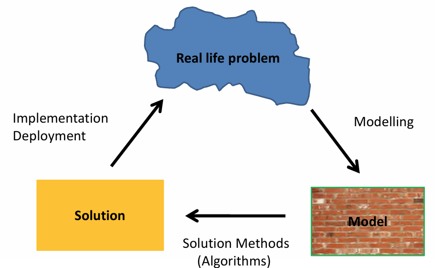

- **Development Cycle**:
    1. Modelling
    2. Solving (using computer)
    3. Implementation and Deployment
    4. Repeat

- **OR/MS** is both science and art:
    * **Science** - mathematical techniques
    * **Art** - success depends largely on the creativity and experience of the OR team

- **Principal Components of an OR model**
    1. decision *alternatives*
    2. *restrictions* for decision making
    3. appropriate objective **criterion* for evaluating the alternative

### Mathematical Programming

- **programming** means *planning*, not *computer programming*
- Seek to *optimise* something subject to some constraints
- **Three parts of an MP model**
    1. decision variables
    2. objective
    3. constraints
- For example:
    * transportation of goods from depots to stores
    * portfolio investment
- Types of MP models:
    * Linear
    * Non-linear
    * Integer

## 1.2 Linear Programming Formulation

### Linear Programming

- Linear programming is a technique for dealing with **constrained optimisation problems**, e.g. allocation of limited resources in an optimal manner
- Three parts ofa n LP model:
    1. seek to optimise some **objective**
    2. by modifying a set of **decision variables**
    3. subject to a set of **constraints**
- All **relationships** of variables are *linear*
    * keep in mind $\max$ and $\min$ aren't actually linear

### Typical LP Applications

- **Manufacturing**
    * decide a product mix to maximise profits
    * subject to production capability
- **Finance**
    * select an investment portfolio from a variety of stock and bond investment alternatives
    * to maximise the return on investment
- **Marketing**
    * how best to allocate a fixed advertising budget among advertising media
    * to maximise advertising effectiveness or to minimise total cost
- **Blending**
    * determine quantities of ingredients to achieve the desired mix of animal food
    * at a minimum cost
- **Logistics**
    * given set of demands, determine which warehouse should ship how much product to which customers
    * to minimise total transportation cost

### Paint Problem

#### Problem Description

- A company makes **two types of paint** in bulk by mixing two raw materials in different proportions.

| | Paint 1 needs | Paint 2 Needs | Resource available |
|:--|-------------|---------------|--------------------|
| Raw Material 1| $1$ | $2$ |$6$|
| Raw Material 2 | $2$ | $1$ | $8$ |
| Price (£1000) | $3$ |$2$ | |

- What product mix will maximise the company's gross revenue?

#### Formulation of LP Model

1. **define appropriate decision variables**
    * let $x_1$ = amount of paint 1, $x_2$ = amount of paint 2
2. **formulate objective function**
    * maximise $3x_1 + 2x_2$ which is the profit in £1000.
3. **formulate constraints**
    * we cannot use more raw materials than available.
    * Raw material 1: $1x_1 + 2x_2 \le 6$
    * Raw material 2: $2x_1 + 1x_2 \le 8$
    * Nonnegativity: $x_1, x_2 \ge 0$
4. **full modelling process**
    * **HEADER** - Let $x_1$ = amount of Paint 1, $x_2$ = amount of Paint 2.
    * **LP MODEL**:
        * $\max z = 3x_1 + 2x_2$
        * $\text{s.t.}$:
            * $x_1 + 2x_2 \le 6$
            * $2x_2 + x_2 \le 8$
            * $x_1, x_2 \ge 0$

## 1.3 Graphical Solution to LP Problems

### Overview

- The **graphical** method can be used to solve **two-variable** linear programs
- Plot the constraints on a coordinate plane to identify the **feasible region**.
- Optimal solution is found by either:
    1. shifting the *objective function line* to optimise the value
    2. or comparing the objective function value of all vertices to choose the maximum and minimum

### Plotting Constraints

- For example, the constraints are given as follows:
    * $x_1 + x_2 \le 20$
    * $2x_1 + x2 \le 30$
    * $x_1 \le 25$
    * $x_1, x_2 \ge 0$
- Follow the following three steps:
    1. plot each constraint line on the graph
    2. identify the feasible region where all constraints are satisfied
    3. highlight the feasible region on the graph
- The **feasible** region contains the optimal solution

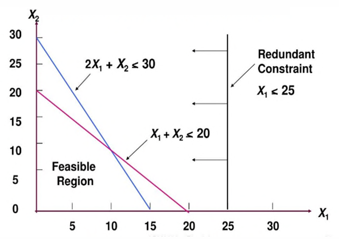

### Method 1

- The objective function to be maximised is given as follows: $$z = 3x_1 + 2x_2 $$
- Follow the following steps:
    1. Plot objective function lines $z = 3x_1 + x_2$ for specific values of $z$
    2. Shift the objective function line to find the optimum $z$
    3. For a $\max$ problem, increase $z$ until you find a $z$ such that increasing further makes the line not intersect the feasible region. For a $\min$ problem, decrease $z$ instead.

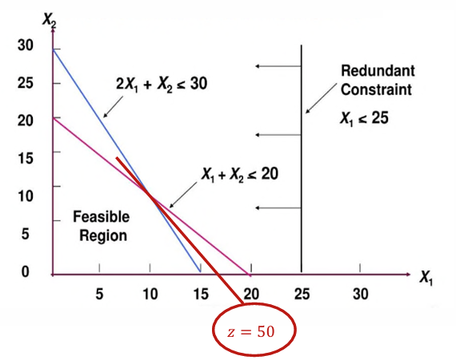

### Method 2

- Evaluate the values of objevtive function
    1. Find the vertices of the feasible region by finding intersection points of constraint lines
    2. Evaluate the objective function at each vertex
    3. Vertex with optimal objective function value is the optimal solution
- For example, we maximise $z = 3x_1 + 2x_2$
    * The vertices are $(0,0), (0,20), (15,0), (10,10)$
    * Corresponding values are $z = 0, 40, 45, 50$
    * Hence the maximum $z$ is $z = 50$

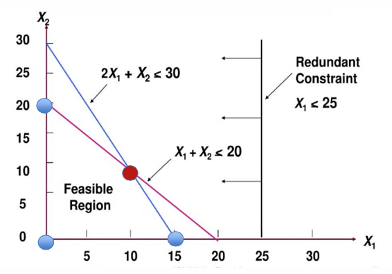

### Special Cases in the Graphical Method

#### Multiple Optimum solutions

- For example: $\max z = x + y$
    * $\text{s.t.}$
        * $2x + y \le 60$
        * $x + y \le 40$
        * $x, y \ge 0$
- All solution points on the **red interval** are optimal with an objective function value of $40$.

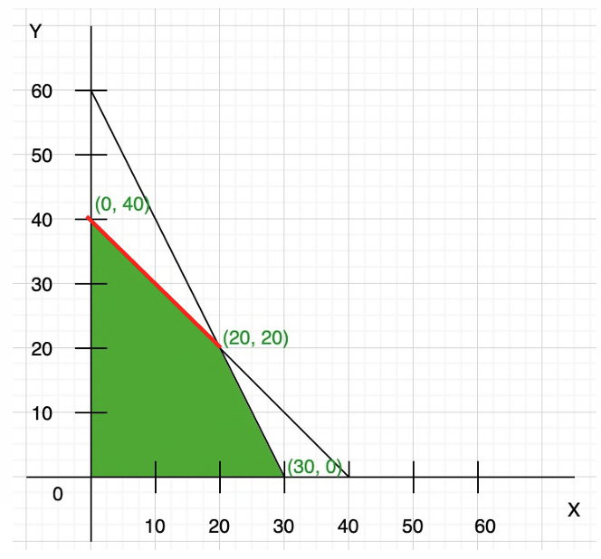

#### Unbounded Solutions

- For example:$ \max z = x + y$
    * $\text{s.t.}$
        * $2x + y \ge 60$
        * $x + y \ge 40$
        * $x, y \ge 0$
- All solution points in the **yellow region** are feasible and their objective function values are unbounded.
- If the **objective function value** is unbounded, the **feasible region** must be unbounded but no the other way round.
- We could have a $\min$ optimiation and an unbounded feasible region but have a bounded optimal value

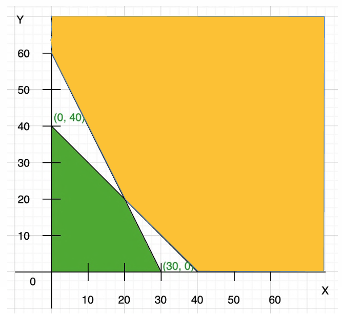

#### Infeasibility

- For example: $\max z = x + y$
    * $\text{s.t.}$
        * $2x + y \le 30$
        * $x + y \ge 40$
        * $x, y \ge 0$
- There is no $(x, y)$ that satisfies all the constraints.

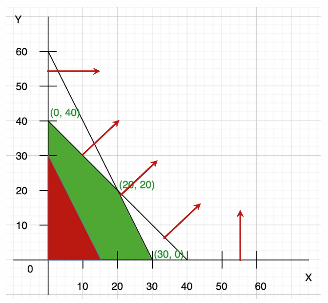

# 2. Duality of Linear Programming

## 2.1 Duality in LP - Part I (Introduction)

### Two Related LP Problems

#### Oil Refinery Problem

- Consider the following problem:
    * An oil refinery produces two products: **jet fuel** and **gasoline**.
    * The profit for the refinery is $0.10$ per barrel of jet fuel and $0.20$ per barrel of gasoline.
    * The jet fuel is delivered to an airfield $10$ miles away, and the gasoline is transported $30$ miles to the distributor.
    * We must meet the following conditions:
        1. Only $10000$ barrels of crude oil are available for processing
        2. Both proucts are shipped in trucks, delivery capacity of truck is $180000$ barrel-miles
    * **Q** - how much of each product should be produced for maximum profit?
#### Oil Refinery LP

- We can formulate the problem as an LP.
- Let $x_1$ = no. of barrels of jet fuel, $x_2$ = no. of barrels of gasoline
- **LP**:
    - $\max z = 0.1x_1 + 0.2x_2$
    - $\text{s.t.}$
        * $x_1 + x_2 \le 10000$
        * $10x_1 + 30x_2 \le 180000$
        * $x_1, x_2 \ge 0$
- By the graphical method, the solution is $x_1^* = 6000, x_2^* = 4000, z^* = 1400$

#### Purchasing Refinery Problem

- Consider the following related problem:
    * A company would like to **purchase all resources** of the oil refinery, i.e. its crude oil and the delivery capacity of its truck fleet
    * The company needs to offer a *price per barrel of crude oil* and *price per barrel-mile of delivery capacity*
    * The price needs to be **high enough** to persuade the oil refinery to sell their resources instead of producing goods/services.
    * **Q** - how does the company set the prices to **minimise** the total cost of purchasing?

#### Purchasing Refinery LP

- Let $p_1$ = price per barrel of crude oil, $p_2$ = price per barrel-mile of truck delivery capacity.
- **Constraints**:
    * Resource selling is better than jet fuel production:
        * $p_1 + 10p_2 \ge 0.1$
    * Resource selling is better than gasoline production:
        * $p_1 + 30p_2 \ge 0.2$
- **Objective**: minimise the total cost $10000p_1 + 180000p_2$
- **LP**:
    - $\min q = 10000p_1 + 180000p_2$
    - $\text{s.t.}$
        * $p_1 + 10p_2 \ge 0.1$
        * $p_1 + 30p_2 \ge 0.2$
        * $p_1, p_2 \ge 0$
- The optimal prices are $(p_1^*, p_2^*) = (0.05, 0.005)$
- Minimum purchasing cost $q^* = 1400$, equal to the maximum profit $z^* = 1400$.

### Duality

#### Duality in Optimisation

- Provides another persepctive for optimisation problems
- Useful in problem solving
- E.g.
    * Let $X = [a,b]$. 
        * Maximum value of $X$ is $b = \argmax\{x : x \in X\}$
    * $Y = [b, \infty)$ is the set of all upper bounds of $X$.
        * Minimum upper bound of $X$ is $b = \argmin\{y : y \in Y\}$.
- **Linearisation**
    * For example, the **absolute value** function is not linear
    * But we can write it as a linear program:
    * $|x| = \max\{x -x\}$
    * $= \min z$, $\text{s.t.}$
        * $z \ge x$
        * $z \ge -x$

#### Duality in Linear Programming

- The two problems presented above have a **primal-dual** relationship.
- There is a **one-to-one** correspondence between *primal* and *dual*:
    * Each primal decision variable maps to a dual constraint
    * Each primal constraint maps to a dual decision variable
    * The coefficients of the constraints are transposed
- There are nuances about the forms of the constraints and the decision variable's signs, given in this table

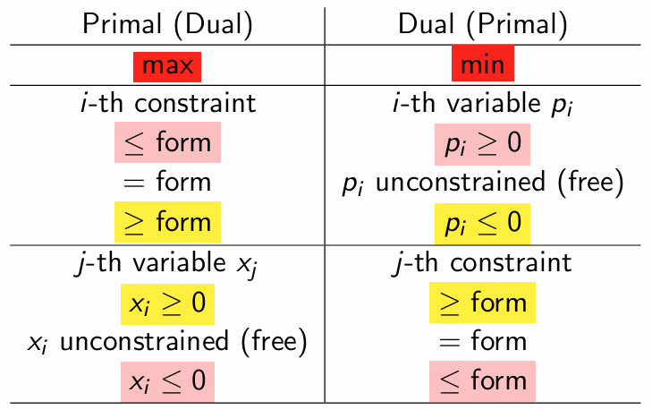

- **TLDR**:
    * $\max \to \min$
    * Maximisation constraint: flip the signs
        * $\le$ form $\to$ $\ge$ form
        * $=$ form $\to$ free
        * $\ge$ form $\to$ $\le$ form
    * Minimisation constraint: keep the sign
        * $\ge$ form $\to \ge$ form
        * $=$ form $\to$ free
        * $\le$ form $\to \le$ form
    * Maximisation variable follows same rule as minimisation constraint
    * Minimisation variable follows same rule as maximisation constraint

- **Transposing**:
    * Coefficients of **objective function** become **constraint RHS** values, and vice versa
    * Read coefficients in constraints **column by column** to create dual

#### Duality in Matrix Form

- The duality relationship can be simply expressed in matrix notation:
- If the primal is:

| Primal | Dual |
|:-------|------|
| $$\max \textbf{c}^T\textbf{x} \\ \text{s.t.} \\ \hspace{1.5em}\textbf{Ax}\le\textbf{b} \\ \hspace{1.5em}\textbf{x} \ge \textbf{0} \\ $$ | $$\min \textbf{b}^T\textbf{p} \\ \text{s.t.} \\ \hspace{1.5em}\textbf{p} \ge \textbf{0} \\ \hspace{1.5em} \textbf{A}^T\textbf{p} \ge \textbf{c}$$ |

- Note the use of *transpose* to multiply a row and column matrix to produce a constant.
- If $x_i$ is a free variable, we can set $x_i = x_i' - x_i''$ where both $x_i', x_i'' \ge 0$.

#### Example

- For example, these two LP problems form a primal-dual pair:

| Primal | Dual |
|:-------|------|
| $$ \max 0.1x_1 + 0.2x_2 \\ \text{s.t.} \\ \hspace{1.5em} x_1 + x_2 \le 10 \\ \hspace{1.5em}x_1 \ge 1 \\ \hspace{1.5em}x_2 \ge 2 \\ \hspace{1.5em}x_1 + 3x_2 \le 18 \\ \hspace{1.5em}x_1 \space \text{free} \\ \hspace{1.5em}x_2 \space \text{free} $$ | $$ \min 10p_1 + p_2 + 2p_3 + 18p_4 \\ \text{s.t.} \\ \hspace{1.5em}p_1 \ge 0 \\ \hspace{1.5em}p_2 \le 0 \\ \hspace{1.5em}p_3 \le 0 \\ \hspace{1.5em}p_4 \ge 0 \\ \hspace{1.5em}p_1 + p_2 + p_4 = 0.1 \\ \hspace{1.5em}p_1 + p_3 + p_4 = 0.2 $$ |

#### Example - Matrix Form

- We can also express the same primal LP in matrix form:

| Matrix Form | Constants |
|:------------|-----------|
| $$ \max \textbf{c}^T\textbf{x} \\ \text{s.t.} \textbf{Ax} \le \textbf{b} \\ \hspace{1.5em} \textbf{x} \ge \textbf{0}$$ | $$ \textbf{c} = \begin{pmatrix}0.1&0.2\end{pmatrix}^T \\ \textbf{b} = \begin{pmatrix}10 & -1 & -2 & 18\end{pmatrix}^T \\ \textbf{A} \in \mathbb{R}^{m \times n}, \textbf{A} = \begin{pmatrix}1 & 1 \\ -1 & 0 \\ 0 & -1 \\ 1 & 3\end{pmatrix}$$ |

- Notice the use of multiplying by $-1$ to make all inequalities in the $\le$ form, also in the objective function

- We can easily write down the dual LP in matrix form:

| Matrix Form | Constraint Inequality |
|:-------------|-----------------------|
| $$ \min \textbf{b}^T\textbf{p} \\ \text{s.t.} \space \textbf{p} \ge \textbf{0} \\ \hspace{1.5em} \textbf{A}^T \textbf{p} \ge \textbf{c}$$ | $$ \begin{pmatrix}1 & -1 & 0 & 1 \\ 1 & 0 & -1 & 3\end{pmatrix}\begin{pmatrix}p_1 \\ p_2 \\ p_3 \\ p_4\end{pmatrix} \ge \begin{pmatrix}0.1 \\ 0.2\end{pmatrix}$$ |

## 2.2 Duality in LP - Part II (Formulation)

### Number of Decision Variables and Constraints
- When given an LP problem, we associate each type of decision variable with a type of constraint, and vice versa.
- If in the primal we have:
    * $n$ decision variables $\implies$ $n$ constraints in the dual
    * $m$ constraints $\implies$ $m$ decision variables in the dual
- Sometimes the problem gives decision variables in separate forms, e.g. a vector $\textbf{x}$ and a singular variable $\textbf{v}$.
    * Each variable maps to its own set of constraints.
    * The **vector** variable maps to a **vector** of constraints
    * The **singular** variable maps to a **single** constraint

### Example - Zero Sum Game

| Primal | Variables, Constraints |
|:-------|------------------------|
| $$ \min v \\ \textbf{s.t.} \\ \hspace{1.5em} \sum_{j=1}^n{a_{ij}x_j} \le v, \forall i = 1, \cdots, m, \\ \hspace{1.5em} \sum_{j=1}^n x_j = 1, \\ \hspace{1.5em}x_j \ge 0, \forall j = 1, \cdots, n, \\ \hspace{1.5em}v \space \text{free}$$ | $n+1$ variables ($\textbf{x}, v$)   $m+1$ constraints |

- **Dual Decision Variables**
    * For the first $m$ constraints, we make a vector $\textbf{p}$ of $m$ decision variables.
    * For the last constraint, we make a singular variable $q$.
    * First $m$ constraints are in $\le$ form, so we have $\textbf{p} \ge 0$.
    * Last constraint is in $=$ form, so $q$ is free.
- **Dual Objective**
    * *All decision variables need to be on the LHS of the constraint*, so we get $$\sum_{j=1}^n a_{ij}x_j - v \le 0$$.
    * Reading the **Constraint RHS** values by column, we get $m$ $0$'s and one $1$.
    * Hence the dual objective is $\textbf{0}^T + 1\cdot q = q$.
    * The primal is a $\min$ problem so the dual is a $\max$ problem.
- **Dual Constraints**
    * There should be $n$ constraints for the $\textbf{x}$ decision variable
    * And one constraint for the $v$ variable.
    * **Dual constraints for $\textbf{x}$**:
        * Reading the **Constraint Matrix** by column, we get $a_{ij}$ for the first $m$ entries, and a $1$ corresponding to the last primal constraint
        * Hence the constraint is $$\sum_{i=1}^m a_{ij}p_i + 1 \cdot q \le 0$$
    * **Dual constraints for $\textbf{v}$**:
        * For the column corresponding to $v$, the first $m$ entries are a $-1$, and the last entry is $0$ corresponding to $v$ not appearing in the last primal constraint.
        * Hence the constraint is $$\sum_{i=1}^m(-1)p_i = 1$$

- Putting it all together, the dual is:

| Primal | Dual |
|:-------|------------------------|
| $$\min v \\ \textbf{s.t.} \\ \hspace{1.5em} \sum_{j=1}^n{a_{ij}x_j} \le v, \forall i = 1, \cdots, m, \\ \hspace{1.5em} \sum_{j=1}^n x_j = 1, \\ \hspace{1.5em}x_j \ge 0, \forall j = 1, \cdots, n, \\ \hspace{1.5em}v \space \text{free}$$ | $$\max q \\ \textbf{s.t.} \\ \hspace{1.5em} p_i \le 0, \forall i, \\ \hspace{1.5em}q \space \text{free}, \\ \hspace{1.5em} \sum_{i=1}^m a_{ij}p_i + q \le 0, \forall j, \\ \hspace{1.5em} \sum_{i=1}^m (-1)p_i = 1$$|

- We can tidy up the dual a bit more to produce:

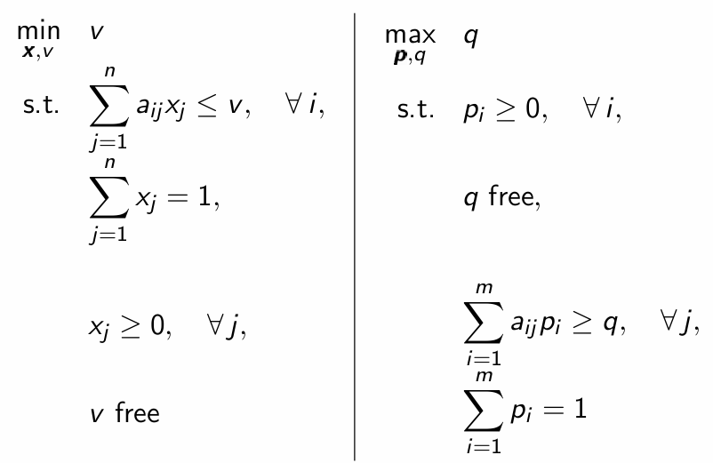

## 2.3 Duality in LP - Part III (Duality Theorems)

### Weak Duality

- Given the matrix forms of the primal-dual pair:

| Primal | Dual |
|:-------|------|
|$$ \max \textbf{c}^T\textbf{x} \\ \text{s.t.} \\ \hspace{1.5em}\textbf{Ax}\le\textbf{b} \\ \hspace{1.5em}\textbf{x} \ge \textbf{0} \\ $$ | $$\min \textbf{b}^T\textbf{p} \\ \text{s.t.} \\ \hspace{1.5em}\textbf{p} \ge \textbf{0} \\ \hspace{1.5em} \textbf{A}^T\textbf{p} \ge \textbf{c}$$ |

- The **Weak Duality** theorem states:
    * Given a primal and dual feasible solution pair ($\textbf{x}, \textbf{p}$), then
        $$ \textbf{c}^T\textbf{x} \le \textbf{b}^T\textbf{p}$$
    * i.e. the primal objective function is not more than the dual objective function

### Strong Duality

- Exactly one of the following holds for the primal dual problem pair ($P$, $D$):
    1. Both problems are feasible and optimal solutions $\textbf{x}^*, \textbf{p}^*$ are achievable with $Z_P =Z_D$.
    2. One problem is unbounded and the other is infeasible
    3. Both problems are infeasible

#### Unboundedness
- ***Def***. Unboundedness is where there exists a *sequence of feasible solutions* whose objective values go to infinity ($+\infty$ for $\max$, $-\infty$ for $\min$)
- *does not mean unboundedness of the feasible set*

#### Infeasibility
- ***Def***. Infeasibility is when the feasible set is *empty*
- Infeasible objective values are:
    * $+\infty$ for minimisation
    * $-\infty$ for maximisation

#### Formalisation
- Using these definitions, we can formalise case 2 and 3
- Case $2$:
    * $Z_P \to +\infty$ and $Z_D = +\infty$
    * $Z_P = -\infty$ and $Z_D \to -\infty$
- Case $3$:
    * $Z_P = -\infty$ and $Z_D = +\infty$
- **NOTE** - Primal is always maximisation here

#### Example

- Take this primal-dual pair:

| Primal | Dual |
|:-------|------|
| $$ max 10p_1 + 18p_2 \\ \text{s.t.} \\ \hspace{1.5em} p_1 + p_2 \ge 0.1, \\ hspace{1.5em} p_1 + 3p_2 \ge 0.2 \\ \hspace{1.5em} p_1, p_2 \ge 0$$ | $$ \min 0.1x_1 + 0.2x_2 \\ \text{s.t.} \\ \hspace{1.5em} x_1, x_2 \le 0 \\ hspace{1.5em} x_1 + x_2 \ge 10, \\ \hspace{1.5em} x_1 + 3x_2 \ge 18$$ |

- The primal is unbounded, as shown by this graph:

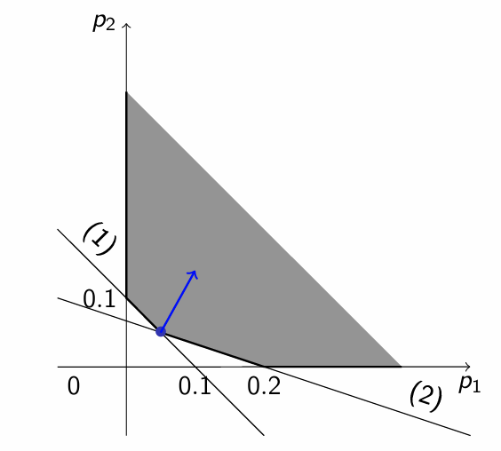

- The dual is infeasible, as $x_1, x_2 \le 0$ but we need $x_1 + x_2 \ge 10$. This is impossible as $x_1 + x_2$ will always be non-positive.
- This is an example of **Case 2** in the **Strong Duality Theorem**.

### Complementary Slackness Theorem

- Consider a primal-dual feasible solution pair $(\textbf{x}, \textbf{p}$) of $(P)$ and $(D)$.
- $(\textbf{x}, \textbf{p})$ is an optimal solution pair **if and only if** the following complementary slackness conditions hold:

    $$ u_i \cdot p_i = 0, i = 1, ..., m \\ x_j \cdot v_j = 0, j = 1, ..., n$$

- where $u_i = b_i = \sum_{j=1}^n a_{ij}x_j$ and $v_j = \sum_{i=1}^m p_i a_{ij} - c_j$ are primal and slack dual variables respectively.
- The CS Theorem applies even when the primal / dual constraints are in the form of equalities

#### Consequences

- The **CS** theorem states that:
    * either $u_i$ or $p_i = 0, \forall i$
    * either $x_j$ or $v_j = 0, \forall i$
- The *slack variables* can be thought of as the **difference** between maximal resources and actually used resources.
- When *slack is 0*, all the resources are used up.
- **Implications**
    * If slack of one variable is *non-zero*, the other must be zero.
    * i.e. if resources are not used up in the *primal*, the resources must be used up in the *dual*
    * We can eliminate variables to make it solvable by hand.

#### Example

- Take this primal-dual pair:

| Primal | Dual |
|:-------|------|
| $$\max 0.1x_1 + 0.2x_2 \\ \text{s.t.} \\ \hspace{1.5em} x_1 + x_2 \le 10 \\ \hspace{1.5em} x_1 \ge 1 \\ \hspace{1.5em} x_2 \ge 2 \\ \hspace{1.5em} x_1 + 3x_2 \le 18 \\ \hspace{1.5em} x_1, x_2 \space \text{free}$$ | $$\min 10p_1 + p_2 + 2p_3 + 18p_4 \\ \text{s.t.} \\ \hspace{1.5em} p_1 \ge 0 \\ \hspace{1.5em} p_2 \le 0 \\ \hspace{1.5em} p_3 \le 0 \\ \hspace{1.5em} p_4 \ge 0 \\ \hspace{1.5em} p_1 + p_2 + p_4 = 0.1 \\ \hspace{1.5em} p_1 + p_3 + 3p_4 = 0.2$$|

- Primal optimal solution: $(x_1^*, x_2^*) = (6,4)$ and $Z_P = 1.4$ by the graphical method.
- This falls under **Case 1** of the *Strong Duality Theorem*
    * dual problem is feasible and $Z_D = Z_P = 1.4$

- We can now use the **CS Conditions**:
    * $(x_1^* + x_2^* - 10) \cdot p_1^* = 0$
        * because $6 + 4 - 10 = 0$
    * $(x_1^* - 1) \cdot p_2^* = 0 \iff p_2^* = 0$
        * because $6 - 1 = 5 \ne 0$
    * $(x_2^* - 2) \cdot p_3^* = 0 \iff p_3^* = 0$
        * because $4 - 1 = 3 \ne 0$
    * ($x_1^* + 3x_2^* - 18) \cdot p_4^* = 0$
        * because $6 + 12 - 18 = 0$
- Hence, we have the remaining dual conditions:

     $$\begin{cases} p_1^* + p_4^* = 0.1 \\ p_1^* + 3p_4^* = 0.2\end{cases}$$

- Solving the system of equations: $(p_1^*, p_4^*) = (0.05, 0.05)$
- Hence the optimal dual solution is $$\textbf{p}^* = \begin{pmatrix}0.05 & 0 & 0 & 0.05\end{pmatrix}^T$$

## 2.4 Transportation Problem - Part I (Intro, BFS)

### Overview

#### General Description of the TP

1. A set of $m$ **supply points** from which a good/service is shipped. Supply point $i$ can supply at most $s_i$ units.
2. A set of $n$ **demand points** to which the good is shipped. Demand point $j$ must receive at least $d_j$ units of the shipped good.
3. Shipment of each unit at supply point $i$ to demand point $j$ incurs a **cost** of $c_{ij}$.

- The transportation problm is to find a **minimum-cost way** of shipping goods/services from the supply points to the demand points to **satisfy all the demands**.

- The **TP** can be represented as a **complete bipartite graph** $K_{mn}$, where edges go from *supply points* to *demand points*, and the weight of each edge is $c_{ij}$.

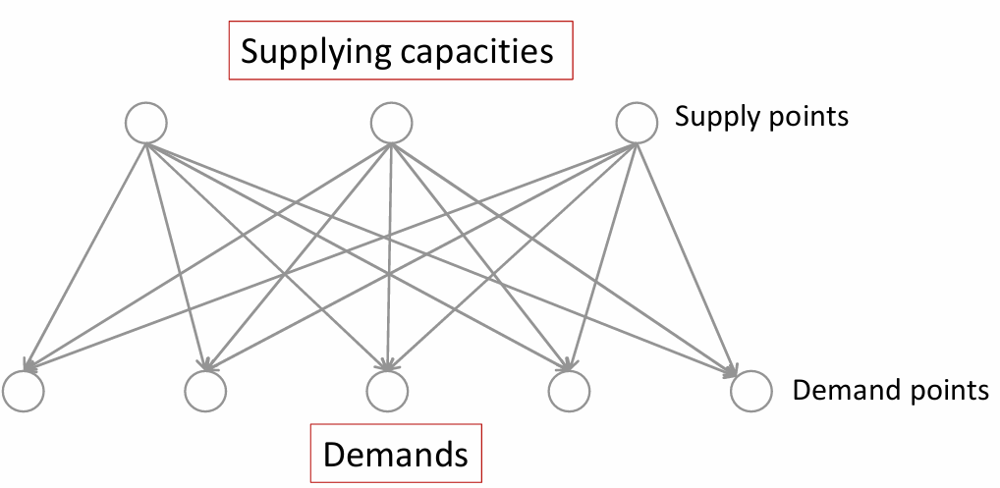

#### LP Formulation

- Let $X_{ij}$ be the number of units shipped from supply point $i$ to demand point $j$.
- The TP is formulated as so:

| LP Formulation |
|:---------------|
| $$ \min \sum_{i=1}^{i=m} \sum_{j=1}^{j=n} c_{ij} X_{ij} \\ \text{s.t.} \\ \hspace{1.5em} \sum_{j=1}^{j=n} X_{ij} \le s_{i} \hspace{2em} (i = 1,2,...,m) \\ \hspace{1.5em} \sum_{i=1}^{i=m} X_{ij} \ge d_j \hspace{2em} (j=1,2,...,n) \\ \hspace{1.5em} X_{ij} \ge 0, \forall i, j$$ |

- There are $m$ ineqaulities corresponding to **capacity constraints**.
- There are $n$ inequalities corresponding to **demand constraints**.
- There are $mn$ decision variables.

#### Balanced TP

- ***Def***. If *total supply equals total demand*, the problem is said to be a **balanced** transportation problem.

    $$s = \sum_{i=1}^m s_i = \sum_{j=1}^n d_j = d$$

- **NOTE** - in a balanced TP, all constraints must be **binding** (i.e. they must be equalities)
    * Suppose for a contradiction that we have at least one non-binding inequality.
    * If $X_{ij} < s_i$, then to balance $s = d$, we must have some other $X_{ij} > s_{i}$, hence breaking the constraints.
    * Similarly for the demand side.
    * Hence we **must** have equalities only.
- It is simple to find a basic feasible solution for a **balanced TP**

#### Balancing a TP if $s < d$

- If a TP has $s < d$, it has **no feasible solution** as one or more of the demands will be left unmet. 
- Realistically, a **penalty cost** is associated with unmet demand. 
- We can add a **dummy supply point** with the capacity of $d - s$, converting the problem into a balanced TP of **minimising the total of the transportation and penalty costs**
- If *all the penalty costs* are $+\infty$, the problem reduces to the **original infeasibility**

##### Example

- Suppose we have this TP:

| | City 1 | City 2 | City 3 | Supply|
|:--|------|--------|--------|-------|
| Reservoir 1 | £7 | £8 | £10 | 50 |
| Reservoir 2 | £9 | £7 | £8 | 50 |
| Demand | 40 | 40 | 40 | (million litres) |

- For each million litres of **unmet demand per day**, there is a penalty of £20 for city 1, £22 for city 2, £23 for city 3.
- **SOLUTION** - add a dummy supply point with $120 - 100 = 20$ million litres.
- The **objective function** is now minimising the new (balanced TP)'s transportation costs. 
    * we treat the *penalty* as a transportation cost from now on.
    * transportation cost from dummy to city $i$ corresponds to the penalty of city $i$.

- **Balanced TP Solution**:

| | City 1 | City 2 | City 3 | Supply|
|:--|------|--------|--------|-------|
| Reservoir 1 | £7 | £8 | £10 | 50 |
| Reservoir 2 | £9 | £7 | £8 | 50 |
| Dummy | £20 | £22 | £23 | 20 |
| Demand | 40 | 40 | 40 | (million litres) |

#### Balancing a TP if $s > d$

- Similarly, if $s > d$, then we can balance the problem by **adding a dummy demand point**.
- Since shipments to the dummy demand point are not real, they are assigned a cost of **zero**
    * i.e. the goods stay at the supply point $\implies$ cost is 0.

##### Example

- For example, take this TP:

|  | City 1 | City 2 | City3 | Supply |
|:--|---|---|---|---|
|Reservoir 1 | £7 | £8 | £10| 50 |
|Reservoir 2 | £9 | £7 | £8 | 80 |
| Demand | 40 | 40 | 40 | (million litres) |

- We can insert a dummy demand point "City 4" to get a **balanced TP**:

|  | City 1 | City 2 | City3 | "City 4" | Supply |
|:--|---|---|---|---|---|
|Reservoir 1 | £7 | £8 | £10| £0 | 50 |
|Reservoir 2 | £9 | £7 | £8 | £0 | 80 |
| Demand | 40 | 40 | 40 | 10 | (million litres) |

### Basic Feasible Solution

- There are two simple methods for finding a **BFS** for a *balanced TP:
    * Northwest-Corner Method (NWC)
    * Minimum-Cost Method (MCM)
- These two approaches give a **feasible** solution but is often not **optimal**
- The **simplex** optimisation method is required to transform a **BFS** into the *optimal solution*

#### Northwest-Corner Method (NWC)

- Begin in the upper left (northwest) corner of the table and set $x_{11}$ to be as large as possible
    * This value is equal to the **minimum** of the capacities of the column and row.
- Cross off one of the columns and move to the next available square, heading for the **bottom-right** corner
- If both column and row **can be crossed off**, only **cross off one**.

##### Example

- We start off with the following TP table:

| Supply \ Demand | 3 | 5 | 2 | 3 |
|:----------------|---|---|---|---|
| 5 | | | | |
| 5 | | | | |
| 3 | | | | |

- We cross off the first column

| Supply \ Demand | X | 5 | 2 | 3 |
|:----------------|---|---|---|---|
| 2 |3 | | | |
| 5 |- | | | |
| 3 |- | | | |

- We cross off the first row

| Supply \ Demand | X | 3 | 2 | 3 |
|:----------------|---|---|---|---|
| X |3 |2|-|-|
| 5 |- | | | |
| 3 |- | | | |

- We cross off the second column

| Supply \ Demand | X | X | 2 | 3 |
|:----------------|---|---|---|---|
| X |3 |2|-|-|
| 2 |- |3| | |
| 3 |- |-| | |

- We cross off the third column (note we only cross off either col/row)

| Supply \ Demand | X | X | X | 3 |
|:----------------|---|---|---|---|
| X |3 |2|-|-|
| 0 |- |3|2| |
| 3 |- |-|-| |

- We cross off the second row

| Supply \ Demand | X | X | X | 3 |
|:----------------|---|---|---|---|
| X |3 |2|-|-|
| X |- |3|2|0|
| 3 |- |-|-| |

- We are done

| Supply \ Demand | X | X | X | X |
|:----------------|---|---|---|---|
| X |3 |2|-|-|
| X |- |3|2|0|
| X |- |-|-|3|

#### Minimum-Cost Method

##### Overview

- The **NWC** method *does not utilise shipping costs*.
- It can yield an initial BFS easily, but the **total shipping cost may be very high**
- The **minimum-cost** method uses shipping costs to find a BFS with a *low cost*
- **NOTE**:
    * This procedure is only for *minimisation* problems
    * If the TP is a maximisation problem, multiply all objective coefficients $c_{ij}$ by $(-1)$ to obtain an equivalent minimisation problem
    * **MC** method does not guarantee optimality of the obtained **BFS**, it is just generally better than the **NWC** method

##### Methodology

1. Find decision variable with **smallest shipping cost** ($X_{ij}$). Then assign $X_{ij}$ its largest possible value, which is $\min(s_i, d_j)$.
2. As in the **NWC** method, cross out row $i$ or column $j$ (but not **both**) and reduce the supply or demand of the uncrossed-out row/col by the value of $X_{ij}$.
3. Choose the cell with the minimum cost of shipping from the remaining un-crossed out space, and repeat the procedure.

##### Example

- Suppose the **shipping cost tableau** is the following:

| Supply \ Demand | 12 | 8 | 4 | 6 |
|:----------------|----|---|---|---|
| 5 | 2 | 3 | 5 | 6 |
|10 | 2 | 1 | 3 | 5 |
|15 | 3 | 8 | 4 | 6 |

- We start by filling out the cell with shipping cost of $1$

| Supply \ Demand | 12 | X | 4 | 6 |
|:----------------|----|---|---|---|
| 5 | |-| | |
| 2 | |8| | |
| 15| |-| | |

- Then we fill out a cell with shipping cost of $2$

| Supply \ Demand | 10 | X | 4 | 6 |
|:----------------|----|---|---|---|
| 5 | |-| | |
| X |2|8|-|-|
| 15| |-| | |

- Then we fill out a cell with shipping cost of $2$

| Supply \ Demand | 5 | X | 4 | 6 |
|:----------------|----|---|---|---|
| X |5|-|-|-|
| X |2|8|-|-|
| 15| |-| | |

- Then we fill out a cell with shipping cost of $3$

| Supply \ Demand | X | X | 4 | 6 |
|:----------------|----|---|---|---|
| X |5|-|-|-|
| X |2|8|-|-|
| 10|5|-| | |

- Then we fill out a cell with shipping cost of $4$

| Supply \ Demand | X | X | X | 6 |
|:----------------|----|---|---|---|
| X |5|-|-|-|
| X |2|8|-|-|
| 6 |5|-|4| |
 
- Lastly, we fill out a cell with shipping cost of $6$. We are done.

| Supply \ Demand | X | X | X | X |
|:----------------|----|---|---|---|
| X |5|-|-|-|
| X |2|8|-|-|
| X |5|-|4|6|

- **NOTE** - with the **NWC** and **MC** methods, we always fill out $n + m - 1$ cells where $n$ is the number of rows and $m$ is the number of columns.

## 2.5 Transportation Problem - Part II (Simplex Method)

### Dual of the TP

- Recall the **balanced** transportation problem LP:

| Primal  |
|:---------------|
| $$ \min \sum_{i=1}^{i=m} \sum_{j=1}^{j=n} c_{ij} X_{ij} \\ \text{s.t.} \\ \hspace{1.5em} \sum_{j=1}^{j=n} X_{ij} = s_{i} \hspace{2em} (i = 1,2,...,m) \\ \hspace{1.5em} \sum_{i=1}^{i=m} X_{ij} = d_j \hspace{2em} (j=1,2,...,n) \\ \hspace{1.5em} X_{ij} \ge 0, \forall i, j$$ |

- We use the same process outlined before to find the dual.
    * Primal has $m+n$ constraints $\implies$ dual has $m+n$ variables
    * Primal has $mn$ variables $\implies$ dual has $mn$ constraints
- **Dual Variables**
    * Let $u_i$, $v_j$ be the dual variables.
    * Since the $m+n$ constraints are all **equalities**, all the dual variables are **sign free**.
- **Dual Objective**:
    * The **Constraint RHS** values of the primal are $m$ lots of $s_i$ and $n$ lots of $d_j$.
    * Hence we can see that $$\sum_{i=1}^m s_i u_i + \sum_{j=1}^n d_j v_j$$ is the objective function
    * The dual is a $\max$ problem as the primal is a $\min$ problem.
- **Dual Constraints**
    * It is obvious that the **constraint RHS** values are $c_{ij}$ as that is the coefficients of the *primal objective function*
    * Reading down the columns of the **constraint matrix**:
        * for any $i, j$ pair:
        * we notice that out of all the $m$ rows of the first set of constraints, $x_{ij}$ only shows up once, at the $i$th row.
        * we notice that out of all the $n$ rows of the second set of constraints, $x_{ij}$ only shows up once, at the $j$th row.
        * The sign of the primal variables is $\ge$, so the sign of the dual constraint is $\le$.
        * Hence the dual constraint is $u_i + v_j \le c_{ij}$.

- Putting it altogether, the dual is:

| Dual |
|:-----|
| $$ \max \sum_{i=1}^m s_i u_i + \sum_{j=1}^n d_j v_j \\ \text{s.t.} \\ \hspace{1.5em} u_i + v_j \le c_{ij} \hspace{2em} i \in \{1, ..., m\}, j \in \{1, ..., n\} \\ \hspace{1.5em} u_i, v_j \space \text{are sign free}$$ |

### Optimality

- The primal **BFS** $\textbf{x}$ is optimal **if and only if** there exists a feasible solution $(\textbf{u}, \textbf{v})$ to the dual that satisfies the **complementary slackness conditions**:

    $$ x_{ij}(u_i + v_j - c_{ij}) = 0$$ for all $i, j$.

- For any $x_{ij} = 0$, the condition is already satisfied.
- For $x_{ij} > 0$, the condition implies that $u_i + v_j - c_{ij} = 0$.
- **Implication**:
    * All $u_i$ and $v_j$ are relative.
    * If the same constant is added to $u_i$ and subtracted from all $v_j$, the difference $u_i + v_j - c_{ij}$ does not change
    * **NOTE** - $c_{ij}$ is a constant
- **NB**
    * a **basic** variable is a *non-zero* variable
    * Hence a **non-basic** variable is a variable that is $0$.

### TP Simplex Method

1. Balance the problem
2. Use the **NWC** or **MC** method to find an *initial basic feasible solution* (BFS)
3. Find the values of all dual variables $u_1, u_2, ..., u_m, v_1, ..., v_n$ using formulae:

    $$u_1 = 0, \hspace{1em} u_i + v_j = c_{ij}$$

    for all $m + n - 1$ pairs $(i,j$) corresponding to basic variables $x_{ij}$.

4. Calculate the slack $d_{ij} = u_i + v_j - c{ij}$ for all non-zero variables $x_{ij}$. If all $d_{ij} \le 0$, then the current BFS is optimal. Otherwise, proceed to the next step.

5. The variable $x_{ij}$ with the greatest $d_{ij}$ will enter the basis. Find and analyse a loop to determine which basic variable will leave the basis. Return to step 3.

- **NB** for maximisation problem, the $\le$ in step 4 is replaced by $\ge$ and "greatest" in step 5 is replaced by "least".

### Step 5 - Changing the Basis

1. Find a **loop** consisting of the new entering variable and **some** (**not** necessarily all) basic variables
2. Label the entering variable as odd. Go around the loop and label all the variables alternately as ood or even.
3. Find the even variable with the **smallest value** among all even variables. Denote this value by $\alpha$. This variable will leave the basis.
4. Reduce the value of each even variable by $\alpha$. Increase the value of each odd variable by $\alpha$.

- **NB** - if the solution is feasible and all CS conditions are satisfied, then the solution is optimal. $\implies$ we can stop.

#### Loops

- ***Def***. A *loop* is an **ordered sequence** of **at least four different cells** such that:
    1. Any two conseuctive cells lie in either the same row / column
    2. Any three consecutive cells do not lie in the same row or column
        * to simplify the method*
    3. The **last** cell in the sequene has a row or column in common with the **first** cell in the sequence
        * *to make a closed loop*

- Examples:

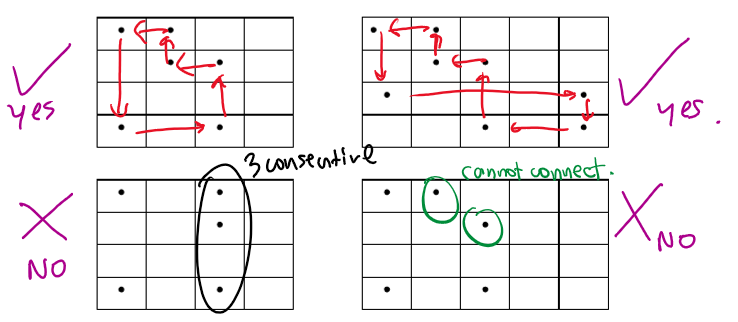

* 1. It is a loop
* 2. It is a loop
* 3. It is not a loop, as there are three cells in the same column
* 4. It is not a loop, as we cannot connect the start and end.

### Fully Worked Example

#### Problem Statement

- Consider the following transportation problem of sending tonnes of sugar fromp lant $i$ to city $j$ to minimise transportation cost:

| LP Formulation |
|:---------------|
| $$ \min z = 10x_{11} + 12x_{12} + 14x_{13} + 14x_{14} + \\ \hspace{4em} 12x_{21} + 9x_{22} + 11x_{23} + 14x_{24} + \\ \hspace{4em} 17x_{31} + 10x_{32} + 7x_{33} + 9x_{34} \\ \text{s.t.} \\ \hspace{1.5em} \text{(supply constraints)} \\ \hspace{1.5em} x_{11} + x_{12} + x_{13} + x_{14} \le 30 \\ \hspace{1.5em} x_{21} + x_{22} + x_{23} + x_{24} \le 40 \\ \hspace{1.5em} x_{31} + x_{32} + x_{33 } + x_{34} \le 60 \\ \hspace{1.5em} \text{(demand constraints)} \\ \hspace{1.5em} x_{11 } + x_{21} + x_{31} \ge 15 \\ \hspace{1.5em} x_{12} + x_{22} + x_{32} \ge 25 \\ \hspace{1.5em} x_{13} + x_{23} + x_{33} \ge 40 \\ \hspace{1.5em} x_{14} + x_{24} + x_{34} \ge 50 \\ \hspace{1.5em} \text{(non-negativity)} \\ \hspace{1.5em} x_{ij} \ge 0, \forall i, \forall j $$|

#### Basic Feasible Solution

- The TP can be formulated as a table:

| Supply \ Demand | 15 | 25 | 40 | 50 |
|:----------------|----|----|----|----|
| 30 | 10 | 12 | 14 | 14 |
| 40 | 12 | 9 | 11 | 14 |
| 60 | 17 | 10 | 7 | 9 |

- The total supply is $130$ and the total demand is $130$
    * $\implies$ no balancing is needed.

- Hence, we can directly find the **BFS** using the **NWC** method:

| Supply \ Demand | 15 | 25 | 40 | 50 |
|-----------------|----|----|----|----|
| 30 | 15 | 15 | - | - |
| 40 | - | 10 | 30 | - |
| 60 | - | - | 10 | 50 |

- Next, find $u_1, u_2, ..., u_m, v_1, ..., v_m$ using the formulae:
    * $u_1 = 0$, $u_i + v_j = c_{ij}$ for all basic variables $x_{ij}$.
    * The $u_1 = 0$ choice is an **arbitrary choice** as the values of $u_i$ and $v_j$ are not uniquely determined. We need to set it to solve everything.

$$u_1 = 0 \\ \begin{cases} u_1 + v_1 = c_{11} \implies 0 + v_1 = 10 \implies v_1 = 10 \\ u_1 + v_2 = c_{12} \implies 0 + v_2 = 12 \implies v_2 = 12 \\ u_2 + v_2 = c_{22} \implies u_2 + 12 = 9 \implies u_2 = -3 \\ u_2 + v_{3} = c_{23} \implies -3 + v_3 = 11 \implies v_3 = 14 \\ u_3 + v_3 = c_{33} \implies u_3 + 14 = 7 \implies u_3 = -7 \\ u_3 + v_4 = c_{34} \implies -7 + v_4 = 9 \implies v_4 = 16 \end{cases}$$

- Next we calculate the **slacks** $d_{ij} = u_i + v_j - c_{ij}$ for all non-basic variables $x_{ij}$.

$$\begin{cases}d_{13} = u_1 + v_3 - c_{13} = 0 + 14 - 14 = 0 \\ d_{14} = u_1 + v_4 - c_{14} = 0 + 16 - 14 = 2 \\ d_{21} = u_2 + v_1 - c_{21} = -3 + 10 - 12 = -5 \\ d_{24} = u_2 + v_4 - c_{24}  = -3 + 16 -14 = -1 \\ d_{31} = u_3 + v_1 - c_{31} = -7 + 10 - 17 = -14 \\ d_{32} = u_3 + v_2 - c_{32} = -7 + 12 - 10 = -5 \end{cases}$$

- **Recall** - If all $d_{ij} \le 0$, then $(\textbf{u}, \textbf{v})$ is a feasible solution to the dual problem and hence the current BFS is optimal.
    * we have that $d_{14} > 0$, so the current BFS is not optimal
- If not, enter the $x_{ij}$ with the largest $d_{ij}$ into the basis.
    * $d_{14}$ is the largest slack so we enter $x_{14}$ into the basis.

#### Changing the Basis

- Recall that this is our $x_{ij}$ matrix:

| Supply \ Demand | 15 | 25 | 40 | 50 |
|-----------------|----|----|----|----|
| 30 | 15 | 15 | - | - |
| 40 | - | 10 | 30 | - |
| 60 | - | - | 10 | 50 |

- We can identify a loop as follows:
    * $x_{14} \to x_{12} \to x_{22} \to x_{23} \to x_{33} \to x_{34}$
    * **Odd variables**: $x_{14}, x_{33}, x_{22}$
    * **Even variables: $x_{34}, x_{23}, x_{12}$

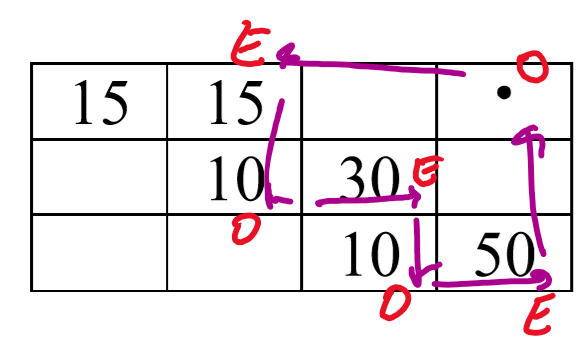

- The smallest value among all even variables is $\alpha = 15$. Hence the even variable to leave the current basis is $x_{12}$.

- Now we perform the additions/subtractions:

| Supply \ Demand | 15 | 25 | 40 | 50 |
|-----------------|----|----|----|----|
| 30 | $15$ | $15 - 15 = 0$ | - | $0 + 15 = 15$ |
| 40 | - | $10 + 15 = 25$ | $30 - 15 = 15$ | - |
| 60 | - | - | $10 + 15 = 25$ | $50 - 15 = 35$ |

- which yields this solution:

| Supply \ Demand | 15 | 25 | 40 | 50 |
|-----------------|----|----|----|----|
| 30 | 15 | - | - | 15 |
| 40 | - | 25 | 15 | - |
| 60 | - | - | 25 | 35 |

- We can now go back to **step 3** and recalculate the $u, v$ variables to determine if the solution is optimal.

$$u_1 = 0 \\ \begin{cases} u_1 + v_1 = c_{11} \implies 0 + v_1 = 10 \implies v_1 = 10 \\ u_1 + v_4 = c_{14} \implies 0 + v_4 = 14 \implies v_4 = 14 \\ u_3 + v_4 = c_{34} \implies u_3 + 14 = 9 \implies u_3 = -5 \\ u_3 + v_3 = c_{33} \implies -5 + v_3 = 7 \implies v_3 = 12 \\ u_2 + v_3 = c_{23} \implies u_2 + 12 = 11 \implies u_2 = -1 \\ u_2 + v_2 = c_{22} \implies -1 + v_2 = 9 \implies v_2 = 10\end{cases}$$

$$\begin{cases} d_{12} = v_1 + v_2 - c_{12} = 0 + 10 - 12 = -2 \\ d_{13} = u_1 + v_3 - c_{13} = 0 + 12 - 14 = -2 \\ d_{21} = u_2 + v_1 - c_{21} = -1 + 10 - 12 = -3 \\ d_{24} = u_2 + v_4 - c_{24} = -1 + 14 - 14 = -1 \\ d_{31} = u_3 + v_1 - c_{31} = -5 + 10 - 17 = -12 \\ d_{32} = u_3 + v_2 - c_{32} = -5 + 10 - 10 = -5 \end{cases}$$

- We notice that all $d_{ij} \le 0$, hence the current BFS is optimal. We can stop the process.
- Hence this is the **optimal solution**:

| Supply \ Demand | 15 | 25 | 40 | 50 |
|-----------------|----|----|----|----|
| 30 | 15 | - | - | 15 |
| 40 | - | 25 | 15 | - |
| 60 | - | - | 25 | 35 |

# 3. Game Theory

## 3.1 Matrix Games

### Bi-Matrix Games

- ***Def.*** a *bimatrix* is a matrix of pairs.
- ***Def.*** A player's **utility** is the value they get from playing that option.

- One common bi-matrix game is the "*Battle of the sexes*". Roger (**row**) likes football, while Claire (**col**) likes opera; but they like to be together.
- The table shows the utilities of the two players for each option.

| Roger \ Claire | Football | Opera |
|:---------------|----------|-------|
| Football | $3,2$ | $1,1$ |
| Opera | $0,0$ | $2,3$ |

### Zero Sum Games

- Another common *bi-matrix* game is the **matching pennies game**. Two players show either *heads or tails*. If the same, Column player pays Row player £1. If different, Row player pays Column player £1.
- This is summarised in the following table:

| Row \ Col | Heads | Tails |
|:----------|-------|-------|
| Heads | $+1, -1$ | $-1, +1$ |
| Tails | $-1, +1$ | $+1, -1$ |

- Notice that the **sum of the utilities for each cell** is $0$. A *bimatrix* game that has this property is called a **zero sum game**.
- Since one value determines the other, we only write the **payoff to Row**.
    * ***Def***. Row player is the *maximiser*
    * ***Def***. Column player is the *minimiser*
    * $\text{utility of row player} = -1 * \text{utility of column player}$.

| Row \ Col | Heads | Tails |
|:----------|-------|-------|
| Heads | +1 | -1 |
| Tails | -1 | +1 |

## 3.2 Strategies

### Definitions

- ***Def***. A **strategy** is a complete description of how to play the game
- ***Def***. A **pure strategy** is where a player plays the same thing every time.
- ***Def***. A **mixed strategy** is where a player plays strategies with a given probability.
- ***Def***. A **solution** is a strategy profile
    * *a pair of strategies for two players*
- ***Def***. The **value** of a game to a player is the **best** utility the player can guarantee.

#### Example

- Given this zero-sum matrix game:

    $$\begin{pmatrix} 1 & 2 \\ 8 & 9 \end{pmatrix}$$

- A pure strategy for the **row player** could be to play **row 2**
- It turns out that the solution of this game is **row 2, col 1**, and this is **the optimal** solution.
- The game is **worth** £8 to the row player. A rational person would be willing to pay £8 to play it, but not more.

#### Example 2

- Given this zero-sum matrix game:

    $$\begin{pmatrix} 1 & 0 \\ 0 & 1 \end{pmatrix}$$

- A mixed strategy for the **row player** could be to play either row **50%** of the time. 
- This turns out to be the optimal strategy.
- The game is **worth** £0.5 to the row player.

### Strategy Dominance

- Given a pay-off matrix $\textbf{A} \in \mathbb{R}^{m \times n}$:
- ***Def***. Pure strategy $i$ is *strictly dominated* for the **maximiser** if there exists a pure strategy $i'$ such that 

    $$ a_{i'j} > a_{ij}, \forall j = 1, ..., n$$
    
    * i.e. every value in $i'$ is greater than its corresponding value in $i$
- ***Def***. Pure strategy $i$ *weakly dominates* $i'$ for the maximiser if
    $$ a_{i'j} \ge a_{ij}, \forall j = 1, ... n$$

    * i.e. replace $>$ by $\ge$.

- **NOTE** - for the minimiser, use **smaller**.
    * In general, a value is **better** for the maximiser if it is larger, and **better** for the minimiser if it is smaller
    * $i$ dominates $i'$ simply means that $i$ is better than $i'$ for all values.

### Game Reduction

- We can use **strategy dominance** to reduce a zero sum game to a simpler version to solve.
- Iterative procedure:
    1. if there is a dominated strategy, remove it.
    2. shrink the matrix and repeat. this may reveal strategies that were previously not dominated.
- **NOTE**: in these examples, $\le$, $\ge$ are used to denote **dominance** not value comparisons.

#### Example 1

| A \ B | 1 | 2 | 3 | 4 |
|:------|---|---|----|---|
| 1 | 1 | 0 | -2 | 0 |
| 2 | 0 | 2 | 6 | 3 |
| 3 | 1 | 5 | 0 | 5 |

- We notice that $r_3 \ge r_1$. Hence we remove $r_1$.

| A \ B | 1 | 2 | 3 | 4 |
|:------|---|---|----|---|
| 2 | 0 | 2 | 6 | 3 |
| 3 | 1 | 5 | 0 | 5 |

- Now we notice that $c_2 \le c_1$. Hence we remove $c_2$.
    
| A \ B | 1 | 3 | 4 |
|:------|---|---|---|
| 2 | 0 | 6 | 3 |
| 3 | 1 | 0 | 5 |

- We also notice that $c_4 \le c_1$. Hence we remove $c_4$.

| A \ B | 1 | 3 |
|:------|---|---|
| 2 | 0 | 6 |
| 3 | 1 | 0 |

- The resulting matrix game is not reducible, so we stop.

#### Example 2

| A \ B | 1 | 2 | 3 |
|:------|---|---|---|
| 1 | 1 | 2 | 4 |
|2 | 1 | 0 | 5 |
|3 | 0 | 1 | -5 |

- We notice that $r_1 \ge r_3$. Hence we remove $r_3$.

| A \ B | 1 | 2 | 3 |
|:------|---|---|---|
| 1 | 1 | 2 | 4 |
|2 | 1 | 0 | 5 |

- Now we notice that $c_3 \le c_1$. Hence we remove $c_3$.

| A \ B | 1 | 2 |
|:------|---|---|
| 1 | 1 | 2 |
|2 | 1 | 0 |

- We also notice that $r_1 \ge r_2$. Hence we remove $r_2$.

| A \ B | 1 | 2 |
|:------|---|---|
| 1 | 1 | 2 |

- Lastly, we notice that $c_2 \le c_1$. Hence we remove $c_2$.

| A \ B | 1 |
|:------|---|
| 1 | 1 |

- ***Theorem***- If we can reduce a zero-sum game to a $1 \times 1$ matrix, then there is an optimal pure strategy
- ***Def***. The optimal pure strategy is the **saddle point**.
- In this example, the saddle point is $(1,1)$ and the value of the game is $1$.

### Minimax Pure Strategies, Saddle Points

- **Basic Assumption**
    * Each player plays optimally.
    * Each player will account for the options of the other player, and find the **best** guaranteeable option.

- We can check for the presence of a **saddle point** in another way.
- Calculate the minimum of each row, and take the maximum. Similarly, calculate the maximum of each column, and take the minimum. A **saddle point** exists **if and only if** the two values are the same.
- In other words, $(\bar{i}, \bar{j})$ is a saddle point **iff**

   $$\max_{i = 1,...,m} \min_{k=1,...,n} a_{ik} = a_{\bar{i}\bar{j}} = \min_{j=1,...,n} \max_{k=1,...,m} a_{kj}$$

#### Example 1

| A \ B | 1 | 2 | 3 | row min |
|:------|---|---|---|---------|
| 1 | 1 | -2 | -2 | -2 |
| 2 | 2 | 0 | -1 | -1 |
| col max | 2 | 0 | -1 | -1 \ -1 |

- In this case, the two values are the same and equal $-1$, which is the value of the game.

#### Example 2

| A \ B | 1 | 2 | 3 | row min |
|:------|---|---|---|---------|
| 1 | 1 | -2 | 1 | -2 |
| 2 | 2 | 0 | -1 | -1 |
| col max | 2 | 0 | 1 | 0 \ -1 |

- In this case, the two values are not the same, so there is **no saddle point**.

### Mixed Strategies

- **Fundamental Theorem of Game Theory**
    * Any matrix game has an optimal mixed strategy profile.
    * If we use a mixed strategy, there is **always** an optimal strategy.

- **Assumptions**:
    - Game is played several times
    - General objective for each player is to maximise their own **expected pay-off**
    - The expected gain of $A$ is equal to the expected loss of $B$ as we are working with *zero-sum games*

- **Definition of a Mixed Strategy**:
    * $m$ pure strategies (actions)
    * Play pure strategy $i$ with probability $p_i$, $i = 1, ... m$
    * $\textbf{p} = (p_1, ..., p_m)$: a discrete probability distribution
    * $p_i \ge 0, \forall i = 1, ..., n, \sum_{i=1}^m p_i = 1$
    * i.e. probabilities are non-negative and they sum to $1$
- **Mixed Strategy Profile**:
    * $\textbf{p} = (p_1, ..., p_m)$ for player A
    * $\textbf{q} = (q_1, ..., q_n)$ for player B

### Solution Approach

1. Test for saddle points
2. Eliminate dominated strategies for both players
    * A strategy can be (weakly) dominated by a mixed strategy
    * Removed rows/cols have **zero** probabilities in optimal strategy profiles
3. Solve the reduced problem
    * If matrix is $m \times 2$ or $2 \times n$, we can use the **graphical minimax method**
    * Otherwise we have to use the *linear programming approach*
        * not in the module!

## 3.3 Graphical Minimax Method

### Methodology

- **NB**: the graphical method only works for a matrix of $m \times 2$ or $2 \times n$.

- If we have a $2 \times n$ matrix:
    1. Assign $p$ to probability of choosing $r_1$. $r_2$ now has probability $1-p$.
    2. Calculate functions $c_i(p) = a_{1i}p + a_{2i}(1-p)$ for $i = 1, ..., n$.
    3. Plot the functions on a graph with the $x$-axis being $p$, and the $y$-axis being utility. The line $p = 0$ means we entirely choose $r_2$, and the line $p = 1$ means we entirely choose $r_1$.
    4. Find the **line of minimum utility**, and find the highest point on the minimum line.
    5. Calculate the point of the intersection to yield the solution $(p^*, v^*)$
    6. Find the two column lines $i$ and $j$ that intersect at the solution. Let $q$, $1-q$ be probability of choosing columns $i$ and $j$ respectively.
    7. Solve $r_1(q) = r_2(q)$ to find $q^*$.

- If we have a $m \times 2$ matrix:
    1. Assign $q$, $1-q$ to probabilities of choosing $c_1, c_2$ respectively.
    2. Calculate functions $r_i(q) = a_{i1}q + a_{i2}(1-q)$ for $i = 1, ..., m$.
    3. Plot lines on a graph.
    4. Find the **line of maximum utility**, and find the lowest point on the maximum line.
    5. Calculate the point of the intersection to yield the solution ($q^*, v^*)$.
    6. Find the two row lines $i$ and $j$ that intersect at the solution. Let $p$, $1-p$ be probability of choosing rows $i$ and $j$ respectively.
    7. Solve $c_1(p) = c_2(p)$ to find $p^*$.

### Example - $2 \times 3$ matrix

- Suppose we have the following matrix game

| | $c_1$ | $c_2$ | $c_3$ | row min |
|:---|---|---|---|----|
| $r_1$ | -3 | 8 | -1 | -3 |
| $r_2$ | 6 | -10 | -3 | -10 |
| col max | 6 | 8 | -1 | -1 \ -3 |

- We can see there is no saddle point, so we use the graphical method to find a mixed strategy.
- Let $p$ be probability of choosing $r_1$, and $1-p$ be probability of choosing $r_2$.
- We have:
    * $c_1(p) = 6 - 9p$
    * $c_2(p) = 18p-10$
    * $c_3(p) = 2p-3$

- Now we plot them on a graph:

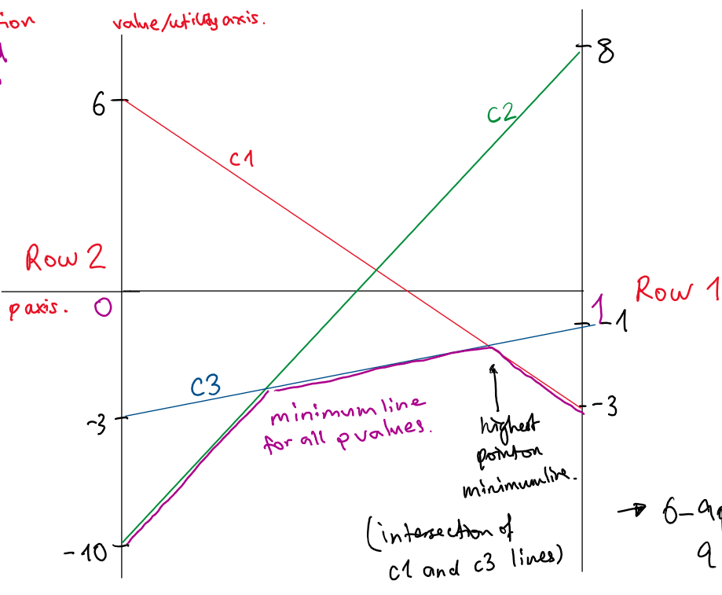

- The highest position on the minimum line occurs at the intersection of lines $c_1$ and $c_3$. Hence, we solve $$6-9p = 2p-3$$

- This yields $(p^*,v^*) = (\frac{9}{11}, \frac{-15}{11})$.
- Since the intersection occurred between column 1 and 3, we assign $q$ to probability of choosing column 1, and $1-q$ to probability of choosing column 3.
- We calculate:
    * $r_1(q) = -2q-1$
    * $r_2(q) = 9q - 3$
- Then we solve $$r_1(q) = r_2(q)$$.
- This yeilds the solution $(q^*, v^*) = (\frac{2}{11}, \frac{-15}{11})$.
- Notice that the value of the game is the same in both cases - this shows that the mixed strategy is optimal.

### Special Cases in the Graphical Method

#### Normal Case

- Most cases will have a **unique optimal solution** which use both strategies

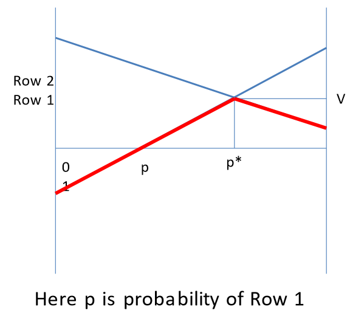

- Red line is the minimum of the two columns, i.e. the worst case for the row player

#### Pure Strategy

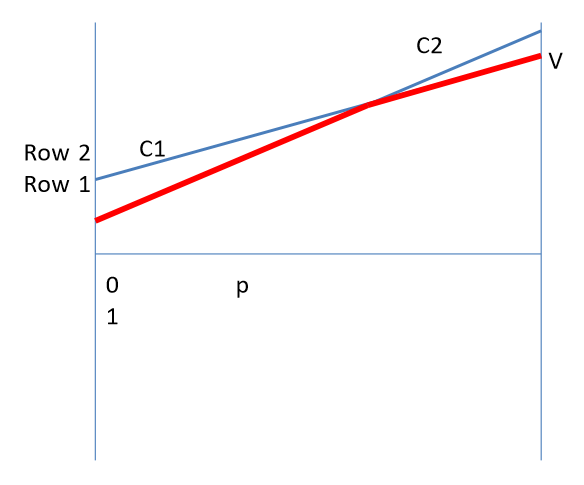

- If the highest point occurs at the two lines $p = 0$ or $p = 1$, then we have a pure strategy.
- In this case, row 1 dominates row 2 and the solution is $(r_1, c_1)$.

#### Total Domination

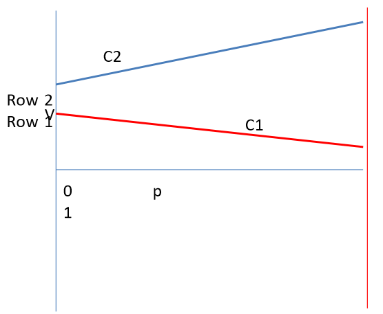

- There can be cases where one column always dominates the other column
- In this case, $c_1$ dominates $c_2$. The solution is $(r_2, c_1)$.

#### Full Range

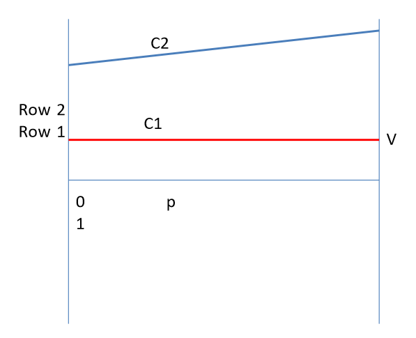

- There can be cases where all the probability values are optimal.
- The minimum line is equal to $c_1$, so all $p$ values are optimal.

#### Partial Range

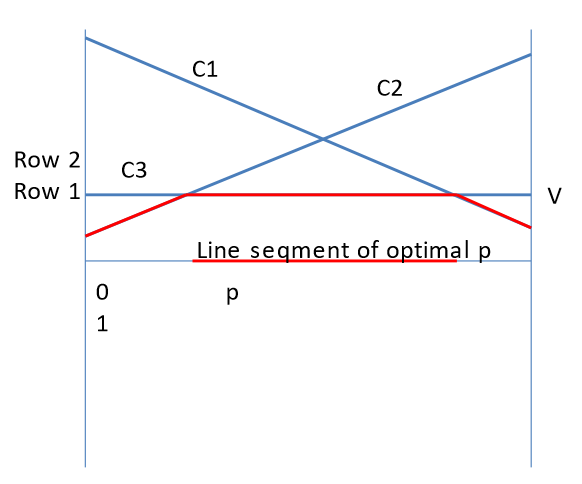

- There can be a line segment of optimal $p$ values
- i.e. there is a sub-interval of $p$ values of $[0,1]$ that produce the optimal result.

#### Triple Intersection

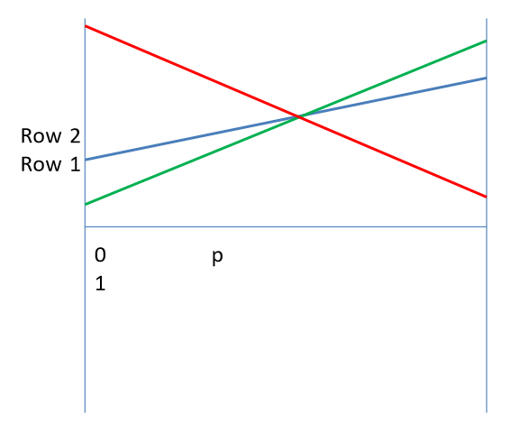

- There can be cases where there is a triple intersection at the maximum point.
- In this case, you can take away the green/blue lines and the maximum point will stay the same. But taking away the red line will result in the maximum point changing.

### Visual Proof of the Minimax Theorem

- Consider a $2 \times 2$ matrix game, and we plot the graph to find the mixed strategy.

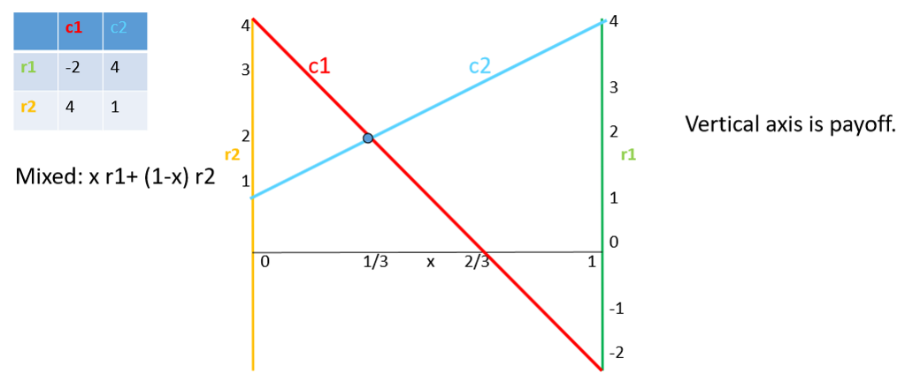

- Now consider the line corresponding to a weighted sum of the two lines. This represents the column player's gain.
    * The column player wants to minimise, the row player wants to maximise
    * Since at the intersection point $p$, $c_1(p) = c_2(p)$, the column player's line **must pass through the intersection point**
    * The only way the maximum of the column line can be minimised is by making it a horizontal line
- Hence the **optimal column player**'s choice corresponds to a **horizontal line** on the same graph.
- The $y$ value of the horizontal line is equal to the **height** of the intersection line
    * i.e. the value of the game for the row and column player is the **same**

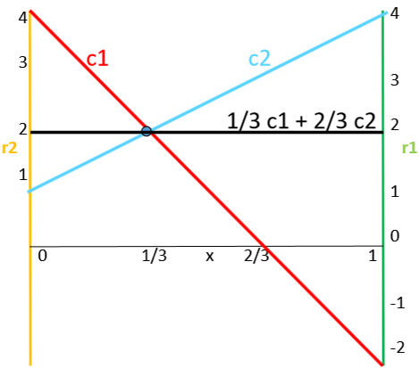

## 3.4 Converting a Game to an LP

### Linearisation

- In LP we minimise / maxkmise a linear function, not something like $\min$.
- We can replace $\min$ by a linear program:

| LP Formulation |
|:---------------|
| $$ \min(a,b) = \\ \max c \\ \text{s.t.} \\ \hspace{1.5em} c \le a \\ \hspace{1.5em} c \le  b $$ |

- In game theory, the row player maximises over his mixed strategy $\textbf{x}$, $\min(a(\textbf{x}), b(\textbf{x}))$ where $a, b$ are column strategies.
- We can rewrite $\max_x \min[a(x), b(x)]$ as a linear program:

| LP Formulation |
|:---------------|
| $$ \max_\textbf{x} \min[a(\textbf{x}), b(\textbf{x})] = \\ \max_{\textbf{x}, c} c, \\ \text{s.t.} \\ \hspace{1.5em} a(\textbf{x}) \ge c \\ \hspace{1.5em} b(\textbf{x}) \ge c$$ |

- This means we find the **largest $c$ value for all $\textbf{x}$** such that $c \le a(\textbf{x})$ and $c \le b(\textbf{x})$. For each $x$, $c$ is the smaller of the two, $a(\textbf{x}), b(\textbf{x})$.
- **NB**: $x$ is a vector, $c$ is a number.

### Writing a Matrix Game as an LP

- Consider the matrix game:

    $$\begin{pmatrix} -3 & 8 & -1 \\ 6 & -10 & -3 \end{pmatrix}$$

- We can formulate it as this following LP:

| LP Formulation |
|:---------------|
| $$ \max_{x_1, x_2, v} v \\ \text{s.t.} \\ \hspace{1.5em} -3x_1 + 6x_2 \ge v \\ \hspace{1.5em} 8x_1 -10x_2 \ge v \\ \hspace{1.5em} -x1 - 3x_2 \ge v \\ \hspace{1.5em} 0 \le x_1, x_2 \le 1 \\ \hspace{1.5em} x_1 + x_2 = 1$$ |

- Let $x_1$, $x_2$ denote probabilities of choosing rows 1 and 2
- The first three constraints correspond to $c_i \ge v$, where $c_i$ is the $i$th column strategy.
- The fourth constraint says that probabilities should be between 0 and 1
- The last constraint says that probabilities should add up to 1

- **Connection to Graphical Method**:
    * the three constraints correspond to picking the **highest point** on the minimum line.

### Dual of the Matrix Game

- We can find the dual of the matrix game considered above:

| Dual Formulation |
|:-----------------|
| $$ \min q \\ \text{s.t.} \\ \hspace{1.5em} y_1, y_2, y_3 \le 0 \\ \hspace{1.5em} q \space \text{free} \\ \hspace{1.5em} -3y_1 + 8y_2 - y_3 + q \ge 0 \\ \hspace{1.5em} 6y_1 - 10y_2 -3 y_3 + q \ge 0 \\ \hspace{1.5em} -1y_1 -1y_2 -1y_3 = 1$$ |

- We can further simplify it to:

| Dual Formulation |
|:-----------------|
| $$ \min q \\ \text{s.t.} \\ \hspace{1.5em} y_1, y_2, y_3 \ge 0 \\ \hspace{1.5em} q \space \text{free} \\ \hspace{1.5em} -3y_1 + 8y_2 - y_3 \le q \\ \hspace{1.5em} 6y_1 -10y_2 -3y_3 \le q \\ \hspace{1.5em} y_1 + y_2 + y_3 = 1 $$ |

- This is identical to the **column player**'s objective, hence showing that the **row player** and **column player**'s strategies are duals of each other.

