# CS241 (Networks)

## 1. Introduction to Networking

### Introduction

- A **computer network** is a network of inter-connected computing devices that enable **processes running on different devices** to communicate
- Components are:
    * **Network edge** - end hosts that run networking applications
    * **Network core** - packet switches: switches and routers
    * **Communication links** - each has a different bandwidth limit

- The end host runs the networking stack:
    * run application processes that generate messages
    * transport layer breaks messages into packets
    * add packet headers
    * send bits over physical medium

- The network core uses **routing algorithms** to construct routing tables
    * forward it to the appropriate link based on routing table
    * **Store and forward** - entire packet must arrive at router before it can be transmitted on next link
    * loss may occur from queue filling up
    * delay may occur from:
        * transmission delay $d_{trans} = \frac{L}{R}$
            * where $L$: packet length (bits), $R$: link **bandwidth** (bps)
        * queueing delay
        * nodal processing delay (e.g. checking errors)
        * propagation delay

- **Throughput** is the rate bits are transferred from source to destination in a given time window.
    * specific to a **flow** or communicating pair
    * The **bottleneck** is the link on the path with the minimum speed that constrains the throughput.

### Protocols

- A **protocol** is a sequence of rules that define the **format, order** of messages sent/received between network entities and **actions taken** on message transmission/receipt.

### Circuit Switching vs Packet Switching

- Telephone networks used **circuit switching**
    * all links reserved for **entire call duration**
    * not ideal for internet flows, as circuit cannot be used by another flow whilst reserved

- Solution: **packet switching**
    * split messages into packets
    * individual packets may take different routes

- Pros of Packet switching:
    * better utilisation of resources

- Cons of Packet switching:
    * no rate guarantee
    * losses possible

### Packet Switching

- Files to be transmitted at **packetised** as this enables pipelining.
    * while packet is sent on a later link, the next packet can be sent on an earlier link
    * reduces the transmission delay

- **Pipeline Equation**: $$\text{time} = k + (n - 1)$$
    * $k$ = number of pipeline stages
    * $n$ = number of items to pass through pipeline

- For networking, $k$ is the number of links, and $n$ is the number of packets the file is divided into.
- When we have a path consisting of $k$ links with individual speeds $R_1, \cdots, R_k$, the time is given as 
    $$\text{time} = \frac{F}{n} \cdot \sum_{i=1}^{k} \frac{1}{R_i} + \frac{F}{n} \cdot \frac{1}{R_\text{min}}$$

- where $F$ = file size, and $R_\text{min}$ is the bottleneck = $\min(R_1, \cdots, R_n)$

- This is because
    * **filling the pipeline** takes $k$ steps, equal to the time it takes one packet to travel through
    * the remaining $n-1$ packets are transmitted at the bottleneck throughput (slowest link in the path)

### Networking Stack

- **Internet Protocol Stack** designed as five layers:
    * Application Layer - data used by application programs
    * Transport Layer - packetising, optional reliable data transmission
    * Network - routing algorithms
    * Link - NIC drivers, Ethernet, WiFi
    * Physical - sending individual bits

- This maps closely to the **Open Systems Interconnection** (OSI) 7 layer stack:

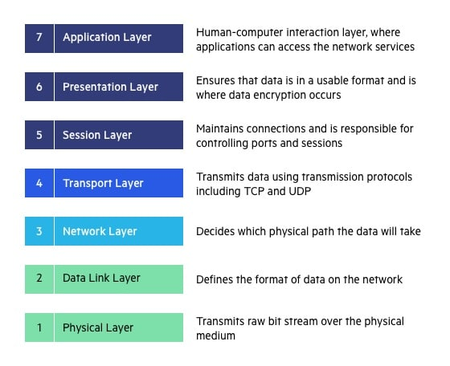

## 2. Application Layer

### 2.1 Networked Applications 

- A **network application** consists of processes running on different host machines communicating by sending messages over a network
- Network applications follow standard protocols, such as HTTP 
    * If there is no standard, dev team needs to write both client and server applications

- Processes send/receive messages via **sockets**:
    * APIs between Application Layer and Transport Layer
    * In C, acts like a File Descriptor so you can `read` and `write` to it

- Messages need to be addressed to a **process** and **end host**
    * End hosts are identified by **Network Interfaces**, which have an IP address
    * Processes listen on 16-bit **port numbers**
    * Ports 0-1023 are for well-known applications

#### Transport Layer Services

- Application uses **system calls** to create a **socket** to the transport layer
    * transport layer expected to deliver messages to intended recipients

- Bundled into two packages:
    * TCP (Transmission Control Protocol) - provides connection oriented sockets
    * UDP (User Datagram Protocol) - provides connectionless sockets

### 2.2 HTTP

#### Introduction

- HTTP is an **application layer protocol** using a **request/response** model
- It is **stateless** by default - each request is independent

- Under the hood, HTTP/1.1 uses TCP:
    * Server listens on port 80
    * Client initiates TCP connection to server on port 80
    * TCP connection is established after TCP handshake
    * HTTP messages exchanged
    * TCP connection is closed

- Older versions, like HTTP/1 was **non-persistent**
    * one connection could only send one object
    * inefficient as each object requires at least $2\text{RTT}$ to be downloaded (**RTT** = round trip time)

- HTTP/1.1 is **persistent**
    * TCP connection is left open to send multiple objects

- With **persistent HTTP**, one TCP connection is used for all transmissions. Each object downloaded has its own HTTP request.
    * So if we are downloading $n$ objects, the number of round trip times is $n+1$.
    * with non-persistent, this would take $2n$.

- Setting up the TCP connection takes $1\text{RTT}$.

- Newer versions like HTTP/2 provide:
    * Multiplexing - allows many requests and responses to be sent concurrently over a single TCP connection
    * Binary framing - more efficient compared to HTTP/1's plain text
    * Header compression

- Newest version HTTP/3 **does not use TCP**
    * Uses QUIC protocol which is built on top of UDP

#### Requests and Responses

- A HTTP Request follows a specific structure:
    * Start line: `METHOD path HTTP/version`, e.g. `GET /index.html HTTP1/1.1`
    * Headers (key/value), e.g. `Host`, `User-Agent`, `Accept`, `Authorization`
    * Optional body (common for POST/PUT), separated by a blank line (`\r\n`)

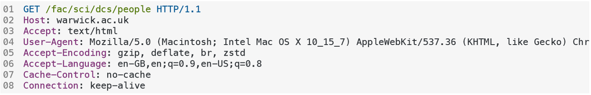

- HTTP uses multiple methods for different types of requests:
    * `GET` - fetch resource, **no body**
    * `POST` - submit data / create action
    * `PUT`/`PATCH` - update
    * `DELETE` - remove
    * `HEAD`/`OPTIONS` - metadata/capabilities

- The HTTP response starts off with the **status line**
    * Protocol Status Code, Status Phrase

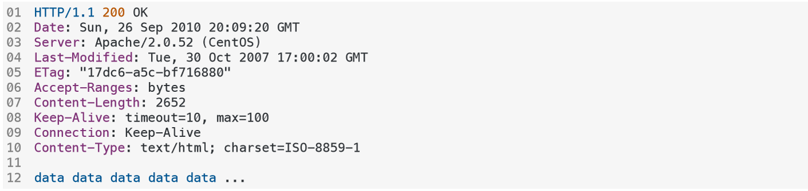

- Status Codes are grouped by their start digit:
    * `1xx` - informational response
    * `2xx` - success (e.g. 200 OK)
    * `3xx` - redirect/caching
    * `4xx` - client error (e.g. 404 Not Found)
    * `5xx` - server error

- HTTP contains **cookies** in the header, which are used to transmit client-side data to the domain.
    * Used for **session** - cookie holds session ID, server stores session state
    * Used for **tokens** (e.g. JWT) - client holds signed token; server verifies without server-side session state`

#### Caching

- Caching can be used to satisfy client requests without looking at the origin server, depending on the response header.

- Typically, cache installed by ISPs to serve requests of **popular contents**

- Mainly, via `Cache-Control`. Options include:
    * `max-age=<seconds>`
    * `no-store`: don't store
    * `no-cache`: can be stored, but must be revalidated

- **Content Delivery Networks** (CDNs) are shared caches placed close to users.
    * Useful when there is a cache miss, as user doesn't have to go all the way to the origin server
    * Mainly caches **static assets** like images, JS, CSS, fonts, video segments 

## 3. Transport Layer

### 3.2 Introduction to the Transport Layer

- The **transport layer** provides **logical communication between processes** on different hosts.
- Transport protocols run on **end hosts**
    * `send` - breaks messages into **segments**, adds header, passes down to network layer
    * `receive`: reassembles **semgnets** into messages, passes up to application layer

- Transport layer protocols *may add reliability protocols*
    - **UDP** - bare minimum services
    - **TCP** - reliable data transfer

### 3.2 TCP vs UDP

#### UDP

- **UDP** stands for User Datagram Protocol:
    * Packetises application layer data, adds UDP header, sends to Network Layer
    * If packets reach destination, UDP delivers them to the right process

- No effort made to recover lost packets or reorder out-of-order packets
- **Connectionless**, and **no congestion control**

- Uses of UDP:
    * No connection establishment and smaller header size make it **faster**
    * No congestion control makes it suitable for live applications
    * If necessary, add reliability at Application Layer

#### TCP

- **TCP** stands for Transmission Control Protocol.
- It provides basic services, plus:
    * **Reliable Data Transfer**: recovers losses, reorders out-of-order packets
    * **Flow Control**: matches sending speed of sender to reading speed of receiver
    * **Congestion Control**: controls sending rate according to *perceived network congestion*

- Effectively, TCP upgrades an unreliable network layer's best-effort delivery service to a reliable transport layer service.

- TCP employs these mechanisms to ensure **reliability**:
    * **Checksums** - detect bit errors
    * **Acknowledgements** - receiver acknowledges correct receipt
    * **Timeout mechanism** - sender times out if ACK not received
    * **Retransmission** - retransmit lost packets via ARQ
    * **Sequence number** - to correctly order packets

### 3.3 Automatic Repeat Request (ARQ)

#### Stop and Wait ARQ

- Sender waits to receive ACK before sending next packet
    * If no ACK, timeout and retransmit same packet

- Duplicate detection possible using sequence numbers
    * After receiving packet $0$, sender expects packet $1$
    * If packet $0$ is seen, it knows it is a duplicate and discards it

- **Alternating Bit Protocol** uses a 1-bit sequence number, as there can only be one outstanding packet to be acknowledged
    * If expecting packet $1$, packet $0$ is duplicate
    * If expecting packet $0$, packet $1$ is duplicate
    * Alternate between $0$ and $1$ every time

- **Disadvantage**:
    * Each packet sent requires a RTT (round trip time) which is **poor utilisation of link capacity**, leading to **poor performance**

- The receiving process typically has a finite buffer of $B$ bits.
    * if the packet length is $L$ and the speed is $R$ bps,
    * at minimum, it should accept at least one packet. i.e. $B \ge L$.

- But there is also propagation delay, so the sender can theoretically send an additional $R \times RTT$ bits while waiting for the first acknowledgement
    * $R \times RTT$ is called the **delay bandwidth product**

- So to fully utilise the link capacity, $B \ge L + R \times RTT$

#### Go-Back-N

- Go-Back-N is a **pipelined protocol** that can send multiple packets without waiting for ACK, which utilises the link capacity better than Stop and Wait ARQ.
- Sender can send up to $N$ packets without waiting for ACK

- Acknowledgements are **cumulative**
    * Let `expectedseqnum` be the expected next sequence number
    * If receiver receives packet $n$ = `expectedseqnum`, $\text{ACK}(n)$ is sent, acknowledging all packets up to and including $n$
    * Otherwise, discard incoming packets and send $\text{(ACK)(\text{expectedseqnum}-1})$

- Sender maintains a **sliding window** of size $N$ of sent packets and only moves along when the first packet is received.

- The **sequence number space** is $N+1$, i.e. sequence numbers range from $0$ to $N$.
    * this is because the first packet's ACK could be lost, and packet 0 could be retransmitted
    * receiver needs to distinguish between the old packet 0 and packet $N$ (the next packet to send)
    * another reason is that the receiver has a receive window of size $1$

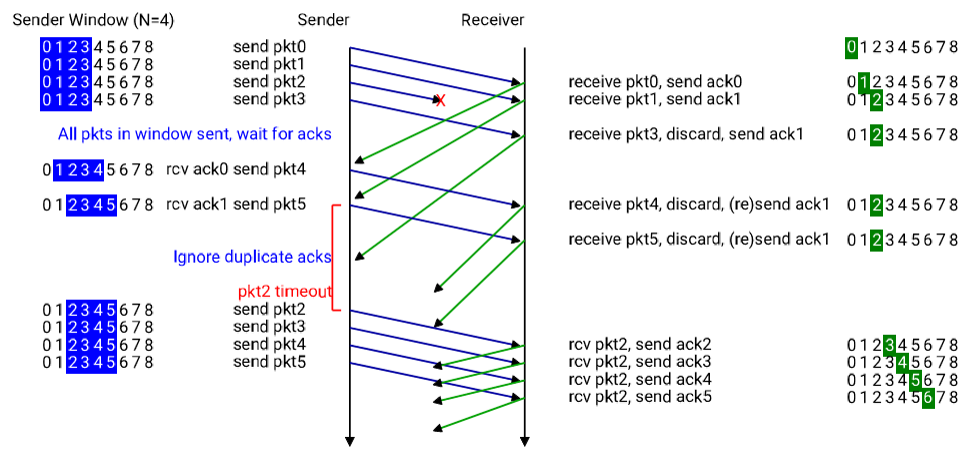

#### Selective Repeat (SR)

- Pipelined protocol, but receiver **does not** discard out of order packets **if they fall inside the receive window**
    * Sender does not have to retransmit out of order packets
- ACKs are individual, not cumulative
- Sender selectively retransmits packets whose ACK did not arrive
    * maintains a time for each un-acked packet in its send window

- Sender and receiver both maintain a sliding window of size $N$ of sent and received packets
- The **sequence number space** is $2N$, i.e. sequence numbers range from $0$ to $2N-1$.
    * consider the case where all $N$ ACKs are lost
    * receiver needs to distinguish between the old $N$ packets and the next $N$ packets
    * the second $N$ comes from that the receiver has a receive window of size $N$

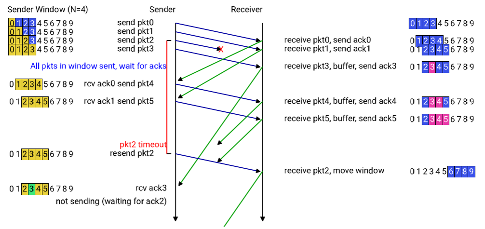

#### TCP Reliable Data Transfer

- **TCP** uses ideas from GBN and SR protocols
    * TCP uses cumulative ACKs
    * TCP sender only retransmits the segment causing the timeout (like Selective Repeat)

- TCP adds **sequence numbers**, which refer to the *bytes* in the entire data, rather than numbering the packets/segments

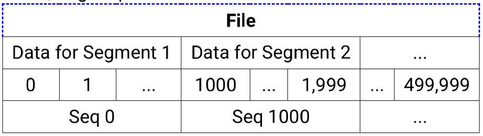

- ACK number is the **next expected byte**
    * e.g. `ACK(100)` means the receiver received bytes 0-99, and ready to receive data starting at byte 100

- Most importantly, **data can flow both ways** in TCP:  
    * ACK is a flag in a segment that can also contain data
    * reduces the number of transmissions
    * **NOTE**: ACK is always one more than last piece of data received

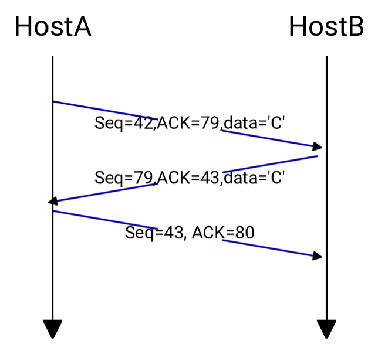

- **TCP Fast Retransmit**
    * If 3 dupliate ACKs for same segment, TCP sender retransmits that segment without waiting for timeout
    * Timeout is relatively long, and duplicate ACKs indicate a gap in the received stream of bytes

- TCP Segment Structure:
    * **Sequence Number**: indicates number of first byte
    * **ACK Number**: Next byte expected

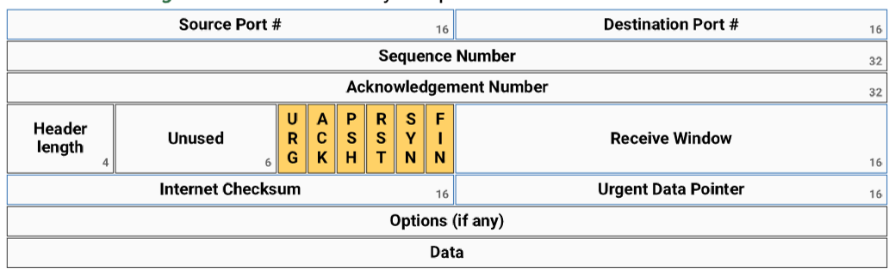

### 3.4 Flow and Congestion Control

#### Flow Control

- **Flow control** is a mechanism that prevents the receiver's buffer from overflowing by *adjusting* the sending speed of the sender 
    * Otherwise data would be lost

- Receiver *advertises* free buffer space in the Receive Window Field of the TCP segment (`rwnd`)
- Sender limits amount of unacked data to `rwnd`
    * `LastByteSent - LastByteAcked <= rwnd`

- Guarantees receive buffer will not overflow

#### Congestion Control

- Congestion at a router occurs when input rate > output rate, which causes:
    * Delays: packets will **queue** in link's memory, causing huge latency
    * Losses: packets may be dropped if link's memory fills up

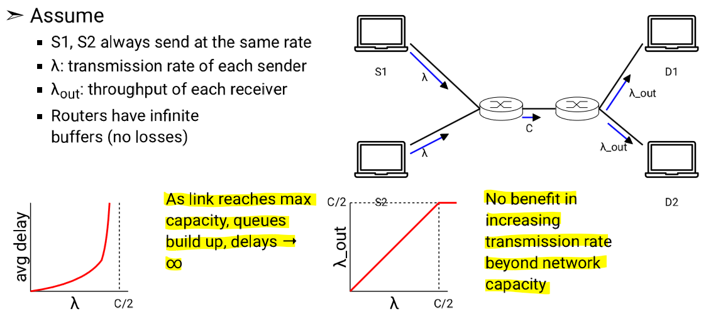

- In this example, the incoming flow rate is $\lambda + \lambda = 2\lambda$
    * As $\lambda \to C/2$, average delay $\to$ infinity as queues build up
    * at a shared link, flow is divided **equally** between incoming links if input rate is greater than the link throughput.
    * so in this case, maximum throughput of the shared link **for each** sender is $C/2$.

- **Congestion control** is a mechanism that avoids router congestion by controlling the rate of transmission based on **perceived congestion**
    * Beneficial for all hosts on the network

- TCP detects network congestion through losses and delays - either
    * Timeout occurs
    * Three duplicate ACKs received
- TCP considers timeout as a **stronger indication** than three duplicate ACKs

- Sender maintains **congestion window size** (`cwnd`), which limits the maximum number of in flight packets/segments
    * $\text{LastByteSent} - \text{LastByteAcked} \le \min(\text{cwnd}, \text{rwnd})$

##### Additive Increase, Multiplicative Decrease

- `cwnd` is a **dynamic** function of perceived network congestion using **AIMD** (additive increase multiplicative decrease). Every RTT:
    * **no packet loss**: **Addictive Increase**: increase `cwnd` by 1 MSS (*maximum segment size*)
    * **packet loss**: **Multiplicative Decrease**: cut `cwnd` in half

- AIMD is proven to be **fair** in finding the optimal transmission rate
- Since the convergence speed of AIMD is low, TCP uses an initial **slow start phase**
    * Window increased **exponentially fast** at small value
    * Continues until predefined threshold (`ssthresh`) is reached, or loss is detected

##### TCP Tahoe vs Reno

- Two algorithms for reacting to losses:
- **TCP Reno**:
    * **On timeout**: no segment received - take **drastic action**
        * set `ssthresh = 0.5*cwnd`
        * `cwnd = 1MSS` (reset congestion window)
        * enter slow start phase
    * **On duplicate ACKs:** some segments lost, but some received
        * set `ssthresh = 0.5*cwnd`
        * `cwnd = 0.5*cwnd` (halve congestion window)
        * start AIMD

- **TCP Tahoe** always sets `cwnd` to 1 in response to either timeout or duplicate ACKs

## 4. Network Layer

### 4.1 Introduction to the Network Layer 

- The **network provides** core functions like:
    * **logical addressing** - every interface has an **IP address**
    * **routing** - deciding a path through the network
    * **forwarding** - using routing tables at each router to forward a packet to the correct outgoing interface
    * **fragmentation** - deal with packets that are too large for a link

- The network layer runs in end hosts and routers for forwarding. The main protocol is **IP**:
    * **At source**:
        * Get transport layer segments, add IP header containing `src` and `dest` IP addresses
        * Send down to link layer
    * **At routers**:
        * Check `dest` IP address of incoming packets to decide the next hop router
    * **At destination**:
        * Receive IP datagram, strip IP header, and deliver up to transport layer

- A **datagram** is a packet in the network layer
- If a IP datagram is too big for the link layer, the packet can be split into **fragments** and reassembled at the network layer
    * usually avoided through careful use of `Maximum Segment Size`

### 4.2 IP and Subnetting

#### IP Addresses

- Each **network interface** has an IP address, which is a 32-bit number written as dotted decimal, e.g. `192.168.1.102`
- An IP address can be acquired either:
    * Manually by sysadmin
    * or by DHCP (dynamic host configuration protocol)
- IP addresses are allocated to ISPs by ICANN (Internet Corporation for Assigned Names and Numbers)
- ISP then allocates IP to customers

#### Routing Tables

- Routers provide two key functions:
    * **Forwarding**: move packets from router's input to appropriate output
    * **Routing**: use a **routing protocol** to construct routing table

- Since it is impractical to have a separate entry for each IP, a routing table assigns an **interface** to a *range* of IP addresses

- Interface is chosen using **longest prefix matching** - choose the entry with the longest matching prefix of bits
    * There may be multiple matching interfaces, but choose the most *specific* one

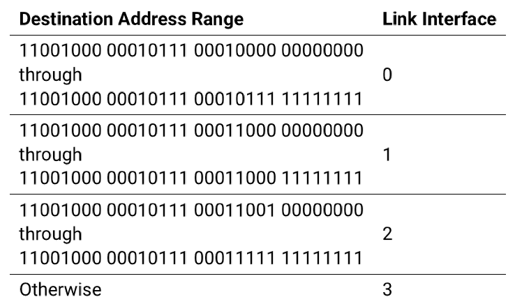

#### Subnets and CIDR

- The practice of grouping IP addresses by their *prefix* is called **subnetting** - i.e. splitting a large layer-3 network into smaller layer-3 networks

- This has a few benefits:
    * Reduces broadcast traffic
    * Improved security and isolation between different subnets
    * Better address management (avoid wasting IPs)
    * Enables hierarchical design (e.g. for ISPs)

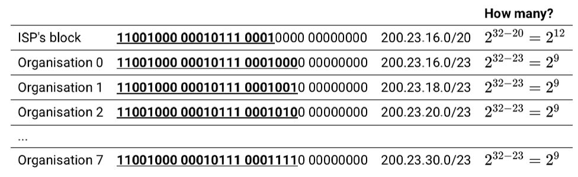

- A subnet is denoted by the **network address** and a **subnet mask**
    * subnet masks are always a continuous set of 1s followed by 0s
    * often referred in **Classless Inter-Domain Routing** (CIDR) form by the *number of 1s*
    * e.g. `192.168.1.42/24` means the *first* 24 bits constitute the subnet address

- Originally, **classes** A/B/C were used instead of CIDR
    * where A,B,C corresponded to `/8`, `/16`, `/24`
    * but this wasted huge numbers of IP address
    * so CIDR was adopted later 

- IP addresses belonging to the **same subnet** have the same prefix or *network address*
- Bitwise **AND** is used to compute the *network address*
    * splits the IP address into a *network address* and **host address**

- Devices on same subnet are connected via **Link layer switches**, whilst subnets are connected via **routers**

#### Routing with CIDR

- Sender checks if destination IP is *within the same subnet*
    * by computing the network address and comparing then

- If so:
    * obtain MAC address of the destination via ARP
    * create link layer frame
    * forward it to the link layer switch
- If not, `src` and `dest` are on different subnets:
    * `src` forwards packet to **default gateway**
    * gateway router will use routing to forward packet to correct subnet
    * which will then reach the `dest`

#### Special Addresses

- For a given subnet there are a few special addresses that are reserved:
    * **network address** - e.g. for `192.168.1.0/24`, `192.168.1.0` is reserved
    * **broadcast address** - host address is all 1s, e.g. `192.168.1.255`

- Some other addresses *may* be reserved:
    * Ending in .1: router, e.g. `192.168.1.1`
    * Ending in .254: WiFi access point, e.g. `192.168.1.254`

- Some portions may be reserved as *static* or *dynamic* (DHCP)
- In general, if there are $n$ bits for the host address, the number of usable hosts is $2^{n-2}$.
    * we cannot use the network address `.0` and the broadcast address `.255`

### 4.3 NAT

#### Public vs Private Addresses

- IPv4 addresses are in short supply, so it is not possible for ISPs to provide a *unique IP* to each device connected to a subnet

- Instead, address are divided into **private** and **public**
    * Globally unique IP addresses are assigned only to gateway routers
    * Hosts are assigned **private IP addresses**, which exist in Local Area Networks (LANs)
    * Devices in private networks use private IP addresses to communicate with each other

- ICANN reserves these blocks for private IP addresses:
    * `10.0.0.0` to `10.255.255.255` (`10.0.0.0/8`)
    * `172.16.0.0` to `172.31.255.255` (`172.16.0.0/12`)
    * `192.168.0.0` to `192.168.255.255` (`192.168.0.0/16`)

#### Network Address Translation

- A consequence of this is that packets with private IP addresses *can't be carried onto the public internet*
- **Network Address Translation** (NAT) is used to solve this by translating private IP addresses at the router
    * also known as *port address translation* (PAT)

- Router stores **NAT Translation Table**, with WAN-side sockets against LAN-side sockets 
- **Router port numbers** are used to identify LAN-side sockets 
    * LAN-side address is swapped out for gateway router's public address
    * port number identifies the LAN-side socket (including port)
- Problem can occur if gateway router *runs out of port numbers* to use

- **Pros**:
    * **Security Benefit** - internal devices not reachable from public internet
    * Gateway router acts as basic firewall

- **Cons**:
    * NAT is controversial - port numbers should identify processes, not hosts

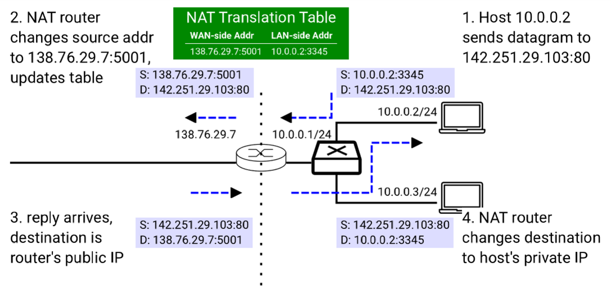

### 4.4 Routing

#### Introduction

- Each router constructs a **routing table** 
    * using routing protocol such as RIP or OSPF
    * routing protocols implement routing algorithms

- A network is abstracted as a **graph** $G = (N,E)$ where
    * $N$ = set of routers
    * $E$ = set of links, each with a cost

- We are interested in finding the *least cost path* between source $x$ and destination $y$

- Two types of routing algorithm:
    * **Global**: requires knowledge of complete topology (Link State algorithms)
    * **Local**: requires knowledge of only local neighbourhood at each router

#### Link State Routing

- Compute least-cost paths from one node (source) to all other noes
- **Dijkstra's algorithm** implemented in Open Shortest Path First (OSPF) protocol
    * each node requires **entire topology** including cost of each link
- Obtained through broadcasting of link costs:
    * each node broadcasts cost of each link connected to it (to all nodes in the network)

- **Pros**:
    * fast convergence (usually)
    * each router has **global view**, making routing decisions more consistent
    * scales better to larger enterprise networks

- **Cons**:
    * more overhead
    * more CPU/memory, as each router runs Dijkstra and stores a graph

#### Distance Vector

- **Distance Vector** is implemented in the Routing Information Protocol (RIP)
- Uses local information from neighbouring nodes to compute shortest paths
- Based on **Bellman-Ford** equation:
    * let $d_x(y)$ be the shortest path length from $x$ to $y$
    * $d_x(y) = \min_{v \in N(x)} \{ c(x, v) + d_v(y)\}}$
    * an example of **dynamic programming**
- Each node $x$ maintains a distance vector:
    * $D_x = [D_x(y) : y \in N]$ (vector of current estimates)
- Each node updates its distance vector, requiring:
    * cost to each neighbour $v$: $c(x, v)$ - this is known locally
    * distance vector of each neighbour $D_v$ - obtained via message passing
- When any distance is updated, node **recomputes** its DV and sends updated DV to all its neighbours

- **Pros**:
    * simpler to implement
    * lower computation per router
- **Cons**:
    * slower convergence after failure
    * suffers from **count to infinity** problem
    * less visibility

- **Count to Infinity** problem:
    * routers incorrectly believe a destination is still reachable via each other
    * as information spreads locally
    * distance keeps increasing until it reaches an `infinity` value
    
- This is fixed by heuristics like **split horizon**, **poison reverse**, **hold-down timers** etc.

#### Inter-domain routing

- Link State and Distance Vector are not scalable, so are only constrained to **intra-domain routing**
- **Inter-domain routing** (over the internet) uses the **BGP** (Border Gateway Protocol) instead, as:
    * The internet is made up of many Autonomous Systems
    * Policy matters more than shortest path

- **BGP** is a **path-vector** protocol:
    * advertises reachable prefixes plus the AS-PATH (the sequence of autonomous systems to get there)
    * has loop prevention which prevents the count-to-infinity problem at the inter-domain level

- Essentially distance vector plus path, which enables loop detection.

## 5. Link Layer

### 5.1 Introduction

- The **link layer** is about getting data across **one hop** on the same local network
- Provides core functions like:
    * **Framing**: wrap a network-layer packet into a **frame** with header/trailer
    * **Local addressing**: using **MAC addresses** 
    * **Medium access**: rules for sharing the physical medium
    * **Error detection**: detects corruption on a link
    * **Hop-by-hop delivery**: each hop is handled separately

- Common link-layer protocols include:
    * **Ethernet** (IEEE 802.3)
    * **WiFi** (IEEE 802.11)

- A typical Ethernet frame includes:
    * Destination MAC
    * Source MAC
    * EtherType (what payload it is)
    * Payload
    * error checking

### 5.2 ARP

- The **Address Resolution Protocol** (ARP) is used to determine the MAC address of a host from its IP address
- Used for:
    * Same subnet: ARP for the destination host's MAC
    * Remote: ARP for default gateway's MAC (router)

- **Protocol**:
    1. Host checks its ARP cache (IP -> MAC mapping)
    2. If there's a cache miss: host broadcasts
    3. Device with that IP replies its MAC address
    4. Host caches it, and then sends the Ethernet frame

- **NOTE**: ARP is for IPv4 only; IPv6 uses the Neighbour Discovery Protocol (NDP)
- Security risk:
    * ARP is susceptible to ARP cache poisoning, where an attacker responds with their MAC address upon broadcasting
    * can lead to MITM (man-in-the-middle) attacks

### 5.3 Hub vs Switch vs Router

- A **hub** is a **layer 1** switch:
    * copies incoming bits out of **all** ports
    * No MAC learning, no filtering

- A **switch** is a **layer 2** switch:
    * forwards frames based on **destionation MAC**
    * builds a **MAC address table** by learning source/dest AMC addresses

- **Layer 3 switches** are either:
    * Routers that operate at the network layer using routing tables
    * or advanced switches that operate at layer 3 (commonly used for VLANs)

