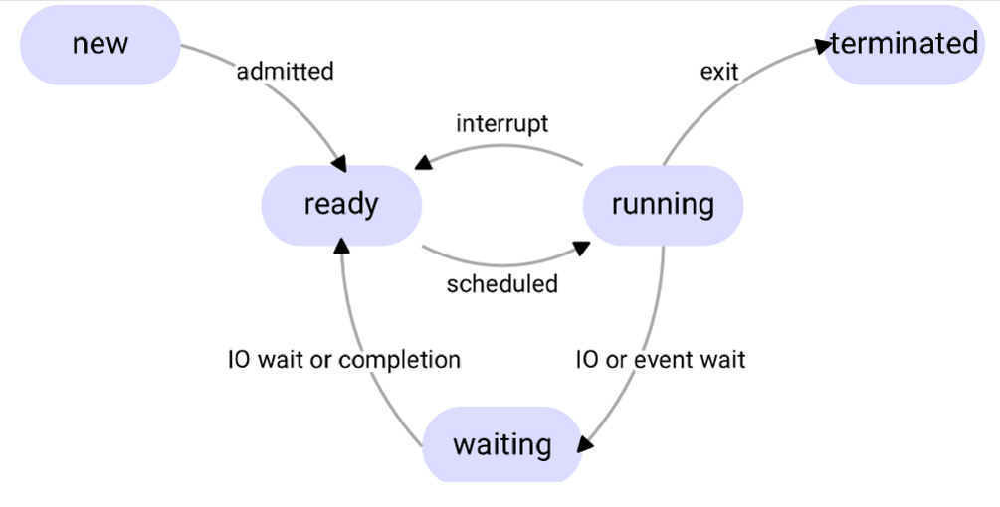
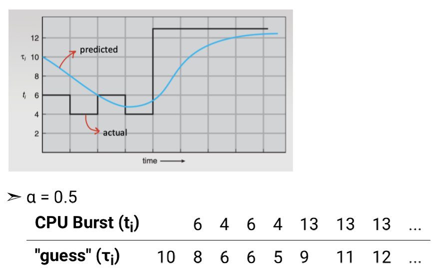
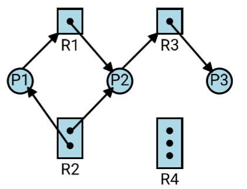
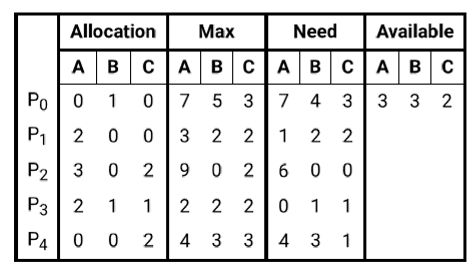

# CS241 (Operating Systems)

## 1. Introduction to Operating Systems

### Introduction

- An **operating system** is the software acting as an intermediary between the user of a device and the hardware of the device.

- It provides functions such as:
    * allocating resources
    * program execution
    * I/O operations through *device drivers* and *interrupts*
    * file system management
    * communication - networking / IPC
    * error handling
    * resource allocation, and job scheduling
    * accounting via PCBs
    * security

### Kernel

The **kernel** is the core part of the OS that provides most of these functions, notably:

* process scheduling
* memory management
* device drivers (often)
* filesystems
* networking stack
* system call interface

- processes run in two modes: 
    * **user mode** (unprivileged) - cannot perform kernel operations
    * **kernel mode** (privileged) - can do everything

- **System calls** are an interface for user programs to perform kernel operations, such as:
    * `open`, `read`, `write`, `close`, `fork`, `execlp`, etc.

- Uses a *mode bit* to indicate kernel (0) or user (1) mode.

### Kernel Structures

- 1. **Monolithic kernel**
    * most OS services run in kernel space.
    * advantages: fast, simple
    * disadvantage: large codebase, single point of failure

- 2. **Layered approach**
    * kernel is structured in layers, each layer only using the layer below
    * advantages: clearer organisation
    * disadvantages: less flexible

- 3. **Microkernel**
    * keeps the kernel minimal, typically only including scheduling, basic memory management, and IPC
    * most other devices live in user space
    * advantages: better isolation, smaller kernel code
    * disadvantages: more IPC/context-switch overhead, complex system architecture

- 4. **Loadable kernel modules**
    * a **kernel module** is code that can be loaded into the kernel at runtime without rebuilding the kernel image
    * advantages: flexible, smaller base kernel
    * disadvantages: security concerns if untrusted modules
    * **Linux is a monolithic kernel + modular extensions**

## 2. Processes I

### Introduction

- A **program** is a passive entity stored on disk as an executable
- A **process** is a program in execution

- A program's **virtual address space** is the memory allocated for a process, containing:
    * **Text**: stores instructions
    * **Data**: stores global variables
    * **Heap**: dynamically allocated memory
    * **Stack**: local variables, function parameters, return addresses

- A process goes through different states:



### Process Control Block

- A **process control block** is a data structure that stores the information about a process, storing:

    * process state
    * PC
    * registers
    * scheduling info
    * memory management info
    * accounting information
    * i/o status

- A **context switch** is switching between processes
    * uses the PCB to store state of current process and load state of new process
    * **is an overhead** - OS does not useful work when switching

### Scheduling

- Schedulers choose which process gets a specific resource and when
- OS maintains several queues to schedule process from:
    * **Job queue** - processes in the *new* state
    * **Ready queue** - processes in the *ready* state
    * **Device queues** - processes waiting for a specific device

- Three types of schedulers:
    * **Short-term scheduler** (CPU scheduler)
        * scheduling which *ready* processes get to run
    * **Medium-term scheduler**
        * swapping processes from memory and disk
        * controls degree of *multiprogramming* - number of processes in memory simultaneously
    * **Long-term scheduler** (not typical in a modern OS)
        * scheduling which *new* processes get to be *ready*
        * e.g. SLURM in HPC (which is also a medium-term scheduler)

- Processes are either:
    * **I/O bound** - mostly waiting for I/O
    * **CPU bound** - mostly using the CPU

## 3. Processes II

### fork()

- The `fork` function duplicates a process, making that new process the **child process** and the original process the **parent process**
    * returns `0` for the child process
    * returns `PID(child)` for the parent process

- The **entire VAS** is copied, so they start off with the same:
    * program counter
    * memory contents
    * open file descriptors

### execlp()

- The `execlp` function replaces the program code that's running by replacing the **entire VAS**
    * `l` means **LIST** - provide arguments of program in list mode, ending with `NULL`, e.g. `execlp("./prime", "prime", "123", "456", NULL);`
    * `p` means search in `PATH` variable

- together, we can create a new child process by first doing `fork` and then `execlp`.

### Process Termination

- Processes terminate after reaching the last statement or an `exit()` statement, and return an **exit code**.
- A parent waits for a child process to terminate using the `wait` function:
    * `pid_t pid = wait(&status);`

- **NOTE**: `wait` is blocking.

- A **zombie process** is a process that has terminated, but the parent has not collected the exit status code
    * all resources of child are released, but entry remains in process table

- An **orphan process** is where the parent exited without invoking `wait()`.
    * In UNIX, the `init` process is assigned as the parent
    * `init` periodically waits to collect exit statues of all orphan processes

- Parents can terminate execution of child processes with `abort()`

## 4. Processes III

### Interprocess Communication

- Where processes running concurrently communicate with each other
- A **producer** is a process that produces data
- A **consumer** is a process that consumes the produced data
- A process can be both producer and consumer

- IPC is implemented in two forms:
    * **Shared memory**
    * **Message Passing**

### Shared Memory

- Shared memory resides in the address space of **one of the communicating processes**
- Kernel is required to setup shared memory and give permissions
- Processes then use the memory directly
- For example, `mmap` (memory mapping) can be used for shared memory IPC

###  Message Passing

- Processes message each other through a **logical communication channel** provided by the Kernel
- System calls pass messages, minimally having a `send` and `receive` function

- Implementation depends on the *buffer size* of the communication link
- Two paradigms:
    * **Direct communication** - processes name each other explicitly.
    * **Indirect communication** - messages are directed and received from mailboxes.

- Message passing can either be:
    * **Synchronous** - blocking send/receive
    * **Asynchronous**: sender / receiver don't need to wait and can keep sending

#### Pipes

- Pipes are a way in Linux to pass data from the *output* of one program to the *input* of another
- Are an example of **Message Passing**

- Can be created using an array `fd[2]` representing a pipe, and calling the `pipe(fd)` function to create the pipe. `fd[0]` represents the read end, `fd[1]` represents the write end.

- ***Def.*** A **file descriptor** is a number (unique to the process) representing an open file.

- We can then use `read`, `write` and `close` on `fd[0]`/`fd[1]` to transfer data.

- The standard file descriptors are:
    * `stdin`: 0
    * `stdout`: 1
    * `stderr`: 2

- This is also how *redirection* is implemented, using `dup`/`dup2`/`dup3` duplicate descriptors:
    * `dup2(old_fd, new_fd)` redirects `new_fd` to `old_fd`
    * So output redirection `>` can be written as `dup2(fd, 1)`
    * And input redirection `<` can be written as `dup2(fd, 0`

#### Named Pipes

- Named pipes (FIFOs) are pipes with a name in the filesystem
- Created using `mkfifo()`
- Exist independently of processes, processes can read and write from the named pipe.

#### Message Queues

- An example of **asynchronous** message passing, where data is stored in a queue and receivers/senders are non-blocking

- For example using `<sys/msg.h>`:
    * `msgsnd` to send a message into the queue
    * `msgrcv` to receive a message from the queue

#### Other examples

- Other examples are:
    * *signals*
    * MPI (message passing interface) for HPC

## 5. Multithreading 

### Introduction

- A **thread** is a unit of CPU execution.
- Each thread has its own *thread id*, *PC*, *registers*, and **stack**. All other resources are shared.
- This makes *thread creation* have *less overhead** than process creation.
- **Multithreading** is making a program run with multiple threads.

### Concurrency

- **Concurrency** is where multiple tasks are making progress, done by interleaving their execution
- **Parallelism** is when multiple tasks are executing simultaneously
    * **Data parallelism**: performing same operation on multiple cores
    * **Task parallelism*: performing  different tasks across multiple cores

- **Amdahl's law**: $$ \text{speedup} <= \frac{1}{S + \frac{1-S}{N}}$$
    * where $0 \le S \le 1$ is the time taken to run the serial part
    * and $N$ is the number of cores

### pthreads

- Implementation of threads in POSIX standard
- Multithreading involves:
    * creating threads using `pthread_create`
    * executing some thread function that returns `void*`
    * joining threads using `pthread_join` to complete them

- have to be careful with *race conditions*!

### User-level vs Kernel-level threads

- **Kernel-level threads** are threads run only by the kernel
    * kernel schedules them
    * some provides services to users, and others are used to run user processes

- **User-level threads**
    * exist within user processes if they are multithreaded
    * mapped to a kernel-level thread to be executed

### Threading models

- **One-to-one**:
    * each user level thread maps to a kernel thread
    * **advantage**: user can completely rely on kernel to manage its threads
    * **disadvantage**: more expensive

- **Many-to-one**:
    * all user level threads are mapped to a single kernel thread
    * **advantage**: less overhead, more flexibility
    * **disadvantage** multiple user-level threads **cannot run in parallel**, one blocking user-level thread causes whole process to block

- **Many-to-many**:
    * not supported by operating system
    * kernel threads can run in parallel
    * programmers decide how many kernel threads to use

- Linux `pthreads` are basically *kernel-schedulable* threads on the 1-1 model.

### One-thread-per-request vs Threadpool

- In a multithreaded application, we need to decide what threads get mapped to what requests.

- **One thread per request**
    * each new request is mapped to a new thread*
    * high overhead
    * high traffic creates a lot of threads

- **Thread pool**
    * uses a fixed number of threads to serve all requests
    * requests wait in a queue that are puled by worker threads
    * if workers are busy, requests may have to wait
    * can be implemented in `pthreads` using **condition variables**.

## 6. Synchronisation

### Motivations

- Concurrent threads/processes enter a *race condition* when updating shared variables
- Only one of the values is preserved - it is a **race** to see which is last

- ***Def.*** **Critical section**: The part of the code where processes update shared variables

- ***Def.*** **Mutual Exclusion**: If one process is in its critical section, no other process should be allowed to be in its critical section.

- The *critical section problem* is designing a protocol for $n$ processes guaranteeing:
    * **Mutual Exclusion** - if a process is executing its critical section, no other process can enter their critical section.
    * **Progress** - if no process is in its critical section any waiting process should be able to enter.
    * **Bounded waiting** - no process waits indefinitely to enter its critical section.

### Example failed solution

- One example of a failed solution is the following, based on a shared variable `turn`:

```c
P0: do {
    while(turn != 0)
        ; // busy wait
    /* critical section */
    turn = 1;
    /* remainder section */
} while (true);

P1 : do {
    while (turn != 1)
        ; // busy wait
    /* critical section */
    turn = 0;
    /* remainder section */
} while (true);
```

- Bounded waiting is satisfied as turn can only be 0 or 1
- But progress is not satisfied as if P1 exits the loop, then P0 will be blocked unnecessarily
    * because decision of who enters is dependent on `turn`

### Peterson's Algorithm

- A *software only* solution to the critical section problem.

- For two processes:

```c
P0: do {
    flag[0] = true;
    turn = 1;
    while (flag[1] && turn == 1)
        ;
    // critical section
    flag[0] = false;
    // remainder section
} while (true);

P1: do {
    flag[1] = true;
    turn = 0;
    while (flag[0] && turn == 0)
        ;
    // critical section
    flag[1] = false;
    // remainder section
} while (true);
```

- For $n$ processes:

```c
Pi: do {
    flag[i] = true;
    turn = 1-i;
    while (flag[1-i] && turn == 1-i)
        ;
    // critical section
    flag[i] = false;
    // remainder section
} while (true);
```

- `flag[i]` indicates that process `i` wants to enter its critical section. `turn` is used for tie-breaking when multiple processes want to enter.

- Each process:
    * declares intent by setting `flag[i]` to true
    * give turn to other process by setting `turn = 1 - i`
    * **busy wait** whilst other process wants to enter and it is their turn
    * then enter critical section, and remove intent to enter by setting `flag[i] = false`

- This solution satisfies all three criteria, but it employs **busy wait** which is inefficient
- May fail in modern architectures as independent read and write operations *may be reordered*, which **does not guarantee mutual exclusion** in this case.


### Test and Set

- Another solution to the *critical section problem* uses a **test and set** atomic hardware operation, which cannot be interrupted.
- This operation sets a shared variable to true and returns the old value.

```c
boolean test_and_set (boolean *target) {
    boolean rv = *target;
    *target = true;
    return rv;
}
```

- We can build a naive test-and-set solution that waits *only* on the lock, but this **does not guarantee bounded waiting** as when the lock is released, all threads race to acquire it. (some thread may be starved)

- A better solution uses a `waiting[i]` array to store desire to enter critical section.

```c
boolean lock = false;
boolean waiting[n];

Pi: do {

    waiting[i] = true; // declare intent
    key = true; // i don't have the lock yet

    // while waiting and can't get lock, keep waiting
    while (waiting[i] && key)
        key = test_and_set(&lock);

    waiting[i] = false; // stop waiting

    /* critical section */

    // find next waiting process to prevent starvation
    j = (i + 1) % n;
    while ((j != i) && !waiting[j])
        j = (j + 1) % n;

    if (j == i) // no waiting process: release the lock
        lock = false;
    else // otherwise, pass the lock
        waiting[j] = false;

    /* remainder section */

} while (true);
```

- The process of handing the lock to the next waiting process **prevents starvation**.
    * used to satisfy *bounded waiting*

### Mutex Locks

- A **mutex lock** (mutual exclusion lock) is a data structure that is used to protect a *critical section*.
- Provides two operations `lock`, and `unlock`
    * **lock** waits until the lock is available, and grabs the lock - this is *blocking*.
    * **unlock** releases the lock.

- These operations are implemented in *hardware* so instructions are atomic - cannot be interrupted.

- Implementation:

```c
struct mutex_lock {
    boolean lock; // true if available
    struct list *list; // list of processes waiting for lock
};

void lock(struct mutex_lock *mutex) {
    if (!mutex->lock) { // mutex not available
        /* Add process to mutex->list */
        block();
    }
    mutex->lock = false; // acquire the lock
}

void unlock(struct mutex_lock *mutex) {
    /* remove a process P from mutex->list */
    wakeup(P);
    mutex->lock = true; // release the lock
}
```

### Semaphores

- A semaphore is an integer counter managed atomically by the OS/runtime
- Used for *counting resources* - e.g. how many resources are available?

- Provides **two atomic operations**:
    * `wait()`
        * wait until semaphore available (value <= 0), and decrement the counter
        * this is a blocking operation
    * `signal()`
        * finish using the semaphore
        * increment value by 1

- Implementation:

```c
struct semaphore {
    int value;
    struct list *list; // list of processes waiting
};

void wait(struct semaphore *S) {
    if (S->value <= 0) { // if not available
        /* add process to S->list */
        block();
    }
    S->value--; // use up one slot 
}

void signal(struct semaphore *S) {
    /* remove a process P from S->list */
    wakeup(P);
    S->value++; // free the semaphore slot
}
```

- A **binary** semaphore is a semaphore with value `1`, which looks like a mutex lock but is different:
    * Mutex lock has **ownership** - only owner is allowed to unlock
    * Binary semaphore has no ownership - any thread can signal to it even if it didn't wait for it.

### Common Synchronisation Issues

- **Deadlock**
    * When a set of threads/processes are stuck forever because each is waiting for something held by another
    * Classic example:
        * Thread A holds lock L1, waits for L2
        * Thread B holds lock L2, waits for L1
        * neither can proceed

- **Livelock**
    * Processes/threads are actively running, but they still make no progress because they keep reacting to each other and retrying    
    * Example:
        * Two threads try `trylock()` fail, both back off, both retry at same time, repeat forever.

- **Starvation**
    * When a thread/process is continually denied a resource and makes no progress, even though the system as a whole is progressing
    * i.e. when there is **no bounded waiting**
    * Examples
        * multiple process waiting on semaphore, but semaphore wakes up the same process again and again

- **Priority Inversion**
    * When a lower-priority process holds lock needed by a higher-priority process
    * Classic scenario:
        * Low priority `L` holds a mutex
        * High-priority `H` needs that mutex, so `H` blocks
        * Medium-priority `M` keeps running (because it's higher than `L`), preventing `L` from running and releasing the mutex
        * So `H` is delayed by `M` (inversion)

    * Fixes:
        * Use a **priority-inheritance protocol** - temporarily boost priority of `L` so `M` can't pre-empt it.

### Classic Synchronisation Problems

#### Bounded Buffer Problem

* $n$ buffers, each can hold one item. 
* Producer produces an item, writes to a buffer. Consumer consumes an item from a buffer
* Producer should not produce when all buffers are full, and consumers should not consume when all buffers are empty
* we can solve this using a sempahore for the number of full and empty buffers. 

```c

semaphore mutex = 1; // exclusive access to the buffer
semaphore full = 0; // number of full buffers
semaphore empty = n; // number of empty buffers

producer: {

    do {
        /*  produce an item */ 

        wait(empty); // wait till empty >= 0 and empty--;
        wait(mutex); // acquire mutex

        /* add item to buffer */

        signal(mutex); // release mutex
        signal(full); // full++;

    } while (true);
}

consumer: {

    do {
        /* get an item to consume */

        wait(full); // wait till full >= 0 and full--;
        wait(mutex); // acquire mutex

        /* consume item */

        signal(mutex); // release mutex
        signal(empty); // empty++;
    }
}
```

#### Readers and Writers Problem

* **Data set** shared among concurrent processes
    * **Readers**: only read, no write
    * **Writers**: can read and write
* at any one time, we have either *multiple readers* or at most *one writer*
* use semaphores to protect writing and a read counter to count the number of readers

```c
semaphore rw_mutex = 1; // at most one writer
semaphore mutex = 1; // protect read_count
int read_count = 0;

writer: {
    do {
        wait(rw_mutex);
        /* writing is performed */
        signal(rw_mutex);
    } while (true);
}

reader: {
    do {

        wait(mutex); // wait for permission to update read count
        read_count++;
        if (read_count == 1)
            wait(rw_mutex); // if first reader, prevent write from writing
        signal(mutex);

        /* reading is performed */

        wait(mutex);
        read_count--;
        if (read_count == 0)
            signal(rw_mutex); // if no readers, let writer to write
        signal(mutex);

    } while (true);
}
```

#### Dining Philosophers Problem

* philosophers sitting at a round table, either thinking or eating
* to eat, they need both left and right chopsticks
* a naive solution could be to pick up the left and right chopsticks sequentially, but this can **deadlock**
    * suppose all philosophers pick up their left chopstick - they can't pick up the right one
    * **circular wait**

```c
semaphore chopstick[5] = {1, 1, 1, 1, 1};

Philosopher i: {
    do {
        wait(chopstick[i]); // wait for left chopstick
        wait(chopstick[(i+1)%5]); // wait for right chopstick

        /* eat */

        signal(chopstick[i]); // release left chopstick
        signal(chopstick[(i+1)%5]); // release right chopstick

        /* think */
    } while (true);
}
```

* a common solution is to only allow $4$ philosophers to sit down at the table.
    * at least one philosopher is not holding a fork
    * so at least one fork is free, breaking the circular waiting chain
    * **this avoids deadlock**

```c
semaphore room = 4; // at most 4 philosophers sitting at the table
semaphore chopstick[5] = {1, 1, 1, 1, 1};

Philosopher i: {
    do {

        wait(room); // wait till there's room
        wait(chopstick[i]);
        wait(chopstick[(i+1)%5]);

        /* eat */

        signal(chopstick[i]);
        signal(chopstick[(i+1)%5]);
        signal(room); // release space at the table

        /* think */

    } while (true);
}
```

## 7. Scheduling

### Introduction

- **CPU Scheduling** is the problem of scheduling processes from the ready queue onto the CPU (short-term scheduler)
- The goal is to increase CPU utilisation

- Processes have a *CPU burst* and *I/O bursts* alternating.
- **Performance measures:**
    * **CPU utilisation** - % of time CPU remains busy

        $$\text{CPU utilisation} = \frac{\text{CPU time}}{\text{total time}}$$

    * **Throughput** - no. of processes that finish per time unit

    * **Turnaround time** - time to complete a process

        $$\text{turnaround time} = \text{finish} - \text{start}$$

    * **Waiting time** - time spent waiting in the ready queue

        $$\text{waiting time} = \text{finish} - \text{start} - \text{burst time}$$

    * **Response time** - time from request submitted to first response produced

- A scheduler can be:
    * **Non-preemptive** - process holds onto CPU until its current CPU burst finishes
    * **Pre-emptive** - execution of process can be interrupted to schedule another process
    
- Typically pre-emptive algorithms are faster and more responsive, but they can cause **race conditions**
    * synchronisation primitives must be used

### First-Come-First-Served (FCFS)

- **Processes are served in order of arrival times**
    * Usually non-preemptive
    * Implemented using a simple queue

- **Advantages**
    * Very simple
    * Low overhead

- **Disadvantages**
    * Waiting time greatly depends on arrival sequence, can be very poor
    * Non-preemptive


### Shortest-Job First (SJF)

- **Pick the process with the smallest next CPU burst**
    * If a tie, use FCFS
    * proven to give the **minimum average waiting time**

- Problem becomes estimating how long the next CPU burst will be
    * solution - pick process with shortest *predicted* next CPU burst
    * can be done using **exponential moving averages**

- Exponential Moving Average:
    * $t_n$: actual length of $n$th CPU burst
    * $\tau_{n+1}$: predicted length of next CPU burst
    * $\alpha: 0 \le \alpha \le 1$: smoothing factor
    * $\tau_{n+1]: \alpha t_n + (1 - \alpha) \tau_n$
    * Expanding gives $\tau_{n+1} = \sum_{i=0}^n \alpha(1-\alpha)^i t_{n-i}$



- Has two versions:
    * **Non-preemptive SJF** - once chosen, run to end of its burst
    * **Preemptive SJF** = SRTF (shortest remaining time first)
        * if a new job arrives with a shorter remaining time, preempt

- **Advantages**:
    * Minimises average waiting time
- **Disadvantages**:
    * Burst times have to be predicted
    * Can cause starvation - long jobs may wait forever if short jobs keep arriving


### Priority Scheduling

- **Always run the highest priority process**

- Two versions:
    * **non-preemptive**: priority chosen only when CPU becomes free
    * **preemptive**: if a higher-priority process arrives, it can preempt

- **Advantages**
    * Let system favour important/interactive/real-time tasks
- **Disadvantages**
    * Starvation of low priority tasks
    * Priority inversion can happen with locks

- A common fix is **aging**
    * gradually increase priority of processes that have been waiting for a long time


### Round Robin
    
- **Each process gets at most a time quantum $q$, then it's preempted and moved to the back of the queue**
    * have to decide whether to move process to back of queue first, or accept new process (if they occur at the same time)
    * state this as an assumption
- Always preemptive
- Generally, scheduler visits processes in order of arrivals
- If $N$ processes in ready queue with time quantum $q$:
    * no process waits longer than $(N - 1) \times q$ time units for next turn

- Usually choose $10\text{ms} \le q \le 100\text{ms}$

- **Advantages**
    * Good response time and fairness (great for time-sharing / interactive systems)
    * No starvation in the usual sense

- **Disadvantages**
    * Too small $q$: lots of context switches (overhead)
    * Too large $q$: behaves like FIFO (worse response)

## 8. Deadlocks

### Introduction

- A set of processes is in **deadlock** when each process is waiting for an *event* that can only be caused by another process in the set.
- An event is an **acquisition** or **release** of some type of resource.
- We can model the system as:
    * a set of processes $\{P_1, P_2, \cdots, P_n\}$
    * a set of resources $\{R_1, R_2, \cdots, R_m\}$
    * where each resource type $R_i$ has $W_i$ instances

- Deadlock requires **all** of the following:
    1. **Mutual exclusion** - at least one resource that is non-shareable
    2. **Hold and wait** - a process is holding a resource, and waiting to get a resource that is currently held elsewhere
    3. **No preemption** - resource can't be taken away until process is done
    4. **Circular wait** - a cycle in the resource allocation graph

### Resource Allocation Graph

- A **resource allocation graph** is a way to model what processes are holding what resources, and what each process is waiting for. 

- It is a directed graph consisting of:
    * Process nodes
    * Resource nodes (could have multiple dots to indicate number of instances)
    * Edges
        * **Request edge**: process -> resource : process is requesting resource
        * **Assignment edge**: resource -> process: process is holding resource

- If each resource has **only one instance**, then:
    * A cycle in the graph $\iff$ deadlock

- If there are resources with multiple instances, then:
    * cycle is **necessary but not sufficient** for deadlock
    * so detecting cycles isn't sufficient for detecting deadlocks



### Deadlock Handling Strategies

#### Deadlock Prevention 

- **Preventing deadlocks from occurring at all.**
- Done by preventing at least one of the *four necessary conditions* for deadlock:
    1. **Mutual exclusion** - cannot prevent this
    2. **Hold and wait** - ensure a process either gets all or none of its resources
    3. **No preemption** - could add preemption
    4. **Circular wait** - number the resources, and require that each process requests resources in increasing order of enumeration

- However, deadlock prevention can be **restrictive**
    * might lead to harmless requests being bocked

#### Deadlock Avoidance

- Determines if a request should be granted based on if the resulting allocation leaves the system in a **safe state**
- ***Def.*** A **safe state** is where deadlock cannot occur, no matter what future requests arrive.

- Each process declares maximum number of instances of each resource it may need
- Upon receiving resource request, algorithm checks if granting the resource leaves the system in a safe state
    * If, so grant resource immediately
    * Otherwise, block request

### Banker's Safety Algorithm

- An algorithm for determining if a state is deadlock-safe
- A state is **safe** if there exists some sequence of process executions that can complete given the currently allocated + available resources
- Represented as a table of allocations, maximum need, and availability of resources.



- Algorithm:

```python
algorithm BANKER-SAFETY(Allocation, Max, Allocation) {
    add Need column = Max - Allocation
    execution_sequence = []

    while (not all processes finished) {

        for i in 0..n-1:
            if !Finish[i] and Need[i] <= Available:
                Available += Allocation[i] // release resources
                mark process i as finished
                add process i to execution sequence
                break
        else:
            return IMPOSSIBLE

    }

    return execution_sequence
}
```

- Let $n$ = number of processes, and $m$ = number of resource types. Banker's safety algorithm runs in $O(n^2 \cdot m)$ time complexity.
- **If there is a safe execution sequence, deadlock is not possible**

- This can be extended to a *resource request algorithm*
    * pretend the request is granted, and determine if the resulting state is safe
    * if so, grant request immediately 
    * otherwise, keep request pending until state change

```python
algorithm RESOURCE-REQUEST(Allocation, Max, Available, Request) {
    if (Request.amount <= Available) {
        Allocation[Request.i] += Request.amount
        Need[request.i] -= Request.amount
        Available -= Request.amount
        if BANKER-SAFETY(Allocation, Max, Available):
            return GRANT_IMMEDIATELY
    }
    return NOT_POSSIBLE
}
```

## 9. Memory

### Introduction

- Programs must be taken from disk into memory to be executed, so the operating system must **allocate a unique set of addresses** to each process.
- OS must guarantee memory protection - process can only access its own addresses.

- This is done with **Virtual Addresses** which live in **Virtual Memory**:
    * addresses generated by CPU to fetch instructions or read/write data.
    * which have to be converted into physical addresses by the **Memory Management Unit** (MMU)

- Virtual memory includes **both disk and RAM**, which allows for processes with a VAS larger than RAM to be run.


### Contiguous Memory Allocation

- An **older method** where each process is **contained in a single section of memory starting from a base address**
- OS assigns base address and address range to each process.
- When a process is scheduled, OS puts process's base and limit into the MMU's *base* and *limit* registers

- **Fixed partitions**
    * dividing memory into fixed-size partitions, each partition allocated to one process
    * **Problem** - number of concurrent processes limited by number of partitions at once

- **Contiguous partitions**
    * Process is allocated memory from a hole large enough to accommodate it
    * OS keeps track of holes and allocates holes to new processes:
        * **First-Fit** - allocate first hole that's big enough
        * **Best-Fit** - requires searching entire list unless ordered by size
        * **Worst-Fit** - allocates largest hole

#### Fragmentation

- **External fragmentation**: there's enough total memory for a process, but it's not contiguous
     * variable partitioning method suffers from this method

- **Internal fragmentation**: allocated partition much larger than requested memory

- Fragmentation can be dealt with by:
    * **Compaction** - shuffling memory contents to put all free memory into one contiguous block
        * MAIN ISSUE is the **significant overhead**
    * **Non-contiguous memory allocation**
        * allow a process to be scattered throughout memory

### Segmentation

- Program is divided into segments, each segment is stored in a contiguous memory block.
- The mapping is stored in a **segment table** - indexed by segment numbers. Each table entry has:
    * `segment-base` - base physical address
    * `segment-limit` - length of segment

- **Problem** - segmentation cannot avoid external fragmentation.
    * this is because segments have variable size

### Paging

- Most common memory management technique as it **avoids external fragmentation**
    * Divide program into fixed-size blocks called *pages*
    * Divide physical memory into fixed-size blocks called *frames*
    * Choose page size = frame size, and assign pages to frames

- The **page table** stores the mapping between page numbers and frame number
    * Each process maintains its own page table

- Hence, logical addresses are separated into:
    * Page number $p$ - `page_table[p]` stores the base address of each page
    * Page offset $d$ - stores physical memory offset in the page
    * Last $n$ bits are used to denote page offset, and remaining $m-n$ bits denote the page number.

- Internal fragmentation *still* cannot be avoided, but can be reduced by using smaller frames
    * Windows/Linux usually uses 4KB


#### Translation Lookaside Buffer (TLB)

- When process is scheduled, base address of the table is loaded into a page table base register
- But each fetch of data requires **two memory accesses**
    * one to access page table from memory
    * one to access the data

- The **Translation Lookaside Buffer** (TLB) is a *hardware cache* used to store frequently used page table entries.
    * page number checked against all entries in parallel, making it extremely fast
    * can use different cache replacement algorithms like LFU or LRU

- Issue arises from **context-switches**, as the TLB becomes outdated once the page table is replaced for a different process 
    * Solution: store an **address space identifier** (ASID) to store multiple processes in the TLB
    * Means that TLB doesn't have to be cleared on every context switch
    * this also guarantees *memory protection*


#### Structure of Page Table

- It is beneficial to have smaller page tables as it reduces the page search time when there is a TLB miss

- **Flat page tables** waste a lot of memory as most entries are invalid
    * An improved solution could be to save memory by grouping invalid entries

- In practice, **multi-level** tables are used:
    * mappings stored in outer page tables
    * if the outer page table is bigger than one frame, further divide into inner page tables

- OS does not have to store inner page tables that aren't in use
    * more memory efficient

- This is done by **splitting the page number** into parts referencing each level
- E.g. for two layers, we can split a 32-bit address into:
    * `[10-bits][10-bits][12-bits]`
    * First 10 bits for outer table, next 10 bits for inner table, last 12 bits for offset 

- An alternative are **hashed page tables**
    * each entry points to a linked list of page numbers with same hash value

- A last alternative is **inverted page tables**
    * each entry has PID and page number, corresponding to a physical frame number
    * table based on *physical memory frames* rather than number of potential virtual pages
    * this **could be more efficient** as physical memory is often smaller than virtual memory
    * this reduces the number of possible page table entries

