# CS257 Revision Notes

## 1. Introduction

**Computer architecture** is the science and art of designing computing platforms (hardware, interface, system software, and programming model) to achieve a set of specific goals.

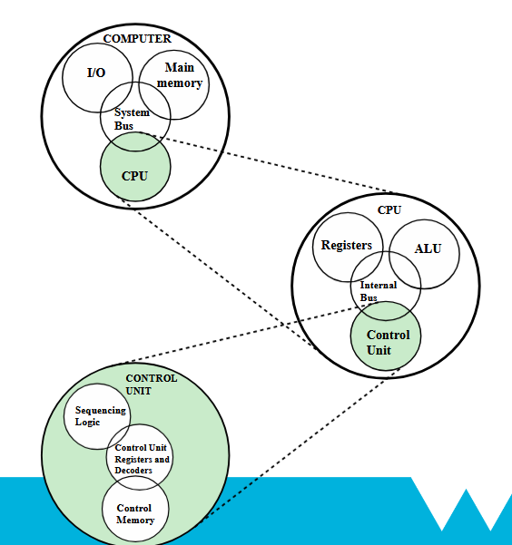

### History of Computer Architecture

**Moore's Law**. Prediction that number of transistors on a chip would double every 2 years

Early improvements arose from Moore's law and RISC architectures, utilising instruction-level parallelism and caches.

Slowing of Moore's Law and end of Dennard scaling made it not possible to continue leveraging instruction-level parallelism
* single processor performance improvement ended in 2003

New models for performance are required, e.g.

* **Vector architectures**: exploiting data-level parallelism
* **Thread-level parallelism**: multithreaded model of execution
* **Request-level parallelism**: user requests for a service are dealt in parallel

### Flynn's Taxonomy

**Flynn's taxonomy** divides computers into four types:

* **single instruction, single data** (SISD)
    * instruction-level parallelism

* **single instruction, multiple data** (SIMD)
    * data level parallelism, including
    * vector architectures
    * multimedia extensions
    * graphics processor units

* **multiple instruction, single data** (MISD)
    * no commercial implementation

* **multiple instruction, multiple data** (MIMD)
    * thread LP, request LP
    * tightly-coupled MIMD
    * loosely-coupled MIMD

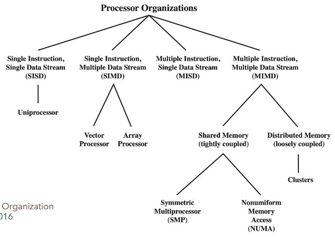

### Measuring performance

Typical performance metrics:
* **response time**: $\text{finish time} - \text{start time}$
* **throughput**: $\text{work done} / \text{time}$


**Speedup**:
$$\text{speedup} = \frac{\text{old time}}{\text{new time}}$$

**Execution time**
* wall clock time: includes all system overheads
* CPU time: cnly computation time

**Benchmarks**
* often discredited as often designers optimise chips only for benchmark tests rather than real-world software

### Components of a computer

**Four main structural components of a computer**
* **CPU**: controls operation of computer and performs data processing functions
* **Main Memory**: stores data
* **I/O**: moves data between computer and external environment
* **System interconnection**: mechanism for communication between components

**Components of a CPU**
* **Control Unit**: controls operation of CPU
* **Arithmetic and Logic Unit** (ALU): performs data processing function
* **Registers**: provides storage internal to the CPU
* **CPU interconnection**: communication within the CPU

## 2. Main Memory Organisation

### Memory Hierarchy

**The Designer's dilemma**
* we desire low cost and high capacity, but also high performance
* fast memory is typically more expensive and less available in quantity

To solve the problem, we choose both by organising memory into a hierarchy

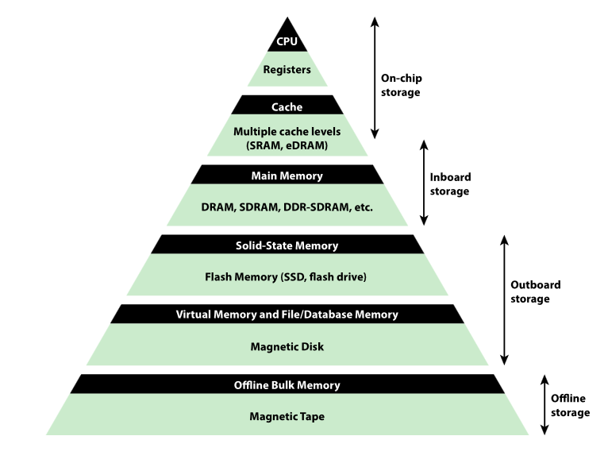

As we go down the memory hierarchy,
* decreasing cost per bit
* increasing capacity
* increasing access time
* decreasing frequency of access of the memory by the processor

Memory is designed in a hierarchy due to the **principle of locality**.

**Temporal Locality** (**TIME**): if a memory location is is accessed, it is likely to be referenced again in the near future. For example,

```c
int sum = 0;
for (int i = 0; i < 10; i++)
    sum += i;
```

* the variable `sum` has *temporal locality* as it is accessed regularly

**Spatial Locality** (**SPACE**): if a memory location is accessed, it is likely that nearby memory locations will be referenced in the near future

```c
for (int i = 0; i < 10; i++)
    printf("%d\n", arr[i]);
```

* elements of array `arr` have *spatial locality* as elements are accessed in a contiguous manner

A reasonable assumption: 90% of memory accesses are within $\pm 2$ kilobytes of previous PC position.

### Random Access Memory (RAM)

Random access memory is a semiconductor memory type that:
* can rapidly read/write using electrical signals
* volatile (requires constant power supply)

Two main categories of RAM: dynamic ram, and static ram.

#### DRAM

The basic element is a memory cell, made up of a capacitor and transistors. It can be read from and written to. Includes these three lines:
* *select*: enable a particular memory cell
* *r/w*: indicate read or write
* *data*: input when writing or output when reading

Cells are arranged in a $W \times B$ grid. e.g. $16 \times 8$ denotes 16 words, each of 8 bits.

**Address pins and data lines**.
* The number of **address pins** is $\log_2 W$ as we need a decoder to select any particular word (row) in the grid
* The number of data lines is $B$, where $B$ = word size.

The optimal way to arrange the memory cells is by arranging them in a **square**. This minimises the space required for address decoding and therefore maximises space used for memory cells.

**Example**. For a $2^{16}$ bits memory unit, we arrange it in a square of $256 \times 256$. That is 256 rows, so we require a $8$-$256$ decoder, so the row address is $8$ bits. Since the output is a $16$-bit word, we need to choose one of 16 columns, so the column address is $4$ bits. In total, the address is $12$ bits.

**Example**. For a typical 16-Mbit DRAM (4M $\times$ 4), we have $4 \times 2^{20} \times 4 = 2^{24}$ bits in total. The output is $4$ bits so we have $2^{22}$ possible addresses. That means $22$ address bits. However, this DRAM multiplexes the address pins by splitting into row and column addresses and sending them separately, so there are only $11$ physical address pins.

#### Interleaved Memory

Interleaved memory is a *collection of DRAM chips*, grouped together. Each bank is independent. Interleaving addresses among $n$ memory units is known as a $n$-way interleaving.

Motivations:
* $n$ banks can service $n$ requests simultaneously
    * accesses can overlap and hence save time
* storing consecutive words in different banks speeds up memory transfer

An effective use of interleaving memory is when number of memory banks is a multiple of the number of words in a cache line.

In a $2^k$-way interleaving, the last $k$ bits are reserved for the bank select.

#### Advanced DRAM organisations

The interface to main memory is a critical performance bottleneck. To achieve better system performance we can also consider advanced DRAM organisations.

##### Synchronous DRAM (SDRAM)

In normal DRAM, processor must wait for some time for the data to be available after requesting- this is called the "access time"

SDRAM will **synchronously exchange data** with the processor according to an external clock signal
* external clock signal runs at the full speed of the processor
* to avoid wait-states on memory

There is:
* **burst mode** to eliminate address setup time after the first access
    * good for transferring large blocks of data serially
* **multiple-bank** internal architecture
* **mode register** to specify the burst length

##### DDR SDRAM

**Double Data Rate** (DDR) SDRAM sends data to the processor twice per bus clock cycle, on both the rising and falling edges

DDR achieves higher data rates in three ways:
* data is synchronised to both edges of the clock so twice the amount of data can be sent
* higher clock rate on the bus
* buffering scheme is used:
    * *2n-prefetch architecture* using a prefetch buffer

#### Static RAM

**Static RAM** cells are a bi-stable flip flop connected to the internal circuitry by two access transistors. The data in an SRAM cell is volatile, however, does not require a refresh cycle

Dynamic memory cells are generally simpler and more compact:
* greater cell density
* cheaper as only uses one transistors and one capacitor
* refresh circuitry incurs one-off cost

SRAM typically has:
* better read/write times than DRAM
* uses flip-flop logic gate configuration
* more expensive as uses more transistors
* will hold data as long as power is supplied to it

**Note**. Cache memory is often implemented as SRAM, while DRAM is commonly used for main memory.

#### eDRAM

**Embedded DRAM** is DRAM integrated on the same chip - intermediate between on-chip SRAM and off-chip DRAM.

Cost per bit is higher compared to DRAM but is lower than SRAM. Access time to eDRAM is greater than SRAM, but because of proximity and wider busses, provides faster access than DRAM

Fundamentally, eDRAMs use the same design and architectures as DRAM

### Read-only Memory (ROM)

**Read only memory** is a type of non-volatile data storage - no power source required to maintain state.

Several key applications:
* microprogramming, system programs, function tables

Several types of ROM, including PROM, EPROM, EEPROM, and flash memory

##### Programmable ROM (PROM)

**PROM** is electrically writable, non volatile, written once.
* provides flexibility and convenience
* required equipment is specialist
* allows the user/programmable to write to the chip

##### Erasable Programmable ROM (EPROM)

**EPROM** is read-mostly memory, and is electrically writable. 
* chips are designed to incorporate a window, allowing a user to shine an intense UV light onto the storage to erase the content
* allows data to be rewritten but more expensive to produce

##### Electrically Erasable Programmable ROM (EEPROM)

**EEPROM** allows individual bytes to be erased and rewritten
* overcoming the disadvantage of EPROM at the expensive of long write operations (400-800ms per byte)
* significantly more expensive and less dense than EPROM

##### Flash Memory

**Flash memory** is a semiconductor memory used both for internal and external memory applications. Used in secondary storage like SSDs
* Termed "flash" due to the high-speed at which individual blocks of memory can be erased

Limited to block-level erasure. Uses one transistor per bit. Density is superior to EEPROM and almost identical to EPROM

## 3. Virtual Memory

### Design Principles for a Memory Hierarchy

**Three main design principles**.
* **locality** - temporal and spatial locality
    * what makes the hierarchy possible
* **inclusion**
    * each higher memory level is a *subset* of the one below
* **coherence**
    * copies of the same data unit in adjacent memory levels must be consistent
    * horizontal and vertical coherence

If we have a memory hierarchy $M_1, M_2, \cdots, M_N$ like this:

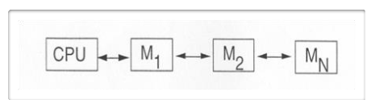

Three essential properties are:
* **cost per bit**: $C_i > C_{i+1}$
* **access time**: $t_{Ai} < t_{Ai+1}$
* **capacity**: $S_i < S_{i+1}$

**The performance of a memory hierarchy depends on**:
* address reference statistics - order and frequency of addresses generated by the program
* access time of each level
* storage capacity at each level
* size of blocks transferred between levels
* allocation algorithm

#### Performance Modelling 

Consider a memory hierarchy of two levels: $(M_1, M_2)$.

**Average cost per bit** for the combined memory:
$$C_s = \frac{C_1S_1 + C_2S_2}{C_1+C_2}$$

**Goal**: to make $C_s$ approach $C_2$, given that $C_1 >> C_2$,
* as we want cost per bit to be as cheap as possible,
* we **must have** $S_1 < S_2$
* the bigger $S_2$ compared to $S_1$, the more we can reduce relative combined costs

**Average access time** to access an item:
$$t_{Av} = Ht_1 + (1-H)(t_1 + t_2)$$

where
* $t_i$ is the access time to level $i$
* and $H$ is the hit ratio, probability address is in $M_1$.

**N.B.** $1-H$ is often known as the *miss ratio*.

Block transfer uses slow I/O, therefore $t_2 >> t_1$. Hence, for access efficiency $e = t_1 / t_{Av}$ to approach 1, we **must have** $H$ to approach 1. Thus, performance is often measured as the *hit ratio*. We prefer for this value to be as high as possible.

**Memory space utilisation** is the efficiency at which space is being used at any time.
$$u = \frac{S_u}{S}$$

where
* $S$ is the total amount of memory space
* $S_u$ is the memory space occupied by active user programs

The $(S-S_u)$ words of $M_1$ that represent wasted space can be attributed to:
* **empty regions** - caused by fragmentation
* **inactive regions** - regions containing data that was brought in but never actually used by the CPU before being removed again
* **system regions** - regions occupied by memory-management software

### Virtual Memory

**Virtual memory** is a hierarchical memory system, managed by the operating system. To a programmer it appears as a single large memory.

* makes programs independent from memory system capacity
Key reasons for using virtual memory:
* frees programmer from having to allocate storage
* allows for efficient sharing of memory space among processes
* takes advantage of memory hierarchy
* simplifies loading of programs for execution

**Def**. *Multiprogramming* is having multiple programs in memory at the same time.
* programs running must reside in main memory
* since virtual memory is larger than main memory, if required data isn't in main memory it must be **swapped in** from secondary storage

**Address translation**. Virtual addresses are translated to physical addresses by the memory management unit (MMU).

**Locality of reference**.
* **temporal locality**: items once referenced are likely to be referenced in the near future
    * e.g. iterative loops, access to variables
* **spatial locality**: program often references items whose addresses are close by
    * e.g. elements in an array
* **sequential locality**: most instructions in a program are executed in sequential order

**Demand Paging**.
* loading an entire program's virtual address space has a large overhead
* **solution**: each page of a process is brought in **ONLY** when it is needed
* **Def**. A *page fault* occurs when the program references a page that isn't in main memory. This tells the OS to bring in the desired page.
* main memory is often referred as **real memory** since programs can execute only in main memory

#### Page Tables

Translation between logical and physical addresses is done using the **page table**.

However, when virtual address space >> memory space, most table entires will be empty. A possible solution is a **multi-level page table**

**Advantages**:
* page table memory is proportional to amount of memory used by process

**Disadvantages**:
* each page table lookup now needs multiple memory accesses

##### Inverted Page Tables

**Inverted Page Tables**. An alternative that stores **one entry for each physical memory frame**. This could be efficient as there are typically less physical frames than virtual pages.

However, since the CPU is only given the virtual page number, finding which frame index contains it is difficult. Hence, the **virtual page number** is hashed to make searching efficient.

The process of determining if the VPN exists is called a *probe*.

**Lookup process**:
1. hash the page number
2. index into the page number.
3. search the linked list, and if a tag matches the page number, return the frame number.
4. if no tag matches, there is a *page fault* -> call the page fault handler.

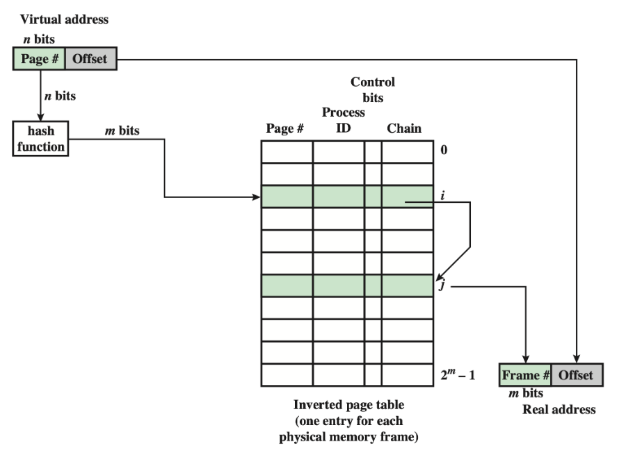

Experimental evidence suggests that the average number of probes for access is 1.5 with a well-designed hashing algorithm.

In practice, it is desirable to have a page frame table with **twice** the number of entries than the number of physical frames.

#### Segmentation

**Segmentation** is a largely obsolete memory management technique that divides virtual memory into *variable length* sets of contiguous addresses, each assigned access and usage rights. This is visible to the programmer.

Segmentation provides the following advantages (not available simply with paging):
* simplifies growing data structures
* allows programs to be recompiled independently without relinking everything
* **lends itself to be shared among processes**
* **lends itself to protection through assignment of access privileges**

However it has limitations:
* **inefficient memory usage** - due to external fragmentation
* **replacing a block is difficult** - finding a hole is costly

In modern day systems, **segmented paging** is used, which divides a process's address space into logical segments, which are further divided into pages. 

Each process's *stack*, *heap*, *data*, and *code* are memory segments.

#### Translation Lookaside Buffer

In a paged system, every virtual memory reference causes two physical memory accesses:
1. fetch page table entry
2. fetch data

With segmented paging, more memory access may be required. This is inefficient.

A common solution is the **translation lookaside buffer** (TLB), which is a cache for the MMU, with the most page table entries.
* typically 32-128 entries, 4 to 8-way set-associative

**Problem**. Switching processes is expensive because the TLB has to be flushed
* Solution: include process ID in TLB entries to avoid flushing

Average address translation time, $t_t$, is given by

$$t_t = T_{tlb} + (1-H_{tlb})t_{mt}$$

where
* $t_{tlb}$ is the TLB translation time
* $t_{mt}$ is the table look-up time on a TLB miss
* $H_{tlb}$ is the TLB hit ratio

The TLB miss ratio is usually low, typically less than 0.01.

#### Page Size

Page size ($S_p$) has an impact on the memory space-utilisation factor $(u)$:
* if $S_p$ is *too large* then we have excessive **internal fragmentation**
* if $S_p$ is *too small* then **page tables become large** and we have less useful memory.

The optimal page size $S_p$ grows sublinearly with the average segment size $S_s$:

$$S_p^\text{OPT} = \sqrt{2S_s}$$

This is derived by differentiating $u$ with respect to $S_s$.

Page size also has an impact on the hit ratio, $H$.
* if $S_p$ is *too small*, then it is **less likely that two addresses are in the same page**.
* if $S_p$ is *too large*, not many pages fit in memory, so another useful page may not be present. This is the case if the next address is not nearby.

Hence, hit ratio is optimised for some optimum page size. In Linux, a page is usually chosen to be $4\text{KB}$.

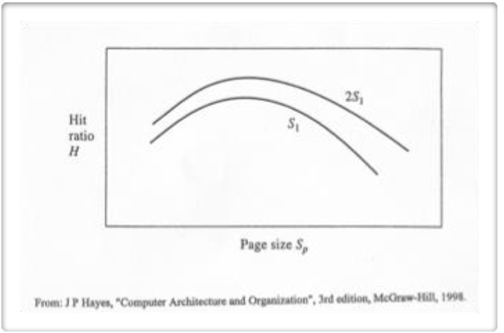

### Page Replacement Algorithms

When a *page fault* occurs, the memory management software is called to swap in a page from secondary storage. If the main memory is full, it is necessary to evict a page. There are a few choices for a page replacement algorithm.

**Thrashing** occurs when there are too many processes in too little mmeory, so the OS spends all its time swapping -> little or no real work is done.

Solutions:
* good page replacement algorithms
* reduce number of processes running (*degree of multiprogramming*)
* install more memory 

##### Random Page Replacement

Implemented using a pseudorandom generator. **Poor performance** is expected as no relationship is considered between the pages resident in memory and their use.

##### FIFO Page Replacement

Selects the page that has been in main memory the longest to replace.
* **Advantage**: no additional hardware required
* **Disadvantage**: no consideration of page usage, so pages can be removed and loaded too often.

##### Clock Replacement Algorithm

Modification of FIF  that considers the usage of pages. Each page entry has a 'use' bit, which is set to $1$ when a page is referenced.

When a page fault occurs, the algorithm finds a page with use bit of $0$ to replace, and resets the use bits of all other pages.

Called "clock replacement" as the pointer moves in a clockwise manner.

##### Least Recently Used Algorithm

The page not referenced for the longest time is swapped out. A full implementation requires an *age counter* per entry, which is difficult to implement for a large number of pages.

Typically, an approximation is used, which
* on each memory access, set 'use' bit to $1$
* at a set interval, say 1ms, all 'use' bits are examined and reset to $0$ when read.
* whenever we need to evict a page, we select one that has a reference bit of $0$.

This ensures that we don't evict pages that were used in the last $\text{interval}$ seconds (e.g. 1ms). If two or more pages have a use bit of $0$, a tiebreaker is needed.

As the interval time reduces, the approximation becomes closer to the true LRU algorithm.

##### Working Set Replacement Algorithm

**Def**. The working set $w(t, T)$ is the collection of pages referenced during the time interval $(t-T, t)$.

The idea of the working set policy is to ensure that each process keeps its working set in memory. The algorithm replaces the page that hasn't been referenced in the immediately preceding $T$ units of process time.
* we use *process time*, **not absolute time**, as the process may be interrupted

**Limitations**:
* determining the working set is time consuming and difficult.
* abrupt changes occur when a new process is started in a multi-programming environment

**Note**. $T$ is a tuning parameter, chosen to achieve performance.

## 4. Cache Memory

### Introduction

Cache memory contains a copy of sections in main memory, and relies on the 'locality of reference' principle.

**Definitions**.
* **Def**. A **block** is the *minimum unit of transfer* between cache and main memory.
* **Def**. A **line** is a portion of cache memory capable of holding one block.
* **Def**. The **tag** is a portion of a cache line used for addressing purposes

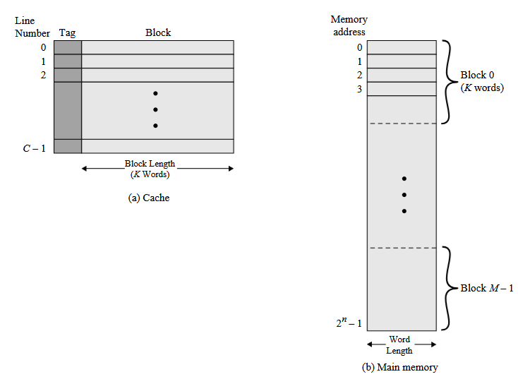

A **cache hit** occurs when the line exists in cache. A **cache miss** occurs when the line isn't present.
* A *read miss* is when the processor requests a line in cache that isn't present
* A *write miss* is when the processor writes to an address that isn't present in cache

##### Logical vs Physical Cache

When virtual addressing is used, the designer may choose to place the cache before or after the MMU.

* A **logical (virtual) cache** stores data using virtual addresses. The processor accesses the cache directly without going through the MMU. Here, the cache is placed *before* the MMU.

* A **physical cache** stores data using main memory physical addresses. Here, the cache is placed *after* the MMU.

##### Hit ratio

The cache hit ratio $h$ is given by
$$h = \frac{\text{number of times words are in cache}}{\text{total number of memory references}}$$

The quantity $(1-h)$ is known as the cache 'miss ratio'.

For a cache system, typically a hit ratio of $0.7-0.9$ will provide good performance.

##### Access Time

**Access Time**. Assuming the cache is always accessed first, the average access time, $t_a$, is given by

$$t_a = t_c + (1-h)t_m$$

where
* $t_c$ = cache access time
* $t_m$ = main memory access time

The objective is to make $t_a/t_c$ approach $1$, hence a high hit ratio is desired.

### Cache Organisations

As there are fewer cache lines than main memory blocks, an algorithm is needed for mapping main memory blocks into cache lines.

#### Direct Mapping

**Direct mapping** maps each block of main memory into only one possible cache line. This is done by computing the $\text{block number} \pmod{\text{no. of cache lines}}$.

The CPU address is divided into three fields:
$$[\text{tag}][\text{line}][\text{offset}]$$

where
* the *offset* is the offset into the data block,
* the *line* is used to calculate the **index** in the cache its mapped to,
* and the *tag* is used to check if the data matches

The tag is **necessary** because multiple blocks can map to the same cache line.

If the tag matches the CPU address, the cache entry is used by the CPU. Otherwise, a **cache miss occurs** and the new data is fetched from main memory.

**Advantage**: simple and inexpensive to implement.
**Disadvantage**: fixed cache location for any given block.
* if block $0$ and block $8$ both map to cache line $0$ and we access them alternately, there will be an eviction each time.

##### Victim Cache

The **victim cache** is a proposed solution to reduce conflict misses of direct mapped caches. 
* It is fully associative, typically containing 4 to 16 cache lines, residing between direct mapped L1 and the next level of memory.
* Stores evicted data from the L1 cache
* Note that the two caches are exclusive.

#### Set Associative

**Set associative** caches consist of a number of sets, each set contains a number of lines. A given block maps to **any line in a given set**.
* **Def**. The *way* of a set associative cache is the **number of lines in each set**.

The CPU address is divided into three fields:
$$[\text{tag}][\text{index}][\text{offset}]$$

where
* the *offset* is the offset into the data block,
* the *index* chooses the **set number**,
* and the *tag* is used to check if data matches

The cache checks all potential blocks in the set with a **parallel tag check** to see if the block wanted is present.

#### Fully Associative

**Fully associative** caches are basically set associative caches with **one set**, i.e. a block can go in *any* cache line.

The CPU address is divided into two fields:
$$[\text{tag}][\text{word}]$$

where
* the *offset* is the offset into the data block,
* and the *tag* is used to check if data matches

The cache is fully associative, so **all tags** have to be compared with the CPU address.

**Advantages**:
* overcomes disadvantage of direct mapping by permitting each main memory block to be loaded into *any* line of cache.
* cache can be of any size, not determined by size of line field in CPU address.

**Disadvantage**:
* complex circuitry required to examine the tags of all cache lines in parallel.

##### Content Addressable Memory

**Content Addressable Memory** is a memory type that can be used to implement the parallel tag check. It searches *in parallel* if a block exists, returning the address where the match is found.

It is constructed of SRAM cells but is considerably more expensive and holds much less data.

##### Way Prediction Cache

An optimisation is to use **way prediction** to speculatively select a way from the set to check, before performing the expensive parallel tag check.

### Replacement Policies

For fully associative and set-associative mapping, we need to establish a policy for block replacement when there is a cache miss.

Three general approaches:
* Random
* First In, First Out (FIFO)
* Least Recently Used (LRU)

The most effective usage-based algorithm is LRU. It can be implemented fully when the number of lines is small, e.g. in a 4-way set-associative cache

**Note**. Replacement mechanism *must be implemented totally in hardware*

**Implementation**.
* A counter ("age register") is associated with each line

* **When a hit occurs**:
    * the counter associated with the hit line is reset to $0$,
    * and all counters **having a smaller count** than the original value are incremented by $1$

* **On a miss** when the cache is full, 
    * the line with the maximum counter value is chosen for replacement.
    * Its counter is reset to $0$,
    * and all other counters are incremented by $1$.

**Intuition**. The *counter* stores the *relative age order* of the cache lines, with $0$ being the newest. On a hit, we make the hit line have the newest age, and shuffle newer cache lines by incrementing by $1$.

The counter with the largest value identifies the **least recently used line**.

### Write Operations

Writing to cache can result in the cache and main memory having inconsistent data. It is necessary to be coherent if
* input/output transfers operate on main memory contents
* multiple processors share main memory

Two common methods: *write through* and *write back*.

##### Write through

In **write through caching**, all write operations are made to main memory as well as to the cache (we 'write through the cache')

**Advantage**: Simplest technique

**Disadvantage**: Generates substantial memory traffic and may create a bottleneck.

##### Write back

In **write back caching**, updates are made only in the cache by setting a *dirty bit*. When a block is replaced, it is written back to main memory only when the dirty bet is set (data was changed).

**Advantage**: Minimises memory writes

**Disadvantages**:
* Portions of main memory are invalid and hence I/O accesses can be allowed only through the cache
* Makes for complex circuitry and a potential bottleneck.

#### Write Misses

A **write miss** is when we try to write to a word that isn't present in cache. In an event of a **write miss**, we have two strategies:

* **Write allocate**: block containing word is **fetched from main memory** (or next level cache), and the processor writes to the block.

* **No write allocate**: the block containing the word is *modified in main memory*, and **not loaded into the cache**.

Either policy can be used with write through or write back, but
* **no write allocate** is most commonly used with *write through*.
    * because we push changes to main memory already
* **write allocate** is most commonly used with *write back*.
    * because we store modified changes in cache

### Multilevel Caches

On-chip cache is desirable as it reduces external bus activity, speeds up execution time, and increases overall system performance, but there a limited capacity for on-chip cache.

To solve this, **multiple levels of cache are used** (L1, L2), each further away from the CPU, with increasing size but decreasing cost and increasing access time.

**Problems with this**:
* potential savings due to L2 cache depends on the hit rate of L1 and L2.
* complicates design issues related to caches, including size, replacement algorithm, and write policy.

**Inclusive Policy**. Each cache is a subset of the cache below it. So on a L2 cache miss, new data is written to both L1 and L2.

##### Cache Coherency

If we have more than one cache serving different CPUs, altering data in one cache invalidates other caches as well.

**Solutions** (discussed later in detail).
* *bus watching with write through*
    * monitor address lines to detect write operations to memory
* *hardware transparency*
    * additional hardware is used to synchronise caches
* *noncacheable memory*
    * all accesses to shared memory are cache misses, because the shared memory is never copied into the cache


##### Unified vs Split Cache

As with a Harvard architecture, performance can be improved by having separate caches for instructions and data.

* **instruction cache**: read only, so no need to write back to main memory when block overwritten

* **data cache**: less predictable accesses, cache is larger in size. reads and writes are common.

Typically, **split cache is used for L1** (L1i, L1d), whilst unified cache is used for the remaining levels. This
* reduces the bottleneck for fetching instruction and data,
* and allows each part to be optimised differently as they are used differently

## 5. Cache Optimisation

### Basic Cache Optimisations

Recall the equation for average memory access time,

$$\text{average memory access time} = \text{hit time} + (\text{miss rate} \times \text{miss penalty})$$

Basic cache optimisation can be classified into three cateogries:
* **reducing the miss rate**: larger block size, larger cache size, higher associativity
* **reducing the miss penalty**: multilevel caches and giving reads priority over writes
* **reducing the hit time**: avoiding address translation when indexing the cache

#### Types of Cache Misses

We can categorise the types of cache misses into:
* **compulsory**
    * the data has never been loaded before
* **capacity**
    * the cache is too small to hold all the needed data
* **conflict**
    * there is room, but block was evicted due to cache's placement rules
* **coherency**
    * *only in multicore processors* - when another core changes shared data

#### Basic Cache Optimisation Approaches

##### (1) Larger Block Sizes

Reduces the miss rate at the cost of cache miss penalty.

* **Advantage**: Larger block sizes may result in a *lower miss rate* due to higher spatial locality. 

* **Disadvantage**: Since cache size is fixed, this decreases the number of lines in cache, which could *increase cache miss penalty* and increase the number of capacity and conflict misses.

##### (2) Larger Caches

Reduces the miss rate at the cost of hit time

* **Advantage**: Larger caches *decreases the miss rate* as we can fit more data in it.

* **Disadvantage**: Can cause longer hit times and increased power consumption as checking for the presence of a line is more complex.

##### (3) Higher levels of associativity

Reduces the miss rate at the cost of hit time

* **Advantage**: Increased cache associativity reduces the number of conflict misses

* **Disadvantage**: Can cause longer hit times due to more complex parallel checks, and increased power consumption

##### (4) Multilevel Caches

The overall impact of multilevel caches is to *reduce the miss penalty*.

Level 1 cache can keep pace with clock cycle times, whilst L2 and further caches serve to reduce the number of main memory accesses.

We can redefine average memory access time for two caches:

$$\text{average access time} = \text{Hit time}_\text{L1} + \text{Miss rate}_\text{L1} \times (\text{Hit time}_\text{L2} + \text{Miss rate}_{L2} \times \text{Miss penalty}_\text{L2})$$

On a L1 read miss, instead of going to main memory, we now go to the L2 cache. This decreases the overall access time.

##### (5) Prioritising read misses over writes

Typically, a **write buffer** is used to store pending writes to main memory. If there is a read miss, sending the read before the writes will reduce the miss penalty, as the read *is not queued behind write operations*.

There is one caveat, which is the **read after write** hazard. If a write buffer *holds the updated value for a location needed on a read miss*, we cannot schedule the read before the writes.

This is a common optimisation in most modern processors, as the cost of doing so is almost non-existent.

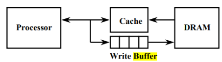

##### (6) Avoiding address translation during cache indexing

Usually, the cache is **physically indexed, physically tagged**. This means that address translation must occur *before* the cache is accessed.

An optimisation is using a **virtually indexed, physically tagged** cache. This means that the *set* of the set-associative cache is virtually determined, whilst the tag is physically determined.

Usually, the physical address is divided for the cache like this:
$$[\text{tag}][\text{index}][\text{block offset}]$$

The virtual address is divided as follows:
$$[\text{virtual page number}][\text{page offset}]$$

Since page offset **does not change** during address translation, we can take the *set index* from the page offset **before address translation**, and index into the cache *whilst* address translation occurs.

This reduces the **hit time** as we are overlapping cache access and address translation.

**Downside**. To keep the index within the untranslated page offset (which is usually fixed to 12 bits), we must have a restriction on the maximum number of sets.

**Solution**. Increase the associativity of the cache instead.

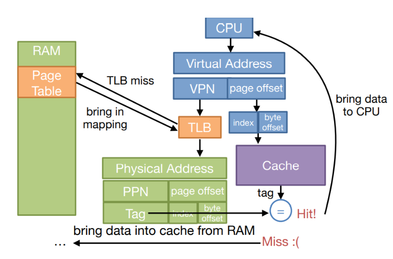

### Advanced Cache Optimisations

#### (1) Controlling L1 cache size and complexity

This reduces hit time and power consumption at the cost of increasing the miss rate.

Fast clock cycles encourage the use of **small and simple Level 1 caches**
* the level 1 cache must keep pace with the processor
* if a L1 lookup takes too long, it may not complete within one CPU clock cycle

Using lower levels of associativity can reduce hit times as the parallel tag check would be less complex and take less time.

#### (2) Way prediction

Way prediction is a technique used to **predict the way** (block within the set) of the next cache access, so a pre-emptive tag comparison and cache read can be executed. In the case the prediction is wrong, we then execute the parallel tag check.

This requires "*block predictor bits" to be added to each block of the cache. Prediction accuracy is commonly $>90\%$ for 2-way associative caches and $>80\%$ for 4-way.

Overall, this *reduces hit times* and *power consumption* as we perform less parallel checks on average.

#### (3) Pipelined cache access

Cache access typically consists of multiple stages:
1. use the index to select the relevant cache set
2. read stored tags and data from that set
3. parallel tag check
4. if there is a hit, select and send the correct data to the CPU

Cache access can be pipelined, so different stages can occur simultaneously. 

**Advantages**:
* **Increases bandwidth/throughput** as more cache accesses can completed over time
* **Allows a faster clock** as we divide work into smaller stages.

**Disadvantages**:
* **This increases hit time** as splitting into stages introduces pipeline overhead
* **Increases penalty on branch mispredictions** as more cache access stages may contain instructions from the incorrect path
* **Increases penalty on cache misses** as the miss is detected later because the L1 lookup takes multiple stages

#### (4) Multi-bank caches

This organises the cache as independent banks to support simultaneous access. 

The primary aim is to increase cache bandwidth, and is ideal if cache access naturally spread themselves across banks. 
* A technique for this is to spread block addresses sequentially across banks, known as **sequential interleaving**.

This increases bandwidth and reduces power consumption, as an access can only activate only the required bank.

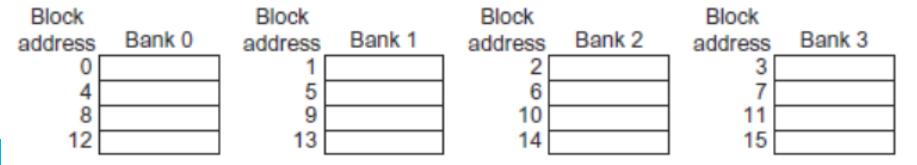

#### (5) Non-blocking caches

A *blocking* cache stops servicing requests after a miss - it stalls as it is handling the cache miss.

An optimisation is to use a **non-blocking cache**, which can continue accepting and servicing requests while one earlier request is waiting for a missing block.

**Advantages**:
* *reduces miss penalty* by allowing cache to continue supplying hits following a miss, known as a **hit-under-miss**.
* possible to extend this to achieve **hit-under-multiple-miss**, which further reduces miss penalty.

**Disadvantage**:
* non-blocking cache performance can be difficult to measure and model

Overall, this increases bandwidth and reduces the miss penalty.

#### (6) Critical word first & early restart

On a cache miss, a whole block is fetched, but the processor only actually just needs one word.

Two strategies that can address this:

* **Critical word first**
    * *request the missed word first*, and send it as soon as it arrives, allowing the processor to continue execution while receiving the remainder of the block

* **Early restart**
    * *fetch words in normal order*, and send the requested word to the processor as soon as it arrives.

This is beneficial for large caches, particularly where blocks are large. This reduces the miss penalty.

#### (7) Merging write buffer

**Merging write buffers** is a technique that merges write buffer entries when possible, instead of adding a new entry.
* checks if the write buffer contains an entry with the same address
* if match is found, merge the data - this is known as **write merging**

This reduces miss penalty as less writes are sent to main memory. Small caveat - memory mapped I/O registers require special consideration.

#### (8) Hardware prefetching

**Hardware prefetching** is the principle of moving instructions/data into cache before being requested by the processor. This is **runtime prefetching**.

Instruction prefetch is done using hardware separate from cache:
* processor typically fetches two blocks on a miss: requested block and the (prefetched) next block
* prefetched block is put in the **instruction stream buffer**
* if requested block is in the instruction stream buffer, the block is read from there

**Note**. We do not put prefetched instructions in the cache because it is *only a prediction*. Putting prefetched data into the cache could evict useful instructions, which is known as **cache pollution**.

This reduces the miss penalty and miss rate.

#### (9) Compiler-driven prefetch

**Compiler-driven prefetching** is where the compiler inserts prefetching instructions based on the source code, before execution. This can reduce miss rate and miss penalty as 

Two types of compiler prefetching:
* **register prefetch** - values loaded into a register
* **cache prefetch** - loads values (data only) into cache

An example of cache prefetching:

```c
for (int i = 0; i < n; i++) {
    prefetch(&a[i + 16]);   // bring future data closer now
    sum += a[i];             // use current data
}
```


An example of register prefetching (also known as *software pipelining*):

```c 
next = a[0];

for (int i = 0; i < n - 1; i++) {
    current = next;
    next = a[i + 1];      // load future value early
    sum += current;
}

sum += next;
```

## 6. Algorithmic Optimisations and Code Refactoring

### Introduction

The aim of **optimisation** is to reduce the amount of work required, or reduce execution time per work-unit.

Computers possess multiple subsystems that can influence performance:
* processor speed
* memory bandwidth / latency
* network bandwidth / latency

A program can either be:
* **memory bound**: performance dominated by loads/stores of data,
* or **compute bound**: performance dominated by integer/floating-point operations.

##### Peak FLOPs

The most common metric for performance is **FLOPs** (floating point operations per second).

**Def**. *Peak FLOPs* is the maximum achievable FLOPs for a given machine. It is a theoretical maximum, presuming no cost to memory operations.

A program's efficiency is given by
$$\frac{\text{achieved FLOPs}}{\text{peak FLOPs}} * 100\%$$

**Example**: For a modern 2.4G quad core machine capable of SSE4.2 vectorisation:

$$\text{Peak FLOPs} = \underbrace{2.4\text{GHz}}_\text{clock speed} \times \underbrace{4}_\text{cores} \times \underbrace{4}_\text{SSE SIMD} \times \underbrace{2}_\text{1 multiply + 1 add operation / cycle} = 76.8 \text{ GFLOPs}$$

##### Cache Performance Concerns

**Cache misses are much more expensive than cache hits**
* L1/L2/L3/DRAM memories have increasing latencies and decreasing bandwidths
* memory performance largely depends on $\text{cache hit : miss}$ ratio.

##### Speedup

The **speedup** is the ratio of performance increase between two implementations. For optimisation, it is given by

$$\text{speedup} = \frac{\text{unoptimised time}}{\text{optimised time}}$$

##### Optimisation Approaches

Optimisation techniques can fall under one of three categories:

* **algorithmic**:

    * implementations with lower algorithmic complexity
* **code refactoring**
    * convincing the compiler to apply optimisations
    * promote efficient cache use via good spatial and temporal locality
    * minimise overheads and simplify code for the compiler

* **parallelisation**
    * executing multiple tasks in parallel, e.g. vectorisation, multithreading

### Loop Optimisations

The majority of an application runtime tends to be in executing loops, so there are many loop-focused optimisations.

**Def**. a *kernel* in HPC/GPU programming is a small fragment of code, usually a loop, that is the **computational core**.

#### Inter-Loop Dependencies

A **loop dependency** is where one or more loop iterations are dependent upon the completion of another loop iteration.

**Example 1**. All loops depend on iteration 0

```c
for (i = 0; i < n; i++) {
    a[i] = i + a[0];
}
```

**Example 2**. An iteration $i$, depends upon the completion of iteration $i-1$, creating a chain dependency.

```c
for (i = 1; i < n; i++) {
    a[i] = a[i] + a[i-1];
}
```

**Example 3**. Iteration $i$ depends upon iteration $i+2$ having not yet run (potential parallelism issue).

```c
for (i = 1; i < n; i++) {
    a[i] = a[i] + a[i-2];
}
```

Loop dependencies *often interfere with parallelisation* due to the need to preserve order.

**Detecting loop dependencies**: analyse how each variable is used within a loop iteration
* if the variable is only read and never written -> *no dependencies*.
* if a variable is written and a different iteration accesses it -> *there are dependencies*.

#### Pointer Aliasing

**Pointer aliasing** is where multiple pointers point to the same or overlapping memory location. 

Compilers may assume pointers are aliased, which prevents optimisation as aliased pointers can introduce hidden loop dependencies.
* compiler may not want to optimise as it **doesn't know** whether they're different

For example, if `b` is an alias of `a`, then the below code is an example of a **hidden loop dependency**.

```c
for (i = 1; i < n; i++) {
    a[i] = a[i] + b[i-1];
}
```

We can give the compiler hints using the `restrict` keyword, which tells the compiler it can assume the pointer's memory **is not aliased by any other independent pointer**.

For example, here we can guarantee that `a` and `b` are different arrays

```c
void add(size_t n, int *restrict val1, int *restrict b) { ... }
```

#### Loop Peeling

**Loop peeling** is where one of more iterations from a compute loop are extracted and moved outside the body of the loop, with the loop range being reduced accordingly.

* This is often a necessary step in applying other more complex optimisations.

For example, we can peel out iteration 0 to remove the inter-loop dependency.

```c
unpeeled: {
    for (i = 0; i < n; i++) {
        a[i] = a[i] + a[0];
    }
}

peeled: {
    a[0] = a[0] + a[0];
    for (i = 1; i < n; i++) {
        a[i] = a[i] + a[0];
    }
}
```

#### Loop Interchange

**Loop interchange** is where the order of memory access is modified by switching the order of loops in the code.

**Requirements**:
* a perfectly nested loop (e.g. `for i, for j`)
* inter-loop dependencies must not be violated

**When to use**:
* loop order is such that memory accesses are suboptimal
* data is stored in a contiguous block of memory 

One example is **iterating over a matrix**. A matrix can be stored in:
* **row-major order**: data is a sequence of rows
* **column-major order**: data is a sequence of columns

In C, two-dimensional arrays are stored in row-major order.

If we traverse columns before rows, we get sequential memory access.

```c
for (i = 0; i < n; i++) {
    for (j = 0; j < m; j++) {
        sum += A[i][j];
    }
}
```

If we traverse rows before columns, we get memory access in strides of the $\text{row length}$. Since data is loaded in cache-lines, if the number of rows is large, it is likely that the first cache-line is evicted before it is reused. **This is suboptimal**.

```c
for (j = 0; j < m; j++) {
    for (i = 0; i < m; i++) {
        sum += A[i][j];
    }
}
```

**The performance impact is**:
* dataset fits into cache -> little impact
* dataset does not fit into cache -> significant impact

The solution is to interchange the loops to traverse columns first instead of rows. This improves **spatial locality** to *fully utilise* cache lines.

#### Loop Blocking

**Loop blocking / tiling** is the technique of splitting a nested loop into smaller blocks, to improve cache-reuse of a block or tile of memory.

**Requirements**
* perfectly nested loops (e.g. `for i, for j`)

**When to use**:
* when program has poor temporal/spatial cache locality between loop iterations
* when program is *largely memory-bound*

An example is matrix multiplication:

```c
for (i = 0; i < n; i++) {
    for (j = 0; j < n; j++) {
        for (k = 0; k < n; k++) {
            c[i][j] = c[i][j] + (a[i][k] * b[k][j]);
        }
    }
}
```

* Array $A$ has good spatial locality as it is accessed in **column-first order*, fully utilising a cache line. But it has insufficient temporal locality to prevent eviction.

* Array $B$ has poor spatial locality as it is accessed in **row-first order**, forcing numerous reloads of the same cache-line without fully utilising.

* Array $C$ has excellent spatial and temporal locality.

A solution is to use **loop blocking**, so the three internal loops now loop over $(n \times n) / b$ sub-blocks of size $b \times b$. The optimal block size is a tuning parameter.

```c
int b = BLOCK_SIZE;

for (i0 = 0; i < n; i += b) {
	for (j0 = 0; j < n; j += b) {
		for (k0 = 0; k < n; k += b) {
			for (i = i0; i < min(i0 + b, n); i++) {
				for (j = j0; j < min(j0 = b, n); j++) {
					for (k = k0; k < min(k0 + b, n); k++) {
						c[i][j] = c[i][j] + (a[i][k] * b[k][j]);
					}
				}
			}
		}
	}
}
```

This improves locality of reference by reusing cache lines within the same block. In general, with a double loop, loop blocking is implemented as follows:

```c
for (int ii = 0; ii < n; ii += TILE_SIZE_I) {
	for (int jj = 0; jj < m; jj += TILE_SIZE_J) {
		for (int i = ii; i < MIN(n, ii + TILE_SIZE_I); i++) {
			for (int j = jj; j < MIN(m, jj + TILE_SIZE_J); j++) {
				/* do something involving c[i][j], a[i], b[j] */
			}
		}
	}
}
```

Here, we are processing data in small chunks with dimensions `TILE_SIZE_I * TILE_SIZE_J`.
#### Loop Fusion

**Loop Fusion** is the technique of *merging multiple loops into a single loop*.

**Requirements**:
* two or more loops traversing the same range.
* no inter-loop dependencies that would be broken by fusion

**When to use**:
* high overhead of loop conditional checks
* poor temporal locality of memory accesses between loops
* multiple arrays storing intermediate values between loops

For example, take this code. We write to multiple temporary arrays and read from them, which could be optimised.

```c
for (i = 0; i < n; i++) {
	b[i] = a[i] * 2;
}
for (i = 0; i < n; i++) {
	c[i] = b[i] + 4;
}
for (i = 1; i < n; i++) {
	d[i] = c[i-1] - 5;
}
```

We can fuse the first two loops as they have the same range. This improves the temporal locality of `b[i]` as we read from it immediately after we write, so it is definitely in the cache.

```c
for (i = 0; i < n; i++) {
	b[i] = a[i] * 2;
	c[i] = b[i] + 4;
}
for (i = 1; i < n; i++) {
	d[i] = c[i-1] - 5;
}
```

We can peel out iteration $0$ of the first loop to make the ranges the same, which allows loop fusion again. This improves temporal locality of `c[i-1]` and `c[i]`.

```c
b[0] = a[0] * 2;
c[0] = b[0] + 4;

for (i = 1; i < n; i++) {
	b[i] = a[i] * 2;
	c[i] = b[i] + 4;
	d[i] = c[i-1] - 5;
}
```

Lastly, we can arithmetically combine the assignments to remove the need for the temporary arrays `b` and `c`.

```c
c_0 = (a[0] * 2) + 4;

for (i = 1; i < n; i++) {
	/* c[i] = (a[i] * 2) + 4; */
	d[i] = ((a[i-1] * 2) + 4) - 5;
}
```

#### Loop Fission

**Loop fission** is the technique of improving locality by *splitting loops*

**Requirements**:
* one loop with many unrelated operations

**When to use**:
* poor temporal locality of memory accesses between loop iterations
* registers spilling into cache

For example, here we compute `a[i]` and `b[i]` in the same loop. Operations are independent of one another, but during the loop the cache is shared between the two. In the extreme case where there is *one cache line*, each load of `a[i]` and `b[i]` would evict the other array.

```c
for (i = 0; i < n; i++) {
	a[i] = a[i] * 0.3;
	b[i] = b[i] * 0.6;
}
```

We can split the loops to process each array at a time, improving temporal locality in each.

```c
for (i = 0; i < n; i++) {
	a[i] = a[i] * 0.3;
}
for (i = 0; i < n; i++) {
	b[i] = b[i] * 0.6;
}
```

#### Loop Unrolling

**Loop unrolling** is the technique of expanding a loop body to contain multiple iterations. It is used to cut down on loop conditional checks, and expose independent instructions, which increases instruction-level parallelism.

**Requirements**:
* no broken inter-loop dependencies

**When to use**:
* high overhead of loop conditional checks
* multiple arrays/data values storing intermediate values between loop iterations

**Implementation**:
* can be hand-unrolled by incrementing $i$ by the unroll factor, and adding a tail section
* or using compiler pragmas, e.g. `#prgama unroll(n)` which unrolls a loop by a factor of $n$.

For example, we can unroll this loop by a factor of $4$:

```c
for (i = 0; i < n; i++) {
	a[i] = b[i] + 4;
}
```

to derive this code. Note the "tidy up" loop at the end, in the case that $n$ is not a factor of $4$.

```c
for (i = 0; i < (n/4)*4; i += 4) {
	a[i] = b[i] + 4;
	a[i+1] = b[i+1] + 4;
	a[i+2] = b[i+2] + 4;
	a[i+3] = b[i+3] + 4;
}

for (; i < n; i++) {
	a[i] = b[i] + 4;
}
```

#### Loop Pipelining

**Loop Pipelining** is the technique of reordering independent operations across iterations within a loop to enable instruction pipelining, overlapping their execution.

**Requirements**:
* Loop iterations are independent (to at least pipeline length)

**When to use**:
* CPU is capable of instruction pipelining

Typically in a modern CPU, loop unrolling will *already* expose independent instructions which can be pipelined by the CPU, so this is more of a proof of concept of what's going on.

For example, we start with a relatively simple kernel, with no inter-loop dependencies.

```c
for (i = 0; i < n; i++) {
	b[i] = a[i] * 2;
}
```

We can unroll the loop by a factor of $3$ to expose independent operations within the same iteration

```c
int unroll = (n/3) * 3;
for (i = 0; i < unroll; i += 3) {
	b[i] = a[i] * 2;
	b[i+1] = a[i+1]*2;
	b[i+2] = a[i+2]*2;
}

for (; i < n; i++) {
	b[i] = a[i] * 2;
}
```

Each step consists of a load, multiply, and store. We can separate the three stages like so:

```c
int unroll = (n/3 * 3);
for (i = 0; i < unroll; i += 3) {
	c1 = a[i];
	c1 = c1*2; c2 = a[i+1];
	b[i] = c1; c2 = c2 * 2; c3 = a[i+2];
	b[i+1] = c2; c3 = c3 * 2;
	b[i+2] = c3;
}

for (; i < n; i++) {
	b[i] = a[i] * 2;
}
```

Lastly, we factor out the *prolog* to make the loop body contain iterations where the pipeline is full.
* the *prolog* is the start of the pipeline: when the pipeline is being filled
* the *epilog* is the end of the pipeline

```c
int unroll = (n/3) * 3;

/* prolog */
c1 = a[0];
c1 = c1*2; c2 = a[1];

/* pipeline */
for (i = 0; i < (unroll - 3); i += 3) {
	b[i] = c1; c2 = c2 * 2; c3 = a[i+2];
	b[i+1] = c2; c3 = c3 * 2; c1 = a[i+3];
	b[i+2] = c3; c1 = c1 * 2; c2 = a[i+4];
}

/* epilog */
b[i] = c1; c2 = c2 * 2; c3 = a[i+2];
b[i+1] = c2; c3 = c3 * 2;
b[i+2] = c3;

/* tail */
for (; i < n; i++) {
	b[i] = a[i] * 2;
}
```

## 7. Vectorisation and Threading

### Vectorisation

**Vectorisation** is the paradigm of applying a single instruction to multiple data points simultaneously, otherwise known as **SIMD** (single instruction, multiple data).

Vectorisation is done through using *vector registers* and *vector instructions*.
* **vector registers** are special registers that contain multiple data elements at a time
* a **vector instruction** applies a single instruction across all data elements simultaneously in the vector register.

This utilises specific hardware dedicated to executing SIMD behaviour. 

SIMD is typically applied to loops, where there are three main approaches:

1. **auto-vectorisation**
	* compiler implemented. least control, but simplest to implement
	* can provide hints before loop, such as `#pragma simd`
	
2. **vectorisation intrinsics**
	* intrinsics map to underlying assembly instructions
	* greater control, but greater dependence on developer to implement
	* can be used to apply vectorisation techniques that compiler may not be able to, e.g. vectorising outer loops

3. **in-line assembly**
	* assembly instructions are written directly in code
	* most control, most difficult to implement. can lead to potentially less portable code

#### Requirements

The use of vector hardware units typically entail:
* loading in data from memory into one or more vector registers
* executing vector instructions on vector registers
* writing back updated data from registers to memory

**Note**. vectorisation cannot violate inter-loop dependencies*

**Note**. Even if the code vectorises, the speedup may be minimal if the code is memory bound.
* typically good for compute-bound programs

#### Alignment

**Def**. A memory block is aligned to a value $m$ if the byte offset is divisible by $m$ (a power of 2)

Loading into a vector register can either be **aligned** or **unaligned**. 
* *aligned* means aligned with the cache lines, i.e. a block does not cross cache lines.
* *unaligned* means a block crosses cache lines

If we are performing an unaligned load, load traverses **two separate cache lines** so system must load **both lines**. This has negative impacts on performance.

Ideally, we should use *aligned* load and stores, which requires the memory alignment to be at least the size of the vector register (16 byte aligned for a 16 byte register)

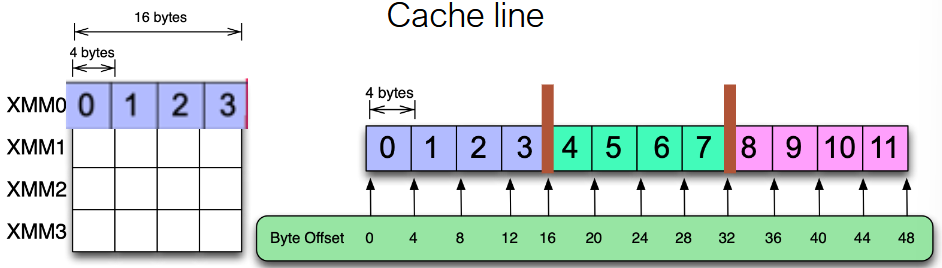

**Common vector register sizes**:
* Intel SSE vector registers are $128$-bit ($16$-byte), which fit $4$ floats.
* AVX2 vector registers are $256$-bit ($32$-byte), which fit $8$ floats.
#### Available Implementations

There are a wide-range of SIMD implementations:

* **SSE** - Streaming SIMD Extensions
	* Intel-based found on most modern Intel and AMD x86 CPUs
	* $128$-bit (float and int) which fits $4$ floats.

* **AVX** - Advanced Vector Extensions
	* Twice the register width of SSE
	* Found on Intel Sandybridge chips and above

* **Altivec**
	* Vectorisation technology developed by AIM Alliance (Apple, IBM, and Freescale (Motorola))
	* Found on PowerPC architectures

* **GPUs** (graphics processing units)
	* Essentially very large SIMD units
	* CUDA for Nvidia, OpenCL for AMD / Nvidia
#### Intel SSE Intrinsics

Intel's SSE Intrinstics include both:
* $128$-bit float vector units - `__m128`,
* and $128$-bit double vector units - `__m128d`

Common functions include:
* `_mm_malloc` - allocate memory with alignment
* `_mm_free` - free aligned memory
* `_mm_load_ps` - load $128$-bits starting from given address into vector register (also includes unaligned version)
* `_mm_store_ps` - store $128$-bits from vector register into memory
* add, multiply, reciprocal square root, square root operations
* `_mm_set1_ps` -0 sets the value of each element in the vector to given value
* `_mm_shuffle_ps` - shuffle operation
* `_mm_cmpgt_ps` - comparison vector operation
* `_mm_blendv_ps` - blend two branches together

**Conditionals**. Branching is an issue in vectorisation as we cannot selectively run different operations in parallel. The solution is to compute the result of all branches, and use a mask to blend the results together using `_mm_blendv_ps`

**Horizontal add**. Vector operations only perform operations with other vectors, never with itself. Thus, horizontal adds (sum of a vector) is difficult. The solution is to use **shuffle** to reorder the contents of a vector, and add them in a way that calculates the *sum in every position*. Then, we read the total from the first element.

### Threading

**Def**. A *thread* is a single flow of control within a process. It has its own stack and registers, but shares everything else. Each thread can execute a different instruction stream.

**Multithreading** is the practice of parallelising a program by dividing the work into multiple threads, which can execute on their own, ideally on different cores. A typical thread assignment is to have one thread per core.
* otherwise, multiple threads will have to share the core's resources, which is not true parallelism

**Race conditions**. Operation order between threads is non-deterministic, which can cause *race conditions* where the final result is dependent upon the order of execution. 

Two common implementations of threading are:
* `pthreads` - manual way of multithreading
* `OpenMP` - an API for multi-threaded, shared memory parallelism
#### OpenMP Primitives

OpenMP is higher-level than pthreads and implements *shared memory, thread-based parallelism*. The programmer has full control over parallelisation, through the use of compiler directives embedded in the code.

We set the number of threads either by doing:
* setting `OMP_NUM_THREADS=n` variable
* calling OpenMP function `omp_set_num_threads(n)`

**Parallel region directive**. Used to indicate a parallel region where multithreading can occur:

```c
#pragma omp parallel ...
{
	/* parallel code */
}
```

**Flow control**. The mechanism used to synchronise threads to prevent race conditions. These include:

* `barrier`
	* prevents any one thread from continuing until all threads have reached the barrier point
	* **useful** if data is updated asynchronously and data integrity is at risk
	* **disadvantage**: barriers are expensive and may not scale well to a large number of processors

* `critical`
	* serialises a portion of parallel region - i.e. a critical section
	* prevents a race condtiion
	* **disadvantage**. negatively impacts performance as only one thread can enter at a time

* `atomic`
	* allows the following statement to be *conducted atomically*, preventing race conditions
	* lower overhead than critical, but limited to simple operations (not functions!)
	* e.g.
	
	```c
	int count = 0; // shared across threads
	#pragma omp parallel
	{
		#pragma omp atomic
		count++; // this operation is atomic
	}
	```

**Variable Scope**. Used to control the scope of thread variables
* `private`: variables are private to the thread, with uninitialised value
* `firstprivate(val)`: variables are private to the thread, with an initialised value
* `shared`: uses shared global memory, accessible by all threads
* `default`: defines the default behaviour of variables cope. can either be `none` (no assumptions made), or `shared` (all variables not declared in parallel region are shared)

**Reduction**. A method of updating a single value shared across threads safely, without race conditions. This creates a private variable for storing partial results per thread, and applies the *operation* across all partial results at the end (to minimise serialisation). 

For example, the below is a reduction on the variable `sum` over the operation `+`

```c
#pragma omp parallel reduction(+:sum)
{
	sum += 2;
	sum += 3;
	sum += 4;
}
```

**Workload decomposition**. The keyword `schedule` is used to distribute work between all threads.

* the `for` keyword parallelises a for loop, sharing iterations of a loop across threads
* distribution depends on schedule behaviour

For example,

```c
#pragma omp parallel for
for (i = 0; i < n; i++)
{
	c[i] = b[i] + a[i];
}
```

The possible options for `schedule(type, chunksize)` is as follows:

* `type=static`: divide the loop iterations into *blocks of chunksize iterations*, then assign to threads in a *round-robin fashion*. Good if each iteration takes roughly same time.

* `type=dynamic`: divide the loop iterations into blocks of chunksize iterations. Assign a new block to a thread *each time it completes a block*. Good if iteration time can vary. (use small chunk size)

* `type=dynamic`: like dynamic, but each subsequent chunk decreases in size

#### OpenMP Performance

To maximise performance for OpenMP,

* **use one thread per core**, otherwise each thread shares cores resources and all run slow
* good workload decomposition
* avoiding serialising thread execution where possible
* thread outer loops rather than inner loops where possible
* avoiding false sharing

**False sharing** is where two threads are using *unrelated data close enough to end up in the same cache line*. This results in the cache line migrating back and forth between the two threads' caches, which reduces performance.

In OpenMP, false sharing arises when several threads maintain their respective partial result in a vector indexed by the thread rank.

**Solution**: use thread local variables instead.

## 8. Processor Organisation

### Architecture vs Microarchitecture

**Architecture** is mainly the study of the instruction set, and what the processor does. This includes:
* programmer visible state (memory, registers)
* operations (instructions, and how they work)
* execution semantics (interrupts)
* input/output
* data types/sizes

**Microarchitecture / organisation** is about implementing the processor efficiently
* tradeoffs on how to implement ISA for some metric
* examples: pipeline design, cache size, execution ordering, etc.

### Overview of the CPU

The CPU continuously performs the **fetch-decode-execute** cycle:
* instructions are retrieved from memory, 
* decoded to form recognisable operations, 
* and executed to impact the current state of a CPU

This relies on multiple CPU components:
* **arithmetic and logic unit** (alu) - performs calculations
* **control unit** - decodes program instructions
* **registers** - set of storage locations
* **internal processor bus** - transfers data between registers and ALU

Registers have two overlapping roles in the processor:
* **user-visible registers** - used by low-level programmers to minimise references to main memory
	* e.g. data, address, index, segment pointer, condition code registers
* **control and status registers** - used by control unit and privileged operating system programs
	* includes PC, IR, MAR, MBR

The **program status word** is a set of registers that contain status information. Common flags include:
* sign
* zero
* carry
* equal
* overflow
* interrupt enable/disable
* **supervisor mode or user mode**
### Machine Instructions

The collection of the different instructions that the processor can execute is referred as its *instruction set*. Each instruction consists of:

* **opcode** - specifies instruction type
* **source operand reference** - an operation may involve one or more operands
* **result operand reference** - an operation may produce a result
* **next instruction reference** - specifies where processor should fetch next instruction from

The types of instructions are:
* **data processing** - e.g. arithmetic, logic operations like ADD, SUB, OR, MUL
* **data storage** - moving in/out of registers/memory, e.g. LD, ST
* **control** - branch, jump instructions, e.g. BEQZ, JR
* **data movement** - I/O instructions, e.g. IN, OUT
#### Addressing Modes

An instruction can use different **addressing modes**, including:
* **register** - reference a register's value
* **immediate** - hardcoded constant
* **displacement** - memory value at address $[\text{register} + \text{value}]$
* **register indirect** - memory value at address given by register
* **absolute** - memory value at *hardcoded* address
* **memory indirect** - "pointer to a pointer", requires *two reads*
* **program counter relative** - memory value at address $[\text{PC} + \text{value}]$
* **scaled** - program counter relative, but with multiplicative value

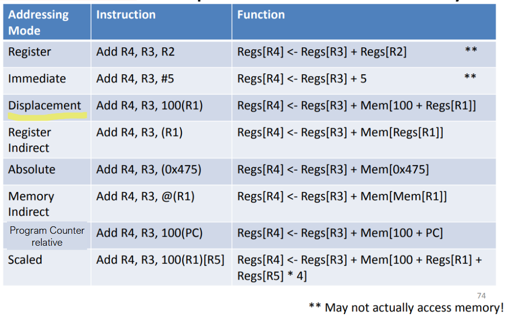

#### Data Types and Sizes

Data can be of multiple *types*:
* **binary integer**
* **floating point** (IEEE 754, Cray Floating Point, Intel Extended Precision)
* **vector data type**

Data can be of multiple *widths*:
* **binary integer**: 8-bit, 16-bit, 32-bit, 64-bit
* **floating point**: 32-bit, 40-bit, 64-bit, 80-bit
* **addresses**: 16-bit, 24-bit, 32-bit, 48-bit, 64-bit

#### ISA Encoding

An instruction can either have:
* **fixed length**: every instruction has the same width
	* common in RISC architectures
	* easy to decode
* or, **variable length**: instructions can vary in width
	* takes less space in memory and caches
	* common in CISC architectures

There are also **very long instruction words** (VLIW) where you have *multiple instructions in a fixed length bundle*.

### CPU Instruction Cycle

**The CPU instruction cycle goes as follows:**
* processor fetches an instruction from memory, given at address in *program counter* (PC)
* PC is incremented to fetch the next instruction in sequence
* fetched instruction is loaded into *instruction register* (IR)
* instruction is decoded by control unit, split into opcode and operands
* *source operands* are fetched continuously, including steps for **indirection** to resolve memory addresses
* instruction is executed
* *result operand address* is calculated, and stored into main memory **with indirection**
* check for interrupts
* possible handling of interrupts
* fetch next instruction

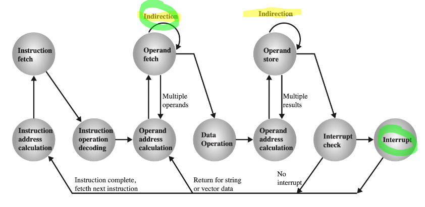

#### Indirect Cycle

The execution of an instruction may involve one or more operands, each of which may require a memory access. If we use **indirect addressing**, we may require additional memory accesses ("pointer to a pointer")

This is known as the **indirect cycle**.

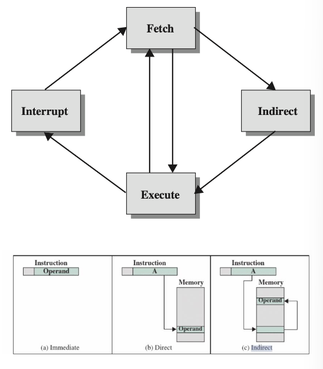

#### Interrupts

**Interrupts** allow the CPU to handle external events while the user program is running. 
* if there were no interrupts, I/O would block the user program
* interrupts allow the user program to get on with execution while waiting for I/O

There are different classes of interrupts:

* **program** - generated by some condition that results of instruction execution
	* e.g. division by zero, illegal machine instruction, segmentation fault etc.
	
* **timer** - generated by a timer within the processor
	* allows OS to perform certain functions on a regular basis

* **I/O** - generated by I/O controller to signal completion of an operation, request service from the processor, or signal error conditions

* **hardware failure** - generated by failures like power failure or memory parity error.

### Control Unit

The **control unit**'s main tasks are:
1. allow the processor to step through micro-instructions in the proper sequence
2. generate control signals that cause each micro-instruction to be executed

**TLDR**. It controls how each instruction is executed by the processor step by step

The main *inputs* to the control unit are:
* **clock** - used to "keep time"
* **instruction register** - store the current fetched instruction
* **flags** - stores outcomes of previous ALU operations
* **control signals from control bus**

The main *outputs* to the control unit are:
* **control signals within the processor**: cause data to be moved between registers, or activate specific ALU functions
* **control signals to control bus**: send control signals to memory, or to I/O modules

There are two approaches to control unit design:
* **hardwired / "random logic"**
* **microprogrammed**

#### Hardwired CU

The hardwired CU is a **combinatorial logic circuit**, transforming its input signals to a set of output signals. A **sequencer** is used, which steps through different micro-instructions.

**Advantages**:
* fast

**Disadvantages**:
* complex hardware makes it difficult to design and test - too many interconnections to get right
* inflexible as it is difficult to change the design if a new instruction must be added
* long design time

This was the dominant technique for implementing control units in RISC processors.

#### Microprogrammed CU

The microprogrammed CU is a "mini-processor" that converts a machine instruction into a sequence of micro-instructions, which are stored in a ROM called microprogrammed memory.

For example, `ADD r1, r2, r3` is translated into micro-operations like so:
1. read r2, send to ALU
2. read r3, send to ALU
3. calculate r2+r3
4. write result in r1
5. increment PC
6. fetch next instruction

**Advantages**
* ease of design and implementation
* flexibility of design allows families of processors to be built
* simple hardware compared to hardwired implementations
* microprogram memory can be reprogrammed for new instructions

**Disadvantages**
* slower than hardwired implementations

This was the dominant technique for implementing control units in CISC processors.

## 9. Processor Performance and Pipelining 

### Introduction

**Pipelining** is a technique that exploits parallelism by having many operations executing concurrently, thus increasing data throughput. Each step (called *pipe stage*) of the pipeline completes part of an instruction. Different steps are completing different parts of different instructions in parallel.

The *throughput* of an instruction pipeline is determined by how often an instruction exits the pipeline.

The time between moving an instruction one step is called the *processor cycle*. The length of the processor cycle is determined by the *slowest pipe stage*
* this is because all stages must be ready to proceed at the same time
* this processor cycle is almost always $1$ clock cycle.

**Goal**: balance length of each pipeline stage. Assuming ideal conditions, once the pipeline is full, one instruction gets completed *every processor cycle*. Thus,

$$\text{time per instruction} = \frac{\text{time per instruction on unipipelined machine}}{\text{number of pipe stages}}$$
### Five Stage Pipeline

The simplest model of instruction pipelining is the **five stage pipeline**.

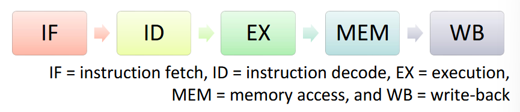

The pipeline consists of these stages:

* **instruction fetch** (IF)
	* send PC to memory, and fetch current instruction from memory. Increment the PC
	
* **instruction decode / register fetch cycle** (ID)
	* decode the instruction, and read registers. compute the possible branch target address.

* **execution/effective address cycle** (EX)
	* ALU operates on operands prepared in the prior cycle. This stage consists of an ALU, bit-shifter, multiple cycle multiplier and divider.

* **memory access** (MEM)
	* if instruction is a load, memory does a read using effective address computed
	* if instruction is a store, then memory writes data

* **write back** (WB)
	* for register-register ALU instruction or load instruction, 
	* write result into register file, whether it comes from memory system or from ALU

### Performance Issues and Speedup

**Pipelining increases the CPU instruction throughput**. The number of instructions completed per unit time increases, but it *does not* reduce the execution of an individual instruction.

The key goal is to keep the pipeline **correct**, **moving**, and **full**.

However, there are some performance issues related to pipelining:

* **pipeline latency**
	* if the duration of instructions does not change, increasing depth creates diminishing returns due to sequencing overhead

* **imbalance among the pipe stages**
	* the clock can run no faster than the time needed for the slowest pipeline stage
	
* **pipelining overhead**
	* from the combination of pipeline register delay and clock skew
	* **Pipeline register delay** is the delay due to *storing intermediate results between pipeline stages in registers*.
	* **Clock skew** is the *maximum delay when clock arrives at any two registers*. due to varying wire lengths, the clock signal does not reach each register at the exact same moment.

**Def**. The *depth* of a pipeline is the number of pipeline stages.

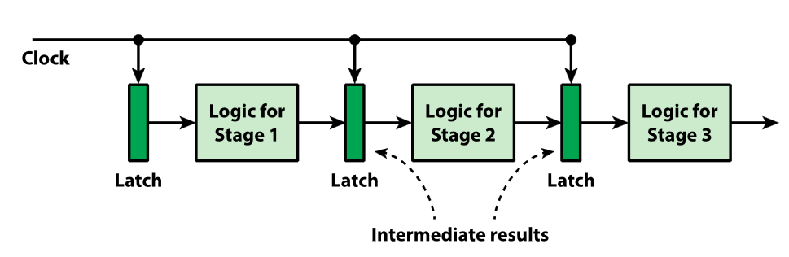

#### Time Calculations

The **cycle time**, $\tau$ is the time needed to advance a set of instructions one stage in the pipeline, which is given by

$$\tau = \max_{i} [\tau_{i}] + d \quad \quad 1 \le i \le k$$
where
* $\tau_i$ is the time delay on the circuitry in the $i$th stage
* $k$ is the number of stages
* $d$ is the time delay of a latch, needed to advance signals and data from one stage to the next

The **time required for a pipeline with $k$ stages to execute $n$ instructions** is given by

$$T_{k,n} = (k + (n-1))\tau$$
**Intuition**. $k$ cycles are required to complete the execution of the first instruction. After that, the pipeline is full, so the remaining $n-1$ instructions each take $1$ cycle.

The speedup factor for the instruction pipeline is given by

$$\text{speedup} = \frac{nk\tau}{(k + (n-1))\tau}$$
**Note**. This is the ideal case with no issues with the stages

### Pipeline Hazards

**Pipeline hazards** occur when some portion of the pipeline must stall because conditions do not permit continued execution. These are also referred to as a *pipeline bubble*.

Three types of hazards: **structural (resource)**, **control**, and **data**.

#### Structural Hazard

A **structural hazard** occurs when two or more instructions in the pipeline *need the same resource*. For example, two stages wishing to use the same memory port in the same clock cycle.

Approaches to resolving structural hazards:

* **schedule**
	* programmer explicitly avoids scheduling instructions that would cause structural hazards
* **stall**
	* hardware includes control logic that stalls until earlier instruction is no longer using contended resource
	* a stall is commonly called a *pipeline bubble* because it takes space but does no useful work
* **duplicate**
	* add more hardware to design so each instruction can access independent resources at the same time
	* e.g. use separate instruction and data cache, use an instruction buffer, use multiple ports for memory structures

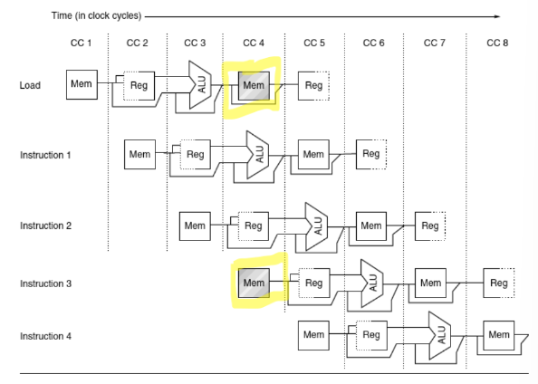

#### Control Hazard

**Control hazards** occur when the processor does not yet know which instruction should be fetched next due to an instruction that could change the program flow. These mainly occur due to conditional branches, jumps, and function returns.

**Problem**. A simple pipeline suffers a penalty for a branch instruction as it must choose one of two instructions to fetch next and may make the wrong choice. If the wrong choice is made, the pipeline has to be **flushed** as the pipeline contains wrong instructions to be executed. 

There are multiple ways to deal with conditional branches.

##### Multiple Streams

With *multiple streams*, the initial portions of the pipeline are replicated and the pipeline is allowed to fetch instructions from both sides of the conditional branch.

**Advantages**:
* reduces branch waiting time as we fetched both

**Disadvantages**:
* contention delays for access to the registers and memory
* additional branch instructions may enter the pipeline before the original branch decision is resolved

##### Prefetch Branch Target

With *prefetch branch target*, the target of the branch is prefetched, in addition to the instruction following the branch. The target is saved until the branch instruction is executed. 

If the branch is taken, the target has been prefetched, so a taken branch can restart more quickly. If a branch isn't taken, we continue with normal execution.

**Advantages**:
* cheaper and simpler than multiple streams
* reduces taken-branch penalty by fetching the target instruction

**Disadvantages**:
* pipeline still needs to be flushed if the branch is taken

##### Loop Buffer

A **loop buffer** is a *small, very-high speed memory* maintained by the instruction fetch stage of the pipeline, **containing the $n$ most recently fetched instructions in sequence**.

It is similar to a cache dedicated to instructions ,but
* loop buffer only retains instructions in sequence
* much smaller in size and hence lower in cost

Branches typically occur **at the end of loops**, so the start of a loop is likely contained in the loop buffer. This is useful as branches in loops are highly likely to be taken, in which the target instruction can be fetched quicker from loop buffer instead of cache.

**Advantages**
* effective for small loops, reduces repeated instruction-fetch cost
* relatively cheap hardware

**Disadvantages**
* only useful for short/recent instruction sequences
* little benefit for distant or irregular branches
* limited capacity

##### Branch Prediction

**Branch prediction** is the technique of *predicting whether the branch will be taken or not*, and continues fetching from the predicted path. In the case the prediction is wrong, we flush the pipeline.

There are multiple types of branch prediction:

**Static branch prediction**:
1. predict never taken
2. predict always taken
3. predict by opcode

**Dynamic branch prediction** (depend on execution history)
1. taken / not taken switch
2. branch history table

**Advantages**:
* cheap as we only follow one path.
* if prediction is good, on average we do not have to flush the pipeline often

**Disadvantages**
* wrong predictions require a flush, and misprediction penalty becomes large in deep pipelines
* complex predictors add hardware complexity, power usage, and storage overhead

##### Delayed Branch

The **delayed branch** technique moves independent instructions *before the branch* to slots *after the branch* to be executed, while the branch is still being resolved. This allows the processor to execute useful instructions instead of leaving a bubble.

**Advantages**
* can avoid wasting the cycle after a branch
* simple hardware

**Disadvantages**
* in the case no safe useful instruction is found, a `NOP` (stall) is inserted instead which provides no improvement
* less flexible than branch prediction

#### Data Hazard

A **data hazard** occurs when there is a conflict in the access of an operand location. E.g. data that instructions use, depend upon data created by other instructions. There are three types of data hazards:

##### Read After Write (RAW)

Also known as a **true dependency**. Most common type of dependency. Occurs when we *read* from a register before the previous instruction has finished *writing* to it. For example,

```c
r3 = r1 + r2;
r5 = r3 + r4;
```

Here, the second instruction must wait for the first instruction to finish writing to `r3`.  

**Note**. *RAW* is a dependency on the register value.

##### Write After Read (WAR)

Also known as an **anti-dependency**. Occurs when a later instruction writes to a register before an earlier instruction can read it. For example,

```c
r3 = r1 + r2;
r1 = r4 + r5;
```

This does not occur in the simple five stage pipeline, but occurs if instructions are reordered.

**Note**: *WAR* is a dependency on the register name. 

##### Write After Write (WAW)

Also known as an **output-dependency**. Occurs when a later instruction writes to a register before an earlier instruction writes to it. For example,

```c
r3 = r1 + r2
/* r5 = r3 + r4 */
r3 = r6 + r7
```

There might be instructions in between that read the same register, so there is a danger if the writes occur in the wrong order. This does not occur in the simple five stage pipeline, but occurs if instructions are reordered.

**Note**. *WAW* is a dependency on the register name.

##### Methods to resolve

There are multiple ways to resolve data hazards:

* **schedule**: programmer explicitly avoids scheduling instructions that would cause data hazards

* **stall**: stall earlier stages until preceding instruction has finished producing data value

* **bypass**: use a hardware data-path that allows values to be *sent to an earlier stage before preceding instruction has left the pipeline*

* **speculate**: guess that there is no problem, if incorrect, kill speculative instruction and restart

### Pipeline Enhancements

**Amdahl's law**. We can split the new execution time into a section that is not enhanced, and a section that is enhanced. The speedup is given by

$$\text{speedup}_\text{overall} = \frac{\text{old execution time}}{\text{new execution time}} = \frac{1}{(1-\text{Fraction}_\text{enhanced}) + \frac{\text{Fraction}_\text{enhanced}}{\text{Speedup}_\text{enhanced}}}$$
#### Data Forwarding

**Data forwarding (bypassing)** is a technique of *forwarding the result value* using physical connections to the dependent instruction as soon as it is available. This is useful for *read after write* dependencies.

We typically forward to the execute stage from either the memory stage, or writeback stage.

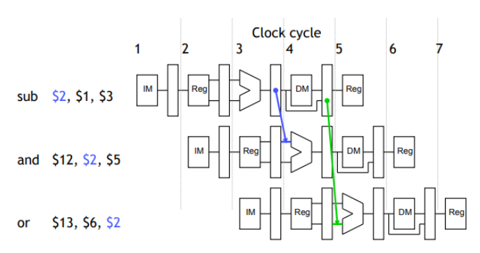

#### Separating Caches

Separating the L1 cache into a I-cache and D-cache removes the conflict between the IF and EX stages. This solves a **structural hazard**.

#### Dedicated Execution Units

Different units can have different time delays, which allows for more flexible pipelining. This increases *instruction-level parallelism*.

#### Reservation Station

**Problem**. Even with multiple execution units, an instruction may not be able to execute immediately because:
1. its required unit is busy, or
2. one of its operand values is not ready yet

This creates a bottleneck at the **Operand Fetch** stage, as it can't receive a new instruction until the previous instruction has been issued.

The **reservation station** is a buffer that stores instructions waiting to enter the execute stage, allowing the pipeline to keep moving and stay full. This enables *out-of-order execution* and prevents *pipeline stalls*.

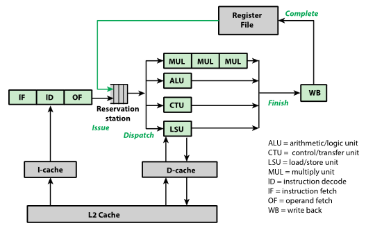

## 10. Pipeline Design 

### Reservation Table

A central problem in pipeline design is ensuring the pipeline maximises its throughput while avoiding structural hazards.
* we want to keep the pipeline **correct**, **moving**, and **full**.

The **reservation table** is a table where the *rows correspond to pipeline stages*, and the *columns correspond to time units*, and a $\times$ in that cell indicates that the pipeline stage is busy at that time.

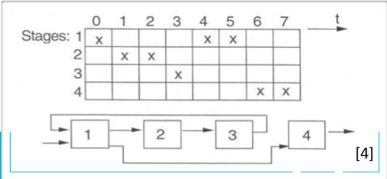

Pipelines can be more complex than the *simple five stage pipeline*, where
* **stages operate for more than one time period** (X's in adjacent columns of same row indicate this)
* **feedback** - more than one X in a row, but not adjacent

This means that pipelines *may not accept initiations at the start of every clock period*, as **collisions may occur**.

**Def**. The number of clock cycles between two initiations of a pipeline is the **latency** between them.

Any attempt by two or more initiations to use the same pipeline stage will cause a collision.

### Collision Vector

The **collision vector** is a sequence of bits indicating whether a latency is permitted or not (does it cause a collision). It is written as 

$$(C_{1}, C_{2}, \cdots, C_{n})$$
where
* $C_i$ = 1 if $i$ is a forbidden latency
	* initiating a pipeline instruction $i$ time units later results in a resource collision
* $C_i$ = 0 if $i$ is a permitted latency.

Note that $C_0 = 1$ always, but we do not include $C_0$ in the collision vector. The vector is indexed from $1$.

The **initial collision vector** represents the state of the pipeline after the first initiation. To compute this we slide the reservation table pattern over itself $n$ times. If there is a collision, mark $C_i = 1$.

For example for the above reservation table, its collision vector is $1001100$.

### Latency and Cycles

**Def**. A *latency cycle* is a latency sequence that repeats the same subsequence indefinitely. (e.g. $(2,2,2,8)$)

**Def**. A *constant cycle* is a cycle with only one latency value, e.g. $(4)$.
* means we schedule a new pipeline initiation every $4$ cycles.

Recall that **latency** is the number of clock periods between two initiations.

**Average latency** is the average number of clock periods between initiations over some specified cycle. For example, $(2, 2, 2, 8)$ has average latency

$$\frac{2+2+2+8}{4} = 3.5$$

The **minimum average latency** (MAL) is the *smallest possible latency* considering all possible sequences of initiations. It is the primary goal of optimum pipeline design.

### Davidson's Algorithm

**Davidson's algorithm** is a scheduling strategy used to determine the optimal schedule for scheduling pipeline initiations given a pipeline's reservation table.

It produces a **state diagram**, where nodes are collision vectors and directed edges show transitions of given latencies. The algorithm is as follows:

1. Left shift the collision vector (inserting $0$'s to the right), until a $0$-bit emerges from the left end. If this happens after $p$ shifts, that means $p$ is a permissible latency.

2. Bitwise OR the initial collision vector with the shifted collision vector. Let $C_0$ be the initial collision vector, $C$ be the current collision vector. If $p$ is a permissible latency the new collision vector is

$$(C \ll p) \space || \space C_{0}$$

3. Repeat this process from the initial state for all permissible shifts.

4. Repeat this process for all newly created states for all permissible shifts.

**Intuition**. Every time we shift the collision vector, we increase the latency by $1$. $p$ is a permitted latency if the $p$'th bit in the collision vector is a $0$ (starting from index of $1$).

We bitwise OR the initial collision vector to consider collisions caused by the instruction we now insert into the pipeline.

#### Example

Suppose we have the collision vector $C_{0} = 011010$. The permitted latencies are $1$, $4$, and $6$. The new states are:

$$(C \ll 1) \space || \space C_{0} = 110100 \space || \space 011010 = 111110$$
$$(C \ll 4) \space || \space C_{0} = 100000 \space || \space 011010 = 111010$$
$$(C \ll 6) \space || \space C = 000000 \space || \space 011010  = 011010$$
A permitted latency of $6$ results in a self loop.

For the new state $111110$, the only permitted latency is $6$, so

$$(C' \ll 6) \space || \space C_{0} = 000000 \space || \space 011010 = 011010$$
This brings us back to the original state.

For the new state $111010$, the permitted latencies are $4$ and $6$, so
$$(C' \ll 4) \space || \space C_{0} = 100000 \space || \space 011010 = 111010$$
This is a self loop of latency $4$.  For latency $6$, we have
$$(C' \ll 6) \space || C_{0} = 000000 \space || \space 011010 = 011010$$
So we go back to the original state.

Therefore, the state diagram looks like this:

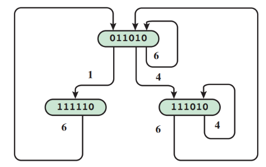

#### Cycles

A **simple cycle** in the state diagram is a cycle in which every state is visited only once except for the start state. In the above example, the simple cycles are

$$(1,6), (6), (4, 6), (4)$$
The average latencies for these cycles are
$$3.5, 6, 5, 4$$
Therefore, $(1,6)$ is the latency cycle that yields the **minimum average latency**.

A **greedy cycle** is a cycle starting from the initial state, where we take the minimum latency transition at each step. This does *not* necessarily result in a MAL, but will usually be a good approximation. In this case, the greedy cycle is also $(1,6)$ though.

**Theorem**. It has been shown that, for a greedy cycle's average latency,

$$\text{max X's in any row} \le \text{MAL} \le \text{greedy cycle AL} \le \text{no. of 1's in the initial collision vector + 1}$$

#### Reducing Latency

A pipeline design may not give the required latency. A way to reduce it is to **insert delays into the pipeline** to increase the number of time slots, and thus reduce the chance of collisions.

This *does* increase the number of cycles for each instruction, but we can possibly reduce the number of collisions and hence **increase throughput** by starting instructions more frequently.

In general, we can achieve *any* $\text{fixed latency} \ge \text{lower bound}$ by adding delays. Here, a *fixed latency* is a **constant latency cycle** (e.g. starting instructions every $4$ cycles).

## 11. Superscalar Processors

### Introduction

A **superscalar processor** is a CPU that can **fetch and decode more than one instruction in the same clock cycle**. It has a steady-state CPI (*clock pulses per instruction*) of less than $1$.

**Def**. The *issue rate* of a superscalar is the number of instructions issued per instruction cycle.

For a superscalar machine, the maximum issue rate is called the **degree of the superscalar** ($\sigma$), and is equal to the width of the issue window.

Superscalars can either be uniform or non-uniform:
* **Uniform**: the pipeline is duplicated into several identical lanes
* **Non-Uniform**: after issuing, there are different specialised execution units, so the stages aren't replications.

In practice, **modern CPUs are non-uniform superscalar processors**.

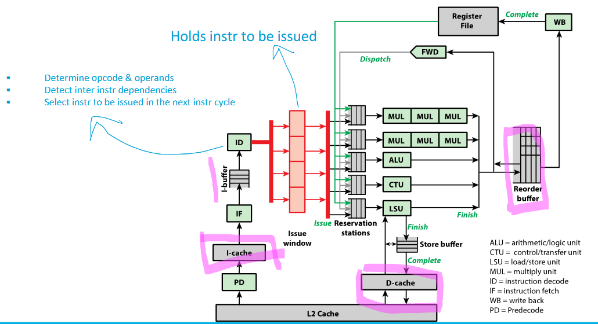

### Superscalar Performance Model

#### Number of Clock Cycles

We want to derive the **number of clock cycles** required to execute $N$ instructions on a superscalar of degree $\sigma$.

We do not know whether the instructions are aligned or not, so we need to consider both cases. The probability a block of $\sigma$ instructions is aligned is $\frac{1}{\sigma}$, as there are $\sigma$ ways to place the block, one of which is aligned to a group of $\sigma$.

**In the case instructions are aligned**, the number of clock cycles required is 

$$s -1 + \frac{N}{\sigma}$$
because filling the pipeline takes $s-1$ cycles, and the remaining cycles we finish $\sigma$ instructions every clock cycle.

**In the case instructions are not aligned**, the number of cycles required is one more, due to misalignment, which is

$$s + \frac{N}{\sigma}$$

Therefore, the **weighted average number of clock cycles** is

$$\frac{1}{\sigma}(s-1+\frac{N}{\sigma}) + (1-\frac{1}{\sigma})(s + \frac{N}{\sigma})= s + \frac{N-1}{\sigma}$$

#### Speedup of Superscalar

Hence, the **CPI** (clock cycles per instruction) of a superscalar processor is given by

$$\frac{s + \frac{N-1}{\sigma}}{N} = \frac{1}{\sigma} + \frac{1}{N}\left(S - \frac{1}{\sigma}\right)$$

The **speedup** of a superscalar processor over a pipelined processor is given by

$$\text{speedup} = \frac{\sigma(s + N-1)}{\sigma s + N - 1}$$

**Observation**. As $N \to \infty$, speedup $\to \sigma$. Intuitively, the pipeline filling stage becomes negligible as $N$ is large, so $\sigma$ times more instructions can be completed per cycle.

**Observation**. As $\sigma \to \infty$, speedup $\to 1 + \frac{N-1}{s}$. This is not unsurprising as even with an infinite number of pipelines, the $N$ instructions still have to pass through the $s$ stages, so speedup is not infinite.

#### Super-pipelined vs Superscalar

Another type of processor is called **super-pipelined**. This divides the pipeline into a greater number of smaller stages in order to clock it at a higher frequency. 

In contrast, **superscalar** allows parallel fetch and decode operations, *without* subdividing instructions further.

### Instruction Level Parallelism

In practice, a program may have many *dependencies*, meaning that not all instructions can be executed in parallel. This is known as the program's **instruction level parallelism (ILP)** - the degree to which instructions of a program can be executed in parallel.

This limits the speedup of a program no matter the degree of the superscalar. For most problems, ILP is in the range 2-4, so there is no reason to have a $\sigma$ too large, which costs chip area.

ILP can be maximised by compiler-based optimisations and hardware techniques, though parallelism is limited by dependencies.

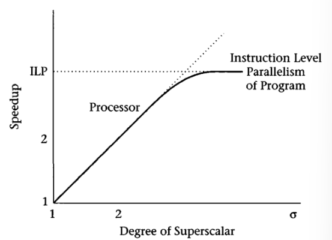

**Common limitations to instruction level parallelism include:**
* true data dependency (read after write)
* procedural dependency
* resource conflicts
* output dependency (write after write)
* anti-dependency (write after read)

#### Procedural Dependencies

**Procedural dependencies** are inherent to the sequence and steps involved in instruction execution. These include:

* **branch operations**
	* branches cause change of program flow and cause issues with pipelining

* **variable length instructions**
	* in CISC architectures, where an instruction's length is unknown, the instruction must be at least *partially decoded* before the next instruction can be fetched
	* a reason why superscalar is better suited to RISC

#### Resource Conflicts

Also known as **structural hazards**, where two or more instructions compete for resources at the same time. Solutions include:

* duplicating resources to alleviate conflicts
* pipeline functional units to improve performance

This was further discussed in section 9.

#### ILP vs Machine Parallelism

**Instruction level parallelism** is where
* instructions in a sequence are independent
* execution can be overlapped
* governed by data and procedural dependency

A program may not have enough inherent ILP to take advantage of the machine parallelism available.

**Machine parallelism** is
* the ability to take advantage of instruction level parallelism
* governed by number of parallel pipelines

Limited machine parallelism will always limit performance, regardless of how much ILP a program exhibits.

### Instruction Issue Policy

**Instruction issue** refers to the process of *initiating instruction execution* in the processor's functional units. We say an instruction has been issued when it moves from the *decode* to *execute* stages of the pipeline.

**Instruction completion** is when an instruction reaches the **write** stage of the pipeline.

The processor is free to change instruction orderings in any way, provided the correct result is produced, and often provides more flexibility and efficiency. The processor's rules of issuing instructions is known as its **instruction issue policy**.

There are three main instruction issue policies:
* **in-order issue with in-order completion**
* **in-order issue with out-of-order completion**
* **out-of-order issue with out-of-order completion**

The first type is realistically not considered for a modern computer system - useful to consider it as a baseline for other policies.

Out-of-order issuing and completion is most common in modern computer systems - this is known as **out of order execution**.

#### In-order issue, in-order completion

**In-order issue, in-order completion** is where *groups* of instructions are issued and completed in order. Here, instructions are fetched in *groups* and move to the next stage once they've all been completed.

**To guarantee in-order completion**, when there is a conflict for a functional unit or a functional unit takes multiple cycles, the issuing of instructions temporarily stalls. 

In this example, I3 is only issued once I1 and I2 are both done with the execute stage. Similarly, I5 and I6 only complete once they've both completed the execute stages.

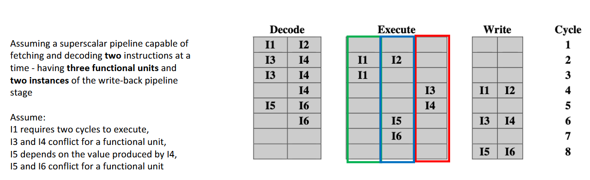

#### In-order issue, out-of-order completion

**In-order issue, out-of-order completion** is where instructions can complete in a different order they were issued in. This allows any number of instructions to be in the execution stage at any one time, *up to the degree of the superscalar*. However, this is till limited by machine parallelism across functional units.

This improves performance where instructions require multiple cycles, as faster instructions can complete first without stalling the pipeline.

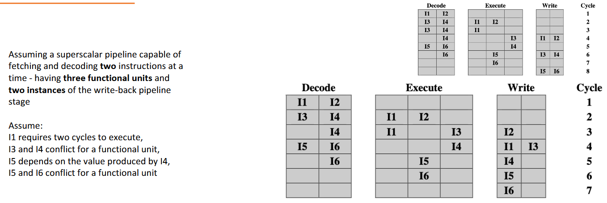

This also introduces the need to solve **output dependencies** (*write after write*), as writes can now be re-ordered. This could lead to incorrect outputs. E.g. if we have

```c
I1: R3 = R3 + R5;
I2: R4 = R3 + 1;
I3: R3 = R5 + 1;
I4: R7 = R3 + r4;
```

There is a *write after write* dependency between I1 and I3, preventing us from re-ordering those two instructions.

#### Out-of-order issue, out-of-order completion

When using **in-order issue**, a processor will only decode instructions **up to the point of a dependency or conflict** - these must be overcome before further instructions are decoded.

However, instructions *after the conflict* may be **independent**, hence issuing instructions *out-of-order* improves performance **by making more instructions available for issuing**, reducing the likelihood of a pipeline being stalled.

To achieve this, the decode and execute stages must be further decoupled:

* A buffer known as the **instruction window** is introduced, to hold instructions after they've been decoded. Provided the instruction window isn't full, the processor can still fetch and decode new instructions.

* When a functional unit is available for execution, it selects an instruction from the instruction window that:
	1. requires the available unit, 
	2. and there are no prohibiting dependencies or conflicts

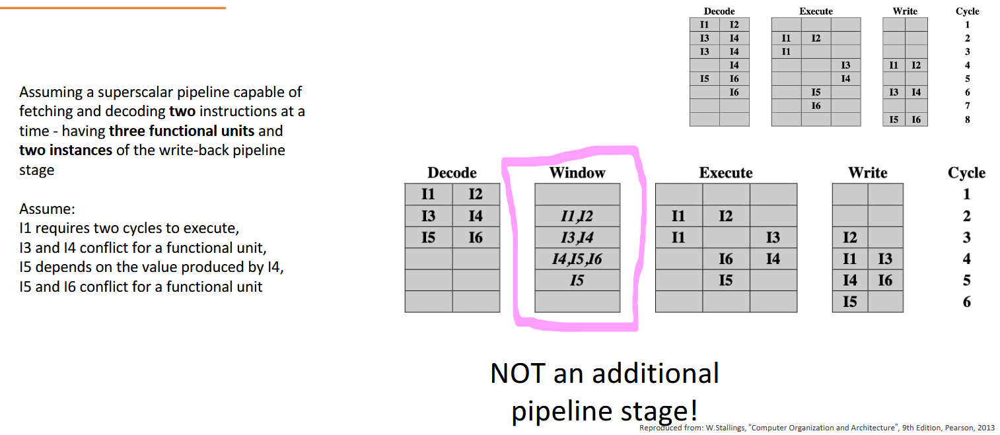

However, this introduces the **anti-dependency** (*write after read*) which must be solved. For example,

```c
I1: R3 = R3 + R5;
I2: I4 = R3 + 1;
I3: R3 = R5 + 1;
R4: R7 = R3 + R4;
```

I3 cannot complete execution until I2 reads the value for R3, which would cause an incorrect result.

### Solutions to Superscalar Pipeline Hazards
#### Register Renaming

Permitting out-of-order issue or completion leads to the possibility of *output dependencies* and *anti-dependencies*.  This is because if instructions write results out of order, the regster may contain the wrong "version" of the value.

These dependencies are **storage conflicts**, i.e. they depend on the **register name**, not its value. 

**Solution**: we use *register renaming*.

* we separate *architectural registers* from *hardware registers*

* every time an instruction creates a new value for a logical register, the processor stores that value in a *fresh physical register* instead of overwriting the old physical value immediately

* The register reference `r#` refers to the **logical register**, while the reference `hw#` refers to the **hardware (physical) register**.

For example,

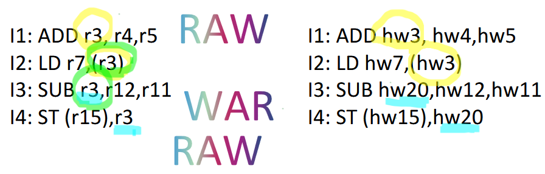

Here, the processor gives each new version of `r3` its own physical register. This eliminates the output dependencies *write after read* and *write after write*, as both versions of the architectural register exist in separate hardware registers.

#### Branching and ILP

Branching can hinder performance in the context of pipelines. Common solutions include:

* **Prefetch branch target** - discussed in section 9.

* **Delayed branch strategy** - not widely used in superscalars
	* In superscalars, we need to find multiple independent instructions to be executed in the delay slot, which is difficult where dependencies exist between instructions. 

* **Branch prediction** - discussed in section 9.

* **Speculative execution** - *the principle of doing work before we know whether it's needed or not*
	*  for example, fetching and executing the *guessed branch* in branch prediction is termed "speculative execution"
	* **this relies on resource abundance to provide performance**
	* other techniques that also fall under this category are prefetching in memory, file system prefetching, and optimistic transactions in a database system
	
### Superscalar Execution

The superscalar starts off with a program consisting of a linear sequence of instructions. It executes instructions in a pipeline:

* **instruction fetch** - the fetch stage (which includes branch prediction), is used to form a dynamic stream of instructions that are examined for dependencies.

* **instruction decode & renaming** - instruction is decoded, and registers are renamed into *hardware registers* to handle output and anti-dependencies.

* **instruction dispatch** - instructions are dispatched into a *window of execution*, structured according to their data dependencies.

* **instruction issue & execution** - instructions are issued to the execution stage, which passes instructions to *reservation stations* that hold waiting instructions near the functional units.

* **instruction re-ordering** - instructions are put back into sequential order and results recorded. This is known as *committing* or *retiring* the instruction. This is required as due to multiple, parallel pipelines, instructions may complete out-of-order.

**Note**. With *branch prediction* and *speculative execution*, some instructions may complete execution and be abandoned. This is handled together with instruction-reordering at the **re-order buffer**.

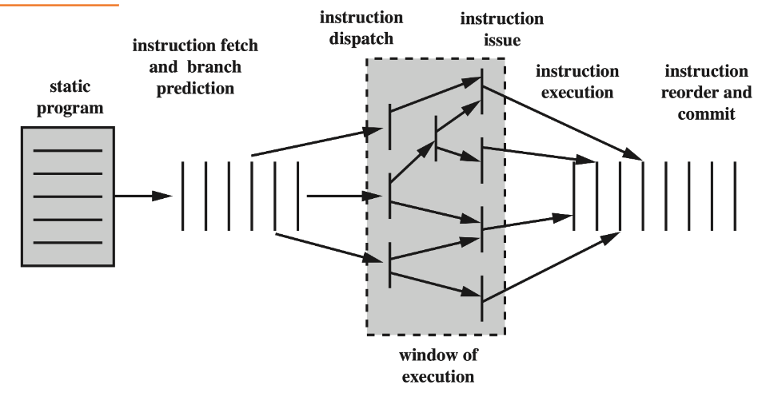


Below is the design of the Intel Core microarchitecture, which is designed as a superscalar processor. In the Intel architecture, there is the *pre-decode* stage, which is required as instructions have varying lengths so the instruction has to be partially decoded to know how long it is.


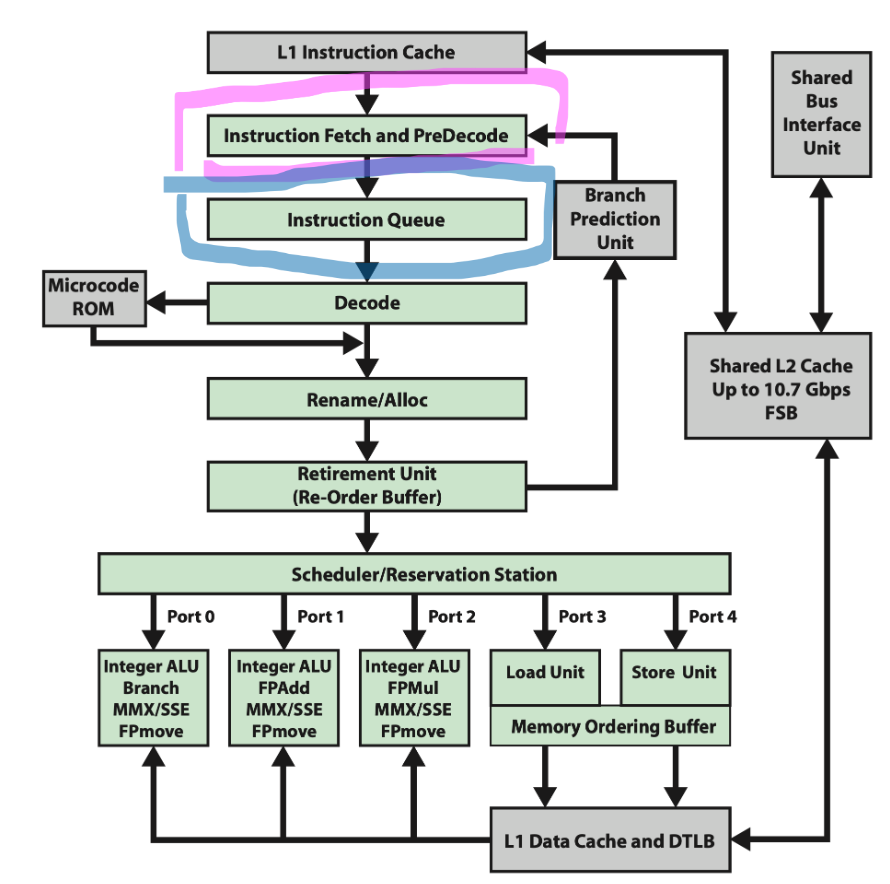


## 12. Parallel Computer Organisation

### Vector and Array Processors

**Single instruction, multiple data** is a classification of processors that execute an instruction on multiple data points simultaneously.

SIMD exploits **data-level parallelism**: *the same operation can be performed independently on different data items*. SIMD processing is typically known as **vectorisation**, which is where instructions operate on vector registers (registers containing multiple values).

Most existing ISAs include vector-like SIMD operations, such as
* Intel MMX/SSEn/AVX, PowerPC AltiVec, ARM Advanced SIMD

Vectors may have different lengths, so we typically have a **vector length register** (VLEN). Elements of a vector may also not be contiguous in memory, so we typically have a **vector stride register (VSTR)

* **Def**. the *stride* is the distance between two elements of a vector.

There is also the **vector mask register** (VMASK), which indicates which elements of a vector to operate on. This is set by vector test instructions, for example `VMASK[i] = (Vk[i] == 0);`.

SIMD processing can either occur in *time* or in *space*, and this classifies SIMD processors into two types: *vector* processors and *array* processors. Modern SIMD processors typically are a hybrid of the two types: they exploit data parallelism in both time and space.

**Note**. Array vs vector processor definition is a purist's distinction.

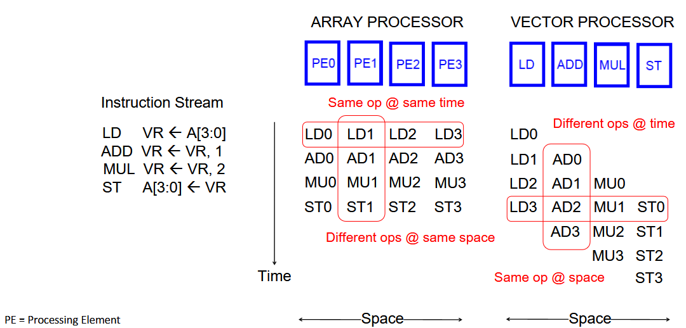

#### Vector Processor

In a **vector processor**, an instruction operates on multiple data elements in *consecutive time steps* using the *same space*. It exploits data level parallelism temporally using pipelining.

Functional units are *pipelined* and typically separated based on their specialty, for example there may be a pipelined multiply unit, pipelined add unit etc. This allows us to **start work on a vector element every cycle**.

For example, if we had a vector of $4$ elements and we performed the instruction

```assembly
VADD VZ, VX, VY
```

we would start work on each element every clock cycle, and due to pipelining, the vector add would complete in $9$ cycles (if the add pipeline had a depth of $6$).

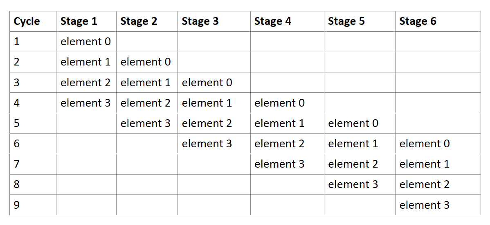

Vector functional units typically have a **deep pipeline** to execute element operations, which enables a fast clock cycle. This is because:

* no intra-vector dependencies -> no hardware interlocking within a vector
* no control flow within a vector
* known stride allows prefetching of vectors into registers/cache/memory

**Vector chaining**. When it comes to executing multiple vector instructions in sequence that *are dependent*, a vector processor utilises *vector chaining* to pipeline the vector instructions. 

* **Vector chaining** is data forwarding from one vector functional unit to another. It is basically the vector analogue of *data forwarding / bypassing* discussed earlier.

* This is possible because each element of the vector is independent, dependency only exists between elements of different vectors.

This overlaps the execution of multiple vector instructions, which is commonly known as **vector instruction level parallelism**.

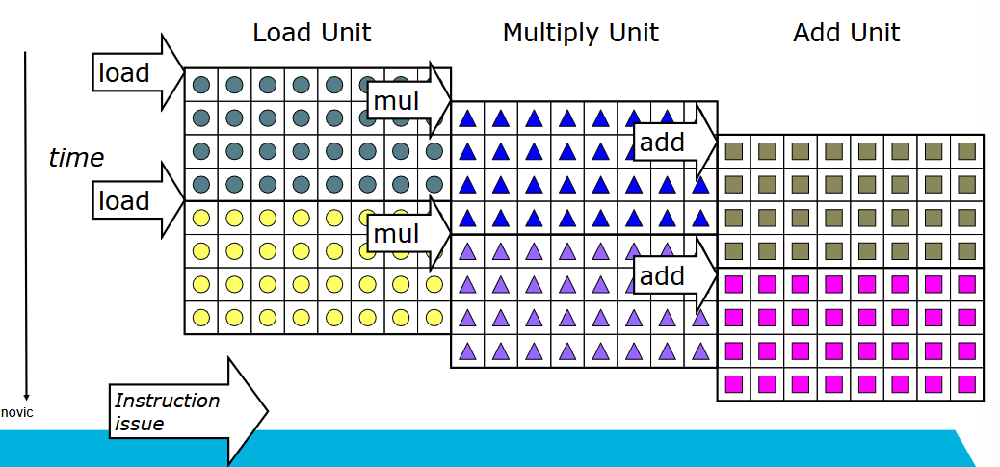

#### Array Processor

In an **array processor**, an instruction operates on multiple data elements at the *same time* using *different spaces*. There are **multiple processing elements** (also known as lanes), each applying the same operation at the same time. An example of this is having *multiple ALUs*, and feeding the same instruction to each ALU, but with different data each clock cycle.

For example, if we had a vector of $4$ elements and we were executing the assembly code

```c
LD VR, A[3:0]
ADD VR, VR, #1
MUL VR, VR, #2
ST A[3:0], VR
```

Then we would perform the LOAD for all elements in one stage, then the ADD, so on and so forth.

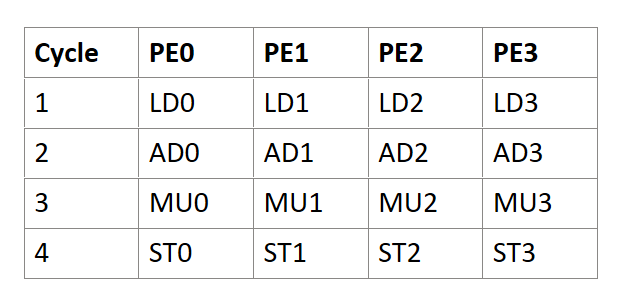

**Comparison to VLIW**. 
* In a *very long instruction word* (VLIW) processor, we have multiple instructions packed together, and one instruction is given to one processing unit -> each processing unit may receive different instructions.

* In an array processor, each processing unit receives the same instruction.

**VLIW vs Superscalar**. A VLIW processor packs independent instructions together at *compile time*, while a superscalar processor identifies independent instructions to run together at the **hardware level**, and is done at *run time*.

#### Modern SIMD Processors

Modern SIMD processors are combination of vector and array processors. They contain pipelined functional units that operate under vector chaining, but there are multiple of them, each called a **lane**. This allows exploitation of data-level parallelism in space like an array processor.

For example, if the vector register contained $64$ elements and there were only $4$ lanes, we would subdivide the vector register into four **partitioned vector registers**, and feed one to each lane. Each lane would then perform the vector instruction using vector chaining and pipelining. 

Lane 0 would contain vector elements $0$, $4$, $8$, Lane 1 would contain elements $1, 5, 9$, and so on and so forth.


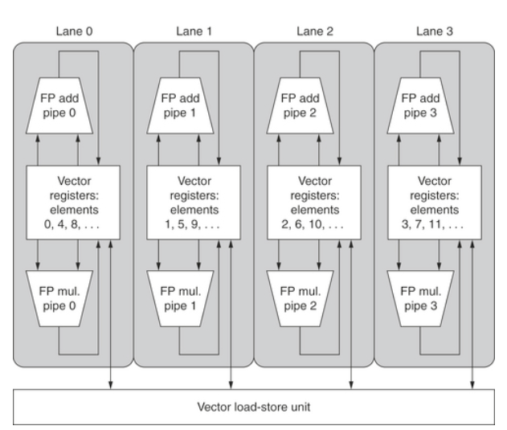

#### Advantages and Disadvantages of SIMD Processors

##### Advantages

**No dependencies within a vector**
* Can have very deep pipelines with no dependencies

**Each instruction generates a lot of work**
* reduces instruction fetch bandwidth requirements

**Highly regular memory access pattern**
* can interleave vector data elements across multiple memory banks for higher memory bandwidth
* prefetching a vector is relatively easy

**No need to explicitly code loops**
* fewer branches in the instruction sequence

##### Disadvantages

**Works only if parallelism is regular**
* performance improvement is limited by *vectorizability* of code
* also known as *data-level parallelism*
* scalar operations limit vector machine's performance

**Very inefficient if parallelism is irregular**
* for example, searching for a key in a linked list

**Memory bandwidth can easily become a bottleneck, especially if**
1. compute/memory operation balance is not maintained
2. data is not mapped appropriately to memory banks

#### Memory Banking

**Memory banking** is where memory is divided into banks that can be accessed independently. This can sustain $N$ parallel access if all $N$ go to different banks.

This is especially useful for *loading/storing vectors from memory*, as elements are separated from each other by a constant stride.

Elements can be loaded in consecutive cycles if we can start the load of one element per cycle
* can sustain a throughput of one element per cycle
* even when memory takes more than $1$ cycle to access

### Graphical Processing Units (GPUs)

A **graphical processing unit** (GPU) is a specialised piece of hardware that operates like a SIMD pipeline. It uses the *heterogenous execution model*, where the CPU is the host, and GPU is the device.

Nvidia developed the **Compute Unified Device Architecture (CUDA)** programming language and environment for programming GPUs. Alternatively, there is OpenCL which is a vendor-independent programming language for multiple platforms.

#### Programming vs Execution Model

The **programming model** refers to how the programmer expresses the code.
* for example, Sequential (von Neumann), Data Parallel (SIMD), Dataflow, Multi-threaded (MIMD, SPMD)

The **execution model** refers to how the hardware executes the code underneath
* for example, out-of-order execution, vector processor, array processor, dataflow processor, multiprocessor, multithreaded processor

The execution model can be very different from the programming model.

#### GPU Programming and Execution Model

The GPU uses the **single program, multiple data** (SPMD) programming model, where programmers write compute kernels which are run on a lot of threads.

* each thread executes the same code but operates a different piece of data
* each thread has its own context

However, the GPU's execution model is **SIMD-like** and is similar to a SIMD pipeline. It is officially called **single instruction, multiple thread** (SIMT). A set of threads executing the same instruction are dynamically grouped into a *warp* by the hardware

* also known as **wavefront** in AMD, or **sub-group** in Intel.
* a warp is basically a SIMD operation formed by hardware

**Advantages of the SIMT Execution Model**:
* **can treat each thread separately**
	* can execute each thread independently, which is like MIMD processing
* **can group threads into warps flexibly**
	* group threads that are supposed to truly execute the same instruction
	* dynamically obtain and maximise benefits of SIMD processing

#### Overview of GPU Execution Model

> *This section will use Nvidia speak terminology.*

A GPU consists of multiple **streaming multiprocessors** (SMs). These consist of:
* a warp scheduler
* registers / shared memory
* different pipelines, e.g. load/store pipeline, floating-point pipeline etc.

When we program a GPU, we write a **compute kernel** (code function) and execute it on a number of **blocks**, each with a *set number of threads*. The set of blocks is called the **grid**. 

In a block, threads can cooperate with each other by:
* synchronising their execution using barrier
* efficiently sharing data through a low latency shared memory

**Note**. Two threads from two different blocks *cannot cooperate* directly, but can coordinate using atomic memory operations in global memory.

For example, the following code launches a kernel with $2$ blocks and $128$ threads per block in the CUDA programming language.

```cpp
kernel<<<2, 128>>>(...)
```

##### Blocks, Warps, and SIMD pipelines

**Blocks are allocated to streaming multiprocessors**. One SM can be allocated multiple blocks, and blocks are executed independently and in any order. 

**Note**. Block assignment isn't permanent. Once that block finishes, the SM can accept another pending block from the same grid.

At the hardware level, blocks are further divided into **warps**, which are groups of $32$ threads that run together. Since a SM has multiple blocks, this means a SM has a lot of warps it can choose to execute from, and this is handled by the *warp scheduler*.

A streaming multiprocessor includes multiple **SIMD pipelines**, which consists of multiple *lanes* of pipelined functional units, similar to an array processor. Each pipelined functional unit is called a **CUDA core**.

**Note**. A SIMD pipeline doesn't necessarily contain $32$ CUDA cores, there can be less (e.g. $16$ or $8$). If there are less, we subdivide the $32$ threads and allocate them to each pipelined functional unit, similar to how a modern SIMD processor works.

##### Fine Grained Multithreading

At runtime, the warp scheduler **schedules warps to execute on SIMD pipelines** when ready. This is called **fine-grained multithreading** (FGMT), as warp execution is interleaved to hide long latency operations (e.g. memory accesses). 

Multiple blocks on one SM matter, because a SM wants as many resident warps available so there is likely to be a ready warp whenever another stalls.

#### Branch Divergence

In a GPU, threads in a warp usually execute the same instruction together on SIMD-like lanes. However, a compute kernel could include a conditional branch that depends on the thread's ID, e.g.

```c
if (threadIdx.x < 4) {
	A;
	B;
} else {
	X;
	Y;
}
Z;
```

If there is no divergence (all threads take the same branch), the warp executes efficiently/

However if there is divergence, then the `if` and `else` branches are executed separately with an **active-thread mask**, and are *reconverged* after the conditional statement. 

Due to the active thread mask, a portion of the threads are **inactive** during the branch execution. This is inefficient as the warp has to execute both paths but half the lanes are inactive on each path. This increases the time and wastes available lane throughput.

**Note**. divergence only matters within a warp as warps are executed independently.

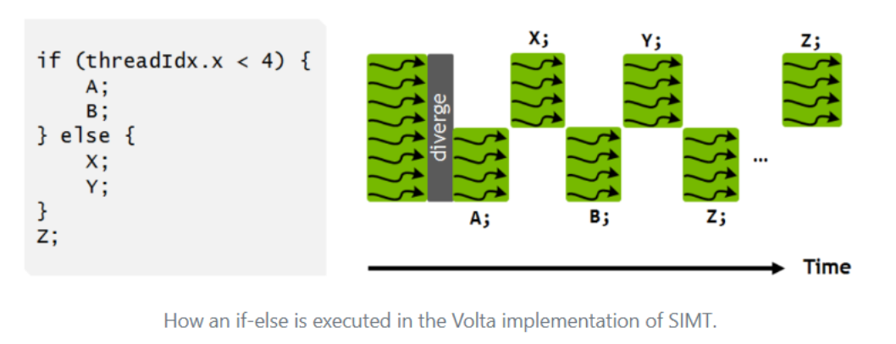

#### GPU Terminology

As GPUs are developed by different hardware firms, they use different terminologies for the same thing.

| Nvidia                            | AMD                | Intel          | Comment                                                          |
| :-------------------------------- | ------------------ | -------------- | ---------------------------------------------------------------- |
| Warp size                         | Wavefront size     | Sub-group size | Number of threads than run in parallel on a SIMD functional unit |
| Thread                            | Work-item / thread | Work-item      | One logical kernel instance                                      |
| Warp                              | Wavefront          | Sub-group      | Threads that execute together                                    |
| Warp lane / group of N Cuda Cores | SIMD lane          | SIMD unit      | SIMD-pipeline that executes an instruction for a warp            |
| Cuda Core                         | -                  | -              | A pipelined functional unit for a single thread                  |
| Streaming Multiprocessor (SM)     | Compute Unit (CU)  | Xe-core        | basically a GPU core                                             |

## 13. Symmetric Multiprocessors and Cache Coherence

### Symmetric Multiprocessors

A **multiprocessor** is a computer system that involves *multiple processors*. A **symmetric multiprocessor** (SMP) is a computer system where processors are equal (hence "symmetric"):

* two or more similar processors of comparable capacity
* all processors can perform the same functions
* share same memory and I/O facilities
* connected by bus or other internal connection
* **uniform memory access** - memory access time is approximately the same for each processor
* system is controlled by integrated operating system

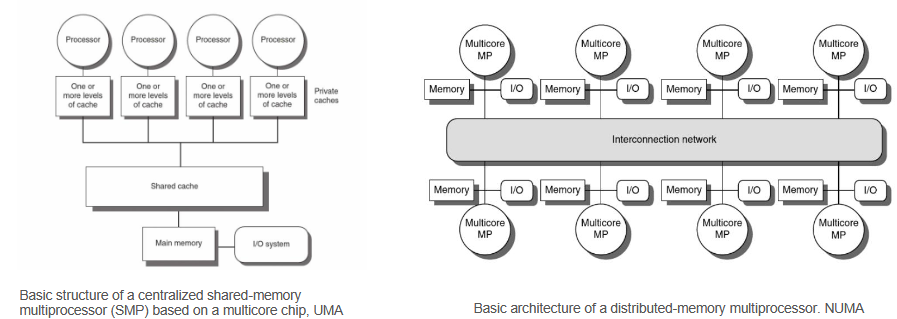

#### Tightly Coupled Multiprocessors

Symmetric multiprocessors are an example of a **tightly coupled multiprocessor**. This is a multiprocessor where **communication is done through shared memory** (and shared I/O devices), and all processors are managed by a single operating system.

Each processor is self-contained and has access to shared memory and I/O through *some form of interconnection*. They can communicate with each other through memory, and memory is organised so multiply simultaneous accesses to separate blocks of memory are possible

The opposite of this is *loosely coupled multiprocessors*, where communication is done through message passing - an example is a cluster.

#### Multiprogramming vs Multiprocessing

**Multiprogramming** refers to executing multiple processes concurrently by having multiple processes in memory at once.

**Multiprocessing** refers to executing multiple processes simultaneously using multiple processors.

#### Symmetric Multiprocessor Organisation

A symmetric multiprocessor is often organised around a **shared bus**, with processors with their own L1 and L2 caches connected to the bus, and a shared main memory and I/O system as well. The shared bus consists of control, address, and data lines.

**Direct memory access** (DMA) is often used, as it allows I/O to communicate with main memory directly. To facilitate this, the following features are provided:

* **addressing** - to distinguish modules on the bus to determine source/destination of data
* **arbitration** - any I/O module can temporarily function as "master"
	* this is in the case multiple requests to use the bus are sent
* **time sharing** - when one module is controlling the bus, other modules are locked out


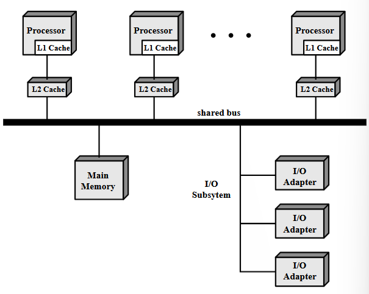

The *advantages* of the bus organisation are as follows:
* **simplicity** - simplest approach to multiprocessor organisation
* **flexibility** - easy to expand the system by adding more processors to the bus
* **reliability** - failure of any attached device should not cause failure of the whole system

The *disadvantages* of the bus organisation are as follows:
* **performance**
	* all memory references pass through the common bus
	* performance is limited by bus cycle time
* **to minimise bus accesses, each processor should have cache memory**
	* leads to cache coherence problems
	* if a word is modified in one cache, it could conceivably invalidate a word in another cache

### Cache Coherence

The **cache coherence** problem arises in keeping data valid when data is spread across each processor's private cache in a multiprocessor. We can either use software, or hardware solutions.

**Software-based solutions**
* attempt to avoid additional hardware by relying on the compiler and OS to deal with the problem
* attractive as overhead of detecting potential problems is transferred to compile time, and design complexity now is in software
* however, compile-time software generally must make **conservative decisions**, leading to **inefficient cache utilisation**

**Hardware-based solutions**
* generally referred to as *cache coherence protocols*. they provide dynamic recognition at run-time of potential inconsistency conditions
* since problem is only dealt with when it arises, it leads to improved performance over a software approach
* approaches are transparent to programmer and compiler

We can divide cache coherence protocols into *directory protocols* and *snoopy protocols*.

#### Directory Protocols

A **directory-based** cache coherence protocol keeps a record of which caches currently hold a copy of each shared memory block in a *directory* in main memory.

Then, when a processor wants to write to a block, the system uses the directory to invalidate (or update) other copies of the cache line, and the appropriate transfers are performed.

**Advantages**
* effective in large scale systems with complex interconnection schemes
* particularly suitable for shared memory systems with multistage/hierarchical interconnections, where broadcast mechanisms are difficult to implement

**Disadvantages**
* creates central bottleneck on the main memory directory.

#### Snoopy Protocols

A **snoopy-based** cache coherence protocol is where **cache controllers watch the network** for broadcast notifications, and update their caches accordingly to invalidate (or update) cache lines.

**Advantages**
* well-suited for bus-based multiprocessor, because the shared bus provides a simple means for broadcasting and snooping

**Disadvantages**
* care must be taken that the increased bus traffic doesn't cancel out gains from use of local caches
* does not scale well to a large number of processors due to high bus traffic

Two basic approaches have been explored: *write update*, and *write invalidate*.

#### Write Update vs Invalidate

In a **write update** cache coherence protocol, when a shared line is to be updated, all other caches containing the line must be updated as well. 

* **Advantage**s: 
	* data is correct all the time in all locations
	* can be multiple readers and multiple writers
* **Disadvantages**: 
	* updating a shared line generates a lot of traffic

In a **write invalidate** cache coherence protocol, when a shared line is to be updated, all other caches of the line are *marked as invalid*. The writing processor has exclusive access until the line is required by another processor. 

This is the most widely used mechanism in commercial multiprocessor systems. In a write invalidate protocol, the state of every line is marked as either *modified*, *exclusive*, *shared*, or *invalid* - known as the MESI protocol.

* **Advantages**: 
	* repeated writes by one processor are cheap
	* less interconnect or bus traffic than write-update for repeated writes
	* works well with write-back caches

* **Disadvantages**
	* other processors suffer cache misses when they next read the data
	* bad for frequently shared read-write data
	* false sharing can cause unnecessary invalidations

### MESI Protocol

The **MESI** protocol is a *write-invalidate* cache coherence protocol that uses a **snoop bus (bus watcher) arrangement**, where the caches use a "write-back" policy.

The cache includes **two status bits per tag**, so that each line (block) can be in one of four states:

* **modified** - cache entry is valid, main memory is invalid, no other copies exist
* **exclusive** - no other cache holds the line, memory is up to date
* **shared** - multiple caches hold the line, memory is up to date
* **Invalid** - the cache entry does not contain valid data.

Initially, all cache entries are marked as invalid. On the first read of a block, the cache line is marked as **exclusive** (E), since it is the only copy in existence.

**Key transitions**
* when in exclusive state (E) and another processor reads the same data block, it is marked as **shared** (S) in both

* when in shared state (S) and one processor writes to the block, it gets the **modified** state (M) and all other copies are invalidated (I)

* when in modified state (M) and another processor reads the data block, a **write-back to main memory** is triggered and both states end up as **shared** (S)

* when in modified state (M) and another processor *writes* to the data block, a **write-back to main memory** is triggered, the original copy is invalidated (I), and the reading processor gets the cache line as modified (M) after writing.

This is best summarised as a table:

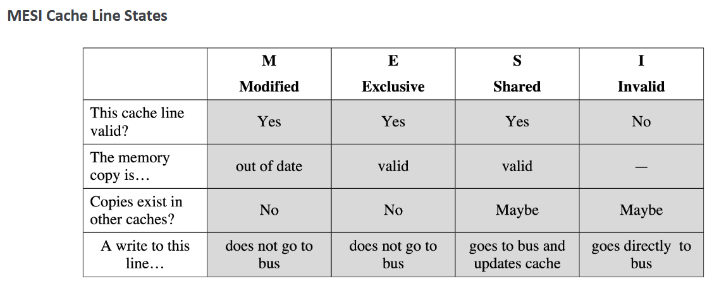

#### MESIF

**MESIF** is an extension to the MESI protocol, implemented by Intel. It adds the **forward state** (F), which is a specialised form of the S state.

Its main purpose is to act as a sharer of a clean cache state. When a processor that doesn't have the block tries to read it, instead of going to main memory, the cache with the **F** state *forwards* the value to the new processor.

This is optimal where cache-to-cache latency is smaller in comparison to main memory latency. It is designed to enhance performance in distributed memory organisations.

#### MOESI

**MOESI** is an extension to the MESI protocol, implemented by AMD. It adds the **owned state** (O), which is a special form of the **modified state** that enables sharing of dirty cache lines. 

This is useful when a processor that *doesn't have the block* attempts to read from its cache, and the cache line is **modified**. 
* In traditional MESI, since main memory is out of date, this forces a *write-back* to main memory.
* In MOESI, the cache with the modified state can get the **owned state** instead, and can share its dirty cache line without writing back to main memory yet.
* However, the cache with the owned state **is still responsible** for writing back to main memory later on.

**TLDR**. This allows a modified cache line to be supplied to other processors without first writing it back to main memory.

### Multiprocessor Operating System Design Considerations

**Simultaneous concurrent processes**
* multiple processes now can execute simultaneously on different processors

**Scheduling**
* scheduling now involves determining which core it should run on
* on NUMA systems this becomes more important as memory access is non-uniform

**Synchronisation**
* there can be race conditions with shared memory due to multiple processors writing to it

**Memory management**
* becomes more complicated as each processor may access shared memory and has its own cache and translation hardware (TLB)

**Reliability and fault tolerance**
* consideration of what to do when a processor core fails, or an interconnect fails
* a multiprocessor may be designed so that a single failure doesn't stop the whole machine

## 14. Multithreading and Multicore Systems

### Multithreading

**Multithreading** is where the instruction stream is divided into smaller streams, known as *threads*, such that threads can execute in parallel. Threads can either be **software-level**, or **hardware-level**.

A **process** is an instance of a program running on a computer, embodying:
* **resource ownership** - processes are allocated a *virtual address space*, and are allocated ownership of resources (e.g. I/O)
* **scheduling** - execution of a process is scheduled by the operating system

**Process switching** is the operation of switching the processor between processes.

A **thread** is a *dispatchable unit of work* within a process. A thread includes:
* a processor context (at least the PC, and stack pointer, registers),
* and allocated data storage (stack)

**Thread switching** is switching processor control from one thread to another. It is **far less costly than process switching** because threads share the same code, data, and heap. This is used to achieve *multitasking*, otherwise known as **concurrency**.

#### Hardware Multithreading

**Hardware multithreading** is having multiple thread contexts in a single processor. In the CPU, we have multiple sets of registers, one for each hardware thread. Thread-switching is performed at the hardware level.

##### Advantages

* **latency tolerance** 
	* latency of memory operations, dependent instructions, branch resolution can be hidden by executing another thread in the meantime.
* **better hardware utilisation**
	* by reducing pipeline stalls
* **reduced context switching penalty**
	* software thread switching is more expensive as we must save and load thread states
	* in hardware, the core already has multiple thread contexts present, which makes thread switching less costly
* **improved system throughput**
	* by exploiting thread-level parallelisation
	* by improving superscalar / out-of-order execution processor utilisation - this can be achieved using *simultaneous multithreading*.
##### Disadvantages

* **requires multiple thread contexts to be implemented in hardware**
	*  this costs area, power, latency
* **usually reduced single-thread performance**
	* we start less instructions per thread every cycle
	* due to resource sharing and contention
	* due to switching penalty (can be reduced with additional hardware)

### Types of Multithreading

There are three main types of multithreading: **fine-grained**, **coarse-grained**, and **simultaneous**. Simultaneous multithreading (SMT) is by far the most common implementation. In Intel, this is known as **hyper-threading**.

**Threading granularity** defines the size of an independent task assigned to a thread. Finer thread granularity means tasks assigned are of smaller chunks, and vice versa. Finer thread granularity allows:

* more flexibility for the programmer in parallelising a programmer
* allow parallelisation in more situations than coarse-grained ones

The choice of target granularity involves an inherent trade-off:
* finer grain systems are preferrable because of flexibility
* but the finer the granularity, the **more significant part** of execution is taken by *threading system overhead*.

#### Fine-grained multithreading

**Fine-grained multithreading** is where we switch to another thread **every cycle**. It is also known as *interleaved* multithreading.

This makes it so every instruction from the same thread are far apart. For example, if we have $4$ threads $A, B, C, D$, the pipeline would look like:

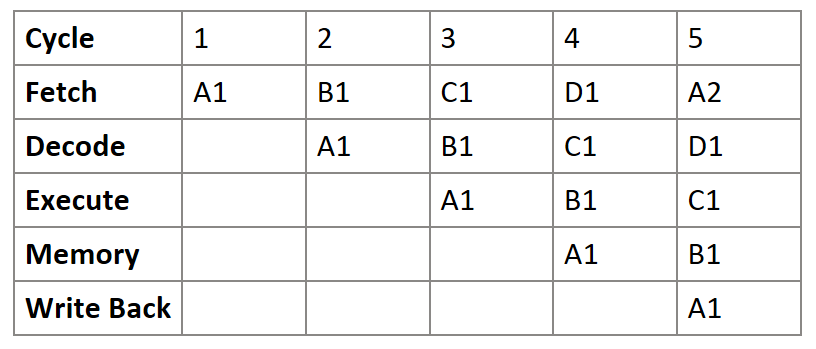

**Advantages**:
* no need for dependency checking between instructions
	* if we have enough threads running, there is only one instruction in the pipeline from a single thread
	* we allow data, control hazards to resolve themselves while other threads are running
	* for example, true dependencies and branch hazards
* no need for branch prediction logic
* otherwise-bubble cycles used for executing useful instructions from different threads
* improved system throughput, latency tolerance, utilisation

**Disadvantages**:
* extra hardware complexity
	* multiple hardware contexts, thread selection logic
* reduced single thread performance
	* one instruction fetched every $N$ cycles where $N$ is the number of threads running
* resource contention between threads in caches and memory
* dependency checking logic between threads remains
	* load/store instructions

#### Coarse-grained multithreading

**Coarse-grained multithreading** is where we switch to a different hardware context only when a thread is stalled due to some event. It is also known as *blocking*, or *switch-on-event* multithreading.

Possible stall events include cache misses, synchronisation events, or floating point operations. This allows **latency hiding** by executing another thread in the meantime.

**Advantages**
* better single thread performance than fine-grained multithreading

**Disadvantages**
* more difficult to implement than fine-grained, cannot eliminate dependency checking, branch prediction logic
* switching has performance overhead as we have to flush the pipeline (or use a lot of hardware to save pipeline state)
* this has high overhead with deep pipelines and large windows 

#### Simultaneous multithreading (SMT)

**Simultaneous multithreading** (SMT) is the most common implementation. It is allowing multiple instructions from independent threads to be executed simultaneously on a superscalar or multiple-issue processor.

* This is often described as implementing *fine grained multithreading* **on top of** a multiple issue, dynamically scheduled processor

**Motivation**. On a superscalar processor, we often cannot find enough independent instructions to be executed in parallel. SMT improves functional unit utilisation by filling the remaining gaps with instructions from other threads.

* This uses thread-level parallelism to hide long-latency events in a processor, thereby increasing usage of functional units.

**Key insight**. Register renaming and dynamic scheduling allow instructions from independent threads to be executed, without regards to dependencies between them.

* often, threads use the same architectural registers
* when executed together, this can cause anti-dependencies or output dependencies
* register renaming can be used to solve this

**Note**. We now require replicated resources as there are multiple threads running at once:
* each thread has its own program counter
* each thread has its own *register map* to track dependencies correctly
* physical register file must be bigger to accommodate further register renaming between threads.


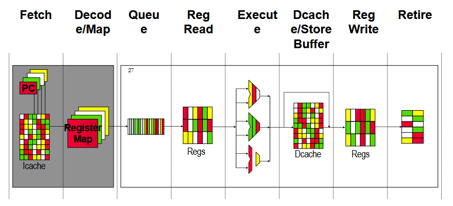

### Functional Unit Utilisation

#### Superscalar Processor

In a normal **pipelined processor**, data dependencies reduce functional unit utilisation. In a **superscalar processor**, functional unit utilisation becomes even lower as finding $4$ independent instructions to be executed in parallel isn't always possible.

A **vertical loss** is a complete idle cycle
* arises from cache miss, mis-predicted branch, synchronisation wait etc.

A **horizontal loss** is a partially filled cycle
* arises from data dependencies preventing us from finding enough independent instructions to execute in parallel

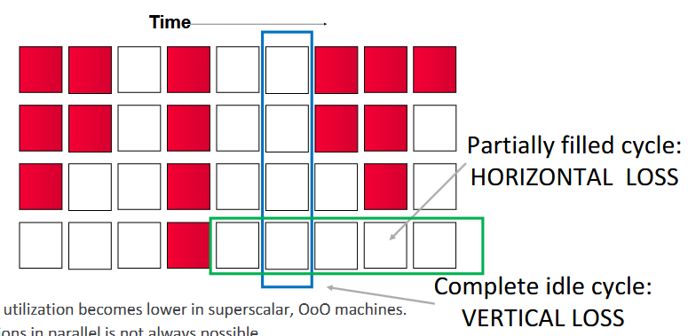

#### Predicated execution

**Predicated execution** attempts to solve this. When we have a conditional branch, we treat the branch condition *as a predicate* and execute both sides of the branch. When the predicate is evaluated we discard the wrong results. 

This converts control dependencies into data dependencies (as we wait for the branch condition to evaluate). This improves functional unit utilisation, but some results are thrown away.

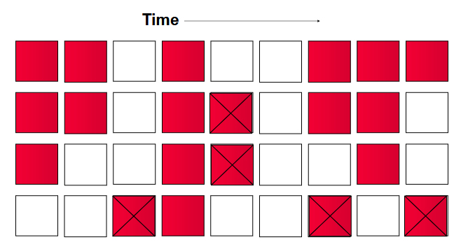

#### Chip Multiprocessors

**Chip multiprocessors** attempt to solve this problem further. We divide the instruction stream into two threads, each executing on a different core (processor). Since the threads are independent, they can produce more total parallel work, improving **overall throughput**.

**Disadvantages**:
* still limited functional unit utilisation within a single thread
* limited single thread performance

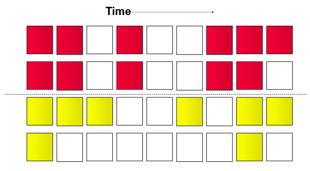


#### Coarse grained multithreading

**Coarse grained multithreading** attempts to solve this by improving *vertical loss* - entire cycles that would otherwise be idle. This is achieved by executing a different thread when a thread is waiting on a long operation. 

**Disadvantages** - it does not fill empty slots within a partly used cycle.

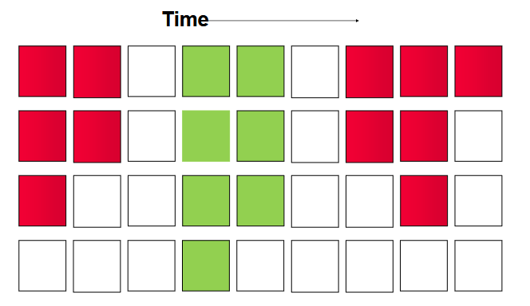


#### Fine-Grained Multithreading

**Fine-grained multithreading** improves this further by switching threads every cycle, which prevents short stalls due to dependencies or latencies. However, this still does not solve the issue of **horizontal loss**, as a thread may not have enough independent instructions to be executed in parallel.

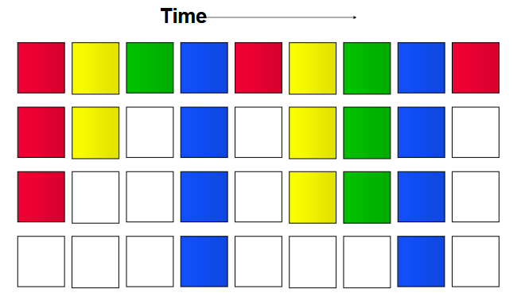


#### Simultaneous Multithreading

**Simultaneous multithreading** solves the issue of horizontal loss by executing instructions from different threads in the same cycle. Hence, this is the most widely used implementation of multithreading.

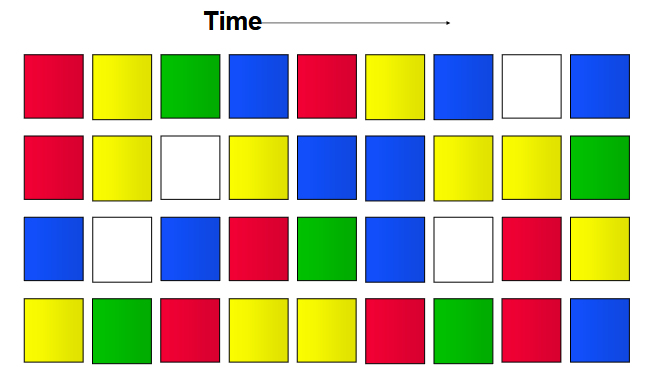


### Multicore Architecture

A **chip multiprocessor**, also known as a **multicore system**, is where two or more processors (known as cores) are placed on a single piece of silicon (known as a die).

Each core typically consists of all the components of an independent processor, and also a L1 instruction and data cache, and typically a L2 and L3 cache in most commercial chips.

Chip multiprocessing, along with SMT, represents true simultaneous execution of instructions from distinct threads. 
* we replicate execution resources and achieve performance through parallelism

This is in contrast to fine-grained and coarse-grained multithreading, which rapidly switches between threads instead of executing them simultaneously
* improve utilisation by avoiding computational penalties associated with delay events

#### Pollack's Rule

**Pollack's rule** states that performance increase is roughly proportional to the square root of increase in complexity. It is a rule of thumb that is representative of many of decades of experience.

$$\text{performance} \propto \sqrt{\text{die area}}$$
As a consequence, if we double the logic in a processor core, it will deliver $40\%$ better performance.

#### Multicore Organisations

The main variables in a multicore organisation are:
* number of core processors on a chip
* number of levels of cache memory
* amount of cache memory shared

In general, we have four levels of multicore organisations:
* **dedicated L1 cache**
* **dedicated L2 cache**
* **shared L2 cache**
* **shared L3 cache**


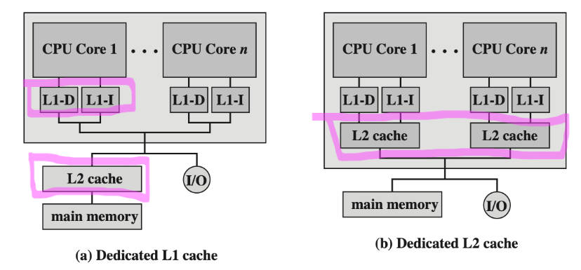

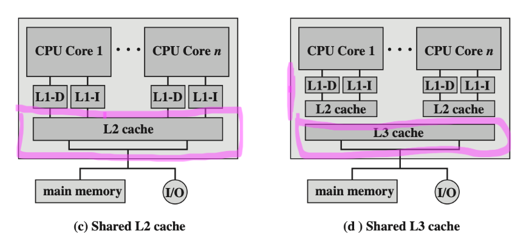


**The use of shared higher-level cache on the chip has several advantages over exclusive reliance on dedicated caches**:

* constructive interference: reduces overall miss rate
* data shared by multiple cores is **not replicated** in shared cache
* amount of shared cache allocated to each core is *dynamic* (under suitable algorithms)
* inter-processor communication implemented using shared memory
* confines the cache coherency problem to lower cache levels

#### Logical Cores

A design decision in a multicore system is whether individual cores will be purely superscalar, or also implement simultaneous multithreading (SMT).

* **SMT** has the effect of *scaling up the number of hardware-level threads*.
* Thus, this produces the distinction between **logical cores** and **physical cores**
* A multicore system with four cores and SMT that supports four threads has effectively **16 logical cores**.

Typically, logical cores are not as powerful as physical cores as they still share the same resources. However, SMT is still attractive as it fully exploits parallel resources better by improving functional unit utilisation.

#### Multicore Performance

The speedup of a multicore system is given by

$$\text{speedup} = \frac{\text{time to execute program on single CPU}}{\text{time to execute program on } N \text{ parallel processors}}$$

Often, speedup does not increase with the number of processors due to overhead, such as:
* dividing work between processors
* synchronisation and waiting
* communication between processors
* cache coherence overhead
* memory bandwidth contention
* load imbalance

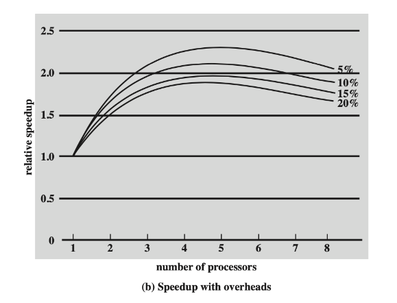

#### Effective applications for multicore processors

* **multi-threaded native applications**
	* thread-level parallelism
	* characterised by having a small number of highly threaded processes

* **multi-process applications**
	* process-level parallelism
	* characterised by having many single-threaded processes

* **java applications**
	* the java virtual machine is a multi-threaded process

* **multi-instance applications**
	* if multiple application instances require isolation, virtualisation can be used to provide each of them with their own separate and secure environment
	* virtualised CPUs can run on their own threads

### Non Uniform Memory Access

**Non-uniform memory access** is a shared-memory MIMD architecture where:
1. there is a single address space visible to all CPUs
2. access to memory is via LOAD and STORE instructions
3. memory is **logically shared**, **physically distributed**
4. access to remote memory is *slower* than access to local memory
	* however this overall reduces latency to local memory and increases bandwidth

This type of multiprocessor is called a **Distributed Shared Memory** (DSM) multiprocessor.

**Defining Feature**: local memories are faster to access than remote memories.

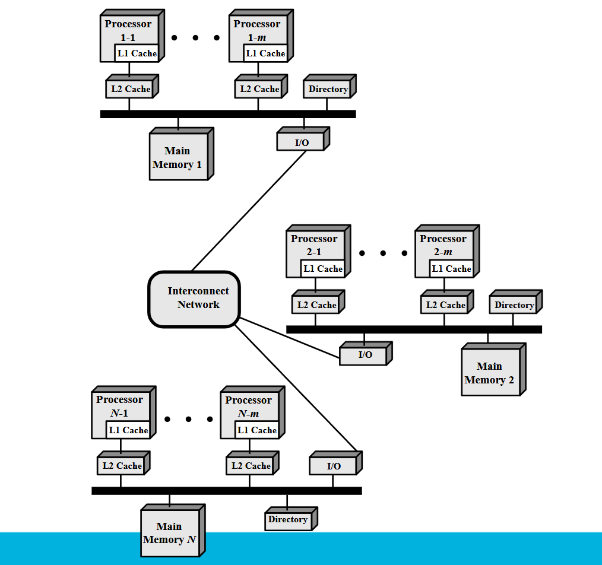

#### Motivation

* **SMP** approaches do not scale well. There are limits to the number of cores that can be put together, and the bus becomes a performance bottleneck

* To build larger processors, some memory must be further away than others - creates non-uniform memory access. 

* **Note**: NUMA allows for transparent system-wide memory, unlike clusters, which do not.

#### Cache Coherency

**Cache-coherent NUMA** (CC-NUMA) is a NUMA system in which cache coherence is maintained among all caches in the various processors.

Bus snooping is too expensive for a large number of CPUs, so a **directory-based protocol** is used instead of cache coherence, storing a list of cache blocks, where it is located, and what state it is in, in main memory.

#### Advantages and Disadvantages

**Advantages**
* effective performance at higher levels of parallelism than SMP
* no major software changes

**Disadvantages**
* increased complexity of communication among processors
* not transparent - OS needs to address changes in use of:
	* page allocation, 
	* process allocation, 
	* load balancing
* concern with availability - failure of a node is not easily recovered from

**Note**. Performance can breakdown if we access remote memory too much. This can be avoided by:
* using L1 and L2 caches to reduce all memory access
* using good temporal locality of software
* virtual memory management moving pages to nodes that are using them the most

### Heterogenous Multicore Organisation

**Heterogenous multicore organisation** is a multicore system that includes more than one kind of core. The most prominent trend is including CPUs and GPUs on the same chip.

Key features of the heterogenous system architecture (HSA) approach include:

* the entire virtual memory space is visible to all
* virtual memory system brings in pages to main memory as needed
* coherent memory policy ensures CPU and GPU caches see an up-to-date view of data
* unified programming interface that allows both to be used well

#### Asymmetric Design

A **symmetric chip design** is where all cores are the same, have similar performance, power use, and capability.

**Asymmetric chip design** is a chip that combines cores of different sizes or types. For example:
* A chip containing a CPU and a GPU
* A chip containing one large CPU core and multiple smaller CPU cores

**Asymmetric design** is a way of enabling specialisation, to get the best of both general and special purpose machines
* **general purpose**: simple design for every workload or metric, e.g. CPU
* **special purpose**: simple design per workload or metric, e.g. GPU

**Advantages over symmetric design**:
* enable optimisation of multiple metrics
* enable better adaptation to workload behaviour
* provide special-purpose benefits with general-purpose flexibility

**Disadvantages over symmetric design**:
* higher overhead and more complexity in design and verification
* higher overhead in management: scheduling onto asymmetric components
* overhead in switching between multiple components can lead to degradation

#### Asymmetric Chip Multiprocessor (ACMP)

A **asymmetric chip multiprocessor** (ACMP) is a multiprocessor containing a few large cores and a lot of small cores. This is desirable as:

* in a serialised code section, we want one powerful core running a single thread
* in a parallel code section, we want multiple small cores each running one thread

These two ideals conflict each other, as:
* if you have a single powerful core, you cannot have many cores
* a small core is more energy and area efficient than a large core (pollack's rule)

Large cores are power inefficient: e.g. 2x performance for 4x area (power)

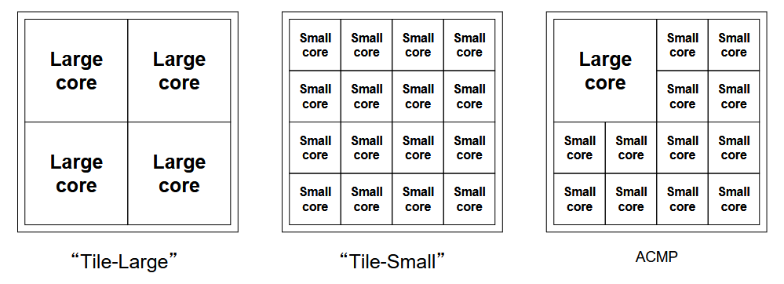


### Clusters

A **cluster** is a group of interconnected *whole* computers working together as a unified computing resource that can create the illusion of being one machine. Each computer in a cluster is called a **node**.

It is a *loosely-coupled* computer system that is an alternative to SMP as an approach for providing high performance and high availability. It is particularly attractive for server applications.

Compared to SMP and NUMA, clusters **do not have shared memory**, and computers communicate instead by sending messages, for example using MPI for high performance computing.

**Advantages**
* absolute scalability
* incremental scalability - we can add more nodes over time
* high availability - if one node fails, we can use other nodes
* superior price / performance

#### Clustering Methods

There are multiple clustering methods:

* **passive standby** - secondary server takes over in case of failure
	* **pro**: easy to implement
	* **con**: high cost as secondary server is not being used often

* **active secondary** - secondary server is also used for processing tasks
	* **pro**: reduced cost as we have better hardware utilisation
	* **con**: increased complexity

* **separate servers** - each server has their own disk. data is continuously copied from primary to secondary server
	* **pro**: high availability
	* **con**: high network and server overhead due to copying operations

* **servers connected to disks** - servers are cabled to the same disks, but each server owns its disks. 
	* **pro**: reduced network and server overhead
	* **con**: requires disk mirroring or RAID technology

* **servers share disks** - multiple servers simultaneously share access to disks
	* **pro**: low network and server overhead
	* **pro**: reduced risk of downtime caused by disk failure
	* **con**: requires lock manager software

## 15. I/O Mechanisms

### Programmed I/O

The CPU needs to communicate with devices such as keyboards, hard drives, SSDs, network cards etc. Each device has an **I/O module / controller** containing device registers. For example, a controller may contain

* **status register** - tells CPU whether device is ready
* **control register** - CPU writes commands
* **data register** - CPU reads/writes actual data being transferred

**Programmed I/O** means the program running on the CPU explicitly executes instructions to access these device registers. The CPU itself performs the reads and writes.

There are two types of programmed I/O:
* **memory-mapped I/O**
* **isolated (port) I/O**

#### Memory mapped I/O

**Memory-mapped I/O** is where a portion of main memory is reserved for device registers, so the processor can interact with the I/O controller by reading/writing from main memory.

The same address bus is used to address both memory and I/O devices. When a CPU accesses a memory address, it can either physical memory (like RAM), or be associated with an I/O device. Normal read/write signals are placed on the control bus to interact with I/O.

**Advantages**
* simpler than many alternatives
	* CPU requires less internal logic, which can make design and fabrication of a CPU cheaper
* use of general purpose memory instructions
	* all addressing modes supported by a CPU are available to I/O

**Disadvantages**
* portions of memory address space must be reserved. becomes a concern for 16-bit or 32-bit processors where memory is less widely available

#### Isolated (port) I/O

**Isolated (port) I/O** is where memory and devices have separate address spaces. I/O devices are addressed via different instructions, e.g. IN/OUT rather than LOAD/STORE. The bus may be equipped with input/output command lines, as well as read/write lines.

**Advantages**
* full range of logical addresses are available for memory and I/O

**Disadvantages**
* additional hardware and minor overheads of command lines
* possible pipeline issues as I/O operations are unpredictable, so we cannot casually repeat, reorder, or speculate such an operation

**Note**. Memory-mapped I/O needs careful treatment too but port-mapped I/O makes unusual operations explicit

### Synchronisation with I/O

Most I/O devices are much slower than the CPU. So we need to consider:
* **read** - is there data to be read from the device?
* **write** - is the device ready to accept data?

For example, printing a character using a simple printer takes time much greater than the processor instruction time.

Two main methods of handling this are **polled I/O** and **interrupt-driven I/O**.

#### Polled I/O

**Polled I/O** is where the CPU reads the device controller's *status register* to see whether the device is ready. The CPU effectively does a while loop continuously checking to see if the I/O device is ready or not.

Two variants:
* **busy-wait polling**: we purely check, don't do any work
* **interleaved polling**: we interleave tasks in between performing checks, so the CPU can get some useful work done

**Advantages**
* simple software - a looping construct paired with some known checks
* simple hardware - all we need is to read the status register

**Disadvantages**
* busy-wait polling wastes CPU time and consumes power
* polling when interleaved with other tasks can lead to significantly delayed response to device
	* can be a serious issue if working in a hard real-time context

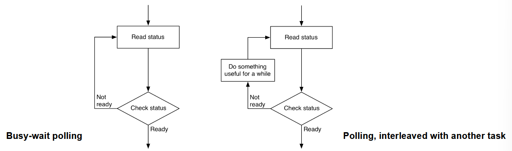

#### Interrupt-driven I/O

**Interrupt-driven I/O** is where the device controller sends an *interrupt request* (IRQ) to the CPU when it needs attention. This allows the CPU to perform its tasks while the I/O device is not ready, without constantly checking.

* The interrupt request, if not disabled by the code, forces the CPU to jump to an **interrupt service routine** (ISR) to handle the interrupt. This makes it appear that the CPU is performing two or more tasks simultaneously.

* When the CPU handles an interrupt, it has to perform a **context switch** to save its working state onto the stack, handle the interrupt, and then restore its working state. This incurs some overhead due to the two context switches.

* The interrupt service routine can be interrupted by something else, which is called a **nested interrupt**. A special type of interrupt called **non-maskable interrupts** (NMI) cannot be interrupted.

**Two design issues arise in implementing interrupt I/O:**
* with multiple I/O modules, how do we determine which device caused the interrupt?
* if multiple interrupts occurred, which one is handled first by the processor?

##### Interrupt Priorities

Interrupts are assigned *priorities* to solve the issue of deciding which interrupt is handled first. For example, you may want:

$$\text{hardware failure} > \text{real-time sensor} > \text{disk completed} > \text{keyboard input}$$

A lower-priority interrupt typically cannot interrupt a higher-priority handler. A higher-priority interrupt may be allowed to do so.

##### Device Identification

**To identify which device caused the interrupt, there are two potential methods**
1. multiple interrupt lines between the processor and I/O modules
2. software poll - poll each I/O module to determine which caused the interrupt
	* this is time consuming

A better method is to use a **daisy chain** / **hardware poll**
* interrupt acknowledge line is daisy chained through the modules
* requesting module puts the ISR address on the data lines, called a **vector**
* **vectored interrupt** - processor uses vector as pointer to the appropriate device-service routine

An alternative is to use **bus arbitration**
* I/O module first wins bus arbitration to take control of the system bus
* raises interrupt request line to signal to the processor
* processor responds on interrupt acknowledge line
* requesting module places its ISR address on the data bus

**Bus arbitration** is the technique of resolving conflicts when multiple devices simultaneously try to access the bus. It makes one of them the *bus master* to prevent data collisions.

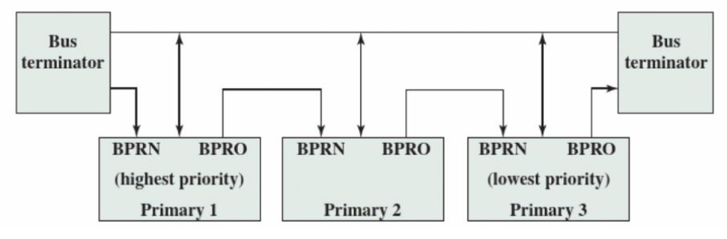

##### Advantages and Disadvantages

**Advantages**
* fast response - CPU not continually polling device
* no wasted CPU / battery power - CPU can do useful work until interrupt

**Disadvantages**
* every data transfer still controlled by CPU
* more complex hardware and software - requiring interrupt logic, handlers, context switching

### Direct Memory Access

**Direct memory access** is a technique where a separate controller, the **DMA Controller (DMAC)** is used to transfer data between I/O and memory, instead of the processor. It is used when large amounts of data must be transferred at high speed.

**Motivation**: 
* DMA avoids the CPU bottleneck, thus speeding up the transfer of data from I/O controllers to memory.
* Hence, DMA-based I/O can be more than 10 times faster than CPU-driven I/O

The DMAC is a dedicated device that controls the three system buses. It is optimised for data transfer, usually located on the system bus.  To transfer data, **control of system busses are surrendered by the CPU to the DMAC**.

When the processor wishes to read/write a block of data, it sends a request to the DMAC, including:
* R/W status
* I/O device address
* base address to read/write from, stored in the DMAC *address register*
* number of words to be read/written, stored in the DMAC *data count register*

#### DMA Operation Modes

The DMAC operates in multiple modes:
* **cycle stealing**
	* DMAC uses the system buses when they are not used by the CPU
* **burst mode**
	* locks the CPU out of the system buses for a fixed time, or until the transfer is complete, or the CPU receives an interrupt from a more important device
* **transparent mode**
	* CPU reclaims the bus anytime it needs it. DMAC remembers its state and continues as soon as the CPU releases the bus

#### DMA Organisation

There are three main ways to connect the DMAC to the system bus:

* **single bus, detached DMA**
	* all modules share the system bus
	* DMA module uses programmed I/O to exchange data between memory and I/O module
	* straightforward to implement for most bus-based systems, but is inefficient


* **single bus, integrated DMA - IO**
	* connect I/O devices to the DMA modules, rather than the system bus
	* bus cycles can be reduced by integrating DMA and I/O functions
	* DMA logic can sometimes be part of the I/O module

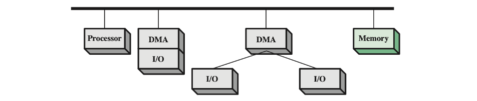

* **I/O bus**
	* I/O controllers are connected to a separate I/O bus, which is only accessed by the DMAC
	* this reduces the number of I/O interfaces in the DMA module to one
	* system bus is only used to transfer data to and from memory

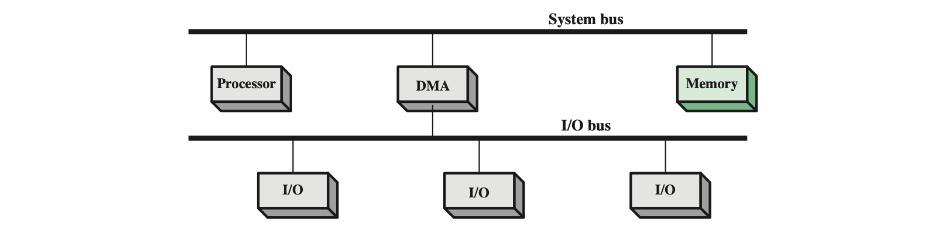


### I/O Technologies

There are various I/O technologies that can support direct memory access for fast data transmission:

* **PCI Express (PCIe)**
	* the modern high-speed *serial point-to-point interconnect* that carries DMA transactions
	* first introduced in 2005
	* peak bandwidth higher than any bus available
	* uses packet based transaction protocol

* **Thunderbolt**
	* general purpose I/O channel developed by Apple and Intel
	* combines data, video, audio, and power into a single high-speed connection
	* can provide up to 10Gbps in each direction, and up to 10 Watts of power
	* Based on **thunderbolt controller**
	* both thunderbolt and PCIe replace a shared bus, providing *simultaneous high-bandwidth connections*

* **InfiniBand**
	* I/O specification aimed at high end servers, mainly used in HPC and AI clusters.
	* competes against ethernet
	* Supports **remote direct memory access** - high throughput, low-latency memory over network
	* first released in 2001
	* intended to replace PCI in servers
