# CS258 Database Systems

## 1. Introduction to Database Management Systems

### Introduction

A **DBMS** (Database Management System) is software that sits between applications and the raw data on disk

It provides functions like:
1. storing data
2. modelling data
3. accessing data: query + update
4. analysing data: complex queries
5. securing data
6. ensure/maintain data consistency in the face of:
    * *failures* (machine crashes etc.)
    * *concurrent transactions* (multiple users reading/writing data at the same time)
7. optimise data accesses
    * create and employ indices
    * find best order for executing **data operators**

Databases can be viewed as a "black box" with an interface based on
* an easy to understand data model
* declarative programming language e.g. SQL

A DBMS is implemented in the **3 Schema Architecture**:
1. **External schema** - what the user / application sees
2. **Conceptual schema** - entity-relationship level
3. **Internal schema** - physical storage

This provides **data independence**:
* **Physical data independence** - change internal details without changing conceptual/external layers 
* **Logical data independence** - change conceptual schema without breaking applications

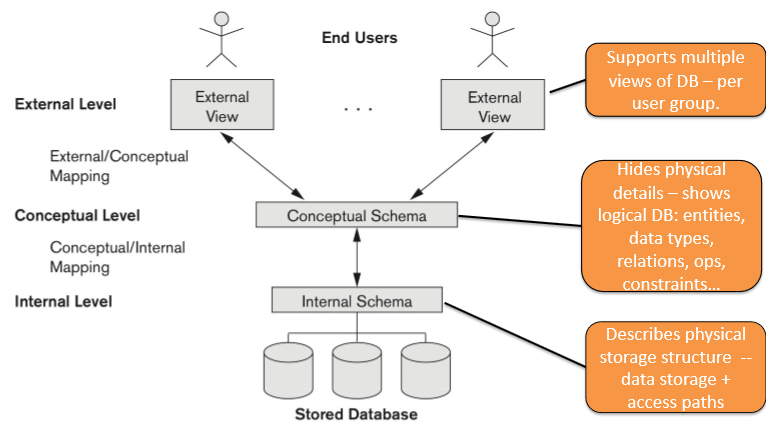
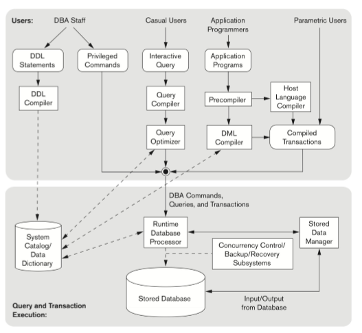


### Key facts about data

**Data is too large to fit in memory**
* stored on many disks spanning computers in clusters or disk farms
* decentralised - internet, cloud services etc.

**Data comes in many types**
* **Structured** - tables with predefined columns
* **Semi-structured** - XML, JSON
* **Unstructured** - web pages, text docs

Traditionally, DBs manage structured (tabular data)

### Relational Model

**Def**. A **relation** is a table of values, having
* a set of rows called tuples
* each column represents an *attribute*

Informally, a relation is often called a *table*.

The **schema** of a relation is the relation's blueprint.
* denoted $R(A_1, A_2, \cdots, A_n)$ where $R$ is the name and
* $A_1, A_2, \cdots, A_n$ are the attributes of the relation.
* Each attribute has a domain, denoted $\text{dom}(A_i)$.

$r(R)$ is denoted the **state** or *instance* of relation $R$ and is a actual *set of tuples*
* $r(R) = \{t_1, t_2, \cdots, t_m\}$ where each $t_i$ is a tuple
* $t_i = \langle v_1, v_2, \cdots, v_n \rangle$ where each $v_j \in \text{dom}(A_j)$
* $r(R) \subset \text{dom}(A_1) \times \text{dom}(A_2) \times \cdots \times \text{dom}(A_n)$

**Def**. A **database** is a collection of relations.

**Def**. A **database schema** is the set of all relation schemas in the database.

Advantages of relational mode:
* very simple - good way to think about data and how to access it
* abstract model, but has been enriched with *declarative* languages like SQL

The abstract relational model is **set-oriented**
* no duplicate tuples / rows

However, SQL uses **bag-semantics** (multisets)
* this allows duplicate tuples / rows

### Relational Database Constraints

**Constraints** are used to determine the *permissible states* of relation instances.

Three (explicit schema-based) constraints used in RDBMS:

* **Key constraint**: 
    * key values must be unique

* **Entity integrity**: 
    * primary key attributes cannot be NULL
    * any attribute of $R$ may be not allowed to be NULL (depending if NOT NULL is specified)

* **Referential integrity**: every foreign key value must match an existing referenced key (or be NULL, if allowed)

And then there are **domain constraints**
* attributes must come from the *domain of the attribute*
* could be NULL as well

Lastly there are *semantic attribute integrity constraints*. These depend on application semantics
* e.g. Bank balance >= 0
* employee salary < manager salary

### Keys

**Def**. A **superkey** of relation $R$ is a **subset** of attributes $SK$ that uniquely identify tuples in $R$
* i.e. if $t_1 \ne t_2$, then $t_1[SK] \ne t_2[SK]$

**Def**. A **candidate key** is a **minimal** superkey, i.e. removing any attribute from  candidate key $K$ results in a set of attributes that aren't a superkey

**Def**. The **primary key** is the identifier for the rows. It is chosen from one of the candidate keys.

**Def**. A **foreign key** is a set of attributes that reference a **primary key** in another table
* are used when we have cross-table relationships

### Constraints and Updates

Constraints concern database updates, which may cause constraint violations.

**INSERT** operation
* **domain**: one of the attribute values for new tuple aren't in the attribute domain
* **key**: key value already exists
* **referential integrity**: foreign key references primary key that doesn't exist in referenced relation
* **entity integrity**: if primary key value is null
    
**DELETE** operation
* cannot cause entity integrity or domain constraint violations
* **referential integrity**: if primary key value of tuple being deleted is referenced from other tuples

**UPDATE** operation
* domain, NOT NULL constraints may be violated
* **updating primary key**: new value may be a duplicate
* **updating a foreign key**: may violate referential integrity

## 2. Introduction to SQL

### 2.1 SQL as a DDL

#### Data Definition Language

A **data definition language** is a declarative language used to define schemas, relations, constraints etc.

**SQL** is a data definition language, which provides these core commands:
* `CREATE SCHEMA` - create a collection of relations
* `CREATE TABLE` - define columns + types + constraints
* `ALTER TABLE` - add/drop/modify columns/constraints
* `DROP TABLE` - remove table definition (and data)

One example is:
```sql
CREATE TABLE orders (
  order_id   BIGINT PRIMARY KEY,
  user_id    BIGINT NOT NULL,
  created_at TIMESTAMP NOT NULL DEFAULT CURRENT_TIMESTAMP,
  status     TEXT NOT NULL CHECK (status IN ('pending','paid','shipped')),
  total      NUMERIC(10,2) NOT NULL CHECK (total >= 0),

  UNIQUE (order_id), -- redundant here (PK already unique), shown just as syntax

  FOREIGN KEY (user_id) REFERENCES users(user_id)
    ON DELETE RESTRICT
    ON UPDATE CASCADE
);

```
#### Data Types

Each column **must** have a data type. Common data types are:
* `INT`
* `DECIMAL`
* `CHAR(n)` / `VARCHAR(n)`
* `TEXT`
* `BOOLEAN`
* `DATE` / `TIME` / `TIMESTAMP`

#### Constraints

* `NOT NULL` - declares a column to be not null
* `PRIMARY KEY (...)` - declares a set of attributes to be a primary key
* `UNIQUE` - declares a candidate key (can be NULL)
* `CHECK` - check constraint
* `DEFAULT` - specify default value, for example
    ```sql
    created_at TIMESTAMP NOT NULL DEFAULT CURRENT_TIMESTAMP
    ```
* `FOREIGN KEY` - foreign key constraint, for example
    ```sql
    FOREIGN KEY (courseID) REFERENCES courses(courseID) ON UPDATE CASCADE
    ```
    * We can attach **referential triggered action clauses**, such as `SET NULL`, `CASCADE`, `SET DEFAULT`
    * Action to be taken upon violation of types of updates, e.g. `ON DELETE` and `ON UPDATE`

### 2.2 SQL as a DML

#### Data Manipulation Language

A **data manipulation language** provides updates and queries. SQL is a data manipulation language, providing core features like `INSERT`, `UPDATE`, `DELETE`, and `SELECT` to query data.

##### Inserting into a table

* note: need to remember schema of the table
```sql
INSERT INTO <tableName>
VALUES (<val1>, <val2>, ..., <valn>)
```


##### Inserting partial records

* provide a partial attribute list
* values for unspecified attributes are
    * set to `NULL` (constraints permitting) or,
    * set to their `DEFAULT` if applicable.
* two reasons to do so:
    * we forget the standard order of attributes for the relation
    * we don't have values for attributes so we let the system fill in missing components.

```sql
INSERT INTO <tableName> <A1, ..., Aj>
VALUES (<val1>, ..., <valj>)
```

##### Deleting from a table

* deletes tuples from a table. note this does not delete the table itself
* semantics of deletion: proceeds in two stages.
    1. mark all tuples for where WHERE condition is satisfied
    2. delete marked tuples

```sql
WHERE <expression>;
DELETE FROM <tableName>
```

##### Updating tuples in a table

```sql
UPDATE <tableName>
SET <attName1> = <val>, <attName2> = <val>, ...
WHERE <expression>
```


#### Queries

Queries are performed using the `SELECT` statement, which have the form:

```
SELECT ...
FROM ...
JOIN ...
WHERE ...
GROUP BY ...
HAVING ...
ORDER BY ...
LIMIT ...
```

The select field can contain:
* *attributes*,
* *expressions* like `price * 1.3` or
* constant expressions like `'likes Bud'`

The where clause expression can use boolean operators `AND`, `OR`, and `NOT`.

#### Name Aliasing

**Aliasing**. Aliasing of attributes can be done with `AS`
* for example, aliasing columns:
```sql
SELECT s.studentID FROM students s
```

* It is common to alias the table name, which is necessary for certain operations like self joins to specify which table it came from

#### 3-Valued Logic

**3-Valued Logic**. NULL has weird semantics due to 3-Valued Logic:
* `TRUE`, `FALSE`, and `UNKNOWN`

To check if a column is NULL, use `IS NULL` or `IS NOT NULL`
* note: `=NULL` will never evaluate to true

NULL is useful in many contexts. Three common cases:
* unknown value
* unavailable value: e.g. address we don't know yet
* inapplicable: e.g. spouse attribute for unmarried person

#### String Patterns

`LIKE` and `NOT LIKE` can be used to compare strings to patterns
* `%` = any string
* `_` = any character

#### Joins

In the relational model, data is split into multiple tables due to normalisation
* Tables must be **joined** to query data across tables

```sql
select <attList>
FROM <table1>
NATURAL [LEFT OUTER | RIGHT OUTER | INNER] JOIN
<table2>;
```

##### Cross Joins

The most basic type of join is the **cross join**, i.e. cartesian product
* If $|A| = m$ and $|B| = n$, then $|A \times B| = m \times n$
* In modern SQL, this is written as `SELECT * FROM A CROSS JOIN B`
* In simplest terms, is written as `SELECT * FROM A, B`

##### Theta Joins

The **theta join** extends the cross join by providing a **join condition**
* written as `R JOIN S ON <condition>`

For theta joins, instead of usig `ON` to specify conditions, `USING` can be used for **equi-joins**:
* Instead of `SELECT * FROM students s INNER JOIN studentCourses c ON s.studnetID = c.studentID;`
* we can do `SELECT * FROM studnets s INNER JOIN studentCourses c USING (studnetID);`

##### Types of Joins

**Natural join**. joins two tables by common attributes.
* written as `A NATURAL JOIN B`
* only one of each set of duplicate columns is kept.
* keeps only tuples from product where same-name-type attributes have same value.

**Inner joins**.
* `INNER JOIN`: the **default type** of join
    * rows from both `R` and `S` must exist to be joined.

There are also **outer joins**, which preserve rows by substituting NULL for non-existent values
* `LEFT OUTER JOIN` preserves data from left table, puts NULL for right table if not exists
* `RIGHT OUTER JOIN` preserves data from right table
* `FULL OUTER JOIN` is the default - pads both left and right

**Note**. Natural joins can be inner or outer (left/right) joins.
* they differ in that they don't specify an `ON` clause
* instead they match on the basis of attributes that share a name in both tables
* default is `INNER JOIN`.

### 2.3 Subqueries, Set Operations, Quantifiers

#### Subqueries

**Queries** itself can be used in the `WHERE` clause of another query
* This is called a **subquery**

Subqueries can be:
* **Non-correlated** - can run on its own
* **Correlated** - depends on outer row (runs "per row" conceptually)

Two common operators used with subqueries are:
* `EXISTS(table)` - returns true if the table is not empty
* `IN(table)` - returns true if row is in the table

#### Set Operations and Quantifiers

`ANY` and `ALL` behave as **existential** and **universal** quantifiers:
* `x > ALL (subquery)` means $x$ is greater than every value returned
* `x > ANY (subquery)` means $x$ is gerater than at least one value returned

Set operations can be used to combine queries:
* `UNION` - union of two tables
* `INTERSECT` - intersection of two tables
* `EXCEPT` (postgres) / `MINUS` (oracle) - set difference of two tables

**Fact**. Set operations by default use **set semantics**
* this is because set semantics are more efficient.
* intersection/difference is calculated efficiently by sorting the relations first, at this point you may as well eliminate duplicates.

Appending `ALL` turns it into **multiset semantics**
* e.g. `UNION ALL`, `INTERSECT ALL`, `EXCEPT ALL`.

The `DISTINCT` operator turns SQL's default multiset semantics into **set semantics**
* e.g. `SELECT DISTINCT * FROM A` returns all distinct rows from `A`

### 2.4 Aggregation and Window Functions

#### Aggregation Functions

An **aggregation function** is used to compute results based on multiple columns

Some common aggregation functions are:
* `COUNT(*)` - number of rows
* `COUNT(col)` - number of non-NULL values in `col`
* `SUM(col)` - sum of a column
* `AVG(col)` - average of a column
* `MIN(col)` - minimum of a column
* `MAX(col)` - maximum of a column

**Note**. `NULL` never contributes to a sum, average, or count, and can never be the minimum or maximum of a column.

`GROUP BY` is used to group the aggregation by a set of columns. In the **SELECT** clause, attributes must be either:
* aggregated, or
* part of the `GROUP BY` statement.

**Having clause**. To apply a **filter** on aggregated functions, use the `HAVING` clause

Core syntax:
```sql
SELECT group_cols, AGG_FUNC(cols)
FROM ...
WHERE row_filter
GROUP BY group_cols`
HAVING group_filter
ORDER BY ...
```

#### Window Functions

Window functions compute values **across related rows**, but **do not collapse** the result like `GROUP BY` does

Core syntax:
```sql
<window_function>(...) OVER (
    PARTITION BY ...
    ORDER BY ...
    [ROWS/RANGE frame ...]
)
```

* `PARTITION BY` defines the groups to aggregate over
* `ORDER BY` defines the order within each partition

For example, this query gets each employee + their department average salary
```sql
SELECT e.emp_id, e.dept_id, e.salary,
        AVG(e.salary) OVER (PARTITION BY e.dept_id) AS dept_avg
FROM employee e;
```

##### Ranking Window Functions

Given a partition and an order:
* `ROW_NUMBER()` retrieves the row number (no ties)
* `RANK()` - ties share rank, and **skips numbers** after ties e.g. (1,1,3,...)
* `DENSE_RANK()` - ties share rank, but there are **no gaps** e.g. (1,1,2,...)

For example to calculate the **top 3 salaries per department**:
```sql
SELECT * FROM (
    SELECT e.*, ROW_NUMBER() OVER (
        PARTITION BY e.dept_id ORDER BY e.salary DESC
    ) AS rn
    FROM employee e
) t WHERE t.rn <= 3;
```

##### Running totals and moving calculations

We can use `ROWS` to specify a sliding window to perform the window function over
* `UNBOUNDED PRECEDING` - no limit to the left
* `CURRENT ROW` - the current row

For example, to get running total per user ordered by time:
```sql
SUM(amount) OVER (
    PARTITION BY user_id 
    ORDER BY ts 
    ROWS BETWEEN UNBOUNDED PRECEDING AND CURRENT ROW
)
```

To get the moving average (e.g. last 7 rows)
```sql
AVG(amount) OVER (
    PARTITION BY user_id 
    ORDER BY ts
    ROWS BETWEEN 6 PRECEDING AND CURRENT ROW
) AS moving_avg_7
```

##### LAG/LEAD (differences between rows)

Used to refer to rows preceding and following the curent row
* `LEAD()` gets the next row, `LEAD(2)` gets the row 2 in front
* `LAG()` gets the previous row, `LAG(2)` gets the row 2 behidn

E.g. next event time:
```sql
LEAD(ts) OVER (PARTITION BY user_id ORDER BY ts) AS next_ts
```

### 2.5 Common Functions

**NULL handling**
* `COALESCE(a,b,c)`: retrieves first non-NULL
* `NULLIF(a,b)`: NULL if a = b
* `CASE WHEN ... THEN ... ELSE ... END`: case statement
* `IF(cond, x, y)`: MySQL-only shortcut for CASE
* `IFNULL(a,b)`: 2-arg COALESCE for MySQL only

**String**
* `LOWER()`, `UPPER()`
* `LENGTH()`
* `SUBSTRING()`
* `REPLACE()`
* `TRIM()`
* Concatenation: `||` in postgres, `CONCAT()` in MySQL

**Numeric**:
* `ABS()`, `ROUND()`, `CEIL()`, `FLOOR`
* `POWER(a,b)`, `SQRT()`
* `MOD(a,b)` / `%` in postgres
* Random numbers: `random()` in postgres, `RAND()` in MySQL
* `GREATEST(a,b,...)`, `LEAST(a,b,...)`

**Date/time**
* `CURRENT_TIMESTAMP`, `CURRENT_DATE`, `CURRENT_TIME`, `NOW()`
* Extracting parts:
    * Postgres: `EXTRACT(YEAR FROM ts)`
    * MySQL: `YEAR(ts)`, `MONTH(ts)`, `DAY(ts)` etc.
* Date arithmetic
    * Postgres: `ts + INTERVAL '7 days'`
    * MySQL: `DATE_ADD(ts, INTERVAL 7 DAY)`, `DATE_SUB(...)`

**Pattern Matching** + **Regex**
* `LIKE`
    * `%` is any number of characters
    * `-` is one single character
* **Regex**:
    * Postgres: `col ~ 'pattern'`
    * MySQL: `col REGEXP 'pattern'`

**Type casting**
* `CAST(x AS type)`
* Postgres only: `x::type`

## 3. Advanced SQL

### 3.1 Views, Assertions, and Altering Tables

#### Database Schemas

Schemas can be created with the `CREATE SCHEMA` statement, e.g.
```sql
CREATE SCHEMA studentInfo AUTHORIZATION 'JSmith'
```

We can find more about a table schema using `\d` in postgres:
* `\d <table name>` provides information about a table schema

`information_schema.columns` contains data about the columns in all tables:
```sql
SELECT * FROM information_schema.columns WHERE table_name = 'R';
```

#### Assertions

Assertions are a type of *constraint* enforced by the DBMS that apply to the **whole database state**. They tend to be more heavyweight than other mechanisms like `CHECK` or `NOT NULL`
* satisfied as long as no combination of tuples in the database violates it
* meant to detect "fail" states

```sql
CREATE ASSERTION assertion_name CHECK(condition);
```

#### Drop Table

The `DROP TABLE` statement destroys the table, including the data in it.
* `IF EXISTS`: does not throw an error if table does not exist
* `CASCADE`: remove foreign key constraints of other tables that reference it
* `RESTRICT`: drop only if table is not referenced by other elements

```sql
DROP TABLE [IF EXISTS] tableName [,...] [CASCADE | RESTRICT]
```

#### Alter Table

The `ALTER TABLE` statement alters a table. We can add columns, remove columns, change data types, rename columns, rename table etc.

**Add column**: add new column, values initially filled with NULL
```sql
ALTER TABLE <tableName>
ADD <attName> <dataType> <constraints>;
```

**Drop column**: remove column/attribute name and destroy data
```sql
ALTER TABLE <tableName>
DROP COLUMN <attName>;
```

**Change data type**:
```sql
ALTER TABLE <tableName>
ALTER COLUMN <attName> TYPE <newDataType>;
```

**Renaming table**:
```sql
ALTER TABLE <tableName>
RENAME TO <newTableName>;
```

**Rename column**:
```sql
ALTER TABLE <tableName>
RENAME COLUMN <attNameOld> TO <attNameNew>;
```

**Add constraint**
```sql
ALTER TABLE <tableName>
ADD CONSTRAINT <constraintName> <constraints>;
```

**Drop constraint**:
```sql
ALTER TABLE <tableName>
DROP CONSTRAINT <constraintName>;
```

**NOTE**. We cannot modify an existing constraint. We must drop the existing constraint and recreate the constraint with desired modifications.

#### Views

- A **view** is a *named query* that behaves like a table
    * It doesn't usually store data, it behaves like a **virtual table**
    * Querying a view substitutes the view's definition

- For example:
    ```sql
    CREATE VIEW active_users AS
    SELECT user_id, email
    FROM users
    WHERE is-active = true;
    ```

- Views provide:
    * **Abstraction / readability**: hides complex joins
    * **Security**: expose only a certain set of columns / rows
    * **Stability**: keep a stable interface while underlying tables evolve

- Some views can be **updatable**:
    * usually only if it maps cleanly to a single base table
    * postgres has rules for when a view is automatically updatable

#### Materialised Views

- A **materialised view** *stores the result* of the query physically
    ```sql
    CREATE MATERIALIZED VIEW monthly_sales AS
    SELECT date_trunc('month', paid_at) AS month,
           SUM(amount) AS total
    FROM payments
    WHERE status = 'paid'
    GROUP BY 1;
    ```

- The view must be **refreshed** to keep data updated:
    ```sql
    REFRESH MATERIALIZED VIEW monthly_sales;
    ```

- **Pros**:
    * Fast reads (precomputed)
    * Great for reporting / analytics

- **Cons**:
    * Can be stale
    * Refresh cost (and locking behaviour depends on DB)

- View vs Materialized view:
    * **View**: mainly abstraction/security; performance depends on base query
    * **Materialised view**: performance boost by precomputing results


### 3.2 Database programming

#### Two and Three-Tier Client-Server Architecture

In the two-tier client server architecture there are clients and the DB server.
* client applications utilise an API to access databases via standard interfaces like 
    * JDBC for java programming
    * Embedded SQL for C programming
* DB servers provide database services to clients

However, often the application layer is desirable as the DBMS is exposed directly to many clients. That means every client may need database credentials.

This can cause problems:
* **security**: clients directly access db server
* **maintenance**: if db schema changes, many client applications may need updating
* **scalability**: many clients connected many overload it

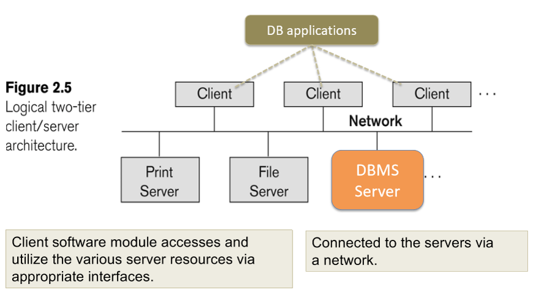

The **three-tier** client-server architecture for database programming involves an extra application layer:
* Client - GUI, Web interface
* Application Server - this is where DB applications are located
* Database server - DBMS

This is usually preferred as clients don't directly access the database - only the application server requires credentials.

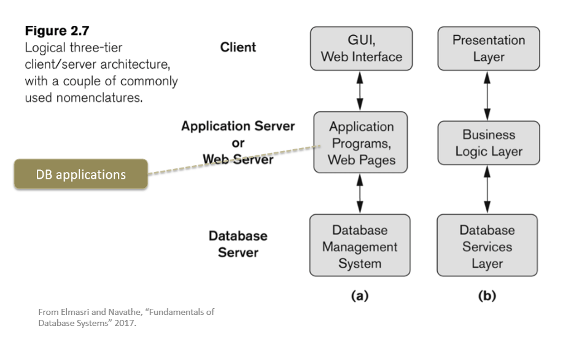

#### PSMs

Sometimes, application logic may be embedded at the DB server instead of only at the application layer. This application logic is known as **Persistent Stored Modules** (PSMs)

A **PSM** (Persistent Stored Module) is code stored and executed inside the database server
* Mainly uses **procedures** and **functions**

They use:
* procedural constructs (variables, loops, IF/ELSE, exceptions)
* can run multiple SQL statements in one call
* can control transactions (in postgres, functions cannot `COMMIT`/`ROLLBACK`)

Procedures vs functions:
* **Function**: returns a value/table; often used in SELECTs
* **Procedure**: called for actions

**Pros** of PSMs
* **Performance** - fewer client-server round trips, execute close to data
* **Security** - grant permission to execute a procedure instead of direct table access
* **Consistency** - enforce a workflow does all required inserts/updates safely
* **Reusability** - shared logic across many apps/services

**Cons** of PSMs
* Harder versioning/testing than app code
* DB vendor lock-in (PL/pgSQL vs MySQL stored program syntax differs0
* Debugging and observability can be worse than in application code
* Logic split across app + DB can confuse ownership

PostgreSQL function:
```sql
CREATE OR REPLACE FUNCTION top_customers(p_limit int)
RETURNS TABLE(user_id bigint, total_spend numeric)
LANGUAGE sql
AS $$
    -- insert query here ...
$$;
```

PostgreSQL procedure:
```sql
CREATE OR REPLACE PROCEDURE transfer(p_from bigint, p_to bigint, p_amount numeric)
LANGUAGE plpgsql
AS $$
BEGIN
    -- insert code here ...
END;
$$;
```

MySQL function:
```sql
DELIMITER //

CREATE FUNCTION apply_discount(p_amount DECIMAL(10,2), p_pct DECIMAL(5,2))
RETURNS DECIMAL(10,2)
DETERMINISTIC
BEGIN
    -- insert code here ...
END//

DELIMITER ;
```

MySQL procedure:
```sql
DELIMITER //

CREATE PROCEDURE transfer(IN p_from BIGINT, IN p_to BIGINT, IN p_amount DECIMAL(10,2))
BEGIN
    -- insert code here ...
END//

DELIMITER ;
```

#### Triggers

A **trigger** is code that runs automatically when an event happens on a table (or view)
* Triggers are **event-driven** 
* they fire on events like `INSERT`, `UPDATE`, `DELETE` etc.

**Trigger timing**:
* `BEFORE` triggers: run before the row is written
    * good for validation / modifying the row
* `AFTER` triggers: run after the change
    * good for auditing / side effects
* `INSTEAD OF` triggers: mainly for views

**Trigger granularity**:
* **Row-Level** runs once per affected row (`FOR EACH ROW`)
* **Statement-level**: runs once per statement

For example:
```sql
CREATE OR REPLACE FUNCTION set_updated_at()
RETURNS trigger AS $$
BEGIN
    NEW.updated_at := now();
    RETURN NEW;
END;
$$ LANGUAGE plpgsql;

CREATE TRIGGER trg_set_updated_at
BEFORE UPDATE ON users
FOR EACH ROW
EXECUTE FUNCTION set_updated_at();
```

**Triggers can be dangerous as**:
* They hide side effects
* Affect performance, e.g. row triggers on bulk updates are expensive
* Concurrency issues: race conditions unless you lock correctly
* Recursion: triggers triggering triggers

In PostgreSQL, there are **constraint triggers**:
* used to enforce cross-row / cross-table constraints
* created using `CREATE CONSTRAINT TRIGGER ...`
* can be `DEFERRABLE`, `INITALLY DEFERRED` or `INITIALLY IMMEDIATE`

## 4. Normalisation

### 4.1 Motivations

**Relational DB Design** is concerned with developing a good *model* of DB data, focusing on how to define the right tables.
* how to *group attributes together*
* how to ensure a grouping has desirable properties

**Guidelines for good relational database design**
1. each tuple in a relation should represent one entity or relationship instance.
2. redundancy of tuples information is harmful and must be avoided. two main reasons:
    * **storage costs**: replicating info wastes storage space
    * **consistency costs and potential anomalies**. Replicas must be kept consistent during updates.
3. `NULL` values within tuples is harmful and must be avoidable.
    * Attributes whose value is frequently NULL should not be a part of that schema.
4. design relations to avoid **spurious tuples**
    * **Def**. Spurious tuples are tuples created by joining on an attribute that isn't a key

**Normalisation** is a way of designing relational schemas to reduce **redundancy** and avoid **anomalies**:
* *Update anomaly*: you must update the same fact in multiple places
* *Insert anomaly*: you can't insert one fact without another unrelated fact
* *Delete anomaly*: deleting a row accidentally deletes a fact you still wanted to keep

### 4.2 Functional Dependencies

#### Definition

**What are functional dependencies?**
* they are *constraints* derived from the *meaning* and *interrelationships* of the data attributes of a relation schema.
* $X \to Y$ means the values of $Y$ are *uniquely determined* by the values of $X$.

**Def**. A **functional dependency** $X \to Y$ over schema $R$ means:
* for any valid instance $r(R)$
* for all $t_1, t_2 \in r(R)$, then
* if $t_1[X] = t_2[X]$ then $t_1[Y] = t_2[Y]$
* i.e. whenever two tuples agree on all attributes in $X$, they must agree on all attributes in $Y$.

**Note**. FDs are derived from the real-world constraints on the attributes.
* inspecting a given $r(R)$ can *only* say if a FD does *not hold*. We cannot conclude if a FD holds.
* derived from real world scenarios:
    * e.g. no two modules can meet in the same room at the same time
    * yields `{room, time} -> module`

**Fact**. If $X$ is a key then $X \to Y$ for any subset of attributes $Y$ of $R$.

**Note**. A functional dependency is a property of the relation schema, NOT of the relation state.

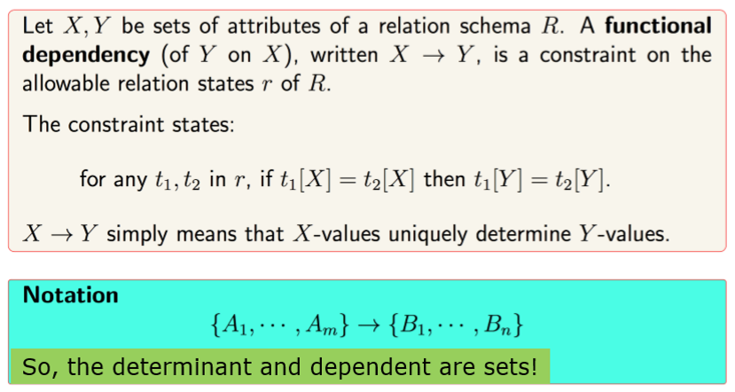

#### Armstrong's Inference Rules

**Def**. The *closure* $F^+$ of a set of functional dependencies $F$ is the set of all implied functional dependencies from $F$.

Implied functional dependencies are derived using **Armstrong's inference rules** (IR1, IR2, IR3). These form a *sound* and *complete* set of inference rules. 

**Notation**. $XZ$ stands for $X \cup Z$.

All other rules that hold can be deduced from these. (IR4, IR5, IR6)


##### **IR1** (*Reflexive*)

**Theorem** (IR1). If $Y \subseteq X$, then $X \to Y$.
* superset determines the subset.
* also called *trivial functional dependency*.

**Proof**. (by contradiction)
* suppose for a contradiction that $\neg(X \to Y)$
* then $\exists t_1, t_2 \in r(R)$ s.t. $t_1[X] = t_2[X] \land t_1[Y] \ne t_2[Y]$
* since $X$ is a superset of $Y$, $X = ZY$ for some set of attributes $Z$.
* since $t_1[X] = t_2[X]$, then $t_1[ZY] = t_2[ZY]$
* so $t_1[Y] = t_2[Y]$
    * because if the whole tuple agrees then the $Y$ component agrees too.
* this is a contradiction!

##### **IR2** (*Augmentation*)

**Theorem** (IR2). If $X \to Y$, then $XZ \to YZ$.

**Proof**. 
* We wish to prove if $t_1[XZ] = t_2[XZ]$ then $t_1[YZ] = t_2[YZ]$ for all $t_1, t_2 \in r(R)$.
* Suppose $t_1[XZ] = t_2[XZ]$.
* Then $t_1[X] = t_2[X]$ and $t_1[Z] = t_2[Z]$.
* Since $X \to Y$ (by premise), $t_1[Y] = t_2[Y]$.
* So $t_1[Y] = t_2[Y]$ and $t_1[Z] = t_2[Z]$.
* Therefore $t_1[YZ] = t_2[YZ]$.
* Hence $XZ \to YZ$.

##### **IR3** (*Transitive*)

**Theorem** (IR3). If $X \to Y$ and $Y \to Z$, then $X \to Z$.

**Proof**.
* Take any two tuples $t_1, t_2 \in r(R)$.
* Suppose $t_1[X] = t_2[X]$.
* Since $X \to Y$, we have $t_1[Y] = t_2[Y]$.
* Since $Y \to Z$ and we know $t_1[Y] = t_2[Y]$, we have $t_1[Z] = t_2[Z]$.
* So $X \to Z$.

##### **IR4** (*Decomposition*)

**Decomposition Rule** (IR4). If $X \to YZ$, then $X \to Y$ and $X \to Z$.

**Proof**. (using armstrong's rules):
* By reflexive rule, $YZ \to Y$, and $YZ \to Z$.
* Since $X \to YZ$ and $YZ \to Y$, by transitive rule, $X \to Y$.
* Since $X \to YZ$ and $YZ \to Z$, by transitive rule, $X \to Z$.

##### **IR5** (*Union*)

**Union Rule** (IR5). If $X \to Y$ and $X \to Z$, then $X \to YZ$.

**Proof**. (using armstrong's rules)
* Since $X \to Z$, by augmentation rule, $XX \to XZ$, so $X \to XZ$.
* Since $X \to Y$, by augmentation rule, $XZ \to YZ$.
* Since we have $X \to XZ$ and $XZ \to YZ$, by transitivity, we have $X \to YZ$.

##### **IR6** (*Pseudotransitivity*)

**Pseudotransitivity** (IR6). If $X \to Y$ and $WY \to Z$, then $WX \to Z$.

**Proof**. (using armstrong's rules)
* Since $X \to Y$, by augmentation, we have $WX \to WY$.
* Since we have $WX \to WY$ and $WY \to Z$, by transitivity, we have $WX \to Z$.

#### Test for Non-additive Join Decompositions

When decomposing tables, we desire **lossless or non-additive decomposition**:
* Joining decomposed tables should reconstruct the original data **without spurious tuples** 
* This is critical as it ensures there are no spurious tuples are created when joining.

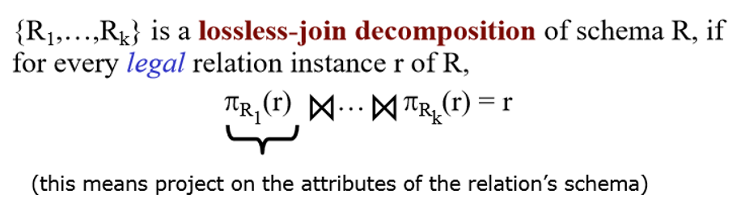

In general, given $R$ and a set of functional dependencies $F$, $R_1, R_2$ is a lossless decomposition of $R$ in $F$ **if and only if**:
    
* $R_1 \cap R_2 \to (R_1 \setminus R_2)$, or
* $R_1 \cap R_2 \to (R_2 \setminus R_1)$ exists in $F^+$

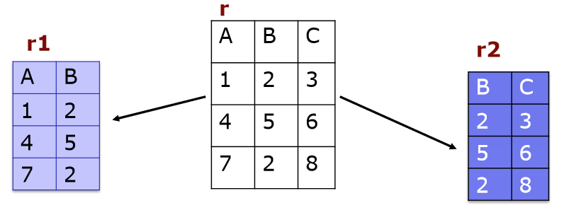
**Example**
* $R_1 \cap R_2 = B$ = $\{2, 5, 2\}$
* $R_1 \setminus R_2 = A$ = $\{1, 4, 7\}$
* $R_2 \setminus R_1 = C$ = $\{3, 6, 8\}$
* condition 1: does $B \to A$ hold? No.
* condition 2: does $B \to C$ hold: No.
* So $R_1, R_2$ is not a lossless decomposition of $R$.

#### Dependency Preservation

**Dependency preservation** is the ability to check **all** functional dependencies without joining after decomposing a relation.

This is important, because
* otherwise checking updates for violation of FDs may require computing joins
* joins are an expensive operation

This is sometimes not possible, but is a desired property after decomposing relations.

### 4.3 Normal Forms


**Normalisation** is a multi-step process beginning with an "unnormalised" relation.

**Goal**: decompose relations by
* reducing redundancy / avoid anomalies
* while preserving dependencies
* in a lossless-join manner.

There are many **normal forms** of relational databases:
* typically, 3NF (or BCNF) suffice
* All normal forms up to BCNF depend on functional dependencies

**Overview of NF definitions**:
* $\text{1NF}$: all attributes are atomic and there is a *key*
    * "the key"
* $\text{2NF}$: non-key attributes must be dependent on the *full key*
    * "the whole key"
* $\text{3NF}$: non-key attributes must *only depend* on the key
    * "nothing but the key"
* $\text{BCNF}$: if every determinant (of a non-trivial FD) is a superkey 
    * BCNF stands for *Boyce-Codd Normal Form*

There are normal forms 4NF, 5NF, 6NF but these aren't examined in this module.

#### 1NF

**A relation is in 1NF** if:
* every attribute value is **atomic**
    * i.e. no "multiple values in one cell"
    * formally, the domains of attributes must be *atomic*
    * this simplifies attributes - queries become easier
* **and** there is a *key*

**This disallows**:
* Multi-valued attributes
* Composite attributes

To move to 1NF, convert all multi-valued attributes into separate rows

**Storage anomalies of relations in 1NF**:
1. *update anomaly*
    * same fact is stored in multiple rows, so updating it requires changing many rows.
    * if we miss one row, the database becomes inconsistent.
2. *insertion anomaly*
    * can't insert one fact without inserting unrelated facts.
3. *deletion anomaly*
    * deleting one row accidentally removes useful facts.

#### 2NF

**A relation is in 2NF** if:
* it is in 1NF, and
* every *nonkey* attribute is **fully functionally dependent** on any key.
    * i.e. if the key is $\{A, B\}$, then a non-key attribute shouldn't depend on just $A$ or $B$.

**Example**.
* If we had a primary key `(StudentID, CourseID)`
* Then dependency `StudentID -> StudentName` would be a *partial key dependency* and not satisfy 2NF.

**Note**.
* 2NF only concerns non-key attributes that are partly dependent on any key.
* If any key is a single attribute, then in 1NF it is also automatically in 2NF.

2NF removes anomalies caused by *partial dependency*.

However, 2NF can still include storage anomalies:
* *transitive dependencies* - this is fixed in 3NF
* update, deletion, update anomalies due to transitive dependencies.

#### 3NF

**A relation is in 3NF** if:
* it is in 2NF, and
* there is no **transitive functional dependency** from a key to non-key attribute

**NB**. When one non-key attribute determines another non-key attribute, this leads to a transitive functional dependency.

**Key Idea**. 3NF removes dependencies of the form:
* `key -> non-key -> non-key`

**Example**.
* If we have `StudentID -> DepartmentID` and `DepartmentID -> DepartmentName`
* and `StudentID` is a key.
* Then we have `StudentID -> DepartmentName` indirectly, which violates 3NF.

More formally, for every non-trivial FD $X \to A$, at least one holds:
1. $X \to A$ is trivial, meaning $A \subseteq X$.
2. $X$ is a **superkey**, or
3. $A$ is a **prime attribute** (part of some candidate key)

Fortunately, it is always possible to find a dependency-preserving lossless-join decomposition that is in 3NF

#### BCNF

A relation is in **BCNF** if
* for every non-trivial FD $X \to Y$
* $X$ is a superkey
* i.e. every determinant must be a superkey.
    * **Def**. a **determinant** is the LHS of a functional dependency.

Most 3NF relations are also BCNF relations.

A 3NF relation is **not** in BNCF if:
* There is a determinant attribute that is *not* a superkey in a non-trivial f.d.
* Key difference from 3NF is that the RHS not be a prime (key) attribute, unless the f.d. is trivial

**Example**.
* Suppose we have `Student, Course -> Lecturer` and `Lecturer -> Course`.
* Candidate keys: `(Student, Course)`, `(Student, Lecturer)`
* `Lecturer -> Course` violates BCNF because `Lecturer` is not a superkey.
* but this is in 3NF because `Course` is a **prime attribute** (key attribute)

**Disadvantage of BCNF**:
* Dependency preservation is not guaranteed
* Sometimes, 3NF may be used instead if dependency preservation is important

**Hence, a good goal for RDBMS design is**:
* BNCF, lossless-join decomposition, dependency preservation
* if we can't achieve this, either choose BCNF and accept lack of dependency preservation, or choose 3NF.

### 4.4 Denormalisation

**Denormalisation** means intentionally adding redundancy back into the schema to improve **performance** or **simplicity of queries**
* this is becuse joins are expensive

Common denormalisation techniques:
* Storing derived values
* duplicating attributes to avoid joins
* precomputed summary tables / materialised views

**Denormalisation is good when**:
1. read-heavy workloads + expensive joins
2. reporting / analytics
3. when data changes rarely
4. can enforce consistency reliably

**Denormalisation is bad when**:
1. lots of writes/updates 
2. high correctness requirements
3. when indexes alone solve the performance issue

A big trend is avoiding normalisation (extensive or all-together):
* called NoSQL databases.

## 5. Theory of Databases

### 5.1 Relational Algebra

**Relational algebra** is a *formal query language* for the relational model. It is **procedural** - tells you *how* to get the result.

Takes **relations as input** and outputs **relations** (closure property)
* In the pure theory, relations are **sets** (no duplicates)

Since RA is procedural, we can decompose nested operators into an *expression tree* that tells us *how* to execute the query.

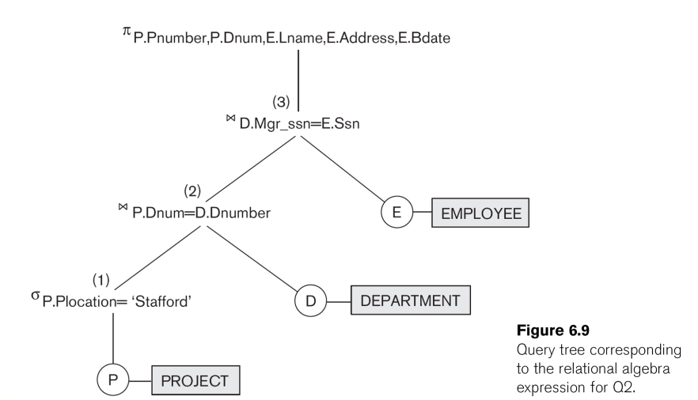

#### Core Operations

##### Selection

**Selection** selects the tuples of interest based on a condition.
* written as $\sigma_{(\text{selection condition})}(R)$
* where the condition is made up of comparisons and boolean operators.

**Algebraic properties**.
* *commutativity*: we can commute selection operations and get the same result.
* *sequencing*: sequencing selection operations is equivalent to AND'ing the conditions.

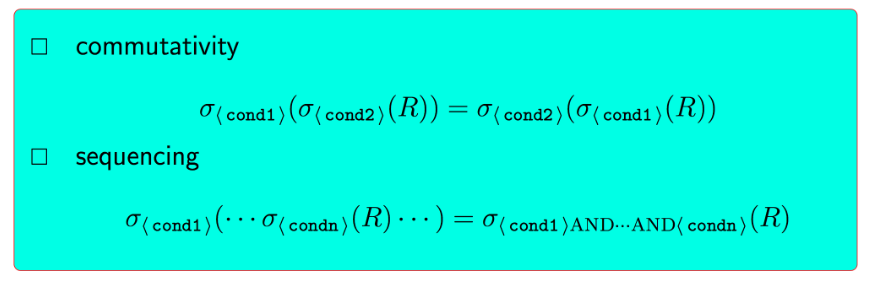

##### Projection

**Projection** selects the attributes of interest.
* $\pi_\text{attribute list}(R)$: selects $\text{attribute list}$ from table $R$.
* corresponds to `SELECT A` in SQL.

**Algebraic properties**.
* In RA, duplicates will be eliminated (unlike SQL)
* If `list1` is a proper superset of `list1`, then
    * $\pi_\text{list1}(\pi_\text{list2}(R))$ is illegal
* If `list2` is a superset of `list1`, then
    * $\pi_\text{list1}(\pi_\text{list2}(R)) = \pi_\text{list1}$

##### Renaming

**$\rho$ can rename attributes and the relation name**.
* $\rho_S(R)$ renames the relation from $R$ to $S$
* $\rho_{(B_1, \cdots, B_n)}(R)$ renames attributes where $B_i$ are new attribute names.
* $\rho_{S(B_1, \cdots, B_n)}$ renames both name and attributes

Related SQL construct is 
```
SELECT ..., T.Salary as FunnyName, ...
FROM Table T
```


##### Set Operations

Set operations require type compatibility.

**Def**. Two relations are *type-compatible* if they:
* have the same number of attributes
* and each attribute has the same domain

Operations:
* $R \cup S$: tuples that are in $R$ or $S$ (duplicates removed)
* $R \cap S$: tuples that are both in $R$ and $S$
* $R - S$: tuples from $R$ that are not in $S$

##### Cross Join

$\times$ is the cross join operator, which performs a **cartesian product**
* equivalent to `CROSS JOIN` in SQL.

The result of $R(A_1, \cdots, A_m) \times S(B_1, \cdots, B_n)$ is a relation
* $Q(A_1, \cdots, A_m, B_1, \cdots, B_m)$
* such that each tuple in $Q$ is an element of the cross product of tuples from $R$ and $S$.

##### Join

$\bowtie$ is the join operator, which effectively is a cross join followed by a selection.
* Written as $R \bowtie_{(\text{join condition})} S$

**Equijoins**. An **equijoin** is where the join condition consists of equality tests.

**Natural joins**. The default join mode in relational algebra, equivalent to `NATURAL JOIN` in SQL.

#### Other Operators

A complete set of operations for relational algebra is:
* $\{\sigma, \pi, \rho, \cup, -, \times\}$
* note that $\cap$ can be written using $\cup$ and $-$ using de morgan's law.
* join can be written using cross product and selection.

However, there are other operators that are useful.

##### Division

The **Division** operator is used for universal quantification, i.e. **for all** queries.

**Definition**.
* Let $R(XY), S(Y)$ be relations
* $R$ is the *fat* relation, $S$ is the *skinny* relation whose schema is a subset of $R$'s schema.
* $R(XY) \div S(Y)$ is a relation $T(X)$ where $X$-tuples are paired with every $Y$-tuple in $S$

Division is used for queries like "find students who are enrolled in **all** required modules"

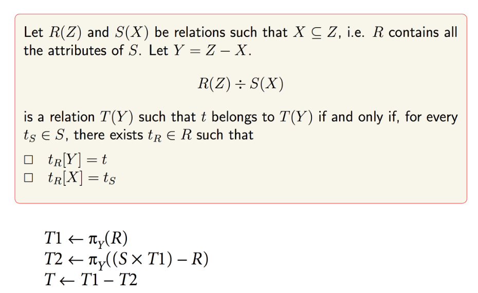

**Example**
* $T = R(A,B) \div S(A)$ is a relation that
* contains values from $R[B]$
* that are matched with every value in $S[A]$.

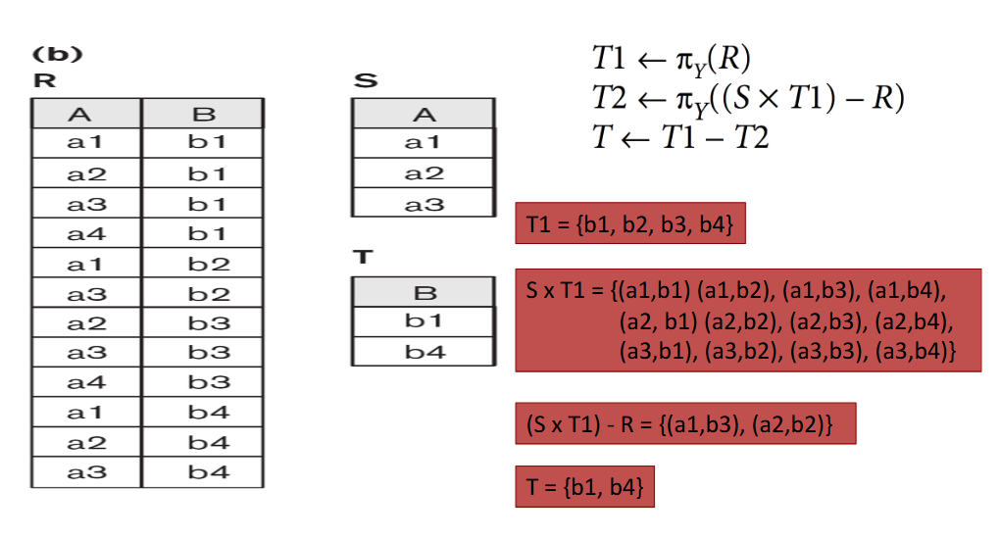

**Another example**.
* suppose $R(\text{project}, \text{employee id})$ stores projects employees work on and $S(\text{project})$ stores projects John Smith works on.
* $R \div S$ returns the employee ids that work on all the projects that John Smith works on.

##### Generalised Projection

**Generalised projection** allows use of functions/expressions in the attribute list, similar to SQL.

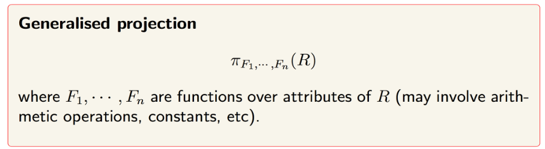

##### Aggregate Functions

Group tuples by values of attributes and apply functions separately to each group.

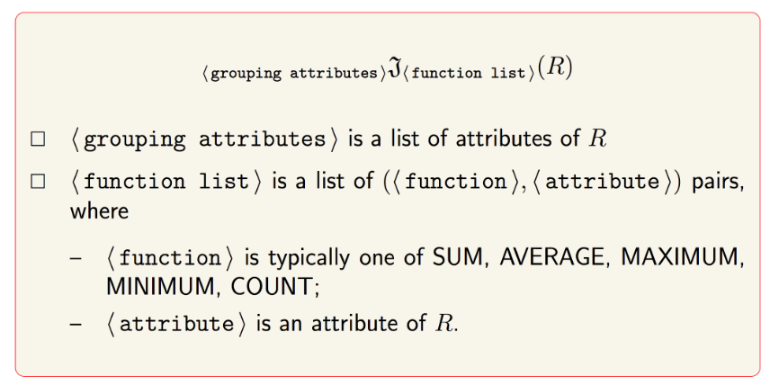

##### Outer Joins

Same as `LEFT OUTER JOIN`, `RIGHT OUTER JOIN` in SQL.
* NULL values are used to compensate for missing attribute values.


### 5.2. Relational Calculus

Relational calculus is **logic-based**: you specify a *condition* that output tuples must satisfy.
* defines *predicates* - a declarative truth value function
* specifies **what** to retrieve and **not how** to retrieve it.

This is used so end users can describe queries in formal or natural language.
* Language statements can be translated into predicates
* SQL is a declarative language, syntax based off relational calculus.

#### Predicates and Propositions 

**Def**. *Substitution* is assigning a value for a parameter.

**Def**. *Instantiation* is substituting all parameters in a predicate

**Def**. A *proposition* is an instantiated predicate.

**Def**. *Intension* of a predicate is the predicate's meaning.
* practically, think of it as a table definition in a relational DB.
* predicate symbol in RC $\leftrightarrow$ relation name
* intended meaning = intension

**Def**. *Extension* is the set of all *instantiations* for which the predicate holds true.
* so the state of a relation $\leftrightarrow$ the extension of the predicate.

**Fact**. Relational calculus is based off first-order logic, where there are:
* variables for objects: x, y, z
* constants for specific objects: a, b, 0, 1
* functions
* predicate symbols
* logical operators: $\neg, \land, \lor, \rightarrow$
* quantifiers: $\forall x$, $\exists x$

**Relational Model**.
* Predicate $\leftrightarrow$ schema
* Proposition $\leftrightarrow$ tuple
* Extension $\leftrightarrow$ relation state

#### Types of Relational Calculus

There are two common forms of relational calculus:
* **Tuple Relational Calculus**: uses notation like `t.attribute`
* **Domain Relational Calculus**: uses variables for attribute values

##### Tuple Relational Calculus

A tuple relational calculus query is a *restricted* first-order logic formula over tuples. Looks like:

$$\{t.A_1, t.A_2, \cdots, t_n.A_n \space | \space \text{COND}(t_1, \cdots, t_n)\}$$

* where $\text{COND}(t_1, \cdots, t_n)$ is a formula with $t_1, \cdots, t_n$ as free variables.


**Relation Membership**
* $R(t_i)$ = $t_i$ belongs to relation $R$.

**Free vs Bound variables**
* a variable is *free* if it is not bound by a quantifier ($\forall, \exists$)
    * these correspond to attributes in the result (what query actually returns)
* a variable is *bound* if it is quantified.
    * they are internal placeholders, they *do not appear* in the output.

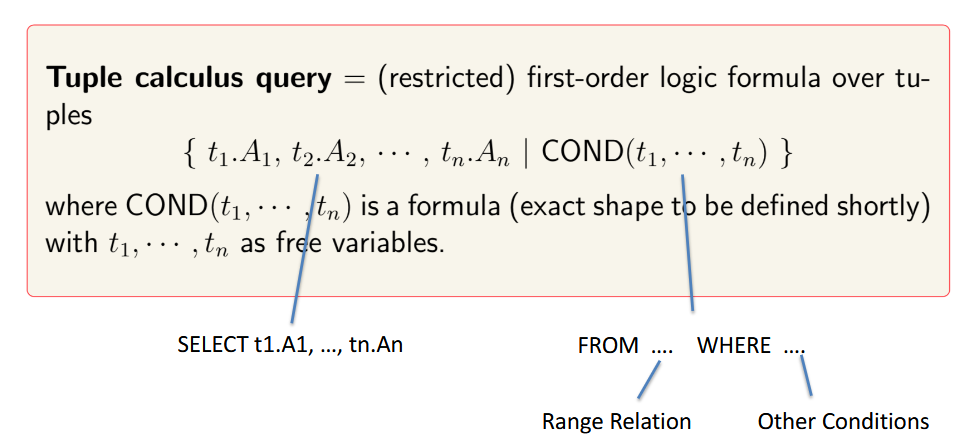

##### Domain Relational Calculus

A domain relational calculus query is where variables range over attribute domains instead, so we don't use *dot notation*.

**Membership of a relation**.
* $R(x_1, \cdots, x_k)$ = $x_1, \cdots, x_k$ are attributes belonging to the relation $R$.

Everything else is the same as tuple relational calculus.

#### Safety

**Safety**. A relational calculus expression is *safe* if it is guaranteed to return a finite number of tuples as a result.

It is possible to write relational calculus queries that describe **infinite results**
* e.g. $\{t | \neg Student(t)\}$ describes all tuples aren't in the Student relation, which could be infinite
* These queries are described as **unsafe**

It is important that RC queries are **safe** / **range-restricted**
* **fact**. safe expressions are equivalent to relational algebra.

#### Codd's Theorem

**Codd's Theorem**. Relational algebra and relational calculus are equivalent in their expressive power.

Languages that are equivalent in expressive power to relational algebra are known as *relationally complete*
* SQL
* relational calculus

## 6. Physical Storage and File Structures

### Disk/Page Model

Databases are too large to fit in main memory, so they are stored on disk.

Disk I/O is expensive, so DBs move data in **fixed-sized blocks** called pages, which are stored on disk as **disk-blocks**
* DB reads/writes whole pages, not individual rows
* a table is stored as a collection of disk blocks

Storing records on disk can be done in two ways:
* **Unspanned organisation** - records don't span across disk blocks
    * this can cause **internal fragmentation**
* **Spanned organisation** - records can cross boundaries
    * this requires pointers to link record fragments

**Def**. The **blocking factor** is the number of records stored in blocks

A **file block** is the filesystem-level chunk for files
*  The $i$th disk block refers to the block on disk allocated to contain the contents of the $i$th file block

The query cost is defined in terms of the number of **disk block** accesses needed

Thus there are two issues:
1. how to allocate file blocks to disk blocks.
2. how to arrange records within a file.

### Organising DB data on disk

Used for DB to keep track of which pages belong to the file/table

#### Contiguous Allocation

A file/table occupies a **contiguous run of blocks** on disk

**Advantages**:
* Very fast sequential scans

**Disadvantages**:
* Hard to grow: if you need more space, you may have to move the file
* Fragmentation issues in long-running systems

#### Linked Allocation

Each block contains a pointer to the next block (a linked list of blocks)

**Advantages**:
* Easy to grow
* No need for contiguous free space

**Disadvantages**:
* Sequential access
* Pointer overhead and poor locality

#### Indexed Allocation

Maintain an **index structure** that tells you where the blocks are
* Either a table with a header pointing to all its pages
* Or a multi-level index like B-trees
* This is the most common real-world implementation

**Advantages**:
* Good random access
* Still easy to grow

**Disadvantages**:
* Extra metadata to contain

### Structuring DB data on disk

About **file organisation** for a table: how records are placed into pages

#### Heap Files

Records are stored wherever there's space; no particular order

**Operations**:
* **Insert**: fast
    * retrieve the last disk block and put the new record at the end
* **Retrieval**: slow
    * linear search through all $b$ of the file's blocks
    * $b/2$ blocks accesses on average
* **Deleting**: slow
    * find and load the block storing the record - linear search
    * can use deletion markers instead (set a bit to 1)
    * periodically, the storage space for the file is reorganised, deleting marked records

#### Sequential (ordered) files

Records are **ordered by some search key**, then split into blocks.

**Operations**:
* **Retrieval**: fast
    * use binary search - $O(\log_2 b)$
* **Range queries**: fast
    * first record is retrieved using binary search
    * next blocks are fetched until range is exhausted
* **Insert**/**Delete**: slow
    * on average half the records have to be moved to make room for the new record

**NB**. Retrieving records where the search field is not the ordering field is very slow.

**Indexed sequential file**. (combining sequential and heap files)
* an ordered (master) file is kept, along with an overflow unordered file, used for new insertions.
* makes insertion **a lot faster** as we can add to the overflow file
* periodically the unordered overflow is sorted and merged with the ordered master file
* these are common when ordering field is:
    * a key
    * an index has been built on that key - primary index.

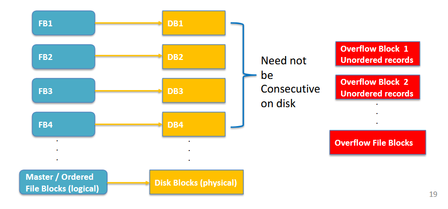

#### Hash Files

Use a hash function on a key to choose a bucket/page
* Records with the same bucket go in the same page chain/bucket structure

**Internal vs external hashing**
* internal hashing is searching within a program's space
* external hashing concerns records stored on disk.
    * records are "blocked" together and stored in disk blocks.
    * output of the hash function refers to a bucket number corresponding to a disk block.

**Collision handling**. Overflow buckets are maintained to store records into full buckets

**Operations**
* **Retrieval** - only fast if hash key is search key
    * fast for equality lookups on the hash key.
* **Deletions**
    * if in main bucket, is fast as we can find the bucket quickly
    * if in overflow, must follow link to overflow records
* **Updating**: not easy
    * not simple as we have to locate record in main or overflow bucket.
* **Range queries**: not efficient.

## 7. Database Security 

### Introduction

Databases hold critical and often sensitive data. The goals of security are the CIA triad:
* **Confidentiality** - prevent unauthorised disclosure
* **Integrity** - prevent improper modification of data
* **Availability** - ensure authorised access when needed

The main control measures are:
1. *Access control*
    * who can access which data and in what mode
2. *Inference control*
    * prevent inferring sensitive facts from aggregate answers
3. *Flow control*
    * prevent information from flowing from secure to less secure objects
4. *Data encryption*
    * protect data in transit or at rest using cryptography

The **database administrator** (DBA) is a central authority for database security. They hold a powerful superuser account. Typical DBA security tasks involve:
* creating/removing less powerful user accounts
* grant and revoke privileges
* assign security levels / roles
* define and enforce security policies

**Data can be sensitive for several reasons**:
* *inherently sensitive* e.g. salary, health status, sexual oreitnation.
* sensitive *source*
* explicitly declared sensitive attributes or records
* sensitive only in combination with other data

**Security vs Precision**. Goal is high security with as high precision as possible.
* *precision*: reveal as much nonsensitive data as possible.

**Security vs Privacy**. Security is necessary but not sufficient for privacy.
* privacy: appropriate use of personal information
* security: protect systems and data from unauthorised access
* e.g. company's secure system may collect and use personal data without user agreeing.

### Access Control

**Access control** (authorisation) is ensuring only authorised users can read/write specific data

#### Discretionary Access Control (DAC)

Privileges are granted to users at the DBA's discretion.
* users with proper privileges then can pass on privileges to other users.

Two levels of privileges:
* account-level (`CREATE TABLE`, `CREATE VIEW`)
* relation-level (`SELECT`, `INSERT`, `UPDATE`, `DELETE`, `REFERENCES`)

##### Types of Prvileges

**Account-Level Privileges**.
* apply to account independently of specific tables
* typical privileges include:
    * `CREATE SCHEMA` / `CREATE TABLE`
    * `CREATE VIEW`
    * `ALTER` and `DROP`
    * `MODIFY` (or explicit insert/delete/update tuples)
    * `SELECT` (run queries)

**Object-Level Privileges**.
* These are defined per table or view.
* By default, applies to a whole table or view. But some privileges can user finer granularity:
    * **column-level**: `SELECT`, `INSERT`, `UPDATE`, `REFERENCES` can name columns, e.g.
        ```sql
        GRANT SELECT (name, dept) ON employee TO analyst;
        ```
    * **row-level**: achieved only via views.

##### Grant, Revoke

**Owning and granting privileges**
* Creator of relation becomes its owner, which has privileges on the relation.
* Owner can `GRANT` and `REVOKE` to other accounts.

**Using views for authorisation**
* `GRANT`/`REVOKE` can be used on views as well.
* Used so users can modify only certain rows/columns via the view, without giving them direct access to the base table.

**Grant Privileges**.
* `WITH GRANT OPTION` is used to allow users to grant privileges to other users. For example,
    ```sql
    GRANT SELECT ON empl TO u1 WITH GRANT OPTION;
    ```

**Limiting Privilege Propagation**. Limits how many times the privilege can be passed on. Two types:
* **horizontal** - define who or how many other users can be granted a privilege
* **depth** - define how long the chain of passing privileges can be.

##### Limitations of DAC

**Limitations of DAC**.
* flexible but can be vulnerable to misuse
    * for example, a program that discloses secret data by inserting into a publicly accessible table.
* DAC does not control how information is propagated after access.


#### Mandatory Access Control (MAC)


**MAC** is a system-wide policy based on **labels/clearances**
* Data and users have labels
* access is decided by comparing labels (not the object owner)
* often combined with DAC for comprehensive protection

Typical levels include, from most secret to least secret:
1. Top Secret (TS)
2. Secret (S)
3. Confidential (C)
4. Unclassified (U)

##### Bell-LaPadula Model

The most common model of MAC is the **Bell-LaPadula** Model.
* each subject $S$ and $O$ have a classification.

**No read up** policy:
* Subject $S$ may read object $O$ if $\text{class}(S) \ge \text{class}(O)$.
* low subjects can't learn from higher objects.

**No write down** policy:
* $S$ may write to $O$ only if $\text{class}(S) \le \text{class}(O)$.
* high-level subject cannot write secret information to a low object which can be read by lower-level subjects.

This is used to prevent information flow from high to low classifications.

##### Multilevel Relational Model

Extends the relational model with:
* a tuple classification attribute $\text{TC}$
* each attribute with a classification attribute $C_i$
* $\text{TC}$ is the highest classification among all attributes in the tuple.

**Filtering and Views by Clearance**. If a user doesn't have the required classification to view a tuple, what should happen? Two options.
1. The user does not see the tuple at all
2. The user sees parts of the tuple, but higher-classified values are replaced with `NULL.`

With the second option, "no data" vs "data exists but is hidden" is indistinguishable.

**Polyinstantiation**.
* multiple tuples can share the same *apparent key*
* however each tuple has different classifications
* the actual key is now defined as a pair `(key, classification)`

##### Advantages and Disadvantages

**DAC**.
* *advantage*: flexible and easier to manage for many applications
* *disadvantage*: weaker against malicious software and information leakage

**MAC**.
* *advantage*: very strong protection, prevents illegal information flows
* *disadvantage*: rigid, requires strict classification and labeling.

In practice, many systems rely mainly on DAC.

#### Role-Based Access Control (RBAC)

In RBAC, privileges are associated with **roles**, *not individual users*.
* Users are assigned to roles
* Users activate a subset of their roles in a session.
* Supported by many DBMSs via `CREATE ROLE`, `GRANT`, `REVOKE`

**Example**:
```sql
CREATE ROLE empl;
GRANT SELECT, INSERT ON T1 TO empl;
```

**Role Hierarchies**.
* organise roles in a hierarchy reflecting authority
* hierarchy is a partial order


#### Row-Level and Label-Based Security

**Row-level access control**:
* for each row in a table, decide whether the current user is allowed to see or modify that row.
* implemented using predicates/filters on rows.

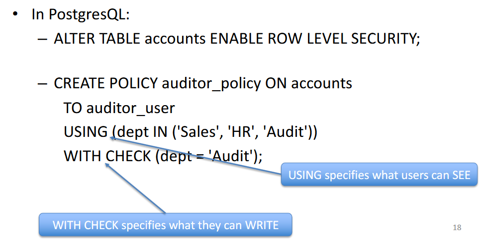

**Label level security**.
* users have clearance levels
* each row has a security level
* access is allowed only if the user's clearance dominates the row's label
* **label security is just a special form of RLS**

### SQL Injection

**SQL Injection**. Attacker injects "crafted input" to change intended SQL statement. 
* this can bypass authentication
* read/modify sensitive data
* or execute system-level commands.

**Code injection**.
* insert additional SQL statements into input
* for example `... OR 1=1 -- ` or `OR 'x' = 'x' ...`

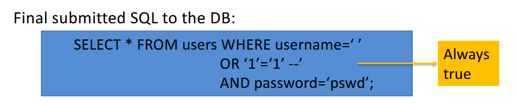

**Function call injection**
* abuse database or OS functions inside SQL
* e.g. time-based probing / DoS using `pg_sleep` / `SLEEP()`

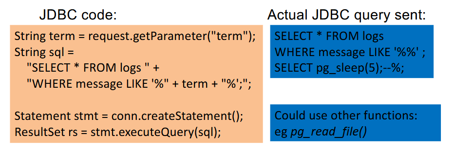

**Defense**: Bind variables and Prepared Statements
* prepared statements use *bind variables* (question marks) to input parameters.
* database first parses the SQL as a fixed template
* then when user input arrives, it is treated **only as data**, not as SQL code.
* e.g. `SELECT * FROM EMPLOYEE WHERE EMPLOYEE_ID = ? AND PASSWORD = ?`

**Defense**: Input validation and function security
* filter and validate all user input
* reject unexpected characters and patterns
    * e.g. reject inputs containing `;`, or `--`, or `DROP TABLE`
* escape dangerous characters where appropriate
* restrict powerful database functions

### Inference Control

**Statistical Databases** are databases that aggregate statistics about populations.
* hide individual-level confidential data.

**Inference problem**. Attackers can infer individual values from aggregates
* e.g. queries on very small populations (size 1 or 2)
* combine `COUNT`,`AVG`, `MIN`/`MAX` to deduce a salary.

**Defenses**
* disallow queries on populations below a size threshold
* detect and block repeated queries on same population
* add controlled noise to aggregate results
* partition data into groups and allow queries only at group level

**Noise Defence**. Add noise to ensure plausible deniability.
* e.g. flip a coin before recording a boolean value
* if HEADS, record the truth (Y or N)
* if TAILS, record Y

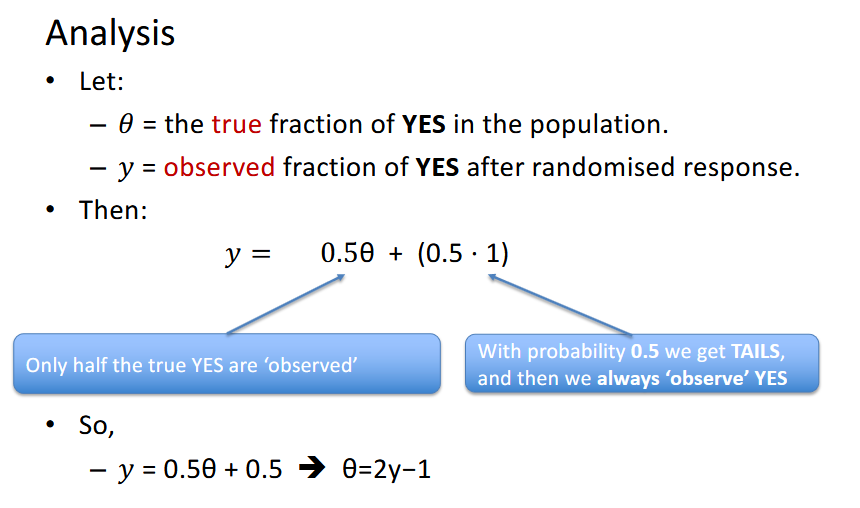

### Flow Control

**Flow control** is about preventing information from a high-sensitivity source from leaking to a low-sensitivity sink

**Explicit flow**. when output is a function of sensitive data
* e.g. `avg_salary :=  AVG(secret_salaries)`

**Implicit flow**
* control structures leak information
* e.g. `if (select_balance > ) then public_flag := 1 else public_flag := 0`
* no secret value is *assigned* to `public_flag
* but flag tells attacker information

Flow control mechanisms must handle both types.

**Covert Channels**. Unauthorised information flow that bypasses security policy
* *storage channels* use shared storage to signal data, e.g.
    * toggling a lock on a shared file
* *timing channels* encode data in timing of operations
    * e.g. run a query that is either fast or deliberately slow
    * to transmit a secret bit

### Summary

**How security controls work together in practice**

* Web frontend
    * prepared statements to avoid SQL injection.
* Application account
    * granted minimum necessary privileges via DAC.
* Database
    * RLS / label-based policies.
* Encryption
    * protects highly sensitive columns and backups at rest.
* Auditing
    * tracks who accessed which sensitive records and when.

