# CS260 Revision Notes

## 1. Analysis of Algorithms

> [KT] Chapter 2 - Basics of Algorithm Analysis

#### Measuring Efficiency

**Asymptotic analysis** is the analysis of how the time/space of an algorithm grows with respect to the *size of the input*. This can be done in two ways:
* **Worst case** - generally captures efficiency in practice
* **Average case** - difficult to specify *what* is random input and model real data

**Def**. An algorithm is **efficient** if its running time is polynomial
* running time is bounded by $cn^d$ steps, for constants $c, d > 0$.
* works mostly for real-world problems

#### $O$, $\Omega$, and $\Theta$ notation

**Big $O$ Notation** (upper bound):
* $f(n)$ is $O(g(n))$ if $g(n)$ is an upper bound for $f(n)$.

**Big $\Omega$ Notation** (lower bound):
* $f(n)$ is $\Omega(g(n))$ if $g(n)$ is a lower bound for $f(n)$.

**Big $\Theta$ Notation** (exact bound):
* $f(n)$ is $\Theta(g(n))$ if $f(n)$ is both $O(g(n))$ and $\Omega(g(n))$
* i.e. they grow just as fast, differing by only a constant factor

#### Common time complexities

**Linear time** $O(n)$ 
* two pointers
* merging two sorted lists
* computing the maximum of a sequence of numbers

**Linearithmetic time** $O(n\log n)$
* fastest possible comparison-based sort
* **largest empty interval** - given timestamps $x_1, \cdots, x_n$, find the largest interval between timestamps
* many divide and conquer problems

**Quadratic time** $O(n^2)$
* enumerate all pairs of elements
* *naive* algorithm to closest pair of points

**Cubic time** $O(n^3)$
* **set disjointness** - given $n$ sets $S_1, \cdots, S_n$, each of which is a subset of $\{1, 2, \cdots, n\}$, is there a pair which are disjoint?

**Polynomial time** $O(n^k)$
* independent set of size $k$ where $k$ is a constant
    * enumerate all subsets of $k$ nodes.
    * $\begin{pmatrix}n \\ k\end{pmatrix} = \frac{n(n-1)\cdots(n-k+1)}{k!} = O(n^k)$
    * checking if a subset of nodes *is* an independent set is $O(k^2)$ (requires checking all possible edges)
    * hence time complexity is $O(n^k k^2) = O(n^k)$

**Exponential time** $O(2^{f(n)})$ where $f(n)$ is polynomial
* **maximum independent set**
    * we can check all subsets, which there are $2^n$ of them 
    * checking takes $O(n^2)$ time
    * so a *naive* algorithm can run in $O(n^2 2^n)$ time

## 2. Stable Matching

> [KT] Chapter 1 - Introduction: Some Representative Problems

**Problem**. Given $n$ medics and $n$ hospitals, where each doctor lists hospitals in order from *best to worst*, and vice versa, find a **perfect matching** if one exists where there are no *unstable pairs*.

- **Def**. A **perfect matching** is a matching between two sets of $n$ objects each, e.g. doctors and hospitals, where each object from each set is matched **bijectively**.
    * For example, each doctor is assigned to *one* hospital, and vice versa.
- **Def**. An *unstable* pair $d-h$ is where $d$ prefers $h$ to their assigned hospital $h'$, and $h$ prefers $d$ to its matched doctor $d'$.
    * so $d$ and $h$ can defect as they prefer each other more.

#### Gale-Shapley Deferred Acceptance Algorithm

An algorithm that **guarantees** to find a stable matching.

```
Initialize each doctor d and hospital h to be free.
while (some doctor is free and hasn't applied to every hospital) {

    let d = such a doctor
    let h = most preferred hospital on d's list to which d has not yet applied

    if (h is free)
        match d and h
    else if (h prefers d to current match d')
        match d and h, and free d'
    else
        h rejects d
}
```

**Intuitively**, we can observe:
1. Doctors apply to hospitals in *descending order* of preference.
    * Doctors move on when they are rejected.
2. Hospitals only *improve* their match. 
    * Once a hospital is matched, they never become unmatched.
3. Algorithm ends when all doctors are matched.

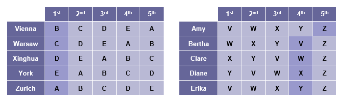


#### Proof of Correctness

**Termination**. Each time through the while loop, a doctor applies to a new hospital. From the grid, we can see there are only $n^2$ possible pairings, so the algorithm **must** terminate in $O(n^2)$ steps.

**Claim**. All doctors and hospitals get matched

**Proof**:
* Assume for a contradiction, that doctor $d$ is not matched when the algorithm terminates.
* Then, there must be a hospital $h$ that isn't matched.
* By **observation 2**, no doctor ever applied to $h$
* Doctor $d$ must have applied everywhere to be unmatched, as once they are matched they stop applying.
* This is a contradiction!

**Claim**: The output is a *stable matching*

**Proof**:
* Assume for a contradiction, that matching $S^*$ is unstable.
* There must be an unstable pair $A-Z$
* Consider whether $A$ applied to $Z$
* Case 1: $A$ never applied to $Z$:
    * $A$ must have found someone better than $Z$
    * So $A-Z$ is stable
* Case 2: $A$ applied to $Z$:
    * $Z$ must have rejected $A$ as otherwise $A-Z$ would be a pair
    * Hence $Z$ prefers their current partner to $A$
    * So $A-Z$ is stable
* This is a contradiction!


#### Efficient Implementation

Can be implemented efficiently by:
- using two arrays `doctor_at[h]` and `hospital_of[d]`.
- an array `count[d]` to count applications made by `d`
- creating the *inverse* of preference list of doctors, so we can check whether hospital `h` prefers doctor `d` to doctor `d'`

#### Doctor Optimality (tricky)

**Doctor Optimality**. Gale-Shapley produces a *doctor-optimal* assignment. This means that each doctor gets the **best** possible *valid* option. Consequently, each hospital receives the **worst** possible *valid* option.

- **Def**. $d$ is a *valid* partner of $h$ if there is a stable matching where $d-h$ is a pair.

**Claim**: GS matching $S^*$ is doctor-optimal

**Proof**:
* Suppose for a contradiction that $S^*$ is not doctor-optimal.
* Hence a doctor is rejected by a valid partner hospital and has to settle for a worse hospital.
* Let $A$ be the first doctor rejected by a valid partner hospital $Y$
* Let $S$ be a stable matching where $A-Y$ is a match.
* When $A$ is rejected in $S^*$, it occurs when $Y$ finds or has a better doctor $B$ that it prefers to $A$.
* Let $Z$ be $B$'s partner in $S$.
* Since $A$ getting rejected is the **first rejection by a valid partner**, $B$ **has not** been rejected at all. At this moment in time, $B$ is paired up with $Y$, so $B$ must have applied to $Y$ before $Z$. Therefore, $B$ prefers $Y$ to $Z$.
* But we know that $Y$ prefers $B$ to $A$! Hence, $B-Y$ is unstable in $S$.
* This is a contradiction!

**Claim**: GS matching $S^*$ is hospital-pessimal

**Proof**:
* Suppose for a contradiction that $S^*$ is not hospital-pessimal.
* Hence $A-Z$ is match in $S^*$ where $A$ is not the worst valid option for $Z$.
* Hence there is a stable matching $S$ where $Z-B$ is a pair, and $Z$ likes $B$ less. That is, $Z$ prefers $A$ to $B$.
* Let $Y$ be $A$'s partner in $S$.
* Since $S^*$ is **doctor optimal**, $A$ must prefer $Z$ to $Y$.
* Hence, $A-Z$ is an unstable pair in $S$. This is a contradiction!

#### Generalised Stable Matching

The Gale-Shapley algorithm can be generalised to solve **generalised stable matching** where there could be:
* unequal number of doctors vs hospitals
* multiple matches
* some pairs are deemed **unacceptable**

## 3. Greedy Algorithms

> [KT] Chapter 3 - Greedy Algorithms

### 3.1 Interval Scheduling

> [LeetCode 435. Non-overlapping Intervals](https://leetcode.com/problems/non-overlapping-intervals/description/)

**Problem**. Given a **set of jobs** that each occupy an interval $[s_j, f_j]$, find the **maximum subset** of mutually compatible jobs.
* ***def***. two jobs are *compatible* if they don't overlap.

**Key Idea**: sort the jobs by the *earliest finish time*, and take as many jobs as you can.

```
Sort jobs by finish time so that f1 <= f2 <= ... <= fn

A = set()
for j = 1 to n {
    if (job j compatible with A)
        add job j to set A
}

return A
```

**Time complexity**: $O(n\log n)$.
* keep track of last job $j^*$ added to $A$
* jobs $j^*$ and $j$ are compatible if $s_j \ge f_{j^*}$ since the jobs are sorted by finish time.

#### Proof of Correctness

**Theorem**. Earliest-finish-first greedy algorithm is optimal.

**Proof**
* Assume for a contradiction, that greedy is **not optimal**.
* Let $i_1, i_2, \cdots, i_k$ be jobs selected by greedy
* Let  $j_1, j_2, \cdots, j_m$ be  jobs selected by the optimal solution, where the first $r$ jobs are identical for the largest possible value of $r$
* The first difference occurs between $i_{r+1}$ and $j_{r+1}$.
* Since job $i_{r+1}$ finishes before $j_{r+1}$, we can replace job $j_{r+1}$ by $i_{r+1}$ and the modified optimal solution is *still* feasible and optimal.
* But, this contradicts that $r$ is maximal.

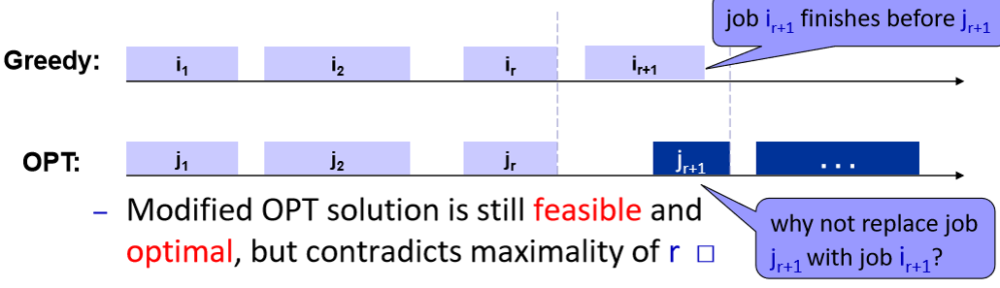

### 3.2 Interval Partitioning

> [LeetCode 2406. Divide Intervals Into Minimum Number of Groups](https://leetcode.com/problems/divide-intervals-into-minimum-number-of-groups/description/)

**Problem**. Given a set of lectures and classrooms, find the **least number of classrooms** to schedule all lectures so that no two occur at the same time in the same room.

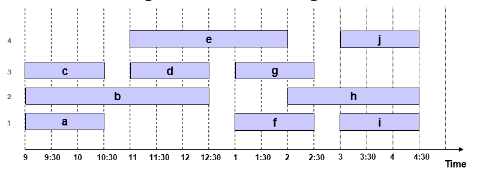


**Key Idea**: number of classrooms needed $\ge$ depth. The *optimal schedule* has the number of classrooms **equal** to the depth of the set of intervals. 
* **Def**. The *depth* of a set of open intervals is the **maximum number** that contain any given moment in time
* **Greedy Idea**: sort by the *start time*, and allocate new lectures when we absolutely need to

```
Sort intervals by starting time so that s1 <= s2 <= ... <= sn
d = 0

for j = 1 to n {
    if (lecture j is compatible with some classroom k)
        schedule lecture j in first free classroom k
    else
        allocate a new classroom d + 1
        schedule lecture j in clasroom d + 1
        d = d + 1
}
```

**Time complexity**: $O(n \log n)$ due to sorting
* to find the first free classroom, we store the finish time of the last job added for each classroom $k$ in a priority queue
* assuming a *binary heap implementation*, each operation is $O(\log n)$.
* for loop performs one deletion and insertion per iteration so time is still $O(n \log n)$.

#### Proof of Correctness

**Observation**: greedy algorithm never schedules two incompatible lectures in the same classroom.

**Theorem**: greedy algorithm is optimal.

**Proof**:
* Let $d$ = number of classrooms the greedy algorithm allocates
* classroom $d$ is opened because a job $i$ is incompatible with all $d-1$ other classrooms
* these $d$ jobs each end after $s_j$, otherwise we could have used a classroom.
* since we sorted by start time, all incompatibilities are caused by lectures that start no later than  $s_j$
* hence, we have $d$ lectures overlapping at time just after $s_j$
* therefore, all correct schedules must use $\ge d$ classrooms.

### 3.3 Minimising Lateness

Given a set of jobs with $t_j$ units of processing time and deadline $d_j$, schedule all jobs to minimise the **maximum lateness**, $\max L_j$.
- **Def**. The *lateness* of job $j$ is $L_j = \max(0, f_j - d_j)$.

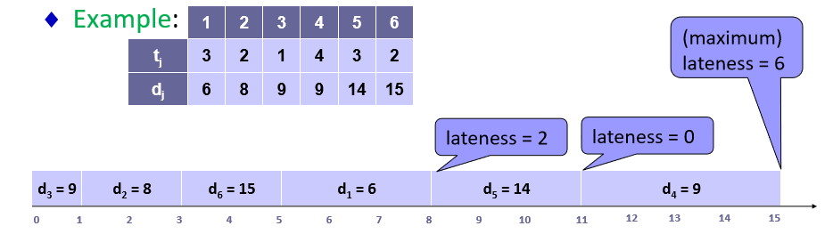

**Key Idea**: sort the jobs by the *earliest deadline*, and do jobs in that order without taking breaks.

```
Sort n jobs by deadline so that d1 <= d2 <= ... <= dn

t = 0
for j = 1 to n {
    Assign job j to interval [t, t + tj]
    sj = t, fj = t + tj
    t = t + tj
}
output intervals [sj, fj]
```

#### No Idle Time

**Observation 1**: there exists an optimal schedule with no idle time
* we can compact all the jobs together

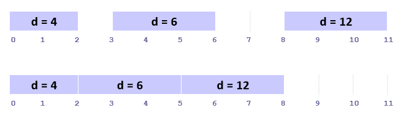

**Observation 2**: the earliest-deadline first greedy schedule as *no idle time*.

#### Inversions

**Def**. Given a schedule $S$, an **inversion** is a pair of jobs $(i, j)$ such that $i < j$ but $j$ is scheduled before $i$.

**Fact**. Swapping jobs removes an inversion *whilst leaving everything else intact*, given that the schedule is **idle-free**

**Observation 3**: The earliest deadline first schedule is **the only schedule** with no idle time that has no inversions, *because* jobs are in sorted order.
* because for any job pair $(i, j)$, if $i < j$ then $i$ is scheduled before $j$ (definition of sorting)

**Observation 4**: If an *idle-free* schedule has an inversion, it must have an *adjacent inversion*

**Proof**:
* Let $(i, j)$ be the closest non-adjacent inversion.
* Let $k$ be the job immediately *after* $j$ in the schedule.
* If $j > k$, then $(j, k)$ is an adjacent inversion
* Or $j < k$, then $(i, k)$ is a closer inversion since $i < j < k$
* So either way we find an adjacent inversion, or $(i, j)$ was not the closest.

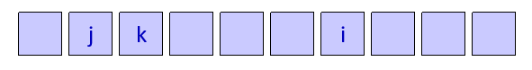

**Theorem**. swapping two adjacent, inverted jobs reduces the number of inversions by $1$ and **does not increase** the maximum lateness.

**Proof**:
* Let $L$ be the lateness before the swap, and $L'$ be the lateness after.
* $L'_k = L_k$ for all $k \ne i, j$, as swapping **does not affect** other jobs
* $L_i' \le L_i$, because moving $i$ earlier can't make it later.
* If job $j$ is late, then $L_j' = f_j' - d_j$ by definition
    * $= f_i - d_j$ as $j$ now finishes at $f_i$
    * $\le f_i - d_i$ since $i < j$, so $d_i \le d_j$
    * $=L_i$ by definition.
* Hence, $L_j' \le L_i$, so the maximum lateness cannot increase

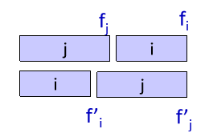

#### Proof of Correctness (Exchange Argument)

**Theorem**: greedy schedule $S$ is optimal.

**Proof**
* define $S^*$ to be an optimal schedule with the fewest number of inversions.
* By **observation 1**, we can assume $S^*$ has no idle time.
* If $S^*$ has no inversions, then $S$ (greedy) is optimal.
* If $S^*$ has an inversion, then we can always find an adjacent one, $(i, j)$, by **observation 4**.
    * swapping $(i, j)$ doesn't increase the maximum lateness and decreases the number of inversions by $1$.
    * this contradicts that $S^*$ had minimal inversions
* Hence, greedy must be optimal.

### 3.4 Coin Changing

**Problem**. Given currency denominations $1, 5, 10, 25, 100$, find the *minimum number* of coins to create any given value $x$.

**Key Idea**: take the largest valued coin that doesn't take us past the amount to be paid.

```
Sort coin denominations by value: c1 < c2 < ... < cn

S = set()
while (x > 0) {
    let k be the largest integer such that ck < x

    if (k = 0)
        exit with no solution found
    x = x - ck
    add k to S
}
return S
```

#### Proof of Correctness

**Claim**. For U.S. coinage $1, 5, 10, 25, 100$, the greedy algorithm is optimal. 

**Proof (by induction on $x$)**:
* Notice that there can be at most $4$ 1c coins in any solution, as otherwise we can use less coins.
* Similarly, there can be at most one 5c, two 5c or 10c, and three 25c
* Consider the largest coin greedy can take, $c_k$.
* Any optimal solution must also take coin $k$.
    * If not, it needs enough smaller coins to add up to $x$
    * By our observations, this is not possible for each $c_k$ value.
    * $c_k = 10$: we can only reach $9$c using $4 \times$ 1c and $1 \times$ 5c
    * $c_k = 25$: we can only reach $24$c using $4 \times$ 1c and $2 \times$ 10c
* Hence, we must take coin $k$, and we reduce the problem to coin-changing $x - c_k$  cents, and by induction, the greedy algorithm is optimal.

**Observation**. For other coinages, for example $1, 4, 5$, the greedy algorithm is *sub-optimal*.
* E.g. $x = 8$: greedy finds $\{5, 1, 1, 1\}$ when the optimal solution is $\{4, 4\}$.
* A general solution requires **dynamic programming**

### 3.5 Optimal Offline Caching

**Problem**. **Offline caching** is where we have a *known* sequence of requests $d_1, d_2, \cdots, d_m$ and a fixed size cache of size $k$. Goal is to find an eviction schedule that minimises the number of cache misses.
* **Def**. A **cache hit** is when the item requested is in the cache already.
* **Def**. A **cache miss** is when the item requested isn't in the cache, so we must fetch the requested item and evict some existing item if it is full.

- The optimal strategy is **furthest-in-the-future**: when an item needs to be brought into the cache, evict the item in the cache that is requested furthest in the future.


#### Proof of Correctness (Exchange Argument)

**Def**. A **reduced schedule** is a schedule that only inserts an item into the cache in a step in which the item is requested

**Key Idea**. we can transform an *unreduced schedule* into a *reduced schedule* by removing unnecessary cache evictions.
* Suppose $d$ is brought in at time $t$ **WITHOUT A REQUEST**
* Let $c$ be the item evicted
* If $d$ is evicted later at time $t'$, before the next request for $d$, we can **SKIP** bringing $d$ in to the cache.
* If $d$ is requested at time $t'$ before $d$ is evicted, we can **DELAY** bringing $d$ into the cache.
* This way, we **ONLY BRING ITEMS IN WHEN NEEDED**

The proof is *off the scope* of the test, but the main idea is that:
* suppose there is some optimal schedule $S$
* we transform $S$ into $S_{FF}$ step by step
* hence we show that $S_{FF}$ is optimal: we never increase the number of cache misses
* this is done by induction and some tricky case handling

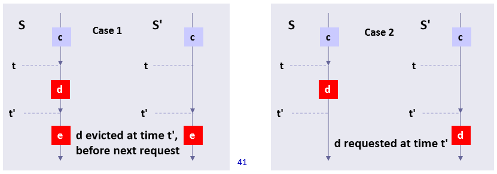

#### Related Problems

**Offline caching** is where the full sequence of requests is known as a priori

**Online caching** is where we don't know requests in advance (this is more realistic)

For online caching, we have many different strategies:
* Last in, first out: evict page brought in most recently
* Least recently used (LRU) - evict page whose most recent access was earliest
    * FF with direction of time reversed

**Fact**. **FF is the optimal offline eviction algorithm**
* so LRU is typically very good for online caching.
* LIFO can be arbitrarily bad

### 3.6 Selecting Breakpoints

**Problem**. Given a set of **recharging stations** at certain points along the way, and a charge capacity $C$, make it from the start to the destination with **as few refueling stops as possible**

**Greedy Idea**: go as far as you can before recharging

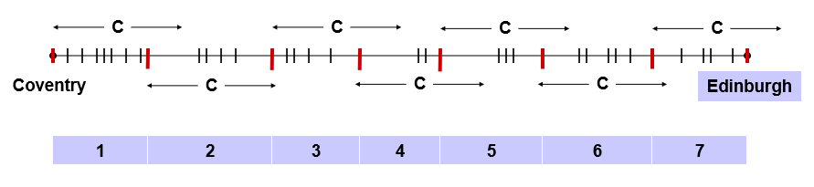

```
Sort breakpoints so that: 0 = b0 < b1 < b2 < ... < bn = L

S = {0}
x = 0

while (x != bn) {
    let p be largest integer such that bp <= x + C
    if (bp == x)
        return "no solution"    
    x = bp
    S.add(p)
}
return S
```

#### Proof of Correctness

**Theorem**: greedy algorithm is optimal

**Proof**: (similar to interval scheduling proof)
* assume for a contradiction that greedy is not optimal
* let $0 = g_0 < g_1 < \cdots < g_p = L$ be the breakpoints chosen by greedy
* let $0 = f_0 < f_1 < \cdots < f_q = L$ be the breakpoints in an optimal solution where the first $r$ agree for the largest possible value of $r$
* By greedy choice of algorithm, $g_{r+1} > f_{r+1}$, as we go as far as we can
* Hence, we can **improve** the solution by driving further, swapping out $f_{r+1}$ for $g_{r+1}$.
* The modified optimal solution is still valid, which contradicts the maximality of $r$

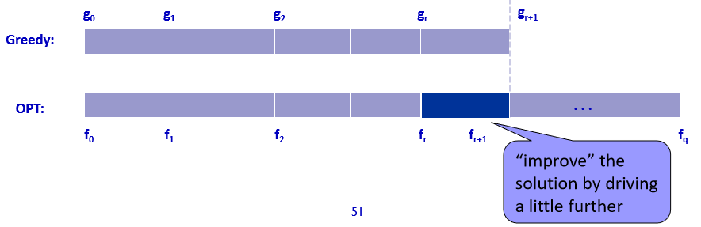

## 4. Graph Algorithms

> [KT] Chapter 3: Graphs

### 4.1 Definitions

**Def**. A undirected graph, $G = (V,E)$ is a pair of a set of $n$ vertices $V$ and set of $m$ unordered pairs of vertices $E$.

A graph can be represented in different ways:
* **Adjacency Matrix** - $\Theta(1)$ edge check, but enumerating all edges is $\Theta(n^2)$
* **Adjacency List** - $O(\deg(u)$ edge check, but enumerating all edges is $\Theta(m + n)$

**Def**. a **path** is a sequence of nodes $v_1, v_2, \cdots, v_k$ where $v_i, v_{i+1}$ is an edge in $E$
* A path is **simple** if all nodes are distinct

**Def**. An undirected graph is **connected** if there is a path from $u$ to $v$ for all $u, v \in V$

**Def**. A **cycle** is a path $v_1, v_2, \cdots, v_k$ where $v_1 = v_k$, $k > 2$, and the first $k-1$ nodes are distinct
* A cycle is **not a simple path** as the start and end are the same

**Def**. A **tree** is an undirected, acyclic graph
* If we choose a root node $r$, it becomes a **rooted tree**

### 4.2 Graph Traversal

**Depth first search** traverses nodes in a depth-first manner, traversing neighbours until all neighbours are visited, then backtracking.
* **Time Complexity**: $O(m+n)$

**Breadth first search** is where you explore outward from start node $s$ in all directions, adding nodes one layer at a time
* all nodes in each *layer* of BFS have the same distance from the start node $s$
* we know this as if $(x,Y)$ is an edge in the BFS tree of $G = (V,E)$, then the layers of $x$ and $y$ differ by at most 1
* **Time complexity**: $O(m+n)$, as for every node $u$, there are $\deg(u)$ incident edges, and total time processing edges is $\sum_{u \in V} \deg(u) = 2m$ which is $O(m)$.
* **Def**. A **cross edge** is an edge joining two nodes in the *same BFS layer*

**Finding connected component containing $s$**:
* Any exhaustive search of graph $G$ will find the connected component
* e.g. run BFS or DFS starting from $s$

### 4.3 Testing Bipartiteness via BFS

**Def**. An undirected graph is **bipartite** if the nodes can be colored **red** or **blue** such that every edge has one red and one blue end.
* i.e. separate into two groups that only have edges between the two groups, not within a group

**Lemma**: If a graph $G$ is bipartite, it **cannot contain an odd length cycle**. 
* In fact, absence of odd cycles characterizes bipartiteness

**Lemma**: Let $G$ be a connected graph, and let $L_0, \cdots, L_k$ be the layers produced by BFS starting at any node $s$. Exactly one of the two cases holds:
1. No cross edges and BFS is bipartite
2. There is some cross edge, $G$ contains an odd length cycle, and hence is not bipartite

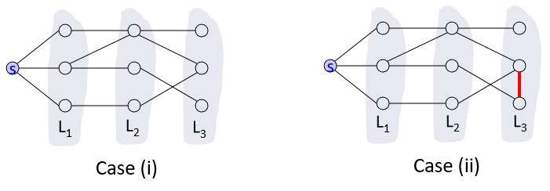

**Proof** (case 1)
* By BFS property, we can colour nodes on even layers **red**, and nodes on odd layers **blue**
* Hence $G$ is bipartite.

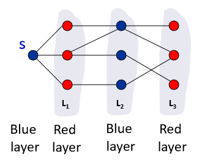

**Proof** (case 2)
* Suppose $(x, y)$ is a cross edge in same level $L_j$
* Let $z = $ lowest common ancestor of $x, y$
* Let $L_i$ be the layer containing z
* Consider the cycle $x \to y$, $y \to z$, and $z \to x$.
* Its length is $1$ + $(j-i)$ + $(j-i)$, which is odd.

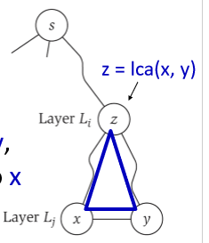

**Corollary**: A graph $G$ is bipartite $\text{iff}$ it contains no odd length cycle

**Algorithm**. **Run BFS and check for cross edges**. If $G$ has an odd length cycle, there will be a cross edge in *any* BFS.
* Perform a BFS with alternating colours
* Check for edges between nodes of the same colour.
* This takes $O(n+m$) for adjacency list representation.
    
### 4.4 Strong Connectivity

**Def.** A **directed graph** is where edges are ordered pairs: edge $(u,v)$ goes from node $u$ to node $v$

**Def.** Nodes $u$ and $v$ are **mutually reachable** if there is a path from $u$ to $v$ and also a path from $v$ to $u$

**Def**. $G$ is **strongly connected** is *all* node pairs are mutually reachable.

**Lemma**: Let $s$ be *any* node. $G$ is strongly connected iff every node is reachable from $s$, and $s$ is reachable from every node.

**Proof** 
* Forwards direction: follows from definition of strongly connected
* Backwards direction:
    * Path from $u \to v$: concatenate $u \to s$ path and $s \to v$ path
    * Path from $v \to u$: concatenate $v \to s$ path and $s \to u$ path
    * It is okay if oaths overlap

**Theorem**: we can test if $G$ is strongly connected in $O(m+n)$ time.

**Proof** (by construction):
* Pick any node $s$
* Run BFS from $s$ in $G$
* Run BFS from $s$ in $G^{rev}$: reverse orientation of every edge in $G$. This captures "$s$ is reachable from every node".
* Run true iff all nodes are reached in both BFS executions
* Correctness follows immediately from previous lemma

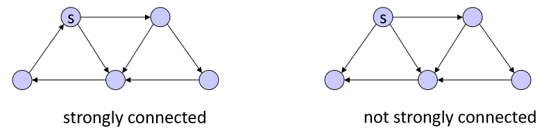

### 4.5 Minimum Spanning Tree

**Def**. Given an undirected connected graph $G = (V,E)$ with real-valued edge weights $c_e$, a **minimum spanning tree** is a subset of the edges $T \subseteq E$ such that $T$ covers every node and the sum of the edge weights is minimised.
* There are $n^{n-2}$ spanning trees of $K_n$ so brute force is not a feasible option.

**Def**. A **cut** is a subset of nodes $S$. The corresponding **cutset** $D$ is the subset of edges with exactly one endpoint in $S$.

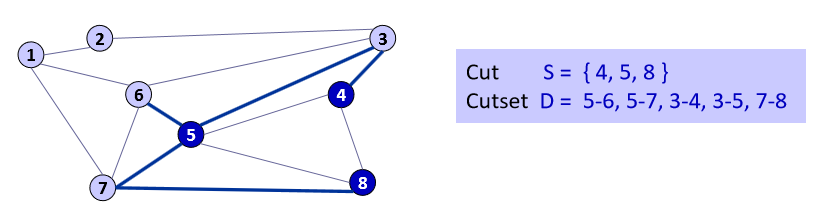

**Cycle-Cut Intersection Property**: A cycle and cutset intersect in an even number of edges.

**Proof**:
* We can divide vertices in the cycle into vertices **in the cut**, and **outside the cut**.
* If we **enter** the cut, then we also must **leave** the cut to get back to our starting point
* Hence we must traverse edges in the cutset in pairs, so they intersect in an **even number** of edges.

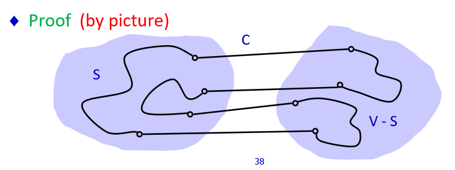

#### Cut and Cycle Properties for MST

*From here, we assume that edge costs $c_e$ are distinct.*

**Cut Property**. Let $S$ be any subset of nodes, and let $e$ be the minimum cost edge with exactly one endpoint in $S$. Then the MST **must contain $e$**

**Proof**:
* Suppose for a contradiction that $e$ does not belong to MST $T^*$.
* Adding $e$ to $T^*$ creates a cycle $C$ in $T^*$ because $T$ is a tree.
* Edge $e$ is both in the cycle $C$ and cutset $D$ corresponding to $S$.
* By the *cycle-cut intersection property*, there is an edge $f$ that is in both $C$ and $D$.
* We can swap out edge $e$ for edge $f$, and the result $T'$ is *still a spanning tree*
* Since $c_e < c_f$, $\text{cost}(T') < \text{cost}(T^*)$. 
* This is a contradiction.

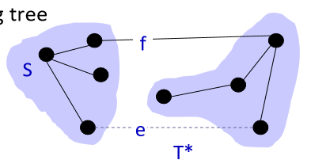

**Cycle Property**. Let $C$ be any cycle, and let $f$ be the max cost edge belonging to $C$. Then the MST **does not contain $f$**

**Proof**:
* Suppose for a contradiction that $f$ belongs to $T^*$.
* Deleting $f$ from $T^*$ creates a cut $S$ in $T^*$ (it partitions the nodes in 2)
* Edge $f$ is both in the cycle $C$ and in the cutset $D$ corresponding to $S$
* By the *cycle-cut intersection property*, there is an edge $e$ that is both in $C$ and $D$.
* We can swap out edge $e$ for edge $f$, and the result $T'$ is *still a spanning tree*
* Since $c_e < c_f$, $\text{cost}(T') < \text{cost}(T^*)$. 
* This is a contradiction.

#### Prim's Algorithm

**Prim's Algorithm** finds a minimum spanning tree via the cut property.

```
Repeat n-1 times {
    Apply cut property to S
    Add lowest cost edge in cutset corresponding to S to T
    Add one new explored node u to S
}
```

**Key Idea**: keep taking the lowest cost edge in cutset until all nodes are covered
* implement using a **priority queue**
* keep set of explored nodes $S$.
* for each unexplored node $v$, store attachment cost `a[v]` = cost of cheapest edge $v$ to a node in $S$

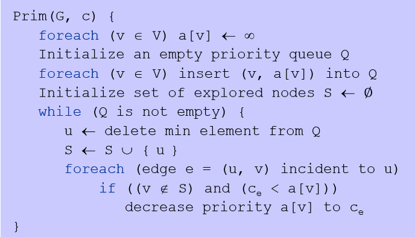

**Time complexity**: $O(m \log n)$ when using a priority queue implemented as a binary heap.

#### Kruskal's Algorithm

**Key Idea**: Use the *cycle* property to add edges with the smallest weight first
* Consider edges in ascending order of weight
    * **Case 1**: if adding $e$ to $T$ creates a cycle, discard $e$ by the cycle property
    * **Case 2**: otherwise, insert $e = (u, v)$ into $T$ according to cut property where $S$ = set of nodes in $u$'s connected component

Can be implemented using **union-find** on sets
* Build a set $T$ of edges in the MST, and maintain a set of nodes for each connected component
* Union-find helps us join connected components and check if there is a cycle

**Time complexity**: $O(m \log m)$
* $O(m \log m)$ for sorting and $O(\log m)$ for each union-find

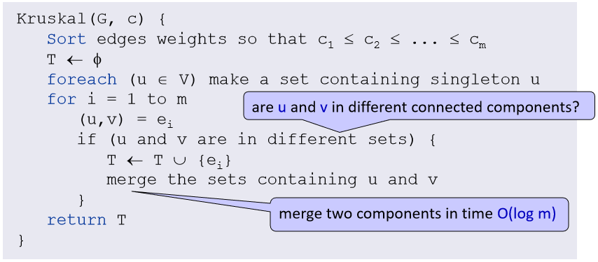

#### Lexicographical Tiebreaking

**Perturbing edge costs**. To remove the assumption that all edge costs are *distinct*, perturb all edge costs by tiny amounts to break ties
* Kruskal and Prim only do pairwise comparisons
* If perturbations are very small, we get the correct MST
* if edge costs are integers, perturb cost of edge $e_i$ by $i/n^2$

**Implementation**. Handle small perturbations implicitly by breaking ties lexicographically, according to index.

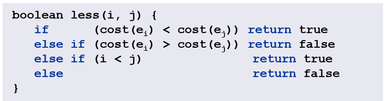

### 4.6 Dijkstra's Algorithm

**Shortest path problem**. Find the shortest directed path from start node $s$ to destination node $t$ in a graph. 

**Dijkstra's algorithm** solves this problem for directed graphs with non-negative weights.
* Maintain a set of explored nodes $S$ for which we've determined the shortest path distance
* Initialise $S = \{s\}$, $d(s) = 0$
* Repeatedly choose unexplored node $v$ which minimises $c(v) = \min_{e = (u,v), u \in S} d(u) + w(e)$
* Then add $v$ to $S$, and set $d(v) = c(v)$

**Implementation**
* Use **priority queue** to store unexplored nodes according to their weight $c(v)$
* Using a *binary heap implementation*, the time complexity of Dijkstra's algorithm is $O(m \log n )$

#### Proof of Correctness

**Invariant**: for all $u \in S$,  $d(u)$ is the length of the shortest $s \to u$ path

**Proof**: Induction on $|S|$.
* Define $c(v) = \min_{e = (u,v), u \in S} d(u) + w(e)$.

**Base case**: $|S| = 1$ is trivial as we set $d(s) = 0$.

**Inductive hypothesis**: assume true for $|S| = k \ge 1$.
* let $v$ be the next node added to $S$, and let $(u,v)$ be the chosen edge.
* the shortest $s \to u$ path plus $(u,v)$ is an $s \to v$ path of length $c(v)$
* consider any $s \to v$ path $P$. We show that it is no shorter than $c(v)$.
* let $(x,y)$ be the first edge in $P$ that leaves $S$, and let $P'$ be the subpath to $x$.
* we show that $P$ is longer than $c(v)$ when it reaches $y$:
* $W(P) \ge W(P') + w(x,y)$ as we have non-negative weights
* $\implies W(P) \ge d(x) + w(x,y)$ by the inductive hypothesis
* $\implies W(P) \ge c(y)$ by the definition of $c(y)$
* $\implies W(P) \ge c(v)$ since Dijkstra chose $v$ instead of $y$ (algorithm chooses smallest $c(v)$ value)
* $\implies W(P) \ge d(v)$.
* hence, any $s \to v$ path $P$ has weight $W(P) \ge c(v) = d(v)$.

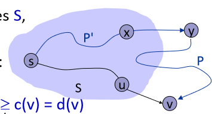

## 5. Divide and Conquer

> [KT] Chapter 5: Divide and Conquer

### 5.1 Mergesort

**Problem**. Sort an array of numbers in ascending order.

Mergesort is a **divide and conquer** sorting algorithm
* **Divide** array into two halves
* **Recursively** sort each half
* **Merge** two halves to make sorted whole in $O(n)$ time

The recurrence relation for mergesort is:
* $T(n) = 2T(n/2) + O(n)$
* where $T(1) = 0$
* we will initially assume that $n$ is a power of 2 for simplicity

**Time complexity**: $T(n) = O(n \log_2 n)$

#### Proof by Recursion Tree

We can draw a recursion tree and see how much combining work is done at each level.

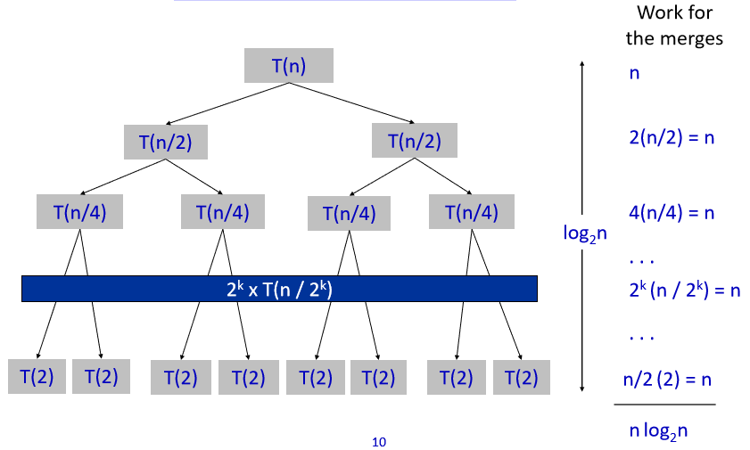

**Analysis**:
* At level $i$, we have $2^i$ subproblems, each requiring $O(n/2^{i})$ work. 
* Hence, the total work for level $i$ is $2^i \times O(n/2^{i}$ = $O(n)$ work.
* Since the height of the tree is $O(\log_2 n)$, the overall work is $O(n \log_2 n)$

#### Proof by Telescoping

From the definition, $T(n) = 2T(n/2) + n$
* $\implies T(n)/n = 2T(n/2) / n + 1$
* $= T(n/2)/(n/2) + 1$ by rearranging
* $= (2T(n/4) + n/2) / (n/2) + 1 = T(n/4)/(n/4) + 1$ by definition
* $= ... = T(n/n) / (n/n) + 1 \times log_2 n$
* $= log_2 n$

#### Proof by Induction

**Base case:** $n=1$ follows immediately

**Inductive hypothesis**: Assume that $T(n) = n \log_2 n$

**Inductive Step**. Consider $T(2n) = 2T(n) + 2n$
* $= 2n \log_2 n + 2n$ using the hypothesis
* $=2n(\log_2 (2n) - 1) + 2n$
* $=2n \log_2 (2n)$

#### Extending to non-powers-of-2

**Key Idea**: use floor and ceil to make inputs to $T$ an integer
* Note that we must use floor on one and ceil on the other to make them add up to $n$.

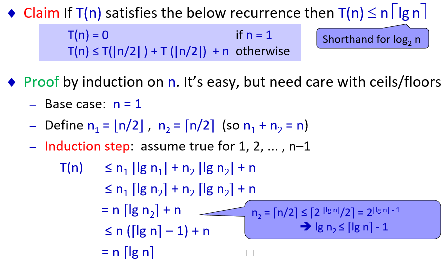

### 5.2 Counting Inversions

**Problem**. Count the number of inversions in an array of numbers.

**Def**. Given an ordering $a_1, a_2, \cdots, a_n$ of $n$ numbers, an inversion $(i,j)$ is where $i < j$ but $a_i > a_j$.
* There can be at most $n$ choose $2$ inversions.

**Key Idea**:
* we *divide* the array into two halves
* recursively find the number of inversions in each **and sort the subarrays using mergesort**
* and combine in $O(n)$
* base cases are inputs of size 2, which we can use a comparison to check easily

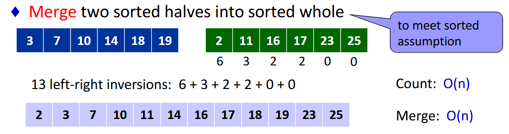

**Combining**:
* how many items on left each one on the right has to 'leapfrog'?
* $\iff$ how many items on the left are greater than $R_i$?
* we can use two pointers, and then merge the two sorted halves.

```
function count_cross_inversions(sorted_left, sorted_right) {

    count = 0
    left = 1

    for right = 1 to sorted_right.length {
        while (left <= sorted_left.length && sorted_left[left] < sorted_right[right]) {
            left = left + 1 
        }
        count = count + sorted_left.length - (left - 1)
    }

    return count
}
```

Alternatively, you can **merge and count** at the same time:

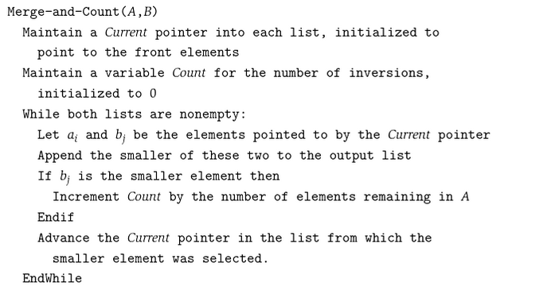
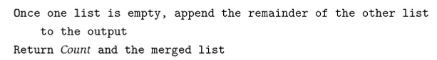

**Time complexity**: $T(n) = 2T(n/2) + O(n) = O(n \log n)$ assuming $n$ is a power of 2.

### 5.3 Closest Pair of Points

**Problem**. Given $n$ points in the plane, **find a pair with smallest Euclidean distance between them**

**Key Idea**:
* we can *divide* by drawing a vertical line $L$ so that roughly $n/2$ points are on either side of the line
* recursively find the closest pair on each side
* combine in $O(n \log n)$ time using a geometry trick
* return the best of three solutions

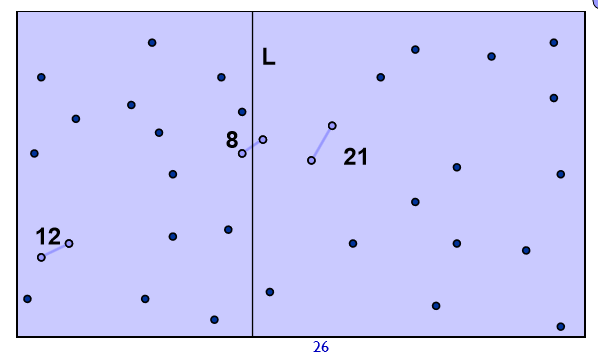

**Define**:
* $\delta_1$ = closest pair distance on the left side
* $\delta_2$ be the closest pair distance on the right side.
* $\delta = \min(\delta_1, \delta_2)$, i.e. the smallest pair distance on both sides.

**Observation**. We only need to check distances within a $2\delta$-strip around the line L.
* we need to find if any points have a distance smaller than $\delta$.
* any point that is more than $\delta$ away from the line $L$ must have distance larger than $\delta$

**Dividing into squares**.
* For any point $s_i$ in the $2\delta$-strip, draw a $2\delta \times 2\delta$ grid. Divide the grid into $16$ equally sized squares of size $\delta/2 \times \delta/2$.
* **Claim**. each square **must contain at most one point**.
    * If two points are in the same square, their distance is less than $\sqrt{2}/2 \times \delta \approx 0.707\delta$, contradicting the definition of $\delta$ as the *minimum* distance between any pair of points on either side of the line.
* **Claim**. we **only** need to look in the remaining $15$ squares.
    * any point outside the grid is at least $3$ rows/columns away, which means the points must be at least $3\delta/2$ apart, so we don't need to look at them.

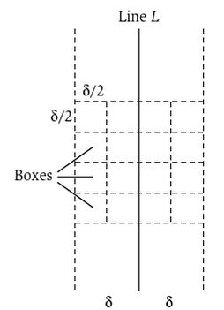


* Hence, we can:
    * sort points in the $2\delta$-strip by their $y$ coordinate
    * only check distances of those within $15$ positions in the sorted list

* Although $15$ can be lowered, critically it is a constant, so each point in the $2\delta$-strip requires $O(1)$ work, so scanning the whole strip takes $O(n)$ work.

**Algorithm**.

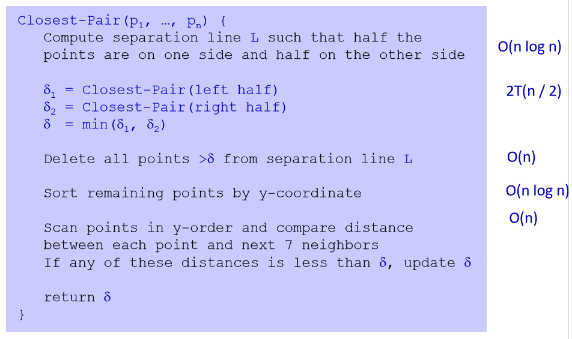

**Time Complexity**.
* The combine step is dominated by the sorting stage
* so the recurrence is $T(n) = 2T(n/2) + O(n \log n) = T(n \log^2 n)$.
* it is possible to do $O(n \log n)$ with a more careful solution but that is not covered.

### 5.4 The Master Method

The **master method** is a method to solve recurrences of the form $T(n) = aT(n/b) + f(n)$.

In the case $f(n) = \Theta(n^c)$, we have a direct solution.
* **Case 1**: $c > \log_b a$
    * then $T(n) = \Theta(n^c)$
* **Case 2**: $c = \log_b a$
    * then $T(n) = \Theta(n^c \log n)$
* **Case 3**: $c < \log_b a$
    * then $T(n) = \Theta(n^{\log_b a})$

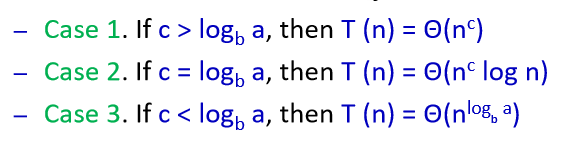

An extra case: if $f(n)$ is $\Theta(n^{\log_b a} \log^k n)$, then
* $T(n) = \Theta(n^{\log_b a} \log^{k+1} n)$

This is useful in showing that for the recurrence $T(n) = 2T(n/2) + \Theta(n \log n)$,
* $T(n) = \Theta(n\log^2 n)$

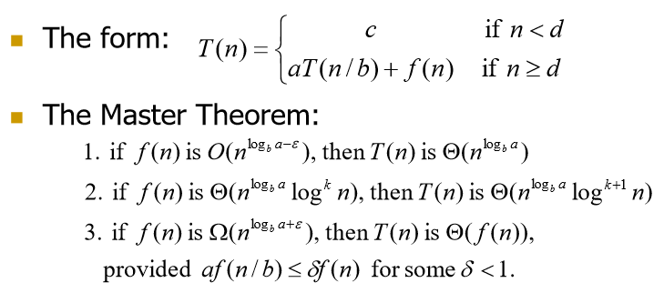


### 5.5 Integer Multiplication

**Problem**. find the product of two $n$-bit integers $a$ and $b$
* the typical solution is **long multiplication**, which has time complexity $\Theta(n^2)$.

**Key Idea**. Using divide and conquer, we can:
* split up $a$, $b$ into low and high bits, i.e. $a = a_1 x + a_0, b = b_1 x +b_0$ for $x = 2^{n/2}$.
* recursively compute $3$ multiplications 
* combine them in linear time to calculate $a \times b$

This trick uses the formula:
* $ab = a_1b_1 x^2 + ((a_1 + a_0)(b_1 + b_0) - a_1b_1 - a_0b_0)x + a_0b_0$
* which only requires three multiplications and more additions

This yields the recurrence relation
* $T(n) = 3T(n/2 + 1) + O(n)$
* applying the master theorem with $a = 3, b = 2, c = 1$, we get $T(n) = O(n^{\log_2 3})$
* which is roughly $O(n^{1.585})$

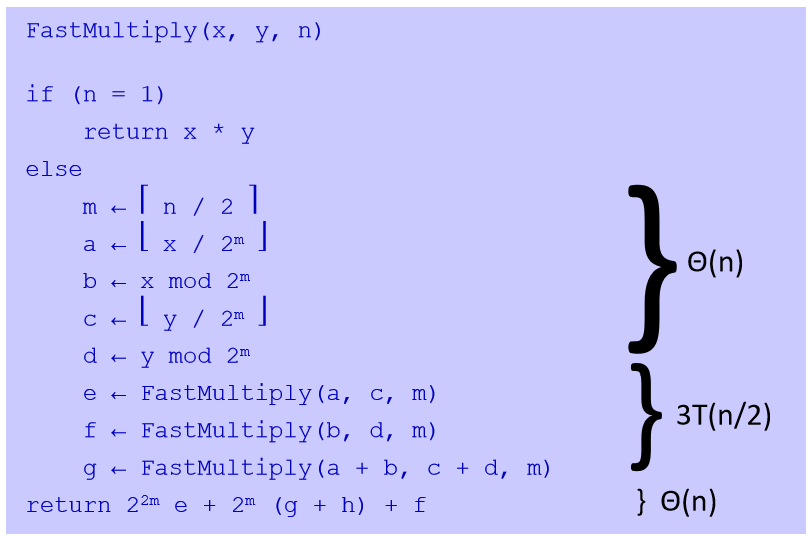

### 5.6 Matrix Multiplication

**Problem**. find the product of two $n \times n$ matrices $A$ and $B$.
* the typical algorithm has time complexity $\Theta(n^3)$
* as we have $n^2$ entries to fill and each requires computing a *dot-product* which is $\Theta(n)$.

**Key Idea**
* divide each matrix $\textbf{C} = \textbf{A} \times \textbf{B}$ into four submatrices
* we can express matrix multiplication in terms of $7$ smaller matrix multiplications and more additions.

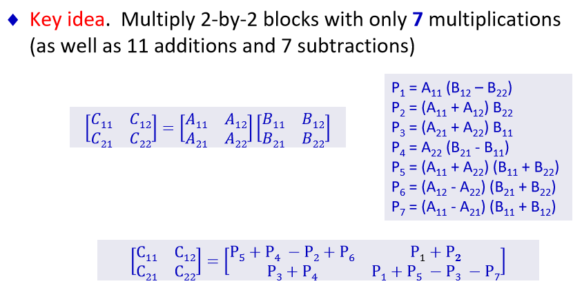

**Algorithm**:
* **Divide**: partition $\textbf{A}$ and $\textbf{B}$ into $n/2$ by $n/2$ blocks
* **Compute**: $14$ different $n/2$ by $n/2$ matrices via $10$ matrix additions which takes $\Theta(n^2)$
* **Conquer**: multiply $7$ pairs of $n/2$ by $n/2$ matrices, recursively
* **Combine**: $7$ products into $4$ terms using $8$ matrix additions which takes $\Theta(n^2)$

**Time Complexity**.
* the recurrence relation is $T(n) = 7T(n/2) + O(n^2)$
* which by the master method is $O(n^{\log_2 7}) = O(n^{2.8074})$  

## 6. Dynamic Programming

> [KT] Chapter 6: Dynamic Programming

### 6.1 Weighted Interval Scheduling

**Problem**. Given a set of job intervals $[s_j, f_j]$, each with weight $v_j$, find the **maximum weight subset** of mutually compatible jobs.

The solution is a dynamic programming approach using **binary choice**
* you either take an interval or you don't.
* take the maximum of the two approaches

**Def.** In dynamic programming, the recurrence relation is called the **bellman equation**. This is also an inductive proof of the problem.


**Define**:
- $OPT(j)$ = value of the optimal solution to the problem consisting of job requests $1, 2, \cdots, j$.
- $p(j)$ = **largest index** $i < j$ such that job $i$ is compatible with job $j$

**Case Analysis**:
* Case $1$: OPT selects job $j$
    * we can choose from remaining compatible jobs $1, 2, \cdots, p(j)$.
* Case $2$: OPT does not select job $j$
    * We can choose from remaining jobs $1, 2, \cdots, j-1$.

This yields the bellman equation:

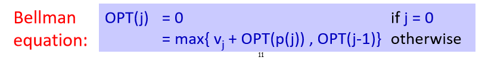

**Implementation**. Either using memoization or a 1D-DP table for tabulation.

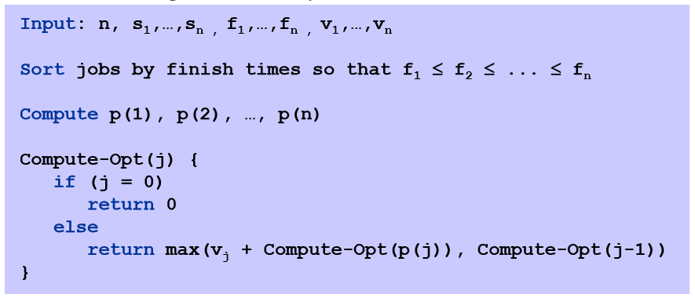

**Memoziation**:

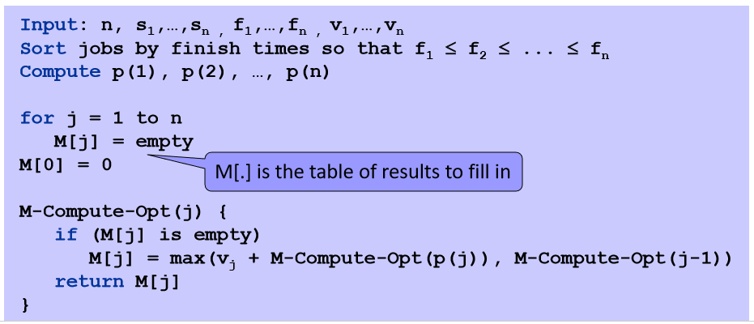

**Tabulation**:

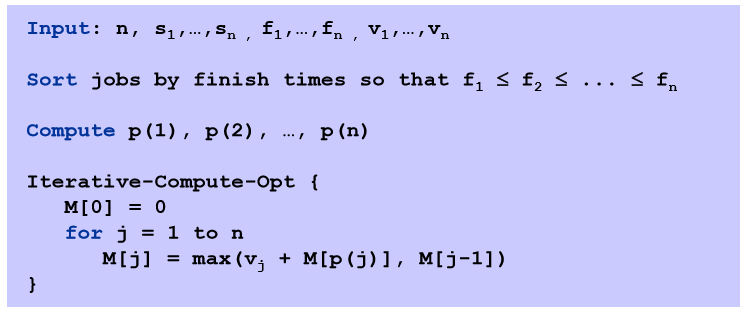

**Time complexity**:
* DP section takes $O(n)$
* we can compute $p(n)$ in $O(n \log n)$ time by sorting by start time
* so overall the algorithm is $O(n \log n)$.

### 6.2 Segmented Least Squares

**Problem**. Given $n$ points in the plane $(x_1, y_1), (x_2, y_2), \cdots, (x_n, y_n)$ with $x_1< x_2 < \cdots < x_n$, find a sequence of lines that minimises some function $f(x)$.
* We choose $f(x) = E + cL$, where $c > 0$, where $E$ is the Segmented Least Squares error term. This provides a cost to adding more lines.

**Key Idea**. take a *multi-way* choice in determining when the current segment will end, and add on the cost for everything before.


**Define**. $OPT(j)$ = minimum cost for points $p_1$ to $p_j$. Let $e(i, j)$ be the minimum sum of squares for points $p_i, \cdots, p_j$.

**Bellman Equation**
* consider dividing the interval $[1, j]$ into two parts $[1, i-1]$ and $[i, j]$.
* the cost is $e(i,j ) + c + OPT(i-1)$
* take the minimum over all possible divisions

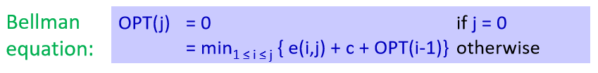

**Algorithm**:

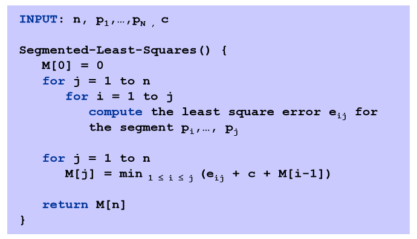

**Time complexity**:
* DP section takes $O(n^2)$ time and $O(n)$ space if we precompute everything before. 
* (this is outside the scope of DP), but we can precompute the least square error term using **PREFIX SUMS** which makes the precomputation $O(n^2)$
* hence the whole algorithm is $O(n^2)$.

### 6.3 Knapsack Problem

**Problem**. Given a set of items each with value $v_i$ and weight $w_i$, fill the knapsack with capacity $W$ to maximise the total value.

This is an example of a 2D dynamic programming problem: the bellman equation has two parameters. 

**Define**. $OPT(i, w)$ = maximum profit subset of items up to $i$ with weight limit $w$

**Bellman Equation**
* case 1: do not select item $i$
    * use items up to $i-1$ with same capacity $W$
* case 2: select item $i$
    * use items up to $i-1$ with reduced capacity $W - w_i$.

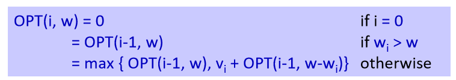

**Algorithm**:

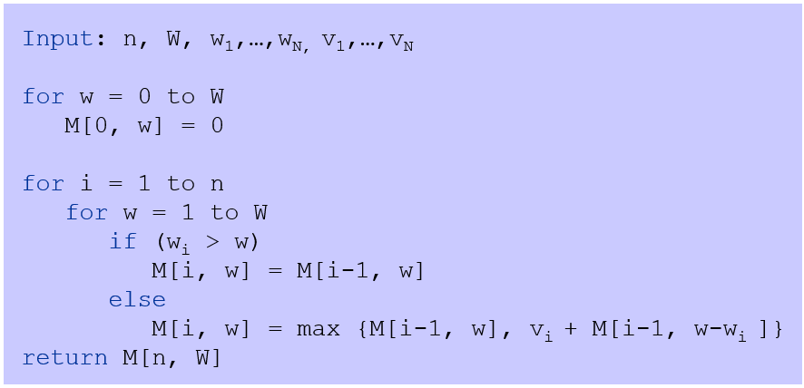

**Time complexity**:
* $O(nW)$ due to the two for loops.
* N.B. the decision version of the problem is **NP COMPLETE** because $W$ is not polynomial in the size of the number (number of bits)

### 6.4 RNA Secondary Structure

**Problem**. Given a string $B = b_1 b_2 \cdots b_n$ over the alphabet $\{A, C, G, U\}$ where $A$ pairs up with $U$ and $G$ pairs up with $C$, find a set of pairs $S = \{(b_i, b_j)\}$ where:
* $S$ is a matching
* there are no sharp turns, i.e. if if $(b_i, b_j) \in S$, then $i < j - 4$ (the 4 is just a constant)
* non-crossing: if $(b_i, b_j)$ and $(b_k, b_l)$ are two pairs in $S$, then we cannot have $i < k < j < l$
* and we **MAXIMISE THE NUMBER OF BASE PAIRS**

**Equivalently**. find a secondary structure $S$ that maximises the number of base pairs

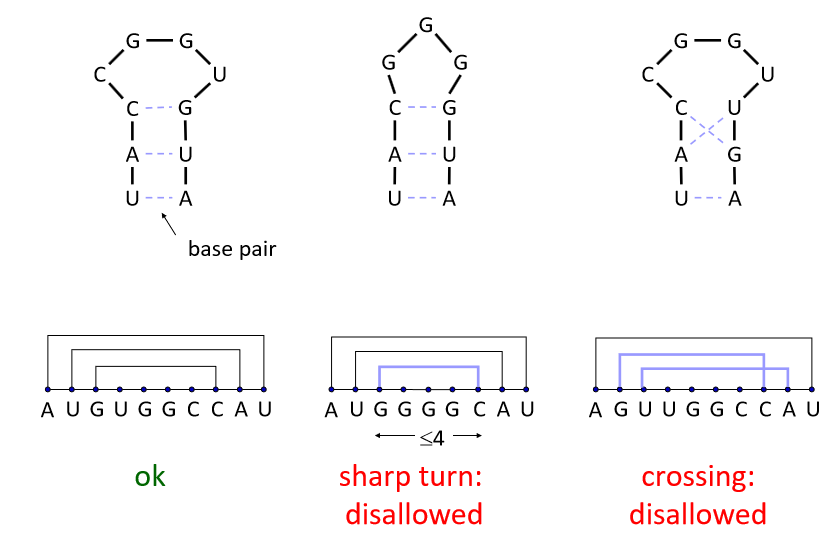

**Key Idea**: perform dynamic programming over intervals - this is a 2D problem.

**Define**. $OPT(i,j)$ = maximum number of base pairs in a secondary structure of the substring $b_i b_{i+1} \cdots b_j$.

**Bellman Equation**
* Case 1: if $i \ge j - 4$
    * then $OPT(i,j) = 0$ as there cannot be any sharp turns
* Case 2: base $b_j$ is not involved in a pair
    * $OPT(i, j) = OPT(i, j-1)$
* Case 3: base $b_j$ pairs with $b_t$ or some $i \le t < j - 4$
    * divide the string into two sections $[i, t-1]$ and $[t+1, n-1]$
    * sum the base pairs in each substring and add 1 for the initial base pair
    * take the maximum over all possible $t$ s.t. $i \le j-4$ and $b_t, b_j$ are base pairs.

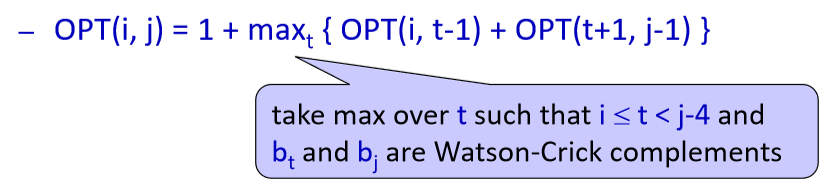

**Algorithm**:

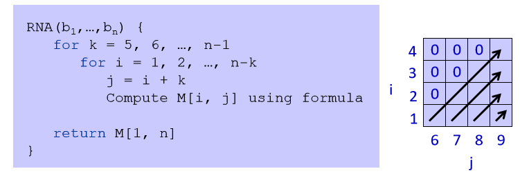

**Time Complexity**
* there are $n^2$ cells in the table and each takes $O(n)$ to fill
* so the time complexity is $O(n^3)$ with $O(n^2)$ space.

### 6.5 Sequence Alignment (edit distance)

**Problem**. Given two strings $X = x_1\cdots x_m$ and $Y = y_1 \cdots y_n$ find an alignment of minimum cost
* basically the problem of finding **similarity** of two strings.

**Parameters**
* $\delta$ = gap penalty. (equivalent to inserting/deleting)
* $\alpha_{pq}$ be the mismatch penalty. (equivalent to replacing)
* we define $\alpha_{pp} = 0$ for matching characters.

**Key Idea**: This is a 2D problem but with three choices.

**Define** $OPT(i,j)$ = min cost of aligning two strings $X$ and $Y$.

**Bellman Equation**

* **Case 1:** OPT matches $x_i-y_j$: pay mismatch $x_i$, $y_j$
    * pay mismatch for $x_i-y_j$ = $\alpha_{x_i,y_j}$
    * and the minimum cost of aligning remaining part of string 
    * $\text{cost} = \alpha_{x_i,y_j} + OPT(i-1, j-1)$

* **Case 2:** OPT leaves $x_i$ unmatched: pay gap for $x_i$
    * pay gap for $x_i$ = $\delta$
    * and the minimum cost of aligning remaining part of $X$ and all of $Y$
    * $\text{cost} = \delta + OPT(i-1, j)$

- **Case 3:** OPT leaves $y_i$ unmatched: pay gap for $y_j$
    * pay gap for $y_j$ = $\delta$
    * and the minimum cost of aligning all of $X$ and remaining part of $Y$
    * $\text{cost} = \delta + OPT(i, j-1)$

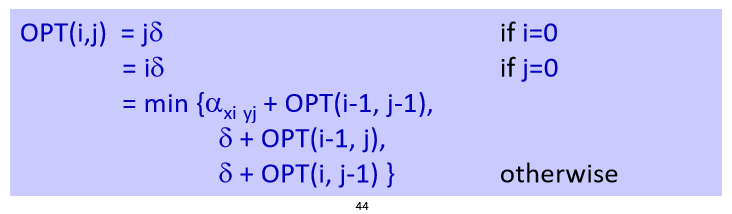

**N.B.** This is very similar to leetcode edit distance where:
* case 1 matches **replace** or **match**
* case 2 matches **delete** (we replace $x_i$ with nothing)
* case 3 matches **insert** (we replace nothing with $y_j$)

**Algorithm**:

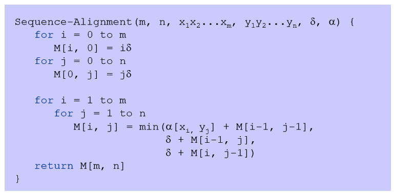


**Time and Space Complexity**
* Time complexity: $\Theta(mn)$
* Space complexity: $\Theta(mn)$ as it takes $\Theta(1)$ to fill an entry in the table, and there are $mn$ entries.

**Improvement**. We can improve this by building up the table one row at a time, and forgetting the old rows. This reduces the space complexity to $O(m+n)$
* But now, there is no longer a simple way to recover the alignment itself
* a solution that solves this uses a combination of *divide-and-conquer* and *dynamic programming*.
* this is (likely) off the scope of the test


## 7. Complexity classes

### Algorithms

**Def**. An *algorithm* is a well-specified set of instructions that, when followed, provide the answer to a given question (algorithmic problem). Each step is:
* well defined
* unambiguous 

**Def**. A *proof* is a convincing argument that a claim is true. Proofs exist to  convince a human *reader*, not a *computer*. We provide proofs of:
* **Correctness** - show the algorithm provides the answer we claim it does
* **Efficiency** - show the algorithm runs within the time/space bounds that we claim it does

**N.B.** Algorithms are implemented on some hypothetical, perfect **abstract machine**. Operations are assumed to be performant.

One "step" is any constant time operation on such a machine.
* reading/writing data value is one step
* array indexing is one step
* most numeric operations are one step

### Complexity Classes

We classify problems according to how difficult they are.

**Def**. The *complexity* of a problem is the time/space efficiency of the **best algorithm** that solves it.

**Categories of Problems.** Problems can be grouped according to the sort of answer they require.
* **Search problems**: $X : \text{Input} \to \text{Output}$
    * where $\text{output}$ must fulfill some predicate
* **Optimisation problems**: $X: \text{Input} \to \text{Output}$
    * such that $\text{Output}$ is maximal or minimal somehow
* **Decision problems**: $X : \text{Input} \to \text{Yes/No}$

**In this module**. When talking about complexity classes, we focus on *decision problems*

### $\text{P}$

**Def**. A problem can be solved in *polynomial time* if there is an algorithm that solves it in time $O(n^k)$ for some constant $k$.

All problems that can be solved in polynomial time belong to the *complexity class* $\text{P}$.
* all constant time algorithms, linear time, quadratic time, ... are in $\text{P}$.

**Examples of problems in $\text{P}$**:
* shortest path in a weighted graph (e.g. dijkstra's algorithm)
* levenshtein (edit) distance
* matrix multiplication

**Def**. A problem is *tractable* if it can be solved in practice, using a real computer, in a *reasonable* amount of time

**For this module**. The set of problems which are tractable is equal to $\text{P}$.

### $\text{NP}$

**Def**. A decision problem $X$ is in the complexity class $\text{NP}$ $\text{iff}$ a verifier $C$ exists such that:
* $C$ takes two inputs, a problem instance $i$ for $X$ and a candidate witness $w$.
* $C$ runs in polynomial time.
* If the answer to $X(i)$ is $\text{No}$, then $C(i, w)$ is never is always $\text{No}$.
    * No witness is valid because the problem has no solution.
* If the answer to $X(i)$ is $\text{Yes}$, then there is some $w$ (a witness for $i$) such that $C(i, w)$ gives $\text{Yes}$
    * Some witness is valid if there exists a solution.

**TLDR**. $\text{NP}$ is a complexity class containing **decision problems** that are *easy to verify*.

#### $\text{P} \subseteq \text{NP}$

**Theorem**. $\text{P} \subseteq \text{NP}$

**Proof**. We show that every problem in $P$ has a verifier that runs in polynomial time.
* Let $X$ be a decision problem in $P$
* By definition, an algorithm $A$ exists that solves $X$ (returns Yes/No) in polynomial time.
* So $C(i, w) := A(i)$ is a verifier for $X$ (ignore the witness $w$)

This works because:
* if $A(i)$ is $\text{No}$, $C(i, w)$ is $\text{No}$ always.
* because $C(i, w)$ is $\text{Yes}$ all the time.
* otherwise, there exists a $w$ s.t. $C(i, w)$ is $\text{Yes}$.

**Fact**. It is not known whether $\text{P} = \text{NP}$.

#### Guess and Check

**NP** is short for *nondeterministic polynomial-time*

If we have a verifier for problem $X$, we have a simple *nondeterministic* algorithm for $X$.

Given an instance $i$ of $X$:
1. guess a possible polynomially-sized witness $w$ for $i$
2. run the verifier $C$ on the input $i$ and $w$

If $w$ is a witness for $i$, the algorithm will return $\text{Yes}$ so we get a $\text{Yes}$ answer.

However, computers are deterministic. The deterministic version is **brute force** - check all the possible witnesses and run the verifier on them.

### Independent Set

**Problem**. Given an undirected graph $G$ and an integer $k$, does there exist in $G$ an independent set of size $k$?

**Def**. An *independent set* in $G$ is a set of vertices such that no two vertices are adjacent in $G$.

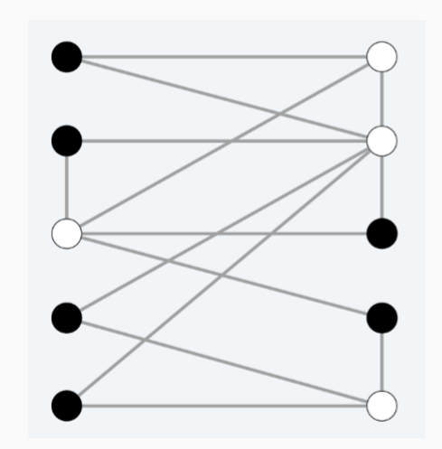

**Theorem**. $\text{INDEPENDENT-SET} \in \text{NP}$

**Proof**. We construct a polynomial time verifier $C$ for $\text{INDEPENDENT-SET}$.

Inputs to $C$:
* an $\text{INDEPENDENT-SET}$ instance $(G = (V,E), k)$
* candidate independent set $S \subseteq V$ to act as witness

**Verifier**:
1. If $|S| \ne k$, return $\text{No}$.
2. If, for any $v_1, v_2 \in S$, we have $\{v_1, v_2\} \in E$, then return $\text{No}$
    * brute force check all pairs of vertices for edges
3. Return Yes.

**Fact**. $C$ runs in quadratic time, hence verifier is polynomial time.


## 8. Polynomial reductions

### Complexity

Determining whether a problem is tractable or intractable is difficult.
* **Tractable**: give an algorithm that solves $X$, and show it runs in polynomial time
* **Intractable**: more difficult as we cannot say "i can't think of an algorithm".

One such way is an **impossibility proof**.

**Problem** ($\text{FIND-MAX}$). Given a sequence of integers $A$, find the largest element in $A$.

**Claim**. $\text{FIND-MAX}$ cannot be solved in better than $O(n)$.

**Proof**. We show that every integer must be visited at least once
* Suppose an algorithm $G$ exists that does not visit every element
* Consider the input $A = 0, \cdots, 0$, and suppose (wlog.) that element $a_k$ is *not* visited.
* Consider $A'$ where $a_k' = 1$ and $a_i' = 0$ for all $i \ne k$
* (i.e. we set the $k$th element to $1$ and leave everything else as zeros)
* Then $G$ cannot distinguish between $A$ and $A'$, so it is incorrect for one or the other (as they have different answers)
* So $G$ does not solve $\text{FIND-MAX}$.
* So no such algorithm can exist.

**Fact**. Most problems are not known to be tractable and are not known to be intractable. They live in a "grey area".

### Reductions

**Def**. A *reduction* is a description of how to solve one problem via a solution for another problem. **A reduction is itself an algorithm**.

**Key Point**. We reduce **from** the problem we are *solving* to the problem we are *using*.

**Def**. An *oracle* is a black box where we put in inputs and get back answers. It is not a specific algorithm.
* When reducing from $X$ to $Y$, we can only use the oracle for $Y$.
* A *constant time oracle* takes one step.

#### Polynomial-time Reductions

**Def**. Problem $X$ *polynomial-time reduces* to problem $Y$ $\text{iff}$ any instance of $X$ can be solved using:
* a polynomial number of calls to an oracle for $Y$ plus
* a polynomial number of standard computational steps.

**N.B.** The instances of $Y$ must also be of polynomial size (we pay time/space to write down the inputs given to the oracle).

When $X$ is polynomial-time reducible to $Y$, we write $X \le_P Y$.

**Key Insight**. poly-reductions can be thought of as "comparing the difficulties" of the problems. If $X \le_P Y$, then:
* If $Y$ is easy, then $X$ is easy.
* If $X$ is hard, then $Y$ is hard.

**Restatement**. We can get a solution for $X$ by solving $Y$ instead, and doing a polynomial amount of extra work.

We sometimes say
* $X$ is no harder than $Y$
* or more correctly, *at most polynomially harder* than $Y$.

A polynomial-time reduction enforces a relationship between two problems in terms of tractability (membership of $\text{P}$)

**Theorem**. If $X \le_P Y$ and $Y \in P$, then $X \in P$.
* if $Y$ is easy, then $X$ is easy.

**Corollary**. If $X \le_P Y$ and $X \notin P$, then $Y \notin P$.
* if $X$ is hard, then $Y$ is hard.

#### Equivalence

**Def**. If $X \le_P$ and $Y \le_P X$, then we say that $X$ and $Y$ are *polynomial-time equivalent* and write $X \equiv_P Y$.

Intuitively, this means that $X$ and $Y$ are equal in difficulty.

### Vertex Cover

**Problem** ($\text{VERTEX-COVER}$). Given an undirected graph $G = (V, E)$ and an integer $k$, does there exist a set $S \subseteq V$ such that $|S| = k$ and every edge in $G$ has at least one endpoint in $S$.

**Def**. A *vertex cover* in $G$ is a set of vertices such that every edge in $G$ has at least one endpoint in the set.

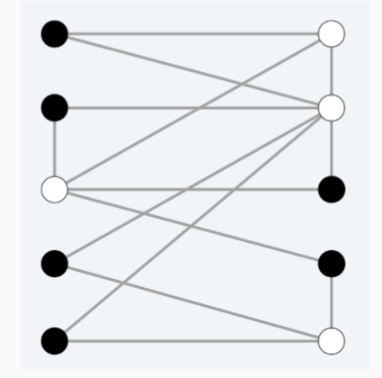

**Theorem**. The complement of a vertex cover is an independent set. (and vice versa).

**Corollary**. A graph with $n$ vertices has an independent set of size $k$ $\text{iff}$ it has a vertex cover of size $n - k$.

**Corollary**. The complement of a vertex cover of *minimum size* is an independent set of *maximum size* (and vice versa).

#### Relating Vertex Cover and Independent Set

**Claim**. $\text{VERTEX-COVER} \le_P \text{INDEPENDENT-SET}$

**Proof**. We provide a reduction reducing from $\text{VERTEX-COVER}$ to $\text{INDEPENDENT-SET}$.
* Given input $(G = (V,E), k)$
* Call $\text{INDEPENDENT-SET}$ with input $(G, |V| - k)$.
* Return the result

```
algorithm VERTEX-COVER(G = (V,E), k) {
    return INDEPENDENT-SET(G, |V| - k)
}
```

**Correctness**. Independent set and vertex cover are complements by the theorem above.

**Claim**. $\text{INDEPENDENT-SET} \le_P \text{VERTEX-COVER}$
* Reason: independent set and vertex cover are complements in both directions.

**Proof**.
* Given $\text{INDEPENDENT-SET}$ input $(G = (V,E), k)$
* Call the oracle for $\text{VERTEX-COVER}$ with input $(G, |V|-k)$
* Return the result

```
algorithm INDEPENDENT-SET(G = (V,E), k) {
    return VERTEX-COVER(G, |V| - k)
}
```

**Consequence**. $\text{VERTEX-COVER} \equiv_P \text{INDEPENDENT-SET}$
* so they have the same complexity (up to polynomial factors).

## 9. NP-Completeness and SAT

### NP Completeness 

**Def**. A decision problem $X$ is *NP-complete* if:
* **NP membership**. $X$ is in $\text{NP}$.
* **NP hardness**. For every problem in $Y$ in $\text{NP}$, it is possible to poly-reduce from $Y$ to $X$
    * i.e. $\forall Y \in \text{NP}, Y \le_P X$.
    * i.e. $X$ is at least as hard as every problem in $\text{NP}$.

### Transitivity of $\le_P$

Suppose we have problems $A, B, C$ where $A \le_P B$ and $B \le_P C$. By transitivity, we can conclude that $A \le_P C$.

**Proof**:
* our reduction from $A$ to $B$ makes use of an oracle for $B$
* our reduction from $B$ to $C$ makes use of an oracle for $C$
* so we can construct a reduction from $A$ to $C$ by *substituting* the oracle for $B$ with its reduction (remember that a reduction is itself an algorithm)

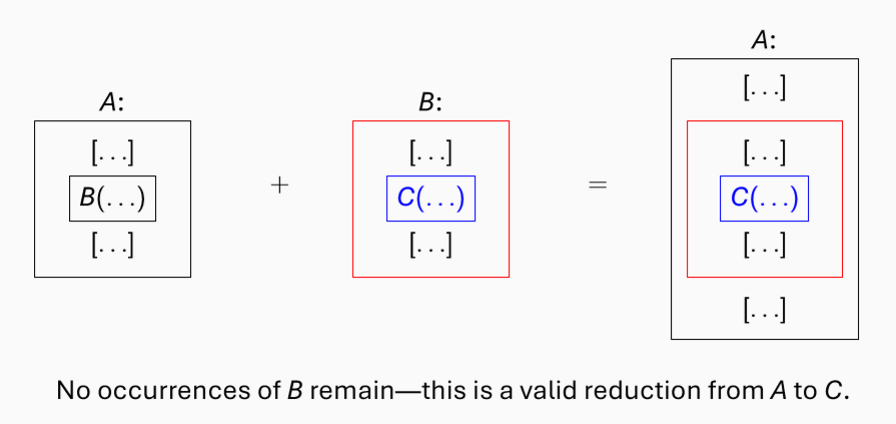

This is useful in proving NP hardness of a problem $X$. We just need to prove that some **known NP-complete problem** $Y$ reduces to $X$ in polynomial time. ($Y \le_P X$)


### Satisfiability

#### Problem Statement

**Definitions**
* A boolean formula is a formula built up from boolean variables and boolean operations, e.g. $(x \land y) \lor (\neg x \land (\neg y \rightarrow z))$
* A *literal* is either a variable or its negation: either $x$ or $\neg x$.
* A *clause* is a disjunction (OR) of literals.
    * e.g. $x \lor \neg y \lor z$ or $x \lor \neg x$
* A formula is in *conjunctive normal form* (CNF) $\text{iff}$ it is a conjunction of clauses (an AND of OR's)

**Theorem**. Every boolean formula has an equivalent formula in CNF.

**Satisfiability**. A boolean formula $phi$ is satisfied by an assignment of values to its variables if, when we substitute those values into $\phi$ and evaluate it, the result is **true**.

**Def**. If there is some assignment that satisfies $\phi$, we say that $\phi$ is satisfiable.

**Problem** ($\text{SAT}$). Given a boolean formula $\phi$ in CNF, is there some assignment of values to variables that makes $\phi$ true?

#### NP Completeness of SAT

**Lemma 1**: $\text{SAT} \in \text{NP}$

**Proof**. We give a verifier for a $\text{Yes}$ instance of $\text{SAT}$.
* **Input**: boolean formula $\phi$ and witness is (supposedly) a satisfying assignment $A$
* We check that $A$ satisfies $\phi$ by evaluating $\phi$ with the assignment $A$
* This takes polynomial time in the size of $\phi$.

**Lemma 2**: All problems in $\text{NP}$ reduce to SAT.

**Proof**. Challenging and not required for this course. Idea is:
* for any problem $X$, write down the algorithm for $X$ as a boolean formula $\psi$
* so that $\psi$ is satisfied $\text{iff}$ $X$ is a $\text{Yes}$ instance.

**Theorem**. $\text{SAT}$ is complete for $\text{NP}$.

#### k-SAT

**Problem** ($k$-$\text{SAT}$). Given a boolean formula $\phi$, where $\phi$ is in CNF, and each clause in $\phi$ has at most $k$ literals, is $\phi$ satisfiable?

For example:
* $(x \lor \neg y \lor z) \land (\neg x \lor y \lor z)$ is an instance of $3$-$\text{SAT}$.

**Theorem**. $1$-$\text{SAT}$ is $O(n)$.
* the formula is a conjunction of literals
* if both $x$ and $\neg x$ exist then it is not satisfiable (for any variable $x$)
* scan through CNF to check if we have both $x$ and $\neg x$

**Theorem**. $2$-$\text{SAT}$ is in $\text{P}$
* look for clauses containing $x$ and $\neg x$, and combine the other parts of them into a new clause
* e.g. $(x \lor \neg y) \land (\neg x \lor z)$
* either $x$ or $\neg x$ is true.
* we can shorten to $\neg y \lor z$ (resolution)

**Theorem**. $3$-$\text{SAT}$ is NP-complete.

**Proof** (sketch)
* **NP membership**: a satisfying assignment is a valid witness, and can be checked in polynomial time. (same argument as for SAT)
* **NP hardness**: reduce from SAT to 3-SAT.
    * the idea is to break apart clauses of longer than 3 literals into smaller clauses

Since $Y \le_P \text{SAT}$ for all $Y \in \text{NP}$, and we now know $\text{SAT} \le_P 3\text{-SAT}$, by transitivity of poly-reductions, we have $Y \le_P 3\text{-SAT}$ as well.

### NP-Completeness of Independent Set

**Theorem**. $\text{INDEPENDENT-SET}$ is NP-complete.

**NP Membership**. This was proved earlier in section $7$

**NP Hardness**. We prove this by reducing from $3\text{-SAT}$.
* i.e. we prove $3\text{-SAT} \le_P \text{INDEPENDENT-SET}$

**Algorithm**:
* Take input $3-\text{SAT}$ instance $phi$. We will construct a graph representing $\phi$.
* A clause in $3-\text{SAT}$ has at most 3 literals.For each literal we add a vertex.
* (a) Add on edge between conflicting literals ($x$, $\neg x$)
* (b) Add on edge between literals in the same clause
* Call $\text{INDEPENDENT-SET}$ with this graph and $k$ = number of clauses.
* Return the result

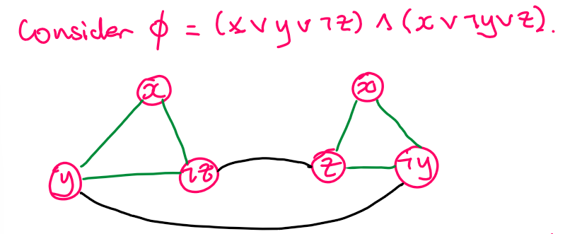

For every reduction we provide, we **must** prove it is correct. To do this, we prove both directions of the reduction. For the reduction $X \le_P Y$, we show:
1. If $X$ returns true, then $Y$ returns true
2. If $Y$ returns true, then $X$ returns true

**Proof of Correctness**:
* ($\Leftarrow$) 
    * Suppose an independent set of size $k$ exists.
    * Then there exists $k$ vertices in different clauses (by *b*) such that they do not conflict (by *a*)
    * An argument of True to each such positive literal and false to each such negative literal is a **satisfying** assignment in $\phi$.
* ($\Rightarrow$) 
    * Suppose $\phi$ is satisfiable. Then (by reverse argument) an independent of size *number of clauses* exists.


**Proof of Efficiency**:
* There are linearly many vertices and quadratically many edges
* We make one call to the $\text{INDEPENDENT-SET}$ oracle
* Therefore the reduction is polynomial

## 10. Other NP complete problems

### Set Cover

#### Problem Statement

**Problem** ($\text{VERTEX-COVER}$). for a given:
* universal set $U$,
* set $S$ of *subsets* of $U$, and
* integer $k$,
* is there a set $S' \subseteq S$ of size $k$ such that $\bigcup S' = U$?

**TLDR**. Does there exist $k$ subsets of $U$ whose union is equal to $U$?

#### NP Completeness of Set Cover

**NP membership**. We can construct a verifier that takes in a candidate set of subsets $S'$ and integer $k$, and check if their union is $U$.

**NP hardness**. We reduce **from** $\text{VERTEX-COVER}$.
* i.e. we show a reduction $\text{VERTEX-COVER} \le_P \text{SET-COVER}$

**algorithm** $\text{VERTEX-COVER}$ ($G = (V,E), k$):
1. let $U$ = $E$
2. let $S$ contain for each vertex $v$, the set of edges incident to $v$.

    $$S = \{\space \{e \space| \space v \in e\}\space | \space v \in V\}$$

3. return $\text{SET-COVER}(U, S, k)$

**Proof of correctness**.
* ($\Rightarrow$):
    * Suppose the $\text{VERTEX-COVER}$ instance if a Yes.
    * Then, selecting some set of vertices $v$ covers all edges $E$.
    * In our constructed $\text{SET-COVER}$ instance, the selected vertices $V'$ correspond to a selection of subsets which contain all the edges incident to $\bigcup V$.
    * Since we know that $\bigcup V' = E$ and $E = U$, our selection of subsets must cover $U$.
    * So the $\text{SET-COVER}$ instance is a Yes.
* ($\Leftarrow$):
    * By symmetrical reasoning, a Yes instance of the $\text{SET-COVER}$ problem implies a Yes instance of $\text{VERTEX-COVER}$.

**Proof of efficiency**.
* there are linearly many vertices and quadratically many edges
* we make one call to the $\text{SET-COVER}$ oracle
* hence this is a polynomial reduction

### Subset Sum

**Problem** ($\text{SUBSET-SUM}$). For a given
* set of integers $S$, and
* integer $t$,
* is there a subset $S' \subseteq S$ such that $\sum S' = t$?

**Theorem**. $\text{SUBSET-SUM}$ is complete for NP. 

**Proof**. Not covered in this course, can be proved by a reduction **from** $3\text{-SAT}$.

## 11. Other complexity classes

### Complexity vs running time

Problems have *complexity*; algorithms have *running time*.
* complexity = running time of the **best** algorithm.

A problem is easy when it *admits* a fast algorithm.

A problem is hard when it *does not* admit a fast algorithm.
* note: this is different to having a slow algorithm. in fact all problems have slow algorithms.

**Fact**. It is not known whether $\text{P} = \text{NP}$.

**Corollary**. There are **no known problems** that admit polynomially-checkable witnesses and are definitely harder than $\text{P}$.

### Exponential Time

**Def**. A problem is in $\text{EXP}$ $\text{iff}$ it admits an algorithm that can solve it in time $O(2^{f(n)})$, where $f(n)$ is some polynomial in $n$.

**Equivalently**. $\text{EXP}$ is the class of problems that admit an exponential time algorithm.

**Fact**. Any exponential grows faster than any polynomial., so $\text{EXP}$ is strictly harder than $\text{P}$.

#### $\text{SAT} \in \text{EXP}$

**Theorem**. $3\text{-SAT}$ is in $\text{EXP}$.

**Proof**:
* a solution to a $3\text{-SAT}$ instance is an assignment to the variables.
* if there are $n$ clauses, there are at most $n$ variables.
* So the number of variables is $O(n)$ in the size $n$ of the instance, and each can be assigned True or False.
* So there are at most $2^n$ possible assignments.
* each can be checked in polynomial time.

**Algorithm**.
* Generate each possible assignment in turn.
* Return Yes if any of them evaluates the term to True; otherwise return NO.

#### $\text{NP} \subseteq \text{EXP}$

**Theorem**. $\text{NP} \subseteq \text{EXP}$

**Proof**.
* Consider a problem $X \in \text{NP}$. Then there is some verifier $A$ that can quickly check whether a problem instance for $X$ is a Yes.
* Generate every possible witness in turn. Run the verifier on each one. Return Yes if any of them return Yes; otherwise return No.

**Running Time**.
* A witness is at most polynomial size by definition, so there are exponentially many witnesses.
    * if there are polynomially many digits, there are exponentially many values.
* Checking each one takes polynomial time, so the overall time complexity is exponential.

#### Beating NP

**General rule**. Restricting the possible inputs to a problem makes it easier to solve.

**Conversely**. Relaxing the possible inputs to a problem makes it harder to solve.

## 12. Flow Networks

### Definition 

A **flow network** is an abstraction for material *flowing* through the edges. t is a five tuple ($V$, $E$, $s$, $t$, $c$) where:
* $V$ = vertices
* $E$ = edges (directed)
* $s \in V$: source
* $t \in V$: sink
* $c : E \to \mathbb{R}^+$:  capacity function

**TLDR**. A flow network is a directed graph with a source and sink, where each edge is assigned a capacity.

### Flows and Cuts

#### Cuts

**Def**. A $s$-$t$ cut is a partition $(A, B)$ of $V$ with $s \in A$ and $t \in B$. 
* Effectively, it partitions the vertices into two sets $A$, $B$, with the source in $A$ and sink in $B$.

**Def**. The *capacity* of a $s$-$t$ cut $(A, B)$ is the sum of the capacities of edges leaving $A$

$$\text{cap}(A,B) = \sum_{e \text{ leaving }A} c(e)$$

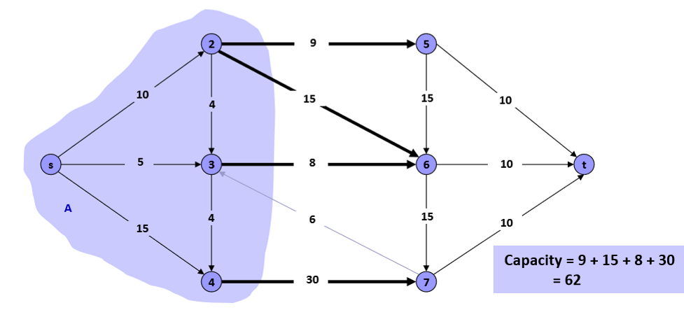

**Minimum s-t cut problem**. Find a $s$-$t$ cut of *minimum* capacity.
* minimum sum of edge weights leaving the cut

#### Flows

**Def**. A $s$-$t$ flow is a function $f$ that satisfies two laws:
* **capacity**. for each $e \in E$: $0 \le f(e) \le c(e)$
* **conservation**. for each $v \in V \setminus \{s, t\}$: $\sum_{e \text{ entering }v} f(e) = \sum_{e \text{ leaving }v} f(e)$

**TLDR**. Each edge's flow amount $\le$ its capacity, and flow is conserved throughout except at the source and sink.

**Def**. The *value* of a flow is the sum of the flow leaving $s$

$$v(f) = \sum_{e \text{ leaving } s} f(e)$$

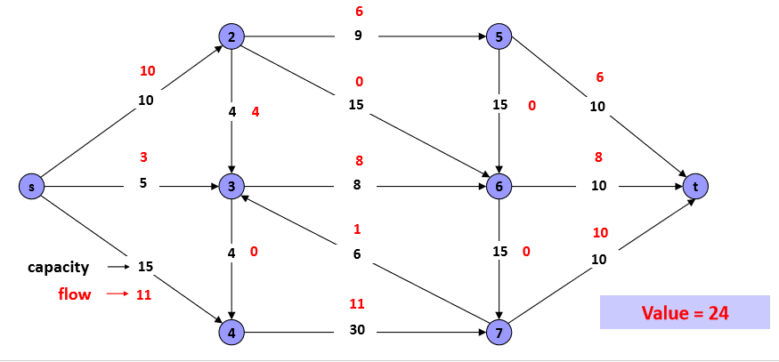

**Max flow problem**. Find a $s$-$t$ flow of *maximum* value.

#### Relating Flows and Cuts

**Flow value lemma**. The net flow sent across the cut is equal to the amount leaving s, i.e. the value of the flow.
* that is, $\sum_{e \text{ leaving } A} f(e) - \sum_{e \text{ entering } A} f(e) = v(f)$.

**Proof**
* $v(f) = \sum_{e \text{ leaving } s} f(e) - \sum_{e \text{ entering } s} f(e)$
    * no flow enters $s$ so that's $0$
* $= \sum_{v \text{ leaving } A }(\sum_{e \text{ leaving }v} f(e) - \sum_{e \text{ entering }v} f(e))$
    * add on a lot of $0$ terms by flow conservation law
    * if $e$ is within $A$, it contributes zero to the sum, so we only have to consider cut edges
* $= \sum_{e \text{ leaving } A } f(e) - \sum_{e \text{ entering } A} f(e)$


**Weak duality**. The value of the flow is **at most** the capacity of the cut
* i.e. $v(f) \le \text{cap}(A, B)$

**Proof**
* $v(f) = \sum_{e \text{ leaving }A} f(e) - \sum_{e \text{ entering }A} f(e)$
* $\le \sum_{e \text{ leaving } A} f(e)$
    * as all flow values are non-negative
* $\le \sum_{e \text{ leaving } A} c(e)$
    * as $f(e) \le c(e)$ by definition of flow
* $= \text{cap}(A, B)$

**Certificate of Optimality**. If $v(f) = \text{cap}(A, B)$, then $f$ is a max flow and $(A, B)$ is a min cut.

**Proof**
* For any flow $f'$, $v(f') \le \text{cap}(A, B) = v(f)$ by weak duality
* For any cut $(A', B')$: $\text{cap}(A', B') \ge v(f) = \text{cap}(A, B)$ by weak duality.

**To show a flow with value $k$ is maximal**:
1. find a flow with value $k$
2. find a $s$-$t$ cut with value $k$

This works because:
* if we found a cut of value $k$, by weak duality, *any flow* $\le k$. 
* **BUT** we found a flow of value $k$. 
* So that flow is maximal, and the cut is minimal.

### Max Flow Algorithm

**Problem**. Find a flow with maximum value given a flow network.

**Ford-Fulkerson Algorithm**:
* start with $f(e) = 0$ for each edge $e \in E$
* find any $s \to t$ path $P$ in the residual network $G_f$
* augment flow along path $P$
* repeat until you get stuck

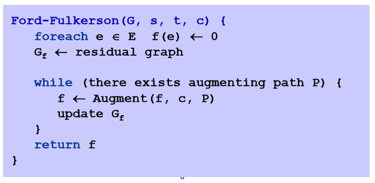

#### Residual Graph

**Def**. The **residual graph** of a flow network is a graph that includes *back edges* for flow that we've sent along that edge. This allows us to **undo** flow we've put into an edge.

**Residual Edges**.
* original edge = $e = (u,v) \in E$, flow $f(e)$, capacity $c(e)$.
* residual capacity:
$$c_f(e) = \begin{cases}c(e) - f(e) \text{ if } e \in E \\ f(e^R) \hspace{2.25em} \text{ if } e^R \in E \end{cases}$$

**Residual Graph**. Given flow $f$, we have graph $G_f = (V, E_f)$
* containing residual edges with positive residual capacity
* that is, $E_f  = \{e : f(e) < c(e)\} \cup \{e^R : f(e) > 0\}$
* so if flow is **maximum** or $0$, don't include both edges

**Key property**: $f'$ is a flow in $G_f \iff$ $f + f'$ is a flow in $G$.

#### Augmenting Paths

**Augmenting Paths**.
* **Def**. An *augmenting path* is a simple $s \to t$ path in the residual network $G_f$.
* **Def**. The *bottleneck capacity* of an augmenting path $P$ is the **minimum residual capacity** of any edge in $P$

**Augmenting Flow**. To augment flow along path $P$, subtract the minimum bottleneck flow $b$ from every edge along the path. Flow increases by $b$.

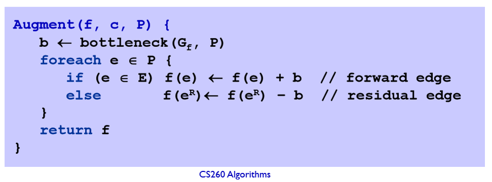

#### Max-Flow Min-Cut Theorem

**Augmenting path theorem**. Flow $f$ is a max flow $\text{iff}$ there are no augmenting paths.

**Max-flow min-cut theorem**. The value of the max flow is equal to the value of the min cut.

**Proof**. We prove both by showing the following are equivalent.
1. there exists a cut $(A, B)$ such that $v(f) = \text{cap}(A, B)$
2. flow $f$ is a max flow
3. there is no augmenting path relative to $f$

**(1) $\implies$ (2)**:
* this was the corollary to the weak duality lemma.

**(2) $\implies$ (3)**:
* we argue the contrapositive, $\neg$(3) $\implies$ $\neg$(2).
* let $f$ be a flow.
* if there exists an augmenting path, then we can improve $f$ by sending flow along the path.
    * use bottleneck capacity to increase $f$
* so $f$ is not a maximum flow.

**(3) $\implies$ (1)**

We show that **if** there is no augmenting path, **then** there exists a cut $(A,B)$ with $v(f) = \text{cap}(A, B)$

**Let**:
* $f$ be a flow with no augmenting paths.
* $A$ be the set of vertices *reachable* from $s$ in the residual graph

Edge $e = (u \in A, v \in B)$ has full capacity $f(e) = c(e)$.
* if not, $v$ is reachable from $s$
* because otherwise there is a forward edge.

Edge $e' = (u' \in B, v' \in A)$ has zero capacity $f(e') = 0$.
* if not, residual edge $(v', u')$ can be used to reach $u'$ from $s$
* because otherwise there is an reversal edge $v' \to u'$

Then, $v(f) = \sum_{e \text{ leaving }A}f(e) - \sum_{e \text{ leaving }A}f(e)$
* $= \sum_{e \text{ leaving }A}c(e) - 0$
    * as leaving edges have full capacity and entering edges have zero capacity
* $= \text{cap}(A, B)$

#### Running Time

**Assumption**. All capacities are integers between $1$ and $C$

**Invariant**. Every flow $f(e)$ and every residual capacity $c_f(e)$ remains an integer throughout the algorithm 
* we only add/subtract integers

**Theorem**. The algorithm terminates in at most $v(f*) \le nC$ iterations
* this is because if there are at most $n$ edges leaving $s$ and each has capacity at most $C$, total flow leaving $s$ is at most $nC$.

**Proof**
* Each augmentation increases the value by at least $1$
* **Corollary**. If $C = 1$, Ford-Fulkerson runs in $O(mn)$ time.

**Time Complexity**. Ford-Fulkerson runs in time $O(mnC)$

**Integrality theorem**. If all capacities are integers, there exists a max flow for which every flow value is an integer

**Proof**. Since algorithm terminates, theorem follows from invariant.

### Choosing Good Augmenting Paths

**Intuition**. Choosing a path with the highest bottleneck capacity would increase the flow by the maximum possible amount.
* maintain a scaling parameter $\Delta$
* Let $G_f(\Delta)$ be the subgraph of the residual graph consisting of only edges with capacity $\ge \Delta$.

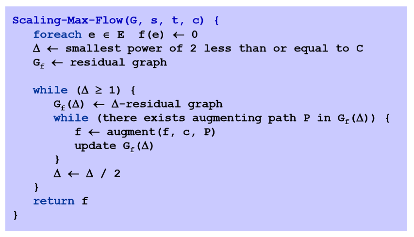

**Idea**:
* start with large value of $\Delta$
* improve $f$ as much as you can
* decrease $\Delta$
* eventually when $Delta = 1$, the $\Delta$-residual graph becomes the normal residual graph.

**Time Complexity**. The algorithm finds a max flow in $O(m \log C)$ augmentations. It can be implemented to run in $O(m^2 \log C)$ time.

### Bipartite Matching

**Def**. $M \subseteq E$ is a *matching* if each node appears in at most one edge in $M$.

**Def**. A *bipartite matching* is a matching in an undirected bipartite graph.
* we pair nodes from the **left** and **right** sides so that every node appears in **at most** one edge.

**Problem** (*maximum matching*). Find a maximum cardinality matching.

**Reduction**. We reduce bipartite matching to an instance of **maximum flow**.
* create a directed graph $G' = (L \cup R \cup \{s, t\}, E')$
* direct all edges from $L$ to $R$ and assign infinite capacity.
* add source $s$ and unit capacity edges from $s$ to each node in $L$
* add sink $t$ and unit capacity edges from each node in $R$ to $t$

**Algorithm**.
* construct flow network from bipartite graph
* run ford-fulkerson to find the flow
* construct the matching

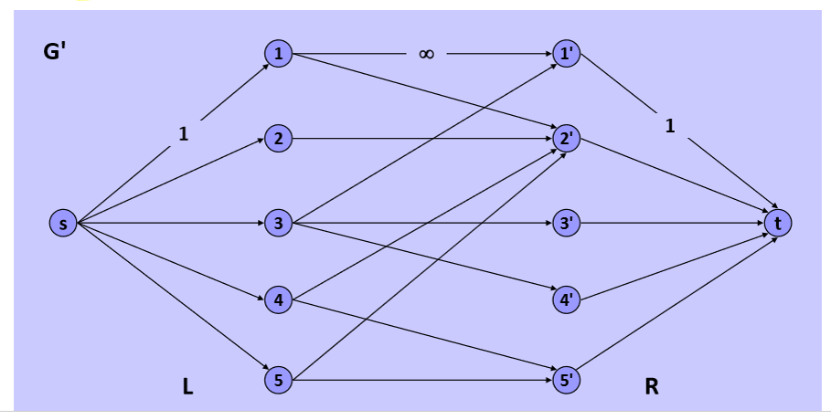
**Theorem**. Max cardinality matching in $G$ = value of max flow in $G'$

**Proof of correctness**.

First, show matching size $\le$ value of max flow
* given a maximum matching $M$ of cardinality $k$
* consider a flow $f$ that sends $1$ unit along each of the $k$ paths
* $f$ is a flow and has value $k$.
* so $v(f) \ge k$.

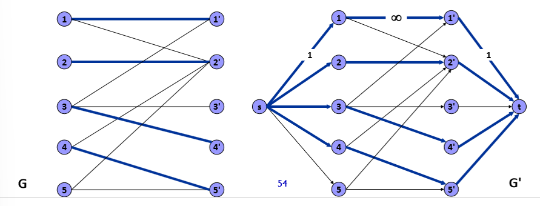

Next, show matching size $\ge$ max flow
* let $f$ be a max flow in $G'$ of value $k$
* integrality theorem $\implies$ $k$ is integral and can assume $f$ is $\{0, 1\}$
* consider $M$ = set of edges from $L$ to $R$ with $f(e) = 1$ (full capacity)
* each node in $L$ and $R$ participates in at most one edge in $M$
    * follows from the *flow conservation law*. we have $1$ entering and $1$ leaving so only one edge *can* be leaving/incoming.
* so $M$ is a matching of size $k$. consider cut $(L \cup \{s\}, R \cup \{t\})$.

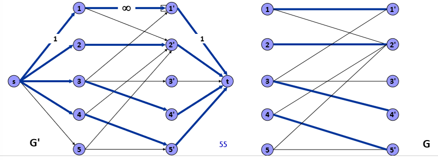

### Perfect Matching

**Def**. A matching $M \subseteq E$ is *perfect* if all nodes are matched.
* clearly we must have $|L| = |R|$

**Hall's Marriage Theorem**.
* Let $G = (L \cup R, E)$ be a bipartite graph with $|L| = |R|$.
* $G$ has a perfect matching $\text{iff}$ $|N(S)| \ge |S|$ for all subsets $S \subseteq L$.
* where $N(S)$ is the neighbours of the nodes in $S$

**Idea**. if we have a subset $S$ such that it has less neighbours than itself, we cannot possibly match everyone up.

**Proof**
* i don't know...


## 13. Bellman Ford

### Shortest Path Problem

**General shortest path problem**. Given a directed graph $G = (V,E)$ with edge weights $c_{vw}$, find shortest path from node $s$ to node $t$, but edge weights $c_{vw}$ **can be negative**.

**Fact**. Dijkstra can fail if negative edge costs: will miss cheap paths.
* re-weighting does not fix the algorithm.

**Observation**. If some path from $s$ to $t$ contains a *negative cost cycle*, there does **not** exist a shortest $s$-$t$ path; otherwise there exists a shortest $s$-$t$ path that is simple.

**Proof**: If there is a negative cost cycle, just loop forever.

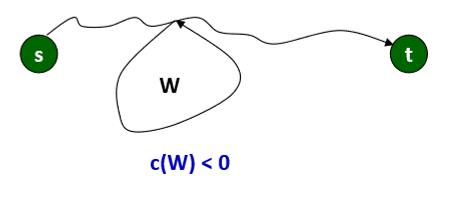

### Bellman Ford Algorithm

**Bellman Ford** is a dynamic programming algorithm that solves the shortest path problem.

**Define**. $OPT(i, v)$ = length of shortest $v$-$t$ path $P$ using at most $i$ edges.

**Bellman Equation**.
* Case 1: $P$ uses at most $i-1$ edges. Then $OPT(i,v) = OPT(i-1, v)$
* Case 2: $P$ uses exactly $i$ edges.
    * split $v$-$t$ path into edge $(v,w)$ and path $w$-$t$
    * calculate the sum using $OPT(i-1, w)$ and take the minimum over all choices.

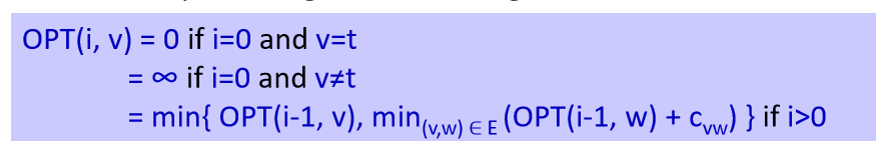

**Remark**. If the graph has no negative cycles, then $OPT(n-1, v)$ is the length of the shortest $v$-$t$ path.

**Algorithm**:

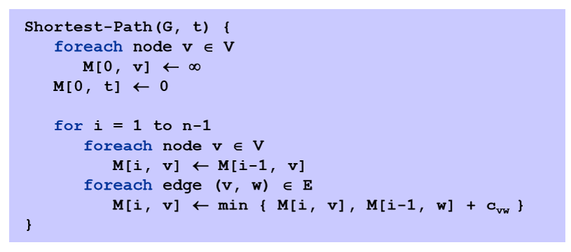

**Time complexity**. $\Theta(mn)$ time, $\Theta(n^2)$ space 
* table has $(n-1) \times n$ entries
* each iteration takes $O(m)$ time, since we check each edge once.

**Finding shortest paths**
* approach 1. build an extra `successor` table
* approach 2: compute optimal lengths $M[i, v]$ and consider only edges with $M[i, v] = M[i-1, v] + c_{vw}$.

**Bellman-Ford-Moore**:
* maintain only one array $M[v]$ = shortest $v$-$t$ path we have found so far (up to iteration $i$)
    * this is because each iteration only uses the previous one.
* only check edges $(v,w)$ if $M[w]$ changed in previous iteration

This improves:
* memory cost to $O(m+n)$
* practical running time (even though worst case doesn't change)

**Fact**. bellman ford is used in the distance vector protocol in network routing.

### Detecting Negative Cycles

**Idea**. we run *one* more iteration of bellman ford and check if we get a different result.
* if there are no negative cycles, the shortest path length *should not improve*.


**Lemma**. If $OPT(n, v) = OPT(n-1, v)$ for all $v$, then no negative cycles.
* no shortcuts found means paths have at most $n-1$ edges

**Lemma**. If $OPT(n, v) < OPT(n-1, v)$ for some node $v$, then any shortest path from $v$ to $t$ contains a negative cycle $W$

**Proof**
* since $OPT(n, v) < OPT(n-1, v)$ we know $P$ has exactly $n$ edges
* by pigeonhole principle, $P$ must contain a directed cycle $W$
* deleting $W$ yields a $v$-$t$ path with $< n$ edges
* therefore $W$ has a negative cost (because the shortest path length decreased)


**Theorem**. can detect negative cost cycle in $O(mn)$ time.
* add new node $t$ and  connect all nodes to $t$ with $0$-cost edge.
* check if $OPT(n,v) = OPT(n-1, v)$ for all nodes $v$
    * if yes, then no negative cycles
    * if no, extract cycle from shortest path from $v$ to $t$

