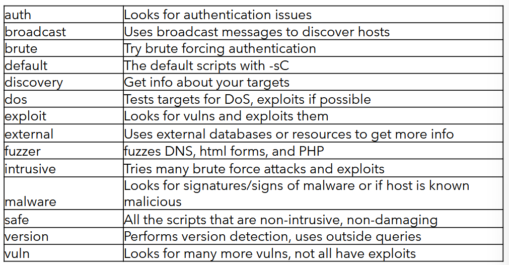
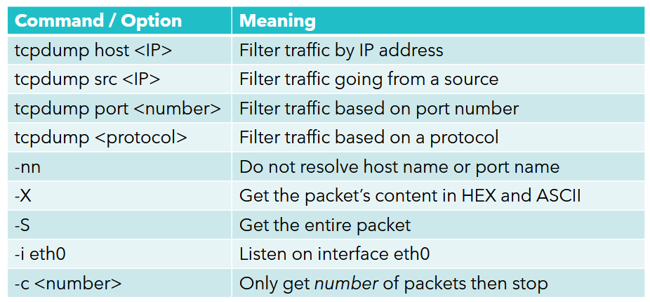
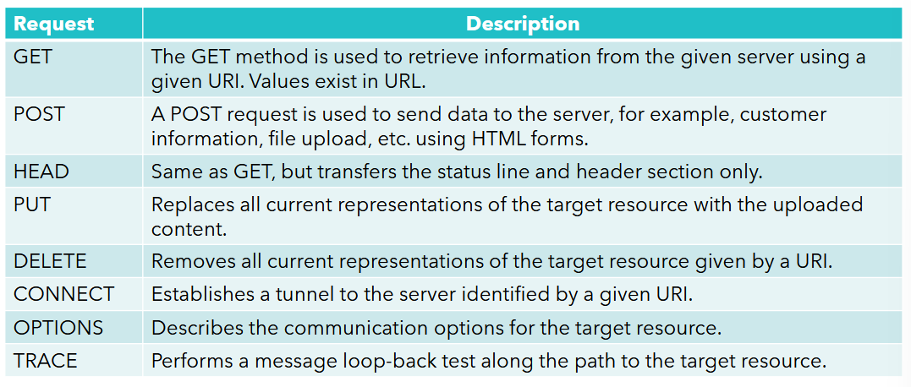
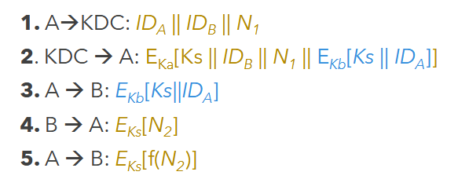
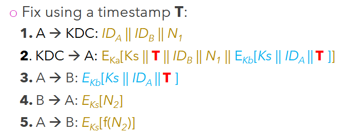
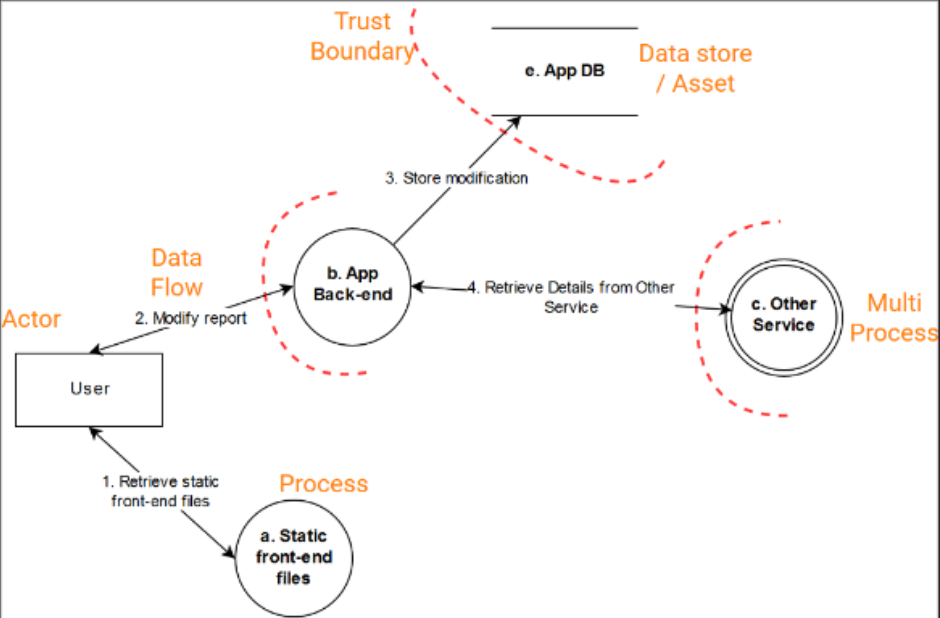
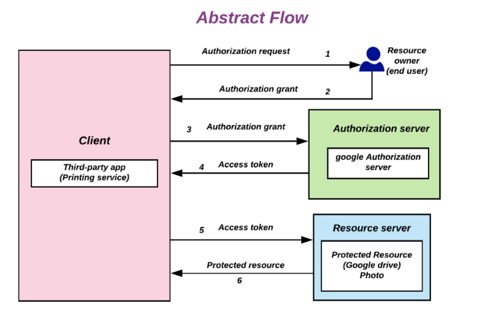
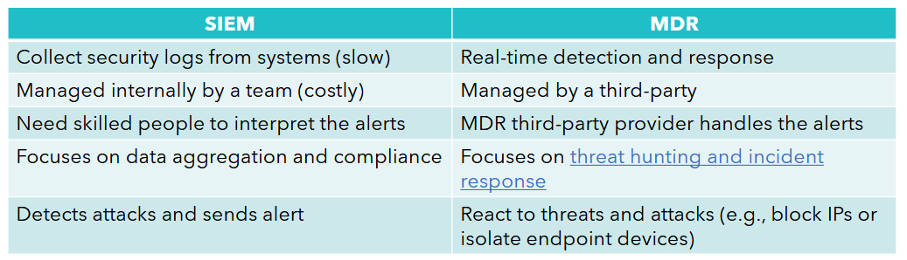

# CS263 Revision Notes

## 1. History of Cybersecurity

### Timeline of Cybersecurity

**1940s**
* the first digital computer was created during world war 2.
* no threats to computers yet

**1950s**
* **hacking telephones** - a precursor to hacking computers
* telephone protocols were hijacked so free long-distance calls can be made
* legal action was taken against offenders

**1960s**
* birth of ethical hacking
* companies realised the importance of developing security measures to keep hackers out

**1970s**
* start of the **advanced research projects agency network** (ARPANET), a precursor to the internet
* marked the birth of cyber security

**1980s**
* US department of defence published a book outlining basic requirements to assess effectiveness of computer security controls
* first commercial antiviruses were developed
* **Morris worm**
	* initially wrote the worm to assess the size of the internet
	* resulted in a denial-of-service attack
	* first person to be charged under the 1986 Computer Fraud and Abuse Act

**1990s**
* first **polymorphic viruses** - viruses that change over time, which avoids static program detection
* SSL protocol developed by Netscape in 1994 to keep client-server communication private

**21st century**
* **fileless attacks** used to compromise computer systems
* **zero-day attacks** that target computer systems and IoT devices
* launch of the first digital weapon, **Stuxnet**, used to target Iranian nuclear plants in 2010
* Apache Log4Shell vulnerability disclosed in 2021

### Standards and Regulations

**National Institute of Standards and Technologies** (NIST)
* founded in 1901, is a **non-regulatory** agency of the US Department of Commerce
* released the **cybersecurity framework**

**General Data Protection Regulation** (GDPR)
* regulation on data protection and privacy in the EU
* effective in 2018
* any organisation that is not GDPR compliant faces a significant liability

**Some other standards**:
* International Organisation for Standardisation (ISO)
* British Standards Institution (BSI) - produces technical standards on a wide range of products and services

**Some other regulations**
* Health Insurance Portability and Accountability Act (HIPAA) - act of congress that modernised the flow of healthcare information
* Sarbanes-Oxley Act - U.S. federal law for financial record keeping and reporting for corporations

## 2. Introduction to Cybersecurity

### Cybersecurity and Cybercrime

**Cybersecurity** is the art of protecting networks, devices, and data from unauthorised access or *criminal use*, and the practice of ensuring confidentiality, integrity, and availability of information.

**Cybercrimes** are crimes committed over the internet. Examples include:
* identity fraud - where personal information is stolen
* copyright infringement
* child pornography
* theft of financial data
* illegal gambling
* cyberespionage - illegally accessing a company/government system
* crypto-jacking - mining cryptocurrency using resources a hacker does not own
* ransomware attack

### Cybersecurity Principles

Cybersecurity security concerns should not be the concern of IT teams only - executives and board members need to know and understand them.

**Some principles are**:
* **CIA triad** - confidentiality, integrity, availability
* **Defensive measures**, applied to prevent, detect, and mitigate threats and security vulnerabilities
* **Testing**
	* defensive measures need to be regularly tested and scanned for vulnerabilities
	* test employees using phishing emails
* **Training**
	* involves training the IT team and employees
* **Response**
	* must have a ready-to-deploy a response plan in case of a security incident

### Cybersecurity threats 

**Threats to a data communication system**
* **destruction** of information/data
* **modification** or corruption of information
  **theft** or deletion of information
* **interruption** of services

Threats can be either be accidental, or intentional.

#### Cyber threats and exploits

* **Buffer overflow**
	* an exploit where a program attempts to put more data in a buffer than it can hold
	* causes writing outside the bounds of allocated memory
	* which can corrupt data, crash the program, or cause execution of malicious code

* **Man-in-the-middle attack**
	* an attacker intercepts and relays messages between two parties

* **Denial of service attack**
	* an attacker prevents authorised users from accessing a service

* **Zero-day exploit**
	* a vulnerability in a system or device that has been discovered by an attacker before the vendor is aware of it
	* "the vendor has *zero days* to fix the exploit"

* **Backdoor**
	* method of bypassing authentication and gaining unauthorised access to a system or application

* **Trojan horse**
	* a program with an overt purpose, and a malicious covert one

#### Protecting yourself against cybercrime

Common methods include
* keeping software updated - operating system, antivirus
* using strong passwords
* not clicking on suspicious links
* not opening files from an untrusted source
* using multi-factor authentication

### Cybercriminals

Common cybercriminal types include:

* **script kiddies**
	* they use existing software or scripts to launch attacks on computers and networks
	* do not necessarily understand in-depth how they work

* **scammers**
	* use deceptive schemes (e.g. emails, phone calls) to trick their victims
	* this exploits human trust - this is called **social engineering**

* **insider threats**
	* could be caused by an ex-employee who still has access to a company's computing system

* **hacktivists** (combination of hacking and activism)
	* they carry out cyberattacks based on a shared ideology
	* for example, political, religious, anarchist

* **cybercrime groups**
	* an organised group of attackers that work together anonymously to build tools for hacking

* **state actors**
	* an attacker backed by a government to forcefully target another government, individual, or organisation
	* often described as **advanced persistent threats** (APTs):
		* *advanced*: they have strong technical capabilities
		* *persistent*: may continue targeting an organisation over a long period of time
		* *threat*: they have the resources and intention to cause harm or steal information

### Examples of Cyber attacks

**FireEye, SolarWinds breaches**
* a major supply chain attack discovered in December 20
* attackers compromised a trusted software company, SolarWinds, and secretly inserted malicious code into updates for its product **Orion**
* attributed to the APT29 actor, a Russian hacker group known as CozyBear.
* APT29 has been refining its operational and behavioural **tactics, techniques, and procedures** (TTPs)

**Log4j**
* A major global cybersecurity incident in December 2021, caused by a critical vulnerability in a widely used Java logging library called **Apache Log4j**
* vulnerability named as **Log4Shell**
* was classified as a **remote code execution** vulnerability - allowed an attacker to potentially take control of a vulnerable server by making the server log a specially crafted piece of text

**Capita cyber incident**
* A major UK data breach and ransomware attack in March 2023
* some 470,000 personal records were accessed, such as names, NI numbers, and date of births

**PSNI data breach**
* Police Service of Northern Ireland responed to a routine Freedom of Information (FoI) request
* In it, it mistakenly shared an excel spreadsheet containing names and ranks of all serving police officers in Northern Ireland
* spreadsheet was visible for 2 hours before being removed

## 3. Cybersecurity Threats

### Adware

**Adware** is software that displays unwanted pop-up advertisements which can appear on your computer or mobile device. This can make your device not usable (targets *availability*)

Typically, a device is infected by adware through:
1. installation of free computer program that contains adware
2. vulnerability in a program that hackers exploit to insert adware into your system

Adware creators and distributing vendors make money from third parties via either:
1. **pay per click** (PPC) - they get paid each time you open an ad
2. **pay per view** (PPV) - they get paid each time an ad is shown to you
3. **pay per install** (PPI) - they get paid each time bundled software is installed on a device

### Phishing

**Phishing** is a type of *social engineering* attack, where an attacker **masquerades as a trusted entity**, tricking a victim into opening an email, instant message, or text message

Phishing has devastating effects:
* **stealing user data** - login credentials, credit card information
* **gaining privilege access to a system** - APT gaining foothold in corporate/government network
* **distributing malware** which leads to stealing sensitive information
* fraudsters carrying social engineering attacks
#### Types of phishing attacks

Phishing attack examples include:
1. **email phishing**
	* attacker registers a fake domain that mimics a genuine organisation, and sends generic emails to people
2. **spear phishing**
	* **targets a specific person**
	* attacker gathers information about the victim beforehand
3. **whaling**
	* targets senior executives, e.g. CEO or CFO
4. **smishing and vishing**
	* smishing (SMS phishing) involves sending text messages
	* vishing (voice call phishing) involves a phone conversation
5. **angler phishing**
	* targets social media users
6. **quishing** (QR code phishing)
	* cybercriminals try to trick victims into scanning a QR code that goes to a malicious website to steal sensitive information

#### Phishing as a service

**Phishing as a service** (PhaaS) is a criminal business model where one group builds and operates ready-made phishing tools, and other criminals (affiliates) pay to use them. 

* criminals don't need to know how to build fake websites - they buy access to a service that already does this

#### Phishing with AI

**Phishing with AI** - bad actors can use large language models to:
* remove spelling errors in an email
* clone a voice (pretending to be someone you know)
* launch more sophisticated spear phishing attacks

#### Mitigating phishing attacks

We can mitigate phishing attacks by:

* **implementing multi-factor authentication**
	* limits damage caused by a stolen password
	* **note:** not all MFA protects equally well against phishing

* **enforcing stricter password management policies**
	* damage is limited to fewer accounts

* **educate / train people**
	* prevents people from getting phished

* **build AI systems to detect phishing attacks in real-time**
	* allows phishing emails to be blocked before they reach people

### Botnet

A **botnet** is a network of hijacked computers. They are used to launch:
* distributed denial of service attacks (DDoS)
* phishing attacks
* crypto-jacking (unauthorised use of resources to mine cryptocurrency)

Malicious actors control a botnet via a **command and control** (C&C) server

**Methods to protect yourself against botnets**
* install an effective anti-virus tool
* avoid clicking on suspicious links
* choose strong passwords for smart devices

**An example** - In 2016, a DDos targeted Dyn, using 100,000 infected IoT devices such as security cameras, webcams, refrigerators, and other IoT devices in homes across the world. Malware infected devices with weak default passwords to establish the botnet.

### Ransomware

**Ransomware** is malware that infects your computer, blocks access to your devices, or encrypts your files. Cybercriminals then demand a payment (usually in cryptocurrency) to restore your access.

* hackers survey compromised network and determine valuable assets of an organisation
* they encrypt data and cause as much critical service disruption as possible

Ransomware mainly targets the **availability** pillar, but modern ransomware often target *confidentiality* too.

#### Ransomware 2.0

**Ransomware 2.0** - represents the next phase in the evolution of ransomware attacks
* they go beyond encrypting files
* often use advanced evasion tactics, adaptive behaviour, and exfiltrating sensitive data before encryption (i.e. double extortion)
* this makes backup alone not enough

**Data exfiltration** is the intentional, unauthorised transfer of sensitive information from a computer to an attacker's server.

#### Common trends in Ransomware 2.0

1. **double extortion**
	* stealing your data before encrypting it
2. **targeting cloud platforms**
3. **supply chain hijacking**
	* injecting malware into legitimate third-party applications or updates
4. **ransomware as a service** (RaaS)
	* RaaS is a criminal business model where developers make ransomware software, and sell it to criminals (affiliates) to carry out the ransomware attack.
5. **automation**
	* use automation tools to exploit vulnerabilities, deploy malware, and exfiltrate data
6. **increased collaboration**
	* hackers form partnerships to perform complex attacks

**Example** - The NCA took down the largest and most prolific ransomware-as-a-service platform, LockBit, in February 2024.

#### Detecting Ransomware

Traditional antiviruses haven't been efficient at detecting ransomware attacks
* often antivirus contains signatures for known ransomware files
* modern ransomware attackers modify the malware to change its signature, or use legitimate system tools instead

Better approaches include:
* **endpoint detection and response tools**
	* for example, anomaly-based intrusion detection systems (IDS)
* **application control program (in audit mode)**
	* *audit mode* means software is allowed to run, but a log is generated
	* for example, AppLocker or Windows Defender

#### Defending against Ransomware

* **mitigate social engineering**
	* e.g. training users to recognise suspicious emails and login requests

* **patch internet-accessible software**
	* fixing known vulnerabilities that attackers can use to get into the organisation remotely

* **use non-phishable MFA** and **hard to guess passwords**
	* methods such as *security keys* and *pass keys* are designed so they authenticate against the real website, which is resistant to phishing

* **learn how to spot rogue URLs**

### Info-stealers

**Info-stealers** are a form of malicious software used to steal sensitive information such as login credentials and credit card details.

A **stealer log** is a *series of data files* generated and compiled by info-stealers

**Info-stealers infect devices through:**
* phishing attacks
* infected websites
* malicious software downloads (e.g. pirated software)

**Some methods used by info-stealers include:**
* hooking browsers to steal credentials
* keylogging
* stealing passwords saved in the system and cookies

Modern info-stealers are part of *botnets*, where stealer logs are sent back to the C&C server.

They are often sold as **malware as a service** (MaaS), where developers develop malware and sell it to criminals to use. These are sold on underground hacking forums for a price.

#### Remediation and aftermath

**Remediation** - in case you suspect your machine is infected by an info-stealer, you must:
* perform a full scan using an anti-malware program
* change your passwords

Common dangers in the aftermath are:
* stolen credentials
* privacy violation
* identity theft
* stolen SSH account that can be used as a proxy to launch further attacks

### Summary - Malware and Threat Protection

Technical controls that can protect against malware include:
* **anti-virus software**
* **intrusion detection system** (IDS)
	* security system that watches activity and raises an alert when it detects something suspicious
* **intrusion prevention system** (IPS)
	* monitors activity, but can also automatically interfere with malicious activity
* **anti-malware software**

Administrative controls that can protect against malware include:
* security policies
* training people

## 4. Kali Linux and Metasploit

### Kali Linux

**Kali Linux** is an open-source, Debian-based Linux distribution that is used for penetration testing, security research, and computer forensics & reverse engineering.

It is an operating system that contains many security tools:
* **nmap**
	* network scanner to discover hosts and services on a computer network
* **john the ripper**
	* helps system administrators to find weak passwords using brute-force attacks
* **wireshark**
	* network packet analyser used for network troubleshooting
* **burpsuite**
	* graphical tool used for testing web applications
* **autopsy**
	* digital forensics analysis tool

**Digital forensics** is the field of extracting data from electronic evidence, e.g.  examining files and deleted data from a disk image.

#### GPG

**GPG** is a popular Linux tool that provides digital encryption and signing services using the OpenPGP standard. It comes pre-installed in Kali Linux.

#### Steghide

**Steganography** is the technique of hiding secret data within an ordinary (non-secret) file or message in order to avoid detection.

**STEGHIDE** is a tool in Kali Linux that allows us to hide a secret message (aka. **payload**) inside a medium (aka. **carrier**). The result (**stego-text**) is sent to the recipient who extracts it, using possibly a secret key.

### Metasploit Framework

The **metasploit framework** is a Ruby-based freely available penetration testing framework. It comes pre-installed with Kali Linux. It contains reusable components for:

* discovering services
* testing known vulnerabilities
* delivering payloads after exploitation
* gathering information from compromised test targets
* demonstrating security risks in controlled environments

Important directories in metasploit include:
* `data`: used to store binary files for exploits
* `documentation`: documentation for MSF
* `lib`: contains codebase for MSF
* `modules`: contains modules for exploits, auxiliary, post modules, payloads, encoders, and nops generators
* `scripts`: contains Meterpreter and other scripts

**Meterpreter** is a metasploit payload that provides an interactive session on a successfully exploited target in a testing environment. 

#### Metasploit Modules

Some common metasploit module types include:

* **exploit modules**
	* an *exploit* is code that takes advantage of a vulnerability in a target system.
	* an exploit module takes advantage of a weakness like failure to validate input correctly, a buffer overflow, backdoor, or weak authentication logic

* **payload modules**
	* a *payload* is the code or functionality delivered once exploitation succeeds
	* examples of payload capabilities include: opening a command shell, establishing a remote interactive session etc.

* **auxiliary modules**
	* *auxiliary* modules perform supporting security-testing tasks that don't include exploitation
	* examples include: port scanners, sniffers, fuzzers
	* a **fuzzer** sends unusual inputs to software to see if it crashes

* **post modules**
	* *post-exploitation* modules run after a system has been compromised
	* they may be used to identify further reachable machines, or demonstrate extent of the compromise

* **encoders**
	* *encoders* obfuscate payloads so they can reach a target without being detected
	* this changes the representation of a payload to avoid simple signature detection

* **NOP generators**
	* **NOP** stands for no operation
	* NOP generators keep the payload sizes across exploit attempts. they produce a series of random bytes to bypass standard IDS and IPS (by padding buffers)

* **evasion modules**
	* *evasion modules* attempt to generate files or behaviours to bypass defensive tools like antivirus software

#### Payload types

There are three types of payloads:
* **single payload** - standalone payloads that are self-contained
* **stager** - setup a network connection between attacker and victim before delivering the paylaod
* **stages** - payload components downloaded by the stagers modules

For example the staged payload `windows/x64/meterpreter/reverse_tcp` means:
* `windows` is the target operating system platform
* `x64` is the target processor architecture
* `meterpreter` is the interactive capability eventually being delivered
* `reverse_tcp` means we use a reverse TCP connection

## 5. Penetration Testing

### Penetration testing Phases

**Penetration testing** is the practice of testing a system *with permission* to find security weaknesses before a real attacker finds them.

The main phases of penetration testing are:
* **planning / preparation**
	* decide the scope, objectives, stakeholders, and rules
* **gather information** (reconnaissance)
	* learn about the target systems, networks, applications, users, and exposed services
* **scanning for vulnerabilities**
	* look for weaknesses such as outdated software, misconfigurations, exposed ports, weak authentications, and known CVEs
* **exploitation**
	* actually try to exploit the weakness, but only within the agreed rules
* **analyse and report**
	* explain what was found, how serious it is, what the impact is, and how to fix it
* **cleaning up**
	* clean up the compromised hosts without disturbing normal operations

### Preparation

Preparation is the most important phase, because it decides what you are allowed to do

#### Customer Interview

Before testing, you often ask the organisation questions to understand:
* **their main concerns**
	* e.g. availability of service, disclosure of sensitive information, subject to regulatory compliance
* **what assets to protect**
* **possible threats**
	* e.g. internal threats, or hacktivists

#### Scope

**Scope** determines what to include and what to exclude from testing. For example:
* *included*: the company's database server
* *excluded*: some IP addresses

**Everything must be written down**. A penetration testing agreement must be signed detailing the scope of testing. Do not test a target without prior authorisation. This is crucial, as without permission, even "just scanning" can be illegal or treated as an attack.

A proper penetration testing agreement should include:
* what system can be tested
* what techniques are allowed
* what times testing can happen
* who to contact if something breaks
* what is not allowed

#### Perimeter

The **perimeter** is the boundary of what you are testing. This matters, because in cloud systems, your client may not own every part of the infrastructure.

For enterprise or cloud services, pay attention to who owns the service, and if you need special permission prior to testing.

* **SaaS** (software as a service) - usually cannot pentest, because the customer does not own the underlying app
* **PaaS** (platform as a service) - application level testing may be allowed
* **IaaS** (infrastructure as a service) - testing your own VM/app may be allowed

Cloud providers like AWS, Azure, and Google Cloud often have rules or request processes for penetration testing.

#### Production/Test Environment

A company usually has a **test/development** environment and a **production** environment. 

* testing the *test environment* is safer as you are less likely to damage the business. however, testing only test systems can give misleading results as test environments may have weaker security, such as:
	* weak passwords
	* more admin accounts
	* debug features enabled
	* different firewall rules
	* fake or incomplete data

* production environment testing ideally would lead to more reliable results, but is riskier because it could affect real users.

* so safe tests may be done in production, but only with strict rules

#### Rules of Engagement

The **rules of engagement** (ROE) define exactly how the tests be conducted. They include:
* testing time/schedule
* stakeholders (points of contact)
* type of testing
* what systems/features are in scope
* what techniques are allowed

**White box / blue team style** testing is where the tester has internal knowledge. This is useful because it can find deeper issues more efficiently.

**Black box / red team style** testing is where the tester has little or no internal information. This mimics how an external attacker might see the system. This tests external exposure and real-world attack paths.

Targets of testing may include:
* web applications
* wireless networks
* physical security
* social engineering

#### NDA and liability waiver

A penetration tester may see very sensitive information, so usually a NDA is signed, which stands for **non-disclosure agreement**. An NDA says you must not share confidential information learned during the test.

A **liability waiver** must also be completed (by a lawyer), which covers you in case something goes wrong such as deleting data, or crashing an application.

Check if the customer is GDPR compliant (Europe), or if he must abide by the Computer Law and Abuse Act (USA).

### Testing and Legislation

**Testing must follow legislation**. Depending on the country you perform your test, you may need:
* to complete a liability waiver (written by lawyer)
* permission memo that authorises you to attack your targets
* (optional) insurance to cover you and your team

**Be aware of:**
* the law of where you are performing your testing
* the law of where your targets are located
* laws of the countries your packets may traverse

Some important legislations to know are:
* **compute fraud and abuse act (1986)**
	* US law that prohibits access to a computer without authorisation
* **general data protection regulation (GDPR), EU (2018)**
* **California consumer privacy act (CCPA), California (2018)**
* **digital millennium copyright act (1998)**
	* enforces copyright law in digital environments

**Personal data** (PD) and **personally identifiable information (PII)** must also be handled carefully.

* note that personal data, in context of GPDR, covers a much wider range of information than personally identifiable information

### Reporting

**The reporting phase** documents all findings. Testers highlight the vulnerabilities exploited, the business impact, data accessed, and actionable advice for the organisation to strengthen its defences.

It is advisable to take notes during the testing phases:
* following a methodology
* taking screenshots you may include in the report
* writing down all security findings as they happen

Automated analysis tools such as Nessus (a vulnerability scanner) includes a lot of data - do not include all of these in the report. The main report should explain the findings clearly.

#### PurpleSec Report Format

One report that the report can be written is the **PurpleSec** report format:
1. executive summary
2. test scope and method
3. internal phase
4. external phase
5. conclusions
6. references

#### SANS Institute Report Format

The **SANS institute** suggests the following format:

1. **page design** - header/footer, fonts to be used
2. **document control** - report title, version, authors, team members names
3. **report content** - table of contents, list of figures
4. **executive summary** - high level explanation for managers
5. **methodology** - how testing was done
6. **findings** - vulnerabilities, evidence, risk, impact
7. **recommendations** - how to fix or reduce the risks
8. **references** - sources used
9. **appendices** - raw data, code, extra details
10. **glossary** - definitions of technical terms

Each vulnerability should describe:
* **source** -where it comes from
* **impact** - what happens if exploited
* **likelihood** - how easy it is to find and exploit
* **root cause** - why the issue exists
* **risk evaluation** - how significant it is to the organisation
* **recommendation** - how to mitigate it

## 6. Reconnaissance and Enumeration

### Reconnaissance

**Reconnaissance** is the preliminary intelligence-gathering phase, where threat actors gather information about the target to determine a list of targets to be scanned, assessed, and exploited.

For example, before testing a company, you need to know:
* about their organisation
* what policies they have
* what networks and systems they have
* what people work there

The **target** and **scope** must be specified clearly and is often done in the preparation phase. This matters because penetration testing without scope can become illegal or unethical.

#### Enumeration

**Enumeration** is the process of systematically extracting detailed information from a target system. This turns information gained in reconnaissance into concrete lists of information that can be used. Examples include:

* assets and brands
* employees and executives
* names and emails
* public-facing services
* top-level domains like `.com`, `.gov`, `.edu`, `.uk`
* hosts and IP addresses
* geographic locations

This directly links to attacks, for example:
* executive names could support **whaling attacks**
* employee names and emails could support **spear phishing**
* exposed services could support technical attacks

#### Taking Notes

Taking notes is important during reconnaissance. For each point of interest, indicate the following:
* how did you find it?
* tools used?
* add details, such as screenshots

Tools such as Cherrytree (included in Kali Linux) can be used for note taking. In case of using cloud-based software (e.g. OneNote), do not automatically upload sensitive information. This is because pentest notes may contain IP addresses, credentials, vulnerabilities etc.

**Protect data included in your notes**. It is best to limit access, and keep the notes on a different server than the testing machine. These notes are useful to include in the final report.

### OSINT: Open-source intelligence

**Open source intelligence** is intelligence gathered and analysed from publicly available data. It **does not require** hacking into systems or using private credentials. 

We can look for information in sites, for example:
* **social media**
	* can reveal employee names, company events etc.
* **LinkedIn and job adverts**
	* job adverts can reveal internal technologies, for example a job advert asking for "Kubernetes" may suggest the company uses it internally
* **reddit, stack overflow, GitHub-style sources**
	* developers may accidentally reveal code snippets or architecture details
* newspapers
* public records
* domain registration data
* search engine results

OSINT **can go wrong** if people trust weak evidence too quickly. Hence, OSINT findings need verification - public information can be incomplete, misleading, outdated, or wrongly interpreted.

#### OSINT frameworks and tools

An **OSINT** framework is a collection of OSINT resources organised by category. It can be used to help you find tools for:
* domain names
* email addresses
* social media
* leaked credentials
* metadata
* public records
* IP addresses
* threat intelligence

Common tools that can support open source intelligence research include

* **shodan** - search engine for internet-connected devices
* **maltego** - visual relationship mapping
* **google dorking** - advanced google search queries
* **Have I Been Pwned** - checking whether emails appear in known breaches
* **email hippo** - email verification/intelligence
* **SpiderFoot** - automated OSINT collection
* **Recon-ng** - reconnaissance framework

One of the biggest challenges associated with OSINT is managing the staggering amount of public data. AI and machine learning tools can assist this, along with OSINT tools.

#### Assessing Risk

**Reconniassance** is like thinking like a detective to gather information about your target. For example,
* type of business, products
* physical location
* purpose, mission
* enumerate top level domains (TLDs)

After learning about your target, start thinking as an attacker - think about:
* which are potential targets
* which assets have the highest values
* how easy is it to exploit a vulnerability

**Risk** is proportional to both threat probability and vulnerability impact, meaning:
* a vulnerability is more serious if it is likely to be exploited
* it is also more serious if the impact is high

$$\text{risk} = \text{threat probability} \times \text{vulnerability impact}$$

### Passive Network Reconnaissance

**Passive reconnaissance** means collecting network information *without directly interacting heavily with the target's systems*. This involves collecting information about:
* domains
* sub-domains
* hosts
* applications

This is different to **active scanning**, which often involves running a port scan, or brute-forcing directories.

#### WHOIS

**WHOIS** is used to look up domain registration information. It can reveal things like:
* domain registrar
* creation date
* expiry date
* nameservers

This is used to understand the organisation's DNS infrastructure. For example, we can use the WHOIS search tool from **ARIN** (american registry for internet numbers).

ARIN is responsible for distribution of internet number resources in North America:
* IP addresses
* ASNs (automonous system numbers) - usd to identify a network on the internet, often belonging to an ISP, university, cloud provider, or large organisation

#### ICANN and RDAP

**ICANN** (international corporation for assigned names and numbers) is responsible for:
* IP address space allocation
* protocol parameter assignment
* DNS management
* root server system management functions

ICANN's lookup uses **RDAP**, which is a newer replacement for traditional WHOIS.

#### DNS Lookup - recap

The **domain name system** (DNS) translates human readable domain names into IP addresses. 
* The `nslookup` command is useful for getting information from the DNS server.
* Another tool that can do this is `dig` (domain information groper), can be used to query multiple DNS servers simultaneously

DNS servers contain two types of records:
* **A** record - maps a domain name directly to a IPv4 address
	* e.g. `example.com -> 192.168.16.212`
* **CNAME** record - maps one domain name to another domain name
	* e.g. `www.example.com -> example.com`

### Shodan

**Shodan** is the world's first search engine for *Internet-connected devices*. Unlike Google, which indexes webpages, Shodan indexes exposed services and devices, e.g. IoT devices, such as:
* webcams, routers, printers, thermostats etc.

For cybersecurity, Shodan can show:
* what devices are exposed to the internet
* which ports are open
* approximate geograhic location

Shodan uses **banner grabbing** - a technique used to gain information about a device on a network and the services running on its open ports.

A **banner** is information returned by a service when someone connects to it.

Common Shodan filters are:
* `city:`: find devices in a city
* `country:`: find devices in a country
* `port`: search by open port
* `version:` : search by version

This allows us to perform **geolocation** to search for devices within a specific geographic area.

**Hash searches**. Every banner contains a hash property, and empty banners always have hash value $0$. This allows us to remove them during searching, for example `port:23 !hash=0` means search for telnet sessions that have non-empty responses.

Finally, Shodan can be used to search for known vulnerable services, such as:
* apache 2.2.3
* vsftpd 2.3.4
* windows XP
* windows server 2008

## 7. OSINT Research Preparations

### OSINT Lifecycle

**OSINT** (open-source intelligence) refers to intelligence gathered and analysed from publicly available data. 

The open-source intelligence lifecycle goes as follows:
1. **planning and direction**
	* determine your investigative requirements and outline what questions you are attempting to answer
	* this matters because OSINT can become endless. without a clear goal, you just collect random data
2. **collection**
	* gather information relevant to your investigation
3. **processing and exploitation**
	* process raw data collected before and prepare it for analysis
	* for example, removing duplicates, sorting links, extracting email addresses etc.
4. **analysis and production**
	* analyse gathered information and produce a report
	* this step involves interpreting the information and explaining what they mean
5. **dissemination and integration**
	* this means producing the final output: a report, briefing, evidence package, or handover
	* this stage can trigger another OSINT cycle. for example, when writing the report, you may realise you need to collect more evidence.

### Preparing the environment

**Preparing the environment** is important because **OSINT is not risk-free**. Even though you are using public information, you can still expose yourself or damage your investigation.  Three major risks are:

* **malware risk** - you may visit suspicious websites or download unknown files which can contain malware
* **leaving traces** - visiting a target directly may record information about you, such as your IP address or browser
* **evidence integrity** - if findings might be used in court, you need to preserve them properly

#### Security measures to consider

Four main security measures that must be considered for OSINT:

* **malware protection**. basic protection includes:
	1. keeping your computer updated (OS and applications)
	2. installing a good antivirus, e.g. windows defender
	3. consider installing an anti-malware tool, such as malwarebytes
	4. login to your account as a user with limited privileges

* **minimise your footprint** - reducing how much information you reveal while investigating
	* use a VPN, dedicated browser, clearing cookies, logging out of personal accounts etc.
	* a VPN hides your IP address from the target website, but does not make you fully anonymous

* **browser selection** - use browsers that are open source and give stronger privacy protection
	* for example, using Firefox or Brave

* **use a virtual environment** - such as VMware, VirtualBox
	* VM is useful because it separates your OSINT environment from your main computer
	* minimises risk for malware to spread to your computer
	* allows you to take snapshots in an easy way
	* it allows you to export/import the VM to another computer

### Practical considerations

Some useful browser extensions include:
* **FireShot** - used for screenshots
* **uBlock Origin** - used for content filtering, blocking ads, trackers, and some malicious content
* **DownThemAll** - used to download media from a page
* **Search by Image** - used for reverse image search
* **Google translate** - useful for investigating foreign-language content

Other tools include:
* **Hunchly** - browser tool that automatically captures and documents webpages you visit. 
	* useful to create an audit trail for your investigation.
* **KeePassXC** -  a free, open-source password manager. 
	* Useful as OSINT analysts may create many accounts for research.
* **OBS** (open broadcaster software) 
	* can record your screen while you conduct OSINT research. Useful for creating an investigation record.
* **google cache** - retrieve web page from google web cache when site is offline
* **flagfox** - display webserver's physical location
* **link gopher** - extract links, sort and remove duplicates, and make it easy to copy/paste into other systems

**Free operating systems for OSINT**: Kali Linux, Buscador, OSINTUX, CSI Linux, Trace Labs OSINT VM

### Tips for starting OSINT research

**Log out of all accounts and websites**, including
* social media accounts
* professional networks
* shopping websites
* media websites
* mail services

This is because networks share information between them.

**Additional tips**
* beware of downloading software from unknown sources
* store your findings on a secure drive
* consider encrypting your backup files
* do not connect untrusted devices to your computer
* make sure tools you use comply with your organisation's policy
 
## 8. OSINT Information Gathering

### Surface, Deep, and Dark Web

The web is broadly separated into three areas

#### Surface Web

The normal web indexed by search engines like Google, Bing, DuckDuckGo, Yandex, and Baidu
* e.g. company websites, public social media pages, public GitHub repositories etc.
* **different search engines can reveal different results**
* e.g. Yandex: focus on Russia. Baidu: focus on China, etc.

#### Deep Web

The **deep web** contains information that is not indexed by standard search engines
* for example court records, criminal records, archives, business records etc.
* e.g. a company may not show much on Google, but you might find it in Opencorporates, Crunchbase, Dun & Bradstreet, or similar databases

#### Dark Web

The **dark web** requires a special web browser to search anonymously, such as **Tor**.
* Tor routes traffic through multiple nodes to provide anonymity, which is why it's called **onion routing**. 
* websites use `.onion` addresses
* safer to use a VPN while scanning the dark web
* consider using a portable OS that does not leave traces, like **Tails**, **Whonix**, or **Qubes**

On the dark web, payments are usually done in bitcoin. A bitcoin address does not directly say it belongs to a specific person, but every transaction is publicly recorded on the blockchain, allowing investigators to follow the movement of funds.

It can be possible to reveal the person's identity if they sent cryptocurrency to an exchange such as Coinbase, Binance, or KuCoin.

### Keeping records in OSINT analysis

When collecting OSINT, you should record everything systematically. This is because OSINT investigations can get messy quickly. For example, use a table:

| ID            | Task                                | Source                 | Date                     | URL                          | Key info        | Tags                                             | Screenshot             | Rating                     |
| :------------ | ----------------------------------- | ---------------------- | ------------------------ | ---------------------------- | --------------- | ------------------------------------------------ | ---------------------- | -------------------------- |
| Unique number | Describe what you are searching for | Where to find the info | Date of performed search | Link where we found the info | Summary of info | Keywords to filter the list for specific entries | Path of the screenshot | How reliable is the source |

### Other specific sources

#### DNS Records

**DNS** is useful because it tells you how a domain is connected to infrastructure. 
* check `viewdns.info` for DNS related tools
* **reverse IP lookup**: shows other websites hosted on the same server
	* this can reveal forgotten or less-secure systems
* **domain / IP WHOIS**: finds info about an IP address
	* useful to get data like the registrar, name servers etc.

#### Archive

**Archived websites** are useful because old pages may reveal information that has since been removed. E.g. if a company removed a sensitive PDF from its current website, it might still exist in an archive.

Tools such as **Wayback machine**, `achive.today`, and **cached pages** are useful for this.

#### Social Media

Social media can reveal a lot about individuals and organisations. For example, LinkedIn might reveal employees, job roles etc., while job adverts might reveal the company's technology stack. 

Use automated tools to keep a local copy of a person's profile. For privacy reasons, create an anonymous account to conduct your search.

#### Online Communities

**Online communities** such as Reddit, Stack Overflow, GitHub, and Ask Ubuntu are valuable because people often accidentally reveal technical details when asking for help.

GitHub is especially important because people often commit secrets by mistake, such as API keys, `.env` files etc.

#### Images

In an **image**, there are two types of information confainted:
1. **visual** - street number, buildings, people, landscape etc.
2. **metadata** in exchangeable image file format (exif)

Tools such as **ExifTool** can read this metadata. However, note that EXIF data can be removed easily using tools like Photoshop or Lightroom. So if metadata is missing, that does not mean the image is useless. You can still use visual clues.

#### Reverse Image Search

**Reverse image search** lets you upload an image and find similar or matching images online. Use search engines like Google Lens, Yandex, Bing, Baidu, or TinEye. 

TinEye is especially useful for finding where an image came from, if modified versions of the image exist.

**Note**. Google displays similar images to the one you uploaded, which may not be helpful for OSINT search as the images could be totally different from the original one.

### Google Dorking

**Google dorking** is a hacking technique that makes use of Google's advanced search queries to locate valuable data or hard-to-find content. Common search filters include:

| search filter                         | description                                    |
| :------------------------------------ | ---------------------------------------------- |
| `site:[domain]`                       | searches within \[domain\]                     |
| `link:[domain]`                       | displays what other sites link to \[domain\]   |
| `inurl:[string]`                      | searches the url for \[string\]                |
| `intitle:[title]`                     | searches pages with some or all matching words |
| `allintitle:[title]`                  | searches pages with all matching words         |
| `filetype:[extension]`                | searches for only that type of file            |
| `daterange:[Juliandate]-[Juliandate]` | searches for a date range.                     |
| `-word`                               | excludes a word                                |
| `OR`                                  | either term can appear                         |
| `*`                                   | wildcard for any word                          |
| `"exact phrase"`                      | search exact phrase                            |

**Julian date** format is `CYYDDD`, where:
* **C** means *century* - $0$ = 19, $1$ = 20
* **YY** means year
* **DDD** means day from $1$ to $365$

Examples include:
* `allintext: username filetype: log` searches log files containing the word `username`.
* `intitle:"index of" inurl:ftp`: searches for open directory listings related to FTP.
* `DB_USERNAME filetype:env`: searches for exposed `.env` files containing database usernames.

**Google dorking matters in cybersecurity** because it can reveal things organisations accidentally exposed, such as:
* log files, backup files, configuration files
* datbase credentials
* internal documents, PDFs with sensitive information
* source code snippets

**From a defender's perspective**, this is useful to search for your own organisation's exposed data and remove it before attackers find it. From a penetration tester's perspective, it is part of reconnaissance.

#### robots.txt

The `robots.txt` file in a web server tells search engine crawlers which paths they should or should not crawl.  It follows the **robots exclusion standard**, containing one or more rules.

However, it does not block users from visiting those paths. Attackers often inspect `robots.txt` specifically because it can reveal interesting hidden directories.

## 9. Scanning and Vulnerability Enumeration

### Scanning

**Scanning** is the first active step in penetration testing, falling somewhere in between passive reconnaissance and weaponization. The purpose of scanning is to **learn about a system's vulnerabilities** so we know how to break into it.

Besides determining IP addresses of active machine, scanning provides information such as:
* services
* ports
* subdomains
* firewalls
* OS and versions

**Vulnerability enumeration** is the next step after basic scanning, occurring after an attacker has established a connection with the target host. 

* For example, **scanning** might determine that port 22 is open and looks like openSSH, but **enumeration** determines the version, and any vulnerabilities.

* For example, `nmap 192.168.1.10` might show port 80 is open. But `nmap -sV 192.168.1.10` tries to identify the exact web server and version.

Some examples of information that an attacker might enumerate include:
* hostnames
* database user records
* IP routing tables
* DNS details
* SNMP information

**SNMP** stands for **Simple Network Management Protocol** - standard networking protocol used to manage and configure connected devices on an IP network.

#### Network scanning types

**Host discovery**
* find which machines are active on a network
* can use `nmap` to send ICMP echo request & timestamp requests, and TCP packets to common ports like 80 and 443
* for example, the `-sn` option means "ping scan" or "host discovery only" - it does not do a full port scan.

```bash
nmap -sn 192.168.1.0/24
```

**Network tracing**
* using tools like `traceroute` to understand the network topology
* this shows the routers/hops between source and destination

**Port scanning**
* determine listening TCP or UDP ports on a target machine

**Version scanning and OS fingerprinting**
* more detailed host scan to determine what service, version, or OS is running
* for example, `-sV` does service/version detection, and `-O` does OS fingerprinting.

```bash
nmap -sV -O 192.168.1.10
```

**Vulnerability enumeration scan**
* scans a target for known weaknesses, sometimes with credentials
* a vulnerability scanner might log in with authorised credentials and check for insecure configurations or weak permissions
* **more powerful as they can inspect the system from the inside**

#### IP and Subnet Scans

**Round-robin DNS** is a technique for load balancing that uses redundant hosts.
* one IP is mapped to one domain
* however one domain can be mapped to multiple IPs -> load balancing

This makes a naïve scan to scan a subnet inefficient, as there are $2^{16} = 65536$ ports on each machine, and with a `/20` subnet mask, there are $2^{12}-2 = 4096$ hosts.

**Methods to mitigate this:**

* **scan a subset of hosts or ports**
	*  `nmap` automatically scans the top 1000 popular ports
 * **increase the speed of scanning**
 * **limit UDP packets**
	* TCP is connection-oriented, which has a handshake, so open/closed ports usually produce clearer responses
	*  UDP ports go unanswered because UDP is a connectionless protocol, so `nmap` often has to wait for a timeout
* **change configuration in target environment to speed up scan**
	* disable firewall or change configurations to provide responses to blocked ports
* **use tools like `masscan`**
	* stateless, doesn't wait for responses
	* can send up to 10 million packets per second

#### Scanning permissions

**Always make sure you have the authorisation to scan your target**. Scanning can:
* get your IP blocked
* trigger firewall or IDs alerts - `-T2` timing on `nmap` can be detected by some IDSs
* look like hostile behaviour
* leak information to unexpected systems if using decoys carelessly

Most importantly:
* provide a list of tools for your scans - `nmap`, `nikto`, `OpenVAS`
* provide the source IPs you run your scans from
* use `-D` option in `nmap` to add decoy addresses - helps obfuscate your IP

However this may be an issue, as the target may send replies to these unknown IP addresses, which some of them may belong to **some unrelated third-party organisation**.

#### Port scanning - TCP/UDP

**Nmap can scan TCP and UDP ports**
* UDP scan is using the `-sU` option
* TCP with the `-sS` option (SYN-only), which is a stealthier half-open TCP scan

For a TCP SYN scan, we can get different responses:

| probe | response         | meaning                      |
| :---- | ---------------- | ---------------------------- |
| SYN   | SYN-ACK          | port is open                 |
| SYN   | RST_ACK          | port is closed               |
| SYN   | ICMP unreachable | filtered/blocked             |
| SYN   | no response      | filtered/blocked, or dropped |

### Scanning Tools

#### Netcat

**Netcat** is a networking utility which reads/writes data across network connections using the TCP/IP protocol. It allows you to:
* connect to a port
* listen on a port
* send and receive raw text
* transfer files
* debug network services

Netcat comes with Kali Linux (`nc`) and is available on Windows as `ncat`.

For example, to send a file to a listening machine, the receiver can run this command:

```bash
nc -lvp 4444 > received.txt
```

And the sender can run this command:

```bash
nc 192.168.1.10 4444 < sourceFile.txt
```

#### Nmap

**Nmap** (network mapper) is a free and open-source utility for network discovery and security auditing. By default, it scans the top 1000 common ports. It runs on all major operating systems and was designed to rapidly scan large networks. The Nmap suite includes:

* `ncat`: data transer and debugging tool
* `ndiff`: utility for comparing scan results
* `nping`: packet generation and response analysis tool

##### Nmap Basics

To scan common ports for the IP address `192.168.1.10`, we can run:

```bash
nmap 192.168.1.10
```

To scan specific ports (21, 25), we can run:

```bash
nmap -p 21,25 192.168.1.10
```

To scan a range and selected ports, we can run:

```bash
nmap -p 1-32,80,50-55,443 192.168.1.10
```

To scan via a TCP connect, we can use `-sT`, which completes a full TCP three-way handshake. Note that this is more likely to be logged by the host instead of `-sS` which only does the SYN scan.

```bash
nmap -sT 192.168.1.10
```

##### Nmap Firewall Detection

We can also detect **firewalls** by sending packets with corrupted checksums. A real sum should be able to calculate the checksum and silently drop the packet, while a firewall just responds with **IMCP Unreachable** or **RESET**.

```bash
nmap --badsum 192.168.1.10
```

##### Nmap Scripting Engine

The **Nmap Scripting Engine** (NSE) lets `nmap` run scripts for more advanced checks. We can use the option `-A` to perform version scanning, OS fingerprinting, and NSE. 

NSE scripts are classified into several categories, which are shown below:



**Important**: safe/default scripts are usually suitable for general scanning. Intrusive, brute, dos, and exploit scripts can be risky and need explicit permission.

To run a safe scan, we use the `-sC` option which runs the default scripts:

```bash
nmap -sC -sV 192.168.1.10
```

#### tcpdump

**tcpdump** is a free data-network packet analyser that runs under a command line interface. It allows a user to see network packets passing through an interface. 

**Useful commands include:**



#### traceroute

**traceroute** is a network troubleshooting command that enables you to know about network devices between one point to another. It is available in Linux under `traceroute` and `tracert` in Windows.

This uses the **ICMP** protocol, which is used for diagnostic and error messages in IP networks.

Traceroute works by manipulating the TTL counter (time to live). TTL is decreased by 1 at each router hop. When it reaches 0, the router drops the packet and sends back an **ICMP Time Exceeded** Message.

Examples of ICMP-related messages:
* **destination unreachable** - user host or its gateways can't find a path to reach the destination
	* usually because of lack of suitable routes from user to destination
* **request timeout** - is not an ICMP control message
	* generated after some time, when no answer was received, possibly due to congestion or unresponsive host
* **time exceeded** - related to distance, not time
	* happens when TTL reaches 0

### Automated network scanners

An **automated vulnerability scanner** is a tool that scans systems for known weaknesses. They can be used for blue team assessments, security audits, or vulnerability management, but **do not replace a proper penetration test**.

**Advantages:**
* can scan many systems quickly
* generates findings and summaries
* can log in and check internal configuration

**Disadvantages**:
* cannot reason like a human pentester
* may report issues that are not real
* vulnerability databases must stay current
* can generate a lot of traffic

**Examples include**:

* **Nessus** - best commercial vulnerability scanner available today. It became proprietary in 2005.
	* scans can be carried out using preconfigured policies
	* one can automatically run a scan with every plugin update

* **OpenVAS** - scanner component of Greenbone Vulnerability Manager. 
	* open source
	* includes authenticated/unauthenticated testing, internet/industrial protocols, performance tuning for large scans
	* **detects less vulnerabilities than Nessus** and has a higher false positive rate

#### Wireshark

**Wireshark** is a graphical network analyser that allows you to inspect packets in detail across layers. 

Some of its features include:
* deep inspection of hundreds of protocols
* capture files compressed with `gzip` can be decompressed on the fly
* decryption support for many protocols
* colouring rules applied to the packet list for quick, intuitive analysis

## 10. Exploitation

### Exploits

An **exploit** is code or sequence of commands that takes advantages of a software vulnerability or security flaw in applications, systems, and networks.

Exploits target the CIA triad:
* **confidentiality** - sniffing networks, cracking/guessing weak passwords
* **integrity** - illegally modifying a file or installing a backdoor
* **availability** - launch a DoS attack to make a website unavailable, or slow down a network

Exploits have multiple purposes:
* **can verify the vulnerabilities you discovered**
* **can lead to pivoting**
	* using one compromised system as a stepping stone to reach other systems)
* **can lead to the discovery of other vulnerabilities**
* **post-exploitation can demonstrate the business risk to clients**
	* what an attacker may do to their system
	* how a vulnerability can damage their assets
	* propose mitigation strategies based on risk assessment

There are always risks associated with exploitation, e.g. crashing the system or making it unusable. Some actions may have severe impacts to a system.

Therefore,
* **only exploit authorised targets**, and
* **use an agreed upon procedure / set of tools**

Make sure to check the *rules of engagement* before attempting any exploit.

Consider:
* **the location of the vulnerable system or application**
	* what impact does it have for an organisation?
* if a system is known to be vulnerable, and if there is a method to exploit it
* if you know for sure that an exploitation will not lead to discovering other vulnerabilities, then focus your effort on finding other vulnerabilities - **task prioritisation**

### Types of Exploits

Exploits can be classified into two main categories:
1. **known** - exploits that have been investigated and identified by cybersecurity experts
	* patches are available to fight these exploits
	* often have a **CVE identifier** - a public entry for a known security flaw
	* to defend against these, keep your system and application updated to mitigate known exploits
2. **unknown** - also known as *zero-day exploits*
	* targets a vulnerability that is not publicly know or not yet patched
	* defenders had *zero days* to patch it once it becomes known
	* there is little you can do to prevent unknown exploits from targeting your machine

#### Common exploit targets

Common exploit targets include:

* **browsers and plugins** -  firefox, chrome, IE, safari
	* attractive because users use browsers all the time
* **office applications** - word, powerpoint, excel
	* documents can contain malicious content or abuse document features
* **runtime environments** - activeX, flash, silverlight
	* used to be heavily targeted because they were widely installed and often vulnerable
* **hardware / IoT / routers**
	* common targets because they are poorly patched or may have weak default passwords or hidden backdoors
* **network-level flaws** - man-in-the-middle attack, flawed authentication mechanism

#### Exploit Kits

An **exploit kit** is a collection of exploits bundled together, often delivered through a web page. They are used to deliver a *suitable payload* depending on the user's browser, plugins, and system details. 

They often include **shellcode**, a small malware payload that can be used to download additional malware. Historically, it often spawned a shell, but modern shellcode often performs other tasks.

Examples of exploit kits include:
* **angler** - used zero-day exploits in Flash, Java, Silverlight
* **rig** - used to distribute ransomware and banking trojans
* **fallout** - scanned browsers for vulnerabilities and used redirects / fake advertising pages

Exploit kits are often connected to **malvertising**, where malicious code is delivered through online advertisements.

#### Zero-day protection

Some methods to protect your organisation against zero-day exploits include:
* **having monitoring in place**
	* look for suspicious behaviour like unusual outbound connections, strange file modifications, privilege escalation attempts etc.
	* partner with white hat hacker to stress-test the system of an organisation
* **employ patch management**
	* reduces exposure to these attacks but doesn't prevent them
* **implement next generation anti-virus solutions (NGAV**
	* detects malicious behaviour rather than only known malware files
	* e.g. flagging suspicious PowerShell behaviour, process injection etc.
	* cloud based (easy to monitor and maintain)
	* fast to deploy (minutes instead of months)

### Shells

After exploitation, attackers often want a **shell**. It gives *command-line control* over a machine, e.g. `/bin/sh` or `/bin/bash` on Linux, or `cmd.exe` or PowerShell on Windows.

It is the most common type of payload. The two main types of shells are **bind shell** and **reverse shell**.

#### Bind Shell

In a **bind shell**, the victim machine opens a listening port. The attacker connects to that port and receives a shell.  The key idea is: victim listens and attacker connects in.

They are often less reliable because firewalls usually block inbound connections, which prevents the attacker from connecting.

#### Reverse Shell

In a **reverse shell**, the attacker listens, and the victim connects back to the attacker with a shell, which gives the attacker an interactive shell prompt.

This often works better because outbound traffic is commonly allowed. Many networks allow internal machines to make outbound connections to the internet, which may bypass inbound firewall restrictions.

### Web Shells

**Web shells** are malicious scripts placed on a web server to give remote access through the application. They often act as a **back door** and are usually part of the *post-exploitation* phase.

Threat actors first penetrate a system or network by using common web application vulnerabilities (e.g. XSS, SQLi), and then install a web shell to maintain persistent access.

Web shells are often used for:
* **exfiltrating sensitive information** - steal credentials
* **upload more malware** - upload additional tools
* **website defacement** - change the website's content

#### Stages of a Web Shell

The main stages of a web shell are:
1. **persistent remote access**
	* provide a backdoor, using techniques like password authentication to ensure only specific attackers can access them
	* identify and block search engines from blacklisting the website
2. **privilege escalation**
	* attempt to escalate privileges by exploiting local vulnerabilities to acquire root priveleges
3. **pivoting and launching attacks**
	* attackers stay low to avoid detection, and sniff network traffic enumerate live hosts, firewalls, or routers.
	* pivot through multiple systems to make it impossible to trace an attack back to its source
4. **botnets**
	* web shells can be used to connect servers to a botnet
	* which is used to launch DDoS attacks

#### Protection

We can protect against web shells by:
* **monitoring integrity of files** - using File Integrity Monitoring (FIM) solutions to block file changes on web-accessible directories
* **web application permissions** - applying the *least privilege principle*
* **intrusion prevention systems** (IPS) 
* **web application firewalls** - filter/block/monitor HTTP traffic
* **network segmentation** - split the network to prevent web shell propagation

### Antivirus Evasion

Antiviruses detect malware based on two things:
1. **signature** - based on a pattern
2. **heuristic or behavioural** - detect characteristics of a malware during execution
	* helps detect a variant or new version of malware, even in absence of the latest virus updated tables.

Below are some antivirus evasion techniques:
* **disable the antivirus**
* **polymorphism** - add extra code to change the signature, fooling signature-based antiviruses
* **encoding** - change data into a new format, e.g. Base64, XOR
* **encrypted malware**
* **write directly to memory**
	* we can use `meterpreter` to avoid writing to a file system
	* fileless malware - doesn't store anything on the target machine

## 11. Web Application Testing Standards

### Web Application Testing

A *normal penetration test* often focuses on a whole network or system: testing for flaws in a system, trying to identify vulnerable services, and attempting exploits against applications.

**Web application testing** focuses on websites, web services, APIs, and sometimes mobile apps that communicate with a backend. It is effectively penetration testing for web applications only.

The aim is to identify loopholes and evaluate the efficacy of overall application security posture of an organisation. For example, for a university website where students can log in and view grades, a web app tester might check:

* does the login page resist brute force attacks?
* can one student change the URL/request body to view another student's grades?
* does the site properly validate input?
* can malicious JavaScript be injected into a comment box?
* can SQL queries be manipulated through user input?

**Technical debt** is the problems that build up because software was designed in a way that saves time now but creates more work later. For example, skipping testing to meet a deadline, can cause technical debt.

**Key Idea** - security testing should occur *during* the software development life cycle, not only at the end.

### Standards

Three standards for web application testing are:
1. **OWASP testing guide**
2. **NIST SP 800-115**
3. **PTES - penetration testing execution standard**

#### OWASP testing guide

**OWASP** stands for **Open Web Application Security Project**. It is one of the most important organisations in web application security. The testing guide describes four major testing techniques:

1. **Manual inspections and reviews**
	* humans reviewing the wider security process
	* include manual review of documentation, security requirements, secure coding policies, and architectural designs
	* **powerful techniques** to test the software life-cycle policy and ensure there is an adequate policy set in place

2. **Threat modelling**
	* **Threat modelling** is the technique of thinking systematically about:
		* what we are trying to protect
		* who might attack it, and how
		* what could go wrong? what are the most important risks?
	* It can be seen as a risk assessment for applications.
	* These should be created as early as possible. Tools to create threat models include **OWASP Threat Dragon** and **Microsoft Threat Modelling Tool**

3. **Source code review**
	* This means inspecting the source code manually or with support from static analysis tools
	* Some vulnerabilities are hard to find using black-box testing alone, e.g. bad cryptographic implementation, weak access control checks, hardcoded secrets etc.

4. **Penetration testing**
	* also known as black box testing or ethical hacking
	* tester behaves as an attacker and tries to find and exploit vulnerabilities

##### OWASP web application security testing methodology

OWASP web application testing is based off the **black box approach** - the attacker knows nothing about the application.

Testing is divided into two phases:
1. **passive mode** - the tester tries to understand the application without actively attacking it
	* might use proxy like Burp Suite or ZAP to observe HTTP requests/responses
2. **active mode** - tester interacts with application in unexpected ways
	* for example, injecting SQL payloads, or testing XSS payloads

#### NIST SP 800-115

**NIST SP 800-115** is a technical guide for information security testing and assessment. It assists organisations in planning/conducting security tests and examinations, analysing findings, and developing mitigation strategies.

The guide provides recommendations that can be used for:
* finding vulnerabilities in a system or network
* verifying compliance with a policy

Compared with OWASP, NIST SP 800-115 is broader. It is about technical security testing in general, including systems, networks, and applications.

#### Penetration Testing Execution Standard

The **PTES** gives a structured penetration testing process. This is comprised of seven stages:
1. **pre-engagement instructions** (scope, applications, tools)
2. **intelligence gathering** (or reconnaissance)
3. **threat modelling** (determining valuable assets and likely attack paths)
4. **vulnerability analysis** (scanning and enumeration)
5. **exploitation**
6. **post exploitation** (determining value of compromised machine and maintaining access to it)
7. **reporting**

### Methodologies

There are many ways to perform web application penetration testing. We can have a 3-step process, or a 5-step process for example.

#### Three-step process

1. **planning** - define scope and rules of engagement
2. **execution** - information gathering, threat modelling, vulnerability analysis, exploitation
3. **post-execution** - write the report

#### Five-step process

1. **pre-engagement activity** - define scope and assets
2. **intelligence gathering** - passive and active reconnaissance
	* **passive** - e.g. google dorking, wayback machine
	* **active** - `nmap`, Shodan network scanner, checking HTTP status codes
3. **vulnerability scanning and analysis**
	* scan target application for vulnerabilities to identify security loopholes
	* e.g. using ZAP, Burp suite pro, Acunetix
4. **exploitation**
	* e.g. trying SQL injection, brute force attack, uploading malicious scripts to get command-line access
5. **reporting, remediation and support**
	* report the risks and advise how to fix them
	* categorise the exploits by criticality
	* both IT team and upper management should be able to understand the report
	* **note**. many pentesting companies offer a re-test as part of their contract to check if the risks found have been properly mitigated

### Tools for web application testing

Some tools for web application testing include:

* **w3af** - web application attack and auditing framework
* **SQLMap** - automated tool that detects and exploits SQL injection flaws, and allows to take over database servers
* **THC Hydra** - the world's first parallelised network logon cracker, commonly used to perform brute-force attacks
* **Nessus** - automated vulnerability scanner that uses policies
* **ZAP** - an open source web application scanner, acting as a man-in-the-middle proxy
	* stands for OWASP Zed Attack Proxy
	* intercepts and inspects messages sent between browser and web application
* **Burp Suite** - an open source web application pentesting tool that has a free and pro version
	* proxy-based tool that intercepts communication sent between browser and web app
	* used for tasks like collecting HTTP traffic, testing feature-rich web apps, or testing APIs

#### Main tools in Burp Suite

* **proxy** - lets you intercept, view, and modify all requests and responses passing between browser and destination web servers

* **repeater** - manual manipulating and reissuing of individual HTTP requests and analysing the application's responses

* **intruder** - automate customised attacks against web applications

* **target** - contains the *site map*, with detailed info about the target application
	* define which targets are in scope
	* and also drives process of testing for vulnerabilities

* **logger** - tool for recording network activity (records HTTP traffic that Burp Suite generates)

* **sequencer** - analyse quality of randomness in a sample of tokens
	* matters because web apps use tokens for session keys, API authentication etc.
	* tokens must be unpredictable to prevent attackers from guessing valid tokens

* **comparer** - perform comparison between two items of data
	* e.g. compare responses with different lengths than the base response

* **decoder** - transform encoded data into its canonical form, or transform raw data into various encoded and hashed forms
	* handles formats like HTML, URL, hex, binary, Base64, hashed forms

## 12. Web Application Testing Methods

### Web Application Testing

Before performing any web application penetration testing, the following should be considered:
* **methodology** - e.g. OWASP, PTES, three stage, five stage?
* **purpose** - testing for a client, company, or bug bounty program?
* **target** - web application, backend, or API?
* **test type** - one time test, or continuous testing over time?

Three useful testing frameworks or methodologies are:
* **OWASP** - main one for web application security.
	* includes the OWASP Top 10, Web Security Testing Guide etc.
* **WASC-TC** - Web application security consortium threat classification. 
	* This is about classifying and organising threats to web applications
* **PTES** - Penetration testing execution standard
	* provides a penetration-testing process with seven stages (discussed earlier)

### HTTP Methods

**HTTP Methods** describe what kind of action the client wants the server to perform.

From a testing perspective, these are important as sometimes dangerous methods like `PUT`, `DELETE`, or `TRACE` may be enabled accidentally. E.g. if `PUT` is enabled on a poorly configured server, an attacker might be able to upload files.




Each browser interacts with websites with its `user-agent` string. This identifiers your browser and provides certain system details to servers. Using this information, websites can adapt and tailor their content to show correctly on different OS's and browsers.

**From a security testing perspective, this is important as**
* you can modify them to see if the server behaves differently
* can leak information about the client
* can be logged by the server and used for fingerprinting#

### Basic Testing Methods

**Testing methods** for web applications can be divided into three categories: *command line tools*, *browser plugins and developer tools*, and *proxies*.

#### Command Line

A very common command-line tool is **cURL**, which is used to send HTTP requests from the terminal. This is used when you do not have a GUI on a Linux machine. It supports over 25 protocols including HTTP, HTTPS, and FTP.

We can retrieve the page content using:

```bash
curl https://example.com
```

A get request can be sent with:

```bash
curl -G https://example.com
```

We can check which HTTP methods the server supports using:

```bash
curl -X OPTIONS https://example.com
```

#### Browser Plugins

Two useful browser plugins are:
* **Bug magnet** - exploratory testing assistant for Firefox and Chrome.
	* works on input fields and text areas
	* allows for value injection in JavaScript
* **FoxyProxy** - automatically switch connections between proxies according to URL rules
	* useful when working with tools like Burp Suite or OWASP ZAP
	* as apposed to manually switching proxies using Burp Suite.

#### Developer Tools

The **browser developer tools** are very important for web testing. This allows you to:
* execute and debug JavaScript snippets
* inspect and edit DOM elements
* monitor real-time network traffic
* analyse the performance of CSS

#### Proxies

A **web proxy** sits between your browser and the web server. This allows you to intercept, inspect, modify, replay, and analyse requests. Two common proxies we've seen before are OWASP ZAP and Burp Suite.

### OWASP

**OWASP** stands for the *Open Web Application Security Project*. It is a non-profit organisation that produces free resources for web and application security. It is a whole ecosystem of projects, documentation, training, and community work.

**Clickjacking** is where a malicious page tricks a user into clicking something they did not realise they were clicking. E.g. when you click "Play video", it actually activates a "Delete account" button on a different page. This is a client-side attack as it abuses how the browser displays and layers pages.

OWASP has a lot of projects divided into four categories:
1. **flagship projects** - mature, strategically important projects
2. **production projects** - ready-to-use projects
3. **lab projects** - reviewed projects that have produced useful deliverables
4. **incubator projects** - experimental projects still under development.

### Fuzzing

**Fuzzing** is automated testing where you send random, invalid, unexpected, or malformed input to a program to see if it crashes or behaves incorrectly.

For example, if an application expects an integer between 0 and 10, we might try inputting:

```
-8
100
99999999999999999999
hello
<script>alert(1)</script>
```

This is used to find implementation bugs, such as crashes, unhandled exceptions, memory errors, input validation failures, or security issues.

A **fuzzer** is the tool that generates and sends these malformed inputs.

A **fuzz-vector** is a list of dangerous or unusual values to try. 
* for **integers**, we try values outside the range
* for **strings**, we can try JavaScript code, SQL code, directory names etc.

**Advantages**
* fuzzing can find bugs humans miss, especially edge cases
* used by hackers, so it is advantageous to find bugs that crash an application

**Disadvantages**
* it usually finds simple or crash-based bugs more easily than complex flaws
* black-box testing of closed system can't provide full picture
* less effective for dealing with viruses and worms that don't cause program crashes

### Bug bounty programs

A **bug bounty** is where a program rewards ethical hackers for finding and responsibly reporting vulnerabilities. This is a method that companies use the wider security community to continuously improve their security.

Some popular bug bounty platforms are:
* Bugcrowd
* Hacker One
* YesWeHack
* Intigriti
* Open Bug Bounty
* Bugheist

### Automated Testing Tools

Some automated web testing tools are:

* **Selenium** - open-source automated testing framework for validating web applications across different browsers and platforms.
* **Watir** - a Ruby library for browser automation
* **TestComplete** - GUI test automation tool for web, Windows, Android, and iOS apps
* **Katalon** - test automation platform for web, API, mobile, and desktop testing
* **TestRigor** - AI-driven testing tool where tests can be written in plain English

**Acunetix** is a paid web vulnerability scanner that can automatically test for issues like SQLi, XSS, misconfigurations, or known vulnerabilities. 

**Note**. Scanners are helpful, but they are *not enough* on their own. They can also produce false positives.

### APIs

An **API** (application programming interface), lets two software components communicate using defined rules and protocols.

APIs often form the middle layer of a modern web app, sitting between the frontend and the database. Hence, testing the API is important, not just the visible web page. If not, there could be **API breaches** where exposed/insecure APIs leak sensitive data.

Comm API problems include:
* no authentication on sensitive endpoints
* broken authorisation
* hardcoded API keys
* exposed tokens
* excessive data returned by APIs
* lack of rate limiting
* MITM weaknesses
* broken object-level authorisation

One classic example of broken object-level authorisation is

```http
GET /api/users/1001
```

If changing the ID from **1001** to **1002** returns another user's private data, that is a serious API access-control flaw.

Good API security cannot stop every type of attack - social engineering, phishing, and insider threats may still work. However, it can be reduced through good practices:

* strong authentication
* proper authorisation on every object and function
* rate limiting
* input validation
* secure token handling
* avoiding hardcoded secrets
* logging and monitoring
* secure API design
* regular testing
* using CVSS to prioritise vulnerability severity

**CVSS** (common vulnerability scoring system helps teams decide which vulnerabilities are most urgent.


## 13. Web Application Attacks

### Types of Web Application Attacks

A **web application attack** targets the parts of a system that users interact with over the web. These are attacks that directly target an organisation's most exposed infrastructure, such as web servers.

There are three main types of web application attacks:

1. **through browser/application**
	* the attacker directly sends requests to the web server. the target is usually the web server.
	* examples include: SQL injection, login brute force, file upload abuse, path traversal etc.
2. **targeting other victims**
	* the web application is used as a way to attack users, not just the server
	* examples include: cross site scripting (XSS), cross site request forgery (CSRF), remote access trojans (RATs)
3. **man-in-the-middle attack**
	* occurs when the attacker positions themselves between the victim and the legitimate server, allowing the attacker to read, modify, or redirect traffic
	* example: ARP poisoning.

#### ARP Poisoning

The **address resolution protocol (ARP)** is used at the link-layer to determine the MAC addresses of machines with a given IP address.

**ARP Poisoning** is where the attacker corrupts the local network's IP-to-MAC address mappings so devices send traffic to the attacker instead of the real gateway or destination.

#### Remote Access Trojan (RAT)

A **RAT**, or remote access trojan, is malware that gives an attacker remote control over a victim machine. 

They are typically downloaded together with a seemingly legitimate program. Once the attacker compromises the host's system, they use it to distribute RATs to additional vulnerable computers, establishing a botnet.

### More on web application attacks

A web application is attractive because it is exposed to the internet - the attacker does not necessarily need physical or internal network access at the start.

Common tools used to carry out web application attacks are:
* **Havij** - automatic SQL injection tool distributed by an Iranian security company
* **SoreFang** - can gain access by exploiting a SangforSSL VPN vulnerability
* **SQLMap** - used to automate exploitation of SQL injection vulnerabilities
* **ZxShell** - launch a reverse command shell, kill antivirus products' processes etc.
* **China Chopper** - web shell hosted on web servers that doesn't rely on an infected system

Common mitigation strategies for these include:

* **automated vulnerability scanning and security testing**
	* this means regularly scanning web apps and servers for known vulnerabilities

* **secure development testing**
	* this means thinking about security during the development lifecycle, not only after deployment

* **web application firewall**
	* a **WAF** filters and monitors HTTP traffic between the internet and the web application
	* can block common attack patterns like SQLi, XSS, CSRF, and file inclusion attempts
	* **note** - it is a layer 7 defence, meaning it only works at the application layer

### Same Origin Policy

The **same origin policy** is a browser policy that stops JavaScript from one website reading sensitive data from another website. For example, JS loaded from `google.com` can interact with pages from `google.com`, but it should not be able to read data from `yahoo.com`

This is very important because browsers can have multiple tabs open. For example:

* in one tab you logged in to `bank.com`, and on the other tab you loaded a malicious site `evil.com`. 
* since the browser contains the session cookie for `bank.com`,  `evil.com` could request data from `bank.com`, allowing the attacker read your bank page.

**Important detail**: the browser may still be able to *send* some requests cross-site. But it does not let the attacker's JS **read the response** unless the target site explicitly allows it through CORS.

### SQL injection attacks

**SQL Injection** (SQLi) is a **server-side** vulnerability. It lets an attacker interfere with the queries an application makes to its database, allowing unauthorised data access, or server compromise.

#### Subverting Application logic

**Subverting application logic** attacks are where you change a query to interfere with the application's logic. For example, assume logins are handled by this query:

```sql
SELECT * FROM users WHERE username = 'wiener' AND password = 'bluecheesse'
```

The attacker can log in to an application as administrator by setting the username to `administrator --'` and leaving the password field empty. If user input is concatenated into the query, this produces:

```sql
SELECT * FROM users WHERE username = 'administrator --'' AND password=''
```

#### Union-based SQL injection

**Union attacks** are where we use the keyword `UNION` to combine the results of two SQL queries. For example, if an application executes the following query:

```sql
SELECT name, description FROM products WHERE category = 'Gifts'
```

Then an attacker can submit the input: `'UNION SELECT username, password FROM users --`, which would cause the application to return all usernames and passwords from the table users. 

This produces the query:

```sql
SELECT name, description FROM products
WHERE category = ''UNION SELECT username, password FROM users --'
```

#### Blind SQL Injection

**Blind SQLi** is where the app does not directly show the database results, but the attacker can still infer information from behaviour. For example, the page loading differently, or responses taking longer can indicate whether a condition is true or not.

#### SQLi detection

**SQL injection** can be detected manually by using a systematic set of tests against every entry point in the application, such as:
* submitting Boolean conditions like `OR 1=1` and `OR 1=2` and checking for differences
* submitting a single quote and looking for errors
* submitting payloads designed to trigger time delays and looking for differences in the time taken to respond

**Note**. SQL injection is mainly prevented by using parameterised queries / prepared statements, not by blacklisting dangerous characters.

### Cross-site scripting (XSS)

**Cross-site scripting** (XSS) is a vulnerability where an attacker manipulates a vulnerable website to return attacker-controlled JavaScript to users, which runs in the victim's browser. It is a **client-side attack**.

* This allows an attacker to circumvent the *same origin policy*, as the malicious JavaScript is injected into the trusted site itself. This means the browser will still execute the malicious code.

* Often, XSS allows an attacker to masquerade as a victim's user, because the browser may give that script access to session cookies, or user data displayed on the page. 

* To confirm the existence of a XSS vulnerability, inject a payload that causes your own browser to execute some arbitrary JavaScript code. It is common practice to use the **alert()** function for this purpose because it is harmless.

There are three main types of XSS: *reflected*, *stored*, and *DOM-based*.

#### Reflected XSS

**Reflected XSS** is where the malicious script comes from the current HTTP request, and is *reflected* in the response. Usually, the victim has to click a specially crafted link that contains the script.

```url
https://example.com/search?q=<script>alert(1)</script>
```

If the website *displays* the search term on the page, the script will get executed. Hence, the malicious input is *reflected* back in the HTTP response - it is not permanently stored on the website.

#### Stored XSS

**Stored XSS** is where the malicious script is saved by the websites, usually in a database. For example, the website stores comments on a video and displays them in a comments section.

An attacker posts a malicious script which is stored by the website. Later, any user that opens that page may run the attacker's JavaScript.

#### DOM-based XSS

**DOM-based XSS** is where the vulnerability is in the client-side JavaScript, not necessarily the server's response. It often involves inserting attacker-controlled data from a *URL fragment* or *localStorage* into the page unsafely.

One such example is using `innerHTML` to display parameterised values. If the parameter is a script, the script would get executed as `innerHTML` is allowed to contain any HTML code.

#### XSS Detection

XSS can be manually tested by submitting unique input into every entry point, finding where it appears in HTTP responses, then checking whether crafted input can execute JavaScript.

Alternatively, the vast majority of XSS vulnerabilities can be found quickly and reliably using Burp Suite.

#### XSS Prevention

To **prevent** cross-site scripting, never insert untrusted user input into HTML, JavaScript, URLs, or attributes without context-appropriate encoding or sanitation.

One such method is **HTML entity encoding**, such as replacing dangerous characters with HTML encodings. For example, replacing `<` with `&lt;`.

Note that placing variables inside a quoted data values **does not work** because attackers might succeed injecting some malicious code (e.g. **multi-reflection scenarios** and quoteless JavaScript injections). E.g.

```js
var a = '-alert(1)//\'; var b = '-alert(1)//\';
```

### Content Security Policy

A **content security policy** (CSP) is a browser security mechanism that restricts what resources a page is allowed to load and execute. 

* One can set rules to restrict script loading to trusted sources and block inline JavaScript, significantly reducing the risk of XSS attacks. 

For example, the below CSP by default only loads resources from the same website, and only allows JavaScript from the same site or `trusted-scripts.com`.

```http
Content-Security-Policy: default-src 'self'; script-src 'self' https://trusted-scripts.com;
```

But, CSP should be seen as an extra defence, not the only defence. It is still advised to use proper input handling and output encoding.

### Cross Site Request Forgery (CSRF)

**Cross-Site Request Forgery** (CSRF) is where the victim's browser is tricked into sending an unwanted request to a site where the victim is already logged in. The attacker *does not need* to read the response - they just need the request to be sent.

For example, you are logged in to `bank.com` in one tab and you visit `evil.com`. 
* The website contains malicious code to change your email to the attacker's email. 
* Since you are logged in, the bank may process the action.

```http
POST https://bank.com/change-email
new_email=attacker@example.com
```

**Note**. The same origin policy **does not** prevent CSRF, because it only prevents the response from being read. The request can still be sent and processed by the web server.

## 14. Cryptography

The basic goal of cybersecurity is the **CIA triad**:
 * **confidentiality** - only authorised people can read/access the data
 * **integrity** - means only authorised people can change the data
 * **availability** - means authorised users can access the system when needed

### Symmetric Key Cryptography

**Symmetric encryption** is where the sender and receiver use the **same secret key**. Both parties need to already know the same key. This gives rise to the **key distribution problem** - how do Alice and Bob share the secret key safely in the first place.

A cryptographic system can be classified by:
1. **type of operation** - substitution, transposition, product cipher
2. **number of keys** - single-key, two-key
3. **how plaintext is processed** - block, stream

#### Substitution Cipher

A **substitution cipher** replaces each character with another. For example, the **Caesar cipher** shifts letter modulo 26. For example with a Caesar cipher of shift 3, the plaintext

```
meet me after the party
```

gets encrypted to

```
PHHW PH DIWHU WKH SDUWB
```

Main drawback - this is easy to break because letter patterns still remain. For example, in English, "e" appears very often, so attackers can use **frequency analysis**.

#### Transposition Cipher

A **transposition cipher** (aka. permutation cipher) rearranges the letters without changing them. For example, a rail fence cipher of depth 2 rearranges the letters in two rows using a zigzag pattern and reads them in a different order. For example, the plaintext

```
meet me after the toga party
```

gets encrypted to

```
MEMATRHTGPRYETEFETEOAAT
```

**Main difference**:
* substitution changes *what the characters are*
* transposition changes *where the characters are*

#### Confusion and Diffusion

Two key ideas in modern block ciphers are:
* **confusion** - make the relationship between the *key and the ciphertext* very complicated
	* in other words, looking at the ciphertext shouldn't reveal information about the key
* **diffusion** - make the relationship between the *plaintext and the ciphertext* very complicated
	* changing one bit in the plaintext should cause many bits in the ciphertext to change

#### Feistel Cipher Structure

A **Feistel cipher** is a design used by some block ciphers, including DES. It is a method making a reversible cipher out of a irreversible round function using repeated rounds, by running the process backwards with the round keys in reverse order.

The main idea is:
1. split the input into two halves, left half `L`, and a right half `R`
2. apply a function $f$ to one half using a round key
3. XOR the result with the other half
4. swap the halves
5. repeat for many rounds

#### Product Cipher

A **product cipher** combines substitution and transposition. Two examples of such ciphers are DES and AES.

**DES** - data encryption standard
* developed in the 1970s and standardised in 1977
* uses block size of 64, key size of 64 (effectively 56)
* no longer used due to the short key length

**AES** - advanced encryption standard
* the current modern standard, standardised in 2001
* uses a block size of 128, and key sizes of 128, 192, or 256
* widely used today in things like HTTPS, disk encryption, VPNs, and secure messaging

#### Block Cipher

A **block cipher** (like AES) encrypts a fixed-size block. For AES, that block size is 128 bits. However, real messages are usually longer than 128 bits, so we need a method to encrypt many blocks safely.

That process is determined by the **mode of operation**. Two important ones are:

* **ECB** mode, which stands for *electronic codebook*
	* it encrypts each block independently and combines them.
	* **problem**: the same plaintext block always produces the same ciphertext block, so patterns are preserved
	* so this is **generally bad** for long or structured data

* **CBC** mode, which stands for *cipher block chain*
	* CBC mixes each plaintext block with the previous ciphertext block
	* the first block uses an **IV**, which stands for *initialisation vector*
	* **benefit**: identical plaintext blocks don't necessarily produce identical ciphertext blocks
	* **limitations**:
		* sequential, so encryption cannot be easily parallelised -> leads to lower performance
		* change in one block affects later blocks
		* needs an IV
		* IV should be unpredictable and not reused with the same key

In practice, modern systems often prefer modes like **GCM**, which provide both encryption and authentication.

#### Stream Ciphers

A **stream cipher** encrypts data as a *stream*, usually bit-by-bit or byte-by-byte. A classic example is the **one-time-pad**, which XORs the plaintext with a key to produce the ciphertext.

The one-time-pad cipher is theoretically perfect secure, but only if:
1. the key is truly random
2. the key is as long as the message
3. the key is used only once
4. the key is kept secret

This makes it impractical for most real systems.

**Using the same key twice is dangerous**.  If we have `P1 xor K = C1` and `P2 xor k = C2`, then the attacker can compute `C1 xor C2 = P1 xor P2`. This is because `K xor K = 0`, as XOR is its own inverse operation. Using **frequency analysis**, we can recover the original plaintexts.

### Public Key Cryptography

**Public key cryptography**, is also known as *assymetric cryptography*. Instead of one shared key, each person has **two keys**: one public key that is shared with everyone, and one private key which is kept secret.

The public key and private key are mathematically linked, but knowing one key shouldn't let you calculate the other key.

This solves two major problems:
1. **key distribution**
	* you can publish your public key, and people can use it to send you encrypted messages
2. **digital signatures**
	* you can use your private key to sign a message, and others can verify the signature using your public key
	* because **only you have your private key**.

Important distinction:
* **public-key encryption** is used for *confidentiality*
	* we want to keep a message secret
* **digital signatures** is used for authentication and integrity
	* we want to prevent others from tampering with the message

#### RSA cryptosystem

RSA is a well-known public-key cryptosystem that relies on the idea that multiplying two large prime numbers is easy, but factoring their product is hard.

**RSA key generation works as follows:**
1. choose two large prime numbers $p$ and $q$
2. compute $n = p \times q$
3. compute Euler's totient: $\phi(n) = (p-1)(q-1)$
4. choose at random, the public exponent $1 < e < \phi(n)$, where $\gcd(e, \phi(n)) = 1$
5. find the private exponent $d$, such that
	$$e \cdot d \equiv 1 \pmod{\phi(n)}$$
6. the public key is $(e,n)$, and the private key is $(d,n)$

**Encryption**: To encrypt a message $M$, the sender uses the public key $(e,n)$ to compute
$$C = M^e \pmod{n}$$

**Decryption** To decrypt a ciphertext $C$, the sender uses the private key $(d,n)$ to compute
$$D = C^d \pmod{n}$$

Note that the message $M$ must be smaller than the modules $n$. Use blocks if needed.

In reality, the numbers are enormous - the NIST recommends to use at least 2048-bit RSA. This typically makes public key cryptography a lot slower than symmetric key cryptography.

#### Weaknesses of public-key cryptography

Even if the cryptographic system is designed in a secure way, there can still be risks, such as:
* **weak random number generators**
	* if keys are generated badly, attackers may guess or reconstruct them
* **short keys**
	* small keys can be brute-forced or factored
* **man-in-the-middle attacks**
	* an attacker an trick Alice and Bob into using the attacker's key instead of each other's real key
* **private key compromise**
	* if someone steals your private key, they can decrypt messages or forge signatures

### Quantum-Resistant Cryptography

**Quantum computers** threaten many public-key systems, especially RSA and elliptic-curve cryptography, because powerful quantum computers can run algorithms like **Shor's algorithm** to factor large numbers efficiently.

NIST started a **post-quantum cryptography** standardisation project in 2016, which includes:
* **CRYSTALS-Kyberg** for general encryption
* **CRYSTALS-Dilithium** for digital signatures
* **FALCON** for digital signatures
* **SPHINCS+** for digital signatures

After a eight-year effort managed by NIST, three post-quantum cryptography (PQC) algorithm standards were released:
1. **ML_KEM** (Kyber)
2. **ML-DSA** (Dilithium)
3. **SLH_DSA** (Sphincs+)

### Cryptographic protocols

**Authentication protocols** are used to prove identifies and often exchange session keys.

They need to protect against:
* **confidentiality attacks**
	* attackers stealing session keys
* **replay attacks**
	* an attacker records a valid message and sends it again later
* **man-in-the-middle attacks**
	* an attacker secretly sits between two parties and makes each side think they are talking to each other

#### Diffie-Hellman

The **Diffie-Hellman** key exchange protocol allows two people to agree on a shared secret over an insecure channel. The basic idea is:

1. Alice sends Bob her public value
2. Bob sends Alice his public value
3. Both compute a shared secret, which is the same by mathematics

However, Diffie-Hellman is vulnerable to a **man-in-the-middle** attack. An attacker, Malice, can easily defeat this protocol by intercepting the exchange. Malice decrypts Alice's messages, reads/modifies them, and re-encrypts them to Bob.

#### Replay Attack

A **replay attack** happens when an attacker records a valid message and sends it again later. Common defences are to include timestamps, nonces, sequence numbers, or session IDs. 
* A **nonce** is a one-time token/number.

The **Needham-Schroeder** protocol is a key exchange protocol using a **Key distribution centre**, or KDC.  It assumes the parties involved share a secret key with the KDC, and the KDC helps them establish a **session key**.

The simplified idea is:
1. Alice asks KDC for a session key to talk to Bob
2. KDC sends Alice a session key and ticket for Bob
3. Alice forwards Bob's ticket
4. Bob challenges Alice using a nonce
5. Alice proves she knows the session key



The vulnerability in this protocol is that if an old session key is compromised, an attacker can replay an old ticket to Bob and impersonate Alice. This is done by skipping steps 1 and 2, and **repeating step 3**.

The fix shown is to add a timestamp, so Bob can reject old tickets. This prevents valid messages from being valid forever.



#### Quantum key-distribution protocols

**Quantum Key Distribution** is a secure communication method that implements a cryptographic protocol involving components of quantum mechanics.

The key idea is that measuring quantum states disturbs them, so eavesdropping can be detected.

## 15. Program Security

### Secure Programs

A **secure program** is one that behaves as expected while protecting the usual three security goals:
* **confidentiality** - it does not leak information
* **integrity** - it does not let data be changed incorrectly
* **availability** - it keeps working when it should

The old approach to program security was called **penetrate and patch**. 
* This involved finding vulnerabilities, patching that specific bug, and waiting until the next bug is found. 
* The problem with this, is it leads to narrow fixes that do not fix the deeper design problem.

For example, if a program has a buffer overflow vulnerability, a quick patch might be to add a length check in one place. But if the unsafe copying happens somewhere else, the program is still vulnerable. A better approach is to redesign the input-handling logic properly.

Program flaws are divided into two separate logical categories: **inadvertent human errors** and **intentionally induced flaws**

Accidental coding mistakes can often become vulnerabilities. For example,
* **buffer length errors**
* **array index errors**
* **memory access after deallocation
* **un-initialised variables
* **TOCTTOU race conditions**

**Intentionally induced flaws** occur when an attacker maliciously introduces unsafe code into a program to as a backdoor. One famous example is the **XZ utils supply chain attack**.

#### Stack and Heap Overflow

The **stack** stores local variables and function call information. A *stack overflow* happens when the stack grows too large, commonly occurring due to unbounded recursion.

The **heap** is used for dynamic memory allocation. Allocating too much memory or forgetting to free memory can lead to *heap overflow*, for example

```cpp
int* A = new int[10000000000];
```

#### Buffer Overflow

A **buffer** is a fixed-size area of memory. A *buffer length* vulnerability is where we store more data in a buffer than there is available. For example, the below code copies `strlen` bytes of `str` into the buffer `buf`. If `strlen` is greater than 255, there will be a buffer overflow.

```cpp
char buff[255];
memcpy(buf, str, strlen);
```

#### Array Index Vulnerability

An **array index vulnerability** occurs where an attacker controls an index into the array. For example, the below value `pos` is user-inputted, which indexes into the array `arr`. If `pos` is outside the range of `0-9`, the program writes outside the array.

```cpp
int arr[10];
int pos = read_int();
arr[pos] = read_int();
```

A safer version would check if the index is within the bounds of the array:

```cpp
if (pos >= 0 && pos < 10) {
	arr[pos] = read_int();
}
```

**Important lesson** - never trust user-controlled indices.

#### Use after free

A **use-after-free** vulnerability is where we access memory after it is freed. The pointer still contains the old address, which is called a **dangling pointer**. Accessing the freed memory could possibly interact with corrupted or attacker-controlled data.

```cpp
obj* obj = new Obj();
delete obj;
obj->print();
```

#### Unitialised Variables

A **uninitialized variable** is where a variable has not been given a value yet, so it may contain a random leftover value from memory. For example, the variable `k` is uninitialized.

```cpp
int k;
for (int i = 0; i < 100; i++) {
	k = k + 1;
}
std::cout << k;
```

**Security point**: uninitialized memory can accidentally leak old sensitive data or make program behaviour unpredictable

#### TOCTTOU

**TOCTTOU** stands for **time of check to time of use**. It is a race condition where a program checks something, but by the time it uses it, the thing has changed. This could occur because modern processors use **out-of-order** execution, so instructions may not execute in sequence.

For example, take this code:

```cpp
if (user_has_permission(file)) {
	open(file);
}
```

Suppose this sequence occurs:
1. The program checks `file`, and confirms the user is allowed to access it. 
2. Before `open(file)` is executed, the attacker could swap `file` for something else
3. The program opens the new file, even though it never checked that one

This vulnerability arises because the **check and use are not atomic**. The best solution to this problem is **not allowing any interruption between data check and data use**. 

### Covert and side channel attacks

A **covert channel** is an intentional hidden communication path, where two parties *deliberately communicate* using something that wasn't designed for communication.
* Example: signalling a file lock to transmit data between a malicious service program and spy program.

A **side channel** is where information leaks *unintentionally* through observable behaviour. The victim **is not trying to communicate**. 
* Example: cryptographic algorithm takes slightly longer for certain secret key bits, which allows the attacker to infer the secret key

Covert and side channels are **almost impossible to remove**, because systems share resources, and any shared resource can potentially become a communication channel.

We can reduce the risk by:
* isolating processes
* reducing shared resources
* constant-time cryptographic implementations
* code review

#### Storage channels

A **storage channel** sends information by changing the presence, absence, or state of some stored object. 

One such example is a file lock, where two programs can't read protected data, but can observe where a shared file is locked. They agree on a protocol, such as:

```
1 = lock the file
0 = do not lock the file
```

Communication can occur by locking/unlocking the file at agreed time intervals.

#### Timing Channels

A **timing channel** sends information by changing how long something takes. One such example is where a service process either uses, or does not use its allocated CPU time. A protocol is used, such as:

```
1 = use CPU time
0 = do not use CPU time
```

And the spy observes whether the system is slower or faster during each interval.

#### Hardware Security

CPU vulnerabilities often arise due to performance optimisations. Caching, speculative execution, branch prediction, and out-of-order execution can leave traces in the cache.

Two famous **hardware vulnerabilities** are Meltdown and Spectre.

* **Meltdown** breaks the isolation between user applications and the operating system kernel, by accessing restricted memory during speculative/out-of-order execution.

* **Spectre** tricks a program into speculatively executing instructions it should not execute, to change the cache state. Attacker can measure cache timing to infer the secret.

### Finding Vulnerabilities

There are three main ways we can find vulnerabilities in programs:

1. **static code analysis**
	* this means examining the source code without running it. 
	* can be done through code review, or automatically using tools
	* good for open-source code, and catching obvious unsafe patterns

2. **reverse engineering**
	* this is used when you do not have source code
	* performed by inspecting compiled binaies
	* good for closed-source applications, malware analysis, vulnerability research

3. **fuzzing**
	* giving a program lots of unusual, random, malformed, or extreme inputs to see if it crashes or behaves unexpectedly
	* useful when you don't know the source code, to find memory bugs, or automate testing

## 16. GRC

### Introduction

**GRC** stands for **Governance, Risk Management, and Compliance**. It is an approach to information security strategic guidance from a *senior management perspective*. Information security should not be regarded as a technical issue only, but also as a strategic management issue.

* **Governance** - how senior management controls, directs, funds, and organises cybersecurity
* **Risk Management** - how the organisation identifies, assesses, treats, and monitors cybersecurity risks
* **Compliance** - how the organisation follows laws, regulations, standards, and internal policies.

**Supply chain attacks** are where a third-party supplier, product, or service is compromised, and the attacker uses that relationship to reach your systems.

### Governance

**Governance** is about how cybersecurity is organised and controlled from the top. It involves:
* senior management, 
* policies, 
* responsibilities, 
* budgets,
* reporting structures,
* security objectives
* regular reviews
* accountability.

A *governance framework* makes sure that security controls keep working throughout the lifetime of a service.

Several standards/frameworks are:
* **ISO/IEC 27014** - governance of information security
* **ISO 27002** - information and security controls
* **COBIT** - governance and management of enterprise IT

The cybersecurity department should be involved in **non-technical processes**, such as hiring. Hiring can create security risks:
* job advert gives too much detail
* candidate tour includes restricted areas, etc.

A **holistic approach** to IT governance means looking at cybersecurity as part of the entire organisation. This is broken down into four main areas:

* **IT Governance** - processes, standards, repeatability for IT operations
* **IT Risk Management** - aligning business processes with supporting technology
* **Information Security** - protecting confidentiality, integrity, and availability
* **Privacy** - controlling access to personal data under privacy laws

#### CGTF approach to governance

**CGTF** is the Cyberspace Governance Technology Forum. Its approach to governance includes:
* implementing a security management structure
* implementing policies and procedures
* conducting periodic cybersecurity evaluations, risk assessments, and testing
* developing contingency plans
* developing an incident response plan
* providing SETA training

**SETA** means *Security Education, Training, and Awareness*.
* about making sure employees understand security responsibilities

#### Cybersecurity in Organisations

The structure of cybersecurity depends on the organisation size. If the organisation is small, there might be one full/part-time cybersecurity professional. For large organisations, there are CISOs, managers, analysts, and possibly several cybersecurity departments.

A **CISO** is the *Chief Information Security Officer*.

### Risk Management

**Risk management** is how the organisation identifies, assesses, treats, and monitors cybersecurity risks.

**ERM** (Enterprise Risk Management) differs from IT risk management. It looks at risk across the whole organisation, including:
* financial risk
* competitive risk
* economic risk
* operational risk
* cybersecurity risk

So cybersecurity risk is only one part of the organisation's total risk picture.

Several standards include:
 * **ISO 31000** - general risk management
 * **ISO/IEC 27005** - information security risk management
 * **NIST Risk Management Framework**
 * **NIST SP 800-30** - conducting risk assessments
 
#### Risk management process

There are four essential steps to the risk management process:

1. **identify the risk**
	* List possible events that could negatively affect the organisation, e.g. ransomware, customer data is leaked, AI tool that leaks sensitive information etc.
	* Risks are recorded in a **risk register** or **risk matrix**
	* ***events can be positive (opportunity) or negative (risk)***
		* e.g. **positive** - adopting a better monitoring tool may detect attacks faster
		* e.g. **negative** - employees may fall for phishing

2. **assess the risk**
	* there are two types of assessment - qualitive and quantitative
	* **Qualitative assessment** uses categories like low, medium, and high. this is generally useful when you don't have exact numbers. The common formula is:
	$$\text{risk} = \text{likelihood} \times \text{impact}$$

	* **Quantitative assessment** uses money to identify how severe a risk is, e.g. how much would a breach cost, and how much would the control cost?
	* The key formula is
$$\text{annual loss expectancy} = \text{single loss expectancy} \times \text{annualised rate of occurrence}$$

3. **risk treatment**
	* After assessing risk/opportunity, the organisation chooses what to do. 
	* Several strategies are:
		1. **accept** - do nothing except monitor
		2. **mitigate** - reduce likelihood or impact
		3. **transfer** - shift risk to someone else
		4. **share** - split responsibility
		5. **avoid** - stop doing the activity that causes risks
		6. **enhance** - increase probability/impact of opportunity
		7. **exploit** - fully take advantage of an opportunity

4. **risk monitoring and reporting**
	* risk and opportunities and their treatment plans need to be monitored and reported on
	* risks change over time, so regular monitoring and reporting is required
		* how often depends on the risk level.
	* **reporting** ensures that serious risks reach the right people.

#### Generate AI as an internal risk

**Generative AI** is a newer organisational risk, which can violate data privacy, confidential data being pasted into external AI tools, or employees relying on wrong generated information.

Mitigation strategies include:
 * creating and enforcing an AI policy
 * training employees on appropriate data usage
 * use security tools like CSPM and XDR
 * research AI models before using them

**CSPM** means *cloud security posture management*. 
* it checks cloud environments for misconfigurations.

**XDR** means *extended detection and response*
* combines security across endpoints, networks, cloud, email, etc. to detect and respond to attacks

### Compliance

**Compliance** means following relevant laws, regulations, standards, contracts, policies, and procedures.

**Definitions**
* a *policy* is a high-level rule or management statement.
* a *standard* is a detailed statement of what must be done to comply with policy.
* a *procedure* is a step-by-step instruction.
* a *guideline* is recommended advice on how to comply with policy.

Common standards and regulations include:
* **ISO/IEC 27000 family** - major family of information security standards
	* AN **ISMS** is a *Information Security Management System* - structured approach to managing information security risk using people, processes, and technology.
* **BSI** - British standards instutition.
* **NIST** - National institute of standards and technology

Common US laws and regulations include:
* **Privacy Act 1974** - US federal information privacy practices
* **ECPA 1986** (electronic communications privacy act) - protects electronic communications
* **Computer Security Act 1987** - security standards for federal systems
* **CFAA 1986** (computer fraud and abuse act) - prohibits unauthorised computer access
* **HIPAA 1996** (health insurance portability and accountability act) - protects US health information
* **PCI DSS** (payment card industry data security standard) - payment card security standard

#### UK GPDR

The **UK GPDR** is about protecting personal data. It gives data subjects rights over their personal data and lets the ICO take action against controllers/processors.

**Important terms**
* Data subject - the living person the data is about
* Personal data - information relating to an identified or identifiable person
* Data controller - decides why and how personal data is processed
* Data processor - processes data on behalf of the controller

**The seven UK GDPR data protection principles are:**
* lawfulness, fairness, and transparency
* purpose limitation
* data minimisation
* accuracy
* storage limitation
* integrity and confidentiality
* accountability

## 17. Contingency Planning

### Introduction

**Contingency planning** means planning for unexpected adverse events. When something bad happens, the organisation should already know what to do. The goal is to **restore normal operations with minimum cost, disruption, and recovery time**.

In cybersecurity, examples include:
* website defacement
* DDoS attacks
* sensitive data leaks
* ransomware
* natural disasters
* theft or destruction of infrastructure

Contingency planning matters because even with good defences, incidents can still happen. So organisations need both:
1. **preventive controls** - firewalls, MFA, access control, patching
2. **recovery plans** - backups, incident response, disaster recovery, business continuity

A strong organisation is one that can **detect, contain, recover, and keep operating**.

Contingency planning should involve *managers*, *IT teams*, *information security teams*, and *wider organisational support*. This is because during a serious incident, the problem is **not only technical**. 

So contingency planning requires both **technical** and **business** decision making.

Contingency planning can be split up into four main types:
1. **incident response**
2. **disaster recovery**
3. **business continuity**
4. **crisis management**

#### Incident Response

**Incident response** is about handling a cybersecurity incident while it is handling. Incident response involves:
* detecting the incident
* reacting to it
* recovering from it.

A typical NIST incident response lifecycle:
* **preparation** (this is before the incident)
	* create an incident response plan, set up backups etc.
* **detection and analysis**
	* identify that something has gone wrong
	* e.g. IDS alert detects suspicious traffic, SIEM flags abnormal login behaviour
* **containment, eradication, and recovery**
	* the main response stage
	* *containment* means stopping the incident from spreading
	* *eradication* means removing the attacker and malware
	* *recovery* means restoring normal service
* **post-incident activity**
	* this happens after the incident
	* analyse what happened, what failed, and what should we improve

#### Disaster Recovery

**Disaster recovery** is about restoring IT systems and information assets after a major disruption. It is more focused on infrastructure and data recovery.

When creating a disaster recovery plan, specify who is responsible for:
* carrying out recovery tasks
* recovering from infrastructure failure or data loss

#### Business Continuity

**Business continuity** is about keeping the business operating during or after a disruption. It might involve using temporary systems, switching to manual processes, prioritising essential services etc.

Business continuity could be managed by the CEO of the company, and must be activated after completing the disaster recovery stage. This may involve relocating core facilities to a temporary site. 

#### Crisis Management

**Crisis management** is the overall management of emergencies. Crisis management should:
* protect human health and welfare support employees
* keep the public informed
* communicate with major stakeholders

This matters because cyber incidents can become a public crisis. Bad crisis communication can make an incident much worse.

### Contingency planning and data backups

**It is important to backup data based on the policy of an organisation**. Critical data might be backed up in real-time if possible - not all data has the same importance.

The plan should specify:
* where backups are stored
* how long they are stored for
* how often they are replaced
* how often backups are tested
* who can access them
* whether they are protected from ransomware

The organisation may consider backup services like Google Drive, Microsoft OneDrive, Apple iCloud, DropBox, Carbonite.

#### Electronic Vaulting

**Electronic vaulting** is transferring backup data electronically to a backup site instead of physically moving tapes or disks. This is useful because it can be faster and more automated, as opposed to the old-style backup method.

An example: a company's main database is backed up every hour to a secure cloud backup location.

#### Hot, warm, and cold servers

There are different types of backup servers:

* **hot server**
	* standby machine at a remote site, already running, and kept up to date
	* it can take over quickly if the main server fails
	* **advantages** - fastest recovery, minimal downtime
	* **disadvantages** - expensive, needs constant synchronisation, more complex

* **warm server**
	* used as a backup server in case the hot server crashes, or is destroyed due to a natural disaster
	* booted periodically to synchronise with the hot sever
	* **advantages** - cheaper than hot server, faster than cold server
	* **disadvantages** - some downtime, possible data loss since last sync

* **cold server**
	* offline, no processing or production is done on this server
	* may be spare hardware or an unused environment
	* **advantages** - cheapest
	* **disadvantages** - slowest recovery, more manual setup needed

### Proactive approach

An organisation should follow a **proactive approach** where preparation is done before an incident occurs. 

Organisations and systems should be designed with **resilience engineering**:
1. anticipate attacks
2. absorb attacks
3. recover from attacks
4. adapt after attacks

## 18. Hashing

### Introduction

**Cryptographic hashing** is the process of taking data of any size, and producing a short fixed-size output that cannot be easily reverse-engineered.

This uses a **hash function**, which takes a message $M$ and produces a hash value. The hash code is also referred to as the **message digest**.
$$h = H(M)$$

Hashing is different to encryption, because encryption is reversible if you have the key. Hashing is meant to be **one-way** - you shouldn't be able to recover the original message from the hash.

#### Properties of a good hash function

**A good cryptographic hash function should have these properties:**
1. it can handle any input size
2. it produces a fixed-length output
3. it should be easy to compute
4. it is a one-way function
	* given only ha hash value $h$, it should be infeasible to find some message $X$ such that $H(X) = h$.
5. **weak collision resistance**
	* given $X$, it should be infeasible to find a $Y$ such that they have the same hashes
6. **strong collision resistance**
	* it is infeasible to find any $X,Y$ such that they have the same hashes

Collisions must exist because a hash function maps a large input space into a fixed-size output space. The goal is to make collisions **computationally infeasible to find**.

#### Hash Function Construction

Hash functions are typically constructued using **Merkle-Damgard** iteration. This is where the message is broken into fixed-size blocks, and we feed each block into a compression function, starting from an initial value `IV`. The final output is the hash.

### Message Authentication Codes

A **message authentication code** is a *keyed* hash function, meaning the output depends on the message and a secret key. 

These are used to check:
1. the message was not changed, and
2. the message came from someone who knows the shared secret key

This provides **authentication and **confidentiality**, however it *is not* a digital signature because both the sender and receiver share the same key and can create it.

There are three approved general-purpose MAC algorithms:
1. **HMAC** - keyed-hashed message authentication code
2. **KMAC** - based on Keccak, the same family behind SHA-3
3. **CMAC** - built from a block cipher such as AES


### The Birthday Paradox

The birthday paradox is used to illustrate why collisions occur more frequently than you might expect. 

#### Weak Collision Resistance

How many people do I need so there is more than 50% chance one has the same birthday as me? Each person has probability $$\frac{364}{365}$$ of not sharing my birthday, so for $k$ people, this is $$\left(\frac{364}{365}\right)^k$$ because each of the $k$ people are independent. So, the probability that at least one shares the same birthday as me is $$1 - \left(\frac{364}{365}\right)^k$$
At around $k = 253$, the chance of at least one match becomes greater than $50\%$.

For a $n$-bit hash, there are $2^n$ possible "people", so given a hash $h$, the probability that at least one shares the same hash is $$1 - \left(1 - \frac{1}{2^n}\right)^k$$
To get probability above $50\%$, we need roughly $k \approx 0.693 \times 2^n$, which is $O(2^n)$. 

**TLDR**. We say that a hash function is **one-way** if Malory needs to try $2^n$ origins before finding a match to a specific hash value with high likelihood above $50\%$.

#### Strong Collision Resistance

How many people do we need so that the probability that **any two of them** share a birthday is greater than 50?

For $k$ people, the probability that they all have different birthdays is

$$\frac{365}{365} \times \frac{364}{365} \times \frac{363}{365} \times \cdots \times \frac{365-k+1}{365}$$

As the third person must avoid the first two birthdays, and so on and so forth. So, we have

$$P(\text{at least one shared birthday}) = 1 - \prod_{i=0}^{k-1} \frac{365-i}{365}$$
Solving for the minimum value of $k$, we get $k = 23$.

Applying this to hashes, for a $n$-bit hash, there are $2^n$ possible hash outputs.  Using an approximation and solving for $k$, we get $$k \approx 1.177 \times 2^{n/2}$$
**TLDR**. We say that a hash function is **collision resistant** if Malory needs to try $2^{n/2}$ origins before it's likely that she finds two origins that collide.

### Hash Algorithms

Common hashing algorithms include:
* **MD4** (1990)
	* message digest size of 128 bits. broken in 2007
* **MD5** (1992)
	* message digest size of 128 bits. broken in 2009
	* sometimes used for non-security checks, but not for cryptographic guarantees.
* **SHA-1** (1995)
	* message digest of size 224/256/384/512 bits
	* broken in 2011
* **SHA-2** (2001)
	* includes SHA-224, SHA-256, SHA-384, SHA-512
	* SHA-256 is widely used today, and is still considered secure for normal cryptographic use
* **SHA-3** (2012)
	* Based on Keccak, uses a different design

### Applications of Hashing

#### Data Integrity

One main application of hashing is checking whether a file has changed. If they match, the file probably has not been corrupted or modified. If they do not match, it could be that:
* the file was corrupted
* wrong download
* tampered file
* malware inserted

**Note**. the hash itself must come from a trusted source.

#### Digital signatures

In **digital signatures**, the hash code is signed with the sender's private key. It is better to sign the hash instead of the whole message, because messages can be large. Signing the fixed-length hash is more efficient and provides the same functionality.

#### Password Storage

Hashing is used in **password storage** to protect against attackers stealing passwords. However, normal hashing alone is not enough because humans choose common passwords, which can be easily brute forced using a *look-up table* (dictionary attack).

* **Solution** - add a **salt** to defend against look-up table attacks and make it harder to find easy-to-guess passwords.

A **pepper** is an extra secret value used in addition to the salt, which is not stored in the database (as opposed to a salt). Peppering can be done by hashing passwords normally with a salt, then applying HMAC or encryption with a secret key. 

* This makes cracking even harder because the pepper is not stored anywhere in the database.

For passwords, we use deliberately use **slow password hashing algorithms**. This is because normal hashing algorithms like SHA-256 are designed to be fast (for file integrity and blockchain). With GPUs, attackers can try billions of SHA-256 hashes per second.

**Common password hashing algorithms include:**
* argon2id 
* scrypt
* bcrypt
* PBKDF2

## 19. Artificial Intelligence and Computer Security

### Introduction to artificial intelligence

**Artificial intelligence** matters in cyber security, as it can use pattern recognition and learning to detect threats more effectively.

* Traditional cybersecurity tools often used *signature-based detection*, which looks for known patterns. AI can improve this by learning from existing malware to detect malware-like behaviour.

**Terminology**
* **artificial intelligence** is the broad field of making machines imitate intelligent behaviour.
	* e.g. A* search algorithm classifies as AI
* **machine learning**
	* subset of AI where systems learn from data to make predictions
* **deep learning**
	* subset of machine learning based on artificial neural networks

There are multiple types of machine learning, such as *supervised learning*, *unsupervised learning*, and *reinforcement learning*.

#### Supervised Learning

**Supervised learning** is where a model is trained on labelled inputs and desired outcomes. It is used to predict future outcomes when presented with new data. 

Supervised learning is split into two common types:

* **regression** - used when the output is a *number* or continuous value
	* an example is predicting the price of a house.
	* cybersecurity example - predict expected network traffic volume

* **classification** - used when the output is a *category*
	* cybersecurity example - a spam filter for emails

**regression algorithms**
* linear, polynomial regression

**classification algorithms**
* logistic regression, K-nearest neighbour

#### Unsupervised Learning

**Unsupervised learning** is where the model is trained on data **without** labels. So instead of being told the expected answer, the model is just given data and tries to find patterns by itself.

A major technique used is **clustering**, which is grouping similar things together.

In cybersecurity, **clustering** can help with:
* anomaly detection
* forensic analysis
* grouping malware families
* grouping suspicious user activity

**Key Idea** - classification knows the classes in advance, whereas clustering discovers groups without knowing the labels.

**clustering algorithms**:
* hierarchical clustering, K-means clustering

#### Reinforcement Learning

**Reinforcement learning** is where the model learns by trial and error. It interacts with an environment and receives rewards or penalties, and aims to maximise a cumulative reward.

**An example in cybersecurity is:** 
* An autonomous cyber-defence agent chooses whether to block traffic, isolate a machine, or keep monitoring. If the attack is stopped, it receives a reward. If it blocks legitimate users, it receives a penalty.

* Network traffic analysis

**Deep learning algorithms:**
* convolutional neural networks, generative adversarial networks, etc.

### Using artificial intelligence in cybersecurity

There are many applications of artificial intelligence in cyber security, including:
* **malware detection**
	* identify patterns and anomalies that are difficult for humans to detect
* **phishing**
	* analyse content and structures of emails
* **network intrusions**
	* analyse network traffic to detect potential cyber threats
* **endpoint security**
	* monitor endpoint devices for suspicious activities
* **log file analysis**
	* help detect security breach

Specific examples are discussed below in more detail.

#### Intrusion Detection System

* new solutions use *Network Traffic Analysis (NTA)*, where machine learning can be used.
* **regression** - predict normal network traffic
* **classification** - identify types of attack, like scanning, DDoS, brute force etc.
* **clustering** - support forensic analysis, like grouping related suspicious IPs

#### Application security

* For web applications
* **regression** - detect abnormal HTTP requests
* **classification** - can identify attacks such as SQLi, XSS, command injection etc.
* **clustering** - analyse user activity and detect mass exploitation

#### Endpoint protection

* for endpoint devices like laptops, phones, or servers
* **regression** - predict expected system calls
* **classification** - classify malware types, e.g. ransomware, adware, spyware, trojan etc.
* **clustering** - group suspicious files, or behaviours together


### Limitations of AI and ML

**AI systems have major limitations.**
1. AI does not truly interpret security events like a human analyst, so humans are still needed to understand context
2. ML needs a lot of data. in cybersecurity, this is hard because good attack data may be rare, private, sensitive, or legally restricted
3. Privacy issues with training data, which may conflict with GDPR
4. shortage of people who understand both AI and cybersecurity

**There is also a trade-off between false positives and false negatives.**

For example, a malware detector:
* false positive - file is safe, but system says malware
* false negative - file is malware, but system says safe

A **false positive** is annoying, but a false negative is *dangerous* because an attack gets missed. In security, you usually want to minimise false negatives, but if sensitivity is too high, this can create too many false positives.

### Attacks against AI systems

AI systems are often vulnerable to attacks, which can be dangerous if AI is used for cybersecurity purposes.

#### Data poisoning

**Data poisoning** attacks the model during training. For example,
* an attacker can insert malicious training examples.
* poison data by labelling malware-like samples as benign, causing the model to learn the wrong boundary

This is an **integrity attack** because the attacker corrupts the correctness of the model.

#### LLM jailbreaking

**Jailbreaking** means manipulating the input prompt to bypass the chatbot's safety rules. This disrupts the model's safety alignment and generates a potentially harmful output.

#### Adversarial networks on deep neural networks

**Adversarial attacks** attack the model during testing or production. The attacker takes an input and slightly changes it so the model makes the wrong prediction.

For example, the attacker can add slight perturbations to an image, which are imperceptible to the naked eye, but could fool a DDN into making incorrect predictions. E.g. if this was used in healthcare, it could mis-diagnose a disease for a patient.

#### Availability attacks

An **availability attack** makes an AI system unavailable by exhausting computational or memory resources, similar to a denial of service attack.

#### Deepfakes

AI can generate fake audio, images, or video, which are important in cybersecurity because attacker scan use them for impersonation. This often aids in phishing attacks.

### Challenges to AI

**Environmental challenges**
* Training large models can consume a lot of energy because it uses large data centres, GPUs, and long training runs. 

**Existential and societal risks**
* AGI can pose existential risks, because AGI can perform any intellectual task a human can perform
* **concerns for cybersecurity include**:
	* cyberattacks
	* misinformation
	* autonomous weapons
	* loss of human connection
	* loss of creativity and critical thinking

**Privacy concerns**
* AI creates privacy concerns because ML and deep learning models often require large amounts of data
* **concerns** include personal data collected for training, misuse of personal data, etc.
* If an organisation uses AI, it still must consider proper data handling and the law

### Risk Mitigation

Some steps help mitigate the risks associated with the malicious use of AI in cyber security:
* **ethical and regulatory frameworks**
	* AI should be developed under clear rules, especially in high-risk settings
* **responsible data governance**
	* anonymisation, careful data collection, privacy protection
* **transparency**
	* enhancing the transparency of AI systems make it more clear why systems make certain decisions
* **human judgement**
	* use human expertise and judgement in critical decision-making processes

## 20. Threat Modelling

### Introduction

**Threat modelling** is the process of identifying, communicating, prioritising threats, and proposing countermeasures (mitigations) to improve the security of an application/system.

All these steps should make it much harder for an attacker to exploit a vulnerability in a system or application. Threat modelling forces the developer to consider possible attack vectors, and how they can be defended against.

Threat modelling **should be a part of the software development life cycle**. This matters because:
* security problems are much cheaper to fix early
* so this saves time and reduces bad design decisions

#### Terminology

* A **threat** is something bad that could happen
* A **vulnerability** is the weakness that makes the threat possible
* A **mitigation** is a control that reduces the risk
* **Likelihood** means how likely the attack is to happen. This depends on how easy the attack is, how skilled the attacker is, and how valuable the asset is.
* **Impact** is how bad the damage would be if it happened.

#### Data Flow Diagrams

A **data flow diagram** show who uses the system, what components exist, where data is stored, and how data moves between components. It is a key component of threat modelling.

A **trust boundary** is where data crosses from one trust zone into another. For example in a web application, the user's browser isn't fully trusted because users can modify requests. When data enters the backend, the backend must validate it.

You can draw a flow diagram manually or use tools like:
1. OWASP Threat Dragon
2. Microsoft Threat Modelling Tool
3. SeaSponge

A flow diagram has several benefits:
* discover issues before any coding happens
* analyse new types of attacks that you wouldn't have considered previously
* integrate risk assessment early in your project design




### Threat Modelling Techniques

One may follow a structured approach to identify possible threats that could be exploited by an attacker. Approaches help reduce the number of threat actors, such as *OWASP Top 10*, *SANS Top 25*, *Attack Trees*, etc.

Two more are Microsoft STRIDE and DREAD, which are explained in detail below.

#### STRIDE

**STRIDE** is a way of categorising threats. Each letter represents a type of security threat. This is included in OWASP Threat Dragon.

| category               | security property affected |
| :--------------------- | -------------------------- |
| Spoofing               | Authentication             |
| Tampering              | Integrity                  |
| Repudiation            | Non-repudiation            |
| Information Disclosure | Confidentiality            |
| Denial of Service      | Availability               |
| Elevation of Privilege | Authorisation              |

* **Spoofing** is pretending to be another identity
	* e.g. attacker steals user's session cookie and uses it to impersonate the user
	* **mitigations**: strong authentication, MFA, secure session management, certificate validation

* **Tampering** is changing something without permission
	* e.g. user changes price field in HTTP request from $100$ to $1$
	* **mitigations**: server-side validation, integrity checks, access control, digital signatures

* **Repudiation** is when someone can deny doing something because there isn't any reliable evidence
	* e.g. admin deleting that they deleted a user account
	* **mitigations** - audit logs, timestamps, signed logs, user accountability

* **Information disclosure** is where data is leaked
	* e.g. API endpoint returns another user's private profile
	* **mitigations** - access control, encryption

* **Denial of service** is making the system unavailable
	* e.g. an attacker sends huge number of requests until the server crashes
	* **mitigations** - rate limiting, load balancing, request limiting, caching, DDoS protection

* **Elevation of privilege** is gaining higher permissions than intended
	* e.g. a normal user exploits a bug and becomes admin
	* **mitigations** - least privilege, privilege separation

#### DREAD

The **DREAD** model is used to score or prioritise vulnerabilities using a mathematical formula, to retrieve the vulnerability's corresponding risk.

This is based off a formula:

$$\text{Risk value} = (\text{Damage} + \text{Affected Users}) \times (\text{Reproducibility} + \text{Exploitability} + \text{Discoverability})$$

The variables mean:
* **damage** - how bad would the attack be?
* **reproducibility** - how easy is it to repeat the attack
* **exploitability** - how much effort/skill is needed?
* **affected users** - how many users are impacted?
* **discoverability** - how easy is it to find the vulnerability?

To use this formula, we often number each variable on a scale from $1-10$, so we can calculate the risk value. This allows us to rank threats/vulnerabilities.

### OAuth 2.0

**OAuth 2.0** is a protocol that solves the problem of giving third-party applications access to user's accounts without giving away their passwords.

* without OAuth, the third-party app might ask the user for their username and password, which is obviously dangerous. OAuth avoids this by using **tokens** instead of sharing passwords.

The flow of the OAuth protocol is as follows:
1. the client asks the user for permission
2. the user approves
3. the client receives an *authorisation grant*
4. the client sends that grant to the authorisation server
5. the authorisation server returns an access token
6. the client uses the access token to access the protected resource





#### Threat Modelling in OAuth

OAuth requires threat modelling, because although it is safer than password sharing, it can still be implemented badly. One such threat is a **open redirector threat**:

* An **open redirector** is when a website allows attackers to redirect users to arbitrary URLs.

Suppose we have a legitimate OAuth flow, where a user wants to connect App A to Google.
1. google asks user for permission to connect app A
2. user approves
3. google receives authorisation grant
4. google redirects to `https://app-a.com/callback?code=AUTH_CODE`
5. App A exchanges AUTH_CODE for an access token

If App A has an open redirect endpoint such as

```
https://app-a.com/redirect?next=https://evil.com
```

The attacker can try and register or use a redirect URI that looks trusted but forwards the code to the attacker. This instead makes `evil.com` receive the authorisation code, so the attacker can exchange the code for the access token, gaining access to the user's account.

We can use Microsoft STRIDE to threat model the OAuth system:

| STRIDE                 | OAuth-related question                                   |
| :--------------------- | -------------------------------------------------------- |
| Sppofing               | Can a fake client pretend to be the real client?         |
| Tampering              | Can the redirect URI or authorisation code be modified?  |
| Repudiation            | Are authorisation events logged?                         |
| Information Disclosure | Can tokens leak through URLs or logs?                    |
| Denial of Service      | Can attackers flood the auth server/token endpoint?      |
| Elevation of Privilege | Can a low-scope token be upgraded to high-scope access?  |

## 21. Various Cybersecurity Topics

### Passwordless Authentication

#### Password Strength

Passwords should be chosen to be:
* long
* hard to guess
* not based on obvious words, dates, phrases, or personal information
* not reused across services
* ideally randomly generated and stored in a password manager.

This is because the number of passwords is influenced by the **number of possible characters** and the **number of characters**.

A suitable choice for a password may also be multiple concatenation of words. This is theoretically secure, as brute forcing this is difficult. Assume a dictionary has $100,000$ words. If we concatenate three of these words, the number of possibilities is:

$$\text{number of possibilities} = (100000)^3 = (10^5)^3 = 10^{15}$$

#### Passkeys

A **passkey** is a replacement for a password. Instead of the user typing a secret password into a website, the system uses **public-key cryptography**. 

* your device creates a **key pair** to link with a website
* the **public key** is sent to the website
* the **private key** stays on your device
* logging in is performed by sending a *digital signature* and verifying it on the website using the public key.

Passkeys are considered **phishing-resistant**. 
* With passwords, a fake website can trick you into typing your password. 
* With a passkey, the browser/device checks the real website domain and only uses the private key for the correct service.

Passkeys are often combined with a **local PIN** and biometric/facial recognition to unlock the passkey.

**Advantages**
* no need to remember lots of passwords
* harder to phish
* resistant to many 2FA-code-stealing attacks
* faster login

**Disadvantages**
* if someone can unlock your device, they may access your passkey-protected accounts
* social engineering still works
* malicious insiders with physical access could be a risk
* account recovery can become more complicated

### Social Engineering

**Social engineering** is the term used for a broad range of malicious activities accomplished through human interactions. It uses psychological manipulation to trick users into giving away sensitive information.

Types of social engineering attacks:
* **phishing** - tricking victim into giving away information
* **pretexting** - the attacker invents a believable story
* **baiting** - the attacker leaves something tempting
* **quid pro pro** - the attacker offers something in exchange for information
* **waterholing** - the attacker compromises a website that the target group often visits

We can protect against social engineering by:
* using multi-factor authentication (MFA)
* avoiding suspicious sites
* do not open unknown attachments
* keeping antivirus updated
* keeping the OS updated

### Fingerprinting

**Fingerprinting** means collecting enough information about a browser, device, system, or user to identify them uniquely.

This matters for OSINT and privacy, because even if you use a VPN, the website can still recognise you based on your browser/device characteristics.

Examples of data used for browser fingerprinting are:
* browser type and version
* operating system
* installed plugins
* screen resolution
* device memory
* battery level
* fonts
* time zone
* language
* hardware features

Using a **VPN** only changes your IP address. It does not automatically hide your browser fingerprint, screen resolution, or device characteristics.

### Physical security

**Physical security** is about protecting buildings, devices, equipment, and physical access. This is important because if someone can walk into your office and steal your laptop, the system is compromised.

A physical security plan might include:
* site design and layout
* emergency response readiness
* training people
* access control (to authorised people only)
* intrusion detection and response (video surveillance, guards)
* power and fire protection

### Digital forensics

**Digital forensics** is a branch of forensic science that focuses on the recovery and investigation of material found in digital devices related to cybercrime. It is the process of identifying, preserving, analysing, and documenting digital evidence. This is done in order to present evidence in a court of law when required.

The main forensic processes are:
1. **identification** - find the evidence and note where it is stored
2. **preservation** - secure the evidence so it can't be modified or tampered with
3. **analysis** - examine the data, reconstruct events, and draw conclusions
4. **documentation** - record what was found, and how it was handled
5. **presentation** - summarise findings, possibly for court

A more detailed forensics process involves:
1. first response
2. search and seizure
3. collecting evidence
4. securing evidence
5. data acquision
	* we retrieve **ESI**, which stands for *Electronically Stored Information*
6. data analysis
7. evidence assessment
8. documentation and reporting
9. testifying as an expert witness.

Forensics involves **data acquisition**, which means making a forensic copy or image of the device so the analysis happens on the copy, not the original. This protects the original evidence.

Three main tools used for digital forensics are:
* **The Sleuth Kit** - open source tools for analysing disk images
* **FTK Imager** - preview and image digital evidence without damaging the original
* **Xplico** - network forensics tool

### SIEM

**SIEM** stands for *Security Information and Event Management*. A SIEM collects logs and security events from across an organisation and helps analysts detect suspicious activity. Sources include firewalls, servers, cloud services, etc.

The SIEM does four main things:
1. **Log management** - collects and stores event data
2. **Event correlation** - links events together to detect suspicious patterns
3. **Incident monitoring and alerts** - raises alerts when abnormal behaviour is detected
4. **Compliance reporting** - helps produce reports for standards and regulations

For example, a SIEM can correlate 500 failed logins from one IP address, followed by a successful login, followed by a large data download, and raise an alert.

Recently, companies are using **Managed Detection and Response tools** (MDR) instead of SIEM to detect and react to attacks.

Some key differences between SIEM and MDR:



**Key difference**. SIEM is an internal tool that requires your own security team to configure the alerts. MDR is an out-sourced service that provides the technology *and* the security experts.

### Nation-state surveillance and cyber warfare

**Zero-day exploits** are often acquired by nations from the market to conduct cyber warfare. They are often vulnerable because defenders may not have signatures, patches, or detections from them.

Three types of markets are:
* **white market** - researchers report vulnerabilities to vendors through disclosure or bug bounty programs
* **grey market** - zero-days are solved to governments / private companies. the vulnerability may not be disclosed to the vendor
* **black market** - zero-days are sold anonymously or illegally to criminals or hostile actors

A famous example is where the FBI arrested a child predator in 2017 by using Facebook to pay a contractor to develop a zero-day exploit in Tails, the operating system the suspect was using. The exploit allowed the FBI to determine the predator's real IP address.

This is an example of a **grey market**.

###  Child sexual abuse material (CSAM)

**Child sexual abuse material** (CSAM) is a important topic, because cybersecurity tools used to detect harmful material can have serious consequences. 

This has dramatic consequences on innocent people - one such example is **false accusations** of buying illegal material, due to their credit card details being stolen.

**End-to-end encryption** is where only the communicating users can read the messages. This causes issues for law enforcement, as legal authorities cannot access communications. 

#### Perceptual Hashing

**Perceptual hashing** is a technique to determine whether two images are very similar, and is the main technology of choice in detecting CSAE (child sexual abuse and exploitation).

This is different to cryptographic hashing, as a tiny change in input causes a totally different output. With perceptual hashing, resizing or cropping may produce the same or a close perceptual hash.

Modern systems like Microsoft PhotoDNA, Google CSAI Match, Apple NeuralHash, Meta PDQ and TMK-PDQ employ perceptual hashing.

#### False positives and negatives

A **false positive** occurs when the system says there is a match, but the match is wrong. For CSAM detection, this is extremely serious, as it could lead to an innocent person being investigated or accused.

A **false negative** happens when harmful content is not detected. This could occur if someone modifies the image enough to change the perceptual hash while keeping it visually similar.

#### CSAM hash databases

Another problem is that **databases** of known illegal-content hashes are hard to audit, because the underlying material is illegal to possess or view in many countries.

This can create difficult governance questions.

