# CS275 Probability and Statistics

## 1. Probability on Events

> Chapter 2: Probability on Events

### Introduction

Probability is defined in terms of an experiment.

**Def.** The **sample space** $\Omega$ is the *set of all possible outcomes* of an experiment. A sample space can be:
* *discrete*: number of outcomes is countable
* *continuous*: number of outcomes is uncountable

**Def.** An *event* is any subset of the sample space $\Omega$.

For example, where a die is rolled twice:
- $\Omega = \{11, 12, \cdots, 66\}$
- One such event $E$ is "the sum of the die rolls is 4", which corresponds to $E = \{13, 22, 31\}$.

**Def.** Two events $E_1, E_2$ are **mutually exclusive** $\text{iff}$ $E_1 \cap E_2 = \emptyset$

**Def.** Events $E_1, E_2, \cdots, E_n$ *partition* set $F$ if
$$\bigcup_{i=1}^n E_i = F$$
where each $E_i, E_j$ are mutually exclusive, $i \ne j$.

### Axioms of Probability

The probability of event $E$ is the probability that the outcome of the experiment lies in the set $E$, denoted $P(E)$, where $P : 2^\Omega \to \mathbb{R}$.

**Three axioms of probability.**

1. *Non-negativity*: $P(E) \ge 0$, for any event $E$
2. *Additivity*: If $E_1, \cdots, E_n$ are countable and each are pairwise disjoint, then
$$P(E_1 \cup E_2 \cup \cdots E_n) = P(E_1) + P(E_2) + \cdots + P(E_n)$$

3. *Normalisation*: $P(\Omega) = 1$

As a consequence, are these two lemmas:

**Lemma** (inclusive-exclusive rule): 
$$P(E \cup F) = P(E) + P(F) - P(E \cap F)$$

**Lemma** (union bound):
$$P(E \cup F) \le P(E) + P(F)$$

### Conditional Probability

The **conditional probability** of event $E$ *given* event $F$ is $P(E|F)$, given by
$$P(E|F) = \frac{P(E \cap F)}{P(F)}$$

It can be *thought of* as the probability that $E$ occurs, given we narrowed our sample space to points in $F$

**Theorem** (chain rule for conditioning). Let $E_1, E_2, \cdots,  E_n$ be events, where $P(\bigcap_{i = 1}^n E_i)) > 0$. Then,
$$P(\bigcap_{i=1}^n E_i) = P(E_1) \cdot P(E_2 | E_1) \cdot P(E_3 | E_1 \cap E_2) \cdots P(E_n | \bigcap_{i=1}^{n-1}E_i)$$

**Proof**. Can be proved by induction.

### Independence

**Def**. Two events $E, F$ are independent, written $E \perp F$, if $P(E \cap F) = P(E)P(F)$

A more intuitive definition is $P(E|F) = P(E)$, or $P(F|E) = P(F)$
* This says that $F$ has no influence on $E$, or vice versa.

**Claim**: If $E \perp G$, then $E \perp \bar{G}$.

**Def**. Extending to $n$ events: events $A_1, A_2, \cdots A_n$ are **independent**, *if* for every subset of $S$ of $\{1, 2, \cdots, n\}$,

$$P(\bigcap_{i \in S} A_i) = \prod_{i \in S}P(A_i)$$

#### pairwise independence

***Def.*** Events $A_1, A_2, \cdots, A_n$ are *pairwise independent* if each pair is independent, i.e.

$$P(A_i \cap A_j) = P(A_i)P(A_j) \hspace{1em} \forall i \ne j$$

**Fact**. Pairwise independence is *weaker* than full independence.

**Example**.
* Let $\Omega = \{HH, HT, TH, TT\}$, i.e. two rolls of a dice.
* Define events:
    * $E = \{$ first coin is $H \}$ = $\{HH, HT\}$
    * $F = \{$ second coin is $H \}$ = $\{HH, TH\}$
    * $G = \{$ different outcomes $\}$ = $\{TH, HT\}$

* $E, F, G$ are pairwise independent, as:
    * $P(E \cap F) = P(\{HH\}) = \frac{1}{4} = P(E)P(F)$
    * $P(F \cap G) = P(\{TH\}) = \frac{1}{4} = P(F)P(G)$
    * $P(E \cap G) = P(\{HT\}) = \frac{1}{4} = P(E)P(G)$

* But they are not independent, as:
    * $P(E \cap F \cap G) = P(\emptyset) = 0 \ne P(E)P(F)P(G)$
    * recall that full independence requires independence of all subsets

#### conditional independence

***Def.*** Two events $E, F$ are **conditionally independent** given event $G$, where $P(G) > 0$, if,

$$P(E \cap F | G) = P(E|G)P(F|G)$$

**Fact**. Independence *does not imply* conditional independence and vice versa.

**Example**.
* Consider the below example where $E, F, G$ have pairwise non-empty intersections, but have an empty intersection altogether.
* Observe that,
$$P(E \cap F \space | \space G) = \frac{P(E \cap F \cap G)}{P(G)} = 0$$
* but $P(E|G), P(F|G) > 0$ as they are pairwise non-disjoint.
* so they aren't conditionally independent.

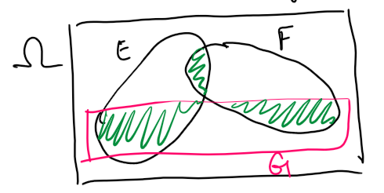

### Law of Total Probability

**Law of Total Probability**. For any two events $E, F$,
$$P(E) = P(E|F)P(F) + P(E|\bar{F})P(\bar{F})$$

**Proof**.

$$
\begin{aligned}
P(E)
&= P(E \cap F) + P(E \cap \bar{F})
&& \text{splitting E's event space into a part with F and a part without} \\
&= P(E|F)P(F) + P(E|\bar{F})P(\bar{F})
&& \text{by applying conditional probability} \\
\end{aligned}
$$

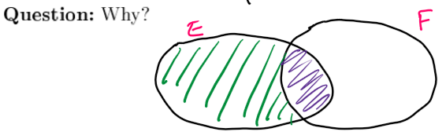

**Generalised Law of Total Probability**. Let $F_1, F_2, \cdots, F_n$ partition the sample space $\Omega$. Then,

$$P(E) = \sum_{i=1}^n P(E|F_i)P(F_i)$$

**Intuition**. We can partition event space of $E$ using the events $F_i$ that cover the whole sample space.

**Law of total probability for conditional probability**. Let $F_1, F_2, \cdots, F_n$ partition the sample space $\Omega$. Then,

$$P(A|B) = \sum_{i=0}^n P(A \space | \space B \cap F_i) \cdot P(F_i | B)$$

### Bayes Law

Bayes Law is used when we know $P(E|F)$ but we want $P(F|E)$.

**Theorem** (Bayes Law). Let $F_1, F_2, \cdots, F_n$ partition $\Omega$. Assuming $P(E) > 0$,

$$P(F|E) = \frac{P(E|F)P(F)}{P(E)} = \frac{P(E|F)P(F)}{\sum_{j=1}^nP(E|F_j)P(F_j)}$$

**Proof**.

$$
\begin{aligned}
P(F \mid E)
&= \frac{P(E \cap F)}{P(E)}
&& \text{using conditional probability} \\
&= \frac{P(E \mid F)P(F)}{P(E)}
&& \text{by expanding } P(E \cap F) \\
&= \frac{P(E \mid F)P(F)}
        {\sum_{j=1}^n P(E \mid F_j)P(F_j)}
&& \text{law of total probability}
\end{aligned}
$$

## 2. Discrete Random Variables

> Chapter 3: Common Discrete Random Variables

### Definitions

**Def.** A random variable $X$ is a real-valued function of the outcome of a random experiment, i.e. $X: \Omega \to \mathbb{R}$.
* a **discrete random variable** has a *countable* range,
* whilst a **continuous random variable** has an *uncountable range*.

**Notation**. $X = i$ is an event. Formally, it is equal to $X^{-1}(i)$
* i.e. the *primary outcomes* that evaluate to $i$ under the random variable $X$.

**Notation**. Hence, $P(X=i)$ is the probability of of the set of elementary events $\omega$ where $X(\omega) = i$.

$$P(X = i) = P(X^{-1}(i)) = P(\{\omega : X(\omega) = i\})$$

**Definitions**. Let $X$ be a discrete random variable.
* The *probability mass function* (pmf) is
$$p_X(i) = P(X = i)$$
* The *cumulative distribution function* (cdf) is 
$$F_X(i) = P(X \le i)$$
* The *complementary cumulative distribution function* (ccdf) is 
$$\bar{F}_X(i) = P(X > i)$$

### Common Distributions

#### Bernoulli

**Def**. The *bernoulli* random variable is a *p-coin*, with probability $p$ of getting heads, and $1-p$ of getting tails. i.e.

$$X = \begin{cases} 1 & \text{w.p} \hspace{1em} p \\ 0 & \text{otherwise}\end{cases}$$

**Notation**. We say $X$ is *drawn* from the $\text{Bernoulli(p)}$ distribution if $X \sim Be(p)$.

**Probability mass function**.

$$p_X(x) = \begin{cases} 1-p & \text{if } x = 0 \\ p & \text{if } x = 1 \end{cases}$$

#### Binomial

**Def**. The *binomial* random variable is the number of heads that come up *in total* when you flip $n$ $p$-coins.
* $X$ is drawn from $\text{Binomial(n,p)}$ if $X \sim B(n,p)$.

**Probability mass function**.

$$p_X(i) = P(X = i) = \begin{pmatrix}n \\ i\end{pmatrix} p^i (1-p)^{n-i} \quad \text{ where } i \in \{0, 1, \cdots, n\}$$

Note that by the binomial theorem, the sum of the p.m.f is $1$, as desired:

$$\sum_{i=0}^n p_X(i) = \sum_{i=0}^n \begin{pmatrix}n \\ i\end{pmatrix} p^i (1-p)^{n-i} = (p + (1-p))^n = 1$$

#### Geometric

**Def**. The *geometric* random variable is the number of flips of a $p$-coin to get a coin.
* each trial is independent, each distributed $\text{Bernoulli}(p)$.
* we write $X \sim \text{Geo}(p)$ if $X$ is drawn from the $\text{Geometric}(p)$ distribution.

**Probability mass function**.

$$p_X(i) = P(X = i) = (1-p)^{i-1}p \quad \text{ where } i = 1, 2, 3, \cdots$$

**Complementary cumulative distribution function**.

$$\bar{F}_X(i) = P(X > i) = P(\text{First } i \text{ flips were tails}) = (1-p)^i$$

By the geometric series, the sum of the p.m.f. is 1, as desired:

$$\sum_{i=1}^\infty p_X(i) = \sum_{i=1}^\infty (1-p)^{i-1} \cdot p = \sum_{i=0}^\infty (1-p)^i \cdot p = p \cdot \frac{1}{1 - (1-p)} = 1$$

#### Poisson

**Def**. The *poisson* random variable is the number of *events* within a given interval of time, where $\lambda$ is the mean number of events per time interval
* Assuming each event occurs independently.
* we write $X \sim \text{Po}(\lambda)$ if $X$ is drawn from the $\text{Poisson}(\lambda)$ distribution

**Probability mass function**.

$$p_X(i) = \frac{e^{-\lambda} \lambda^i}{i!} \quad \text{ where } i = 0, 1, 2, \cdots$$

By the taylor series for $e^\lambda$, the sum of the p.m.f. is 1, as desired:

$$\sum_{i=0}^\infty p_X(i) = \sum_{i=0}^\infty \frac{e^{-\lambda}\lambda^i}{i!} = e^{-\lambda} \sum_{i=0}^\infty \frac{\lambda^i}{i!} = e^{-\lambda} \cdot e^\lambda = 1$$

### Multiple Random Variables and Joint Distributions

**Def.** The **joint probability mass function** between two discrete random variables $X$ and $Y$ is defined by:

$$p_{X,Y}(x,y) = P(X = x, Y = y)$$

**Notation**. $P(X=x,Y=y)$ is the same as $P(X = x \cap Y = y)$.

By definition, the sum of all probabilities is $1$: $$\sum \sum p_{X,Y}(x,y) = 1$$

**Marginal probability mass functions**. By the law of total probability, we derive that:
$$P(X = x) = \sum_y p_{X,Y}(x,y) \quad \text{and} \quad P(Y = y) = \sum_x p_{X,Y}(x,y)$$

* these are called the *marginals* of $X$ and $Y$ respectively, as $p_X(x)$ would appear in the margins of a joint p.m.f table, after summing an entire column over all $y$ values.

**Proof**.

$$
\begin{aligned}
P(X = x)
&= P(X = x \cap \Omega) \\
&= P(X = x \cap (\bigcup_y \{Y = y\}))
&& \text{dividing the sample space} \\
&= P(\bigcup_{y}\{X = x \cap Y=y \})
&& \text{distributing the union} \\
&= \sum_{y}P(X=x,Y=y)
&& \text{by axiom 2} \\
&= \sum_{y}p_{X,Y}(x,y) \\
\end{aligned}
$$

##### Definitions

**Def**. Two random variables $X,Y$ are independent, written $X \perp Y$ if
$$P(X=x, Y=y) = P(X=x)P(Y=y)$$

* If we know $X \perp Y$, then $P(X = x \space | \space Y = y) = P(X = x)$.

**Def**. Two discrete random variables $X,Y$ have the *same distribution* if
$$P(X = i) = P(Y = i) \quad \forall i$$

**Def**. Two discrete random variables $X,Y$ are *equal* if
$$X(\omega) = Y(\omega) \quad \forall \omega \in \Omega$$

##### Law of Total Probability for discrete random variables

Let $Y$ be a discrete random variable. Then,
$$P(E) = \sum_y P(E, Y=y) = \sum_y P(E \space | \space Y = y)P(Y = y)$$

Let $X, Y$ be two discrete random variables. Then,
$$P(X = k) = \sum_y P(X = k | Y=y)P(Y = y)$$

**Intuition**. We can condition on a discrete random variable by setting it equal to a value, which produces an event.

## 3. Expectation

> Chapter 4: Expectation

### Definition

**Def**. The **expectation** of a random variable, written $E[X]$, is the *average* of the random variable. It is defined as the *sum of the possible values of* $X$, each *weighted by its probability*:

$$E[X] = \sum_x xP(X = x)$$

##### Expectations of common discrete random variables

**Bernoulli**.
$$E[X] = 0 \cdot (1-p) + 1 \cdot (p) = p$$

**Geometric**.

$$
\begin{aligned}
E[X]
&= \sum_{n=1}^\infty n(1-p)^{n-1}p \\
&= p \cdot \sum_{n=1}^\infty n \cdot q^{n-1}
&& \text{where } q = (1-p) \\
&= p \cdot (1 + 2q + 3q^2 + 4q^3 + \cdots) \\
&= p \cdot \frac{1}{(1-q)^2}
&& \text{using the well known series} \\
&= p \cdot \frac{1}{p^2} \\
&= \frac{1}{p} \\
\end{aligned}
$$

**Poisson**.

$$
\begin{aligned}
E[X]
&= \sum_{i=0}^\infty i \cdot \frac{e^{-\lambda} \lambda^i}{i!} \\
&= \sum_{i=1} i \frac{e^{-\lambda} \lambda^i}{i!} \\
&= \lambda e^{-\lambda} \sum_{i=1}^\infty \frac{\lambda^{i-1}}{(i-1)!}
&& \text{factoring out } \lambda e^{-\lambda} \\
&= \lambda e^{-\lambda} \sum_{k=0}^{\infty} \frac{\lambda^k}{k!} \\
&= \lambda e^{-\lambda} e^{\lambda}
&& \text{using the taylor series for } e^\lambda \\
&= \lambda
\end{aligned}
$$

##### Expectation of a function of a random variable

**Def**. The expectation of a function $g(\cdot)$ of a *discrete random variable* $X$ is

$$E[g(X)] = \sum_x g(x) \cdot p_X(x)$$

**Consequence**. $E[X^2]$ is **not** the same as $E[X]^2$.

##### Expectation of a product

**Def**. Let $X,Y$ be random variables. The **expectation of the product** $XY$ is defined by summing over all possible pairs $(x,y)$ as follows:

$$E[XY] = \sum_{x}\sum_{y} xy \cdot p_{X,Y}(x,y)$$

**Theorem**. If $X \perp Y$, then $E[XY] = E[X] \cdot E[Y]$.

**Proof**.

$$
\begin{aligned}
E[XY]
&= \sum_x \sum_y xy \cdot P(X=x,Y=y) \\
&= \sum_x \sum_y xy \cdot P(X = x)P(Y = y)
&& \text{by definition of independence} \\
&= \sum_x x P(X=x) \cdot \sum_y y P(Y = y) \\
&= E[X]E[Y] \\
\end{aligned}
$$

**Note**. This is a *one way implication*, i.e. it only holds **if** $X,Y$ are independent.

**Theorem**. If $g$, $f$ are functions of discrete random variables $X$ and $Y$,

$$E[g(X)f(Y)] = E[g(X)] \cdot E[f(Y)]$$

##### Alternative definition of expectation

**Theorem**. Let $X$ be a non-negative, discrete, integer-valued random variable. Then,

$$E[X] = \sum_{x=0}^\infty P(X > x)$$

**Proof**.

$$
\begin{aligned}
E[X]
&= \sum_{k=0}^\infty k P(X = k) \\
&= \sum_{k=0}^\infty (\sum_{x=0}^{k-1} 1) P(X = k)
&& \text{expanding } k \text{ as } \underbrace{1 + 1 + \cdots + 1}_{k \text{ times}} \\
&= \sum_{x=0}^\infty \sum_{k=x+1}^\infty P(X=k)
&& \text{swapping the order of summations} \\
&= \sum_{x=0}^\infty P(X > x)
&& \text{as } \sum_{k=x+1}^\infty P(X=k) = P(X > x) \\
\end{aligned}
$$

**Intuition**. We count the number of "levels" $X$ survives. e.g. if $X = 4$, then it contributes $1$ to each of:

$$P(X > 0), \quad P(X > 1), \quad, P(X > 2), \quad, P(X > 3)$$

**Note**. This definition is more useful in practice than the original definition.

### Linearity of Expectation

**Theorem** (linearity of expectation). For random variables $X$ and $Y$,
$$E[X+Y] = E[X] + E[Y]$$

* this **does not** require $X \perp Y$

**Proof**.

$$
\begin{aligned}
E[X+Y]
&= \sum_x \sum_y (x+y) p_{X,Y}(x,y) \\
&= \sum_{x}\sum_y x \cdot  p_{X,Y}(x,y) + \sum_x \sum_y y \cdot p_{X,Y}(x,y)
&& \text{distributing the sums} \\
&= \sum_x x \sum_y p_{X,Y}(x,y) + \sum_y \sum_x y \cdot p_{X,Y}(x,y)
&& \text{factoring and switching order of summation} \\
&= \sum_x x \cdot p_X(x) + \sum_y y \cdot p_Y(y)
&& \text{by law of total probability} \\
&= E[X] + E[Y] \\
\end{aligned}
$$

This proof can be extended to show, for functions $f$ and $g$,
$$E[f(X) + g(Y)] = E[f(X)] + E[g(Y)]$$

#### Expectation of Binomial

**Def.** Random variables are **i.i.d** if they are independent, and identically distributed.

**Expectation of Binomial**. We can express a binomial random variable as a sum of i.i.d Bernoulli random variables.

Let $X \sim B(n,p)$

$$
\begin{aligned}
X
&= X_1 + X_2 + \cdots + X_n
&& \text{where } X_i \sim \text{Bernoulli}(p) \\
\therefore E[X]
&= E[X_1 + X_2 + \cdots + X_n] \\
&= E[X_1] + E[X_2] + \cdots + E[X_n]
&& \text{by linearity of expectation} \\
&= \underbrace{p + p + \cdots + p}_{n \text{ times}} \\
&= np
\end{aligned}
$$

### Conditional Expectation

**Def**. Let $X$ be a discrete random variable. $A$ is an event such that $P(A) > 0$. Then, the **conditional probability mass function** is

$$p_{X|A}(x) = P(X = x \space | \space A) = \frac{P(X=x,A)}{P(A)}$$

**Fact**: A *conditional p.m.f.* **is a** *p.m.f*, so
$$\sum_{x}p_{x|A}(x) = 1$$

**Proof**.

$$
\begin{aligned}
\sum_{x}p_{x|A}(x)
&= \sum_{x} \frac{P(X = x, A)}{P(A)}
&& \text{by definition of conditional p.m.f.} \\
&= \frac{\sum_{x}P(X=x,A)}{P(A)} \\
&= \frac{P(A)}{P(A)}
&& \text{as each } \{X=x\} \cap A \text{ are disjoint and their union is exactly } A \\
&= 1 \\
\end{aligned}
$$

**Def**. Let $X$ be a discrete random variable. The **conditional expectation of** $X$ **given event** $A$ is
$$E[X|A] = \sum_x x P(X=x \space | \space A)$$

#### Indicators

**Indicators** are an alternative to conditioning. They are either $1$ or $0$ depending on a condition.

Let $I_{S \le x}$, $I_{S > x}$ be indicator random variables defined as follows:

$$I_{S \le x} = \begin{cases} 1 & \text{if } S \le x \\ 0 & \text{otherwise} \end{cases} \quad\quad I_{S > x} = \begin{cases} 1 & \text{if } S > x \\ 0 & \text{otherwise} \end{cases}$$

We can argue that,

$$S \overset{d}= S \cdot I_{S \le x} + S \cdot I_{S > x}$$

**Proof**. We can factor $S$ to get $S \cdot (I_{S \le x} + I_{S>x})$, where the bracket is equal to $1$ for all values of $x$, as the two indicators are complementary.

**Fact**. Given random variable $S$ and event $A$,
$$E[S|A] = \frac{E[S \cdot I_{A}]}{P(A)}$$

**Proof**. $E[S \cdot I_{A}]$ can be thought of as the *chopped* distribution of $S$, so we have to divide by $P(A)$ to normalise into to the conditional p.m.f.

**Expressing conditional expectation using indicators**.

$$
\begin{aligned}
E[S]
&= E[S \cdot I_{S \le x} + E[S \cdot I_{S>x}]
&& \text{as they have same distribution} \\
&= E[S \cdot I_{S \le x}] + E[S \cdot I_{S>x}]
&& \text{by linearity of expectation} \\
&= E[S|S \le x]P(S \le x) + E[S|S>x]P(S>x) \\
\end{aligned}
$$

#### Computing Expectations via Conditioning

**Theorem**. Let $X$ be a discrete random variable. $A$ is an event such that $P(A) > 0$. Then, we can compute $E[X]$ by conditioning on $A$ as follows:

$$E[X] = E[X|A]P(A) + E[X|\bar{A}]P(\bar{A})$$

**Proof**.

$$
\begin{aligned}
E[X]
&= \sum_{x}x \cdot P(X = x) \\
&= \sum_{x}x \cdot [P(X=x \space | \space A)P(A) + P(X = x \space | \space \bar{A})P(\bar{A})]
&& \text{by the law of total probability} \\
&= \sum_{x} x \cdot P(X = x \space | \space A)P(A) + \sum_{x} x \cdot P(X = x \space | \space \bar{A})P(\bar{A})
&& \text{distributing the sum} \\
&= E[X|A]P(A) + E[X|\bar{A}]P(\bar{A}) \\
\end{aligned}
$$

**Theorem** (general case). Let events $f_1, F_2, F_3, \cdots$ partition the state space $\Omega$. Then,
$$E[X] = \sum_{i=1}^\infty E[X|F_i] \cdot P(F_i)$$

Given a discrete random variable $Y$, if we think of $Y=y$ as an event, then we have:

$$E[X] = \sum_y E[X \space | \space Y = y]P(Y=y)$$

Likewise, for a function $g$,

$$E[g(X)] = \sum_y E[g(X) \space | \space Y=y]P(Y=y)$$

#### Expectation of Geometric (revisited)

Let $N \sim \text{Geometric}(p)$. We condition on the event $H$ = you get heads on the first trial.

$$
\begin{aligned}
E[N]
&= E[N|H]P(H) + E[N|\bar{H}]P(\bar{H})
&& \text{by conditioning on } H \\
&= 1 \cdot p + (E[1 + N]) \cdot (1-p)
&& \text{if we don't get heads, we take } N \text{ extra trials} \\
&= 1 \cdot p + (1 + E[N]) \cdot (1-p)
&& \text{by linearity of expectation} \\
&= p + 1 + E[N] - p -p \cdot E[N] \\
\end{aligned}
$$

$$\therefore p \cdot E[N] = 1$$
$$\therefore E[N] = \frac{1}{p}$$

## 4. Variance, Higher Moments, and Random Sums

> Chapter 5: Variance, Higher Moments, and Random Sums

### Higher Moments

**Def.** For a random variable $X$, the **kth moment** of $X$ is $E[X^k]$.
* **Note**. In general, $E[X]^k \ne E[X^k$

Since computing higher moments is often *difficult* by brute force, we can compute them using conditioning.

**Example.** Second moment of geometric distribution.

Let $X \sim \text{Geometric}(p)$. We condition on the event $H$ = you gets heads on the first trial.

$$
\begin{aligned}
E[X^2]
&= E[X^2|H]P(H) + E[X^2|\bar{H}]P(\bar{H})
&& \text{conditioning on event H} \\
&= 1 \cdot p + E[(1+X)^2](1-p) \\
&= 1 \cdot p + (1 + 2E[X] + E[X^2])(1-p)
&& \text{expanding and using linearity of expectation} \\
&= 1 \cdot p + (1 + \frac{2}{p} + E[X^2](1-p))
&& \text{substituting } E[X] = \frac{1}{p} \\
&= p + 1 + \frac{2}{p} + E[X^2] - p - 2 - p \cdot E[X^2] \\
\end{aligned}
$$

$$\therefore p \cdot E[X^2] = \frac{2}{p} - 1$$
$$\therefore E[X^2] = \frac{2-p}{p^2}$$

### Variance

***Def.*** The **variance** of a r.v. $X$, written as $\text{Var}(X)$, is the *expected square difference* of $X$ from its mean

$$\text{Var}(X) = E[(X - E[X])^2]$$

* It measures how much an experiment is *likely* to deviate from its mean

**Variance of Bernoulli**. Let $X \sim \text{Bernoulli}(p)$. Then,
$$\text{Var}(p) = p(1-p)$$

**Note**. We cannot condition on variance like expectation, so the following is wrong. This is because there is a hidden *second moment* of $X$ inside it.

$$Var(X) = Var(X|X=1)\cdot p + Var(X|X = 0) \cdot (1-p)$$

#### Other Definitions of Variance

**Linear definition**: $E[X - E[X]]$.
* this is not very useful as by linearity of expectation, this is equal to 0, so it doesn't work.
$$E[X -E[X]] = E[X] - E[X] = 0$$

**Absolute value definition**: $E[|X - E[X]|]$.
* totally legitimate definition, but lacks the linearity property.
* hence it is not used often.

**Def**. The **standard deviation** of $X$, written $\sigma_X = \text{std}(X)$, is the *square root* of the variance:

$$\text{std}(X) = \sqrt{\text{Var}(X)}$$

* This is more useful as the units of $\text{std}(X)$ are the same as $X$.

**Def.** The **squared coefficient of variation** of r.v. $X$ is defined as:

$$C_X^2 = \frac{\text{Var}(X)}{E[X]^2}$$

* **unitless** because the units cancel out.
* sometimes useful as the value of $C_X^2$ is the same no matter what units the random variable $x$ was defined in.
* Note that $C_X^2$ is not defined if $E[X] = 0$. In practice, the $C_X^2$ metric is used to model quantities that are positive.

#### Properties of Variance

**Equivalent definition of variance**. The variance of random variable $X$ can be equivalently expressed as follows:

$$\text{Var}(X) = E[X^2] -(E[X])^2$$

**Proof**.

$$
\begin{aligned}
\text{Var}(X)
&= E[(E - E[X])^2] \\
&= E[X^2 - 2X \cdot E[X] + E[X]^2] \\
&= E[X^2] - 2E[X]E[X] + E[X]^2
&& \text{because } E[X] \text{ is a constant} \\
&= E[X^2] - (E[X])^2
\end{aligned}
$$

**Theorem** (linearity of variance).  Let $X, Y$ be random variables where $X \perp Y$. Then,

$$\text{Var}(X+Y) = \text{Var}(X) + \text{Var}(Y)$$

**Proof**.

$$
\begin{aligned}
\text{Var}(X+Y)
&= E[(X+Y)^2] - (E[(X+Y)])^2 \\
&= E[X^2] + E[Y^2] + 2E[XY] - (E[X])^2 - (E[Y])^2 - 2E[X]E[Y]
&& \text{expanding and applying linearity of expectation} \\
&= \text{Var}(X) + \text{Var}(Y) + \underbrace{2E[XY] - 2E[X]E[Y]}_{\text{equals 0 if } X \perp Y} \\
\end{aligned}
$$

This generalises to show if $X_1, X_2, \cdots, X_n$ are independent, then

$$\text{Var}(X_1 + X_2 + \cdots + X_n) = \text{Var}(X_1) + \text{Var}(X_2) + \cdots + \text{Var}(X_n)$$

**Variance of Binomial**. We can now derive the variance of the binomial distribution using linearity of variance.

Let $X \sim B(n,p)$. We have $X = X_1 + X_2 + \cdots + X_n$ where each $X_i \sim \text{Bernoulli}(p)$ and are i.i.d.

$$
\begin{aligned}
\text{Var}(X)
&= \text{Var}(X_1 + X_2 + \cdots + X_n) \\
&=  \text{Var}(X_1) + \text{Var}(X_2) + \cdots + \text{Var}(X_n)
&& \text{by linearity of variance because each } X_i \text{ are i.i.d} \\
&= n \cdot \text{Var}(X_i) \\
&= np(1-p) \\
\end{aligned}
$$

#### Summary of Discrete Distributions

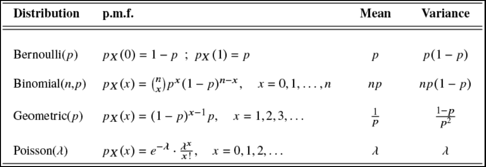

### Higher Central Moments

**Def.** The **kth central moment** of a r.v. $X$ is:
$$E[(X - E[X])^k] = \sum_i (i-E[X])^k p_X(i)$$

**Second Central Moment**: also known as Variance.

**Third Central Moment**: called **skew**, denoted $\text{Skew}(X)$. This metric shows how much a distribution leans to the left or right.

* Symmetrical: $\text{Skew}(X) = 0$
* Leans to the left: $\text{Skew}(X) < 0$
* Leans to the right: $\text{Skew}(X) > 0$

**Note**: $Skew$ satisfies the linearity property when $X \perp Y$:
- $\text{Skew}(X+Y) = \text{Skew}(X) + \text{Skew}(Y)$ if $X \perp Y$.

### Sum of a Random Number of Random Variables

Let $X_1, X_2, X_3, \cdots$ be i.i.d random variables, where $X_i \sim X$. Let $S$ denote the sum

$$S = \sum_{i=1}^N X_i \quad \text{where } N \perp X_i, \forall i$$

where $N$ is not a constant, but rather a non-negative, integer-valued random variable.

**Example**. A contestant gets a prize each day of value $X_i$. Each time the wheel is spun, and if it lands on STOP the game ends, otherwise the contestant comes back tomorrow. Here, $N \sim \text{Geometric}(p)$, and the total earnings of the contestant is $S = \sum_{i=1}^N X_i$.

##### Deriving $E[S]$

**Intuition**. We condition on $N$, since linearity of expectation only applies when $N$ is a constant.

$$
\begin{aligned}
E[S]
&= E[\sum_{i=1}^N X_i] \\
&=  \sum_{n} E[\sum_{i=1}^N X_i \space | \space N = n] \cdot P(N = n)
&& \text{conditioning on } N \\
&= \sum_{n} E[\sum_{i=1}^n X_i] \cdot P(N = n)
&& \text{as each } X_i \text{ are independent of } N \\
&= \sum_{n} nE[X] \cdot P(N = n)
&& \text{as each } X_i \text{ are i.i.d} \\
&= E[X] \cdot E[N]
&& \text{by definition of expectation} \\
\end{aligned}
$$

##### Deriving $\text{Var}(S)$

**Intuition**. We cannot use conditioning to get $\text{Var}(S)$, but we can condition to get $E[S^2]$.

$$
\begin{aligned}
E[S^2]
&= \sum_{n} E[S^2 \space | \space N = n] \cdot P(N = n) \\
&= \sum_{n} E[S^2] \cdot P(n = n)
&& \text{because each } X_i \text{ are independent of } N \\
&= \sum_{n} E[(X_1 + X_2 + \cdots + X_n)^2] \cdot P(N = n) \\
&= \sum_{n} (n \cdot E[X_1^2] + (n^2 - n) \cdot E[X_1 X_2]) \cdot P(N = n)
&& \text{as there are } n^2 - n \text{ pairs where } i \ne j \\
&= \sum_{n} n \cdot E[X^2] P(N = n) + \sum_{n} (n^2 - n) E[X]^2 P(N = n)
&& \text{ as } X_1, X_2 \text{ are i.i.d} \\
&= E[N]E[X^2] + E[N^2](E[X])^2 - E[N](E[X])^2
&& \text{by definition of expectation} \\
&= E[N]\text{Var}(X) + E[N^2](E[X])^2 \\
\end{aligned}
$$

Now,
$$
\begin{aligned}
\text{Var}(S)
&= E[S^2] - (E[S])^2 \\
&= E[N]\text{Var}(X) + E[N^2](E[X])^2 - (E[N]E[X])^2
&& \text{substituting } E[S] = E[N]E[X] \\
&= E[N]\text{Var}(X) + \text{Var}(N)E[X]^2
&& \text{by definition of variance} \\
\end{aligned}
$$

### Tail of a Random Variable

**Def.** The *tail* of a random variable is its **ccdf**

$$\bar{F}_X(i) = P(X > i) = 1 - F_X(i)$$

A **tail bound** provides an upper bound on the tail of a distribution 
* useful as it provides an upper bound on worst case scenario of a quantity.
* **e.g.** finding the probability $P(\text{time delay} > \text{worst case})$ for an amazon website.
* **e.g.** finding the probability $P(\text{search time} > k)$ in hashing.

*Markov* and *Chebyshev*'s inequalities are such theorems that provide an upper bound on the tail of a non-negative random variable.

#### Markov's Inequality

**Theorem** (Markov's inequality). Let $X$ be a non-negative random variable with finite mean $\mu = E[X]$. Then, $\forall a > 0$,

$$P(X \ge a) \le \frac{E[X]}{a}$$

**Proof**.

$$
\begin{aligned}
\mu
&= \sum_{i = 0}^\infty i \cdot P(X = i) \\
&= \sum_{i = 0}^{a-1} i \cdot P(X = i) + \sum_{i = a}^\infty i \cdot P(X = i)
&& \text{splitting the sum} \\
& \ge 0 + \sum_{i=a}^\infty a \cdot P(X = i)
&& \text{as the first sum} \ge 0 \text{ and } i \ge a \text{ in the second sum} \\
&= a \sum_{i=a}^\infty P(X = i) \\
&= a P(X \ge a)
\end{aligned}
$$

$$\therefore E[X] \ge aP(X \ge a)$$
$$\therefore P(X \ge a) \le \frac{E[X]}{a}$$

#### Chebyshev's Inequality

**Theorem** (Chebyshev's Inequality). Let $X$ be a random variable with mean $\mu = E[X]$ and variance $\text{Var}(X)$. Then $\forall a > 0$:

$$P(|X - \mu| \ge a) \le \frac{\text{Var}(X)}{a^2}$$

**Proof**. We use Markov's inequality.

$$
\begin{aligned}
P(|X - \mu| \ge a)
&= P((X - \mu)^2 \ge a^2)
&& \text{squaring both sides to eliminate the absolute value} \\
& \le \frac{E[(X - \mu)^2]}{a^2}
&& \text{by Markov's inequality} \\
& = \frac{\text{Var}(X)}{a^2}
&& \text{by definition of variance} \\
\end{aligned}
$$

#### Stochastic Dominance

**Def.** Suppose that random variables $X, Y$ are defined on the same sample space, but $X \ne Y$ in distribution. We say that $X$ **stochastically dominates** $Y$ if

$$P(X > i) \ge P(Y > i), \quad \forall i$$

We write this as $X \ge_{st} Y$.

Graphically, if we graph the tails of $X$ and $Y$, the tail of $X$ is always above or equal to the tail of $Y$.

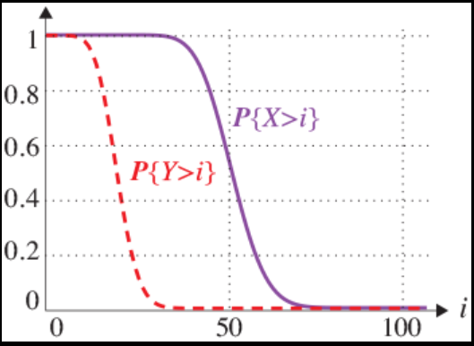

### Jensen's Inequality

**Theorem** (Jensen's Inequality). Let $X$ be a random variable that takes on values in an interval $S$, and let $g : S \to \mathbb{R}$ be convex on $S$. Then,

$$g(E[X]) \le E[g(X)]$$

**Def**. A real-valued function $g(\cdot)$ defined on an interval $S \subseteq R$ is said to be **convex** on $S$ if, for any points $x_1, x_2, \cdots, x_n \in S$, and any $\alpha_1, \alpha_2, \cdots, \alpha_n \in [0,1]$, where $\alpha_1 + \alpha_2 + \cdots + \alpha_n = 1$, we have

$$g(\alpha_1 x_1 + \alpha_2 x_2 + \cdots + \alpha_n x_n) \le \alpha_1 g(x_1) + \alpha_2 g(x_2) + \cdots + alpha_n g(x_n)$$

**Proof**.

Let $X$ be a random variable where 

$$X = \begin{cases}x_1 & \text{w/prob } p_X(x_1) \\ x_2 & \text{w/prob } p_X(x_2) \\ \vdots \\ x_n & \text{w/prob } p_X(x_n)\end{cases}$$

Let $g$ be a convex function. Since $p_X$ satisfies the summation to $1$ rule, by definition,

$$g(p_X(x_1) x_1 + \cdots + p_X(x_n) x_n) \le p_X(x_1) g(x_1) + \cdots + p_X(x_n) g(x_n)$$

Applying the definition of expectation, we get

$$g(E[X]) \le E[g(X)]$$

**Corollary**. Let $X$ be a discrete random variable, and $a > 0$ be an integer. Then,

$$E[X^a] \ge (E[X])^a$$

**Important**: A useful method for determining that a function is convex is to check its second derivative. Specifically, $g(\cdot)$ is convex on $S$ if and only if $g''(x) \ge 0$ for all $x \in S$ (from calculus).

### Inspection Paradox

When variability is present, the mean as experienced by a random observer is very different from the true mean.

**Example**. There are 6 classes with sizes $10, 10, 10, 10, 10, 130$. Dean insists average class size is $30$ but survey of students shows average class size is $100.$

**Student's perspective**:
* sample space is $\Omega_S = \{s_1, \cdots, s_{180}\}$

$$\text{average class size} = \frac{\overbrace{10 + \cdots + 10}^{\text{50 times}} + \overbrace{130 + \cdots + 130}^{\text{130 times}}}{180} = 100$$

**Dean's perspective**:
* sample space is $\Omega_D = \{c_1, c_2, \cdots, c_6\}$

$$\text{average class size} = \frac{10 + 10 + 10 + 10 + 10 + 130}{6} = 30$$

## 5. Continuous Random Variables

> Chapter 7: Continuous Random Variables: Single Distribution

### Introduction

#### Probability Density Functions

**Def**. A **continuous random variable** has a continuous range of values that it can take on. Thus a continuous random variable can take on an uncountable set of possible values.

**Def**. The **probability density function** (p.d.f) of a *continuous* random variable $X$ is a non-negative function $f_X(\cdot)$, where

$$P(a \le X \le b) = \int_a^b f_X(x)dx \quad \text{and where} \quad \int_{-\infty}^\infty f_X(x)dx = 1$$

**Intuitively**, $f_X(x)dx$ is the probability that $X$ is between $x$ and $x+dx$, where $dx$ is small.

$$f_X(x)dx \approx P(x \le X \le x + dx)$$

On a graph of $x$ against the p.d.f. $f_X(x)$, the **area** under the graph represents the *probability*.

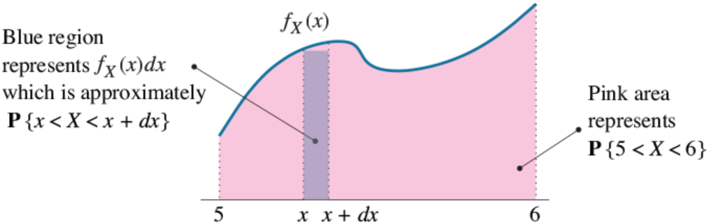

**Notes**.
* $f_X(x)$ **is not a probability**, $f_X(x)dx$ is.
* $P(X = a)$ for some $a$ is always $0$. We can only specify probabilities *over an interval*.

#### Cumulative Distribution Functions

**Def**. The **cumulative distribution function** (c.d.f.) $F_X(\cdot)$ of a continuous random variable is defined by

$$F_X(x) = P(-\infty < X \le x) = \int_{-\infty}^x f_X(t) dt$$

**Def**. The **tail** $\bar{F}(\cdot)$ of a continuous random variable $X$ is defined by

$$\bar{F}_X (x) = P(x < X \le \infty) = \int_x^\infty f_X(t) dt$$

**Fact**. By the fundamental theorem of calculus, we can differentiate the c.d.f to get the p.d.f:

$$f_X(x) = \frac{d}{dx}F_x(x)$$

### Common Continuous Distributions

#### Uniform

The **Uniform** distribution, written $U(a,b)$, models that any interval of equal length between $a$ and $b$ is equally likely.

If $X \sim U(a,b)$, then the p.d.f. is

$$f_X(x) = \begin{cases} \frac{1}{b-a} & \text{if } a \le x \le b \\ 0 & \text{otherwise}\end{cases}$$

and the c.d.f. is

$$F_X(x) = \int_{a}^x \frac{1}{b-a} dt = \frac{x-a}{b-a}, \quad a \le x \le b$$

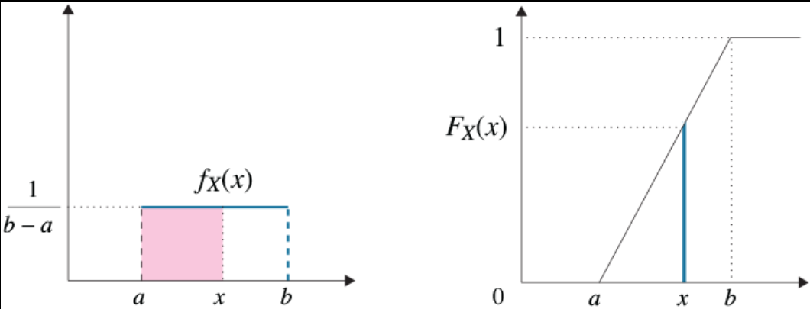

#### Exponential

The **Exponential** distribution, written $\text{Exp}(\lambda)$, has a p.d.f that drops off exponentially. It typically models the time until an event occurs if the event occurs with rate $\lambda > 0$. 

If $X \sim \text{Exp}(\lambda)$, then the p.d.f. is

$$f_X(x) = \begin{cases} \lambda e^{-\lambda x} & \text{if } x \ge 0 \\ 0 &  \text{if } x < 0\end{cases}$$

and the c.d.f. $F_X$ and c.c.d.f. $\bar{F}_X$ are given by

$$F_X(x) = \int_{-\infty}^x f_X(t) dt = \begin{cases} 1 - e^{-\lambda x} & \text{if } x \ge 0 \\ 0 & \text{if } x < 0\end{cases}$$
$$\bar{F}_X(x) = 1- F_X(x) = e^{-\lambda x}, \quad \text{if } x \ge 0$$

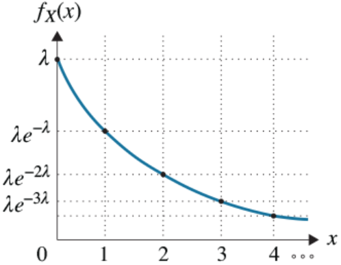

#### Memoryless Property

The exponential distribution has a property called **memorylessness**.

**Def**. We say that random variable $X$ has the memoryless property if

$$P(X > t + s \space | \space X > s) = P(X > t) \quad \forall s, t \ge 0$$

**Intuition**. The history doesn't affect the future. 
* If $X$ is a time, the amount of time until an event is *independent* of how long I've been waiting so far.
* E.g. if $X$ is the time until I win the lottery.
* Suppose I haven't yet won the lottery by time $s$.
* The probability I need $> t$ more time is independent of $s$

**Equivalently**, we say $X$ is memoryless if

$$[X | X > s] \overset{d}{=} s + X, \quad \forall s \ge 0$$

that is, the random variable $[X | X > s]$ the random variable $s + X$ have the same distribution.

**Theorem**. If $X \sim \text{Exp}(\lambda)$, then $X$ has the memoryless property.

**Proof**.

$$
\begin{aligned}
P(X > t + s \space | \space X > s)
&= \frac{P(X > t + s, X > s)}{P(X > s)} \\
&= \frac{P(X > t + s)}{P(X > s)}
&& \text{as } X > s \text{ is implied by } X > t + s \\
&= \frac{e^{-\lambda(t+s)}}{e^{-\lambda s}} 
&& \text{by definition} \\
&= e^{-\lambda t} \\
&= P(X > t) \\
\end{aligned}
$$

**Fact**. The *geometric* distribution also has the memoryless property.

### Expectation, Variance, and Higher Moments

#### Expectation and Variance

**Def**. For a continuous random variable $X$ with probability density function $f_X(\cdot)$, we have:

$$E[X] = \int_{-\infty}^\infty x \cdot f_X(x) dx$$
$$E[X^i] = \int_{-\infty}^\infty x^i \cdot f_X(x) dx$$

For any function $g(\cdot)$, we have:

$$E[g(X)] = \int_{-\infty}^\infty g(x) \cdot f_X(x) dx$$

In particular,

$$\text{Var}(X) = E[(X - E[X])^2] = \int_{-\infty}^\infty (x - E[X])^2 \cdot f_X(x) dx$$

#### Moments of Uniform

Let $X \sim \text{Uniform}(a,b)$. Recall that

$$f_X(x) = \begin{cases}\frac{1}{b-a} & \text{if } a \le x \le b \\ 0 & \text{otherwise}\end{cases}$$

**Expectation**.
* This answer is the "average" of the bounds - should make sense.

$$
\begin{aligned}
E[X]
&= \int_{-\infty}^\infty f_X(t) dt
&= \int_a^b \frac{1}{b-a} t dt
&= \frac{1}{b-a} \cdot \frac{b^2 - a^2}{2} \\
&= \frac{a+b}{2} \\
\end{aligned}
$$

**Second Moment**.

$$
\begin{aligned}
E[X^2]
&= \int_{-\infty}^\infty f_X(t) t^2 dt
&= \int_a^b \frac{1}{b-a}t^2 dt
&= \frac{1}{b-a} \cdot \frac{b^3-a^3}{3} \\
&= \frac{b^2+ab+a^2}{3} \\
\end{aligned}
$$

**Variance**.

$$
\text{Var}(X) = E[X^2] - (E[X])^2 = \frac{(b-a)^2}{12}
$$

#### Moments of Exponential

Let $X \sim \text{Exp}(\lambda)$. Recall that

$$f_X(x) = \begin{cases}\lambda e^{-\lambda x} & \text{if } x \ge 0 \\ 0 & \text{if } x < 0 \end{cases} $$

**Expectation**.
* This answer is the reciprocal of the rate - should make sense.

$$
E[X] = \int_{-\infty}^\infty f_X(t)t dt = \int_0^\infty \lambda e^{-\lambda t} t dt = \frac{1}{\lambda} \quad \text{(integration by parts)}
$$

**Second Moment**.

$$
E[X] = \int_{-\infty}^\infty f_X(t) t^2 dt = \int_0^\infty \lambda e^{-\lambda t } t^2 dt = \frac{2}{\lambda^2} \quad \text{(double integration by parts)}
$$

**Variance**.

$$
\text{Var}(X) = E[X^2] - (E[X])^2 = \frac{1}{\lambda^2}
$$

### Continuous Probability Laws

#### Continuous Law of Total Probability

**Recall** the law of total probability for *discrete* random variables. For any event $A$ and any discrete random variable $X$,

$$P(A) = \sum_x P(A \space | \space X = x)P(X = x)$$

**Theorem** (continuous law of total probability). Given any event $A$ and continuous random variable $X$, we can compute $P(A)$ by conditioning on the value of $X$ as follows:

$$P(A) = \int_{-\infty}^\infty P(A \space | \space X = x) f_X(x) dx$$

**Intuition**. We replaced $P(X = x)$ with $f_X(x)dx$, which is the continuous equivalent.

**Notation**. We define $f_X(x \cap A)$ as the *density of the intersection of the event $A$ with $X = x$*
$$f_X(x \cap A) = P(A \space | \space X = x)f_X(x)$$
* This notation is very confusing so this is the last time you will see it. Every other equation does not use this notation.

#### Continuous Bayes Law

Recall Bayes' law for *discrete random variables*. For any event $A$ and any discrete random variable $X$,

$$P(X = x \space | \space A) = \frac{P(A \space | \space X = x)P(X = x)}{P(A)}$$

**Theorem** (continuous bayes' law). Given any event $A$ and continuous random variable $X$,

$$f_{X|A}(x) = \frac{P(A | X = x)f_X(x)}{P(A)}$$

where $f_{X|A}$ is the **conditional probability density function** of $X$ given event $A$.

**Corollary**. Rearranging continuous bayes' law gives another useful form:
$$P(A \space | \space X = x) = \frac{f_{X|A}(x) \cdot P(A)}{f_X(x)}$$

**Proof Idea**. We replace probabilities with $\text{density} \times dx$ and cancel the $dx$.

$$
\begin{aligned}
P(X=x\space |\space A) &= \frac{P(A \space |\space X = x)P(X = x)}{P(A)} \\
f_{X|A}(x) dx &\approx \frac{P(A \space |\space X=x) \cdot f_X(x) dx}{P(A)}
&& \text{probability } = \text{ density } \times dx \\
f_{X|A}(x) &= \frac{P(A \space | \space X = x) \cdot f_X(x)}{P(A)}
&& \text{cancelling the } dx \\
\end{aligned}
$$

**Observation**. The *conditional p.d.f.* is still a p.d.f, so
$$\int_{x}f_{X|A}(x) = 1$$

**Proof**.

$$
\begin{aligned}
\int_{x} f_{X|A}(x)
&= \int_{x} \frac{P(A \space | \space X = x) f_X(x)}{f_X(x)} dx
&& \text{by continuous bayes' law} \\
&= \frac{1}{P(A)} \cdot \int_x P(A \space | \space X = x) \cdot f_X(x) dx
&& \text{factoring out } \frac{1}{P(A)} \\
&= \frac{1}{P(A)} \cdot P(A)
&& \text{by continuous law of total probability} \\
&= 1 \\
\end{aligned}
$$

### Continuous Conditional Expectation

Recall, for a discrete random variable $X$ and an event $A$, where $P(A) > 0$:
$$E[X|A] = \sum_x x P(X = x | A)$$

**Def**. For a continuous random variable $X$ and an event $A$, where $P(A) > 0$, the **conditional expectation** is
$$E[X|A] = \int_{x} x \cdot f_{X|A}(x)dx$$

**Intuition**. We replaced $P(X = x \space | \space A)$ with its continuous analogue, $f_{X|A}(x) dx$.

Substituting in continuous bayes law for $f_{X|A}(x)$, we get

$$E[X|A] = \frac{1}{P(A)} \int_{x} x P(A \space | \space X = x)f_X(x) dx$$

#### Example: learning the bias of a coin

You have a biased coin, with probability $P$ of heads. We assume $P \sim \text{Uniform}(0, 1)$. We now flip the coin 10 times and see 10 heads. What is $E[P \space | \space \text{10 heads}]$?

$$
\begin{aligned}
E[P|A]
&= \int_0^1 p \cdot f_{P|A}(p) dp
&& \text{by definition of conditional expectation} \\
&= \int_0^1 p \cdot \frac{P(A \space | \space P = p) \cdot f_P(p)}{P(A)} dp
&& \text{by continuous bayes' law} \\
&= \frac{1}{P(A)}\int_0^1 p \cdot p^{10} \cdot 1 \space dp
\end{aligned}
$$

We use law of total probability to calculate $P(A)$, conditioning on $P$:

$$
\begin{aligned}
P(A)
&= \int_0^1 P(A \space | \space P = p)f_P(p) dp
&& \text{by law of total probability} \\
&= \int_0^1 p^{10} \cdot 1 \space dp \\
&= \left[\frac{p^{11}}{11}\right]_0^1 \\
&= \frac{1}{11} \\
\end{aligned}
$$

Then,

$$
E[P|A] = 11 \times \left[ \frac{p^{12}}{12} \right]_0^1 = \frac{11}{12}
$$

## 6. Multiple Continuous Random Variables

> Chapter 8: Continuous Random Variables: Joint Distributions

### Joint Densities

**Def**. The **joint probability density function** between continuous random variables $X$ and $Y$ is a non-negative function $f_{X,Y}(x,y)$ where

$$\int_{c}^d \int_{a}^b f_{X,Y}(x,y) dx dy = P(a \le X \le b, c \le Y \le d)$$

and where

$$\int_{-\infty}^\infty \int_{-\infty}^\infty f_{X,Y}(x,y)dxdy = 1$$

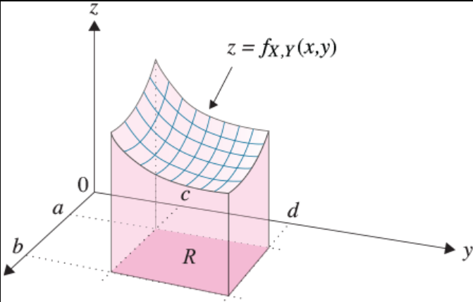

**Intuition**. We can think of $f_{X,Y}(x,y)$ as a *two-dimensional rate*, where we have to multiply by $dxdy$ to get the probability:

$$P(x \le X \le x + dx, y \le Y \le y + dy) \approx f_{X,Y}(x,y) dx dy$$

If we plot a 3D graph of $x, y$ against the joint density function, the joint probability is the *volume* under the curve.

**Def**. The **marginal densities**, $f_X(x)$ and $f_Y(y)$, are defined as:

$$f_X(x) = \int_y f_{X,Y}(x,y) dy \quad \quad (\text{law of total probability over } y)$$
$$f_Y(y) = \int_x f_{X,Y}(x,y) dx \quad \quad (\text{law of total probability over } x)$$

**Def**. We say that continuous random variables $X$ and $Y$ are **independent**, written $X \perp Y$ if

$$f_{X,Y}(x,y) = f_X(x) \cdot f_Y(y) \quad \forall x, y$$

#### Example

Let $X \sim \text{Exp}(\lambda)$ and $Y \sim \text{Exp}(\mu)$ and $X \perp Y$. Derive $P(X < Y)$ by conditioning on the value of $X$.

$$
\begin{aligned}
P(X < Y)
&= \int_{0}^\infty P(X < Y | X = x) \cdot f_X(x) dx
&& \text{law of total probability, conditioning on } X \\
&= \int_{0}^\infty P(Y > x) f_X(x) dx
&& \text{as } X \perp Y \\
&= \int_{0}^\infty e^{-\mu x} \cdot \lambda e^{-\lambda x} dx
&& \text{by definition} \\
&= \int_0^\infty e^{-(\lambda + \mu)x} dx \\
&= \frac{\lambda}{\lambda + \mu} \\
\end{aligned}
$$

### Conditional Density

#### Continuous Bayes Law: two variables

Recall **continuous bayes' law** for a single variable. Let $X$ be a continuous random variable and $A$ be an event with $P(A > 0)$:

$$f_{X|A} = \frac{P(A \space | \space X =x)f_X(x)}{P(A)}$$

**Theorem** (continuous bayes' law for two variables). Let $X$ and $Y$ be continuous random variables. Then,

$$f_{X|Y=y}(x) = \frac{f_{Y|X=x}(y) \cdot f_X(x)}{f_Y(y)} = \frac{f_{Y|X=x}(y) \cdot f_X(x)}{\int_x f_{X,Y}(x,y)dx}$$

**Intuition**. We let $A = \{Y = y\}$ and express $\text{probability} = \text{density} \times dy$.

$$
\begin{aligned}
f_{X|Y=y}
&= \frac{P(Y = y \space | \space X = x) f_X(x)}{P(Y = y)} \\
&\approx \frac{f_{Y|X=x}(y)dy \cdot f_X(x)}{f_Y(y)dy} \\
&= \frac{f_{Y|X=x}(y) \cdot f_X(x)}{f_Y(y)} \\
\end{aligned}
$$

The second equality is derived by expanding $f_Y(y)$ using the law of total probability.

#### Conditional p.d.f

Recall the definition of conditional probability for two *discrete* random variables,

$$P(X = x, Y = y) = P(X = x \space | \space Y = y)P(Y = y)$$

**Def**. Let $f_{X|Y=y}$ be the conditional p.d.f of random variable $X$ given event $Y = y$. Then,

$$f_{X,Y}(x,y) = f_{X|Y=y}(x) \cdot f_Y(y)$$

Rearranging, we get a definition for the conditional p.d.f. in terms of the joint p.d.f. which is often more useful:

$$f_{X|Y=y}(x) = \frac{f_{X,Y}(x,y)}{f_Y(y)}$$

**Intuition**. We replace probabilities with densities.

$$
\begin{aligned}
P(X=x, Y = y) &= P(X = x \space | \space Y = y)P(Y = y) \\
f_{X,Y}(x,y) dxdy &= f_{X|Y=y}(x) dx \cdot f_Y(y) dy \\
f_{X,Y}(x,y) &= f_{X|Y=y}(x) \cdot f_Y(y) \\
\end{aligned}
$$

**Observation**. The conditional p.d.f. is still a proper p.d.f. in the sense that

$$\int_{x}f_{X|Y=y}(x) dx = 1$$

**Proof**.

$$
\begin{aligned}
\int_{x}f_{X|Y=y}(x)dx
&= \int_x \frac{f_{X,Y}(x,y)}{f_Y(y)} dx
&& \text{by definition} \\
&= \frac{1}{f_Y(y)} \cdot \int_x f_{X,Y}(x,y) dx \\
&= \frac{1}{f_Y}(y) \cdot f_Y(y)
&& \text{by definition of marginal} \\
&=  1 \\
\end{aligned}
$$

#### Law of Total Probability: two variables

**Theorem** (law of total probability). Let $X$ and $Y$ be continuous random variables. Then,

$$f_X(x) = \int_y f_{X,Y}(x,y) dy = \int_y f_{X|Y=y}(x) f_Y(y) dy$$

**Proof**. The first equality is true by the definition of the marginal density. The second equality is derived by replacing $f_{X,Y}(x,y)$ with $f_{X|Y=y}(x)f_Y(y)$ by definition.

### Expectation for two continuous random variables

**Def**. Let $X$ and $Y$ be continuous random variables with joint p.d.f. $f_{X,Y}(x,y)$. Then, for any function $g(X,Y)$, we have

$$E[g(X,Y)] = \int_{-\infty}^\infty \int_{-\infty}^\infty g(x,y) \cdot f_{X,Y}(x,y) dx dy$$

**Example**.

$$E[XY] = \int_x \int_y xy f_{X,Y}(x,y) dy dx$$

In the case that $X \perp Y$, we still have $E[XY] = E[X]E[Y]$. 

**Proof**:

$$
\begin{aligned}
E[XY]
&= \int_{x} \int_{y} xy f_{X,Y}(x,y) dy dx \\
&= \int_x x f_X(x) \int_y f_Y(y) dy dx
&& \text{by independence, and factoring out terms} \\
&= \int_{x} x f_x(x) \cdot E[Y] dx \\
&= E[X]E[Y] \\
\end{aligned}
$$

**Example**.
$$E[X(X-Y)] = \int_y \int_x x(x-y) f_{X,Y}(x,y) dx dy$$

#### conditional expectation for two random variables

**Def**. Let $X,Y$ be two continuous random variables. Then,

$$E[X|Y=y] = \int_x x \cdot f_{X|Y=y}(x) dx = \int_{x} x \cdot \frac{f_{X,Y}(x,y)}{f_Y(y)} dx$$

The first equality uses the definition for conditional expectation. The second equality substitutes the definition for conditional p.d.f..

**Theorem**. We can derive $E[X]$ by conditioning on the value of a continuous random variable $Y$ as follows:

$$E[X] = \int_y E[X \space | \space Y = y] \cdot f_Y(y) dy$$

This is the exact same as its discrete counterpart, except we replaced $P(Y = y)$ with $f_Y(y) dy$ and the sum with an integral.

## 7. Normal Distribution

> Chapter 9: Normal Distribution

### Definition

**Def**. A continuous random variable $X$ follows a **Normal** distribution, written $X \sim \text{Normal}(\mu, \sigma^2)$, if $X$ is probability density function $f_X(x)$ of the form

$$f_X(x) = \frac{1}{\sqrt{2\pi}\sigma}e^{-\frac{1}{2}(\frac{x-\mu}{\sigma})^2}, \quad -\infty < x < \infty$$

where $\mu$ is the *mean* and $\sigma > 0$ is the *standard deviation*.

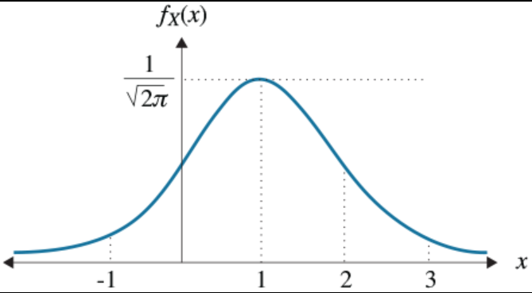

**Theorem**. Let $X \sim \text{Normal}(\mu, \sigma^2)$, then $E[X] = \mu$, and $\text{Var}(x) = \sigma^2$.

**Proof**. $f_X(x)$ is symmetric around $\mu$, so $E[X] = \mu$. To prove the variance:

$$
\begin{aligned}
\text{Var}(X)
&= \int_{-\infty}^\infty (x-\mu)^2 f_X(x) dx \\
&=  \frac{1}{\sqrt{2\pi}\sigma} \int_{-\infty}^\infty (x-\mu)^2 e^{-\frac{1}{2}((x-\mu)/\sigma)^2} dx \\
&= \frac{\sigma^2}{\sqrt{2\pi}} \int_{-\infty}^\infty y^2 e^{-y^2/2} dy
&& (\text{let } y = (x-\mu)/\sigma) \\
&=  \frac{\sigma^2}{\sqrt{2\pi}} \int_{-\infty}^\infty y \cdot (ye^{-y^2/2}) dy \\
&= \frac{\sigma^2}{\sqrt{2 \pi}}(-ye^{-y^2/2}) \bigg\rvert_{-\infty}^\infty + \frac{\sigma^2}{\sqrt{2\pi}}\int_{-\infty}^\infty e^{-y^2/2}dy
&& (\text{integration by parts}) \\
&= \frac{\sigma^2}{\sqrt{2\pi}} \int_{-\infty}^\infty e^{-y^2/2} dy \\
&= \sigma^2
&& (\text{by the well known integral}) \\
\end{aligned}
$$

**Def**. If $X \sim \text{Normal}(0,1)$, then the c.d.f. of $X$ is denoted by

$$\Phi(x) = F_X(x) = P(X \le x) = \frac{1}{\sqrt{2\pi}} \int_{-\infty}^x e^{-t^2/2} dt$$

### Linear Transformation Property

**Theorem** (linear transformation property). Let $X \sim \text{Normal}(\mu, \sigma^2)$. Let
$$Y = aX + b$$

where $a > 0$ and $b$ are scalars. Then,
$$Y \sim \text{Normal}(a\mu + b, a^2 \sigma^2)$$

**Proof**.

$$\quad E[Y] = E[aX+b] = aE[X] + b = a\mu + b$$
$$\quad \text{Var}(Y) = a^2 \text{Var}(X) = a^2 \sigma^2$$

All that remains is to show that $f_Y(y)$ is Normally distributed. We express $f_Y(y)$ in terms of $f_X(\cdot)$.

$$
\begin{aligned}
F_Y(y)
&= P(Y \le y) \\
&= P(aX + b \le y)
&& \text{by definition} \\
&= P(X \le \frac{y-b}{a})
&& \text{rearranging} \\
&= F_X\left(\frac{y-b}{a}\right) \\
\end{aligned}
$$

Then,
$$
\begin{aligned}
f_Y(y)
&= \frac{d}{dy} F_Y(y)
&& \text{by the fundamental theorem of calculus} \\
&= \frac{d}{dy} F_X\left(\frac{y-b}{a}\right)
&& \text{by above} \\
&= F'_X\left(\frac{y-b}{a}\right) \cdot \frac{d}{dy}\left(\frac{y-b}{a}\right) 
&& \text{by the chain rule} \\
&= \frac{1}{a}f_X\left(\frac{y-b}{a}\right) \\
\end{aligned}
$$

Evaluating this, we have
$$f_Y(y) = \frac{1}{\sqrt{2\pi}(a\sigma)}e^{-(y-(b+a\mu))^2/2a^2\sigma^2}$$

Therefore, $f_Y(y)$ is a Normal p.d.f. with mean $a\mu + b$ and variance $a^2 \sigma^2$.

### The Cumulative Distribution Function

Unfortunately, there is no closed formula for the c.d.f. of the normal distribution, $\Phi_X(x)$. We must therefore use a table of numerically integrated results.

**Lemma**. Let $Y \sim \text{Normal}(0,1)$. Then, $\Phi(-k) = 1 - \Phi(k)$

**Proof**.

$$
\begin{aligned}
\Phi(-k)
&= P(Y \le -k) = P(Y < -k) \\
&= P(Y > k)
&& \text{by normal is symmetric} \\
&= 1 - P(Y < k) \\
&= 1 - \Phi(k) \\
\end{aligned}
$$

**Claim**. If $Y \sim \text{Normal}(0,1)$, the probability that $Y$ is within $k$ standard deviations of its mean is

$$P(-k < Y < k) = 2\Phi(k) -1$$

**Proof**.

$$
\begin{aligned}
P(-k < Y < k)
&= P(Y < k) - P(Y < -k) \\
&= P(Y < k) - (1 - P(Y < k))
&& \text{by the lemma}  \\
&= 2\Phi(k) - 1 \\
\end{aligned}
$$

**Theorem**. If $X \sim \text{Normal}(\mu, \sigma^2)$, then the probability that $X$ deviates from its mean by less than $k$ standard deviations is the same as the probability that the standard Normal deviates from its mean by less than $k$. i.e.

$$P(-k\sigma < X - \mu < k\sigma) = P(-k < Z < k)$$

where $Z \sim \text{Normal}(0,1)$.

**Proof**.

Recall the linear transformation property.That is,
$$X \sim \text{Normal}(\mu, \sigma^2) \iff Z = \frac{X - \mu}{\sigma} \sim \text{Normal}(0,1)$$

Then,

$$
\begin{aligned}
P(-k\sigma < X - \mu < k\sigma)
&= P\left(-k < \frac{X - \mu}{\sigma} < k\right) \\
&= P(-k < Z < k) \\
\end{aligned}
$$

### Central Limit Theorem

**Theorem** (central limit theorem). Let $X_1, X_2, \cdots, X_n$ be a sequence of i.i.d random variables with common mean $\mu$ and finite variance $\sigma^2$, and define

$$S_n = \sum_{i=1}^n X_i \quad \text{and} \quad Z_n = \frac{S_n - n\mu}{\sigma \sqrt{n}}$$

Then the distribution of $Z_n$ converges to the standard normal, $\text{Normal}(0, 1)$, as $n \to \infty$. That is,

$$\lim_{n \to \infty}P(Z_n \le z) = \Phi(z) = \frac{1}{\sqrt{2\pi}} \int_{-\infty}^z e^{-x^2/2} dx$$

for every $z$.

**Fact**. The sum of i.i.d. random variables converge to a normal distribution **only** once normalised.

* The mean and standard deviation of $S_n$ are as follows:

$$\quad \quad E[S_n] = n \cdot E[X_1] = n\mu$$
$$\quad \quad \text{Var}(S_n) = n \cdot \text{Var}(X_1) = n\sigma^2, \text{ so } \text{std}(S_n) = \sigma\sqrt{n}$$

* $S_n$ does not converge to a normal, as $n\mu \to \infty$ and $n\sigma^2 \to \infty$. We cannot have a distribution with infinite mean and variance.

* However, we can normalise $S_n$ to have mean $0$ and standard deviation $1$, which *does* converge.

**Fact**. The average $A_n = \frac{1}{n}S_n$ does converge to a normal. It converges to a normal distribution with mean $\mu$ and variance $\sigma^2/n$.

* We actually have $A_n \overset{d}{\to} \mu$ ("convergence in distribution").

* By the **strong law of large numbers**, 

$$\lim_{n \to \infty} P(A_n \le x) = P(\mu \le x) \in \{0, 1\}$$

* as $\mu$ is just a constant. Hence, $A_n$ converges to a normal with mean $\mu$ and variance $0$ in the limit.

$$\lim_{n \to \infty} A_n \sim N(\mu, 0)$$

## 8. The Poisson Process

> Chapter 12: The Poisson Process

### Relating the Exponential Distribution to the Geometric

#### Recap of Exponential

**Recap**. Let $X \sim \text{Exp}(\lambda)$. It's probability density function is

$$f_X(x) = \begin{cases} \lambda e^{-\lambda x} & x \ge 0 \\ 0 & x < 0\end{cases}$$

Its cumulative distribution function is given by

$$F_X(x) = \begin{cases} 1 - e^{-\lambda x} & x \ge 0 \\ 0 & x < 0\end{cases}$$
$$\bar{F}_X(x) = 1 - F_X(x) = e^{-\lambda x}, \quad x \ge 0$$

Observe that both $f_X(x)$ and $\bar{F}_X(x)$ drop off by a *constant* factor, $e^{-\lambda}$, with each unit increase of $x$.

We also have,

$$E[X] = \frac{1}{\lambda} \quad \quad \text{Var}(X) = \frac{1}{\lambda^2} \quad \quad C_X^2 = \frac{\text{Var}(X)}{E[X]^2} = 1$$

$X$ also exhibits the memoryless property, which says that

$$P(X > s + t \space | \space X > s) = P(X > t), \quad \forall s, t \ge 0$$

**Failure Rate**. The exponential distribution has **constant failure rate** equal to $\lambda$.

#### Delta-Step Proof

**Lemma** (limit definition of $e^{-1}$).

$$\lim_{n \to \infty} \left(1-\frac{1}{n}\right)^n = e^{-1}$$

The Exponential distribution is the continuous counterpart to the Geometric distribution. 

Let $Y \sim \text{Geo}(p := \lambda \delta)$, i.e. at each time step, we flip a $\lambda \delta$-coin, and $Y$ is the number of flips to get heads.

Let $Z_\delta$ = time until heads comes up. Note that this is a *continuous variable*.

$$
\begin{aligned}
P(Z_\delta > t)
&= P(\text{number of flips} > \frac{t}{\delta} \text{ failures}) \\
&= (1-p)^\frac{t}{\delta} 
&& \text{because number of flips is now discrete} \\
&= (1 - \lambda \delta)^\frac{t}{\delta} \\
&= \left[\left(1- \frac{1}{\frac{1}{\lambda \delta}}\right)^ \frac{1}{\lambda \delta}\right]^{t \lambda}
&& \text{writing it in the form of the lemma} \\
\end{aligned}
$$

So in the limit, as $\delta \to 0$, we have $\frac{1}{\lambda\delta} \to \infty$. Therefore,

$$\lim_{\delta \to 0} P(Z_\delta > t) = (e^{-1})^{\lambda t} = e^{-\lambda t}$$

Hence, $\lim_{\delta \to 0} Z_\delta \sim \text{Exp}(\lambda)$.

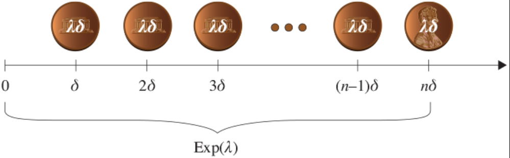

**Theorem**. Let $X \sim \text{Exp}(\lambda)$. Then $X$ represents the time to a successful event, given that an event occurs every $\delta$-step and is successful with probability $\lambda \delta$, where $\delta \to 0$.

### More properties of the exponential

#### useful definition: $o(\delta)$ notation

**Def**. Let $f$ be a function of $\delta$.
$$f = o(\delta) \quad \text{if} \lim_{\delta \to 0} \frac{f}{\delta} = 0$$

**Intuition**. $f = o(\delta)$ if $f$ goes to zero faster than $\delta$.

#### which exponential happens first

**Theorem**. Let $X_1 \sim \text{Exp}(\lambda_1)$ and $X_2 \sim \text{Exp}(\lambda_2)$ and $X_1 \perp X_2$. Then,

$$P(X_1 < X_2) = \frac{\lambda_1}{\lambda_1 + \lambda_2}$$

**Classical proof**. The traditional algebraic proof uses the law of total probability conditioning on $X_2$ and using independence.

**Proof** (delta-step argument).

Consider flipping two independent coins, one $\lambda_1 \delta$-coin and one $\lambda_2 \delta$-coin at each $\delta$-step. $P(X_1 < X_2)$ is asking, given a success occurred, what is the probability that it is the first coin?

$$
\begin{aligned}
P(X_1 \le X_2)
&= P(\text{coin 1 is H } | \text{ either coin 1 or 2 is H}) \\
&= \frac{P(\text{coin 1 is H})}{P(\text{either coin is H})} \\
&= \frac{\lambda_1 \delta}{\lambda_1 \delta + \lambda_2 \delta - \lambda_1 \lambda_2 \delta^2}
&& \text{by independence} \\
&= \frac{\lambda_1 \delta}{\lambda_1 \delta + \lambda_2 \delta - o(\delta)}
&& \text{by } \delta^2 = o(\delta) \\
&= \frac{\lambda_1}{\lambda_1 + \lambda_2 - \frac{o(\delta)}{\delta}}
&& \text{dividing through by } \delta \\
&\to \frac{\lambda_1}{\lambda_1 + \lambda_2} \quad \text{as } \delta \to 0. \\
\end{aligned}
$$

#### min of two exponentials

**Theorem**. Given $X_1 \sim \text{Exp}(\lambda_1), X_2 \sim \text{Exp}(\lambda_2)$, $X_1 \perp X_2$. Let

$$X = \min(X_1, X_2)$$

Then,

$$X \sim \text{Exp}(\lambda_1 + \lambda_2)$$

**Classical proof**. The traditional algebraic proof expresses $P(\min(X_1, X_2) > t)$ as $P(X_1 > t \text{ and } X_2 > t)$, and uses independence.

**Proof** (delta-step argument).

Consider flipping two independent coins, one $\lambda_1 \delta$-coin and one $\lambda_2 \delta$-coin at each $\delta$-step. We are interested in the probability either coin is heads, as either one is enough to make the minimum occur.

$$
\begin{aligned}
P(\text{minimum occurs})
&= P(\text{either coin is H}) \\
&= P(\text{coin 1 is H}) + P(\text{coin 2 is H}) - P(\text{both are H}) \\
&= \lambda_1 \delta + \lambda_2 \delta - \lambda_1 \lambda_2 \delta^2
&& \text{by independence} \\
&= \underbrace{\left(\lambda_1 + \lambda_2 - \frac{o(\delta)}{\delta}\right)}_\text{rate} \cdot \delta
&& \text{factoring out } \delta \\
\end{aligned}
$$

We are interested in the rate, which is
$$\lambda_1 + \lambda_2 - \frac{o(\delta)}{\delta} \to \lambda_1 + \lambda_2 \quad \text{as } \delta \to 0$$

Therefore, $X \sim \text{Exp}(\lambda_1 + \lambda_2)$.

**Note**. The $\max$ of two exponentials is **not** an exponential.

### The Poisson Process

#### Introduction

**Recap**. If $X \sim \text{Poisson}(\lambda)$, we have

$$p_X(i) = \frac{e^{-\lambda} \lambda^i}{i!}, \quad i = 0, 1, 2, \cdots$$
$$E[X] = \text{Var}(X) = \lambda$$

The Poisson process  is the most widely used model for outside arrivals into a system. Two reasons for its popularity:

1. analytically tractable
2. represents the limiting process when many independent users are merged

**Def**. A **stochastic process** is a collection of random variables indexed by time, e.g. $X_t$ = temperature at time $t$.

**Def**. A *univariate* process is a process with one parameter. A *bivariate* process is a process with two parameters.

The Poisson process is a stochastic arrival process - it is a sequence of arrivals indexed by time. The arrival times are called "events".

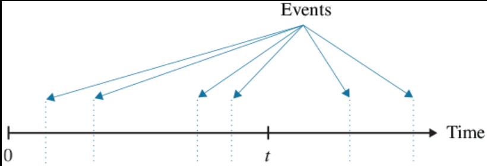

##### Definitions

**Def**. For any sequence of events, we define
$$N(t) = \text{number of events in the interval } [0, t], \quad t \ge 0$$

* $N(t)$ is a discrete random variable indexed by $t$.

**Def**. An event sequence has **independent increments** if the number of events that occur in disjoint time intervals are independent. Specifically, for all $t_0 < t_1 < t_2 < \cdots < t_n$, we have

$$N(t_1) - N(t_0) \perp N(t_2) - N(t_1) \perp \cdots \perp N(t_n) - N(t_{n-1})$$

**Def**. An event sequence has **stationary increments** if the number of events during a time period only depends on the length of the time period and not on its starting point. That is,

$$N(t+s) - N(s) \text{ have the same distribution } \forall s$$

Given two non-overlapping intervals $[t_1, t_2]$ and $[t_3, t_4]$

**Independent Increments** means intervals are independent, i.e.

$$N(t_2) - N(t_1) \perp N(t_4) - N(t_3)$$

**Stationary Increments** means intervals have the same distribution, i.e.

$$N(t_2) - N(t_1) \overset{d}{=} N(t_4) - N(t_3)$$

#### Definition 1 of the Poisson Process

**Def** (first definition of poisson process). A Poisson process with rate $\lambda$ is a sequence of events such that

1. $N(0) = 0$
2. The process has *independent increments*
3. The number of events in any interval of length $t$ is Poisson distributed with mean $\lambda t$. That is, $\forall s, t \ge 0$,

$$P(N(t+s) - N(s) = n) = \frac{e^{-\lambda t}(\lambda t)^n}{n!} \quad n = 0, 1, \cdots$$

**Note**. $\lambda$ is called the **rate** of the process because $E[N(t)] = \lambda t$, so the rate of the events is $\frac{E[N(t)]}{t} = \lambda$.

**Note**. We only specify *independent increments* as the third item in the definition already implies stationary increments.

**Fact**. If a process has **both** stationary and independent increments, it has the **memoryless property**.

#### Definition 2 of the Poisson Process

**Def** (second definition of poisson process). A Poisson process with rate $\lambda$ is a sequence of events such that the inter-event times are i.i.d. $\text{Exp}(\lambda)$ random variables and $N(0) = 0$.

**Fact**. These two definitions are equivalent (proof is omitted)

To simulate a poisson process, we use the *second* definition as inter-arrival times are just instances of $\text{Exp}(\lambda)$.

### Number of Poisson Arrivals during a Random Time

Suppose jobs arrive to a system according to a Poisson process with rate $\lambda$. We wish to understand how many arrivals occur during time $S$. For example, $S$ might represent the time that a job is being processed.

**Def**. Assume that arrivals occur according to a Poisson process with rate $\lambda$. We define,

$$A_t = N(t) = \text{Number of arrivals during time } t$$

and

$$A_S = \text{Number of arrivals during time } S$$

where $S$ is a non-negative random variable independent of the Poisson process.

**Claim**. $E[A_t] = \lambda t$

**Proof**. $t$ is non-random so we have $E[A_t] = E[N(t)] = \lambda t$

**Claim**. $\text{Var}(A_t) = \lambda t$

**Proof**. Recall that $A_t = N(t) \sim \text{Poisson}(\lambda t$). Thus, $\text{Var}(A_t) = \lambda t$.

**Claim**. $E[A_S] = \lambda \cdot E[S]$.

**Proof**.

$$
\begin{aligned}
E[A_S]
&= \int_0^\infty E[A_S | S = s] f_S(s) ds
&& \text{law of total probability conditioning on } S \\
&= \int_0^\infty E[A_s | S = s] f_S(s) ds
&& \text{replacing } S \text{ with } s \\
&= \int_0^\infty E[A_s] f_S(s) ds
&& \text{by independence} \\
&= \int_0^\infty \lambda s \cdot f_S(s) ds
&& \text{by the claim above} \\
&= \lambda \cdot \int_0^\infty s f_S(s) ds \\
&= \lambda \cdot E[S] \\
\end{aligned}
$$

### Merging Independent Poisson Processes

**Theorem** (Poisson merging). Given two independent Poisson processes, where process 1 has rate $\lambda_1$ and process 2 has rate $\lambda_2$, the merge of process 1 and process 2 is a single Poisson process with rate $\lambda_1 + \lambda_2$.

**Proof**.

Let $X_i \sim \text{Exp}(\lambda_1)$ be the inter-arrival times for Process 1, and $Y_i \sim \text{Exp}(\lambda_2)$ be the inter-arrival times for Process 2.

Let $Z_i$ be the inter-arrival times of the combined process. The time until the first event from either process, $Z_1$, is the minimum of $X_1$, and $Y_1$, which is distributed $\text{Exp}(\lambda_1 + \lambda_2)$ by a previous result. Assuming $X_1 < Y_1$, the second inter-arrival time of the combined process is $\min(X_2, Y_1 - X_1 | X_1 < Y_1)$. We have

$$Y_1 - X_1 \space | \space X_1 < Y_1 \sim \text{Exp}(\lambda_2) \quad \text{by the memoryless property}$$

So, the second inter-arrival time $Z_2$ is also distributed $\text{Exp}(\lambda_1 + \lambda_2)$. Using the second definition, we have a Poisson process of rate $\lambda_1 + \lambda_2$.

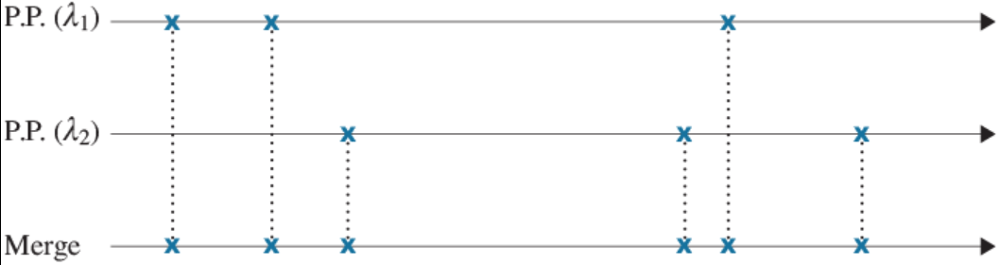

### Poisson Splitting

**Theorem** (Poisson splitting). Given a Poisson process with rate $\lambda$, suppose that each event is labeled "type A" with probability $p$ and "type B" with probability $1-p$.

Then the type A events form a Poisson process with rate $p\lambda$, and type B events form a Poisson process with rate $(1-p)\lambda$, and these two processes are independent.

**Proof**.

Originally, we flipped a $\lambda \delta$-coin every $\delta$-step to determine when an event occurs: this is the *first coin*.

Suppose we toss a *second coin*, a $p$-coin every $\delta$-step to determine the type of each event. Only if *both* the first and second coin have successes then we have a **type A success**. But this is equivalent to flipping a single $\lambda \delta p$-coin for success. The time betwen successes for the single coin is distributed $\text{Exp}(\lambda p)$. By the second definition, type A events belong to a Poisson process with rate $\lambda p$. This argument can be repeated for **type B successes** as well. 

Hence, we can split the Poisson process into two independent parts, one with rate $\lambda p$ and one with rate $\lambda (1-p)$. Crucially, the rates **add up to** $\lambda$.

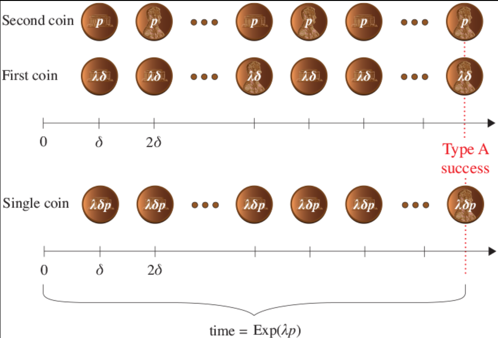

### Uniformity

**Theorem**. Given that one event of a Poisson process has occurred by time $t$, the event is equally likely to have occurred anywhere in $[0, t]$.

**Proof**.

Let $T_1$ denote the time of that one event.

$$
\begin{aligned}
P(T_1 < s \space | \space N(t) = 1)
&= \frac{P(T_1 < s \text{ and } N(t) = 1)}{P(N(t) = 1)} \\
&= \frac{P(\text{1 event in } [0, s] \text{ and 0 events in } [s, t])}{\frac{e^{-\lambda t} (\lambda t)^1}{1!}} \\
&= \frac{P(N(0, s) = 1) \cdot P(N(s, t) = 0)}{e^{-\lambda t} \cdot \lambda t}
&& \text{by independent increments} \\
&=\frac{e^{-\lambda s} \cdot \lambda s \cdot e^{-\lambda (t - s)} \cdot (\lambda(t-s))^0}{e^{-\lambda t} \cdot \lambda t}
&& \text{by definition} \\
&= \frac{s}{t} \\
\end{aligned}
$$

Therefore, 

$$[T_1 \space | \space N(t) = 1] \sim \text{Uniform}(0, t)$$

**Generalisation**. If $k$ events of a Poisson process occur by time $t$, then the $k$ events are distributed independently and uniformly in $[0, t]$.

## 9. Discrete-Time Markov Chains: Finite-State

> Chapter 24: Discrete-Time Markov Chains: Finite-State

### Definition

**Def**. A **discrete-time Markov chain** (DTMC) is a *stochastic process* $\{X_n, n = 0, 1, 2, \cdots\}$ where $X_n$ denotes the state at (discrete) time step $n$ and such that $\forall n \ge 0$, $\forall i, j$ and $\forall i_0, \cdots, i_{n-1} \in \mathbb{Z}$,

$$
\quad
P(X_{n+1} = j \space | \space X_n = i, X_{n-1} = i_{n-1}, \cdots, X_0 = i_0) \\
\quad \quad \quad = P(X_{n+1} = j \space | \space X_n = i) \quad \quad \text{(Markovian property)} \\
\quad \quad \quad = P_{ij} \quad \quad \text{(stationary property)} \\
$$

where $P_ij$ is independent of the time step and past history.

**Markovian Property**. This states that the conditional distribution of any future state $X_{n+1}$ is *independent of past states* $X_0, \cdots, X_{n-1}$ and **depends only on the present state** $X_n$.

**Stationary Property**. Indicates that the transition probability, $P_{ij}$, is independent of the time step, $n$.

**Def**. The **transition probability matrix** associated with any DTMC is a matrix $\textbf{P}$, whose $(i,j)$th entry, $P_{ij}$, represents the probability of moving to state $j$ on the next transition, given that the current state is $i$.

**Observation**. By definition, $\sum_{j} P_{ij} = 1, \forall i$, because we must make a transition no matter what state we are in.

#### Example

Absent-minded professor has two umbrellas. Professor commutes between home and office.
* If raining & an umbrella is available $\implies$ take umbrella
* If not raining $\implies$ always forget to take umbrella

It rains with probability $p$ on each commute. Determine the fraction of commutes during which the professor gets wet.

We draw a DTMC with three states: the number of umbrellas available at the current location, regardless of what the current location is. Thus, states are $0, 1, 2$. Each transition represents a commute.

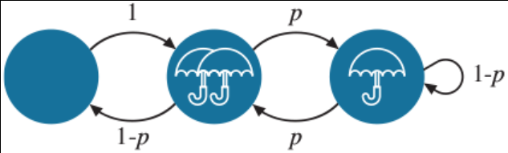

The transition probability matrix is

$$\textbf{P} = \begin{bmatrix}0 & 0 & 1 \\ 0 & 1-p & p \\ 1-p & p & 0 \end{bmatrix}$$

The probability of getting wet is the probability of staying in state $0$.

### Powers of $\textbf{P}$

**Def**. Let $\textbf{P}^n = \textbf{P} \cdot \textbf{P} \cdots \textbf{P}$, multiplied $n$ times. Then $(\textbf{P}^n)_{ij}$ denotes the $(i,j)$th entry of matrix $\textbf{P}^n$. We also use the shorthand notation:

$$P^n_{ij} \equiv (\textbf{P}^n)_{ij}$$

**Claim**. $P^n_{ij}$ represents the probability of transitioning from state $i$ to state $j$ in $n$ transitions.

**Intuition**.

By definition, 

$$(\textbf{P}^2)_{ij} = \sum_k P_{ik} \cdot P_{kj}$$

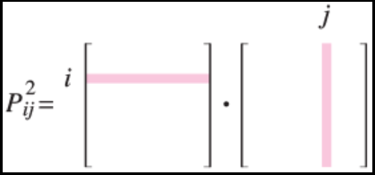

This is the law of total probability by conditioning on $k$:

$$
\begin{aligned}
P(i \to j \text{ in 2 steps})
&= \sum_k P(k \to j \text{ in 1 step } | \space i \to k) \cdot P(i \to k) \\
&= \sum_k \frac{P(i \to k, k \to j)}{P(i \to k)} \cdot P(i \to k) \\
&= \sum_k P_{ik} \cdot P_{kj} \\
&= (\textbf{P}^2)_{ij} \\
\end{aligned}
$$

Likewise, the $n$-wise product can be viewed by conditioning on the state $k$ after $n-1$ time steps:

$$
\begin{aligned}
(\textbf{P}^n)_{ij}
&= \sum_{k} (\textbf{P}^{n-1})_{ik} \cdot P_{kj} \\
&= \text{probability of being in state } j \text{ in } n \text{ steps, given we are in state } i \\
\end{aligned}
$$

### Limiting Probabilities

Consider the $(i,j)$th entry of the power matrix $\textbf{P}^n$ for large $n$:

$$\lim_{n \to \infty} (\textbf{P}^n)_{ij} \equiv (\lim_{n \to \infty} \textbf{P}^n)_{ij}$$

This quantity represents the **limiting probability** of being in state $j$ infinitely far into the future, given that we started in state $i$.

**Fact**. If the limiting probability matrix exists, $(\textbf{P}^n)_{ij}$ is the same for all values of $i$, i.e. all the rows are the same. 
* **Interpretation**: This says that the starting state, $i$, does not matter.

**Def**. Let 

$$\pi_j = \lim_{n \to \infty} (\textbf{P}^n)_{ij}$$

$\pi_j$ represents the **limiting probability** that the chain is in state $j$, independent of the starting state $i$. For an $M$-state DTMC, with states $0, 1, \cdots, M-1$,

$$\vec{\pi} = (\pi_0, \pi_1, \cdots, \pi_{M-1}), \quad \text{ where } \sum_{i=0}^{M-1} \pi_i = 1$$

represents the **limiting distribution** of being in each state.

### Stationary Equations

**Stationary equations** are a way to determine $\pi_j = \lim_{n \to \infty}(\textbf{P}^n)_{ij}A$. This a more efficient method than multiplying $\textbf{P}$ by itself many times, which would involve performing a large number of multiplications.

**Def**. A probability distribution $\vec{pi} = (\pi_0, \pi_1, \cdots, \pi_{M-1})$ is said to be **stationary** for the Markov chain with transition matrix $\textbf{P}$ if

$$\vec{\pi} \cdot P = \vec{\pi} \text{ and } \sum_{i=0}^{M-1} \pi_i = 1$$

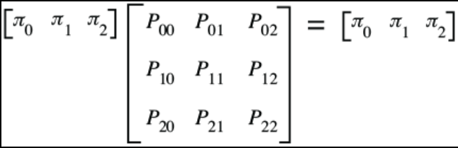

Doing the row-by-column multiplication results in the following **stationary equations**, written compactly as follows:

$$\sum_{i=0}^{M-1} \pi_i P_{ij} = \pi_j, \forall j \quad \text{ and } \quad \sum_{i=0}^{M-1} \pi_i = 1$$

**Intuition**. $\vec{\pi}$ is called stationary because if you transition from the stationary distribution, the distribution remains the same. It is possible to be stationary from day 1.

#### Relating Stationary and Limiting Distributions

**Theorem** (stationary distribution = limiting distribution). In a finite-state DTMC with $M$ states, let

$$\pi_j = \lim_{n \to \infty} (\textbf{P}^n)_{ij}$$

be the limiting probability of being in state $j$ (independent of the starting state $i$) and let

$$\vec{\pi} = (\pi_0, \pi_1, \cdots, \pi_{M-1}), \quad \text{where } \sum_{i=0}^M-1 \pi_i = 1$$

be the limiting distribution. **Assuming that $\vec{\pi}$ exists**, then $\vec{\pi}$ is *also a stationary distribution* and *no other stationary distribution exists*.

**Intuition**. Provided the limiting distribution exists, you reach the stationary distribution
* alternatively, we start at time $0$ and flip a multiway coin to determine the start state.
* we will always reach $\pi_j$ if it exists, no matter what random initial state we start from.

**Impact**. Assuming the limiting distribution exists, we don't need the brute force approach of raising $\textbf{P}$ to a high power. We can solve the stationary equations to find the limiting distribution.

**Fact**. This is a *one-way implication*. Having a stationary distribution **does not imply** a limiting distribution as the limit may not exist (it oscillates forever).

**Def**. A **periodic Markov chain** is a DTMC where there is a period to get from a state to itself. Here, there is **no limiting distribution**.

**Def**. A Markov chain for which the limiting probabilities exist is said to be in **stationary** or in **steady state** if the initial state is chosen according to the stationary probabilities.

##### Proof

We prove two things about the limiting distribution $\vec{\pi}$.
1. We prove that $\vec{\pi} = (\pi_0, \pi_1, \cdots, \pi_{M-1})$ is a stationary distribution. Hence, at least one stationary distribution exists.
2. We prove that any stationary distribution must be equal to the limiting distribution.

**Part 1**.

Intuitively, if we have some limiting distribution, then once you get there, you should stay there forever - "if we make one more step, we don't change anything".

We need to show,

$$\vec{\pi} = \vec{\pi} \cdot \textbf{P} \iff \sum_k \pi_k \cdot P_{kj} = \pi_j, \forall j$$

$$
\begin{aligned}
\pi_j
&= \lim_{n \to \infty} (\textbf{P}^n)_{ij}
&& \text{by definition of limiting distribution} \\
&= \lim_{n \to \infty} (\textbf{P}^{n-1} \cdot \textbf{P})_{ij}
&& \text{split matrix into two parts} \\
&= \lim_{n \to \infty} \left[\sum_k (\textbf{P}^{n-1})_{ik} \cdot P_{kj}\right]
&& \text{using matrix multiplication formula} \\
&=  \sum_k \lim_{n \to \infty} (\textbf{P}^{n-1})_{ik} \cdot P_{kj}
&& \text{interchanging sum and limit} \\
&= \sum_k \pi_k \cdot P_{kj}
&& \text{by definition of } \pi_k \\
\end{aligned}
$$

**Part 2**.

Let $\vec{\pi}'$ be a stationary distribution, i.e. $\vec{\pi}' \cdot \textbf{P} = \vec{\pi}'$.

We need to show

$$\pi_j' = \pi_j := \lim_{n \to \infty} (\textbf{P}^n)_{ij}$$

$$
\begin{aligned}
& \vec{\pi}' \cdot \textbf{P} = \vec{\pi}' \\
\implies & \vec{\pi}' \cdot \textbf{P}^2 = \vec{\pi}' \cdot \textbf{P} = \vec{\pi}' \\
\implies & \vec{\pi}' \cdot \textbf{P}^n = \vec{\pi}'
&& \text{by induction} \\
\implies & \sum_{k} \pi_k' \cdot (\textbf{P}^n)_{kj} = \pi_j', \forall j
&& \text{by the matrix multiplication formula} \\
\implies & \left[\lim_{n \to \infty} \sum_k \pi_k' (\textbf{P}^n)_{kj}\right] = \lim_{n \to \infty} \pi_j' = \pi_j'
&& \text{taking limits of both sides} \\
\implies & \sum_k \pi_k' \lim_{n \to \infty} [(\textbf{P}^n)_{kj}] = \pi_j'
&& \text{interchanging sum and limit} \\
\implies & \sum_k \pi_k' \pi_j = \pi_j'
&& \text{applying definition for } \pi_j \\
\implies & \pi_j = \pi_j'
&& \text{by } \sum_k \pi_k' = 1 \\
\end{aligned}
$$

Here, we are allowed to pull the limit into the summation sign in both parts because we had finite sums ($M$ is finite).

## 10. Estimators for Mean and Variance

> Chapter 15: Estimators for Mean and Variance

### Introduction to Statistics

**Probability**: answers questions about *data* given a known *probability model*

**Statistics**: aims to infer the probability model **generating** that data

**Example**. I flip a fair coin $n$ times. 

**Probability Question**. What is the expectation of the number of heads?

Let $X_i \sim \text{Bernoulli}(p)$ be i.i.d. random variables representing the $i$th flip. Let $X$ be the number of heads.

$$E[X] = E[X_1 + \cdots + X_n] = n \cdot E[X_1] = np$$

**Statistics Question**. Here is a sequence of coin flip results. Did I use a fair coin?

### Point Estimation

**Point estimation** is an estimation method that outputs a single value.

**An example**. We want to estimate the number of books the average person reads each year. We sample $n$ people at random and ask them how many books they read. Let $X_1, X_2, \cdots, X_n$ be the sample data. We assume that each $X_i$ is i.i.d. We want to estimate $\theta = E[X]$. A reasonable point estimator for $\theta$ is the average of the $X_i$'s sampled.

**Def**. We write

$$\hat{\theta}(X_1, X_2, \cdots, X_n)$$

to indicate an **estimator** of the unknown value $\theta$. Here, $X_1, \cdots, X_n$ represent the sampled data and our estimator is a function of this data. 

**Importantly**, $\hat{\theta}(X_1, X_2, \cdots, X_n)$ is a *random variable* since it is a function of random variables. We sometimes write $\hat{\theta}$ for short.

We write 

$$\hat{\theta}(X_1 = k_1, X_2 = k_2, \cdots, X_n = k_n)$$

to indicate the **constant** which represents our estimation of $\theta$ after seeing the data $\{X_1 = k_1, \cdots, X_n = k_n\}$. This is a *deterministic quantity*.

### Sample Mean

**Def** (mean estimator). Let $X_1, X_2, \cdots, X_n$ be i.i.d samples of a random variable $X$ with unknown mean. The **sample mean** is a point estimator of $\theta = E[X]$. It is denoted by $\overline{X}$ and defined by

$$\hat{\theta}(X_1, X_2, \cdots, X_n) = \overline{X} \equiv \frac{X_1 + X_2 + \cdots + X_n}{n}$$

### What makes a point estimator good?

#### Bias, Mean Squared Error

**Def**. Let $\hat{\theta}(X_1, X_2, \cdots, X_n)$ be a point estimator for $\theta$. Then we define the **bias** of $\hat{\theta}$ by

$$\textbf{B}(\hat{\theta}) = E[\hat{\theta}] - \theta$$

If $\textbf{B}(\hat{\theta}) = 0$, we say that $\hat{\theta}$ is an *unbiased estimator* of $\theta$. Clearly we would like our estimator to have zero bias.

**Def**. The **mean squared error** (MSE) of an estimator $\hat{\theta}(X_1, X_2, \cdots, X_n)$ is defined as

$$\textbf{MSE}(\hat{\theta}) = E[(\hat{\theta} - \theta)^2]$$

**Lemma**. If $\hat{\theta}$ is an unbiased estimator, then

$$\textbf{MSE}(\hat{\theta}) = \text{Var}(\hat{\theta})$$

**Proof**.

$$
\begin{aligned}
\textbf{MSE}(\hat{\theta})
&= E[(\hat{\theta} - \theta)^2]
&& \text{by definition} \\
&= E[(\hat{\theta} - E[\hat{\theta}])^2]
&& \text{if } \hat{\theta} \text{ is unbiased, then } E[\hat{\theta}] = \theta \\
&= \text{Var}(\hat{\theta}) \\
\end{aligned}
$$

#### Example

Let $X-1, \cdots, X_n$ be i.i.d. samples of random variable $X$. We wish to estimate the parameter $\theta = E[X]$. Consider two point estimators

$$\hat{\theta}_A = \overline{X} = \frac{X_1 + \cdots + X_n}{n}$$
$$\hat{\theta}_B = X_2$$

Both estimators are *unbiased*.

$$\quad E[\hat{\theta}_A] = E\left[\frac{X_1 + \cdots X_n}{n}\right] = \frac{n \cdot E[X_1]}{n} = E[X_1] = E[X]$$

$$\quad E[\hat{\theta}_B] = E[X_2] = E[X]$$

However, $\hat{\theta}(A)$ has a lower MSE, which is more desirable.

$$
\begin{aligned}
\quad \textbf{MSE}(\hat{\theta}_A)
&= \text{Var}(\hat{\theta}_A)
&& \text{because } \hat{\theta}_A \text{ is unbiased.} \\
&= \text{Var}\left(\frac{X_1 + \cdots +X_n}{n}\right) \\
&= \frac{1}{n^2} \cdot n \cdot \text{Var}(X) \\
&= \frac{\text{Var}(X)}{n} \underset{n \to \infty}{\to} 0 \\
\end{aligned}
$$

$$\quad \textbf{MSE}(\hat{\theta}_B) = \text{Var}(\hat{\theta}_B) = \text{Var}(X_2) = \text{Var}(X) \quad \text{ which does not converge to 0}$$

#### Consistency

**Def** (consistency). Let $\hat{\theta}_1(X_1), \hat{\theta}_2(X_1,X_2), \hat{\theta}_3(X_1,X_2,X_3)$ be a sequence of point estimators of $\theta$, where $\hat{\theta}_n(X_1, X_2, \cdots, X_n)$ is a function of $n$ i.i.d samples. We say that random variable $\hat{\theta}_n$ is a **consistent estimator** of $\theta$, if $\forall \epsilon > 0$

$$\lim_{n \to \infty} P(|\hat{\theta}_n - \theta| \ge \epsilon) = 0$$

**Idea**. $\theta_n$ converges to $\theta$ probabilistically as we add on more i.i.d. random variables to the estimator.

**Lemma**. Using same variables as the above definition, assume all estimators have finite mean and variance. If

$$\lim_{n \to \infty} \textbf{MSE}(\hat{\theta}_n) = 0$$

then $\hat{\theta}_n$ is a consistent estimator.

**Note**. This is a *one way implication*.

In the above example, $\hat{\theta}_A$ is a consistent estimator, but we can't say anything about $\hat{\theta}_B$.

##### Proof

For any constant $\epsilon > 0$,

$$
\begin{aligned}
P(|\hat{\theta}_n - \theta| \ge \epsilon)
&= P(|\hat{\theta}_n - \theta|^2 \ge \epsilon^2) \\
&\le \frac{E\left[|\hat{\theta}_n - \theta|^2\right]}{\epsilon^2}
&& \text{by Markov's inequality} \\
&= \frac{E\left[(\hat{\theta}_n - \theta)^2\right]}{\epsilon^2} \\
&= \frac{\textbf{MSE}(\hat{\theta}_n)}{\epsilon^2} \\
\end{aligned}
$$

Taking limits of both sides as $n \to \infty$, we have

$$\lim_{n \to \infty} P(|\hat{\theta}_n - \theta| \ge \epsilon) \le \lim_{n \to \infty} \frac{\textbf{MSE}(\hat{\theta}_n)}{\epsilon^2} = 0$$

But we also have $P(|\hat{\theta}_n - \theta| \ge \epsilon) \ge 0$. So by the squeeze theorem,

$$\lim_{n \to \infty}P(|\hat{\theta}_n - \theta| \ge \epsilon) = 0$$

Therefore $\hat{\theta}_n$ is a consistent estimator.

### Estimating variance

Let $X-1, \cdots X_n$ be i.i.d samples of random variable $X$. We wish to estimate $\theta = \text{Var}(X)$.

There are two distinct cases to consider:
1. when the mean $\mu = E[X]$ is known
2. when the mean $\mu = E[X]$ is unknown

#### when $\mu = E[X]$ is known

We can use the estimator

$$\hat{\theta}(X_1, \cdots,X_n) = \frac{1}{n} \sum_{i=1}^n (X_i - \mu)^2 \equiv \overline{S^2}$$

This is an unbiased estimator for $\theta = \text{Var}(X)$, as

$$
\begin{aligned}
E[\overline{S^2}]
&= E[\frac{1}{n} \sum_{i=1}^n (X_i - \mu)^2] \\
&= \frac{1}{n} \cdot n \cdot E[(X_1 - \mu)^2]
&& \text{as all } X_i { are i.i.d.} \\
&= \text{Var}(X_1) \\
&= \text{Var}(X) \\
\end{aligned}
$$

#### when $\mu = E[X]$ is unknown

Given that we don't known $\mu = E[X]$, we can replace $\mu$ in our estimator with the *sample mean*, as we already saw it was a good estimator for $E[X]$.

$$\overline{S^2} = \frac{1}{n} \sum_{i=1}^n (X_i - \overline{X})^2$$

However, this is not an unbiased estimator, as

$$E[\overline{S^2}] = \frac{n-1}{n} \cdot \text{Var}(X)$$

To fix, this we multiply $\overline{S^2}$ by $\frac{n}{n-1}$.

**Def** (variance estimator). Let $X_1, X_2, \cdots, X_n$ be i.i.d. samples of random variable $X$ with unknown mean and variance. The **sample estimator** is a point estimator of $\theta = \text{Var}(X)$. It is denoted by $S^2$ and defined by

$$\hat{\theta}(X_1, X_2, \cdots, X_n) = S^2 \equiv \frac{1}{n-1} \sum_{i=1}^n (X_i - \overline{X})^2$$

**Proof**.

$$E[S^2] = \frac{n}{n-1} E[\overline{S^2}] = \frac{n}{n-1} \cdot \frac{n-1}{n} \cdot \text{Var}(X) = \text{Var}(X)$$

**Note**. $n-1$ reflects the degrees of freedom in the terms. Knowing $n-1$ terms gives you the last term. In practice, if $n$ is large, it doesn't matter which of these two estimators we use.

## 11. Covariance and Maximum Likelihood Estimators

> Chapter 16: Classical Statistical Inference

### Covariance

**Def**. Let $X$ and $Y$ be random variables. The **covariance** of $X,Y$ is defined as

$$\text{Cov}(X,Y) = E[(X - E[X])(Y - E[Y])]$$

It is a measure of the dependency between two random variables.

**Lemma**. $\text{Cov}(X,Y) = E[XY] - E[X]E[Y]$.

**Proof**.

$$
\begin{aligned}
\text{Cov}(X,Y)
&= E[(X - E[X])(Y - E[Y])] \\
&= E[XY - E[X] \cdot Y - X \cdot E[Y] + E[X]E[Y]]
&& \text{expanding the brackets} \\
&= E[XY] - E[X]E[Y] - E[X]E[Y] + E[X]E[Y]
&& \text{by linearity of expecation} \\
&= E[XY] - E[X]E[Y] \\
\end{aligned}
$$

**Fact**. $\text{Cov}(X, X) = \text{Var}(X)$.

**Def** (correlation). Let $X$ and $Y$ be random variables. If

$$\text{Cov}(X,Y) > 0 \quad \text{ then we have positive correlation between }  X \text{ and } Y$$
$$\text{Cov}(X,Y) < 0 \quad \text{ then we have negative correlation between } X \text{ and } Y$$

**Theorem**. If $X$ and $Y$ are independent, then $\text{Cov}(X,Y) = 0$.

**Proof**. When $X \perp Y$, $E[XY] = E[X][Y]$.

**Note**. When $\text{Cov}(X,Y) = 0$, this **does not mean** $X \perp Y$. It is a *one way implication*.

### Maximum Likelihood Estimation

**Maximum Likelihood Estimation** is a methodology used to derive an estimator. It finds the value $\theta$ that maximises the likelihood of seeing $X = x$.

**Algorithm** (Creating an ML estimator)

1. Define 
$$\hat{\theta}_\text{ML}(X = x) = \argmax_\theta P(X = x \space | \space \theta)$$
where $P(X = x \space | \space \theta)$ is called the **likelihood function** and represents the probability that $X = x$, given a particular value of $\theta$. The value of $\theta$ that maximises the likelihood function is denoted by $\hat{\theta}_\text{ML}(X = x)$.

2. Convert $\hat{\theta}_\text{ML}(X = x)$, which is a function of $x$, for any arbitrary $x$, into a random variable $X$, which is a function of a random variable by replacing $x$ with $X$.

#### Example

We have a jar of 1000 jelly beans. We want to estimate the number of pink jelly beans. Let $\theta = \text{number of pink jelly beans}$.

We randomly sample $n = 20$ jelly beans with replacement
* $X$ is the number of pink jelly beans *we observe*.
* $\hat{\theta}(X)$ is our estimator of $\theta$.

The likelihood function is given by the binomial distribution,

$$P(X = x \space | \space \theta) = \begin{pmatrix} n \\ x \end{pmatrix} \left(\frac{\theta}{1000}\right)^x \left(1-\frac{\theta}{1000}\right)^{n-x}$$

To find the value of $\theta$ that maximises $P(X = x \space | \space \theta)$, we differentiate with respect to $\theta$ and set it equal to 0.

This gives us 

$$\theta = \frac{x}{n} \cdot 1000$$

We can then show that the second derivative of the function is negative, so $\theta = \frac{x}{n} \cdot 1000$ maximises the likelihood function.

Therefore, the maximum likelihood estimator is

$$\hat{\theta}_\text{ML} (X) = \frac{X}{n} \cdot 1000$$

### Log Likelihood

**Lemma** (maximising the log likelihood). Given an unknown value, $\theta$, that we are trying to estimate, suppose that we have sample data represented by $X$. Then,

$$\hat{\theta}_{ML}(X = x) = \argmax_\theta P(X = x \space | \space \theta) = \argmax_\theta \space \log P(X = x \space | \space \theta)$$

Here, $\log P(X = x \space | \space \theta)$ is referred to as the log likelihood function.

**Proof**. Maximising the log likelihood is equivalent to maximising the likelihood since $\log$ is a strictly increasing function.

**Usage**. We may prefer to maximise $\log P(X = x \space | \space \theta)$ sometimes, because we can break independent products into sums to make differentiation easier.

### MLE with data modelled by continuous random variables

**Single random variable**. Given an unknown value, $\theta$, that we wish to estimate:
* If the sample data is represented by a *discrete* random variable $X$, then we define

$$\hat{\theta}_\text{ML} (X = x) = \argmax_\theta P(X = x \space | \space \theta)$$

* If the sample data is represented by a *continuous* random variable $X$, then we define

$$\hat{\theta}_\text{ML}(X = x) = \argmax_\theta f_{X|\theta}(x)$$ 

$\quad \quad$ (we maximise the conditional density given $\theta$.)

**Multiple random variables**. Given an unknown value, $\theta$, that we wish to estimate:
* If the sample data is represented by *discrete* random variables $X_1, X_2, \cdots, X_n$, then we define

$$\hat{\theta}_\text{ML}(X_1 = x_1, X_2 = x_2, \cdots, X_n = x_n) = \argmax_\theta P(X_1 = x_1, X_2 = x_2, \cdots, X_n = x_n \space | \space \theta)$$

* If the sample data is represented by continuous random variables $X_1, X_2, \cdots, X_n$, then we define

$$\hat{\theta}_\text{ML}(X_1 = x_1, X_2 = x_2, \cdots, X_n = x_n) = \argmax_\theta f_{X_1,X_2,\cdots,X_n \space | \space \theta}(x_1, x_2, \cdots, x_n)$$

